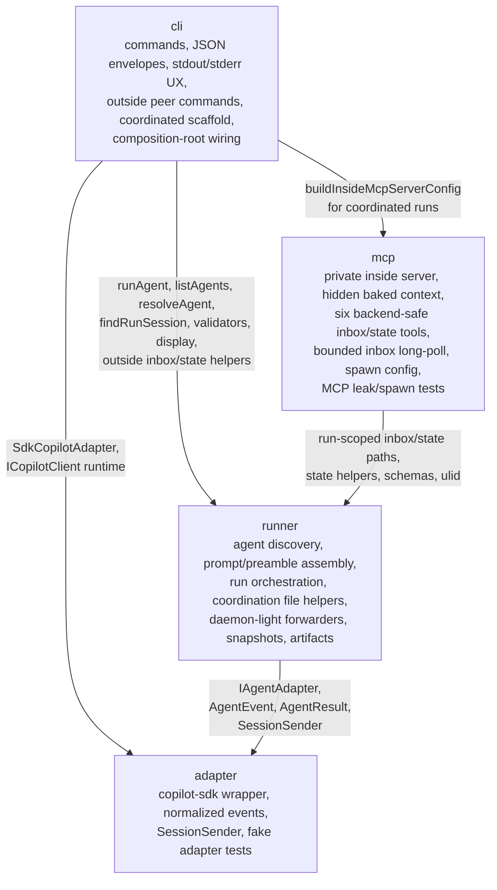

# Domain Map

- **cli** depends on **runner** for agent discovery, execution, session lookup, validation, display, context detection, inbox/state path helpers, state persistence helpers, ULIDs, typed runner errors, and outside peer command implementation.
- **cli** depends on **mcp** only as the composition root for coordinated inside-server spawn config (`buildInsideMcpServerConfig`). The user-facing outside commands remain CLI/runner file operations, not direct MCP tool calls.
- **cli** depends on **adapter** to instantiate `SdkCopilotAdapter` and the SDK runtime client.
- **mcp** depends on **runner** for run-scoped coordination paths, state helpers, schemas, shared coordination types, and ULID generation. MCP never calls CLI.
- **runner** depends on **adapter** contracts (`IAgentAdapter`, `AgentEvent`, `AgentResult`, `SessionSender`) and remains SDK- and MCP-independent.
- **adapter** has no internal domain dependencies; its only external implementation dependency is `@github/copilot-sdk`.

Import direction: `cli → {mcp, runner, adapter}`, `mcp → runner`, `runner → adapter`. No upward imports; runner does not import mcp.

## Health Summary

| Domain | Exposes | Depends On | Boundary Status |
|--------|---------|------------|-----------------|
| cli | User commands, coordinated scaffold, outside peer commands, SDK/MCP composition wiring | runner, mcp, adapter | Healthy: top-level composition root only |
| runner | Agent definitions, orchestration, prompt builder, coordination files, forwarders, snapshots, artifacts | adapter | Healthy: no CLI/MCP imports |
| mcp | Private inside server config, six backend-safe inbox/state tools, bounded `inbox_list.waitMs` long-poll | runner | Healthy: inside-only, no public server command |
| adapter | SDK session/event abstraction and `SessionSender` | External SDK only | Healthy: no runner/CLI/MCP imports |
