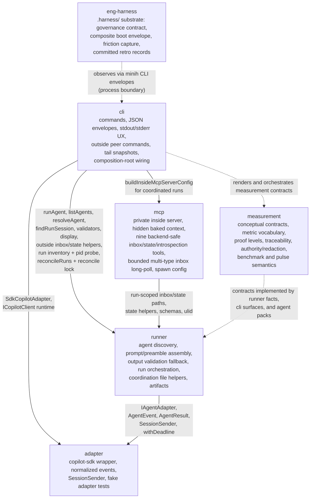

# Domain Map

- **cli** depends on **runner** for agent discovery, execution, session lookup, validation, display, context detection, inbox/state path helpers, state persistence helpers, ULIDs, typed runner errors, outside peer command implementation, and — since plan 025 — the pid-liveness probe, run inventory rows, and the reconcile healer + lock (`reconcileRuns`, `withReconcileLock`, `ReconcileLockHeldError`).
- **cli** depends on **mcp** only as the composition root for coordinated inside-server spawn config (`buildInsideMcpServerConfig`). The user-facing outside commands remain CLI/runner file operations, not direct MCP tool calls.
- **cli** depends on **adapter** to instantiate `SdkCopilotAdapter` and the SDK runtime client.
- **mcp** depends on **runner** for run-scoped coordination paths, state helpers, schemas, shared coordination types, and ULID generation. MCP never calls CLI.
- **runner** depends on **adapter** contracts (`IAgentAdapter`, `AgentEvent`, `AgentResult`, `SessionSender`, and `withDeadline` for bounding cleanup awaits — plan 026) and remains SDK- and MCP-independent.
- **adapter** has no internal domain dependencies; its only external implementation dependency is `@github/copilot-sdk`.
- **measurement** is a conceptual contract domain, not a runtime import layer. Its contracts are implemented by owning domains: runner owns deterministic facts, CLI owns user surfaces, agents/companions provide cited interpretation, and human pulse remains aggregate human-provided evidence.
- **eng-harness** is the session-level dev-loop harness (`.harness/` substrate on the global harness-core CLI). Its single dashed edge is conceptual, not an import: boot shells `minih doctor` and harvest reads `minih retros` envelopes **at the process boundary**. Zero inbound edges — no minih domain may depend on it; minih builds and ships identically with `.harness/` deleted.

Import direction: `cli → {mcp, runner, adapter}`, `mcp → runner`, `runner → adapter`, and `eng-harness → cli` (process boundary, never imports). No upward imports; runner does not import mcp.

## Health Summary

| Domain | Exposes | Depends On | Boundary Status |
|--------|---------|------------|-----------------|
| cli | User commands, coordinated scaffold, outside peer commands, `tail --snapshot`, SDK/MCP composition wiring, measurement UX | runner, mcp, adapter, measurement contracts | Healthy: top-level composition root only |
| runner | Agent definitions, orchestration, prompt builder, output-path validation fallback, coordination files, forwarders, snapshots, artifacts, measurement facts | adapter, measurement contracts | Healthy: no CLI/MCP imports |
| mcp | Private inside server config, nine backend-safe inbox/state/introspection tools (incl. `permission_status`, `coordination_status`), bounded `inbox_list.waitMs`/`waitForAny` long-poll | runner | Healthy: inside-only, no public server command |
| adapter | SDK session/event abstraction and `SessionSender` | External SDK only | Healthy: no runner/CLI/MCP imports |
| measurement | Vocabulary, traceability, proof levels, scorecard categories, authority/redaction rules, benchmark semantics, pulse semantics | none at runtime | Healthy: conceptual contract domain only |
| eng-harness | Boot envelope (`harness boot --json`), committed records (`.harness/records/`), governance contract | cli envelopes at the process boundary (never imports) | Healthy: zero inbound edges by rule |
