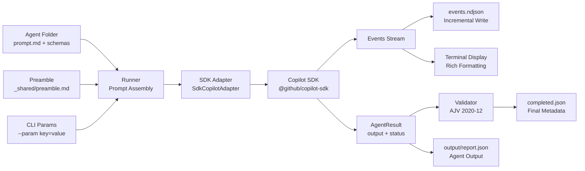

# Research Report: Miniharness (minih) — Extracting the Agent Runner from Chainglass Harness

**Generated**: 2026-04-02T01:42:00.000Z
**Research Query**: "Identify where our harness agent concept lives (smoke-test, code-review, mobile-ux-audit) and map the full extraction surface for a standalone NPM package called miniharness (minih)"
**Mode**: Pre-Plan (new repo at `/Users/jordanknight/substrate/minih`)
**Source Repo**: `/Users/jordanknight/substrate/074-actaul-real-agents` (Chainglass)
**FlowSpace**: Available (used for source repo exploration)
**Findings**: 62 findings across 8 research dimensions

---

## Executive Summary

### What It Does

The Chainglass harness contains a **declarative agent runner** that executes AI agents defined as folder conventions (prompt.md + optional schemas + instructions). It wraps `@github/copilot-sdk` exclusively, assembles prompts from composable parts (global preamble + instructions + output hint + params + task prompt), streams events to NDJSON logs, validates outputs against JSON Schema (2020-12 via AJV), and produces timestamped run artifacts with frozen copies of inputs for reproducibility.

### Business Purpose

The agent runner turns "prompt engineering" into a repeatable, validatable, observable process. Instead of ad-hoc LLM calls, agents are defined declaratively and run with full audit trails. This enables dogfooding — agents use the product, report structured feedback, and their retrospectives become real fix tasks.

### Key Insights

1. **Clean extraction boundary**: The runner (`harness/src/agent/`, 5 files) has ZERO imports from harness-specific infrastructure (no Docker, CDP, health probes, seeds). It only imports from `@chainglass/shared` for the adapter interface.
2. **The SDK adapter lives in shared, not harness**: `SdkCopilotAdapter` and all agent types (`IAgentAdapter`, `AgentEvent`, `AgentResult`) are in `packages/shared/`, making them independently extractable.
3. **Three mature agent definitions** exist as reference implementations: `smoke-test`, `code-review`, `mobile-ux-audit` — each demonstrates different patterns (no-input vs input-schema, different output shapes, domain-specific instructions).

### Quick Stats

- **Runner Core**: 5 files, ~750 LOC (`runner.ts`, `folder.ts`, `validator.ts`, `display.ts`, `types.ts`)
- **CLI Command**: 1 file, ~460 LOC (`agent.ts` — run/list/history/validate/last-run/tail)
- **SDK Adapter**: 1 file, ~530 LOC (`sdk-copilot-adapter.ts`)
- **Shared Types**: 2 files, ~240 LOC (`agent-types.ts`, `agent-adapter.interface.ts`)
- **Agent Definitions**: 3 agents (smoke-test, code-review, mobile-ux-audit)
- **Test Coverage**: Unit tests exist in `harness/tests/unit/agent/` and `harness/tests/unit/cli/`
- **Prior Learnings**: 0 prior plans in minih repo (greenfield)

---

## How It Currently Works

### Entry Points

| Entry Point | Type | Location | Purpose |
|-------------|------|----------|---------|
| `just harness agent run <slug>` | CLI | `harness/src/cli/commands/agent.ts:43-173` | Execute an agent |
| `just harness agent list` | CLI | `harness/src/cli/commands/agent.ts:176-192` | List available agents |
| `just harness agent history <slug>` | CLI | `harness/src/cli/commands/agent.ts:195-231` | View past runs |
| `just harness agent validate <slug>` | CLI | `harness/src/cli/commands/agent.ts:234-289` | Re-validate latest output |
| `just harness agent last-run <slug>` | CLI | `harness/src/cli/commands/agent.ts:292-342` | Get latest run info |
| `just harness agent tail <slug>` | CLI | `harness/src/cli/commands/agent.ts:345-457` | Live-follow event stream |

### Core Execution Flow

```
CLI (agent.ts)                    Runner (runner.ts)                 Adapter (sdk-copilot-adapter.ts)
─────────────                     ──────────────────                 ───────────────────────────────
1. Validate slug                  
2. Check GH_TOKEN                 
3. resolveAgent(slug)             
4. Parse --param key=value        
5. Build AgentRunConfig           
6. Import @github/copilot-sdk     
7. Create CopilotClient           
8. Create SdkCopilotAdapter       
9. ──── runAgent(adapter, def, config) ────►
                                  10. createRunFolder(def)
                                      → timestamp dir
                                      → freeze prompt.md, schemas, instructions
                                  11. Read prompt.md
                                  12. Read instructions.md (optional)
                                  13. Read preamble.md (global)
                                      → replace {{REPO_ROOT}}
                                  14. Validate input params (if input-schema.json)
                                  15. Assemble fullPrompt:
                                      [preamble + instructions + outputHint + params + prompt]
                                      joined by "\n\n---\n\n"
                                  16. ──── adapter.run({prompt, model, ...}) ────►
                                                                      17. createSession({streaming, model, reasoningEffort})
                                                                      18. session.on(event => translate → emit)
                                                                      19. session.sendAndWait({prompt}, timeout)
                                                                      20. Return AgentResult
                                  ◄──── AgentResult ────
                                  21. Write output/report.json (fallback)
                                  22. Write stderr.log (if errors)
                                  23. Validate output against schema
                                  24. Determine final status:
                                      completed | failed | timeout | degraded
                                  25. Write completed.json
                                  26. Return AgentRunResult
◄──── AgentRunResult ────
27. Display summary (stderr)
28. client.stop()
29. Emit JSON envelope (stdout)
```

### Prompt Assembly Detail

The full prompt is built by concatenating these parts with `\n\n---\n\n`:

```
┌─────────────────────────────────────────────┐
│ 1. PREAMBLE (agents/_shared/preamble.md)    │  ← Global, injected for ALL agents
│    - Orientation, env gotchas, output rules  │
│    - {{REPO_ROOT}} placeholder replaced      │
├─────────────────────────────────────────────┤
│ 2. INSTRUCTIONS (instructions.md)            │  ← Per-agent identity & rules
│    - Agent-specific behavioral rules         │
├─────────────────────────────────────────────┤
│ 3. OUTPUT HINT                               │  ← Auto-generated
│    "Write your final JSON report to: <path>" │
├─────────────────────────────────────────────┤
│ 4. INPUT PARAMS (from --param flags)         │  ← Only if input-schema exists
│    ## Input Parameters                       │
│    file_path: /some/path                     │
├─────────────────────────────────────────────┤
│ 5. PROMPT (prompt.md)                        │  ← The actual task definition
│    - Objective, tasks, output instructions   │
└─────────────────────────────────────────────┘
```

### Data Flow



### State Management

- **No persistent state** — each run is independent (no session resumption across runs)
- **Run isolation** via timestamped folders with frozen input copies
- **Events streamed incrementally** to `events.ndjson` (append-only during run)
- **Completed metadata** written atomically at end of run

---

## Architecture & Design

### Component Map

#### Core Components (5 files — the extraction target)

| Component | File | LOC | Responsibility |
|-----------|------|-----|----------------|
| **Runner** | `harness/src/agent/runner.ts` | 283 | Orchestrates prompt assembly, adapter invocation, event handling, output validation, artifact writing |
| **Folder Manager** | `harness/src/agent/folder.ts` | 144 | Agent discovery, slug validation, run folder creation, input freezing |
| **Validator** | `harness/src/agent/validator.ts` | 128 | AJV 2020-12 schema validation for both inputs and outputs |
| **Display** | `harness/src/agent/display.ts` | 109 | Rich terminal output — header box, event formatting, completion summary |
| **Types** | `harness/src/agent/types.ts` | 102 | `AgentDefinition`, `AgentRunConfig`, `CompletedMetadata`, `AgentRunResult`, `ValidationResult` |

#### SDK Integration (in `packages/shared/` — needs extraction)

| Component | File | LOC | Responsibility |
|-----------|------|-----|----------------|
| **SdkCopilotAdapter** | `packages/shared/src/adapters/sdk-copilot-adapter.ts` | 530 | Wraps `@github/copilot-sdk`, translates events, handles sessions |
| **IAgentAdapter** | `packages/shared/src/interfaces/agent-adapter.interface.ts` | 51 | Interface: `run()`, `compact()`, `terminate()` |
| **Agent Types** | `packages/shared/src/interfaces/agent-types.ts` | 243 | `AgentEvent` discriminated union, `AgentResult`, `AgentRunOptions`, `TokenMetrics` |

#### CLI Layer (needs adaptation for `minih` CLI)

| Component | File | LOC | Responsibility |
|-----------|------|-----|----------------|
| **Agent Commands** | `harness/src/cli/commands/agent.ts` | 461 | `run`, `list`, `history`, `validate`, `last-run`, `tail` — composition root for SDK |
| **Output Formatter** | `harness/src/cli/output.ts` | ~80 | JSON envelope format: `{command, status, data?, error?}` |

### Design Patterns Identified

1. **Adapter Pattern** (`IAgentAdapter` → `SdkCopilotAdapter`): Decouples runner from SDK. Tests use `FakeAgentAdapter`.
2. **Composition Root** (`agent.ts` CLI command): Only file that imports `@github/copilot-sdk`. Dynamic import to avoid loading SDK for non-run commands.
3. **Folder Convention**: An agent IS a folder. Discovery = scan for `prompt.md`. No registration needed.
4. **Frozen Inputs**: Every run copies its inputs into the run folder. You can always reproduce what was sent.
5. **NDJSON Event Stream**: Incremental append during execution. Enables `tail -f` style following.
6. **Discriminated Union Events**: `AgentEvent.type` enables type-safe `switch` handling across 10+ event types.
7. **Result/Degraded Pattern**: Invalid output doesn't mean failure — `degraded` status means "agent worked, but output didn't match schema."

### System Boundaries

- **Internal**: Runner ↔ Adapter ↔ CLI — clean interfaces, minimal coupling
- **External**: Only `@github/copilot-sdk` as LLM backend
- **No tool registration**: Agents get SDK default tools, all auto-approved via `onPermissionRequest: approveAll`

---

## Dependencies & Integration

### What the Runner Core Depends On

#### Internal Dependencies

| Dependency | Type | Purpose | Extractable? |
|------------|------|---------|-------------|
| `IAgentAdapter` | Interface | Adapter contract | ✅ Copy interface |
| `AgentEvent` | Type | Event discriminated union | ✅ Copy types |
| `AgentResult` | Type | Run result structure | ✅ Copy types |
| `SdkCopilotAdapter` | Class | SDK wrapper | ✅ Copy class |

#### External Dependencies

| Dependency | Version | Purpose | Criticality |
|------------|---------|---------|-------------|
| `@github/copilot-sdk` | Dynamic import | LLM execution | **Critical** — sole backend |
| `ajv` | ^8.17.1 | JSON Schema validation | **High** — input/output validation |
| `commander` | ^13.1.0 | CLI framework | **High** — CLI commands |
| `node:fs` | Built-in | File operations | **Required** |
| `node:path` | Built-in | Path operations | **Required** |
| `node:crypto` | Built-in | Random suffix for run IDs | **Required** |

### What Would NOT Be Extracted

| Chainglass-Specific | Why It Stays |
|---------------------|-------------|
| Preamble **content** | Harness-specific orientation, just commands, gotchas |
| Docker/CDP/Playwright | Test infrastructure |
| Health/Doctor probes | Harness container diagnostics |
| Screenshots/Viewports | Browser automation |
| Seed/Test-data | Workspace seeding |
| `@chainglass/shared` dependency | Would inline the needed types |
| `@chainglass/positional-graph` | Workflow engine, unrelated |
| Domain compliance | Business-domain system |

---

## Agent Definition Convention (The Folder Protocol)

### Structure

```
agents/<slug>/
  prompt.md           ← REQUIRED — task instructions for the agent
  output-schema.json  ← OPTIONAL — JSON Schema 2020-12 for output validation
  input-schema.json   ← OPTIONAL — JSON Schema 2020-12 for --param validation
  instructions.md     ← OPTIONAL — agent identity, behavioral rules
  runs/               ← AUTO-CREATED — one subfolder per execution
```

### Three Reference Implementations

| Agent | Has Input Schema | Has Output Schema | Has Instructions | Key Pattern |
|-------|-----------------|-------------------|-----------------|-------------|
| `smoke-test` | ❌ | ✅ | ✅ | No params, produces health report + retrospective |
| `code-review` | ✅ (`file_path` required) | ✅ | ✅ | Takes input param, produces findings with verdict |
| `mobile-ux-audit` | ❌ | ✅ | ✅ | No params, captures screenshots + UX assessment |

### Global Preamble (`_shared/preamble.md`)

Injected into EVERY agent run. Contains:
- Orientation (pwd, key paths, repo root)
- Environment gotchas table (git pager, gh auth, networkidle, Playwright)
- Output discipline rules (write to hint path, don't modify source)
- Harness CLI quick reference
- CDP access instructions
- Error handling rules
- **Retrospective requirement** — every agent MUST include `magicWand` feedback

The `{{REPO_ROOT}}` placeholder is replaced at runtime with the actual repo root.

### Run Artifacts (per execution)

```
agents/<slug>/runs/2026-03-12T10-46-32-268Z-193a/
  prompt.md             ← frozen copy of what was sent
  instructions.md       ← frozen copy (if existed)
  output-schema.json    ← frozen copy (if existed)
  input-schema.json     ← frozen copy (if existed)
  events.ndjson         ← incremental event stream (NDJSON)
  stderr.log            ← error output (if any)
  completed.json        ← metadata: slug, runId, timestamps, duration, result, validation, artifacts
  output/
    report.json         ← agent's structured output
```

### CompletedMetadata Shape

```typescript
interface CompletedMetadata {
  slug: string;                    // Agent slug
  runId: string;                   // Timestamp + random suffix
  startedAt: string;               // ISO-8601
  completedAt: string;             // ISO-8601
  durationMs: number;
  sessionId: string;               // Copilot session ID
  result: 'completed' | 'failed' | 'timeout' | 'degraded';
  exitCode: number;
  validated: boolean | null;       // null = no schema
  validationErrors: string[];
  eventCount: number;
  toolCallCount: number;
  artifacts: string[];             // All files in run dir
}
```

---

## SDK Integration Layer

### SdkCopilotAdapter

The adapter is the **only code that touches `@github/copilot-sdk`**. It:

1. Creates/resumes sessions with model selection and reasoning effort
2. Auto-approves all permission requests (agents are yolo)
3. Translates SDK events to unified `AgentEvent` discriminated union:
   - `assistant.message_delta` → `text_delta`
   - `assistant.message` → `message`
   - `tool.execution_start` → `tool_call`
   - `tool.execution_complete` → `tool_result`
   - `assistant.reasoning` / `assistant.reasoning_delta` → `thinking`
   - `assistant.usage` → `usage`
   - `session.idle` → `session_idle`
   - Unhandled → `raw`
4. Suppresses duplicate consolidated events (SDK emits deltas then full content)
5. Validates prompts (length, control chars, empty check)
6. Handles `compact()` and `terminate()` for session management

### IAgentAdapter Interface

```typescript
interface IAgentAdapter {
  run(options: AgentRunOptions): Promise<AgentResult>;
  compact(sessionId: string): Promise<AgentResult>;
  terminate(sessionId: string): Promise<AgentResult>;
}
```

### AgentEvent Union (10 types)

`text_delta` | `message` | `usage` | `session_start` | `session_idle` | `session_error` | `tool_call` | `tool_result` | `thinking` | `raw` | `user_prompt`

---

## Quality & Testing

### Current Test Coverage

- **Unit tests**: `harness/tests/unit/agent/*.test.ts` — folder discovery, slug validation, validator
- **CLI tests**: `harness/tests/unit/cli/*.test.ts` — command registration, output format
- **Integration tests**: `harness/tests/integration/cli/*.test.ts`
- **FakeAgentAdapter**: `packages/shared/src/fakes/fake-agent-adapter.ts` — test double

### Known Issues & Technical Debt

| Issue | Severity | Location | Impact |
|-------|----------|----------|--------|
| No `minih init` scaffolding command | Medium | CLI | Users must manually create folders |
| Preamble is hardcoded path | Low | `runner.ts:28-33` | Must be configurable for minih |
| Run history stored inside agent folder | Low | `folder.ts:124` | Can grow large, no cleanup |
| No `--dry-run` option | Low | CLI | Can't preview assembled prompt |
| Events.ndjson has no size limit | Low | `runner.ts:156` | Could grow unbounded for long runs |

---

## Modification Considerations for Extraction

### ✅ Safe to Extract Directly

1. **`runner.ts`** — Zero harness-specific imports. Only needs `IAgentAdapter`, `AgentEvent`, `AgentResult` types inlined.
2. **`folder.ts`** — Pure filesystem operations. `resolveHarnessRoot()` becomes `resolveMinihRoot()` or configurable.
3. **`validator.ts`** — Standalone AJV validation. No external dependencies beyond `ajv`.
4. **`display.ts`** — Pure terminal formatting. No dependencies beyond types.
5. **`types.ts`** — Pure type definitions.

### ⚠️ Needs Adaptation

1. **`agent.ts` CLI** — Currently the composition root importing from `@chainglass/shared`. Must inline adapter types and restructure for `minih` CLI namespace.
2. **`SdkCopilotAdapter`** — Currently in `packages/shared/`. Must be copied into minih with its event translation logic.
3. **Preamble path** — Currently hardcoded to `agents/_shared/preamble.md`. Make configurable, or adopt `<agents-root>/_shared/preamble.md` convention.
4. **Output envelope format** — Currently uses harness-specific `HarnessEnvelope`. Simplify for minih.

### 🚫 Must NOT Extract

1. **Chainglass preamble content** — Domain-specific to the harness product
2. **Any `@chainglass/*` package dependencies** — Types must be inlined
3. **Docker/CDP/health infrastructure** — Harness-only concerns

### New Capabilities for Minih

| Feature | Why Needed |
|---------|-----------|
| `minih init <slug>` | Scaffold a new agent folder with prompt.md template |
| `minih config` | Project-level config (agents dir, preamble path, default model) |
| Configurable agents directory | Not everyone will use `agents/` |
| Optional global preamble | The `_shared/preamble.md` slot should be opt-in |
| `minih run --dry-run` | Preview assembled prompt without executing |

---

## Domain Context

### Source Repo Domain System

The Chainglass source repo has a formalized domain system at `docs/domains/`. The agent runner relates to:

- **No dedicated domain** for the agent runner itself — it's part of the harness infrastructure
- Consumes `IAgentAdapter` from the shared package (infrastructure domain)
- The `SdkCopilotAdapter` sits in `packages/shared/src/adapters/`

### Minih Domain Position

Miniharness would be a **standalone package** with no domain system. It exports:
- CLI binary (`minih`)
- Programmatic API (runner, validator, folder management)
- Type definitions for agent definitions and run results

---

## Critical Discoveries

### 🚨 Critical Finding 01: SDK Is the Only LLM Backend
**Impact**: Critical
**What**: The entire system wraps `@github/copilot-sdk` exclusively. No Anthropic, OpenAI, or other SDK support.
**Why It Matters**: Minih will initially be copilot-sdk-only. The adapter pattern enables future backends, but V1 ships with copilot only.

### 🚨 Critical Finding 02: No Explicit Tool Registration
**Impact**: High
**What**: Agents get SDK default tools. The harness does NOT configure `availableTools` or `excludedTools`. Auto-approve all permissions.
**Why It Matters**: Minih agents are "yolo" by design — full tool access, no safety gates. This is intentional (per user: "Agents are yolo always and can perform all actions").

### 🚨 Critical Finding 03: The Adapter Lives in Shared, Not Harness
**Impact**: High
**What**: `SdkCopilotAdapter`, `IAgentAdapter`, `AgentEvent`, `AgentResult` are in `packages/shared/`, not `harness/`. The harness runner imports them.
**Why It Matters**: Extraction must pull from TWO source locations: `harness/src/agent/` (5 files) + `packages/shared/src/adapters/` + `packages/shared/src/interfaces/`.

### 🚨 Critical Finding 04: Dynamic SDK Import Pattern
**Impact**: Medium
**What**: `agent.ts:120` uses `await import('@github/copilot-sdk')` — dynamic import to avoid loading SDK for non-run commands (list, history, validate).
**Why It Matters**: This is a good pattern to preserve in minih. SDK should only load when actually running an agent.

### 🚨 Critical Finding 05: Run Folders Live Inside Agent Definitions
**Impact**: Medium
**What**: Runs are stored at `agents/<slug>/runs/<timestamp>/`. No separate runs directory.
**Why It Matters**: For minih, consider whether runs should be co-located (current) or separate (e.g., `.minih/runs/<slug>/<timestamp>/`). Co-location keeps everything in one place; separation keeps agent definitions clean.

---

## Proposed Minih Package Structure

```
minih/
  package.json          ← @miniharness/cli or just "minih"
  tsconfig.json
  src/
    cli/
      index.ts          ← Entry point: minih command
      commands/
        init.ts         ← minih init <slug> — scaffold new agent
        run.ts          ← minih run <slug> — execute agent (composition root)
        list.ts         ← minih list — show available agents
        history.ts      ← minih history <slug> — past runs
        validate.ts     ← minih validate <slug> — re-validate latest
        tail.ts         ← minih tail <slug> — follow events
      output.ts         ← JSON envelope formatting
    runner/
      runner.ts         ← Core orchestration (from harness runner.ts)
      folder.ts         ← Agent discovery, run folders (from harness folder.ts)
      validator.ts      ← AJV validation (from harness validator.ts)
      display.ts        ← Terminal output (from harness display.ts)
      types.ts          ← All type definitions (merged from harness + shared)
    adapter/
      interface.ts      ← IAgentAdapter (from shared)
      sdk-copilot.ts    ← SdkCopilotAdapter (from shared)
      events.ts         ← AgentEvent union, AgentResult (from shared)
      fake.ts           ← FakeAgentAdapter for testing
  agents/               ← Example agents (optional, for docs/testing)
    _shared/
      preamble.md       ← Template preamble (user customizes)
    hello-world/
      prompt.md         ← Minimal example
      output-schema.json
  docs/
    plans/
      001-setup/        ← This plan
  test/
    runner.test.ts
    folder.test.ts
    validator.test.ts
```

---

## CLI Design (Proposed)

```bash
# Scaffold
minih init <slug>                     # Create agents/<slug>/ with prompt.md template
minih init <slug> --with-input        # Also create input-schema.json
minih init <slug> --with-output       # Also create output-schema.json (default: yes)

# Execute
minih run <slug>                      # Run agent with defaults
minih run <slug> --model gpt-5.4     # Choose model
minih run <slug> --reasoning xhigh    # Set reasoning effort
minih run <slug> --timeout 600        # Custom timeout (seconds)
minih run <slug> --param key=value    # Pass input parameters
minih run <slug> --dry-run            # Preview assembled prompt (don't execute)

# Observe
minih tail <slug>                     # Follow latest run's event stream
minih tail <slug> --run <runId>       # Follow specific run

# Manage
minih list                            # Show available agents
minih history <slug>                  # Past runs with metadata
minih validate <slug>                 # Re-validate latest output
minih last-run <slug>                 # Latest run dir + report path

# Config (new for minih)
minih config                          # Show current config
minih config --agents-dir ./my-agents # Set agents directory
minih config --preamble ./system.md   # Set global preamble path
```

---

## External Research Opportunities

### Research Opportunity 1: Copilot SDK API Surface

**Why Needed**: The extraction depends on `@github/copilot-sdk` — need to understand its public API, versioning, peer dependency requirements.
**Impact on Plan**: Determines how minih declares its SDK dependency and what minimum version to support.
**Source Findings**: IA-01, DC-01

### Research Opportunity 2: NPM Package Structure Best Practices (2025+)

**Why Needed**: Minih should follow current best practices for TypeScript NPM packages — ESM/CJS dual export, bin entry, peer dependencies.
**Impact on Plan**: Package.json structure, build configuration, exports map.

---

## Appendix: Source File Inventory

### Core Files to Extract

| Source Location | Target Location | Lines | Action |
|-----------------|-----------------|-------|--------|
| `harness/src/agent/runner.ts` | `src/runner/runner.ts` | 283 | Copy + adapt (remove harness root resolution) |
| `harness/src/agent/folder.ts` | `src/runner/folder.ts` | 144 | Copy + adapt (configurable root) |
| `harness/src/agent/validator.ts` | `src/runner/validator.ts` | 128 | Copy as-is |
| `harness/src/agent/display.ts` | `src/runner/display.ts` | 109 | Copy as-is |
| `harness/src/agent/types.ts` | `src/runner/types.ts` | 102 | Copy + merge shared types |
| `harness/src/cli/commands/agent.ts` | `src/cli/commands/*.ts` | 461 | Split into individual command files |
| `harness/src/cli/output.ts` | `src/cli/output.ts` | ~80 | Copy + simplify envelope |
| `packages/shared/src/adapters/sdk-copilot-adapter.ts` | `src/adapter/sdk-copilot.ts` | 530 | Copy + inline interface imports |
| `packages/shared/src/interfaces/agent-adapter.interface.ts` | `src/adapter/interface.ts` | 51 | Copy as-is |
| `packages/shared/src/interfaces/agent-types.ts` | `src/adapter/events.ts` | 243 | Copy as-is |
| `packages/shared/src/fakes/fake-agent-adapter.ts` | `src/adapter/fake.ts` | ~50 | Copy for testing |

### Test Files to Reference

| Source Location | Notes |
|-----------------|-------|
| `harness/tests/unit/agent/*.test.ts` | Port to minih test structure |
| `harness/tests/unit/cli/*.test.ts` | Adapt for minih CLI commands |

---

## Next Steps

1. **Run `/plan-1b-specify`** to create the feature specification for minih V1
2. Consider **`/plan-2c-workshop`** for the CLI design (init scaffolding, config system)
3. **Skip external research** unless SDK API surface is unclear

---

**Research Complete**: 2026-04-02T01:42:00.000Z
**Report Location**: `/Users/jordanknight/substrate/minih/docs/plans/001-setup/research-dossier.md`
