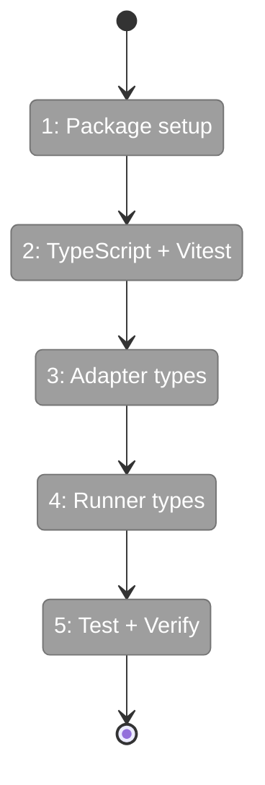
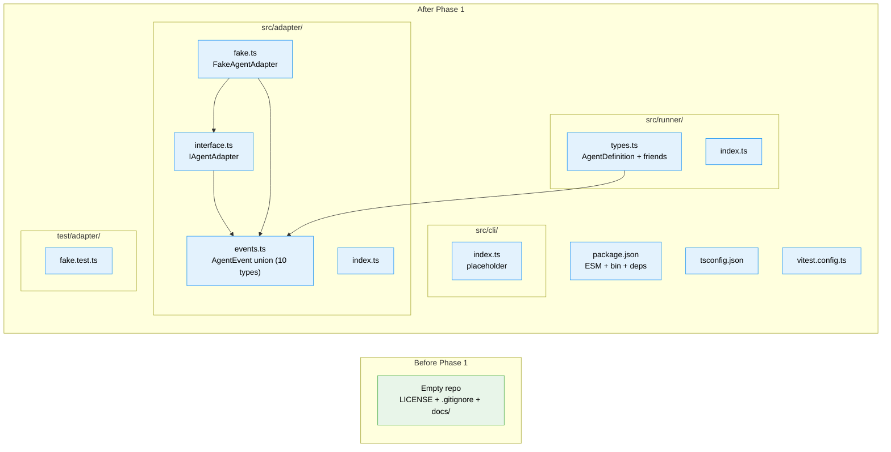

# Flight Plan: Phase 1 — Project Scaffold + Types

**Plan**: [miniharness-extraction-plan.md](../../miniharness-extraction-plan.md)
**Phase**: Phase 1: Project Scaffold + Types
**Generated**: 2026-04-02
**Status**: Landed ✈️

---

## Departure → Destination

**Where we are**: Empty repo — just `LICENSE`, `.gitignore`, and `docs/plans/`. No `package.json`, no `src/`, no build pipeline. Zero TypeScript files.

**Where we're going**: A compilable NPM package with all type definitions extracted, a working test runner, and the `FakeAgentAdapter` test double passing tests. A developer can run `npm run build` and get `dist/` with `.js` + `.d.ts` files. The foundation every subsequent phase builds on.

---

## Domain Context

### Domains We're Changing

| Domain | What Changes | Key Files |
|--------|-------------|-----------|
| adapter | Create from scratch — event types, adapter interface, fake test double | `src/adapter/events.ts`, `interface.ts`, `fake.ts`, `index.ts` |
| runner | Create from scratch — runner type definitions | `src/runner/types.ts`, `index.ts` |
| cli | Create placeholder entry point | `src/cli/index.ts` |

### Domains We Depend On (no changes)

| Domain | What We Consume | Contract |
|--------|----------------|----------|
| (none) | Phase 1 is foundational | — |

---

## Flight Status

**Legend**: grey = pending | yellow = active | red = blocked/needs input | green = done

---

## Stages

- [x] **Stage 1: Package setup** — Create `package.json` with bin entry, ESM config, dependencies (`T001`)
- [x] **Stage 2: Build pipeline** — Create `tsconfig.json` + `vitest.config.ts`, verify empty build works (`T002`, `T003`)
- [x] **Stage 3: Adapter types** — Extract `events.ts` (full AgentEvent union), `interface.ts` (IAgentAdapter), `fake.ts` (FakeAgentAdapter) (`T004`, `T005`, `T006`)
- [x] **Stage 4: Runner types + barrels** — Extract `types.ts` (AgentDefinition + frontmatter fields), create barrel exports, CLI placeholder (`T007`, `T008`, `T009`)
- [x] **Stage 5: Test + verify** — Write FakeAgentAdapter test, run build + test, verify zero @chainglass imports (`T010`, `T011`)

---

## Architecture: Before & After

**Legend**: existing (green, unchanged) | new (blue, created)

---

## Acceptance Criteria

- [x] `npm run build` succeeds with zero errors
- [x] `npm test` runs and passes (FakeAgentAdapter tests)
- [x] All types compile with no `@chainglass/*` imports
- [x] FakeAgentAdapter implements IAgentAdapter correctly
- [x] `dist/cli/index.js` has `#!/usr/bin/env node` shebang
- [x] `package.json` has `"bin": {"minih": "./dist/cli/index.js"}`

## Goals & Non-Goals

**Goals**: Package foundation, all type definitions, build pipeline, test infrastructure, FakeAgentAdapter
**Non-Goals**: No runtime logic, no CLI commands, no SDK adapter, no runner

---

## Checklist

- [x] T001: Create package.json with ESM, bin, dependencies
- [x] T002: Create tsconfig.json matching source config
- [x] T003: Create vitest.config.ts
- [x] T004: Create src/adapter/events.ts (full AgentEvent union, drop zod)
- [x] T005: Create src/adapter/interface.ts (IAgentAdapter)
- [x] T006: Create src/adapter/fake.ts (FakeAgentAdapter with helpers)
- [x] T007: Create src/runner/types.ts (AgentDefinition + frontmatter fields)
- [x] T008: Create barrel exports (adapter/index.ts, runner/index.ts)
- [x] T009: Create CLI placeholder (src/cli/index.ts with shebang)
- [x] T010: Write FakeAgentAdapter test
- [x] T011: Verify build + test passes, zero @chainglass imports
