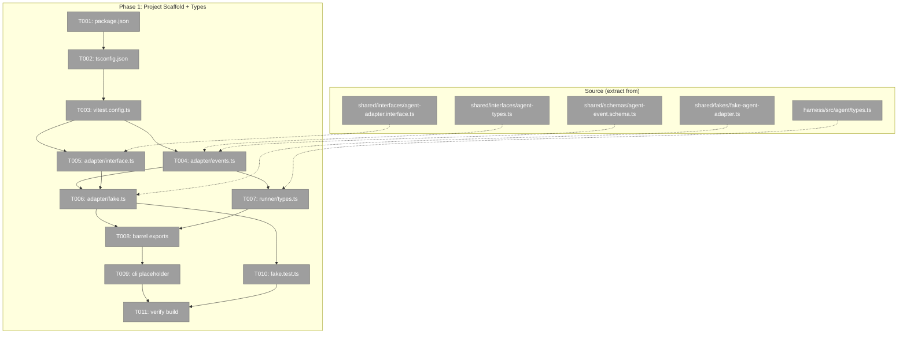
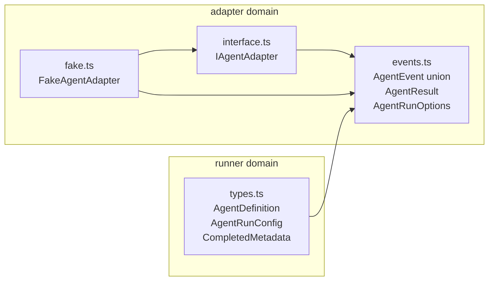

# Phase 1: Project Scaffold + Types — Tasks

**Plan**: [miniharness-extraction-plan.md](../../miniharness-extraction-plan.md)
**Phase**: Phase 1: Project Scaffold + Types
**Generated**: 2026-04-02
**Status**: Ready for implementation

---

## Executive Briefing

**Purpose**: Set up the minih package from scratch — build pipeline, all type definitions, adapter interface, and test infrastructure — so every subsequent phase has a compilable foundation to build on.

**What We're Building**: A greenfield NPM package with ESM module system, TypeScript strict mode, Vitest test runner, and all type definitions extracted from the Chainglass source. This includes the `AgentEvent` discriminated union (10 event types), `IAgentAdapter` interface, `FakeAgentAdapter` test double, and all runner types (`AgentDefinition`, `AgentRunConfig`, `CompletedMetadata`, etc.).

**Goals**:
- ✅ `npm run build` produces `dist/` with `.js` + `.d.ts` files
- ✅ `npm test` runs and passes (FakeAgentAdapter test)
- ✅ All types compile with zero `@chainglass/*` imports
- ✅ Package.json configured for `npx minih` (bin entry)
- ✅ All 3 domain source trees created (`src/adapter/`, `src/runner/`, `src/cli/`)

**Non-Goals**:
- ❌ No runtime code beyond types and FakeAgentAdapter
- ❌ No CLI entry point yet (that's Phase 4)
- ❌ No SDK adapter implementation (that's Phase 3)
- ❌ No runner logic (that's Phase 2)

---

## Pre-Implementation Check

| File | Exists? | Domain | Notes |
|------|---------|--------|-------|
| `package.json` | ❌ create | — | Greenfield. Must have bin entry, ESM, engines. |
| `tsconfig.json` | ❌ create | — | Match source: ES2022, ESNext, bundler, strict |
| `vitest.config.ts` | ❌ create | — | New test runner setup |
| `src/adapter/events.ts` | ❌ create | adapter | Extract from shared agent-types.ts + agent-event.schema.ts. Drop zod — inline as plain TS types. |
| `src/adapter/interface.ts` | ❌ create | adapter | Extract from shared agent-adapter.interface.ts |
| `src/adapter/fake.ts` | ❌ create | adapter | Extract from shared fakes/fake-agent-adapter.ts |
| `src/adapter/index.ts` | ❌ create | adapter | Barrel export |
| `src/runner/types.ts` | ❌ create | runner | Extract from harness agent/types.ts. Add description + tags to AgentDefinition. Remove HarnessEnvelope import. |
| `src/runner/index.ts` | ❌ create | runner | Barrel export |
| `src/cli/index.ts` | ❌ create | cli | Placeholder entry point (shebang + "not yet implemented") |
| `test/adapter/fake.test.ts` | ❌ create | adapter | First test — verify FakeAgentAdapter contract |

All files are new creations. No duplication risk (repo is empty).

---

## Architecture Map



---

## Tasks

| Status | ID | Task | Domain | Path(s) | Done When | Notes |
|--------|-----|------|--------|---------|-----------|-------|
| [x] | T001 | Create package.json | — | `package.json` | ✅ ESM, bin, deps, engines | |
| [x] | T002 | Create tsconfig.json | — | `tsconfig.json` | ✅ ES2022, bundler, strict | rootDir=src |
| [x] | T003 | Create vitest.config.ts | — | `vitest.config.ts` | ✅ vitest runs | |
| [x] | T004 | Create src/adapter/events.ts | adapter | `src/adapter/events.ts` | ✅ 10 event types, no zod | Merged 2 files |
| [x] | T005 | Create src/adapter/interface.ts | adapter | `src/adapter/interface.ts` | ✅ IAgentAdapter | |
| [x] | T006 | Create src/adapter/fake.ts | adapter | `src/adapter/fake.ts` | ✅ Full test double | |
| [x] | T007 | Create src/runner/types.ts | runner | `src/runner/types.ts` | ✅ description+tags | |
| [x] | T008 | Create barrel exports | adapter, runner | `src/*/index.ts` | ✅ All exports | |
| [x] | T009 | Create CLI placeholder | cli | `src/cli/index.ts` | ✅ Shebang | |
| [x] | T010 | Write FakeAgentAdapter test | adapter | `test/adapter/fake.test.ts` | ✅ 16 tests pass | |
| [x] | T011 | Verify build + test | — | — | ✅ build + 16/16 | |

---

## Context Brief

**Key findings from plan**:
- Finding 01: SDK lazy-loaded via dynamic import — CLI placeholder just needs shebang, real composition root in Phase 4
- Finding 02: AgentEvent union has 10+ subtypes — must expand ALL of them (text_delta, message, usage, session_start/idle/error, raw, tool_call, tool_result, thinking, user_prompt)
- Finding 03: ESM-only, Node >=20.19.0, TypeScript 5.7.3 strict — mirror exact config
- Finding 05: Source uses zod for event schemas — minih drops zod, uses plain TS interfaces
- Finding 06: Vitest test runner — set up from T003
- Finding 07: FakeAgentAdapter exists in source — extract as test double

**Domain dependencies**:
- None (Phase 1 is foundational — no prior domains exist)

**Domain constraints**:
- `adapter` exports types and interfaces that `runner` consumes (AgentEvent, AgentResult, IAgentAdapter)
- `runner` types import from `adapter` (AgentResult in AgentRunResult)
- `cli` depends on both but only gets a placeholder in this phase
- Import direction: `cli → runner → adapter` (adapter at the bottom, no upward imports)

**No agent harness** — implementation will use standard `npm run build && npm test`.

**Source file mapping** (what to extract from where):

| Minih Target | Source File | LOC | Adaptation Needed |
|-------------|------------|-----|-------------------|
| `src/adapter/events.ts` | `packages/shared/src/interfaces/agent-types.ts` + `packages/shared/src/schemas/agent-event.schema.ts` | ~243 + ~150 | Drop zod schemas, keep only TS interfaces. Inline CopilotReasoningEffort as ReasoningEffort. Merge tool/thinking event types from schema file into single events.ts. |
| `src/adapter/interface.ts` | `packages/shared/src/interfaces/agent-adapter.interface.ts` | 51 | Change import path to local ./events.ts. Remove Chainglass AC-reference comments. |
| `src/adapter/fake.ts` | `packages/shared/src/fakes/fake-agent-adapter.ts` | 323 | Change import paths to local ./events.ts and ./interface.ts. Keep all helper methods. |
| `src/runner/types.ts` | `harness/src/agent/types.ts` | 102 | Remove HarnessEnvelope import. Add `description: string` and `tags: string[]` to AgentDefinition. Change AgentResult import to local adapter path. |

**Key type relationships**:



**Dependency versions** (from source package.json):

```
ajv:                  ^8.17.1
commander:            ^13.1.0
@github/copilot-sdk:  ^0.1.32  (peerDependency)
typescript:           ^5.7.3
vitest:               ^3.2.4
@types/node:          ^22.15.0
tsx:                   ^4.19.0
Node.js:              >=20.19.0
```

---

## Discoveries & Learnings

| Date | Task | Type | Discovery | Resolution | References |
|------|------|------|-----------|------------|------------|
| 2026-04-02 | T002 | Gotcha | Source harness uses `rootDir: "."` which puts output in `dist/src/`. This breaks the bin entry path `dist/cli/index.js`. | Set `rootDir: "src"` instead so dist layout matches package.json bin path. | tsconfig.json |

---

## Directory Layout

```
docs/plans/001-setup/
  ├── miniharness-extraction-spec.md
  ├── miniharness-extraction-plan.md
  ├── research-dossier.md
  ├── handover.md
  ├── workshops/
  │   ├── 001-magic-wand-feedback-loop.md
  │   ├── 002-cli-command-design.md
  │   ├── 003-agent-folder-convention.md
  │   └── 004-dogfooding-and-exemplar-agents.md
  └── tasks/phase-1-project-scaffold-types/
      ├── tasks.md                    ← this file
      ├── tasks.fltplan.md            ← flight plan (below)
      └── execution.log.md           ← created by plan-6
```
