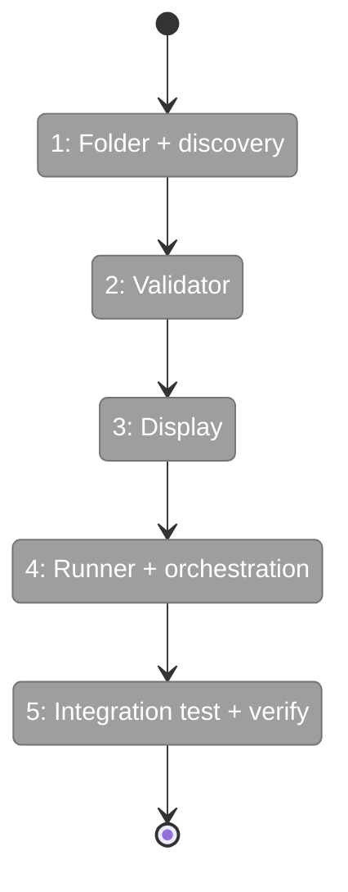
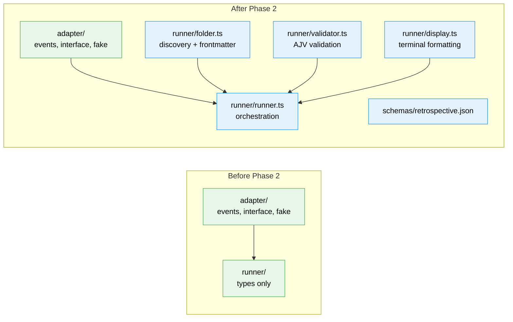

# Flight Plan: Phase 2 — Runner Core

**Plan**: [miniharness-extraction-plan.md](../../miniharness-extraction-plan.md)
**Phase**: Phase 2: Runner Core
**Generated**: 2026-04-02
**Status**: Landed ✈️

---

## Departure → Destination

**Where we are**: A compilable package with all type definitions, FakeAgentAdapter test double, and 16 passing tests. No runtime logic — just types and interfaces. Can't discover agents, assemble prompts, or run anything yet.

**Where we're going**: The runner executes agents end-to-end (programmatically, via FakeAgentAdapter). A developer can call `runAgent(adapter, definition, config)` and get back a run folder with frozen inputs, events.ndjson, validated output, and completed.json. Agent discovery finds folders with `prompt.md` and parses frontmatter for descriptions. Schema validation enforces input contracts before execution and output contracts after. All tested with TDD.

---

## Domain Context

### Domains We're Changing

| Domain | What Changes | Key Files |
|--------|-------------|-----------|
| runner | Add all runtime logic — discovery, validation, display, orchestration | `src/runner/folder.ts`, `validator.ts`, `display.ts`, `runner.ts` |
| runner | Update barrel with runtime exports | `src/runner/index.ts` |

### Domains We Depend On (no changes)

| Domain | What We Consume | Contract |
|--------|----------------|----------|
| adapter | AgentEvent union, AgentResult | `src/adapter/events.ts` |
| adapter | IAgentAdapter interface | `src/adapter/interface.ts` |
| adapter | FakeAgentAdapter (tests) | `src/adapter/fake.ts` |

---

## Flight Status

**Legend**: grey = pending | yellow = active | red = blocked/needs input | green = done

---

## Stages

- [x] **Stage 1: Folder + discovery** — Agent discovery, slug validation, run folder creation, frontmatter parsing (`T001`, `T002`)
- [x] **Stage 2: Validator** — AJV schema validation for inputs and outputs (`T003`, `T004`)
- [x] **Stage 3: Display** — Terminal formatting for events and summaries (`T005`)
- [x] **Stage 4: Runner + orchestration** — Prompt assembly, execution, NDJSON streaming, artifacts, retrospective schema (`T006`, `T007`, `T008`)
- [x] **Stage 5: Integration + verify** — End-to-end test, barrel exports, build verification (`T009`, `T010`, `T011`)

---

## Architecture: Before & After

**Legend**: existing (green, unchanged) | new (blue, created)

---

## Acceptance Criteria

- [x] Agent discovery finds folders with prompt.md, skips `_shared`
- [x] Frontmatter parsed from prompt.md, stripped before prompt assembly
- [x] Prompt assembly: preamble → instructions → output hint → params → prompt, joined by `\n\n---\n\n`
- [x] Run folder created with frozen copies of all agent files
- [x] Events written incrementally to NDJSON
- [x] Invalid output → status "degraded" (not "failed")
- [x] Input validation fails fast before execution
- [x] All tests pass (Phase 1 + Phase 2)

## Goals & Non-Goals

**Goals**: Agent discovery, frontmatter, prompt assembly, NDJSON events, schema validation, frozen inputs, completion metadata, display formatting, retrospective schema, TDD tests
**Non-Goals**: No CLI commands, no SDK adapter, no init scaffolding, no doctor/check

---

## Checklist

- [x] T001: Create src/runner/folder.ts (discovery + frontmatter)
- [x] T002: Write folder.test.ts (TDD)
- [x] T003: Create src/runner/validator.ts (AJV validation)
- [x] T004: Write validator.test.ts (TDD)
- [x] T005: Create src/runner/display.ts (terminal formatting)
- [x] T006: Create src/runner/runner.ts (orchestration)
- [x] T007: Write runner.test.ts (TDD)
- [x] T008: Create retrospective schema (src/schemas/retrospective.json)
- [x] T009: Integration test (end-to-end runner)
- [x] T010: Update runner barrel exports
- [x] T011: Verify build + all tests pass
