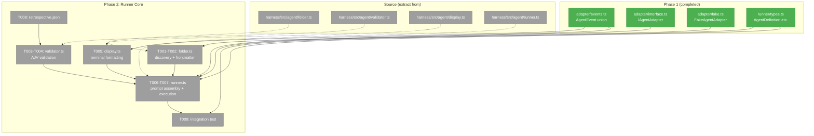
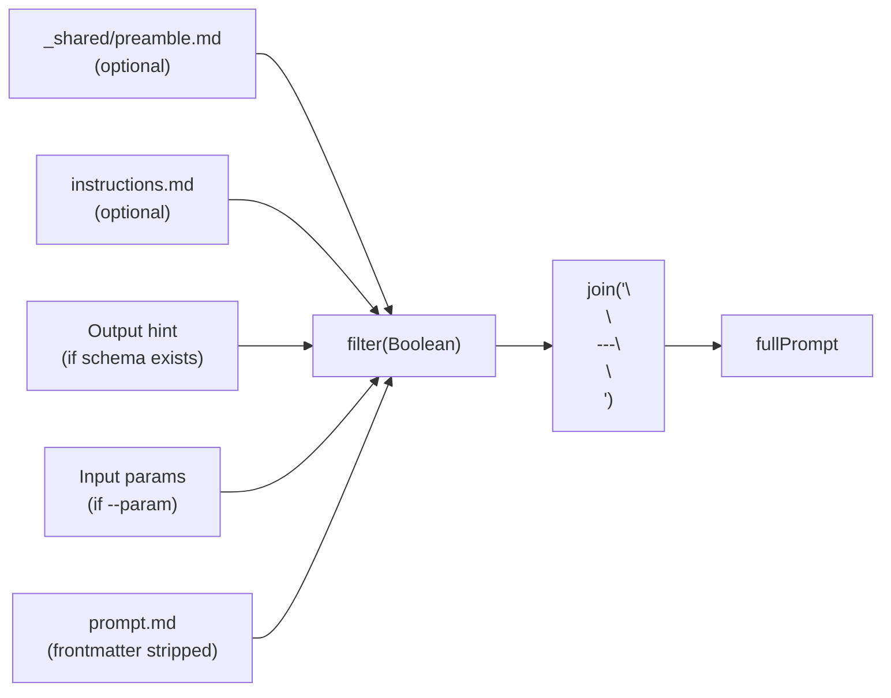
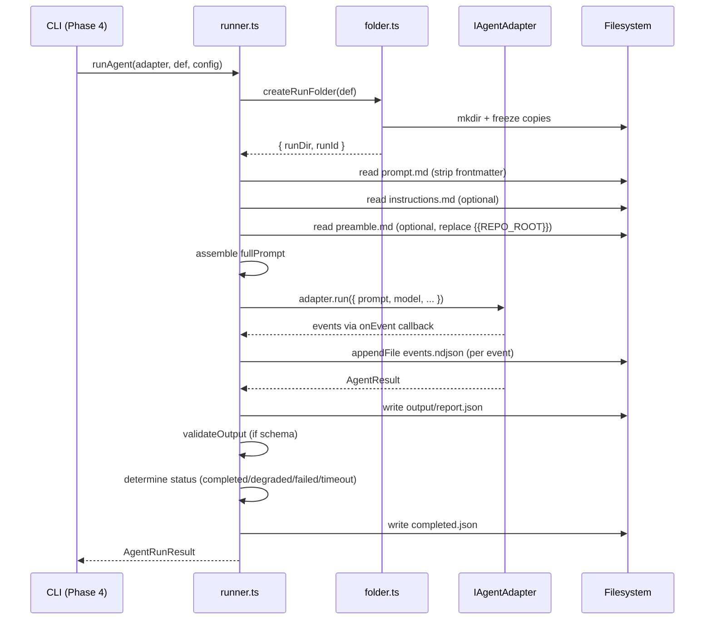

# Phase 2: Runner Core — Tasks

**Plan**: [miniharness-extraction-plan.md](../../miniharness-extraction-plan.md)
**Phase**: Phase 2: Runner Core
**Generated**: 2026-04-02
**Status**: Ready for implementation

---

## Executive Briefing

**Purpose**: Extract and adapt the runner logic — agent discovery, schema validation, terminal display, and prompt assembly/execution. This is the heart of minih: the code that turns a folder with `prompt.md` into a fully-observed agent run with frozen inputs, NDJSON events, validated output, and completion metadata.

**What We're Building**: Four runtime modules (folder.ts, validator.ts, display.ts, runner.ts) plus a reusable retrospective schema fragment. All tested with FakeAgentAdapter via TDD. After this phase, the runner can execute an agent end-to-end programmatically — CLI wrapping comes in Phase 4.

**Goals**:
- ✅ Agent discovery from filesystem (folders with `prompt.md`)
- ✅ Frontmatter parsing (description, tags) — new code, hand-rolled
- ✅ Prompt assembly: preamble → instructions → output hint → params → prompt
- ✅ Frontmatter stripped before prompt assembly
- ✅ Run folder creation with frozen copies of all inputs
- ✅ NDJSON event streaming (incremental append)
- ✅ AJV 2020-12 schema validation (input + output)
- ✅ Degraded vs failed vs completed status logic
- ✅ Terminal display formatting (events, summary, preflight)
- ✅ Retrospective schema fragment shipped
- ✅ TDD tests for folder, validator, runner

**Non-Goals**:
- ❌ No CLI commands (Phase 4)
- ❌ No SDK adapter implementation (Phase 3)
- ❌ No `minih init` scaffolding (Phase 5)
- ❌ No `minih doctor` or `minih check` (Phase 5)

---

## Prior Phase Context

### Phase 1: Project Scaffold + Types

**A. Deliverables**:
- `src/adapter/events.ts` — full AgentEvent union (10 types), AgentResult, AgentRunOptions
- `src/adapter/interface.ts` — IAgentAdapter (run/compact/terminate)
- `src/adapter/fake.ts` — FakeAgentAdapter with test helpers
- `src/runner/types.ts` — AgentDefinition (with description/tags), AgentRunConfig, CompletedMetadata, AgentRunResult, ValidationResult, RunEventStats
- Barrel exports, CLI placeholder, build pipeline, vitest

**B. Dependencies Available**:
- `AgentEvent` discriminated union (switch on `event.type`)
- `AgentResult` — `{ output, sessionId, status, exitCode, stderr?, tokens }`
- `IAgentAdapter` — `run(options)`, `compact(sessionId)`, `terminate(sessionId)`
- `FakeAgentAdapter` — configurable test double with `setEvents()`, `emitToolCall()`, etc.
- `AgentDefinition` — `{ slug, description, tags, dir, promptPath, schemaPath, instructionsPath, inputSchemaPath }`
- `AgentRunConfig` — `{ slug, model?, reasoningEffort?, timeout?, cwd?, params? }`
- `CompletedMetadata`, `AgentRunResult`, `ValidationResult`, `RunEventStats`

**C. Gotchas**:
- `rootDir: "src"` in tsconfig (not `.`) — dist layout is `dist/runner/folder.js` not `dist/src/runner/folder.js`
- FakeAgentAdapter events emitted synchronously — may not model async streaming perfectly
- Use explicit `.js` extensions in all imports (ESM)

**D. Incomplete Items**: None — all Phase 1 tasks complete.

**E. Patterns to Follow**:
- Import direction: `cli → runner → adapter` (no upward imports)
- Plain TypeScript types (no zod)
- Barrel exports for public API
- FakeAgentAdapter as canonical test double
- ESM-only with `.js` import extensions

---

## Pre-Implementation Check

| File | Exists? | Domain | Notes |
|------|---------|--------|-------|
| `src/runner/folder.ts` | ❌ create | runner | Extract from harness folder.ts + add frontmatter parsing |
| `src/runner/validator.ts` | ❌ create | runner | Extract from harness validator.ts — minimal adaptation |
| `src/runner/display.ts` | ❌ create | runner | Extract from harness display.ts — change imports |
| `src/runner/runner.ts` | ❌ create | runner | Extract from harness runner.ts — most adaptation needed |
| `src/runner/index.ts` | ✅ modify | runner | Add runtime exports (listAgents, runAgent, etc.) |
| `src/schemas/retrospective.json` | ❌ create | runner | New — from Workshop 001 design |
| `test/runner/folder.test.ts` | ❌ create | runner | TDD tests |
| `test/runner/validator.test.ts` | ❌ create | runner | TDD tests |
| `test/runner/runner.test.ts` | ❌ create | runner | TDD tests |

No concept duplication found — all modules are new to minih.
No agent harness — implementation will use `npm run build && npm test`.

---

## Architecture Map



---

## Tasks

| Status | ID | Task | Domain | Path(s) | Done When | Notes |
|--------|-----|------|--------|---------|-----------|-------|
| [ ] | T001 | Create src/runner/folder.ts | runner | `src/runner/folder.ts` | `validateSlug()`, `listAgents(agentsDir)`, `resolveAgent(slug, agentsDir)`, `createRunFolder(agentDef)`, `parseFrontmatter(content)` all work. Agents dir passed as param (not hardcoded). Frontmatter parsed from prompt.md. Underscore-prefixed folders skipped. Frozen copies of all agent files in run folder. | Source: harness/src/agent/folder.ts (144 LOC). Adaptations: configurable root, frontmatter parsing (hand-roll ~15 lines, DYK #4), `AgentDefinition.description/tags` populated. |
| [ ] | T002 | Write folder.test.ts (TDD) | runner | `test/runner/folder.test.ts` | Tests: (1) slug validation — valid, invalid chars, traversal, empty, too long. (2) agent discovery — finds prompt.md, skips _shared, skips no-prompt dirs, skips invalid slugs, sorted alphabetically. (3) frontmatter — extracts description/tags, handles missing frontmatter, handles empty frontmatter, handles no tags. (4) run folder creation — timestamp format, frozen copies of prompt/instructions/schemas, output/ dir created. | TDD — write tests first. Use temp dirs (fs.mkdtempSync). |
| [ ] | T003 | Create src/runner/validator.ts | runner | `src/runner/validator.ts` | `validateInput(schemaPath, params)` and `validateOutput(schemaPath, outputPath)` both work. AJV 2020-12 with allErrors. Pre-validation: missing file, empty file, invalid JSON. Returns `ValidationResult { valid, errors }`. | Source: harness/src/agent/validator.ts (128 LOC). Minimal adaptation — change import path for ValidationResult. |
| [ ] | T004 | Write validator.test.ts (TDD) | runner | `test/runner/validator.test.ts` | Tests: (1) valid output passes. (2) invalid output returns errors with paths. (3) missing output file handled. (4) empty output file handled. (5) invalid JSON handled. (6) schema compilation error handled. (7) input validation — required field missing fails, valid params pass. | TDD — write tests first. Create temp schema + output files. |
| [ ] | T005 | Create src/runner/display.ts | runner | `src/runner/display.ts` | `displayHeader()`, `displayPreflight()`, `displayEvent()`, `formatEvent()`, `displaySummary()` all work. Events formatted with icons (🔧 💭 📝 📊 etc.). Output goes to stderr. | Source: harness/src/agent/display.ts (109 LOC). Change `@chainglass/shared` import to local `../adapter/events.js`. |
| [ ] | T006 | Create src/runner/runner.ts | runner | `src/runner/runner.ts` | `runAgent(adapter, definition, config, onEvent?)` works end-to-end. Prompt assembly: preamble → instructions → output hint → params → prompt, joined by `\n\n---\n\n`. Frontmatter stripped from prompt.md before assembly. `{{REPO_ROOT}}` replaced in preamble. Events written to NDJSON incrementally. Completion metadata written. Degraded status for invalid output. Timeout handling with adapter.terminate(). | Source: harness/src/agent/runner.ts (283 LOC). Adaptations: preamble path configurable (not hardcoded to `resolveHarnessRoot()`), frontmatter stripping, import paths changed. |
| [ ] | T007 | Write runner.test.ts (TDD) | runner | `test/runner/runner.test.ts` | Tests: (1) prompt assembly order verified. (2) frontmatter stripped from prompt. (3) preamble `{{REPO_ROOT}}` replaced. (4) no preamble = prompt only. (5) no instructions = skipped. (6) params formatted as `## Input Parameters`. (7) output hint included when schema exists. (8) events written to NDJSON. (9) completed.json written with correct metadata. (10) degraded status when output fails validation. (11) failed status on adapter error. (12) timeout handling. (13) frozen copies in run folder verified. | TDD — most critical tests. Use FakeAgentAdapter + temp agent dirs. |
| [ ] | T008 | Create retrospective schema | runner | `src/schemas/retrospective.json` | JSON Schema 2020-12 with required `workedWell`, `confusing`, `magicWand`. minLength: 10/10/20 respectively. `improvementSuggestions` optional array. `additionalProperties: true`. | Per Workshop 001. New file — not in source. |
| [ ] | T009 | Integration test | runner | `test/runner/integration.test.ts` | Full end-to-end: create temp agent dir with prompt.md (with frontmatter) + output-schema.json (with retrospective required) + instructions.md. Run with FakeAgentAdapter configured to return valid output. Verify: run folder created, frozen copies present, events.ndjson written, completed.json has all fields, output/report.json exists, status = completed, validation passes. | End-to-end runner test. Proves all modules work together. |
| [ ] | T010 | Update runner barrel exports | runner | `src/runner/index.ts` | Barrel re-exports runtime functions: `listAgents`, `resolveAgent`, `validateSlug`, `createRunFolder`, `runAgent`, `validateInput`, `validateOutput`, `parseFrontmatter`, `displayEvent`, `displayHeader`, `displaySummary`, `displayPreflight`, `formatEvent`. | Add runtime exports alongside existing type exports. |
| [ ] | T011 | Verify build + all tests | — | — | `npm run build` succeeds. All tests pass (Phase 1 + Phase 2). No regressions. | Final verification gate. |

---

## Context Brief

**Key findings from plan**:
- Finding 02: AgentEvent union fully expanded in Phase 1 → display.ts and runner.ts can switch on `event.type` safely
- Finding 04: No frontmatter parser in source — hand-roll ~15 lines (DYK #4 confirmed by user)
- Finding 05: Zod dropped — validator.ts uses AJV directly, no zod dependency
- Finding 06: Vitest for testing — TDD for folder, validator, runner
- Finding 07: FakeAgentAdapter ready from Phase 1 — use for all runner tests

**Domain dependencies** (from `docs/domains/*/domain.md`):
- `adapter`: AgentEvent union (`src/adapter/events.ts`) — runner switches on event.type for NDJSON writing and stats counting
- `adapter`: IAgentAdapter (`src/adapter/interface.ts`) — runner.ts accepts as parameter for adapter-agnostic execution
- `adapter`: FakeAgentAdapter (`src/adapter/fake.ts`) — all Phase 2 tests use this as the test double
- `adapter`: AgentResult (`src/adapter/events.ts`) — runner processes result output, status, tokens

**Domain constraints**:
- All Phase 2 code lives in `src/runner/` — runner domain only
- runner imports from adapter (events, interface) — never the reverse
- runner does NOT import from cli — cli wraps runner in Phase 4
- Schema file at `src/schemas/` — owned by runner domain

**No agent harness** — implementation uses `npm run build && npm test`.

**Reusable from Phase 1**:
- `FakeAgentAdapter` with `setEvents()`, `emitToolCall()`, `emitToolResult()` for simulating agent behavior
- All type definitions (`AgentDefinition`, `CompletedMetadata`, etc.)
- Vitest setup with `test/` directory structure

**Source file mapping** (what to extract from where):

| Minih Target | Source File | LOC | Adaptation Needed |
|-------------|------------|-----|-------------------|
| `src/runner/folder.ts` | `harness/src/agent/folder.ts` | 144 | Configurable agents dir (not hardcoded). Add `parseFrontmatter()`. Populate `AgentDefinition.description/tags`. |
| `src/runner/validator.ts` | `harness/src/agent/validator.ts` | 128 | Change import path for `ValidationResult`. Otherwise copy as-is. |
| `src/runner/display.ts` | `harness/src/agent/display.ts` | 109 | Change `@chainglass/shared` import to `../adapter/events.js`. |
| `src/runner/runner.ts` | `harness/src/agent/runner.ts` | 283 | Preamble path configurable. Frontmatter stripping. Replace `resolveHarnessRoot()` with agentsDir param. Change all `@chainglass/shared` imports. |

**Prompt assembly flow**:


**Run lifecycle sequence**:


---

## Discoveries & Learnings

_Populated during implementation by plan-6._

| Date | Task | Type | Discovery | Resolution | References |
|------|------|------|-----------|------------|------------|

---

## Directory Layout

```
docs/plans/001-setup/
  ├── miniharness-extraction-plan.md
  └── tasks/
      ├── phase-1-project-scaffold-types/   (completed)
      └── phase-2-runner-core/
          ├── tasks.md                      ← this file
          ├── tasks.fltplan.md              ← flight plan
          └── execution.log.md             ← created by plan-6
```
