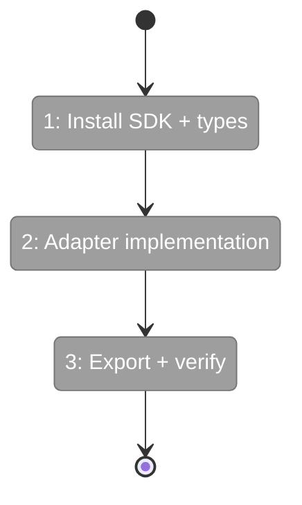
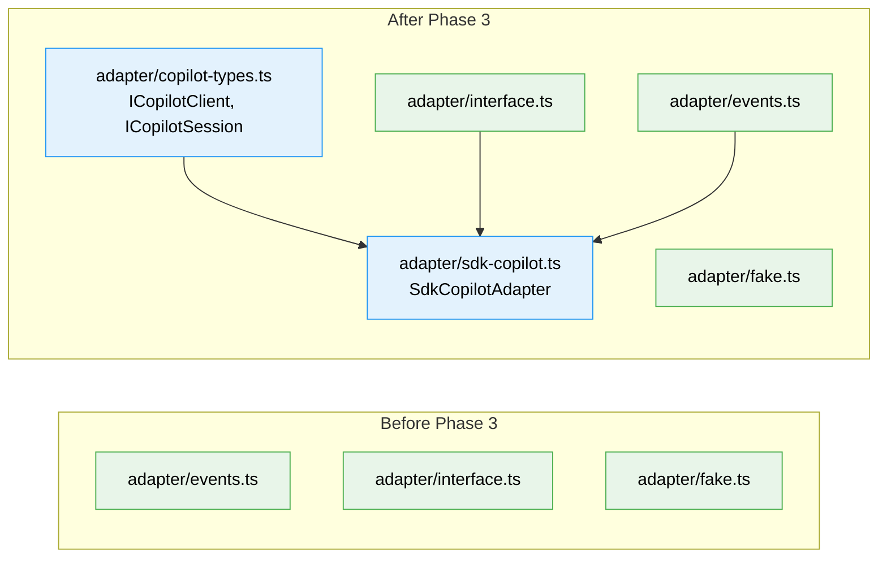

# Flight Plan: Phase 3 — SDK Adapter

**Plan**: [miniharness-extraction-plan.md](../../miniharness-extraction-plan.md)
**Phase**: Phase 3: SDK Adapter
**Generated**: 2026-04-03
**Status**: Landed ✈️

---

## Departure → Destination

**Where we are**: Runner executes agents end-to-end with FakeAgentAdapter. 63 tests pass. All types defined, prompt assembly works, NDJSON events stream, validation enforced. But no real SDK connection — everything runs against the fake.

**Where we're going**: `SdkCopilotAdapter` compiled and exported. The adapter translates real `@github/copilot-sdk` events into our `AgentEvent` union, auto-approves permissions, validates prompts, and manages session lifecycle. Phase 4 can wire it into the CLI to make `npx minih run` work for real.

---

## Domain Context

### Domains We're Changing

| Domain | What Changes | Key Files |
|--------|-------------|-----------|
| adapter | Add SDK adapter implementation + SDK interface types | `src/adapter/sdk-copilot.ts`, `copilot-types.ts`, `index.ts` |

### Domains We Depend On (no changes)

| Domain | What We Consume | Contract |
|--------|----------------|----------|
| adapter (self) | AgentEvent, IAgentAdapter, AgentResult | `src/adapter/events.ts`, `interface.ts` |

---

## Flight Status

**Legend**: grey = pending | yellow = active | red = blocked/needs input | green = done

---

## Stages

- [x] **Stage 1: SDK install + interface types** — Install SDK devDep, create local copilot-types.ts (`T001`, `T002`)
- [x] **Stage 2: Adapter implementation** — Extract and adapt SdkCopilotAdapter (`T003`)
- [x] **Stage 3: Export + verify** — Update barrel, run `just fft` (`T004`, `T005`)

---

## Architecture: Before & After

**Legend**: existing (green, unchanged) | new (blue, created)

---

## Acceptance Criteria

- [x] SdkCopilotAdapter compiles with zero @chainglass imports
- [x] Event translation covers all SDK event types
- [x] Permission auto-approval implemented
- [x] `just fft` passes (build + lint + test)

## Goals & Non-Goals

**Goals**: SdkCopilotAdapter, SDK interface types, event translation, permission auto-approval, prompt validation
**Non-Goals**: No CLI, no adapter unit tests (tested via FakeAgentAdapter), no multi-backend

---

## Checklist

- [x] T001: Install @github/copilot-sdk as devDependency
- [x] T002: Create src/adapter/copilot-types.ts (SDK interface types)
- [x] T003: Create src/adapter/sdk-copilot.ts (adapter implementation)
- [x] T004: Update adapter barrel export
- [x] T005: Verify just fft passes
