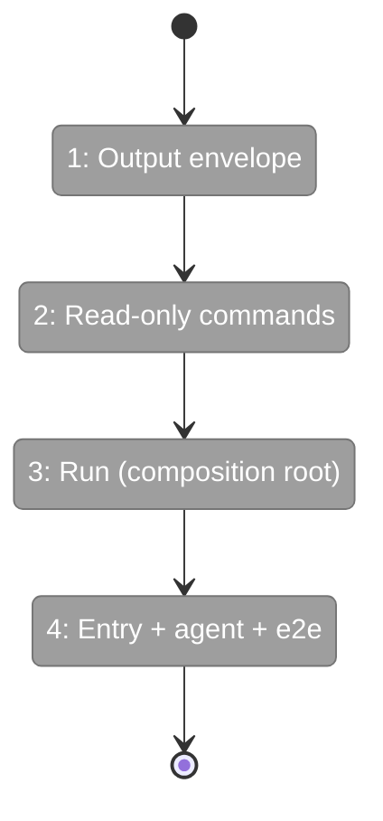
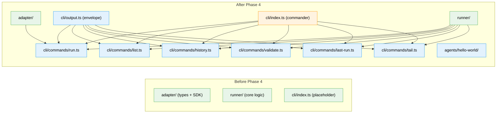

# Flight Plan: Phase 4 — CLI + First Run

**Plan**: [miniharness-extraction-plan.md](../../miniharness-extraction-plan.md)
**Phase**: Phase 4: CLI + First Run
**Generated**: 2026-04-04
**Status**: Landed ✈️

---

## Departure → Destination

**Where we are**: All internals complete — types, runner (with TDD tests), SDK adapter. 63 tests pass. But no CLI — the only way to run an agent is programmatically via `runAgent()`. The CLI placeholder exits with code 1.

**Where we're going**: `npx minih run hello-world` works end-to-end. A developer can list agents, run them, tail events, check history, validate output, and get structured JSON from every command. The 🎉 dogfood moment.

---

## Domain Context

### Domains We're Changing

| Domain | What Changes | Key Files |
|--------|-------------|-----------|
| cli | Replace placeholder with full CLI — 7 commands, envelope, composition root | `src/cli/index.ts`, `output.ts`, `commands/*.ts` |

### Domains We Depend On (no changes)

| Domain | What We Consume | Contract |
|--------|----------------|----------|
| runner | listAgents, resolveAgent, runAgent, validateOutput, display* | `src/runner/index.ts` |
| adapter | SdkCopilotAdapter, ICopilotClient | `src/adapter/index.ts` |

---

## Flight Status

**Legend**: grey = pending | yellow = active | red = blocked/needs input | green = done

---

## Stages

- [x] **Stage 1: Output envelope** — MinihEnvelope type, formatSuccess/formatError, exit codes, test (`T001`, `T002`)
- [x] **Stage 2: Read-only commands** — list, history, validate, last-run, tail — no SDK needed (`T003`, `T005`, `T006`, `T007`, `T008`)
- [x] **Stage 3: Run command** — composition root with dynamic SDK import, actionable error, session isolation (`T004`)
- [x] **Stage 4: Entry + agent + verification** — Commander program, hello-world agent, end-to-end test (`T009`, `T010`, `T011`)

---

## Architecture: Before & After

**Legend**: existing (green, unchanged) | changed (orange, modified) | new (blue, created)

---

## Acceptance Criteria

- [x] `npx minih list` shows agents with descriptions
- [x] `npx minih run <slug>` executes agent and produces run artifacts
- [x] `npx minih history <slug>` shows past runs
- [x] `npx minih tail <slug>` follows event stream
- [x] Dynamic SDK import — non-run commands don't load @github/copilot-sdk
- [x] JSON envelope on stdout, human formatting on stderr (TTY-detected)
- [x] Exit 0 for ok/degraded, exit 1 for error
- [x] Actionable error when SDK is missing

## Goals & Non-Goals

**Goals**: 7 CLI commands, JSON envelope, composition root, dynamic SDK import, hello-world agent, first real run
**Non-Goals**: No init, no doctor, no check, no dry-run, no config file

---

## Checklist

- [x] T001: Create src/cli/output.ts (MinihEnvelope, error codes)
- [x] T002: Write output.test.ts
- [x] T003: Create commands/list.ts
- [x] T004: Create commands/run.ts (composition root)
- [x] T005: Create commands/history.ts
- [x] T006: Create commands/validate.ts
- [x] T007: Create commands/last-run.ts
- [x] T008: Create commands/tail.ts
- [x] T009: Replace cli/index.ts with commander program
- [x] T010: Create hello-world agent
- [x] T011: End-to-end verification (just fft + npx minih list)
