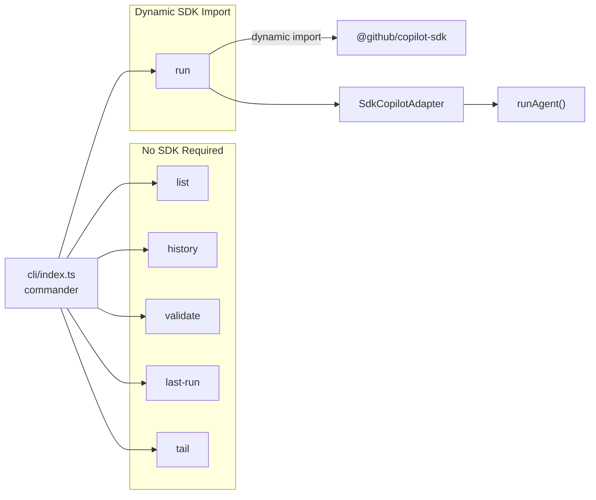
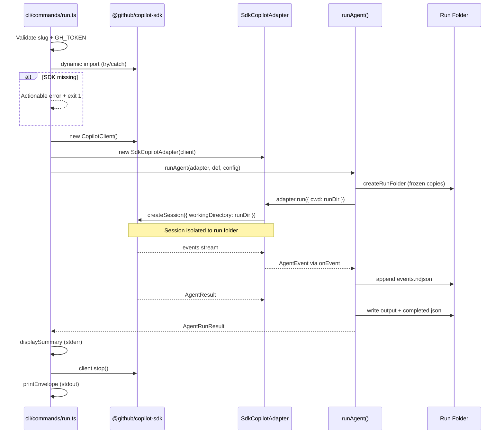

# Phase 4: CLI + First Run — Tasks

**Plan**: [miniharness-extraction-plan.md](../../miniharness-extraction-plan.md)
**Phase**: Phase 4: CLI + First Run
**Generated**: 2026-04-04
**Status**: Ready for implementation

---

## Executive Briefing

**Purpose**: Wire all the building blocks (types → runner → adapter) into a real CLI. After this phase, `npx minih run hello-world` works end-to-end — the 🎉 dogfood moment. Every CLI command returns structured JSON on stdout with human formatting on stderr.

**What We're Building**: 7 CLI commands (run, list, history, validate, last-run, tail + the entry point), a JSON output envelope, and the composition root that dynamically imports the SDK only for the `run` command. Plus the first real agent (`hello-world`) for testing.

**Goals**:
- ✅ `npx minih run <slug>` executes agent via real SDK and produces run artifacts
- ✅ `npx minih list` shows agents with descriptions from frontmatter
- ✅ `npx minih history <slug>` shows past runs
- ✅ `npx minih tail <slug>` follows event stream in real-time
- ✅ `npx minih validate <slug>` re-validates latest output
- ✅ `npx minih last-run <slug>` shows latest run info
- ✅ JSON envelope on stdout, human formatting on stderr (TTY-detected)
- ✅ Dynamic SDK import — non-run commands don't load `@github/copilot-sdk`
- ✅ Actionable error when SDK is missing (DYK #1: try/catch on dynamic import)
- ✅ Exit 0 for ok/degraded, exit 1 for error

**Non-Goals**:
- ❌ No `minih init` (Phase 5)
- ❌ No `minih doctor` or `minih check` (Phase 5)
- ❌ No `--dry-run` (Phase 5)
- ❌ No config file support (post-V1)

---

## Prior Phase Context

### Phase 1: Project Scaffold + Types ✅
- **Deliverables**: package.json (bin entry, ESM), tsconfig.json, vitest, all type definitions, FakeAgentAdapter, barrel exports
- **Available**: `AgentEvent`, `IAgentAdapter`, `AgentResult`, `AgentRunOptions`, `AgentDefinition`, `AgentRunConfig`, `CompletedMetadata`, `AgentRunResult`, `ValidationResult`
- **Patterns**: ESM with `.js` extensions, plain TS types (no zod), barrel exports for public API

### Phase 2: Runner Core ✅
- **Deliverables**: folder.ts, validator.ts, display.ts, runner.ts, retrospective.json
- **Available**: `listAgents(agentsDir)`, `resolveAgent(slug, agentsDir)`, `validateSlug(slug)`, `runAgent(adapter, def, config, onEvent?, agentsDir?)`, `validateOutput(schemaPath, outputPath)`, `displayEvent(event)`, `displayHeader(slug, runId, model?)`, `displayPreflight(label, ok, detail?)`, `displaySummary(result)`, `parseFrontmatter(content)`
- **Gotchas**: Agents need frontmatter with description to be discovered. `runDir` is SDK's CWD (session isolation — Workshop 005). `{{REPO_ROOT}}` in preamble = project root.

### Phase 3: SDK Adapter ✅
- **Deliverables**: sdk-copilot.ts, copilot-types.ts
- **Available**: `SdkCopilotAdapter(client: ICopilotClient)`, `ICopilotClient`, `ICopilotSession`
- **Gotchas**: Emits `session_start` before `sendAndWait`. Passes `cwd` as `workingDirectory`. SDK returns `tokens: null`.

---

## Pre-Implementation Check

| File | Exists? | Domain | Notes |
|------|---------|--------|-------|
| `src/cli/index.ts` | ✅ modify | cli | Currently a placeholder (exits 1). Replace with commander program. |
| `src/cli/output.ts` | ❌ create | cli | MinihEnvelope — handwritten, no zod. |
| `src/cli/commands/run.ts` | ❌ create | cli | Composition root — dynamic SDK import. Most complex command. |
| `src/cli/commands/list.ts` | ❌ create | cli | Uses listAgents() from runner. No SDK needed. |
| `src/cli/commands/history.ts` | ❌ create | cli | Reads completed.json from run folders. |
| `src/cli/commands/validate.ts` | ❌ create | cli | Re-validates output, updates completed.json. |
| `src/cli/commands/last-run.ts` | ❌ create | cli | Latest run dir + report path. |
| `src/cli/commands/tail.ts` | ❌ create | cli | Polls events.ndjson, displays events. |
| `agents/hello-world/prompt.md` | ❌ create | — | First agent for testing. Needs frontmatter. |
| `test/cli/output.test.ts` | ❌ create | cli | Lightweight tests for envelope formatting. |

No concept duplication. No harness — use `just fft` + manual `npx` testing.

---

## Architecture Map

```mermaid
flowchart TD
    classDef completed fill:#4CAF50,stroke:#388E3C,color:#fff
    classDef pending fill:#9E9E9E,stroke:#757575,color:#fff

    subgraph Phase1_2_3["Phases 1-3 (completed)"]
        Events["adapter/events.ts"]:::completed
        Interface["adapter/interface.ts"]:::completed
        SdkAdapter["adapter/sdk-copilot.ts"]:::completed
        Fake["adapter/fake.ts"]:::completed
        Types["runner/types.ts"]:::completed
        Folder["runner/folder.ts"]:::completed
        Runner["runner/runner.ts"]:::completed
        Validator["runner/validator.ts"]:::completed
        Display["runner/display.ts"]:::completed
    end

    subgraph Phase4["Phase 4: CLI + First Run"]
        Output["T001: cli/output.ts<br/>MinihEnvelope"]:::pending
        List["T003: commands/list.ts"]:::pending
        Run["T004: commands/run.ts<br/>composition root"]:::pending
        History["T005: commands/history.ts"]:::pending
        Validate["T006: commands/validate.ts"]:::pending
        LastRun["T007: commands/last-run.ts"]:::pending
        Tail["T008: commands/tail.ts"]:::pending
        Entry["T009: cli/index.ts<br/>commander program"]:::pending
        Agent["T010: hello-world agent"]:::pending
        E2E["T011: end-to-end test"]:::pending

        Output --> List & Run & History & Validate & LastRun & Tail
        List --> Entry
        Run --> Entry
        History --> Entry
        Validate --> Entry
        LastRun --> Entry
        Tail --> Entry
        Entry --> E2E
        Agent --> E2E
    end

    Folder --> List
    Folder --> Run
    Folder --> History & Validate & LastRun & Tail
    Runner --> Run
    SdkAdapter --> Run
    Display --> Run & Tail
    Validator --> Validate
```



---

## Tasks

| Status | ID | Task | Domain | Path(s) | Done When | Notes |
|--------|-----|------|--------|---------|-----------|-------|
| [ ] | T001 | Create src/cli/output.ts | cli | `src/cli/output.ts` | MinihEnvelope type with `command`, `status` (ok/error/degraded), `timestamp`, `data?`, `error?`. Error codes E100-E130. `formatSuccess()`, `formatError()`, `printEnvelope()`, `exitWithEnvelope()`. Exit 0 for ok/degraded, exit 1 for error. | Finding 05: no zod. Source: harness/src/cli/output.ts — simplified. |
| [ ] | T002 | Write output.test.ts | cli | `test/cli/output.test.ts` | Tests: formatSuccess shape, formatError with code+message, status enum, timestamp present. | Lightweight. |
| [ ] | T003 | Create commands/list.ts | cli | `src/cli/commands/list.ts` | `minih list` — calls `listAgents(agentsDir)`. TTY: formatted table with slug + description + required params. Non-TTY/--json: JSON envelope. Reads input-schema.json for required params display. | Workshop 002: list shows descriptions + required params. No SDK needed. |
| [ ] | T004 | Create commands/run.ts | cli | `src/cli/commands/run.ts` | Composition root. Validates slug + GH_TOKEN. Dynamic SDK import with try/catch → actionable error if missing. Creates `CopilotClient` + `SdkCopilotAdapter`. Calls `runAgent()`. Flags: --model, --reasoning, --timeout, --param, --agents-dir. Displays header + preflight + events + summary on stderr. JSON envelope on stdout. | DYK #1: catch MODULE_NOT_FOUND. Workshop 005: CWD=runDir. Finding 01: dynamic import. |
| [ ] | T005 | Create commands/history.ts | cli | `src/cli/commands/history.ts` | `minih history <slug>` — reads completed.json from run folders, sorts newest first. TTY: formatted table. Non-TTY: JSON envelope. | Source: harness agent.ts history command. |
| [ ] | T006 | Create commands/validate.ts | cli | `src/cli/commands/validate.ts` | `minih validate <slug>` — re-validates latest output against current schema. Updates completed.json (degraded → completed if passes). JSON envelope. | Source: harness agent.ts validate command. |
| [ ] | T007 | Create commands/last-run.ts | cli | `src/cli/commands/last-run.ts` | `minih last-run <slug>` — finds latest run dir, reads completed.json, shows runDir + reportPath + result. JSON envelope. | Source: harness agent.ts last-run command. |
| [ ] | T008 | Create commands/tail.ts | cli | `src/cli/commands/tail.ts` | `minih tail <slug>` — polls events.ndjson every 200ms, displays formatted events via displayEvent(). Watches for completed.json to auto-exit. Shows last 20 existing events for context. --run flag for specific run. Ctrl+C graceful exit. | Source: harness agent.ts tail command. Direct stderr output (no envelope). |
| [ ] | T009 | Replace src/cli/index.ts | cli | `src/cli/index.ts` | Replace placeholder with commander program. `#!/usr/bin/env node`. Registers all commands. `--version` from package.json. `--agents-dir` global option. | Shebang required for npx. |
| [ ] | T010 | Create hello-world agent | — | `agents/hello-world/prompt.md` | Minimal agent with frontmatter (description, tags). No schema, no instructions. `minih list` shows it. | First agent in repo. Dogfood Workshop 004. |
| [ ] | T011 | End-to-end verification | — | — | `just fft` passes. `npx minih list` shows hello-world with description. `npx minih run hello-world` executes (requires GH_TOKEN). All prior tests still pass. | 🎉 FIRST DOGFOOD MOMENT |

---

## Context Brief

**Key findings from plan**:
- Finding 01: SDK lazy-loaded via dynamic import — only in `run.ts`. All other commands must NOT import SDK.
- Finding 05: No zod — output envelope uses handwritten types.

**DYK decisions**:
- DYK #1: Wrap SDK dynamic import in try/catch. Catch `MODULE_NOT_FOUND` and show actionable error: "Install @github/copilot-sdk in your project."
- Workshop 005: SDK `workingDirectory` = runDir (not project root) for session isolation.

**Domain dependencies** (from `docs/domains/*/domain.md`):
- `runner`: `listAgents(agentsDir)` — agent discovery for list command
- `runner`: `resolveAgent(slug, agentsDir)` — agent resolution for all slug-based commands
- `runner`: `runAgent(adapter, def, config, onEvent?, agentsDir?)` — execution for run command
- `runner`: `validateSlug(slug)` — pre-flight validation
- `runner`: `validateOutput(schemaPath, outputPath)` — re-validation for validate command
- `runner`: `displayHeader()`, `displayPreflight()`, `displayEvent()`, `displaySummary()` — terminal formatting
- `adapter`: `SdkCopilotAdapter(client)` — wraps CopilotClient for run command
- `adapter`: `ICopilotClient` — type for CopilotClient from SDK

**Domain constraints**:
- CLI is the composition root — it creates the adapter and passes it to the runner
- CLI imports from runner and adapter domains — never the reverse
- Only `run.ts` imports `@github/copilot-sdk` (via dynamic import)
- Output envelope owns stdout — all other CLI output goes to stderr

**Reusable from prior phases**:
- All display functions from `runner/display.ts` — events, headers, summaries
- All folder functions from `runner/folder.ts` — discovery, slug validation
- `FakeAgentAdapter` for any CLI tests that need an adapter
- Source CLI (`harness/src/cli/commands/agent.ts`) as reference implementation

**CLI command flow**:


**Run command sequence**:


---

## Discoveries & Learnings

_Populated during implementation by plan-6._

| Date | Task | Type | Discovery | Resolution | References |
|------|------|------|-----------|------------|------------|

---

## Directory Layout

```
docs/plans/001-setup/
  ├── miniharness-extraction-plan.md
  └── tasks/
      ├── phase-1-project-scaffold-types/   (completed)
      ├── phase-2-runner-core/              (completed)
      ├── phase-3-sdk-adapter/              (completed)
      └── phase-4-cli-first-run/
          ├── tasks.md                      ← this file
          ├── tasks.fltplan.md              ← flight plan
          └── execution.log.md             ← created by plan-6
```
