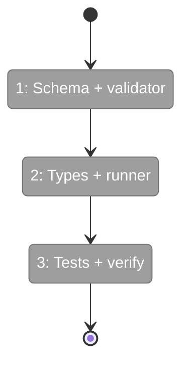

# Flight Plan: Subtask — System Output Enforcement

**Subtask**: [001-subtask-system-output-enforcement.md](./001-subtask-system-output-enforcement.md)
**Parent Phase**: Phase 5: Doctor, Check, Init
**Status**: Ready for takeoff

---

## What → Why

**Problem**: Agents without `output-schema.json` produce unstructured text with no feedback. The self-improving loop breaks for simple agents.

**Fix**: Enforce a system-level output contract on every run: `summary` + `retrospective` with `magicWand`. Inject instructions into every prompt. Validate system fields after every run. `degraded` if missing.

---

## Domain Context

| Domain | Relationship | What Changes |
|--------|-------------|-------------|
| runner | modify | runner.ts (prompt + validation), validator.ts (new function), types.ts (new fields) |

---

## Flight Status

---

## Stages

- [ ] **Stage 1: Schema + validator** — Create system-output.json, add validateSystemOutput() (`ST001`, `ST002`)
- [ ] **Stage 2: Types + runner** — Update CompletedMetadata, inject system instructions into prompt, two-stage validation (`ST003`, `ST004`, `ST005`)
- [ ] **Stage 3: Tests + verify** — Update tests, verify just fft (`ST006`, `ST007`)

---

## Acceptance

- [ ] System output instructions injected into every agent prompt
- [ ] Output hint always present (not just when user schema exists)
- [ ] Valid system output (summary + retrospective) → `systemValidated: true`
- [ ] Missing magicWand → `degraded` + `systemValidated: false`
- [ ] Both system and user validation run when output-schema.json exists
- [ ] `just fft` passes with all tests

---

## Checklist

- [ ] ST001: Create src/schemas/system-output.json
- [ ] ST002: Add validateSystemOutput to validator.ts
- [ ] ST003: Update CompletedMetadata types
- [ ] ST004: Update runner.ts (prompt + validation)
- [ ] ST005: Update runner barrel exports
- [ ] ST006: Update tests
- [ ] ST007: Verify just fft
