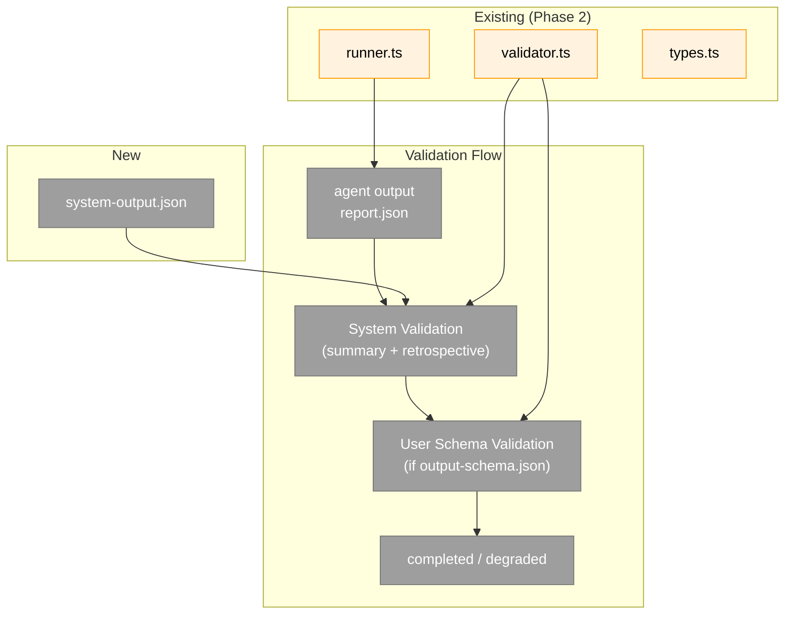

# Subtask: System Output Enforcement

**Parent Phase**: Phase 5: Doctor, Check, Init
**Parent Task**: Prerequisite — must complete before T001-T006
**Created**: 2026-04-05
**Status**: Ready for implementation

**Workshop**: [006 System Output Contract](../../workshops/006-system-output-contract.md)

---

## Parent Context

Phase 5 adds `minih doctor`, `minih check`, and `minih init`. But before those commands can validate output properly, the runner itself needs to enforce a **system-level output contract** on every agent run. Currently, agents without `output-schema.json` produce unstructured text with no validation — the self-improving feedback loop breaks for simple agents.

This subtask modifies the runner (Phase 2 code) and adds a system schema so that every agent — even the most minimal one — must produce structured JSON with `summary` and `retrospective.magicWand`. Phase 5's `doctor` and `check` commands then build on top of this foundation.

---

## Executive Briefing

**Purpose**: Ensure every agent run produces structured self-improving feedback, regardless of whether the agent author defined a custom output schema. The system enforces a minimum output contract: a summary paragraph and a retrospective with magic wand feedback.

**What We're Building**:
- A system output schema (`system-output.json`) shipped with minih
- System output instructions injected into every prompt
- Two-stage validation: system fields first, then user schema
- New metadata fields (`systemValidated`, `userValidated`)
- Updated prompt assembly to always include output hint + system requirements

**How agents/humans use this**:

When you write an agent, minih automatically tells it to produce structured JSON with feedback. You don't need to add this to your `output-schema.json` — it's always enforced. Your agent's output looks like:

```json
{
  "summary": "I reviewed the code and found 3 issues...",
  "retrospective": {
    "workedWell": "The file reading tools were fast and reliable",
    "confusing": "I couldn't tell if the output path was relative or absolute",
    "magicWand": "Add a --verbose flag to minih run that shows the assembled prompt before execution"
  },
  "...your domain-specific fields..."
}
```

After your agent runs, you can verify its output matches the system contract:

```bash
# Check system fields are present
minih check <slug> --file output/report.json

# Check against your custom schema too
minih check <slug> --file output/report.json --schema output-schema.json

# Or just read the magicWand feedback
cat agents/<slug>/runs/$(ls -t agents/<slug>/runs/ | head -1)/output/report.json | jq '.retrospective.magicWand'
```

If the agent produces output but misses the system fields, the run is **"degraded"** (exit 0, not failure) — the agent did its job, it just didn't fulfill the feedback contract.

---

## Pre-Implementation Check

| File | Exists? | Domain | Notes |
|------|---------|--------|-------|
| `src/schemas/system-output.json` | ❌ create | runner | New system schema with summary + retrospective |
| `src/runner/runner.ts` | ✅ modify | runner | Inject system output instructions, always include output hint, two-stage validation |
| `src/runner/validator.ts` | ✅ modify | runner | Add `validateSystemOutput()` function |
| `src/runner/types.ts` | ✅ modify | runner | Add `systemValidated`, `userValidated` to CompletedMetadata |
| `src/runner/index.ts` | ✅ modify | runner | Export `validateSystemOutput` |
| `test/runner/runner.test.ts` | ✅ modify | runner | Add tests for system output enforcement |
| `test/runner/integration.test.ts` | ✅ modify | runner | Update e2e to verify system validation |

---

## Architecture Map



---

## Tasks

| Status | ID | Task | Domain | Path(s) | Done When | Notes |
|--------|-----|------|--------|---------|-----------|-------|
| [ ] | ST001 | Create system-output.json schema | runner | `src/schemas/system-output.json` | JSON Schema 2020-12 requiring `summary` (string, minLength 20) and `retrospective` object with required `workedWell` (10), `confusing` (10), `magicWand` (20). `additionalProperties: true`. | Per Workshop 006. |
| [ ] | ST002 | Add validateSystemOutput to validator.ts | runner | `src/runner/validator.ts` | `validateSystemOutput(outputPath)` validates output against system schema. Fresh AJV instance per call. Returns `ValidationResult`. | Uses system-output.json. Same pattern as validateOutput. |
| [ ] | ST003 | Update CompletedMetadata types | runner | `src/runner/types.ts` | Add `systemValidated: boolean` and `userValidated: boolean \| null` to CompletedMetadata. | `systemValidated` = did system fields pass. `userValidated` = did user schema pass (null if no schema). |
| [ ] | ST004 | Update runner.ts prompt assembly | runner | `src/runner/runner.ts` | (1) Always include output hint (not just when schema exists). (2) Append system output requirements section to every prompt — tells agent to write JSON with summary + retrospective. (3) Two-stage validation: system then user. (4) Write `systemValidated` and `userValidated` to completed.json. | The system output instruction text should be clear enough that an agent (or human reading the assembled prompt) understands exactly what's required. |
| [ ] | ST005 | Update runner barrel exports | runner | `src/runner/index.ts` | Export `validateSystemOutput`. | CLI check command will use this. |
| [ ] | ST006 | Update runner tests | runner | `test/runner/runner.test.ts`, `test/runner/integration.test.ts` | Tests: (1) system output instructions always in prompt. (2) output hint always present. (3) valid system output → systemValidated: true. (4) missing magicWand → degraded + systemValidated: false. (5) no user schema + valid system → completed. (6) both validations run when user schema exists. (7) integration test produces systemValidated: true. | TDD for the critical paths. |
| [ ] | ST007 | Verify just fft | — | — | `just fft` passes. All tests pass (prior + new). | Final gate. |

---

## Context Brief

**Key design decisions** (from Workshop 006):
- System output is ALWAYS enforced — even agents without output-schema.json
- Two-stage validation: system first, then user schema
- Missing system fields → `degraded` (exit 0, not failure)
- `additionalProperties: true` — agent can include any domain-specific fields
- `minLength` on magicWand (20 chars) prevents low-effort `"n/a"` responses

**System output instruction text** (injected into every prompt):

```markdown
## Required Output Format

Your output MUST be a valid JSON object written to the path specified above.
At minimum, your JSON must include these fields:

{
  "summary": "A single paragraph describing what you did and what you found.",
  "retrospective": {
    "workedWell": "What about the tools, workflow, or environment was smooth? Be specific.",
    "confusing": "What was unclear, confusing, or required trial-and-error?",
    "magicWand": "If you could change ONE thing about this experience to make your job easier, what would it be? Be concrete — name a specific tool, command, flag, or workflow improvement."
  }
}

Your agent-specific output fields go alongside these system fields in the same JSON object.
The retrospective.magicWand is the most valuable thing you produce — it directly improves
this system for every agent that runs after you.

After writing your output, verify it is valid JSON by reading it back. You can also run:
  minih check <your-slug> --file <your-output-path>
to validate against the schema before finishing.
```

**How the check command uses this** (Phase 5 will implement):
- `minih check <slug> --file <path>` validates against system schema by default
- `minih check <slug> --file <path> --schema output-schema.json` validates against user schema
- Both validations visible — agents can self-check mid-run

**Domain dependencies**:
- `runner`: validator.ts (`validateOutput`) — existing pattern to follow
- `runner`: runner.ts (`runAgent`) — prompt assembly and validation orchestration
- `runner`: types.ts (`CompletedMetadata`) — metadata contract
- Retrospective schema (`src/schemas/retrospective.json`) — already exists, system schema is a superset

---

## After Subtask Completion

Resume Phase 5 main tasks (T001-T006). The system output enforcement provides the foundation that `minih doctor` and `minih check` build on:
- `doctor` can now check if agents' output-schemas are compatible with the system schema
- `check` can validate any file against the system schema (not just user schemas)
- `init` can scaffold output-schema.json that includes the system fields

---

## Discoveries & Learnings

_Populated during implementation by plan-6._

| Date | Task | Type | Discovery | Resolution | References |
|------|------|------|-----------|------------|------------|
