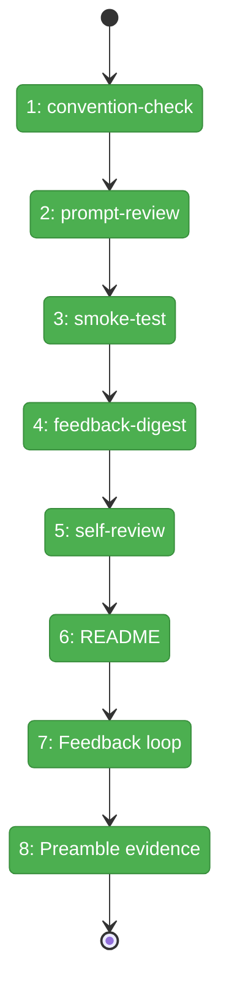
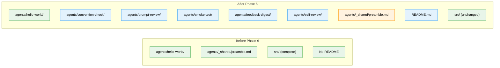

# Flight Plan: Phase 6 — Dogfood + README

**Plan**: [miniharness-extraction-plan.md](../../miniharness-extraction-plan.md)
**Phase**: Phase 6: Dogfood + README
**Generated**: 2026-04-05
**Status**: Landed

---

## Departure → Destination

**Where we are**: minih is fully functional — all 9 CLI commands work, system output enforcement is proven, hello-world agent runs end-to-end. The infrastructure is complete but only one minimal agent (hello-world) exists and there's no README.

**Where we're going**: A developer can clone the repo, read README.md, browse 6 progressively-complex example agents, run any of them with `npx minih run <slug>`, and see the self-improving feedback loop in action. The magic wand cycle has completed at least once with real evidence.

---

## Domain Context

### Domains We're Changing

| Domain | What Changes | Key Files |
|--------|-------------|-----------|
| — (agents) | 5 new dogfood agents created | `agents/{convention-check,prompt-review,smoke-test,feedback-digest,self-review}/` |
| — (root) | README.md created, preamble updated | `README.md`, `agents/_shared/preamble.md` |

### Domains We Depend On (no changes)

| Domain | What We Consume | Contract |
|--------|----------------|----------|
| runner | System output contract + SYSTEM_OUTPUT_INSTRUCTIONS | `src/schemas/system-output.json` |
| runner | Agent discovery + validation | `listAgents()`, `validateSlug()`, `resolveAgent()` |
| cli | All 9 commands (run, list, doctor, check, init, validate, history, last-run, tail) | Commander program |
| adapter | SDK adapter for agent execution | `SdkCopilotAdapter` via dynamic import |

---

## Flight Status

<!-- Updated by /plan-6-v2: pending → active → done. Use blocked for problems/input needed. -->

**Legend**: grey = pending | yellow = active | red = blocked/needs input | green = done

---

## Stages

<!-- Updated by /plan-6-v2 during implementation: [ ] → [~] → [x] -->

- [x] **Stage 1: Create convention-check agent** — ✅ 3 files, $ref pattern works, doctor healthy
- [x] **Stage 2: Create prompt-review agent** — ✅ 4 files (input-schema + output-schema + instructions + prompt)
- [x] **Stage 3: Create smoke-test agent** — ✅ 2 files, no nested `minih run` per DYK #1
- [x] **Stage 4: Create feedback-digest agent** — ✅ 2 files, cross-agent aggregation
- [x] **Stage 5: Create self-review agent** — ✅ 4 files, most complete agent
- [x] **Stage 6: Write README.md** — ✅ install, quick-start, CLI reference, env vars, examples table
- [x] **Stage 7: Run feedback loop** — ✅ all 6 agents ran, 5 completed + 1 timeout/degraded, --json feedback acted on
- [x] **Stage 8: Update preamble evidence** — ✅ env vars documented, evidence table with 2 real entries

---

## Architecture: Before & After

**Legend**: existing (green, unchanged) | changed (orange, modified) | new (blue, created)

---

## Acceptance Criteria

- [ ] All 6 dogfood agents run successfully (completed or degraded)
- [ ] `minih doctor` reports all agents healthy
- [ ] README.md covers install, quick-start, CLI reference
- [ ] npm package excludes dogfood agents (verified by `files` allowlist)
- [ ] At least one magic wand wish has been acted on
- [ ] Preamble evidence table has real entries

## Goals & Non-Goals

**Goals**:
- All 6 agents as progressive teaching examples
- README as primary documentation
- One completed feedback cycle proving self-improvement
- Agents demonstrate every minih feature

**Non-Goals**:
- Publishing to npm
- Multiple feedback cycles
- Production-grade prompt tuning
- New CLI features

---

## Checklist

- [x] T001: Create convention-check agent ✅
- [x] T002: Create prompt-review agent ✅
- [x] T003: Create smoke-test agent ✅
- [x] T004: Create feedback-digest agent ✅
- [x] T005: Create self-review agent ✅
- [x] T006: Write README.md ✅
- [x] T007: Run feedback loop ✅
- [x] T008: Update preamble evidence table ✅
