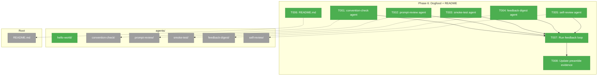
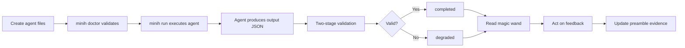
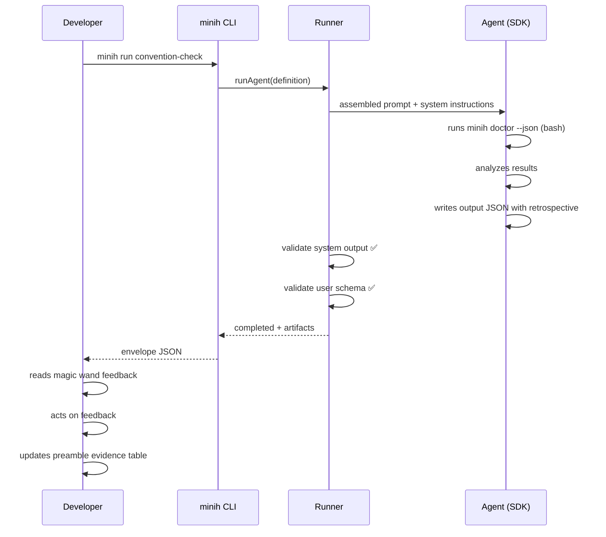

# Phase 6: Dogfood + README — Tasks Dossier

**Plan**: [miniharness-extraction-plan.md](../../miniharness-extraction-plan.md)
**Phase**: Phase 6: Dogfood + README
**Created**: 2026-04-05
**Status**: Landed

---

## Executive Briefing

**Purpose**: Create the dogfood agents that validate minih and teach users how to write agents. Write the README. Run the full feedback loop at least once, proving the self-improving cycle works end-to-end.

**What We're Building**: 5 new dogfood agents (convention-check, prompt-review, smoke-test, feedback-digest, self-review) alongside the existing hello-world. A comprehensive README.md. Package configuration to exclude dogfood agents from npm. At least one completed feedback cycle (run → read magic wands → act on feedback → run again).

**Goals**:
- ✅ All 6 agents run successfully and produce valid system output
- ✅ README covers install, quick-start, CLI reference, agent examples
- ✅ npm package excludes dogfood agents (via `files` allowlist)
- ✅ At least one magic wand wish acted on (proves feedback loop)
- ✅ Preamble evidence table has real entries

**Non-Goals**:
- ❌ Publishing to npm (not this phase)
- ❌ Running all agents multiple cycles (one complete cycle is enough for V1)
- ❌ Production-grade prompt tuning (iterative improvement happens post-V1)
- ❌ Adding new CLI features (unless a magic wand finding is trivial to fix)

---

## Prior Phase Context

### Phase 1: Project Scaffold + Types
- **Deliverables**: package.json, tsconfig.json, vitest.config.ts, all type definitions (AgentEvent union, IAgentAdapter, FakeAgentAdapter, AgentDefinition)
- **Dependencies Exported**: AgentEvent, IAgentAdapter, AgentResult, AgentRunOptions, AgentDefinition (with description/tags)
- **Patterns**: ESM + `.js` imports, plain TS types (no zod), downward imports cli→runner→adapter

### Phase 2: Runner Core
- **Deliverables**: folder.ts, validator.ts, display.ts, runner.ts, retrospective.json, 61 TDD tests
- **Dependencies Exported**: listAgents, resolveAgent, validateSlug, createRunFolder, parseFrontmatter, validateInput, validateOutput, runAgent
- **Patterns**: AJV fresh per call, frontmatter stripped before prompt assembly, configurable preamble path

### Phase 3: SDK Adapter
- **Deliverables**: copilot-types.ts (~50 LOC), sdk-copilot.ts (~250 LOC), barrel exports
- **Dependencies Exported**: SdkCopilotAdapter, ICopilotClient, ICopilotSession
- **Patterns**: Only adapter touches SDK, local TS facades instead of SDK types

### Phase 4: CLI + First Run
- **Deliverables**: Output envelope, 6 commands (run/list/history/validate/last-run/tail), commander entrypoint, hello-world agent
- **Dependencies Exported**: MinihEnvelope, formatSuccess, formatError, printEnvelope, exitWithEnvelope
- **Patterns**: Stdout JSON envelope, stderr human output, dynamic SDK import only in `run`, global `--agents-dir` resolution

### Phase 5: Doctor, Check, Init + System Output
- **Deliverables**: system-output.json, validateSystemOutput(), doctor/check/init commands, --dry-run, 14 MINIH_* env vars, two-stage validation
- **Dependencies Exported**: SYSTEM_OUTPUT_INSTRUCTIONS, MINH_ENV_KEYS, validateSystemOutput, system output contract
- **Gotchas**: check --input must NOT apply system validation; doctor needs ref-aware AJV; dry-run must work without GH_TOKEN
- **Patterns**: System contract always enforced; two-stage validation (system first, then user schema); MINIH=1 detection flag

---

## Pre-Implementation Check

| File | Exists? | Domain Check | Notes |
|------|---------|-------------|-------|
| `agents/hello-world/prompt.md` | ✅ Yes | — | Already exists from Phase 4. No changes needed. |
| `agents/convention-check/prompt.md` | ❌ Create | — | New agent folder + prompt + output-schema + instructions |
| `agents/convention-check/output-schema.json` | ❌ Create | — | Workshop 004 has full schema design |
| `agents/convention-check/instructions.md` | ❌ Create | — | Agent identity/rules |
| `agents/prompt-review/prompt.md` | ❌ Create | — | New agent with input-schema |
| `agents/prompt-review/input-schema.json` | ❌ Create | — | Requires agent_slug param |
| `agents/prompt-review/output-schema.json` | ❌ Create | — | Review findings + retrospective |
| `agents/prompt-review/instructions.md` | ❌ Create | — | Reviewer persona |
| `agents/smoke-test/prompt.md` | ❌ Create | — | Full lifecycle test |
| `agents/smoke-test/output-schema.json` | ❌ Create | — | Per-step pass/fail + retrospective |
| `agents/feedback-digest/prompt.md` | ❌ Create | — | Cross-agent aggregation |
| `agents/feedback-digest/output-schema.json` | ❌ Create | — | Prioritized improvement list + retrospective |
| `agents/self-review/prompt.md` | ❌ Create | — | Code review agent |
| `agents/self-review/input-schema.json` | ❌ Create | — | Requires file_path param |
| `agents/self-review/output-schema.json` | ❌ Create | — | Findings/verdict + retrospective |
| `agents/self-review/instructions.md` | ❌ Create | — | Reviewer persona + rules |
| `README.md` | ❌ Create | — | Package documentation |
| `package.json` | ✅ Modify | — | `files` already excludes agents (allowlist: `dist`, `LICENSE`). No changes needed. |

**Package exclusion note**: `package.json` uses `"files": ["dist", "LICENSE"]` which is an allowlist — only `dist/` and `LICENSE` are included in the npm package. Dogfood agents in `agents/` are automatically excluded. No `.npmignore` needed.

---

## Architecture Map



---

## Tasks

| Status | ID | Task | Domain | Path(s) | Done When | Notes |
|--------|-----|------|--------|---------|-----------|-------|
| [x] | T001 | Create convention-check agent | — | `agents/convention-check/{prompt.md,output-schema.json,instructions.md}` | Agent folder exists with prompt, output schema (incl. retrospective), and instructions. `minih doctor` reports it healthy. | Workshop 004 — exercises `minih doctor` from inside. Consumer 1 pattern. |
| [x] | T002 | Create prompt-review agent | — | `agents/prompt-review/{prompt.md,input-schema.json,output-schema.json,instructions.md}` | Agent folder exists with all 4 files. `minih doctor` reports it healthy. Input schema requires `agent_slug` param. | Workshop 004 — exercises input validation + `--param` flow + cross-agent file reads. |
| [x] | T003 | Create smoke-test agent | — | `agents/smoke-test/{prompt.md,output-schema.json}` | Agent folder exists. `minih doctor` reports it healthy. Prompt exercises full CLI lifecycle (list→doctor→init→run→check→history→validate→last-run→cleanup). | Workshop 004 — most complex task flow. Exercises init + check mid-run. |
| [x] | T004 | Create feedback-digest agent | — | `agents/feedback-digest/{prompt.md,output-schema.json}` | Agent folder exists. `minih doctor` reports it healthy. Prompt reads magic wand feedback from all agents' recent runs. | Workshop 004 — closes the feedback loop. Cross-agent data aggregation. |
| [x] | T005 | Create self-review agent | — | `agents/self-review/{prompt.md,input-schema.json,output-schema.json,instructions.md}` | Agent folder exists with all 4 files. `minih doctor` reports it healthy. Input schema requires `file_path` param. | Workshop 004 — production-grade code review agent. Most complex schema. |
| [x] | T006 | Write README.md | — | `README.md` | README covers: install, quick-start (create agent → run), CLI reference (all 9 commands), dogfood agents table with links, system output contract, env vars reference. | Per clarification Q4 — README only, no separate docs site. Link to dogfood agents as examples. |
| [x] | T007 | Run feedback loop | — | `agents/*/runs/` | All 6 dogfood agents run successfully (completed or degraded). At least one magic wand wish is identified and acted on. | Requires GH_TOKEN. May need prompt iteration if agents fail. The key validation that the self-improving loop works. |
| [x] | T008 | Update preamble evidence table | — | `agents/_shared/preamble.md` | Preamble has an evidence table section with at least one real entry showing feedback that was acted on. | Closes the loop — proves the system is self-improving. |

---

## Context Brief

### Key findings from plan

- **Finding 01**: SDK is lazy-loaded only in `run.ts` → dogfood agents that invoke `minih list`, `minih doctor`, `minih check` etc. do NOT need SDK. Only `minih run` inside smoke-test triggers it.
- **Finding 04**: Frontmatter is required with `description` field → all dogfood agent prompts must have valid frontmatter.
- **Finding 05**: No zod — output schemas use raw JSON Schema → dogfood agents' output-schema.json files use JSON Schema 2020-12 directly.

### Domain dependencies

- **runner**: `SYSTEM_OUTPUT_INSTRUCTIONS` (injected into every prompt) — dogfood agents' output schemas must be compatible with system output contract (summary + retrospective required).
- **runner**: `listAgents()`, `resolveAgent()` — agents that call `minih list` / `minih doctor` consume these indirectly.
- **cli**: All 9 commands available — dogfood agents exercise them from inside runs via bash.

### Domain constraints

- Dogfood agents are NOT domain code — they're user-space agent definitions (just files in `agents/`). No TypeScript, no imports, no domain placement rules.
- Package exclusion handled by `"files"` allowlist in package.json — agents/ already excluded.

### Reusable from prior phases

- **Workshop 004**: Full agent designs (prompts, schemas, instructions) for all 6 agents — use as starting templates, adapt for current codebase reality.
- **System output contract**: `src/schemas/system-output.json` — all output schemas must be compatible (summary + retrospective required alongside agent-specific fields).
- **Retrospective schema**: `src/schemas/retrospective.json` — agents can `$ref` this for the retrospective portion if desired.
- **hello-world**: Already working agent as reference for folder structure.
- **`minih init`**: Can scaffold new agents with `minih init <slug>` — but workshop designs are more detailed than scaffolded templates.

### Workshop 004 agent reference

| Agent | Complexity | Key Features | Files Needed |
|-------|-----------|-------------|-------------|
| hello-world | Minimal | Just prompt.md, no schema | Already exists |
| convention-check | Basic | Output schema, instructions, CLI invocation from inside | 3 files |
| prompt-review | Intermediate | Input schema (agent_slug), cross-agent reads, --param | 4 files |
| smoke-test | Advanced | Full CLI lifecycle, init→run→check→history | 2 files |
| feedback-digest | Advanced | Cross-agent aggregation, no input params | 2 files |
| self-review | Complete | Input schema (file_path), complex output, detailed instructions | 4 files |

### System output contract (all agents must produce)

```json
{
  "summary": "min 20 chars — what happened",
  "retrospective": {
    "workedWell": "min 10 chars",
    "confusing": "min 10 chars",
    "magicWand": "min 20 chars — MOST IMPORTANT"
  }
}
```

### Mermaid flow diagram



### Mermaid sequence diagram



---

## Discoveries & Learnings

| Date | Task | Type | Discovery | Resolution | References |
|------|------|------|-----------|------------|------------|
| 2026-04-05 | T001 | Insight | `$ref` URI must match schema `$id` exactly — `https://minih.dev/schemas/retrospective.json` | Works via `createRefAwareAjv()` in doctor.ts | doctor.ts:254-273 |
| 2026-04-05 | T007 | Gotcha | 3/5 agents asked for `--json` flag that doesn't exist. CLI outputs JSON on stdout, tables on stderr — agents didn't know. | Removed `--json` from prompts, documented stdout/stderr convention | All agent prompts |
| 2026-04-05 | T007 | Gotcha | hello-world asked for `MINIH_OUTPUT_PATH` env var that already exists. Agents couldn't discover env vars. | Added env var list to preamble | `agents/_shared/preamble.md` |
| 2026-04-05 | T007 | Insight | self-review timed out at 180s reviewing runner.ts (350 LOC). Complex agents with subagent delegation need longer timeouts. | Consider 300s default or per-agent timeout config | self-review runs |
| 2026-04-05 | T007 | Decision | Feedback-digest must run LAST — needs other agents' run data | Execution order: hello-world → convention-check → prompt-review → smoke-test → self-review → feedback-digest | DYK #3 |

---

## Directory Layout

```
docs/plans/001-setup/
  ├── miniharness-extraction-plan.md
  └── tasks/phase-6-dogfood-readme/
      ├── tasks.md
      ├── tasks.fltplan.md
      └── execution.log.md   # created by plan-6
```
