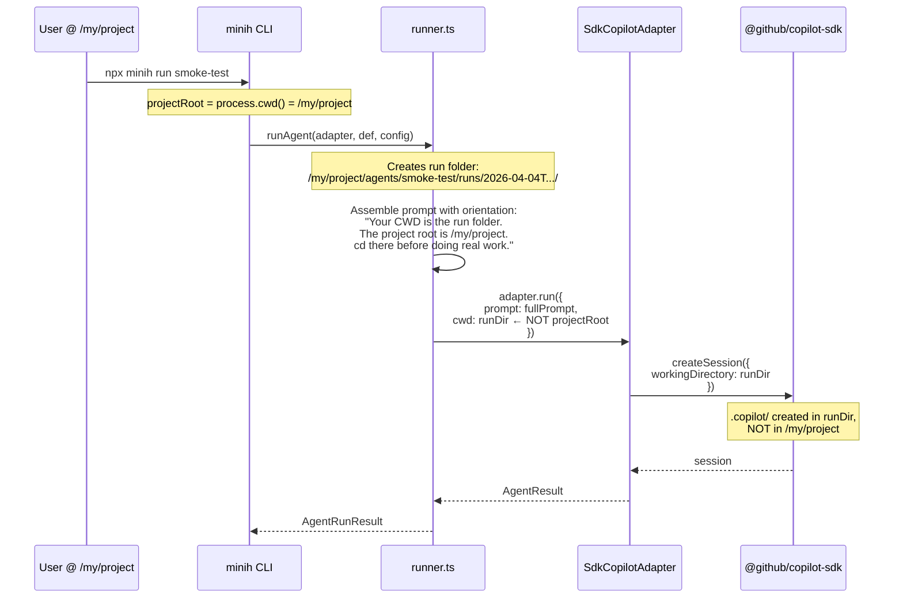

# Workshop: Session Isolation & CWD Strategy

**Type**: Integration Pattern
**Plan**: 001-setup
**Spec**: miniharness-extraction-spec.md
**Created**: 2026-04-04T04:55:00Z
**Status**: Draft

**Related Documents**:
- [003 Agent Folder Convention](./003-agent-folder-convention.md) — run folder structure
- [002 CLI Command Design](./002-cli-command-design.md) — run command flow

**Domain Context**:
- **Primary Domain**: runner (owns CWD decision, prompt assembly)
- **Related Domains**: adapter (passes workingDirectory to SDK), cli (invocation point)

---

## Purpose

Design how minih isolates Copilot SDK session artifacts from the user's project. The SDK creates `.copilot/` directories in the working directory — if that's the project root, `--resume` shows minih agent sessions alongside the user's real coding sessions. This workshop specifies where the SDK's working directory points, how the agent discovers the real project, and what the full directory story looks like.

## Key Questions Addressed

- Where should the SDK's `workingDirectory` point during agent execution?
- How does the agent know where the real project root is?
- What ends up in the run folder vs. the project root?
- How does `--resume` / session listing stay clean for the user?

---

## The Problem

```
# WITHOUT isolation — SDK sessions pollute project root

/my/project/
├── .copilot/                      ← SDK session artifacts (minih runs)
│   ├── sessions/
│   │   ├── sess_agent_run_001/    ← minih smoke-test run
│   │   ├── sess_agent_run_002/    ← minih code-review run
│   │   ├── sess_my_real_work/     ← user's actual coding session
│   │   └── sess_another_run/      ← minih smoke-test again
│   └── ...
├── agents/
│   └── smoke-test/
│       └── runs/
│           └── 2026-04-04T.../    ← run artifacts here
├── src/
└── package.json
```

When the user runs `copilot --resume` in their project, they see a mix of their real coding sessions and dozens of minih agent runs. The signal-to-noise ratio collapses. Agent runs that happened automatically (CI, dev loop) drown out the user's intentional sessions.

## The Solution: Run Folder as SDK CWD

```
# WITH isolation — SDK sessions contained in run folders

/my/project/
├── .copilot/                      ← ONLY user's real sessions
│   └── sessions/
│       └── sess_my_real_work/     ← clean, just their work
├── agents/
│   └── smoke-test/
│       └── runs/
│           ├── 2026-04-04T...-a1b2/
│           │   ├── .copilot/      ← SDK session for THIS run only
│           │   │   └── sessions/
│           │   │       └── sess_xxx/
│           │   ├── prompt.md      ← frozen copy
│           │   ├── events.ndjson
│           │   ├── completed.json
│           │   └── output/
│           │       └── report.json
│           └── 2026-04-04T...-c3d4/
│               ├── .copilot/      ← different run, different session
│               ├── prompt.md
│               └── ...
├── src/
└── package.json
```

Each run gets its own `.copilot/` directory. The user's project root stays clean. `--resume` in the project shows only their real work.

---

## How It Works

### The Three Directories

Every minih run involves three directory concepts:

```
┌─────────────────────────────────────────────────────────────────┐
│  1. PROJECT ROOT (where minih is invoked)                       │
│     /my/project                                                 │
│                                                                 │
│     • Where the user types `npx minih run smoke-test`           │
│     • Where agents/ directory lives                             │
│     • What {{REPO_ROOT}} resolves to in the preamble            │
│     • The agent needs to know this to do real work              │
│     • NOT the SDK's workingDirectory                            │
│                                                                 │
├─────────────────────────────────────────────────────────────────┤
│  2. AGENTS DIR (where agent definitions live)                   │
│     /my/project/agents                                          │
│                                                                 │
│     • Contains agent folders (smoke-test/, code-review/)        │
│     • Contains _shared/preamble.md                              │
│     • Resolved from PROJECT ROOT or --agents-dir flag           │
│                                                                 │
├─────────────────────────────────────────────────────────────────┤
│  3. RUN DIR (where this execution's artifacts go)               │
│     /my/project/agents/smoke-test/runs/2026-04-04T...-a1b2     │
│                                                                 │
│     • Created fresh for each execution                          │
│     • SDK's workingDirectory = THIS directory                   │
│     • .copilot/ session artifacts land here                     │
│     • Frozen inputs, events.ndjson, completed.json live here    │
│     • Agent tool calls execute from here (cd to project first)  │
│                                                                 │
└─────────────────────────────────────────────────────────────────┘
```

### The Flow



### What the Agent Sees

The agent's prompt includes orientation (via preamble or output hint) telling it:

```markdown
## Orientation

**Your working directory**: [run folder path] — this is where SDK session
artifacts are stored. Do NOT write output here directly.

**Project root**: /my/project — `cd` here before running commands,
reading source code, or doing any real work.

**Output path**: Write your report to [run folder]/output/report.json
```

The agent's first action in most cases will be `cd /my/project` before doing anything meaningful. This is the same pattern the Chainglass preamble uses ("Run `pwd` first. Your working directory should be the repository root.").

### Runner Implementation

In `runner.ts`, the key change:

```typescript
// Before (current — passes project root as cwd)
adapter.run({
  prompt: fullPrompt,
  cwd: config.cwd,     // ← project root
  ...
});

// After (session-isolated — passes run folder as cwd)
adapter.run({
  prompt: fullPrompt,
  cwd: runDir,          // ← run folder (SDK artifacts land here)
  ...
});
```

The `config.cwd` (project root) is still used for:
- `{{REPO_ROOT}}` replacement in preamble
- The output hint path (absolute, so agent can write from anywhere)
- Orientation in the prompt telling the agent where the real project is

### Prompt Assembly Update

The output hint already uses an absolute path, so the agent can write to it regardless of CWD. But the preamble's orientation section needs to make the two directories explicit:

```markdown
## Orientation

Your SDK session is running in the run folder. The project you're
working on is at: {{REPO_ROOT}}

Run `cd {{REPO_ROOT}}` before executing any commands against the project.
All paths in this prompt are absolute — they work from any directory.
```

---

## What Lives Where

| Artifact | Location | Why |
|----------|----------|-----|
| `.copilot/` SDK sessions | Run folder | Isolated per-run, doesn't pollute project |
| `events.ndjson` | Run folder | Run-specific event stream |
| `completed.json` | Run folder | Run metadata |
| `output/report.json` | Run folder | Agent's structured output |
| Frozen inputs (prompt.md, schemas) | Run folder | Reproducibility |
| `stderr.log` | Run folder | Error output |
| Agent definitions | Agents dir | Persistent, version-controlled |
| `_shared/preamble.md` | Agents dir | Shared across all agents |
| User's `.copilot/` sessions | Project root | User's real coding sessions |
| Source code, package.json, etc. | Project root | The actual project |

---

## Gitignore Implications

```gitignore
# Agent run artifacts (including SDK sessions)
agents/*/runs/
```

This single line covers everything — frozen inputs, events, output, AND the `.copilot/` directories inside each run folder. No separate `.copilot/` ignore needed in the project root (those are the user's real sessions).

---

## Edge Cases

### Agent Creates Files in Project Root

The agent might `cd /my/project && echo "test" > foo.txt`. This is expected — agents have full filesystem access (yolo). The CWD isolation only affects where the SDK stores its session metadata, not where the agent can write.

### Multiple Concurrent Runs

Each run gets its own run folder (timestamped + random suffix), so each gets its own `.copilot/` directory. No collisions. No shared session state.

### `minih tail` Following a Run

`minih tail` reads `events.ndjson` from the run folder. The `.copilot/` directory in the same folder doesn't affect tailing — it's just SDK bookkeeping.

### Agent Reads Its Own Run Folder

The agent can `ls` its CWD and see the `.copilot/` directory, the frozen inputs, and the events file. This is fine — it's all run context. The agent's prompt tells it where the output goes.

### `--dry-run` Mode

Dry run creates the run folder (for the output path hint) but doesn't start the SDK. No `.copilot/` created.

---

## Changes Required

### runner.ts (Phase 2, already implemented — needs update)

```diff
  adapter.run({
    prompt: fullPrompt,
    model: config.model,
    reasoningEffort: config.reasoningEffort,
-   cwd: config.cwd,
+   cwd: runDir,        // SDK isolated to run folder
    onEvent: handleEvent,
    timeout: timeoutMs,
  }),
```

### Preamble template (Phase 5, minih init)

Add orientation section distinguishing CWD from project root:

```markdown
## Orientation

Your session is running in the run folder. The project root is: {{REPO_ROOT}}

Run `cd {{REPO_ROOT}}` before executing any commands.
```

### sdk-copilot.ts (Phase 3, already implemented)

Already passes `cwd` through as `workingDirectory` to the SDK session (FT-002 fix). No change needed — it just receives `runDir` now instead of project root.

---

## Open Questions

### Q1: Should the preamble auto-include a `cd {{REPO_ROOT}}` instruction?

**RESOLVED**: Yes. The default preamble template should tell the agent to cd to the project root before doing work. This is the same pattern as the Chainglass preamble.

### Q2: Should the run folder's `.copilot/` be cleaned up after the run?

**RESOLVED**: No. Keep it — it's part of the run's artifacts and may be useful for debugging SDK behavior. The gitignore covers it via `agents/*/runs/`.

### Q3: Does this affect `minih check` (mid-run self-validation)?

**RESOLVED**: No. `minih check` validates a file against a schema — it doesn't touch the SDK or care about CWD. The agent calls it as a tool from whatever directory it's in, passing absolute paths.

---

## Summary

| Aspect | Design |
|--------|--------|
| SDK `workingDirectory` | Run folder (not project root) |
| Why | Isolate `.copilot/` session artifacts from user's project |
| Agent orientation | Preamble tells agent the project root via `{{REPO_ROOT}}` |
| Agent's first action | `cd {{REPO_ROOT}}` before doing real work |
| Output paths | Absolute — work from any CWD |
| Gitignore | `agents/*/runs/` covers everything including `.copilot/` |
| Concurrent runs | Each run folder has its own `.copilot/` — no conflicts |
| runner.ts change | `adapter.run({ cwd: runDir })` instead of `config.cwd` |
| sdk-copilot.ts change | None — already passes cwd as workingDirectory |
