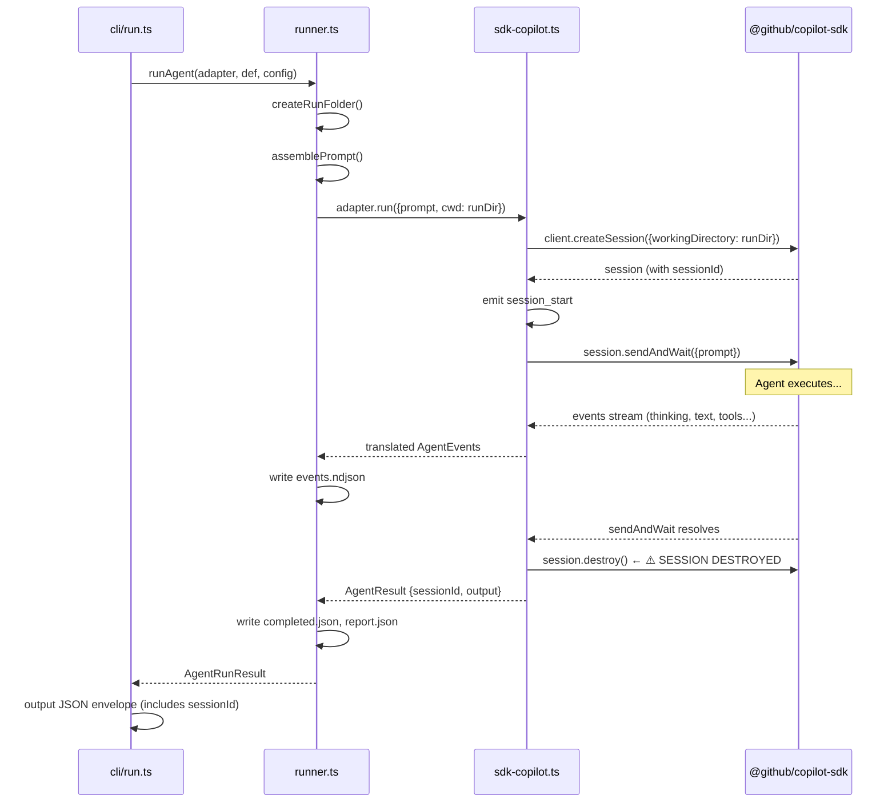

# Research Report: Session Resume & Follow-Up Prompts

**Generated**: 2026-04-06T02:40:00Z
**Research Query**: "Need to add --resume mode and -p style to send new commands into existing completed sessions — corrections, follow-up questions"
**Mode**: Pre-Plan
**Location**: docs/plans/003-resume-prompt/research-dossier.md
**FlowSpace**: Available
**Findings**: 65 across 8 subagents

## Executive Summary

### What We Want

Allow users to continue a completed agent run — send follow-up messages like "HEY! You didn't do X" or ask clarifying questions. Two capabilities:

1. **`--resume`**: Reconnect to a prior session and continue the conversation
2. **Inline prompt**: Pass the follow-up message directly on the command line

### Business Purpose

Agents are high-frequency dev-loop tools. When an agent run misses something, the user shouldn't have to re-run from scratch — they should be able to course-correct. This is the difference between "fire and forget" and "conversational agents."

### Key Insights

1. **SDK already supports resume**: `ICopilotClient.resumeSession(sessionId)` exists. The adapter already switches between `createSession()` and `resumeSession()` based on `sessionId`. The plumbing is 80% done.
2. **`session.destroy()` is called after every `run()`**: This is the critical blocker — current runs destroy the session. We need to either stop destroying (use `disconnect()`) or determine if the SDK can resume from persisted state.
3. **`-p` is taken by `--param`**: Need a different UX — either a separate `resume` command or a different flag.

### Quick Stats

- **Components to modify**: ~4-6 files across all 3 domains
- **New code estimate**: ~100-200 LOC
- **Existing plumbing**: 80% (adapter, types, event streaming all support sessionId)
- **Prior Learnings**: 10 relevant discoveries
- **Domains impacted**: All 3 (adapter, runner, cli)

---

## How It Currently Works

### Session Lifecycle (Current)



### Entry Points

| Entry Point | Type | Location | Purpose |
|------------|------|----------|---------|
| `minih run <slug>` | CLI Command | `src/cli/commands/run.ts:36-60` | Execute agent (single-turn) |
| `runAgent()` | Function | `src/runner/runner.ts:91-371` | Core orchestration |
| `adapter.run()` | Method | `src/adapter/sdk-copilot.ts:31-142` | SDK session + sendAndWait |
| `adapter.compact()` | Method | `src/adapter/sdk-copilot.ts:144-180` | Multi-turn compaction (preserves session!) |
| `adapter.terminate()` | Method | `src/adapter/sdk-copilot.ts:182-201` | Force-kill session |

### Session ID Flow (Current)

```
SDK creates session → adapter emits session_start{sessionId}
                    → runner captures activeSessionId (for timeout)
                    → runner writes to events.ndjson
                    → AgentResult carries sessionId
                    → completed.json persists sessionId
                    → CLI envelope includes sessionId in data
```

**sessionId is already persisted** in `completed.json` and the CLI output envelope. This is the key: we can read it back for resume.

### Session Storage (SDK)

Sessions live globally at `~/.copilot/session-state/<uuid>/`:
```
~/.copilot/session-state/
├── <sessionId>/
│   ├── workspace.yaml     ← cwd, git_root, branch, summary
│   ├── events.jsonl       ← conversation history
│   ├── checkpoints/
│   └── files/
```

The SDK's `--resume` filters by `cwd`. Minih sets CWD = run folder to isolate sessions from user's normal resume list (Workshop 005).

---

## Architecture & Design

### 🚨 Critical Finding: `session.destroy()` Is Called After Every Run

**File**: `src/adapter/sdk-copilot.ts:136-141`
```typescript
finally {
  if (!sessionDestroyed) {
    sessionDestroyed = true;
    await session.destroy();   // ← destroys session after every run
  }
}
```

Compare with `compact()` at line 177-179:
```typescript
finally {
  // Disconnect but don't destroy — session state preserved for resumption
  await session.disconnect();
}
```

**The adapter already knows the difference.** `compact()` uses `disconnect()` to keep sessions alive. `run()` uses `destroy()` which may or may not wipe the persisted state at `~/.copilot/session-state/<uuid>/`.

**This is the #1 design question**: Does `destroy()` delete the SDK's persisted session state, or just release the in-memory handle? If the former, we MUST change `run()` to use `disconnect()` (or a new `keepAlive` option). If the latter, `resumeSession()` might "just work" even after destroy.

### Existing Resume Plumbing

The adapter ALREADY supports resume — it's just not wired to the CLI:

```typescript
// src/adapter/sdk-copilot.ts:45-58
const session = sessionId
  ? await this._client.resumeSession(sessionId, { ... })  // ← resume path EXISTS
  : await this._client.createSession({ ... });             // ← new session path
```

```typescript
// src/adapter/events.ts:37-45
export interface AgentRunOptions {
  prompt: string;
  sessionId?: string;   // ← field EXISTS
  cwd?: string;
  onEvent?: AgentEventHandler;
  model?: string;
  reasoningEffort?: ReasoningEffort;
  timeout?: number;
}
```

### What's Missing (The Gap)

| Layer | Current | Needed |
|-------|---------|--------|
| **Adapter** | `run()` accepts `sessionId` ✅ | Don't `destroy()` if we want resume ❓ |
| **Runner types** | `AgentRunConfig` has no `sessionId` | Add `sessionId?: string` |
| **Runner** | `runAgent()` doesn't pass `sessionId` | Thread it through to adapter |
| **CLI** | No `--resume` flag, `-p` taken by `--param` | New flag or command |
| **Lookup** | `completed.json` has `sessionId` | Helper to read it from run folder |

### CLI Flag Conflict

`-p` is already used for `--param`:
```typescript
.option('-p, --param <key=value>', 'Input parameter (repeatable)', ...)
```

Other taken short flags: `-m` (model), `-r` (reasoning), `-t` (timeout).

---

## Modification Considerations

### ✅ Safe to Modify

1. **`AgentRunConfig`** (`src/runner/types.ts:25-33`): Add `sessionId?: string`. No consumers break — it's optional.
2. **`runAgent()`** (`src/runner/runner.ts:91-371`): Thread `config.sessionId` into `adapter.run()`. Straightforward.
3. **CLI command registration** (`src/cli/commands/run.ts:36-60`): Add `--resume` flag.
4. **Run folder creation**: New run folder for resumed runs (immutable artifact convention).

### ⚠️ Modify with Caution

1. **`SdkCopilotAdapter.run()` destroy behavior** (`src/adapter/sdk-copilot.ts:136-141`):
   - If we switch to `disconnect()`, sessions accumulate in `~/.copilot/session-state/`
   - If we add a `keepAlive` option, the API gets more complex
   - Need to test what SDK actually does after `destroy()` vs `disconnect()`

2. **Prompt assembly for resume** (`src/runner/runner.ts:174-205`):
   - First run: full prompt (preamble + instructions + system output hint + params + prompt)
   - Resume: just the follow-up message? Or full prompt again?
   - The SDK conversation history means the LLM already has prior context

3. **System output contract**: Should resumed runs also require `summary` + `retrospective`?
   - Probably yes for consistency, but the user might just want a quick answer

### 🚫 Danger Zones

1. **Session CWD isolation** (`docs/plans/001-setup/workshops/005-session-isolation-cwd-strategy.md`):
   - Current: CWD = run folder → sessions hidden from user's `--resume`
   - Resume: new run folder? Same run folder? Different CWD?
   - If we use a NEW run folder for the resumed run but the SAME session, the SDK might update the session's `workspace.yaml` CWD

---

## Prior Learnings (From Previous Implementations)

### 📚 PL-01: CWD Isolation for `--resume`
**Source**: `docs/plans/001-setup/workshops/005-session-isolation-cwd-strategy.md`
**Type**: decision
**What They Found**: Set SDK's `workingDirectory` to the run folder so minih sessions don't appear in user's `copilot --resume` list.
**Action for Current Work**: Resume runs must maintain isolation. If a resumed run uses a NEW run folder as CWD, the session's stored CWD might update — which is fine (it was isolated before, still isolated now).

### 📚 PL-02: Sessions Are Not Persistent Across Runs
**Source**: `docs/plans/001-setup/research-dossier.md:140-145`
**Type**: decision
**What They Found**: "No persistent state — each run is independent (no session resumption across runs)."
**Action**: This was the V1 design. Resume explicitly changes this — it's a new capability that breaks the "independent runs" assumption.

### 📚 PL-03: Multi-Turn Support via `compact()`
**Source**: `docs/plans/001-setup/tasks/phase-3-sdk-adapter/execution.log.md:21-33`
**Type**: insight
**What They Found**: `compact()` intentionally does NOT destroy session (uses `disconnect()`). Session stays alive for subsequent turns.
**Action**: This is the proof that multi-turn is architecturally supported. Resume should follow the same pattern — `disconnect()` instead of `destroy()`.

### 📚 PL-04: Session Lifecycle Needs Explicit Cleanup
**Source**: `docs/plans/001-setup/tasks/phase-3-sdk-adapter/execution.log.md:32-33`
**Type**: gotcha
**What They Found**: `sessionDestroyed` guard prevents double-destroy. `client.stop()` in `finally`.
**Action**: Resume flows need the same safety guards. Can't destroy a session you plan to resume later.

### 📚 PL-05: Runner Needs `session_start` to Track Live Session
**Source**: `docs/plans/001-setup/tasks/phase-1-project-scaffold-types/execution.log.md:28-31`
**Type**: insight
**What They Found**: Runner captures `sessionId` from `session_start` event for timeout cleanup.
**Action**: Resume runs will emit `session_start` with the SAME sessionId. Runner logic should handle this naturally.

### Prior Learnings Summary

| ID | Type | Source | Key Insight | Action |
|----|------|--------|-------------|--------|
| PL-01 | decision | Workshop 005 | CWD = run folder for isolation | Maintain in resume |
| PL-02 | decision | Research dossier | Each run independent | Resume changes this |
| PL-03 | insight | Phase 3 exec log | compact() uses disconnect(), not destroy() | Follow same pattern |
| PL-04 | gotcha | Phase 3 exec log | Double-destroy guard needed | Apply to resume flows |
| PL-05 | insight | Phase 1 exec log | session_start needed for timeout | Resume re-emits it |

---

## Domain Context

### Domain Impact

| Domain | Relationship | Changes Needed |
|--------|-------------|---------------|
| **adapter** | Core — session lifecycle | May need `keepAlive` option in `run()`, or switch to `disconnect()` |
| **runner** | Core — orchestration | `AgentRunConfig.sessionId`, pass-through in `runAgent()`, prompt logic |
| **cli** | Surface — UX | New flag or command, session lookup from completed.json |

### Import Direction Preserved

```
cli → runner → adapter   (no change needed)
```

Resume lookup (reading completed.json for sessionId) is runner-layer responsibility. CLI asks runner, runner reads the filesystem. No new cross-domain dependencies.

---

## Design Options

### Option A: Flag on `run` Command

```bash
minih run <slug> --resume [runId]           # resume last (or specific) run
minih run <slug> --resume --message "fix X" # resume with custom message
```

**Pros**: Familiar, one command to learn
**Cons**: Flag overload on `run`, `--message` vs `--param` confusion, what's the default prompt?

### Option B: Separate `resume` Command

```bash
minih resume <slug> "hey, you forgot X"          # resume last run
minih resume <slug> --run <runId> "fix the bug"   # resume specific run
```

**Pros**: Clean separation, positional prompt feels natural, no flag conflicts
**Cons**: Another command to learn (but it's discoverable via `minih --help`)

### Option C: Combined with Prompt Piping

```bash
minih run <slug> --resume                     # resume last, SDK decides prompt
echo "fix X" | minih run <slug> --resume      # pipe prompt via stdin
minih run <slug> --resume --message "fix X"   # explicit message
```

### Recommendation

**Option B (separate command)** is cleanest:
- No flag conflicts with `-p`/`-m`/`-r`/`-t`
- Positional prompt argument is natural UX
- Clear intent — `resume` is conceptually different from `run`
- Can share implementation (both call `runAgent` with sessionId)

---

## Key Questions for Specification

1. **Does `destroy()` prevent resume?** Need to test or check SDK docs. If yes → must change adapter to use `disconnect()` for normal runs too (or add `keepAlive`).

2. **Should resumed runs produce system output?** (summary + retrospective + magicWand). Probably optional for resume — the feedback was already captured on first run.

3. **What if the session expired?** SDK sessions might have a TTL. Graceful fallback: "Session expired, starting fresh run."

4. **New run folder or same?** New folder (immutable convention). Links back to original via metadata.

5. **Prompt assembly for resume**: Just the follow-up message? Or re-inject system instructions? The SDK conversation history already has the full context.

6. **Pretty mode for resume**: Same as run — default pretty, `--verbose` for raw.

---

## External Research Opportunities

### Research Opportunity 1: SDK Session Persistence After destroy()

**Why Needed**: We need to know if `session.destroy()` wipes session state from `~/.copilot/session-state/` or just releases the in-memory handle. This determines whether resume requires changing the adapter's cleanup behavior.

**Impact on Plan**: If destroy is permanent, we need a `keepAlive` option or switch to `disconnect()`. If destroy is soft, resume might "just work."

**Ready-to-use prompt:**
```
/deepresearch "Does @github/copilot-sdk's session.destroy() permanently remove session state from ~/.copilot/session-state/, or can a destroyed session be resumed with client.resumeSession(sessionId)? Context: The SDK stores sessions at ~/.copilot/session-state/<uuid>/ with workspace.yaml, events.jsonl, and checkpoints. We want to call resumeSession() hours or days after the original run completed. The SDK version is ^0.2.1. Also: is there a session TTL? Do sessions expire?"
```

### Research Opportunity 2: SDK Multi-Turn Best Practices

**Why Needed**: We need to understand the recommended pattern for multi-turn conversations in the Copilot SDK.

**Ready-to-use prompt:**
```
/deepresearch "What is the recommended pattern for multi-turn conversations with @github/copilot-sdk? Specifically: can you call sendAndWait() multiple times on the same session? Does resumeSession() restore full conversation history? Is there a difference between disconnect() and destroy() for session persistence? What happens to tool permissions and working directory on resume? SDK version ^0.2.1."
```

---

## Appendix: File Inventory

### Core Files to Modify

| File | Purpose | Change Needed |
|------|---------|---------------|
| `src/adapter/sdk-copilot.ts` | Session create/resume/destroy | keepAlive option or disconnect |
| `src/adapter/events.ts` | AgentRunOptions | Already has sessionId ✅ |
| `src/runner/types.ts` | AgentRunConfig | Add sessionId |
| `src/runner/runner.ts` | runAgent orchestration | Thread sessionId, adjust prompt |
| `src/cli/commands/run.ts` or new `resume.ts` | CLI command | New command or flag |
| `src/runner/folder.ts` | Session lookup | Helper to find sessionId from run |

### Test Files to Create/Modify

| File | Purpose |
|------|---------|
| `test/runner/runner.test.ts` | Resume path in runAgent |
| `test/adapter/fake.test.ts` | Resume simulation |
| `test/cli/commands.test.ts` | Resume command/flag |

---

## Next Steps

1. **Resolve the `destroy()` question** — run `/deepresearch` prompt above, OR just test it empirically
2. Run `/plan-1b-specify "session resume and follow-up prompts"` to create specification
3. Then proceed through clarify → architect → implement

---

**Research Complete**: 2026-04-06T02:40:00Z
**Report Location**: docs/plans/003-resume-prompt/research-dossier.md
