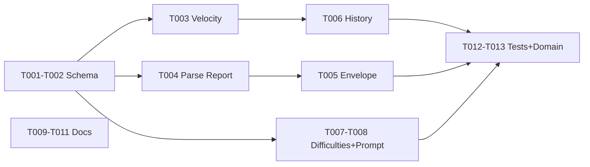

# Flight Plan: Compounding Value

**Plan**: [compounding-value-plan.md](./compounding-value-plan.md)
**Spec**: [compounding-value-spec.md](./compounding-value-spec.md)
**Workshop**: [workshops/001-compounding-value-in-minih.md](./workshops/001-compounding-value-in-minih.md)
**Generated**: 2026-04-14
**Status**: Landed

---

## What & Why

minih has the self-improvement loop (magic wand → fix → verify) but doesn't **measure or surface** the compounding effect. This feature adds structured friction reporting (difficulty ledger), per-agent velocity tracking, run output surfacing, and philosophy docs that articulate why harness investment compounds.

**The pitch**: Agents report friction → humans see it aggregated → fixes flow back to agents → everything gets faster. Make the curve visible.

## Scope

| In Scope | Out of Scope |
|----------|-------------|
| `retrospective.difficulties` schema field | Value axis measurement |
| `magicWandTarget` schema field | Automated difficulty-to-fix pipeline |
| `velocity` block in completed.json | Cross-agent velocity comparison |
| `minih difficulties` command | Web dashboard |
| Trend column in `minih history` | Magic wand maturity auto-classification |
| Retro fields in run stdout envelope | |
| Magic wand + difficulty count in stderr summary | |
| Philosophy updates (AGENTS_README, preamble, SYSTEM_OUTPUT_INSTRUCTIONS) | |
| `harness-is-the-product-v2` skill update | |

## Domains Touched

- **runner** — modify: schema updates, velocity computation, report parsing, system prompt, display
- **cli** — modify: run envelope, history enhancement, new difficulties command
- **adapter** — consume only (no changes)

## Complexity: CS-3 (medium)

S=2, I=0, D=1, N=0, F=0, T=1 · Confidence: 0.85

## Key Findings (from research)

| # | Impact | Finding |
|---|--------|---------|
| 01 | Critical | Runner doesn't parse report.json — must add plumbing for envelope |
| 02 | Critical | Retro schema inlined in 5 places — update all consistently |
| 03 | Critical | No velocity/difficulty infra exists — net-new |
| 04 | High | Velocity scan could be slow — only read most recent |
| 05 | High | displaySummary needs AgentRunResult expansion |

## Tasks (Simple Mode — 13 tasks)

```
T001  Schema updates (retro + system-output + 8 agents)      ← foundation
T002  Velocity type on CompletedMetadata                      ← foundation
T003  Compute velocity at run end                             ← depends T002
T004  Parse report.json → AgentRunResult                      ← independent (parallel with T003)
T005  Surface retro in envelope + displaySummary              ← depends T004
T006  History trend column + velocity summary                 ← depends T003
T007  `minih difficulties` command                            ← depends T001
T008  Update SYSTEM_OUTPUT_INSTRUCTIONS                       ← depends T001
T009  Update preamble                                         ← independent
T010  Update AGENTS_README                                    ← independent
T011  Update harness-is-the-product skill                     ← independent
T012  Tests: schema compat + velocity + CLI                   ← depends T001-T005
T013  Update domain docs + barrel export                      ← depends T001-T007
```

## Key Decisions (from workshop)

- Difficulty categories: **freeform string** with suggested defaults (not enum)
- Difficulty IDs: **auto-generated** by `minih difficulties` (MH-001, MH-002...)
- No deduplication: raw aggregation, humans/agents curate
- Velocity: **stored per-agent** in completed.json, not computed on display
- Three axes only: difficulty, mitigation, velocity — value axis dropped
- Difficulty pipeline: A (schema) → B (aggregation command) → C (preamble curation)
- Preamble Known Difficulties: manually curated (like evidence table)
- Run envelope: includes summary + magicWand + magicWandTarget + difficulties

## Checklist

- [x] T001 Schema updates (10 files)
- [x] T002 Velocity type
- [x] T003 Velocity computation (with legacy backfill)
- [x] T004 Parse report.json (with safe parsing)
- [x] T005 Envelope + display surfacing
- [x] T006 History trend column
- [x] T007 Difficulties command (with frequency grouping)
- [x] T008 SYSTEM_OUTPUT_INSTRUCTIONS
- [x] T009 Preamble
- [x] T010 AGENTS_README
- [x] T011 harness-is-the-product skill
- [x] T012 Tests (schema + velocity + CLI)
- [x] T013 Domain docs + barrel export

## Flight Status



---

*Next: `/plan-6-v2-implement-phase --plan "docs/plans/006-compounding-value/compounding-value-plan.md"`*
