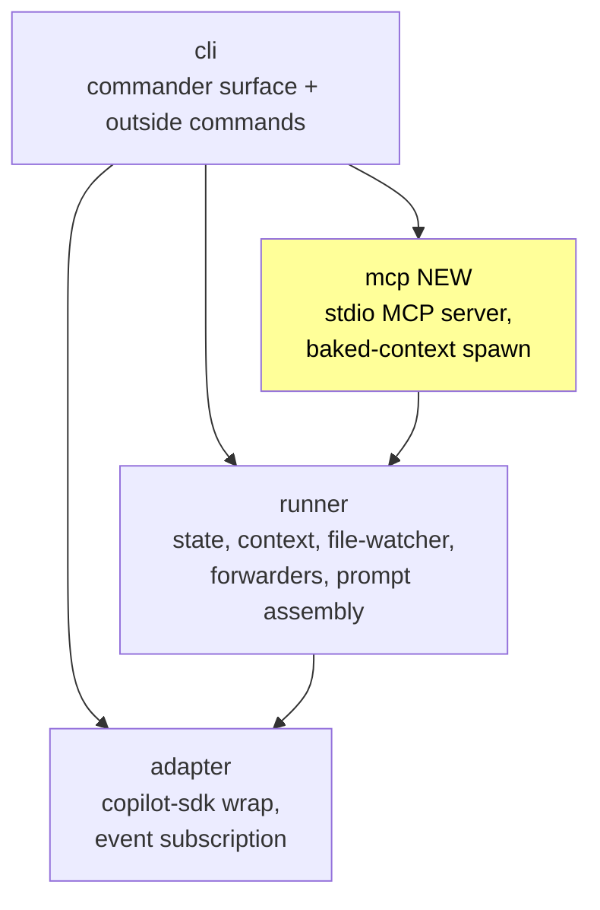
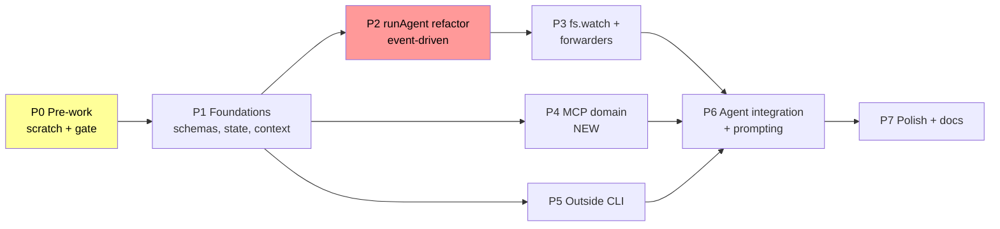

# Outside/Inside Coordination — Implementation Plan

**Plan Version**: 1.0.0
**Created**: 2026-04-26
**Spec**: [coordination-spec.md](./coordination-spec.md)
**Workshops**: [001-filesystem-layout](./workshops/001-filesystem-layout.md), [002-state-machine](./workshops/002-state-machine.md), [003-mcp-tool-surface](./workshops/003-mcp-tool-surface.md), [004-spawn-config-injection](./workshops/004-spawn-config-injection.md), [005-preamble-and-prompting](./workshops/005-preamble-and-prompting.md), [006-test-fixtures](./workshops/006-test-fixtures.md), [007-user-journey-coder-and-reviewer](./workshops/007-user-journey-coder-and-reviewer.md), [008-inside-outside-prompting-and-retro](./workshops/008-inside-outside-prompting-and-retro.md)
**Research**: [research-dossier.md](./research-dossier.md) (80 findings, 12 prior learnings) + [external-research/](./external-research/) (5 files)
**Status**: DRAFT
**Mode**: Full
**Complexity**: CS-4 (large), borderline CS-5 after daemon-light pivot. Confidence 0.70.

---

## Summary

minih is synchronous one-shot today: a single `minih run` boots an SDK session, runs the agent to completion, and exits. There is no way for the host caller (Claude Code, CI, human) and the inside agent to **coordinate progress mid-task**. This plan adds three coordination primitives — outside/inside command split with context detection, per-agent shared inbox, first-class outside/inside state — and lifts `runAgent` from `sendAndWait` to an event-driven loop with native `node:fs.watch` so that file changes from one process push live into a running inside agent's session via `session.send`. The inside surface ships as a per-run minih-spawned MCP server with hidden, env-baked context (mirroring today's `MINIH_*` env-var pattern). A new `mcp` domain joins `cli`/`runner`/`adapter`. Each coordinated agent author writes a two-sided contract (`prompt.md` for the inside agent, opt-in `outside.md` for the host caller); `minih outside-context [<slug>]` emits the outside half so any caller can pipe it into their own context. Both sides feed back into the existing `magicWand` / `difficulties` ledger via a new `magicWandTarget: 'coordination'` enum value and an optional `retrospective.coordination` block, with outside-side feedback riding the inbox lane via `minih outside-retro`.

---

## Target Domains

| Domain | Status | Relationship | Role |
|--------|--------|--------------|------|
| `runner` | existing | **modify** | Add `state.ts`, `context.ts`, `file-watcher.ts`, forwarders, atomic-write helper, `preamble-builder.ts`. Extend `folder.ts` (inbox/state path helpers + `outside.md` discovery), `runner.ts` (event-driven loop, identity block, peer-contract injection), `validator.ts` + schemas. Drop `sendAndWait`. |
| `adapter` | existing | **modify** (minimal) | Surface event-stream + idle-subscription on `IAgentAdapter`; thread inside-channel MCP server entry into `mcpServers` config; preserve `client.stop()` cascade invariant. |
| `cli` | existing | **modify** | New subcommands: `outside-send`, `outside-inbox-list`, `state get/set/transition`, `outside-context`, `outside-retro`, `retros`. PreAction context-block hook on `run`/`resume`/`quickstart`/`init`/`tail`. Extend `init` (`--coordinated` flag + `outside.md` scaffolding) and `doctor` (outside.md drift + size). |
| `mcp` | **NEW** | **create** | Per-run inside-only stdio MCP server (`@modelcontextprotocol/sdk`). Owns six tool implementations (`inbox.list/send/ack`, `state.get/set/transition`), spawn-config-baked context (env-vars), `process.title = 'minih-mcp-<runId>'` marker, regression tests for AC-MCP-CLEAN and AC-MCP-COEXIST. |

### New Domain Sketch — `mcp`

- **Purpose**: Spawn and manage a small stdio MCP server scoped to inside-only tools. All per-session context (runId, runDir, agentSlug, side, paths) baked into the spawn config — agents invoke tools by name only, never seeing IDs or paths.
- **Owns**: MCP server process lifecycle (spawn + register into `mcpServers` + rely on `client.stop()` cascade for cleanup); MCP tool definitions and JSON-Schema input/output validation; the wire format (env-vars + process args); the leak-regression test.
- **Excludes**: filesystem layout of inbox/state files (owned by `runner`); CLI subcommand registration (owned by `cli`); SDK session creation (owned by `adapter`). Not a daemon — only lives for the duration of one `minih run`.
- **Dependency direction**: `mcp` depends on `runner` (state helpers, folder paths, schemas, atomic-write) and `@modelcontextprotocol/sdk`. Consumed by `cli` via `adapter`/`sdk-runtime` composition. Strict downward path: `cli → mcp → runner → adapter` (preserves the existing `cli → runner → adapter` invariant).

### Domain Architecture After This Plan

---

## Domain Manifest

| File | Domain | Classification | Phase | Rationale |
|------|--------|----------------|-------|-----------|
| `src/runner/state.ts` | runner | contract | P1 | NEW — types + helpers (no rule machine; convention-based per workshop 002) |
| `src/runner/context.ts` | runner | contract | P1 | NEW — `detectContext()` + new `MINIH_*` env-var contract |
| `src/runner/atomic-write.ts` | runner | internal | P1 | NEW — write-then-rename helper for state files |
| `src/runner/ulid.ts` | runner | internal | P1 | NEW — thin ULID wrapper for inbox message IDs |
| `src/runner/folder.ts` | runner | contract | P1 | MODIFY — add `agents/<slug>/{inbox,state}/` path helpers; `outside.md` discovery |
| `src/schemas/inbox-message.json` | runner | contract | P1 | NEW — wire envelope schema |
| `src/schemas/outside-state.json` | runner | contract | P1 | NEW — DEFAULT outside-state schema (used when an agent has no `outside-state.schema.json`) |
| `src/schemas/inside-state.json` | runner | contract | P1 | NEW — DEFAULT inside-state schema (used when an agent has no `inside-state.schema.json`) |
| `src/schemas/state-history-entry.json` | runner | contract | P1 | NEW |
| `agents/<slug>/inside-state.schema.json` | runner (data) | contract | P6 | NEW (per-agent, opt-in) — author-declared inside `status` enum + data shape (didyouknow #5 2026-04-26) |
| `agents/<slug>/outside-state.schema.json` | runner (data) | contract | P6 | NEW (per-agent, opt-in) — author-declared outside `status` enum + data shape (didyouknow #5 2026-04-26) |
| `src/schemas/system-output.json` | runner | contract | P6 | MODIFY — extend `magicWandTarget` enum (`coordination`); add optional `retrospective.coordination` |
| `src/schemas/retrospective.json` | runner | contract | P6 | MODIFY — same extensions as system-output |
| `src/runner/types.ts` | runner | contract | P1 + P6 | MODIFY — `RetrospectiveCoordination`, `MagicWandTarget`, `InboxMessage`, `OutsideState`, `InsideState` |
| `src/runner/validator.ts` | runner | internal | P6 | MODIFY — accept new enum + optional coordination block |
| `src/runner/index.ts` | runner | contract | P1, P3 | MODIFY — re-export new helpers |
| `src/runner/preamble-builder.ts` | runner | internal | P2 | NEW — assembles inside-identity block + workshop-005 coordination addition + workshop-008 peer-contract section |
| `src/runner/runner.ts` | runner | contract | P2 | MODIFY — switch to event-driven loop; integrate preamble-builder; remove `sendAndWait` path |
| `src/runner/file-watcher.ts` | runner | internal | P3 | NEW — native `node:fs.watch` adapter; debounce; atomic-rename handling |
| `src/runner/inbox-forwarder.ts` | runner | internal | P3 | NEW — forwards new inbox NDJSON lines to `session.send`; watermark file |
| `src/runner/state-forwarder.ts` | runner | internal | P3 | NEW — forwards state-diff to `session.send`; watermark file |
| `src/adapter/interface.ts` | adapter | contract | P2 | MODIFY — extend `IAgentAdapter.run` to expose event-stream + idle subscription |
| `src/adapter/events.ts` | adapter | contract | P2 | MODIFY — add `session_idle` event type if not already present |
| `src/adapter/sdk-copilot.ts` | adapter | internal | P2, P4 | MODIFY — switch from `sendAndWait` to `session.send + idle subscription`; thread inside-channel MCP server into `mcpServers` |
| `src/adapter/fake.ts` | adapter | internal | P2 | MODIFY — extend FakeAgentAdapter for event-driven contract; supports inbox/state in tests |
| `test/adapter/sdk-copilot.test.ts` | adapter | internal | P2 | MODIFY (or NEW if absent) — covers event-driven `session.send` + idle path |
| `test/adapter/fake.test.ts` | adapter | internal | P2 | MODIFY (or NEW if absent) — covers FakeAgentAdapter event-stream + idle |
| `src/mcp/server.ts` | mcp | contract | P4 | NEW — spawned subprocess entry point |
| `src/mcp/tools/inbox.ts` | mcp | internal | P4 | NEW — `inbox.list` / `inbox.send` / `inbox.ack` |
| `src/mcp/tools/state.ts` | mcp | internal | P4 | NEW — `state.get` / `state.set` / `state.transition` |
| `src/mcp/types.ts` | mcp | contract | P4 | NEW — tool schemas, baked-context shape |
| `src/mcp/spawn.ts` | mcp | contract | P4 | NEW — produces `mcpServers` entry; env-var baked context; `process.title` marker |
| `src/mcp/index.ts` | mcp | contract | P4 | NEW — exports for cli/adapter |
| `src/cli/preaction-context.ts` | cli | internal | P5 | NEW — context-block hook attached to inside-unsafe commands |
| `src/cli/commands/outside-send.ts` | cli | contract | P5 | NEW |
| `src/cli/commands/outside-inbox-list.ts` | cli | contract | P5 | NEW |
| `src/cli/commands/state.ts` | cli | contract | P5 | NEW — `state get/set/transition` subcommand group |
| `src/cli/commands/outside-context.ts` | cli | contract | P5 | NEW — workshop 008 |
| `src/cli/commands/outside-retro.ts` | cli | contract | P5 | NEW — workshop 008 (thin wrapper over `outside-send --type retro`) |
| `src/cli/commands/retros.ts` | cli | contract | P5 | NEW — workshop 008 (aggregator: inside `report.json` + outside `--type retro`) |
| `src/cli/commands/run.ts` | cli | contract | P5 | MODIFY — install preAction context-block hook; help text mentions `outside-context` for coordinated agents |
| `src/cli/commands/resume.ts` | cli | contract | P5 | MODIFY — same hook |
| `src/cli/commands/quickstart.ts` | cli | contract | P5 | MODIFY — same hook |
| `src/cli/commands/tail.ts` | cli | contract | P5 | MODIFY — same hook |
| `src/cli/commands/init.ts` | cli | contract | P6 | MODIFY — `--coordinated` flag + scaffold `outside.md` |
| `src/cli/commands/doctor.ts` | cli | contract | P6 | MODIFY — outside.md drift check + size check (workshop 008) |
| `src/cli/index.ts` | cli | contract | P5 | MODIFY — register new commands |
| `agents/_shared/preamble.md` | runner (data) | internal | P6 | MODIFY — note the new identity-block injection point + minor wording for env-var additions |
| `agents/coordination-smoke-test/prompt.md` | runner (data) | internal | P6 | NEW — exercises every inbox/state tool |
| `agents/coordination-smoke-test/outside.md` | runner (data) | internal | P6 | NEW — peer contract |
| `agents/coordination-smoke-test/instructions.md` | runner (data) | internal | P6 | NEW |
| `agents/coordination-smoke-test/output-schema.json` | runner (data) | internal | P6 | NEW |
| `test/runner/state.test.ts` | runner | internal | P1 | NEW |
| `test/runner/context.test.ts` | runner | internal | P1 | NEW |
| `test/runner/folder.test.ts` | runner | internal | P1 | MODIFY — assertions for new path helpers + outside.md discovery |
| `test/runner/atomic-write.test.ts` | runner | internal | P1 | NEW |
| `test/runner/preamble-builder.test.ts` | runner | internal | P2 | NEW |
| `test/runner/runner-event-driven.test.ts` | runner | internal | P2 | NEW — replaces sendAndWait expectations |
| `test/runner/file-watcher.test.ts` | runner | internal | P3 | NEW — fake-timer debounce + atomic-rename |
| `test/runner/inbox-forwarder.test.ts` | runner | internal | P3 | NEW |
| `test/runner/state-forwarder.test.ts` | runner | internal | P3 | NEW |
| `test/mcp/server.test.ts` | mcp | internal | P4 | NEW — spawn real MCP server, invoke each tool |
| `test/mcp/spawn.test.ts` | mcp | internal | P4 | NEW |
| `test/mcp/leak-regression.test.ts` | mcp | internal | P4 | NEW — AC-MCP-CLEAN |
| `test/mcp/coexist.test.ts` | mcp | internal | P4 | NEW — AC-MCP-COEXIST |
| `test/cli/outside-send.test.ts` | cli | internal | P5 | NEW |
| `test/cli/outside-inbox-list.test.ts` | cli | internal | P5 | NEW |
| `test/cli/state.test.ts` | cli | internal | P5 | NEW |
| `test/cli/outside-context.test.ts` | cli | internal | P5 | NEW |
| `test/cli/outside-retro.test.ts` | cli | internal | P5 | NEW |
| `test/cli/retros.test.ts` | cli | internal | P5 | NEW |
| `test/cli/preaction-context.test.ts` | cli | internal | P5 | NEW |
| `test/cli/run-help.test.ts` | cli | internal | P5 | NEW — covers conditional help-text TIP for `coordination: enabled` agents (task 5.10) |
| `test/cli/all-existing-agents-pass-doctor.test.ts` | cli | internal | P2 | NEW — backward-compat regression: runs `minih check` + `minih doctor` against all 9 existing agents (workshop 006 §Mapping Tests to ACs) |
| `test/cli/init-coordinated.test.ts` | cli | internal | P6 | NEW |
| `test/cli/doctor-outside-md.test.ts` | cli | internal | P6 | NEW |
| `test/runner/run-folder-snapshot.test.ts` | runner | internal | P6 | NEW — asserts AC-RUN-FOLDER (`state-snapshot.json` + `inbox-snapshot/` written at run completion) |
| `test/e2e/daemon-light.test.ts` | cli (e2e) | internal | P3 | NEW — opt-in CI tier; cross-process write → fs.watch → session.send |
| `test/e2e/two-agent-coordination.test.ts` | cli (e2e) | internal | P6 | NEW — opt-in CI tier |
| `docs/domains/mcp/domain.md` | docs | cross-domain | P7 | NEW |
| `docs/domains/registry.md` | docs | cross-domain | P7 | MODIFY — add `mcp` |
| `docs/domains/domain-map.md` | docs | cross-domain | P7 | MODIFY — add `mcp` node + edges |
| `docs/domains/runner/domain.md` | docs | cross-domain | P7 | MODIFY — add new contracts: state, context, file-watcher, preamble-builder, atomic-write, ulid, forwarders; concepts: inbox, state, identity block, peer contract |
| `docs/domains/cli/domain.md` | docs | cross-domain | P7 | MODIFY — add outside-side commands + preAction context-block hook |
| `docs/domains/adapter/domain.md` | docs | cross-domain | P7 | MODIFY — note event-driven shift; reference workshop 007 |
| `AGENTS.md` | docs | cross-domain | P7 | MODIFY — coordination-aware agent format |
| `AGENTS_README.md` | docs | cross-domain | P7 | MODIFY — workshop 005 + 008 user-facing summaries |
| `README.md` | docs | cross-domain | P7 | MODIFY — mention coordination capability |
| `CONTRIBUTING.md` | docs | cross-domain | P7 | MODIFY — testing approach for two-agent coordination |
| `package.json` | infrastructure | internal | P4 | MODIFY — add `@modelcontextprotocol/sdk` dependency; add `ulid` if not vendored |

---

## Key Findings

(Consolidated from 8 workshops + research-dossier.md + external-research/. No new research subagents run — workshops are exhaustive on every implementation question.)

| # | Impact | Finding | Action |
|---|--------|---------|--------|
| 01 | **Critical** | Inside surface = MCP, **not** shellouts. Per-run minih-spawned stdio MCP server with all per-session context baked into the spawn config (env-vars). Agents call tools by name; never see IDs or paths. (Workshop 003 + 004; memory `project_007_inside_channel_mcp.md`.) | New `mcp` domain in P4. Spawn pattern in `src/mcp/spawn.ts`. Process marker `process.title = 'minih-mcp-<runId>'`. |
| 02 | **Critical** | MCP-server-leak (Issue #1132) **NOT REPRODUCED** in our pattern — `client.stop()` cascade reaps within 5s. Empirical validation in `external-research/mcp-leak-validation.md` (3 cycles, ZERO orphans). | Regression test in P4 (`test/mcp/leak-regression.test.ts`) using `pgrep -f minih-mcp-<runId>`. Asserts cleanup within 5s for success/failure/timeout/SIGINT paths. |
| 03 | **Critical** | State-machine rules belong in **plain TypeScript** (not JSON Schema). Workshop 002 down-scoped twice: agents declare statuses as **author-defined enums in per-agent schema files** (`inside-state.schema.json` + `outside-state.schema.json`); transitions are convention-based. Optional `requiresPeer` rule is per-agent opt-in via frontmatter. **Reaffirmed via didyouknow #2 (2026-04-26)**: minih is an **enabler, not an orchestrator** — no server-side gates, no premature-completion guards. If the two sides disagree, they negotiate via inbox messages after the fact. **Per didyouknow #5 (2026-04-26)**: canonical state field renamed `phase` → `status` (agents may use words like "phase" or "milestone" in their own domain examples; the underlying field is `status`). | `src/runner/state.ts` types only (no rule engine). `state.transition` MCP tool validates only that the new status value is in the agent's declared enum (if a schema is present) + appends history. Agents enforce semantics in their own prompts; outside negotiates via `outside-send` if it disagrees. |
| 04 | **Critical** | File watcher is **v1, not v2-deferred**. Daemon-light pattern (workshop 007) requires native `node:fs.watch` because outside-process file writes must push to the inside agent in real time via `session.send`. Chokidar v5 is OUT (chainglass evidence: 1 FD per file → `spawn EBADF` at >5K files). | `src/runner/file-watcher.ts` uses `node:fs.watch` only. Watch ONLY `agents/<slug>/{inbox,state}/` (small dirs); never recursive on full repo. Debounce (50ms) + atomic-rename event coalescing. |
| 05 | **Critical** | `runAgent` must move from `sendAndWait` to **event-driven loop**: `session.send` + subscribe to `pending_messages.modified` + `session.idle`. This is the load-bearing refactor everything else depends on. SDK queue semantics empirically validated (`external-research/sdk-mid-turn-injection.md`): mid-turn `session.send` queues cleanly; each gets its own turn; no need for our own delivery-tracking layer beyond a single watermark file. | P2 is the load-bearing phase. Pre-work scratch test `runagent-eventdriven` (P0) validates the assumption before P2 starts. |
| 06 | **High** | Per-agent shared inbox/state at `agents/<slug>/{inbox,state}/`, **NOT** per-run isolation. Cross-run continuity is required by the user's daemon-light scenario. Per-run frozen snapshots preserved in run folder via `inbox-snapshot/`, `state-snapshot.json`. (Workshop 001.) | `folder.ts` extensions in P1. Snapshot logic in `runner.ts` finalize step (P2). Atomic write-then-rename for state.json (no lockfile in v1). |
| 07 | **High** | Two-sided agent file layout: `prompt.md` (inside) + opt-in `outside.md` (outside). When `outside.md` exists for a `coordination: enabled` agent, its body is injected into the inside prompt under a "Peer's Contract" blockquote-framed section. (Workshop 008.) | `folder.ts` discovers `outside.md`. `preamble-builder.ts` (P2) injects identity block + workshop-005 tools section + peer-contract section. |
| 08 | **High** | Magic-wand and retro pipeline extends without breaking change: `magicWandTarget` enum gains `'coordination'` (third value alongside `'project'`/`'minih'`); optional `retrospective.coordination` block with structured fields. Outside callers ride the inbox lane via `outside-retro` → `--type retro` message. (Workshop 008.) | Schema extensions in P6. New `retros` aggregator merges inside `report.json` + outside `--type retro` messages. |
| 09 | **High** | Plan 005 (MCP **consumption**) already shipped `mcpServers` threading through CLI → AgentRunConfig → adapter → SDK. We extend the same plumbing in `adapter/sdk-copilot.ts` to inject the inside-channel MCP server alongside any user-supplied `--mcp-config`. AC-MCP-COEXIST guards collision behavior. | Plumbing exists; minimal change in `adapter/sdk-copilot.ts` (P2 + P4). |
| 10 | **Medium** | SDK has 30-min idle timeout for in-memory sessions; on-disk sessions persist until explicit `client.deleteSession`. `client.listSessions(filter)` is the canonical liveness probe. (`external-research/sdk-session-ttl.md`.) Relevant for backgrounding plan 008+, less critical here. | Document in `mcp/domain.md` history. No code path in this plan; backgrounding plan handles it. |
| 11 | **Medium** | Existing test infrastructure (vitest, `FakeAgentAdapter`) does NOT cover two-agent coordination scenarios (research-dossier QT-06). Workshop 006 adds 3-layer test strategy (unit + MCP integration + CLI envelope + e2e); workshop 007 adds Layer 4 (file-watcher) + `e2e/daemon-light.test.ts`. | Tests grow with each phase. e2e tier opt-in via `MINIH_E2E=1` (real spawn, real fs.watch, real `session.send` against fake adapter). |
| 12 | **Medium** | Frontmatter parser already handles shallow YAML (`runner/folder.ts:43-100`). Need to extend for `coordination: 'enabled' | 'disabled' | { enabled, outside?, inside? }`. (Workshop 005.) | Small extension in P1 to `parseFrontmatter` + `AgentDefinition` type. Backward compatible. |

---

## Pre-Work Decision Gate (Phase 0)

Workshop 007 specified four scratch tests that MUST pass before P2 (the load-bearing `runAgent` refactor) commits. They live under `scratch/` and are throw-away exploratory code — not production tests.

| Scratch Test | Validates | Pass Criteria | Fallback |
|--------------|-----------|---------------|----------|
| `scratch/runagent-eventdriven/` | Event-driven `runAgent` runs to completion using only `session.send` + idle subscription (no `sendAndWait`) | Test agent reaches `idle` event ≤ 60s; final report.json valid | Keep `sendAndWait` for first-message; layer event-driven only for subsequent messages. Adds one branch in `runAgent`. |
| `scratch/fswatch-test/` | Native `node:fs.watch` reliably detects writes from a sibling process within 100ms; atomic-rename and debounce-burst patterns observable | Mean detection ≤ 50ms; no missed events across 100 writes | Fall back to a 1s polling loop on the inbox/state dirs (degrades latency but ships v1). |
| `scratch/daemon-light-prototype/` | End-to-end: child writes inbox file → fs.watch fires → `session.send` queues → in-flight agent receives within 2-5s | Round-trip ≤ 5s; agent sees correct ordering across rapid writes | Cold-start drain only on resume (lose live push for v1); revisit in plan 008. |
| `scratch/multi-process-watch/` (**REQUIRED — elevated per Critical Insights 2026-04-26 #1**) | (a) Two `minih outside-send` calls in flight simultaneously do not corrupt the NDJSON inbox file; (b) forwarder reading mid-write either gets a complete line or a parse-failure that's safely skipped (watermark NOT advanced), then forwards cleanly on next fs.watch event | Both messages present after run; no truncation; torn-line scenario is self-healing | Document single-writer-at-a-time invariant; if test (b) fails, revisit `flock` for inbox writes BEFORE P3 |

**Decision Gate**: P0 must produce a one-page memo at `docs/plans/007-backgrounding/prework-results.md` recording pass/fail per test. If all four pass: lock the spec polish (add the 10 daemon-light ACs from workshop 007 + the 10 prompting/retro ACs from workshop 008), then proceed to P1. If any fail: revisit workshop 007 with the documented fallback above and re-circulate before P1.

---

## Harness Strategy

- **Current Maturity**: L2 (CLI binary as the harness; vitest runs unit + integration; e2e via real subprocess spawn).
- **Boot Command**: `npm run build && node dist/cli/index.js <subcommand>` (or `npm test` for the harness suite).
- **Health Check**: `minih doctor` (existing).
- **Interaction Model**: subcommand invocation; observe via stdout JSON envelopes + exit codes + run-folder artifacts.
- **Evidence Capture**: JSON envelopes on stdout; pretty markdown on stderr; per-run NDJSON event stream + `report.json` + `completed.json` in `agents/<slug>/runs/<runId>/`.
- **Pre-Phase Validation**: Run `npm test` + a smoke `minih run hello-world` at the start of every phase to catch regressions early.

No separate harness build needed; the existing CLI + test suite IS the harness. Workshop 007's pre-work scratch tests fill the role of "L3 instrumented harness for new subsystems."

---

## Phase Index

| Phase | Title | Primary Domain | Objective (1 line) | Depends On | CS |
|-------|-------|----------------|--------------------|------------|----|
| 0 | Pre-Work Scratch Tests + Decision Gate | — (scratch/) | Validate event-driven runAgent + fs.watch + daemon-light prototype before locking design | None | CS-2 |
| 1 | Runner Foundations | runner | Pure addition: schemas, state.ts, context.ts, folder.ts extensions, atomic-write, ULID. No behavior change. | P0 (results inform `state.ts` shape only) | CS-3 |
| 2 | runAgent Event-Driven Refactor + Preamble Builder | runner + adapter | Drop `sendAndWait`; switch to event-driven loop; extract preamble assembly into `preamble-builder.ts` (identity block + workshop-005 + peer-contract injection points stubbed) | P0 (must pass), P1 | CS-4 |
| 3 | File Watcher + Daemon-Light Forwarders | runner | Native `node:fs.watch` adapter + debounce + atomic-rename; inbox-forwarder + state-forwarder push file changes to `session.send`; cold-start drain on resume | P2 | CS-3 |
| 4 | MCP Domain (NEW) | mcp | Per-run inside-only stdio MCP server with six tools; env-var baked context; spawn integration into `adapter/sdk-copilot.ts`; AC-MCP-CLEAN + AC-MCP-COEXIST regression tests | P1 (state/folder helpers); can run in parallel with P5 | CS-3 |
| 5 | Outside CLI Surface | cli | Commander subcommands for inbox + state + outside-context + outside-retro + retros; preAction context-block hook on inside-unsafe commands | P1 (helpers); can run in parallel with P4 | CS-3 |
| 6 | Agent Integration & Prompting (Workshops 005 + 008) | runner + cli | Wire identity block + peer-contract injection into preamble-builder; extend retrospective + magicWandTarget schemas; `init --coordinated` scaffolds `outside.md`; `doctor` checks; coordination smoke-test agent | P2, P4, P5 | CS-3 |
| 7 | Polish & Docs | docs (cross-domain) | New `docs/domains/mcp/domain.md`; update registry + domain-map + runner/cli/adapter domain.md; update AGENTS.md, AGENTS_README, README, CONTRIBUTING | P6 | CS-2 |

**Critical path**: P0 → P1 → P2 → P3 → P6 → P7. P4 and P5 can be parallelized after P1.

---

## Phases (detail)

### Phase 0: Pre-Work Scratch Tests + Decision Gate

**Objective**: Empirically validate the assumptions underlying the daemon-light pivot before committing any production code in P2.
**Domain**: — (scratch only; no production code)
**Delivers**:
- `scratch/runagent-eventdriven/test.mjs` (or `.ts`) + 1-paragraph result note
- `scratch/fswatch-test/test.mjs` + result note
- `scratch/daemon-light-prototype/test.mjs` + result note
- `scratch/multi-process-watch/test.mjs` (REQUIRED — elevated per Critical Insights 2026-04-26 #1) + result note
- `docs/plans/007-backgrounding/prework-results.md` — one-page memo per workshop 007 §"Pre-Work Required Before Implementation"

**Depends on**: None.
**Key risks**: A scratch failure invalidates the daemon-light design. Mitigation: documented fallbacks per scratch test (see Pre-Work table above).

| # | Task | Domain | Success Criteria | Notes |
|---|------|--------|-----------------|-------|
| 0.1 | `scratch/runagent-eventdriven/`: prove `runAgent`-shaped flow runs end-to-end using only `session.send` + idle subscription | scratch | Test agent run reaches idle ≤ 60s; events drain cleanly; no orphan SDK process | Per workshop 007 §Pre-Work test #1 |
| 0.2 | `scratch/fswatch-test/`: native `node:fs.watch` detects writes from sibling process; observe atomic-rename + debounce-burst patterns | scratch | Mean detection ≤ 50ms; no missed events across 100 writes; document atomic-rename event sequence | Per workshop 007 §Pre-Work test #2 |
| 0.3 | `scratch/daemon-light-prototype/`: combined end-to-end (write → fs.watch → session.send → agent receives) | scratch | Round-trip ≤ 5s; correct ordering across rapid writes | Per workshop 007 §Pre-Work test #3 |
| 0.4 | **(REQUIRED — elevated per Critical Insights 2026-04-26 #1)** `scratch/multi-process-watch/`: (a) two simultaneous `outside-send` calls do not corrupt NDJSON inbox file; (b) forwarder reading mid-write either gets a complete line or a parse-failure that's safely skipped (watermark NOT advanced), then forwards cleanly on next fs.watch event | scratch | Both messages present after run; no truncation; torn-line scenario is self-healing (no message lost, no double-delivery); writer invariant documented | Per workshop 007 §Pre-Work test #4 + workshop 001 §Forwarder-side robustness; if test (b) fails, revisit `flock` for inbox writes BEFORE P3 |
| 0.5 | Write `prework-results.md` memo with pass/fail per scratch test + recommendation (proceed vs revisit design) | docs | Memo exists; covers all 3-4 tests; recommendation explicit | **Decision gate**: must conclude "proceed" before P1 starts |
| 0.6 | Spec polish pass: add the 10 daemon-light ACs (workshop 007) + 10 prompting/retro ACs (workshop 008) into `coordination-spec.md` `## Acceptance Criteria` | docs | Spec updated; ACs renumbered; flight plan status moves from "Specifying — pre-work pending" to "Plan ready" | Only do this after gate passes |

**Acceptance Criteria (P0)**:
- [ ] All scratch tests committed under `scratch/` (and untracked from main src/)
- [ ] `prework-results.md` memo published with explicit recommendation
- [ ] Spec polish pass merged (or fallbacks documented if any test failed)

---

### Phase 1: Runner Foundations

**Objective**: Pure addition. Land schemas, types, helpers, and folder-layout extensions with NO behavior change to existing runs. Backward compatible by construction.
**Domain**: `runner` (primary)
**Delivers**:
- `src/runner/state.ts` (types + helpers; no rule engine)
- `src/runner/context.ts` (`detectContext()` + new `MINIH_*` env-var contract)
- `src/runner/atomic-write.ts` (write-then-rename helper)
- `src/runner/ulid.ts` (thin wrapper)
- `src/runner/folder.ts` extensions (inbox/state path helpers; `outside.md` discovery; frontmatter `coordination` parsing)
- 4 new JSON schemas under `src/schemas/`
- Type extensions in `src/runner/types.ts`
- Tests for each new module

**Depends on**: P0 decision gate must conclude "proceed."
**Key risks**: Schema decisions cascade. Mitigation: workshop 001 + 003 lock these; tests in this phase pin them.

| # | Task | Domain | Success Criteria | Notes |
|---|------|--------|-----------------|-------|
| 1.1 | Author 4 JSON schemas: `inbox-message.json`, `outside-state.json`, `inside-state.json`, `state-history-entry.json` per workshop 001 | runner | Schemas validate via AJV in `runner/validator.ts`; absolute `$id` URIs (`https://minih.dev/schemas/...`); referenced by tests in 1.2 | Workshop 001 §Schema Definitions |
| 1.2 | Implement `src/runner/state.ts`: types (`OutsideState`, `InsideState`, `StateHistoryEntry`), pure helpers (`readState`, `writeState`, `appendHistory`); NO rule machine (per workshop 002 down-scope) | runner | `test/runner/state.test.ts` passes: read/write round-trip; history append-only; atomic write under concurrent calls | Per finding 03 |
| 1.3 | Implement `src/runner/context.ts`: `detectContext(): 'inside' | 'outside'` (reads `MINIH=1`); export new env-var keys (`MINIH_INBOX_DIR`, `MINIH_STATE_DIR`, `MINIH_CONTEXT`) | runner | `test/runner/context.test.ts` passes both branches; env-var keys exported from `runner/index.ts` | AC-CTX-DETECT |
| 1.4 | Implement `src/runner/atomic-write.ts`: write-then-rename helper for state files | runner | `test/runner/atomic-write.test.ts` passes; survives concurrent writers (last-write-wins semantics documented) | Per finding 06 |
| 1.5 | Add ULID helper at `src/runner/ulid.ts` (thin wrapper or `ulid` npm dep) | runner | Generates lex-sortable IDs; `test` covers monotonicity within a process | Per workshop 001 |
| 1.6 | Extend `src/runner/folder.ts`: helpers for `agents/<slug>/{inbox,state}/{outside,inside}/messages.ndjson`, `state/{outside,inside}.json`, `state/history.ndjson`; discover `outside.md` if present | runner | `test/runner/folder.test.ts` extended; new helpers exported; existing tests still pass | Per workshop 001 + 008 |
| 1.7 | Extend `parseFrontmatter` in `folder.ts` to parse `coordination` field per workshop 005 schema (string or object form) | runner | Round-trip parse for `enabled`, `disabled`, `{enabled, outside, inside}`; absent → `{enabled: false}` | Per finding 12 |
| 1.8 | Extend `src/runner/types.ts`: `InboxMessage`, `OutsideState`, `InsideState`, `RetrospectiveCoordination`, `MagicWandTarget` | runner | All new types exported from `runner/index.ts`; consumers in P4/P5 use them | Foundation for P4-P6 |
| 1.9 | Re-export new helpers from `src/runner/index.ts` | runner | `cli` + `mcp` (P4-P5) can import everything via `runner/index.ts` | Domain contract surface |
| 1.10 | Smoke check: existing test suite (`npm test`) green; `minih run hello-world` succeeds end-to-end | runner | Zero regressions in existing 9 agents (per spec backward-compat audit) | AC-BACKWARD-COMPAT (partial) |

**Acceptance Criteria (P1)**:
- [ ] AC-CTX-DETECT — `detectContext()` returns correct value per `MINIH` env-var
- [ ] AC-ENV-VARS — `MINIH_INBOX_DIR`, `MINIH_STATE_DIR`, `MINIH_CONTEXT` exported and documented; existing `MINIH_*` keys unchanged
- [ ] AC-BACKWARD-COMPAT (partial) — existing 9 agents still pass `minih check`/`minih doctor`; no behavior change in `minih run`

---

### Phase 2: runAgent Event-Driven Refactor + Preamble Builder

**Objective**: Lift `runAgent` from `sendAndWait` to event-driven loop; extract preamble assembly into a dedicated builder so P3-P6 can layer onto it cleanly.
**Domain**: `runner` (primary), `adapter` (minimal)
**Delivers**:
- `src/runner/preamble-builder.ts` (assembles universal preamble + identity block + tool section + peer-contract section + agent body + instructions + `SYSTEM_OUTPUT_INSTRUCTIONS`)
- `src/runner/runner.ts` event-driven loop (no `sendAndWait`)
- `src/adapter/interface.ts` extended for event-stream + idle subscription
- `src/adapter/sdk-copilot.ts` switched to `session.send` + idle subscription
- `src/adapter/fake.ts` updated for the new contract
- Snapshot tests for preamble assembly

**Depends on**: P0 (validation), P1 (helpers).
**Key risks**: Load-bearing change. If event-driven loop has races, every downstream phase blocks. Mitigation: P0 scratch validates the pattern; this phase implements with full test coverage; rollback path documented (revert to `sendAndWait` for first-message-only).

| # | Task | Domain | Success Criteria | Notes |
|---|------|--------|-----------------|-------|
| 2.1 | Extend `IAgentAdapter` interface with event-stream + idle subscription contract | adapter | Type-checks; `FakeAgentAdapter` and `SdkCopilotAdapter` both implement; existing `run()` shape preserved as backward-compat | Per finding 05 |
| 2.2 | Update `SdkCopilotAdapter` (`src/adapter/sdk-copilot.ts`): swap `sendAndWait` for `session.send` + subscribe to `pending_messages.modified` + `session.idle` | adapter | `test/adapter/sdk-copilot.test.ts` passes both single-message and queued-message flows | Validated by P0 scratch test 0.1 |
| 2.3 | Update `FakeAgentAdapter` to support event-stream + idle for tests in P3-P6 | adapter | `test/adapter/fake.test.ts` covers send+idle; supports inbox/state injection for P3 forwarder tests | Workshop 006 Layer 1 |
| 2.4 | Create `src/runner/preamble-builder.ts`: pure function that assembles the inside prompt from layered sources (universal preamble → identity block stub → workshop-005 tools-section stub → peer-contract stub → agent body → instructions → SYSTEM_OUTPUT_INSTRUCTIONS) | runner | `test/runner/preamble-builder.test.ts` passes snapshot tests for both `coordination: enabled` and disabled cases | Stubs: P6 wires actual content; P2 establishes the assembly skeleton |
| 2.5 | Refactor `src/runner/runner.ts` to consume `preamble-builder` (replace inline assembly at lines 246-265) and use event-driven adapter contract | runner | Existing `test/runner/runner.test.ts` (or equivalent) passes unchanged; new `test/runner/runner-event-driven.test.ts` proves event-driven path | Per finding 05 |
| 2.6 | Add terminal-condition machinery: runAgent declares "done" when (a) idle event received AND (b) no pending forwarders queued (placeholder for P3) | runner | New tests in `runner-event-driven.test.ts` cover idle-with-no-pending vs idle-with-pending cases | Workshop 007 §Terminal condition |
| 2.7 | Backward-compat regression: implement `test/cli/all-existing-agents-pass-doctor.test.ts` — runs `minih check` + `minih doctor` against every agent in `agents/` and asserts no behavior change vs main | cli | All 9 existing agents pass; report.json shape stable on a representative `hello-world` snapshot | AC-BACKWARD-COMPAT; workshop 006 §Mapping Tests to ACs |

**Acceptance Criteria (P2)**:
- [ ] AC-RUN-AGENT-EVENT-DRIVEN (workshop 007) — `runAgent` uses `session.send` + idle subscription, NOT `sendAndWait`. Single-message and queued-message flows both reach completion.
- [ ] AC-BACKWARD-COMPAT (continued) — existing 9 agents still produce identical `report.json` shapes (verified by `test/cli/all-existing-agents-pass-doctor.test.ts` from task 2.7 + snapshot test on a representative agent).

---

### Phase 3: File Watcher + Daemon-Light Forwarders

**Objective**: Wire the daemon-light cross-process push pattern. Native `node:fs.watch` + debounce + atomic-rename handling; inbox/state forwarders that push file changes into the live SDK session via `session.send`.
**Domain**: `runner` (primary)
**Delivers**:
- `src/runner/file-watcher.ts` (native `node:fs.watch` adapter; debounce; atomic-rename)
- `src/runner/inbox-forwarder.ts` (forwards new inbox NDJSON lines to `session.send`)
- `src/runner/state-forwarder.ts` (forwards state-diff to `session.send`)
- `state/sdk-watermark.json` per agent (forwarder progress marker)
- Cold-start drain on resume
- e2e `test/e2e/daemon-light.test.ts` (opt-in via `MINIH_E2E=1`)

**Depends on**: P2.
**Key risks**: fs.watch fires twice on atomic-rename; missed events under burst. Mitigation: P0 scratch test 0.2 documented patterns; debounce + watermark idempotency.

| # | Task | Domain | Success Criteria | Notes |
|---|------|--------|-----------------|-------|
| 3.1 | Implement `src/runner/file-watcher.ts`: wraps `node:fs.watch` with 50ms debounce + atomic-rename event coalescing | runner | `test/runner/file-watcher.test.ts` (vitest fake timers) passes burst + atomic-rename scenarios | Per finding 04 |
| 3.2 | Implement `src/runner/inbox-forwarder.ts`: tails `agents/<slug>/inbox/outside/messages.ndjson`; tracks watermark in `state/sdk-watermark.json`; calls `session.send` for each new message; **on JSON.parse failure of a line, log warn and exit the read loop WITHOUT advancing the watermark — let the next `fs.watch` event retry (per workshop 001 §Forwarder-side robustness)**; fsync watermark BEFORE proceeding to next line so partial-batch crashes don't double-deliver | runner | `test/runner/inbox-forwarder.test.ts` passes idempotency + ordering tests AND a torn-line test (write a deliberately-truncated line, assert forwarder skips + doesn't advance watermark, then write the rest and assert it forwards on next event) | AC-LIVE-PUSH-INBOX, AC-FORWARD-IDEMPOTENT |
| 3.3 | Implement `src/runner/state-forwarder.ts`: watches `state/outside.json`; forwards diffs (key changes) to `session.send` as a synthetic system message | runner | `test/runner/state-forwarder.test.ts` passes diff detection + debounce | AC-LIVE-PUSH-STATE |
| 3.4 | Cold-start drain: on resume (or first run with pre-existing inbox messages), forward all unwatermarked messages before subscribing to fs.watch | runner | New test in `inbox-forwarder.test.ts` covers resume-with-backlog | AC-FORWARD-ON-RESUME, AC-WATERMARK-FRESH-START |
| 3.5 | Wire forwarders into `runner.ts` lifecycle: start before `adapter.run()`, terminate in `finally` after run completes | runner | Updated `runner-event-driven.test.ts` covers happy path + early termination + timeout cases | AC-FORWARD-VISIBILITY, AC-NOTHING-TO-DELIVER |
| 3.6 | Update terminal condition (from 2.6) to also wait for forwarder queue drain | runner | New test: idle-with-pending-forwarder waits; idle-with-no-pending completes | Workshop 007 §Terminal condition |
| 3.7 | Author `test/e2e/daemon-light.test.ts` (opt-in via `MINIH_E2E=1`): real subprocess writes inbox file, parent watches, forwarder sends, FakeAgentAdapter receives | runner (e2e) | E2E test passes locally with `MINIH_E2E=1 npm test`; documented in CONTRIBUTING (P7) | Workshop 006 Layer 4 + workshop 007 |

**Acceptance Criteria (P3)** — from workshop 007:
- [ ] AC-LIVE-PUSH-INBOX — file written by another process is forwarded to in-flight session within 5s
- [ ] AC-LIVE-PUSH-STATE — state-diff is forwarded to in-flight session within 5s
- [ ] AC-FORWARD-ON-RESUME — pre-existing un-forwarded messages are drained on resume before new push begins
- [ ] AC-FORWARD-IDEMPOTENT — restarting a run does not re-forward already-watermarked messages
- [ ] AC-DEBOUNCE-BURSTS — 100 rapid writes coalesce into ≤ 100 + N forwards (N = atomic-rename ghost events)
- [ ] AC-FORWARD-VISIBILITY — agent observes the forwarded message in `inbox.list({unread:true})` after the next idle
- [ ] AC-NOTHING-TO-DELIVER — empty inbox → no spurious `session.send` calls
- [ ] AC-WATERMARK-FRESH-START — first-ever run starts with empty watermark and forwards everything present
- [ ] AC-SINGLE-RUN-PER-AGENT — running two `minih run <same-slug>` simultaneously is rejected (or documented as undefined behavior in v1)

---

### Phase 4: MCP Domain (NEW)

**Objective**: Stand up the new `mcp` domain. Per-run inside-only stdio MCP server with six tools (`inbox.list/send/ack`, `state.get/set/transition`); env-var baked context; integrate with `adapter/sdk-copilot.ts`; regression-test the leak claim and coexist behavior.
**Domain**: `mcp` (NEW), `adapter` (minor extension)
**Delivers**:
- `src/mcp/` tree (server, tools, types, spawn, index, marker)
- `package.json` + `@modelcontextprotocol/sdk` dependency
- Updated `adapter/sdk-copilot.ts` to inject the inside-channel MCP server entry into `mcpServers`
- AC-MCP-CLEAN regression test (process-marker via `pgrep -f`)
- AC-MCP-COEXIST test (user `--mcp-config` + inside-channel coexistence)

**Depends on**: P1 (state/folder/atomic-write helpers). Can run in parallel with P5.
**Key risks**: MCP library API quirks; process leak regression. Mitigation: workshop 004 picks `@modelcontextprotocol/sdk`; workshop 002's empirical leak validation.

| # | Task | Domain | Success Criteria | Notes |
|---|------|--------|-----------------|-------|
| 4.1 | Add `@modelcontextprotocol/sdk` to `package.json`; verify TypeScript types resolve | mcp | `npm install` clean; `import { Server } from '@modelcontextprotocol/sdk'` type-checks | Workshop 004 §Library choice |
| 4.2 | Implement `src/mcp/types.ts`: tool schemas (input + output) + baked-context shape (runId, runDir, agentSlug, side, inboxPath, statePath) | mcp | Types exported; consumed by tools in 4.3-4.4 | Per workshop 003 |
| 4.3 | Implement `src/mcp/tools/inbox.ts`: `inbox.list`, `inbox.send`, `inbox.ack` per workshop 003 contract | mcp | Unit tests against in-process invocation pass; typed errors via `_meta.code` (E_VALIDATION etc.) | AC-INSIDE-LIST, AC-INSIDE-SEND, AC-INSIDE-ACK |
| 4.4 | Implement `src/mcp/tools/state.ts`: `state.get`, `state.set`, `state.transition` per workshop 003 contract | mcp | Unit tests pass; `state.transition` validates new status against agent's declared `inside-state.schema.json` enum (if present) + appends history; no rule engine (per finding 03) | AC-STATE-INSIDE-READ, AC-STATE-TRANSITION-OK |
| 4.5 | Implement `src/mcp/server.ts`: subprocess entry point that reads baked context from env, registers tools, listens on stdio | mcp | `node dist/mcp/server.js` runs standalone; responds to `tools/list` and `tools/call` JSON-RPC | Workshop 004 §Spawn pattern |
| 4.6 | Implement `src/mcp/spawn.ts`: produces an `mcpServers` entry (`command`, `args`, `env`) with `process.title = 'minih-mcp-<runId>'` set in the spawned child. **Path resolution per workshop 004 §"Path resolution for the spawned server"**: use `fileURLToPath(new URL('./inside-server.cjs', import.meta.url))` so the same code works in dev (tsx) + built (`dist/`) + system-wide install (`npm i -g`) + `npx -y minih`. | mcp | `test/mcp/spawn.test.ts` asserts spawn config shape; `pgrep -f "minih-mcp-<runId>"` finds child after spawn; spawn validated under `npm run dev` AND `npm run build && node dist/cli/index.js run` AND (manually) `npx -y minih run <coordinated-smoke-agent>` | AC-MCP-CLEAN prep; didyouknow #4 (2026-04-26) — outside-side pre-flight (`which minih` + `minih doctor`) is the outside agent's job, not minih's |
| 4.7 | Update `adapter/sdk-copilot.ts` (or `runner.ts` MCP-config block at lines 343-369) to merge the inside-channel entry alongside any user-supplied `--mcp-config` | adapter | `test/mcp/coexist.test.ts` passes: both servers' tools available; tool-name collision surfaces as a clear error at startup | AC-MCP-COEXIST |
| 4.8 | Implement `test/mcp/leak-regression.test.ts`: spawn 3 cycles of run (success, failure, timeout, SIGINT); assert `pgrep -f "minih-mcp-"` returns empty within 5s of each `client.stop()` | mcp | Test passes locally; tagged opt-in via `MINIH_PGREP=1` (CI-only) | AC-MCP-CLEAN |
| 4.9 | Workshop 006 Layer 2: integration tests that spawn the real MCP server and invoke each tool over JSON-RPC | mcp | `test/mcp/server.test.ts` covers all 6 tools end-to-end | Workshop 006 |
| 4.10 | Document the spawn-config pattern in `src/mcp/index.ts` JSDoc and link to workshop 004 | mcp | Index file has top-of-file pattern doc; tests in 4.6-4.9 reference it | Discoverability |

**Acceptance Criteria (P4)**:
- [ ] AC-INSIDE-LIST — agent invokes `inbox.list` and receives messages from outside lane (filtered as requested)
- [ ] AC-INSIDE-SEND — agent invokes `inbox.send`; message appears in inside lane; visible to next `outside-inbox-list`
- [ ] AC-INSIDE-ACK — agent invokes `inbox.ack({msgId})`; subsequent `inbox.list({unread:true})` excludes it
- [ ] AC-STATE-INSIDE-READ — `state.get` returns own + peer state
- [ ] AC-STATE-TRANSITION-OK — `state.transition` updates status + appends to history (validated against agent's declared enum per workshop 002 + didyouknow #5)
- [ ] AC-MCP-CLEAN — child MCP process reaped within 5s of `client.stop()` (3 cycles regression test)
- [ ] AC-MCP-COEXIST — user `--mcp-config` + inside-channel coexist; tool collisions raise clear error at startup

---

### Phase 5: Outside CLI Surface

**Objective**: Land the commander subcommands for the outside surface. Inbox + state CRUD + outside-context emission + outside-retro shortcut + retros aggregator + preAction context-block hook on inside-unsafe commands.
**Domain**: `cli` (primary)
**Delivers**:
- 6 new commands: `outside-send`, `outside-inbox-list`, `state` (get/set/transition), `outside-context`, `outside-retro`, `retros`
- `src/cli/preaction-context.ts` (the inside-unsafe block hook)
- Updates to `run.ts`, `resume.ts`, `quickstart.ts`, `tail.ts` for the hook
- Tests per command (workshop 006 Layer 3a CLI envelope)

**Depends on**: P1 (helpers). Can run in parallel with P4.
**Key risks**: Command surface explosion; help-text bloat. Mitigation: keep each command focused; workshop 008 specifies envelope shapes.

| # | Task | Domain | Success Criteria | Notes |
|---|------|--------|-----------------|-------|
| 5.1 | Implement `src/cli/preaction-context.ts`: hook factory that refuses inside-unsafe commands when `MINIH=1` is set; returns `MinihEnvelope` with `E12X INVALID_CONTEXT` error code | cli | `test/cli/preaction-context.test.ts` passes both branches | AC-CTX-BLOCK |
| 5.2 | Wire hook into `run.ts`, `resume.ts`, `quickstart.ts`, `tail.ts`, `init.ts` | cli | Each command refuses inside invocation with clear error message naming the right alternative | AC-CTX-BLOCK |
| 5.3 | Implement `src/cli/commands/outside-send.ts`: append message to `agents/<slug>/inbox/outside/messages.ndjson` with ULID id, ISO timestamp, schema-validated body | cli | `test/cli/outside-send.test.ts` passes; rejects malformed input with clear error | AC-OUTSIDE-SEND |
| 5.4 | Implement `src/cli/commands/outside-inbox-list.ts`: read `agents/<slug>/inbox/inside/messages.ndjson`; support `--unread` and `--type` filters | cli | `test/cli/outside-inbox-list.test.ts` passes; envelope shape matches existing CLI conventions | AC-OUTSIDE-LIST |
| 5.5 | Implement `src/cli/commands/state.ts`: subcommand group `state get/set/transition`; outside writes restricted to `outside.json` (asymmetric per workshop 003) | cli | `test/cli/state.test.ts` passes; atomic write; history record appended on every change | AC-STATE-OUTSIDE-WRITE |
| 5.6 | Implement `src/cli/commands/outside-context.ts` per workshop 008: emit universal outside system block + (when `<slug>` provided) the agent's `outside.md` body; JSON envelope on stdout, pretty markdown on stderr | cli | `test/cli/outside-context.test.ts` passes both forms; `data.context` carries markdown | AC-OUTSIDE-CONTEXT-CLI |
| 5.7 | Implement `src/cli/commands/outside-retro.ts` per workshop 008: thin wrapper for `outside-send --type retro --subject "outside session retro"` | cli | `test/cli/outside-retro.test.ts` passes | AC-OUTSIDE-RETRO |
| 5.8 | Implement `src/cli/commands/retros.ts` per workshop 008: aggregate retros from BOTH inside `report.json.retrospective` AND outside `--type retro` inbox messages; group by agent × side | cli | `test/cli/retros.test.ts` passes; `--target coordination` filter works | AC-RETROS-AGGREGATOR |
| 5.9 | Register all 6 new commands in `src/cli/index.ts` | cli | `minih --help` lists them under appropriate sections | — |
| 5.10 | Add help-text tip to `minih run --help` for `coordination: enabled` agents: "TIP: run `minih outside-context <slug>` first" | cli | `test/cli/run-help.test.ts` covers the conditional help text | Workshop 008 §Failure Modes |

**Acceptance Criteria (P5)**:
- [ ] AC-CTX-BLOCK — inside-unsafe commands fail with `E12X INVALID_CONTEXT` when invoked under `MINIH=1`
- [ ] AC-OUTSIDE-SEND — `outside-send` appends to outside-lane NDJSON with valid envelope
- [ ] AC-OUTSIDE-LIST — `outside-inbox-list` returns inside-lane messages
- [ ] AC-STATE-OUTSIDE-WRITE — `state set --side outside` updates outside.json + appends history; rejects writes to inside.json
- [ ] AC-OUTSIDE-CONTEXT-CLI — `outside-context [<slug>]` returns markdown body in `data.context`
- [ ] AC-OUTSIDE-RETRO — `outside-retro` appends `--type retro` message to outside lane
- [ ] AC-RETROS-AGGREGATOR — `retros` merges inside report.json + outside `--type retro` messages

---

### Phase 6: Agent Integration & Prompting (Workshops 005 + 008)

**Objective**: Wire the prompting layer end-to-end. Real content for the identity-block and peer-contract sections that P2 stubbed; system-output schema extensions; `init --coordinated` scaffolding for `outside.md`; doctor checks; coordination smoke-test agent.
**Domain**: `runner` (primary), `cli` (init + doctor)
**Delivers**:
- `preamble-builder.ts` real content (identity block + workshop-005 tools section + workshop-005 pre-completion checklist + peer-contract injection)
- Schema extensions (`magicWandTarget` enum gains `'coordination'`; optional `retrospective.coordination` block)
- `init --coordinated` flag + `outside.md` scaffold template
- `doctor` checks for outside.md drift + size
- `agents/coordination-smoke-test/` (4 files)
- e2e `test/e2e/two-agent-coordination.test.ts` (opt-in via `MINIH_E2E=1`)
- Run-folder snapshot logic (`inbox-snapshot/` + `state-snapshot.json`)

**Depends on**: P2 (preamble-builder skeleton), P3 (forwarders for the smoke-test e2e), P4 (MCP tools for the smoke-test agent), P5 (CLI surface).
**Key risks**: Preamble bloat from layered injections; agents ignoring inbox-check instructions. Mitigation: opt-in everywhere; doctor warnings on size; pre-completion checklist pattern (workshop 005).

| # | Task | Domain | Success Criteria | Notes |
|---|------|--------|-----------------|-------|
| 6.1 | Wire identity-block content into `preamble-builder.ts` per workshop 008 §"Inside-Identity Block" (template substitutes `<slug>`, `<runId>` from env) | runner | `test/runner/preamble-builder.test.ts` snapshot test for coordinated agent | AC-PROMPT-INSIDE-IDENTITY |
| 6.2 | Wire workshop 005 tools section + pre-completion checklist into `preamble-builder.ts` | runner | Snapshot test covers `coordination: enabled` body; absent when disabled | Workshop 005 |
| 6.3 | Wire peer-contract injection: when `outside.md` exists for a `coordination: enabled` agent, inject under blockquote-framed `## Peer's Contract (from outside.md)` header | runner | Snapshot test covers presence/absence | AC-PROMPT-PEER-CONTRACT |
| 6.4 | Extend `src/schemas/system-output.json` + `src/schemas/retrospective.json`: add `'coordination'` to `magicWandTarget` enum; add optional `retrospective.coordination` object per workshop 008 | runner | Schema validates new shape; existing reports still validate | AC-MAGIC-WAND-COORDINATION, AC-RETRO-COORDINATION-OPTIONAL |
| 6.5 | Update `src/runner/validator.ts`: accept new enum + optional coordination block | runner | `validateSystemOutput` returns valid for old + new shapes | — |
| 6.6 | Update `agents/_shared/preamble.md`: brief addition documenting `MINIH_INBOX_DIR`, `MINIH_STATE_DIR`, `MINIH_CONTEXT` env vars (Workshop 005 keeps the heavy coordination prompt in the conditional injection) | runner (data) | Existing tests still pass; preamble length growth ≤ 200 chars for non-coordinated agents | AC-ENV-VARS (continued from P1) |
| 6.7 | Add `--coordinated` flag to `src/cli/commands/init.ts`: scaffolds `prompt.md` + `outside.md` + `inside-state.schema.json` + `outside-state.schema.json` per workshop 008 templates (didyouknow #5 2026-04-26) | cli | `test/cli/init-coordinated.test.ts` passes; all 4 files generated; status enum example present in both state schemas | AC-INIT-COORDINATED-OUTSIDE-MD, AC-INIT-COORDINATED-STATE-SCHEMAS |
| 6.8 | Extend `src/cli/commands/doctor.ts`: warn when `outside.md` mtime < `prompt.md` mtime; warn at `outside.md` size > 4KB; error at > 8KB | cli | `test/cli/doctor-outside-md.test.ts` passes both warn paths and error path | AC-DOCTOR-OUTSIDE-MD-DRIFT, AC-DOCTOR-OUTSIDE-MD-SIZE |
| 6.9 | Implement run-folder snapshot logic in `runner.ts` finalize: copy `agents/<slug>/state/{outside,inside}.json` → `<runDir>/state-snapshot.json`; copy inbox NDJSON → `<runDir>/inbox-snapshot/{outside,inside}.ndjson` at run completion | runner | `test/runner/run-folder-snapshot.test.ts` passes; AC-RUN-FOLDER asserted | AC-RUN-FOLDER |
| 6.10 | Author `agents/coordination-smoke-test/` (prompt.md + outside.md + instructions.md + output-schema.json): exercises every inbox/state tool | runner (data) | `minih run coordination-smoke-test` passes locally with `MINIH_E2E=1`; report.json validates | Workshop 006 Layer 3b |
| 6.11 | Author `test/e2e/two-agent-coordination.test.ts` (opt-in via `MINIH_E2E=1`): outside writes inbox, runs coordination-smoke-test, verifies inside reads message and replies | cli (e2e) | E2E test passes; documented in CONTRIBUTING (P7) | Workshop 006 §Layer 3b |

**Acceptance Criteria (P6)**:
- [ ] AC-PROMPT-INSIDE-IDENTITY — inside prompt contains identity block with slug + runId
- [ ] AC-PROMPT-PEER-CONTRACT — when `outside.md` exists, body is injected under blockquote-framed section
- [ ] AC-MAGIC-WAND-COORDINATION — `magicWandTarget` accepts `'coordination'`
- [ ] AC-RETRO-COORDINATION-OPTIONAL — optional coordination block validates when present; absent doesn't fail
- [ ] AC-INIT-COORDINATED-OUTSIDE-MD — `init --coordinated` scaffolds `outside.md`
- [ ] AC-INIT-COORDINATED-STATE-SCHEMAS — `init --coordinated` scaffolds `inside-state.schema.json` + `outside-state.schema.json` with example status enums (didyouknow #5)
- [ ] AC-DOCTOR-OUTSIDE-MD-DRIFT — doctor warns on mtime drift
- [ ] AC-DOCTOR-OUTSIDE-MD-SIZE — doctor warns at 4KB, errors at 8KB
- [ ] AC-RUN-FOLDER — run folder includes `state-snapshot.json` + `inbox-snapshot/` per spec

---

### Phase 7: Polish & Docs

**Objective**: Land the documentation that makes the new domain discoverable and the new patterns followable.
**Domain**: docs (cross-domain)
**Delivers**:
- `docs/domains/mcp/domain.md` (NEW)
- `docs/domains/registry.md` updated (add `mcp`)
- `docs/domains/domain-map.md` updated (add `mcp` node + edges)
- Per-domain `domain.md` updates for `runner`, `cli`, `adapter` (new contracts; event-driven shift)
- `AGENTS.md`, `AGENTS_README.md`, `README.md`, `CONTRIBUTING.md` updates

**Depends on**: P6 (everything else done).
**Key risks**: Stale documentation. Mitigation: `minih doctor` already complains about missing domain docs; this phase makes it green.

| # | Task | Domain | Success Criteria | Notes |
|---|------|--------|-----------------|-------|
| 7.1 | Create `docs/domains/mcp/domain.md`: boundary, composition, contracts, concepts, history (use existing domain.md format from runner/cli/adapter) | docs | File exists; lists all 6 tools as concepts; references workshops 003 + 004 + finding 02 (leak validation) | AC-DOMAIN-MAP |
| 7.2 | Update `docs/domains/registry.md`: add `mcp` row | docs | Registry has 4 domains | AC-DOMAIN-MAP |
| 7.3 | Update `docs/domains/domain-map.md`: add `mcp` node + edges (`cli → mcp`, `mcp → runner`) | docs | Graph reflects new architecture | AC-DOMAIN-MAP |
| 7.4 | Update `docs/domains/runner/domain.md` (file already exists): add new contracts (state, context, file-watcher, preamble-builder, atomic-write, ulid, forwarders) and concepts (inbox, state, identity block, peer contract) | docs | Updated; reviewed for accuracy against P1-P3 deliverables | — |
| 7.5 | Update `docs/domains/cli/domain.md`: add new outside-side commands (outside-send, outside-inbox-list, state, outside-context, outside-retro, retros) + preAction context block | docs | Updated | — |
| 7.6 | Update `docs/domains/adapter/domain.md`: note event-driven shift; reference workshop 007 + finding 05 | docs | Updated | — |
| 7.7 | Update `AGENTS_README.md`: add "Coordination-aware agents" section linking workshops 005 + 008; show two-sided file layout; show outside-context usage | docs | Section added; example references coordination-smoke-test | Workshop 008 §Quick Reference |
| 7.8 | Update `README.md`: brief mention of coordination capability + link to AGENTS_README "Coordination-aware agents" | docs | Single paragraph + link | Surface to top-level reader |
| 7.9 | Update `CONTRIBUTING.md`: testing approach for two-agent coordination; how to run e2e tier (`MINIH_E2E=1 npm test`) | docs | Section added; references workshop 006 + workshop 007 e2e tests | — |
| 7.10 | Update `AGENTS.md`: short addition documenting the `coordination` frontmatter key + two-sided layout (link to `outside.md` template) | docs | Updated; consistent with init scaffolding (P6) | — |

**Acceptance Criteria (P7)**:
- [ ] AC-DOMAIN-MAP — registry, domain-map, and `mcp/domain.md` all present and accurate

---

## Acceptance Criteria — Full Roll-Up

(Existing 17 from spec + 10 daemon-light from workshop 007 + 10 prompting/retro from workshop 008. The workshop ACs are added to the spec in P0 task 0.6.)

### Context detection & blocking
- [ ] **AC-CTX-DETECT** (P1) — `detectContext()` returns `'inside'` when `MINIH=1` set, `'outside'` otherwise
- [ ] **AC-CTX-BLOCK** (P5) — inside-unsafe commands fail with `E12X INVALID_CONTEXT` from inside

### Outside surface
- [ ] **AC-OUTSIDE-SEND** (P5) — `outside-send` appends valid InboxMessage
- [ ] **AC-OUTSIDE-LIST** (P5) — `outside-inbox-list` returns inside-lane messages
- [ ] **AC-STATE-OUTSIDE-WRITE** (P5) — `state set --side outside` updates atomically, appends history

### Inside surface (MCP tools)
- [ ] **AC-INSIDE-LIST** (P4) — `inbox.list` returns outside-lane messages
- [ ] **AC-INSIDE-SEND** (P4) — `inbox.send` appends to inside lane, visible to outside
- [ ] **AC-INSIDE-ACK** (P4) — `inbox.ack` excludes message from subsequent unread lists
- [ ] **AC-STATE-INSIDE-READ** (P4) — `state.get` returns own + peer state
- [ ] **AC-STATE-TRANSITION-OK** (P4) — `state.transition` updates status + appends history (validated against agent's declared `inside-state.schema.json` enum if present; **AC-STATE-TRANSITION-GATED removed** per workshop 002)

### MCP plumbing
- [ ] **AC-MCP-CLEAN** (P4) — child MCP process reaped within 5s of `client.stop()`
- [ ] **AC-MCP-COEXIST** (P4) — user `--mcp-config` + inside-channel coexist; tool collisions raise clear error

### Compatibility & docs
- [ ] **AC-BACKWARD-COMPAT** (P1, P2) — existing 9 agents unchanged behavior
- [ ] **AC-RUN-FOLDER** (P6) — run folder includes `state-snapshot.json` + `inbox-snapshot/`
- [ ] **AC-ENV-VARS** (P1, P6) — new `MINIH_INBOX_DIR`/`STATE_DIR`/`CONTEXT` exported and documented
- [ ] **AC-DOMAIN-MAP** (P7) — registry, domain-map, and `mcp/domain.md` all present

### Daemon-light (workshop 007 — added to spec in P0)
- [ ] **AC-LIVE-PUSH-INBOX** (P3) — file written by another process forwarded to in-flight session within 5s
- [ ] **AC-LIVE-PUSH-STATE** (P3) — state-diff forwarded within 5s
- [ ] **AC-FORWARD-ON-RESUME** (P3) — pre-existing un-forwarded messages drained on resume
- [ ] **AC-FORWARD-IDEMPOTENT** (P3) — restart doesn't re-forward already-watermarked messages; lines that fail `JSON.parse` are skipped without advancing the watermark (retried on next `fs.watch` event); watermark fsync precedes next-line forward so partial-batch crashes don't double-deliver
- [ ] **AC-DEBOUNCE-BURSTS** (P3) — 100 rapid writes coalesce
- [ ] **AC-FORWARD-VISIBILITY** (P3) — agent sees forwarded message via `inbox.list({unread:true})`
- [ ] **AC-NOTHING-TO-DELIVER** (P3) — empty inbox → no spurious sends
- [ ] **AC-WATERMARK-FRESH-START** (P3) — first-ever run forwards everything present
- [ ] **AC-RUN-AGENT-EVENT-DRIVEN** (P2) — `runAgent` uses `session.send` + idle subscription
- [ ] **AC-SINGLE-RUN-PER-AGENT** (P3) — concurrent runs of same agent rejected or undefined-but-documented

### Prompting & retro (workshop 008 — added to spec in P0)
- [ ] **AC-PROMPT-INSIDE-IDENTITY** (P6) — inside prompt contains identity block (slug + runId)
- [ ] **AC-PROMPT-PEER-CONTRACT** (P6) — `outside.md` body injected under blockquote-framed Peer's Contract section
- [ ] **AC-OUTSIDE-CONTEXT-CLI** (P5) — `outside-context [<slug>]` returns markdown in `data.context`
- [ ] **AC-OUTSIDE-RETRO** (P5) — `outside-retro` appends `--type retro` message
- [ ] **AC-RETROS-AGGREGATOR** (P5) — `retros` merges inside + outside retros
- [ ] **AC-MAGIC-WAND-COORDINATION** (P6) — `magicWandTarget` accepts `'coordination'`
- [ ] **AC-RETRO-COORDINATION-OPTIONAL** (P6) — optional `retrospective.coordination` block validates
- [ ] **AC-INIT-COORDINATED-OUTSIDE-MD** (P6) — `init --coordinated` scaffolds `outside.md`
- [ ] **AC-INIT-COORDINATED-STATE-SCHEMAS** (P6) — `init --coordinated` scaffolds per-agent `inside-state.schema.json` + `outside-state.schema.json` with example status enums (didyouknow #5 2026-04-26)
- [ ] **AC-DOCTOR-OUTSIDE-MD-DRIFT** (P6) — doctor warns on mtime drift
- [ ] **AC-DOCTOR-OUTSIDE-MD-SIZE** (P6) — doctor warns at 4KB, errors at 8KB

---

## Risks

| Risk | Likelihood | Impact | Mitigation |
|------|------------|--------|------------|
| Pre-work scratch tests (P0) reveal the daemon-light pattern is unworkable | L | H | Documented fallbacks per scratch test (workshop 007 §Pre-Work Required); revisit workshop 007 design |
| `runAgent` event-driven refactor (P2) introduces races; downstream phases blocked | M | H | P0 scratch validates the pattern; rollback path documented (revert to `sendAndWait` for first-message-only) |
| MCP cleanup regression: a code path bypasses `client.stop()`, leaking processes | L | H | AC-MCP-CLEAN regression test (P4); explicit checklist item in PR review; `process.title` marker enables `pgrep` audit |
| Native `node:fs.watch` misses events under burst on macOS/Linux | M | M | P0 scratch test 0.2 documents patterns; debounce + watermark idempotency; documented fallback to 1s polling |
| Two-agent test ergonomics block development | M | M | Workshop 006 specifies 4-layer test strategy; FakeAgentAdapter extended in P2 |
| Concurrent `minih` invocations against same agent corrupt NDJSON inbox | L | M | AC-SINGLE-RUN-PER-AGENT documents v1 semantics; advisory file lock deferred to v1.1 |
| Agents ignore inbox-check instructions despite preamble | M | M | Pre-completion checklist pattern (workshop 005); difficulty-ledger feedback loop; `retros` aggregator surfaces signal |
| Preamble bloat from layered injections (universal + identity + tools + peer-contract) | M | L | All layers opt-in via frontmatter; doctor warnings on `outside.md` size; word budgets documented per workshop |
| `outside.md` drift between authors (prompt.md updated, outside.md stale) | M | L | doctor mtime check (AC-DOCTOR-OUTSIDE-MD-DRIFT) |
| User-supplied MCP server tool names collide with `inbox.*`/`state.*` | L | L | AC-MCP-COEXIST asserts clear startup error |
| State files grow unbounded without retention | L | L | Out of scope (per spec Non-Goals); add later if it bites |
| Workshop 008 adds 10 ACs not yet in spec; risk of scope drift if not merged | M | M | P0 task 0.6 explicitly merges them in spec polish pass before P1 |
| `@modelcontextprotocol/sdk` API changes between minor versions | L | M | Pin version in `package.json`; mcp/domain.md history records version + workshop 004 rationale |

---

## Out of Scope (preserved from spec)

- File watcher BEYOND `agents/<slug>/{inbox,state}/` (no recursive watching of project root)
- Long-running daemon mode (`minih daemon start/stop/status`); pidfiles; Unix-socket IPC; supervisor — that's plan 008+
- `minih serve --mcp` (full external MCP surface); deferred per `001-setup/workshops/002-cli-command-design.md`
- Migration of legacy dual-use shellout commands (`check`, `validate`, `doctor`, `status`, `inspect`, `last-run`, `history`, `difficulties`) to MCP
- Multi-party messaging beyond outside↔inside (no pub-sub; no 3+ agent meshes)
- MCP server-push notifications during a single agent turn (workshop 007 daemon-light push handles cross-process; intra-turn push is future)
- Automatic state cleanup or retention policy
- MCP tools that perform writes outside the run folder, or spawn nested minih runs
- Changes to `@github/copilot-sdk` peer dep version
- Mid-run synthetic system reminders wrapping inbox arrivals (workshop 008 §Q8 — defer)
- A/B testing framework for prompt variations
- Outside caller producing structured `report.json` (would require an outside-side runtime)
- Per-agent prompt token-budget linting

---

## Validation Checklist (pre-implementation)

- [x] All phases have task tables
- [x] Each task has success criteria
- [x] Domain manifest covers all files (~70 entries across new + modified)
- [x] Target domains from spec are all addressed (`runner`, `adapter`, `cli` modify; `mcp` create)
- [x] Key findings reference affected phases
- [x] No time language present (CS 1-5 only)
- [x] Absolute paths used throughout
- [x] Pre-work decision gate (P0) explicit
- [x] Critical path + parallelizable phases shown in phase index
- [x] Workshop decisions referenced; not contradicted

---

## Next Steps

1. **Run `/plan-4-complete-the-plan`** to validate readiness (spec ↔ plan consistency, AC coverage, missing tasks).
2. Then **execute Phase 0** scratch tests + decision gate. Until P0 closes "proceed," P1-P7 do not start.
3. Once P0 passes: spec polish (P0 task 0.6) merges workshop 007 + 008 ACs into spec; flight-plan status moves to "Ready."
4. Then **`/plan-5-v2-phase-tasks-and-brief`** per phase to generate the implementation briefs (one phase at a time; do not pre-generate all phases).
5. Then **`/plan-6-v2-implement-phase --plan "docs/plans/007-backgrounding/coordination-plan.md" --phase 1`** (and so on per phase).

---

## Critical Insights (2026-04-26)

| # | Insight | Decision |
|---|---------|----------|
| 1 | Inbox NDJSON forwarder can read mid-write torn lines; workshop 001 atomic-append covered the writer side but not the reader side | Added forwarder skip-without-watermark-advance protocol to workshop 001 §Forwarder-side robustness; extended task 3.2 + AC-FORWARD-IDEMPOTENT; T004 elevated optional → REQUIRED with torn-line scenario |
| 2 | Pre-set `outside.status=done` could silently auto-pass an agent's "inside complete only after outside done" convention | REJECTED — minih is an enabler, not an orchestrator. No server-side gates, no `phaseSetAt` guards. Disagreement negotiated via inbox messages after the fact. Stance reaffirmed in workshop 002 + plan finding 03 |
| 3 | Outside-retro routing into the inbox lane risks the inside agent acting on retros meant for the project maintainer | REFRAMED — retros live on outside lane and are read by the OUTSIDE agent (and `minih retros` aggregator), not the inside agent. No filtering/checklist guard needed. Workshop 008 §Outside Retros clarified with explicit ownership rule |
| 4 | MCP server path resolution will silently break across dev/prod/npx if `command + args` is hardcoded | Pinned `fileURLToPath(new URL('./inside-server.cjs', import.meta.url))` in workshop 004 + plan task 4.6. minih is system-wide install (`npm i -g`); outside-side pre-flight (`which minih` + `minih doctor`) is the outside agent's job on deployed systems |
| 5 | The word `phase` is overloaded — minih implementation phases (P0..P7) collide with agent state phases in every example | Renamed canonical state field `phase` → `status` across workshops 001/003/005/008 + spec + plan. Added per-agent declarative state schemas (`inside-state.schema.json` + `outside-state.schema.json`) to agent file layout; `init --coordinated` scaffolds all 4 files; new AC-INIT-COORDINATED-STATE-SCHEMAS. Implementation phases stay "phases" (plan-docs only) |

Action items: none beyond what the doc updates already capture. The renames + new schema files flow into Phase 1 (default schemas) and Phase 6 (init scaffolding + per-agent schema discovery in folder.ts).
