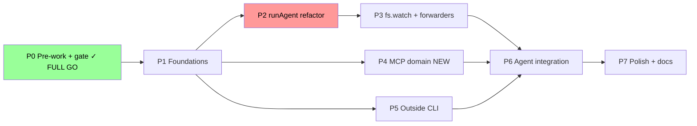

# Flight Plan: Outside/Inside Coordination (Inbox + State + MCP Inside Channel)

**Plan**: [coordination-plan.md](./coordination-plan.md) (8 phases, ~62 tasks, ~70 files)
**Spec**: [coordination-spec.md](./coordination-spec.md) (37 ACs once P0 spec-polish merges workshop 007 + 008 additions)
**Workshops**: 8 — [001-filesystem-layout](./workshops/001-filesystem-layout.md) · [002-state-machine](./workshops/002-state-machine.md) · [003-mcp-tool-surface](./workshops/003-mcp-tool-surface.md) · [004-spawn-config-injection](./workshops/004-spawn-config-injection.md) · [005-preamble-and-prompting](./workshops/005-preamble-and-prompting.md) · [006-test-fixtures](./workshops/006-test-fixtures.md) · [007-user-journey-coder-and-reviewer](./workshops/007-user-journey-coder-and-reviewer.md) · [008-inside-outside-prompting-and-retro](./workshops/008-inside-outside-prompting-and-retro.md)
**Research**: [research-dossier.md](./research-dossier.md) + [external-research/](./external-research/) (5 files)
**Generated**: 2026-04-26 (plan-1b initial; revised after workshop 007 daemon-light pivot; plan-3 generated 2026-04-26)
**Status**: **Phase 1 LANDED** — coordination foundations shipped. 4 JSON schemas + 4 new runner modules (`state.ts`, `context.ts`, `atomic-write.ts`, `ulid.ts`) + extensions to `folder.ts`, `types.ts`, `index.ts`. 230/230 tests pass; pre-vs-post-P1 baseline diff exit=0 across 10 files; zero behavior change to existing 9 agents. `RetrospectiveCoordination` and `MagicWandTarget` widening explicitly deferred to P6 (no type-vs-validator drift). **P2 unlocked.**

Phase 0 LANDED 2026-04-26 — all 4 scratch tests executed; FULL GO memo at [prework-results.md](./prework-results.md); spec polished to 37 ACs.

---

## What & Why

minih is synchronous one-shot today. Outside callers (Claude Code, CI, humans) and inside agents (running in the SDK session) have no way to coordinate progress mid-task — no inbox, no shared state, no signal exchange. This plan adds three coordination primitives so a future eventing/daemon plan (file changes drive an inside agent reacting in real time) becomes additive instead of a rewrite.

**The three primitives**: (1) outside/inside command split with context detection; (2) per-agent inbox (NDJSON, two lanes); (3) first-class outside-state and inside-state with schema-validated phases and gated transitions (e.g., inside cannot transition to `complete` until outside is `done`).

## Scope

| In Scope | Out of Scope |
|----------|--------------|
| Outside CLI commands (`outside-send`, `outside-inbox-list`, `state get/set/transition`) | File watcher, daemon mode, supervisor, pidfile, IPC sockets |
| Inside-channel MCP server (per-run, baked-in context) | `minih serve --mcp` (full external MCP surface, post-V1) |
| `runner/state.ts` transition rules + JSON schemas | Multi-agent fan-out beyond outside↔inside pair |
| `runner/context.ts` + `MINIH_CONTEXT` env var | Migration of legacy shellout commands (`check`, `validate`) to MCP |
| `agents/<slug>/{inbox,state}/` per-agent-shared filesystem layout | MCP server-push notifications during a single turn |
| Inbox/state snapshots into run folder | Inbox retention / state pruning (defer) |
| Preamble + SYSTEM_OUTPUT_INSTRUCTIONS additions | Backwards-incompatible changes to existing agents |
| New `mcp` domain (4th alongside cli/runner/adapter) | Changes to `@github/copilot-sdk` peer dep version |

## Domains Touched

- **cli** — modify: outside subcommands, preAction context-blocking hook, inside-MCP spawn integration
- **runner** — modify: state.ts (rules + types), context.ts, folder.ts (inbox/state path helpers), schemas (outside-state, inside-state, inbox-message), preamble + SYSTEM_OUTPUT_INSTRUCTIONS
- **adapter** — modify (minimal): thread additional `mcpServers` entry for inside-channel server
- **mcp** — **NEW**: spawn the inside-only MCP server, define `inbox.*` and `state.*` tools, bake per-run context at spawn time, rely on `client.stop()` cascade for cleanup

Dependency direction stays strictly downward: `cli → mcp → runner → adapter` (sibling sub-edge `cli → runner`, no cycles).

## Complexity: CS-4 (large) — borderline CS-5 after daemon-light pivot

S=2, I=1, D=2, N=2, F=1, T=2 · Confidence: 0.70 (down from 0.80 after the runAgent event-driven refactor + fs.watch were pulled into v1)

> **Architectural pivot 2026-04-26 (workshop 007 update)**: live cross-process delivery via fs.watch + session.send is now v1-default, not v2-deferred. This adds: (a) refactor of `runAgent` from `sendAndWait` to event-driven (`session.send` + `session.idle` subscription), (b) native `node:fs.watch` adapter with debounce + atomic-rename handling, (c) terminal-condition machinery in `runAgent`. Pre-work scratch tests recommended before locking spec — see workshop 007 §"Pre-Work Required Before Implementation".

## Key Findings (from research)

| # | Impact | Finding |
|---|--------|---------|
| 01 | Critical | Inside surface = MCP, decided 2026-04-26. Spawn config bakes per-run context (mirrors today's `MINIH_*` env-var hidden-context pattern). |
| 02 | Critical | MCP server leak (Issue #1132) NOT REPRODUCED in our pattern — `client.stop()` cascade reaps within 5s. Regression test required. |
| 03 | Critical | State transition rules belong in pure TS (`state.ts`), not JSON Schema — confirmed by every surveyed agent harness (XState, Conductor, Stateless). JSON Schema validates *shape* only. |
| 04 | Critical | File watcher PULLED INTO v1 (was deferred to plan 008). Use native `node:fs.watch` per chainglass (small dirs are fine; FD problem only manifests on large trees). Required for the daemon-light cross-process delivery pattern in workshop 007. |
| 05 | High | Per-agent shared inbox/state (not per-run isolation) is required by user's coordination use case. Per-run snapshots preserve reproducibility. |
| 06 | High | Claude Code's MCP-tool inside-surface validates our architecture choice. AutoGen + LangGraph validate the rest of the design. |
| 07 | Medium | SDK has 30-min idle timeout for in-memory sessions; on-disk persists until explicit `client.deleteSession`. `client.listSessions(filter)` is the canonical liveness probe — relevant to future eventing plan, less critical here. |

## Phases (locked in plan)

| Phase | Title | Primary Domain | CS | Depends On |
|-------|-------|----------------|----|------------|
| 0 | Pre-Work Scratch Tests + Decision Gate | — (scratch/) | CS-2 | None |
| 1 | Runner Foundations (schemas, state, context, folder, atomic-write, ULID) | runner | CS-3 | P0 |
| 2 | runAgent Event-Driven Refactor + Preamble Builder | runner + adapter | CS-4 | P0, P1 |
| 3 | File Watcher + Daemon-Light Forwarders | runner | CS-3 | P2 |
| 4 | MCP Domain (NEW) — six tools + spawn + leak regression | mcp | CS-3 | P1 |
| 5 | Outside CLI Surface — 6 new commands + preAction context block | cli | CS-3 | P1 |
| 6 | Agent Integration & Prompting (workshops 005 + 008) | runner + cli | CS-3 | P2, P4, P5 |
| 7 | Polish & Docs — `mcp/domain.md`, registry, domain-map, READMEs | docs | CS-2 | P6 |

**Critical path**: P0 → P1 → P2 → P3 → P6 → P7. P4 and P5 can be parallelized after P1.

## Open Decisions — RESOLVED (workshops 001-008)

All 9 spec open questions resolved in workshops; no clarify pass needed before implementation:

| Open Question (spec) | Resolved in | Resolution |
|----------------------|-------------|------------|
| Inbox retention policy | Workshop 001 | Keep forever in v1; pruning deferred |
| `inbox.ack` mechanics | Workshop 001 | Append-record + watermark (preserves NDJSON append-only invariant) |
| Default phase enums | Workshop 002 (down-scoped) | Free-form strings; agents declare conventions in their own prompts; no minih-supplied enum |
| Frontmatter declaration vs implicit | Workshop 005 | Explicit opt-in via `coordination: enabled` |
| Initial state auto-creation | Workshop 001 | Lazy create on first write (no `state init` command) |
| Outside agent persona | Workshop 008 | Outside is host caller; `outside.md` documents the contract; no separate "outside agent" runtime |
| Per-agent vs cross-agent inbox | Workshop 001 | Per-agent only in v1; cross-agent shared lanes deferred |
| Outside-side state access | Workshop 003 | Asymmetric: outside writes outside only; inside writes inside only |
| Inbox sender identity | Workshop 001 | `outside | inside` only; no richer caller metadata in v1 |

## Workshop Opportunities — ALL ADDRESSED

All 6 workshop opportunities from the spec have been completed (and 2 more added during the daemon-light pivot + prompting deep-dive):

1. ✅ **Filesystem layout** → workshop 001
2. ✅ **MCP tool surface** → workshop 003
3. ✅ **State machine** → workshop 002 (down-scoped to convention-based)
4. ✅ **Spawn-config injection** → workshop 004
5. ✅ **Preamble & SYSTEM_OUTPUT_INSTRUCTIONS** → workshop 005
6. ✅ **Test fixtures for two-agent coordination** → workshop 006
7. ✅ **User journey: coder + reviewer** → workshop 007 (added during daemon-light pivot)
8. ✅ **Inside/outside prompting & cross-side retro** → workshop 008 (added for the per-agent two-sided contract + outside retros)

## Acceptance Criteria Summary

**37 ACs total**, grouped (full roll-up in [coordination-plan.md](./coordination-plan.md) §"Acceptance Criteria — Full Roll-Up"):

- **Context detection & blocking** (2): AC-CTX-DETECT, AC-CTX-BLOCK
- **Outside surface** (3): AC-OUTSIDE-SEND, AC-OUTSIDE-LIST, AC-STATE-OUTSIDE-WRITE
- **Inside surface** (5): AC-INSIDE-LIST, AC-INSIDE-SEND, AC-INSIDE-ACK, AC-STATE-INSIDE-READ, AC-STATE-TRANSITION-OK
- **MCP plumbing** (2): AC-MCP-CLEAN, AC-MCP-COEXIST
- **Compatibility & docs** (4): AC-BACKWARD-COMPAT, AC-RUN-FOLDER, AC-ENV-VARS, AC-DOMAIN-MAP
- **Daemon-light** (10) — workshop 007: AC-LIVE-PUSH-INBOX, AC-LIVE-PUSH-STATE, AC-FORWARD-ON-RESUME, AC-FORWARD-IDEMPOTENT, AC-DEBOUNCE-BURSTS, AC-FORWARD-VISIBILITY, AC-NOTHING-TO-DELIVER, AC-WATERMARK-FRESH-START, AC-RUN-AGENT-EVENT-DRIVEN, AC-SINGLE-RUN-PER-AGENT
- **Prompting & retro** (10) — workshop 008: AC-PROMPT-INSIDE-IDENTITY, AC-PROMPT-PEER-CONTRACT, AC-OUTSIDE-CONTEXT-CLI, AC-OUTSIDE-RETRO, AC-RETROS-AGGREGATOR, AC-MAGIC-WAND-COORDINATION, AC-RETRO-COORDINATION-OPTIONAL, AC-INIT-COORDINATED-OUTSIDE-MD, AC-DOCTOR-OUTSIDE-MD-DRIFT, AC-DOCTOR-OUTSIDE-MD-SIZE

> The 20 workshop-derived ACs (daemon-light + prompting) are scheduled to be merged into `coordination-spec.md` as the first task of P0 (`0.6 — Spec polish pass`) so the spec stays the canonical reference.

## Flight Status

```mermaid
graph LR
    Spec[Spec written]:::done
    WS[8 workshops complete]:::done
    Plan[Plan generated 2026-04-26]:::done
    P0[P0 scratch tests + memo<br/>✓ FULL GO 2026-04-26]:::done
    SP[Spec polish: 37 ACs<br/>✓ merged 2026-04-26]:::done
    P1[P1 Runner Foundations<br/>✓ LANDED 2026-04-26]:::done
    P2[P2 runAgent event-driven]:::next
    Phases[P3-P7 implementation]:::pending
    Done[37 ACs verified]:::pending

    Spec --> WS
    WS --> Plan
    Plan --> P0
    P0 --> SP
    SP --> P1
    P1 --> P2
    P2 --> Phases
    Phases --> Done

    classDef done fill:#9f9,color:#000
    classDef next fill:#ff9,color:#000
    classDef pending fill:#ddd,color:#000
```

---

*Next (recommended)*:

1. ~~`/plan-4-complete-the-plan`~~ ✓ done (verdict: READY, 0 HIGH/MEDIUM after cleanup pass)
2. ~~Execute P0 scratch tests~~ ✓ done — all 4 executed, FULL GO with latency caveat
3. ~~Spec polish (20 ACs)~~ ✓ done — `coordination-spec.md` now has 37 ACs
4. ~~`/plan-5-v2-phase-tasks-and-brief` for P1~~ ✓ done — dossier + flight plan generated, validated (4-agent broad sweep)
5. ~~`/plan-6-v2-implement-phase` for P1~~ ✓ done — 230/230 tests, baseline diff exit=0, zero regressions
6. **`/plan-7-v2-code-review --phase "Phase 1: Runner Foundations" --plan "docs/plans/007-backgrounding/coordination-plan.md"`** — formal phase review (recommended next)
7. Then `/plan-5-v2-phase-tasks-and-brief --phase "Phase 2: runAgent Event-Driven Refactor + Preamble Builder"` to start P2

---

## Flight Log

| Date | Phase | Outcome | Note |
|------|-------|---------|------|
| 2026-04-26 | Spec written | done | 17 ACs, 9 open questions, 4 domains |
| 2026-04-26 | 8 workshops complete | done | 001-008; resolved all 9 open questions |
| 2026-04-26 | Plan generated | done | CS-4, 8 phases, ~62 tasks, ~70 files |
| 2026-04-26 | plan-4 validation | READY | 0 HIGH after cleanup pass |
| 2026-04-26 | Phase 0 scratch tests | FULL GO with caveat | T001+T002+T004 full PASS; T003 mechanical PASS / agent-latency caveat per ws007 fallback |
| 2026-04-26 | Spec polish (20 ACs) | done | Spec now has 37 ACs total; AC-STATE-TRANSITION-GATED removed inline |
| 2026-04-26 | Phase 1 dossier (plan-5) | done | 10 tasks expanded from plan-3 1.1-1.10; reordered for dependency correctness; broad 4-agent validation surfaced 27 issues, 9 HIGH fixed inline pre-implementation |
| 2026-04-26 | Phase 1 implementation (plan-6) | LANDED | 4 schemas + 4 new modules + 3 modified + 5 new test files + 2 baseline scripts; 230/230 tests pass; baseline diff exit=0 across 10 files; zero behavior change to existing 9 agents; `MagicWandTarget`/`RetrospectiveCoordination` correctly deferred to P6 (no type-vs-validator drift); ajv-formats added for live `format: date-time` validation |
