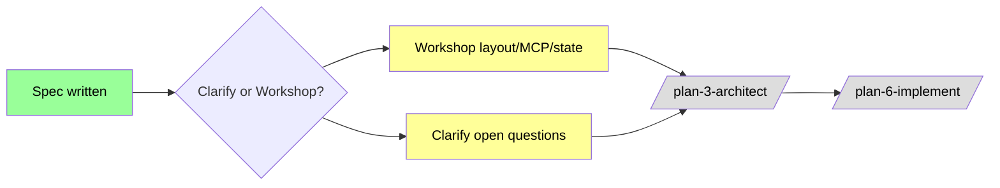

# Flight Plan: Outside/Inside Coordination (Inbox + State + MCP Inside Channel)

**Plan**: _(not yet generated; run `/plan-3-architect` after clarify/workshop)_
**Spec**: [coordination-spec.md](./coordination-spec.md)
**Research**: [research-dossier.md](./research-dossier.md) + [external-research/](./external-research/) (5 files)
**Generated**: 2026-04-26
**Status**: Specifying

---

## What & Why

minih is synchronous one-shot today. Outside callers (Claude Code, CI, humans) and inside agents (running in the SDK session) have no way to coordinate progress mid-task — no inbox, no shared state, no signal exchange. This plan adds three coordination primitives so a future eventing/daemon plan (file changes drive an inside agent reacting in real time) becomes additive instead of a rewrite.

**The three primitives**: (1) outside/inside command split with context detection; (2) per-agent inbox (NDJSON, two lanes); (3) first-class outside-state and inside-state with schema-validated phases and gated transitions (e.g., inside cannot transition to `complete` until outside is `done`).

## Scope

| In Scope | Out of Scope |
|----------|--------------|
| Outside CLI commands (`outside-send`, `outside-inbox-list`, `state get/set/transition`) | File watcher, daemon mode, supervisor, pidfile, IPC sockets |
| Inside-channel MCP server (per-run, baked-in context) | `minih serve --mcp` (full external MCP surface, post-V1) |
| `runner/state.ts` transition rules + JSON schemas | Multi-agent fan-out beyond outside↔inside pair |
| `runner/context.ts` + `MINIH_CONTEXT` env var | Migration of legacy shellout commands (`check`, `validate`) to MCP |
| `agents/<slug>/{inbox,state}/` per-agent-shared filesystem layout | MCP server-push notifications during a single turn |
| Inbox/state snapshots into run folder | Inbox retention / state pruning (defer) |
| Preamble + SYSTEM_OUTPUT_INSTRUCTIONS additions | Backwards-incompatible changes to existing agents |
| New `mcp` domain (4th alongside cli/runner/adapter) | Changes to `@github/copilot-sdk` peer dep version |

## Domains Touched

- **cli** — modify: outside subcommands, preAction context-blocking hook, inside-MCP spawn integration
- **runner** — modify: state.ts (rules + types), context.ts, folder.ts (inbox/state path helpers), schemas (outside-state, inside-state, inbox-message), preamble + SYSTEM_OUTPUT_INSTRUCTIONS
- **adapter** — modify (minimal): thread additional `mcpServers` entry for inside-channel server
- **mcp** — **NEW**: spawn the inside-only MCP server, define `inbox.*` and `state.*` tools, bake per-run context at spawn time, rely on `client.stop()` cascade for cleanup

Dependency direction stays strictly downward: `cli → mcp → runner → adapter` (sibling sub-edge `cli → runner`, no cycles).

## Complexity: CS-4 (large)

S=2, I=1, D=2, N=1, F=1, T=2 · Confidence: 0.80

## Key Findings (from research)

| # | Impact | Finding |
|---|--------|---------|
| 01 | Critical | Inside surface = MCP, decided 2026-04-26. Spawn config bakes per-run context (mirrors today's `MINIH_*` env-var hidden-context pattern). |
| 02 | Critical | MCP server leak (Issue #1132) NOT REPRODUCED in our pattern — `client.stop()` cascade reaps within 5s. Regression test required. |
| 03 | Critical | State transition rules belong in pure TS (`state.ts`), not JSON Schema — confirmed by every surveyed agent harness (XState, Conductor, Stateless). JSON Schema validates *shape* only. |
| 04 | High | File watcher choice for the future plan: native `node:fs.watch` not chokidar (chainglass evidence: chokidar = 25k FDs for 5k files → `spawn EBADF`). Defer to plan 008. |
| 05 | High | Per-agent shared inbox/state (not per-run isolation) is required by user's coordination use case. Per-run snapshots preserve reproducibility. |
| 06 | High | Claude Code's MCP-tool inside-surface validates our architecture choice. AutoGen + LangGraph validate the rest of the design. |
| 07 | Medium | SDK has 30-min idle timeout for in-memory sessions; on-disk persists until explicit `client.deleteSession`. `client.listSessions(filter)` is the canonical liveness probe — relevant to future eventing plan, less critical here. |

## Phases (suggested — to be refined in `/plan-3`)

```
P1  Foundations: schemas, runner/state.ts, runner/context.ts, folder.ts extensions, run-folder layout
P2  Outside surface: commander subcommands + preAction context-block hook + tests
P3  mcp domain: pick library, build spawn module, integrate with sdk-runtime, regression test for AC-MCP-CLEAN
P4  Agent integration: preamble + SYSTEM_OUTPUT_INSTRUCTIONS additions; new mcp-coordination smoke-test agent
P5  Polish: domain.md for mcp, update domain-map.md + registry.md, README/AGENTS_README/CONTRIBUTING updates
```

## Open Decisions (from spec — to resolve in clarify or workshop)

- Inbox retention policy (default leaning: keep forever, defer pruning)
- `inbox.ack` mechanics (in-place vs append-record)
- Default phase enums for outside/inside states; per-agent overridable?
- Frontmatter declaration vs implicit-by-tool-use
- Initial state auto-creation vs explicit init command
- Outside-side state write access (asymmetric: outside writes outside only; inside writes inside only)
- Inbox/state per-agent vs per-slug-and-namespace (default: per-agent, no cross-agent in v1)

## Workshop Opportunities (from spec)

1. **Filesystem layout for inbox & state** (Storage Design) — load-bearing for reproducibility + future eventing
2. **MCP tool surface design** (API Contract) — the inside-agent contract, hard to change later
3. **State machine — phases, transitions, history** (State Machine) — encodes the user's invariant
4. **Spawn-config injection & MCP child ergonomics** (Integration Pattern) — load-bearing pattern for cleanliness
5. **Preamble & SYSTEM_OUTPUT_INSTRUCTIONS additions** (Other / Prompting) — too much bloats prompts; too little and agents miss the surface
6. **Test fixtures for two-agent coordination** (Other / Testing) — current fixture set doesn't cover this

**Recommended**: workshop at minimum the first three (layout, MCP tools, state machine) before `/plan-3-architect`.

## Acceptance Criteria Summary

17 criteria in the spec, grouped:
- Context detection & blocking: AC-CTX-DETECT, AC-CTX-BLOCK
- Outside surface: AC-OUTSIDE-SEND, AC-OUTSIDE-LIST, AC-STATE-OUTSIDE-WRITE
- Inside surface: AC-INSIDE-LIST, AC-INSIDE-SEND, AC-INSIDE-ACK, AC-STATE-INSIDE-READ
- State machine: AC-STATE-TRANSITION-GATED, AC-STATE-TRANSITION-OK
- MCP plumbing: AC-MCP-CLEAN, AC-MCP-COEXIST
- Compatibility & docs: AC-BACKWARD-COMPAT, AC-RUN-FOLDER, AC-ENV-VARS, AC-DOMAIN-MAP

## Flight Status



---

*Next (recommended): `/plan-2c-workshop` — multiple workshop opportunities identified. Alternative: `/plan-2-v2-clarify` to resolve the 9 open questions in the spec first.*
