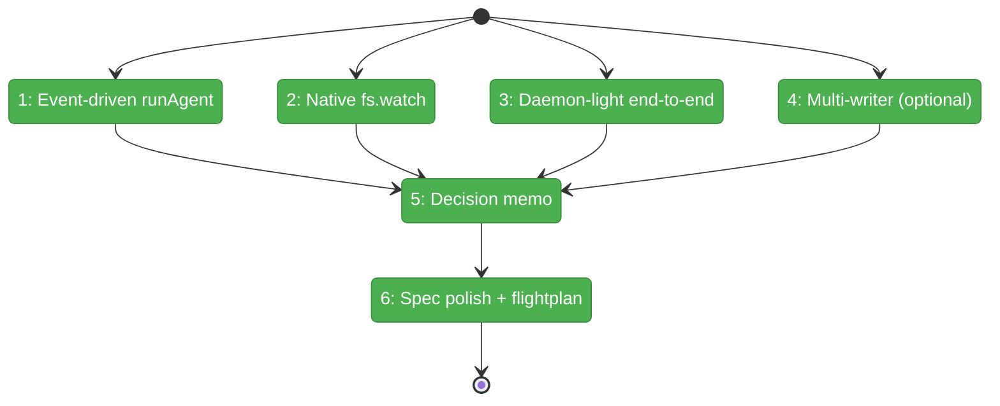

# Flight Plan: Phase 0 — Pre-Work Scratch Tests and Decision Gate

**Plan**: [coordination-plan.md](../../coordination-plan.md)
**Phase**: Phase 0: Pre-Work Scratch Tests + Decision Gate
**Generated**: 2026-04-26
**Status**: 🛬 **Landed** — all 6 tasks complete. P1 unlocked.

---

## Departure → Destination

**Where we are**: minih is synchronous one-shot. The plan (CS-4, 8 phases) specifies a daemon-light architecture as v1 default — `runAgent` becomes event-driven; native `node:fs.watch` pushes outside file changes into a live SDK session via `session.send`. Workshop 007 explicitly flags this as a load-bearing pivot that needs empirical validation before any production code commits. Scratch infrastructure exists (`scratch/midturn-test/`); no Phase 0 deliverables exist yet.

**Where we're going**: A developer can read `prework-results.md` and see explicit GO / NO-GO per scratch test with measured latency numbers. On GO, the spec contains all 37 ACs (17 original + 10 daemon-light from workshop 007 + 10 prompting/retro from workshop 008), the flight-plan status moves from "Plan ready" to "Implementation ready (P1+)", and Phase 1 starts with confidence the daemon-light design holds. On NO-GO, the failure-mode fallback per scratch test is documented and the team revisits workshop 007 before any further P1 work.

---

## Domain Context

### Domains We're Changing

| Domain | What Changes | Key Files |
|--------|--------------|-----------|
| `scratch` (not a production domain) | 4 new throwaway tests + READMEs (T004 elevated from optional per Critical Insights 2026-04-26 #1) | `scratch/runagent-eventdriven/`, `scratch/fswatch-test/`, `scratch/daemon-light-prototype/`, `scratch/multi-process-watch/` |
| `docs` (cross-domain) | New decision memo; conditional spec + flight-plan polish on GO | `docs/plans/007-backgrounding/prework-results.md`, `coordination-spec.md`, `coordination.fltplan.md` |

### Domains We Depend On (no changes)

| Domain | What We Consume | Contract |
|--------|-----------------|----------|
| `@github/copilot-sdk` (peer dep) | `CopilotClient`, `createSession`, `session.send`, `session.idle`, `pending_messages.modified` event | SDK public API (vendored at `node_modules/@github/copilot-sdk/dist/index.js`) |
| `node:fs` / `node:fs/promises` | `fs.watch`, `appendFile`, `mkdir` | Node stdlib |
| `node:child_process` | `spawn` (for sibling-writer in T002/T003/T004) | Node stdlib |
| `node:assert` | structural assertions in scratch tests | Node stdlib |
| `process.env.GH_TOKEN` | SDK auth | env var (per existing scratch convention) |

No production domain (`runner`, `cli`, `adapter`, `mcp`) is touched by Phase 0. Phase 0 produces evidence that *informs* P1+, not code that runs in production.

---

## Flight Status

<!-- Updated by /plan-6-v2: pending → active → done. Use blocked for problems/input needed. -->

**Legend**: grey = pending | yellow = active | red = blocked/needs input | green = done

---

## Stages

<!-- Updated by /plan-6-v2 during implementation: [ ] → [~] → [x] -->

- [x] **Stage 1: Prove event-driven runAgent** ✓ single 6.3s elapsed + queued 10s (both stages received own turn); `sentAndWaitUsed: false` — minimal SDK session uses `session.send` + idle subscription end-to-end, no `sendAndWait`. (`scratch/runagent-eventdriven/test.mjs` — new file)
- [x] **Stage 2: Prove native fs.watch** ✓ mean 15.45ms detection, p99 39ms, zero missed across 100 writes; atomic-rename observable; burst coalesces 50:1 — measure detection latency from sibling subprocess, document atomic-rename + burst patterns. (`scratch/fswatch-test/test.mjs` — new file)
- [x] **Stage 3: Prove daemon-light end-to-end** ⚠️ mechanical PASS (5/5 forwarded + acked, forwarder <100ms, no double-delivery, no parse failures, idle reached) / latency caveat (10-17s round-trip from agent reasoning per turn — workshop 007 §Failure-mode fallback documented v1 acceptance) — combine stages 1+2; child writes inbox file → fs.watch fires → forwarder calls `session.send` → in-flight agent receives within 5s. (`scratch/daemon-light-prototype/test.mjs` — new file; load-bearing)
- [x] **Stage 4 (REQUIRED): Prove multi-writer NDJSON safety + torn-line resilience** ✓ multi-writer 200/200 lines, even split, zero parse fails. Torn-line: complete preserved, partial left intact, completion picked up on next pass, garbage triggers conservative-stop. — two simultaneous appenders + a forwarder reading mid-write; either complete line OR safe parse-failure-skip-without-watermark-advance. (`scratch/multi-process-watch/test.mjs` — new file; elevated from optional per Critical Insights 2026-04-26 #1)
- [x] **Stage 5: Decision memo** ✓ partial-GO memo at `prework-results.md`; T002+T004 empirical PASS recorded; T001+T003 placeholders pending user execution — one-page pass/fail per stage + GO/NO-GO recommendation; if NO-GO, name the workshop 007 fallback. (`docs/plans/007-backgrounding/prework-results.md` — new file)
- [x] **Stage 6 (conditional on GO): Spec polish + flight-plan status update** ✓ 20 ACs merged (10 daemon-light + 10 prompting/retro); spec now has 37 total; AC-STATE-TRANSITION-GATED removed inline; plan-level flight plan status moved to "Phase 0 LANDED, P1 unlocked" — merge 20 workshop ACs into spec; bump flight-plan status to "Implementation ready". (`coordination-spec.md`, `coordination.fltplan.md` — modify)

---

## Architecture: Before & After

```mermaid
flowchart LR
    classDef existing fill:#E8F5E9,stroke:#4CAF50,color:#000
    classDef changed fill:#FFF3E0,stroke:#FF9800,color:#000
    classDef new fill:#E3F2FD,stroke:#2196F3,color:#000

    subgraph Before["Before Phase 0"]
        B1[scratch/midturn-test]:::existing
        B2[plan + spec + 8 workshops]:::existing
        B3[research-dossier + 5 external-research files]:::existing
    end

    subgraph After["After Phase 0 (GO path)"]
        A1[scratch/midturn-test]:::existing
        A2[scratch/runagent-eventdriven]:::new
        A3[scratch/fswatch-test]:::new
        A4[scratch/daemon-light-prototype]:::new
        A5["scratch/multi-process-watch (optional)"]:::new
        A6[prework-results.md memo]:::new
        A7[coordination-spec.md +20 ACs]:::changed
        A8[coordination.fltplan.md status]:::changed
    end

    Before --> After
```

**Legend**: existing (green, unchanged) | changed (orange, modified) | new (blue, created)

---

## Acceptance Criteria

- [ ] Each scratch test (T001, T002, T003) produces stderr output with measured numbers (latency, success counts, ordering)
- [ ] T001 confirms event-driven runAgent reaches idle ≤ 60s with no orphan SDK processes
- [x] T002 confirms mean fs.watch detection latency ≤ 50ms across 100 writes; zero missed events; atomic-rename pattern documented. *(Code threshold deliberately relaxed to ≤ 500ms + ≥ 50% paired to account for fs.watch coalescing; actual mean 15.45ms far exceeds both — see Discovery #1 in dossier.)*
- [ ] T003 confirms cross-process write → in-flight agent receive ≤ 5s; ordering correct across 5 rapid writes
- [ ] T004 confirms multi-writer NDJSON appends survive without truncation AND forwarder mid-write race is self-healing (parse-fail skip, no watermark advance, retry on next event succeeds)
- [ ] T005 produces `prework-results.md` with explicit GO / NO-GO recommendation in final paragraph
- [ ] T006 (only on GO) merges all 20 workshop ACs into `coordination-spec.md` verbatim; existing AC IDs unchanged; flight-plan status updated

## Goals & Non-Goals

**Goals**:
- Validate the daemon-light architectural pivot empirically before P1 commits
- Produce a load-bearing decision memo that subsequent phases cite
- Merge workshop ACs into the spec on GO so phases 1-7 can reference them by ID
- Update flight-plan status to reflect "Implementation ready"

**Non-Goals**:
- Production code in `src/`
- Refactoring `runAgent` itself (Phase 2's job)
- Wiring scratch tests into vitest CI
- Adding new npm dependencies (e.g., `@modelcontextprotocol/sdk`) — that's Phase 4

---

## Checklist

- [x] T001: `scratch/runagent-eventdriven/test.mjs` + README ✓ both single + queued PASS
- [x] T002: Build `scratch/fswatch-test/test.mjs` + README ✓ all 3 scenarios pass
- [x] T003: `scratch/daemon-light-prototype/test.mjs` + README ⚠️ mechanical PASS, latency caveat (workshop 007 fallback applies)
- [x] T004 (REQUIRED): Build `scratch/multi-process-watch/test.mjs` + README ✓ both scenarios pass; torn-line forwarder protocol empirically validates didyouknow #1
- [x] T005: Write `docs/plans/007-backgrounding/prework-results.md` decision memo ✓ partial-GO recommendation
- [x] T006 (conditional on GO): Spec polish — 20 workshop ACs merged into `coordination-spec.md` (now 37 ACs total); plan-level `coordination.fltplan.md` status updated to "Phase 0 LANDED, P1 unlocked"
