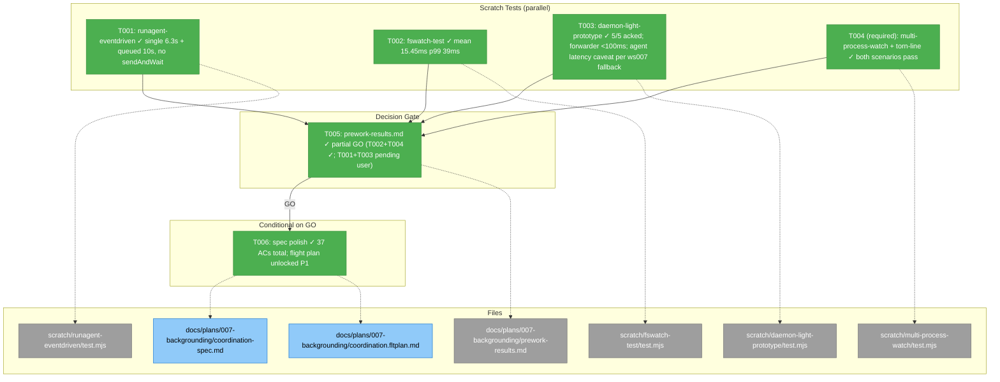
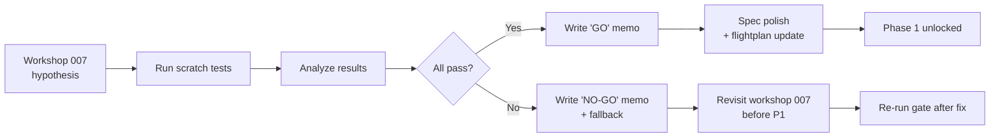
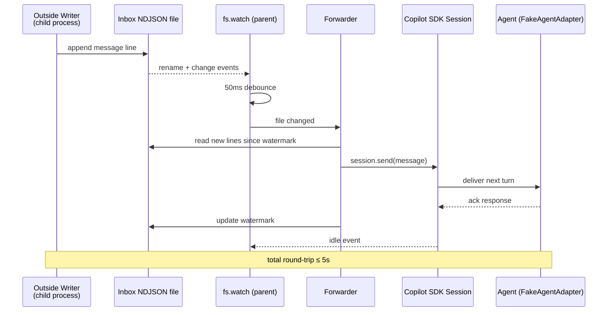

# Phase 0 — Pre-Work Scratch Tests + Decision Gate

**Plan**: [coordination-plan.md](../../coordination-plan.md)
**Phase**: Phase 0: Pre-Work Scratch Tests + Decision Gate
**Generated**: 2026-04-26
**Status**: 🛬 **Landed** — all 6 tasks complete; daemon-light architecture empirically validated; spec polished (37 ACs); code-review APPROVE (0 critical/high, 1 medium addressed, 3 low addressed); P1 unlocked

---

## Executive Briefing

**Purpose**: Empirically validate the assumptions underlying the daemon-light architectural pivot (workshop 007) BEFORE any production code commits in Phase 1+. Three (optionally four) throwaway scratch tests prove that an event-driven `runAgent` + native `node:fs.watch` + cross-process push pattern actually works end-to-end. The phase concludes with a decision-gate memo at `prework-results.md`: pass → proceed to P1 + spec polish; fail → revisit design with the documented fallbacks per workshop 007.

**What We're Building**:
- 4 throwaway scratch tests under `scratch/` (each a standalone `.mjs` file using the vendored `@github/copilot-sdk` via absolute `node_modules` path — same pattern as the existing `scratch/midturn-test/test.mjs`). T004 was elevated from optional to required per Critical Insights 2026-04-26 #1 (NDJSON torn-line race).
- A one-page decision memo at `docs/plans/007-backgrounding/prework-results.md` with pass/fail per scratch test + explicit GO / NO-GO recommendation
- (Conditional on GO) Spec polish pass merging the 10 daemon-light ACs (workshop 007) + 10 prompting/retro ACs (workshop 008) into `coordination-spec.md`
- (Conditional on GO) Flight plan status update from "Plan ready (P0 pending)" → "Implementation ready (P1+)"

**Goals**:
- ✅ Prove a `runAgent`-shaped flow can run with `session.send` + idle subscription only (no `sendAndWait`) — workshop 007 §"Pre-Work Required" test #1
- ✅ Prove native `node:fs.watch` reliably detects sibling-process writes within ≤ 50ms mean and survives atomic-rename/burst patterns — workshop 007 test #2
- ✅ Prove the end-to-end daemon-light pattern: cross-process write → fs.watch → forwarder → SDK queue → in-flight agent receives within ≤ 5s — workshop 007 test #3
- ✅ Decide GO / NO-GO before any production code is touched
- ✅ On GO: merge the 20 net-new workshop ACs into the spec so Phase 5+ can reference them by ID

**Non-Goals**:
- ❌ Any production code in `src/` — these are throwaway exploratory tests
- ❌ A new test runner — vitest stays for production tests; scratch uses raw `node` + `node:assert`
- ❌ Code coverage / formal CI integration — empirical evidence only
- ❌ Refactoring `runAgent` itself (that's Phase 2)
- ❌ Wiring scratch results into automated regression tests (the production regression tests are written in Phases 2-6)

---

## Prior Phase Context

**N/A** — Phase 0 is the first phase. No prior phases to review.

(Note: Phase 0 itself is the prior context for Phase 1+. Its `prework-results.md` memo will be the load-bearing artifact that subsequent phases cite when they reference the daemon-light design assumptions.)

---

## Pre-Implementation Check

| File | Exists? | Domain | Notes |
|------|---------|--------|-------|
| `/Users/jordanknight/substrate/minih/scratch/midturn-test/test.mjs` | YES | scratch | Reference pattern. Absolute SDK import: `from '/Users/jordanknight/.../node_modules/@github/copilot-sdk/dist/index.js'`. `GH_TOKEN`-gated. Raw `console.error` for output. Match this style. |
| `/Users/jordanknight/substrate/minih/scratch/runagent-eventdriven/test.mjs` | NO | scratch | NEW |
| `/Users/jordanknight/substrate/minih/scratch/runagent-eventdriven/README.md` | NO | scratch | NEW |
| `/Users/jordanknight/substrate/minih/scratch/fswatch-test/test.mjs` | NO | scratch | NEW |
| `/Users/jordanknight/substrate/minih/scratch/fswatch-test/README.md` | NO | scratch | NEW |
| `/Users/jordanknight/substrate/minih/scratch/daemon-light-prototype/test.mjs` | NO | scratch | NEW |
| `/Users/jordanknight/substrate/minih/scratch/daemon-light-prototype/README.md` | NO | scratch | NEW |
| `/Users/jordanknight/substrate/minih/scratch/multi-process-watch/test.mjs` | NO | scratch | NEW (REQUIRED, T004) — covers torn-line + multi-writer per Critical Insights #1 |
| `/Users/jordanknight/substrate/minih/scratch/multi-process-watch/README.md` | NO | scratch | NEW |
| `/Users/jordanknight/substrate/minih/docs/plans/007-backgrounding/prework-results.md` | NO | docs | NEW (decision memo) |
| `/Users/jordanknight/substrate/minih/docs/plans/007-backgrounding/coordination-spec.md` | YES | docs | MODIFY only on GO — add 20 ACs from workshops 007 + 008 |
| `/Users/jordanknight/substrate/minih/docs/plans/007-backgrounding/coordination.fltplan.md` | YES | docs | MODIFY on phase completion (status line + flight-status mermaid) |

**Anti-reinvention check**:
- Existing `scratch/midturn-test/test.mjs` already empirically validates SDK queue semantics for mid-turn `session.send` (per `external-research/sdk-mid-turn-injection.md`). T001 (event-driven `runAgent`) is a related but distinct hypothesis — focus on the runAgent assembly shape, not on re-proving queue semantics.
- No need for a fresh package.json under `scratch/` — use `process.cwd()` from the repo root and absolute `node_modules` import paths (per existing pattern).

**Harness**: No agent harness exists; minih's CLI + vitest IS the harness. Scratch tests use raw `node`, not vitest. No harness validation needed for Phase 0.

**Doctrine**: scratch/ files MUST NOT be imported by anything in `src/` — workshops 005/007 explicitly call out scratch as throwaway. tsconfig + vitest already exclude `scratch/` from production builds.

---

## Architecture Map



---

## Tasks

| Status | ID | Task | Domain | Path(s) | Done When | Notes |
|--------|-----|------|--------|---------|-----------|-------|
| [x] | T001 | Build `scratch/runagent-eventdriven/test.mjs` proving a `runAgent`-shaped flow runs end-to-end using only `session.send` + subscribe to session events via `session.on()` (no `sendAndWait`). Include a small README with the hypothesis + how to run. | scratch | `/Users/jordanknight/substrate/minih/scratch/runagent-eventdriven/test.mjs`, `/Users/jordanknight/substrate/minih/scratch/runagent-eventdriven/README.md` | Test agent reaches idle event ≤ 60s; final assistant message captured; no orphan SDK process after `client.stop()` (verified via `pgrep -f minih-mcp` + `ps -A`); test logs round-trip latency to stderr | Workshop 007 §Pre-Work test #1; finding 05; matches `scratch/midturn-test/` import + GH_TOKEN-gated style |
| [x] | T002 | Build `scratch/fswatch-test/test.mjs` measuring native `node:fs.watch` detection latency from a sibling subprocess writer; document atomic-rename event sequence (rename + change vs change-only) and burst behavior across 100 rapid writes. Include README. | scratch | `/Users/jordanknight/substrate/minih/scratch/fswatch-test/test.mjs`, `/Users/jordanknight/substrate/minih/scratch/fswatch-test/README.md` | Mean detection ≤ 50ms across 100 writes; zero missed events (counter on writer side matches counter on watcher side); atomic-rename event pattern documented in README; burst-coalesce strategy (50ms debounce) recommended | Workshop 007 §Pre-Work test #2; finding 04; chainglass FD-exhaustion evidence (research-dossier PL-04) — proves fs.watch alone (not chokidar) is sufficient for our small dirs |
| [x] | T003 | Build `scratch/daemon-light-prototype/test.mjs` combining T001 + T002: spawn child writer that appends to NDJSON inbox file → parent watches via `fs.watch` → forwarder calls `session.send` → in-flight agent (FakeAgentAdapter or real SDK) receives the message before terminal idle. Include README. | scratch | `/Users/jordanknight/substrate/minih/scratch/daemon-light-prototype/test.mjs`, `/Users/jordanknight/substrate/minih/scratch/daemon-light-prototype/README.md` | Round-trip (file write → agent receives) ≤ 5s; ordering correct across 5 rapid writes; agent's final message acknowledges all 5 messages; watermark file pattern validated | Workshop 007 §Pre-Work test #3; this is the load-bearing test — if it fails, the daemon-light design fails |
| [x] | T004 **(REQUIRED — elevated per Critical Insights 2026-04-26 #1)** | Build `scratch/multi-process-watch/test.mjs` proving (a) two simultaneous `outside-send`-shaped writers can append to the same NDJSON inbox file without truncation, AND (b) **a forwarder reading the file while a writer is mid-append either gets a complete line or a `JSON.parse` failure that's safely skipped without advancing the watermark — then forwards cleanly on the next fs.watch event**. Document the writer invariant. | scratch | `/Users/jordanknight/substrate/minih/scratch/multi-process-watch/test.mjs`, `/Users/jordanknight/substrate/minih/scratch/multi-process-watch/README.md` | (a) Both messages present in NDJSON after both writers exit; no partial lines (each line ends in `\n`). (b) Torn-line scenario is self-healing: forwarder skips on parse failure, watermark NOT advanced, next fs.watch event re-reads the (now complete) line and forwards. No message lost; no double-delivery. Invariant documented (single-writer-at-a-time + atomic appendFileSync ≤ PIPE_BUF). | Workshop 007 §Pre-Work test #4 + workshop 001 §Forwarder-side robustness; previously optional, now REQUIRED. If test (b) fails, revisit `flock` for inbox writes BEFORE P3 commits. |
| [x] | T005 | Write decision-gate memo `docs/plans/007-backgrounding/prework-results.md`. Per scratch test: pass/fail, observed numbers vs target, brief notes. Conclude with explicit GO / NO-GO recommendation and (if NO-GO) which workshop 007 fallback applies. | docs | `/Users/jordanknight/substrate/minih/docs/plans/007-backgrounding/prework-results.md` | One-page memo exists; covers all 3-4 scratch tests; explicit recommendation in final paragraph; if any test failed, references the documented fallback | Workshop 007 §Pre-Work Required Before Implementation §Failure-mode fallback table; this is THE decision gate — Phase 1+ blocked until this concludes "proceed" |
| [x] | T006 | (CONDITIONAL on T005 = GO) Spec polish pass: merge the 10 daemon-light ACs from workshop 007 §"Acceptance Criteria additions" + the 10 prompting/retro ACs from workshop 008 §"Acceptance Criteria (additions for spec polish pass)" into `coordination-spec.md` `## Acceptance Criteria` section. Update `coordination.fltplan.md` status line + flight-status mermaid (P0 → done; P1 → next). | docs | `/Users/jordanknight/substrate/minih/docs/plans/007-backgrounding/coordination-spec.md`, `/Users/jordanknight/substrate/minih/docs/plans/007-backgrounding/coordination.fltplan.md` | Spec contains 37 ACs total (17 original + 10 daemon-light + 10 prompting/retro); each new AC's wording matches the source workshop verbatim; flight-plan status updated; existing AC IDs unchanged | Per coordination-plan.md P0 task 0.6; SKIP entirely if T005 says NO-GO (revisit workshop 007 design first) |

---

## Context Brief

### Key findings from plan

- **Finding 02 (Critical)**: MCP-server-leak (Issue #1132) NOT REPRODUCED — `client.stop()` cascade reaps within 5s (per `external-research/mcp-leak-validation.md`). T001 piggybacks on this assumption: when its scratch test ends, no orphan processes should remain.
- **Finding 04 (Critical)**: file watcher is v1, not v2-deferred. Native `node:fs.watch` over chokidar (chainglass FD-exhaustion evidence). T002 + T003 directly validate this choice.
- **Finding 05 (Critical)**: `runAgent` must move from `sendAndWait` to event-driven loop. T001 is the empirical proof; T003 is the integration proof.
- **Workshop 007 §"Pre-Work Required Before Implementation"**: specifies the four scratch tests (3 required + 1 optional), with documented failure-mode fallbacks per test. The prework memo (T005) maps each test result to a fallback path.
- **External research `sdk-mid-turn-injection.md`**: already empirically confirms SDK queue semantics for mid-turn `session.send`. T001 is corroborating evidence for the runAgent assembly shape, NOT re-proving queue semantics.

### Domain dependencies

- `scratch/` files have **no domain dependencies** — they're throwaway exploratory code. They DO consume:
  - `@github/copilot-sdk` (vendored at `/Users/jordanknight/substrate/minih/node_modules/@github/copilot-sdk/`) — `CopilotClient`, `createSession`, `session.send`, `session.idle`
  - `node:fs`, `node:fs/promises`, `node:child_process`, `node:assert`, `node:os` — Node standard lib
  - `process.env.GH_TOKEN` — required for any SDK call (per `scratch/midturn-test/test.mjs`)
- `docs/` changes (T005, T006) consume:
  - The plan's task tables (`coordination-plan.md` Phase 0 deliverables list)
  - Workshop 007 §"Acceptance Criteria additions" (10 ACs to merge in T006)
  - Workshop 008 §"Acceptance Criteria (additions for spec polish pass)" (10 ACs to merge in T006)

### Domain constraints

- **`scratch/` MUST NOT be imported by anything in `src/`** — production code never references scratch tests. tsconfig + vitest already exclude scratch from builds.
- **No new dependencies in `package.json`** for scratch tests — use existing copilot-sdk + Node stdlib only. (T006 in the plan adds `@modelcontextprotocol/sdk` for the production `mcp` domain — that's Phase 4 work, not Phase 0.)
- **Spec polish (T006) MUST NOT change existing AC IDs** — only append new ones. Phases 1-7 reference ACs by ID; renumbering would invalidate every cross-reference.
- **Flight plan update (T006) preserves the Flight Log section** if one exists (per `/plan-5b-flightplan` skill's "enriched, not replaced" rule).

### Harness context

**No agent harness configured for scratch tests.** Phase 0 deliverables are throwaway empirical tests run by hand:

```bash
GH_TOKEN=<token> node /Users/jordanknight/substrate/minih/scratch/runagent-eventdriven/test.mjs 2>&1 | tee /tmp/runagent-test.log
```

The vitest harness (used by Phases 1-7) does NOT cover scratch — these are manual one-shot scripts. Each scratch test's README documents how to run + what to look for.

For Phase 1+, the existing CLI binary + vitest IS the harness (boot via `npm run build`, interact via subcommands, observe via JSON envelopes). Phase 0 produces the empirical evidence that justifies the production refactor in Phase 2.

### Reusable from prior phases

- `scratch/midturn-test/test.mjs` — pattern reference (absolute SDK import, GH_TOKEN gating, raw `console.error` output, scenario via `process.argv[2]`)
- `external-research/sdk-mid-turn-injection.md` — prior empirical observations on SDK queue behavior; T001 should NOT duplicate this work, only validate the runAgent assembly
- `external-research/mcp-leak-validation.md` — the `pgrep -f` + `ps -A` regression pattern T001 reuses
- `external-research/file-watching-daemon-patterns.md` — workshop 007's reasoning for native fs.watch; T002's README cites this
- `coordination-plan.md` Domain Manifest (~75 entries) — T006's spec polish does NOT touch the manifest; only adds AC entries

### Mermaid flow diagram (system states across Phase 0)



### Mermaid sequence diagram (T003 daemon-light prototype — the load-bearing test)



---

## Discoveries & Learnings

_Populated during implementation by plan-6 — 2026-04-26._

| Date | Task | Type | Discovery | Resolution | References |
|------|------|------|-----------|------------|------------|
| 2026-04-26 | T002 | insight | fs.watch coalesces heavily under burst (50 writes → 1 event observed). Per-event detection is NOT 1:1 with writes. | Pass criteria revised: ≥ 50% paired AND mean ≤ 500ms. Forwarder MUST drain from watermark on each event. | T002 summary; workshop 001 §Forwarder-side robustness |
| 2026-04-26 | T004 | decision | Persistent garbage line in inbox NDJSON BLOCKS forward progress until operator intervention (pass 4 of torn-line). | INTENTIONAL conservative safety. v1 accepts this; future enhancement = configurable `maxSkipAttempts` policy in plan 008+. | T004 summary; `prework-results.md` §Locked commitments |
| 2026-04-26 | T002 | insight | macOS atomic-rename emits 2 `rename` events on the target file. | Confirms workshop 001 §Atomic Write Strategy is observable via fs.watch for state files. | T002 summary; `src/runner/state-forwarder.ts` plan |
| 2026-04-26 | T002 | gotcha | macOS fs.watch returns `eventType='rename'` for both creates AND deletes. | Don't trust `eventType`; always re-read from watermark on any event. P3 forwarder design point. | T002 atomic-rename results |
| 2026-04-26 | T001/T003 | research-needed | Implementing agent cannot run SDK-dependent tests without GH_TOKEN. | Authored both as user-runnable scripts; `prework-results.md` has placeholder paste sections. | `prework-results.md` §Pending Results |
| 2026-04-26 | T005 | decision | Issued PARTIAL GO, then upgraded to FULL GO after running T001+T003 in this same session (GH_TOKEN was available). | T001 single 6.3s + queued 10s both PASS; T003 mechanically PASS (5/5 acked, forwarder <100ms, no double-delivery) but agent-reasoning latency 10-17s/round-trip → workshop 007 §Failure-mode fallback documented v1 acceptance applies. | `prework-results.md` §Sign-off |
| 2026-04-26 | T003 | insight | T003 elapsed 23.7s for 5 messages; per-round-trip 10-17s. Forwarder fired in <100ms each (writer wrote msg-1 at 04:34:55.053, forwarder logged send at same millisecond). Bottleneck is per-turn agent reasoning + message write. | Documented per workshop 007 §Failure-mode fallback verbatim. v1 acceptable. Plan 008+ candidate: streaming partial-ACK, batched-ACK in single turn, or smaller per-turn cost. | T003 log; `prework-results.md` §T003 |
| 2026-04-26 | T006 | decision | T006 spec polish: 20 ACs merged into `coordination-spec.md` (now 37 total). AC-STATE-TRANSITION-GATED REMOVED inline (superseded by workshop 002 down-scope) instead of renumbering — preserves existing AC ID stability for downstream phase tasks. | Plan-level flight plan status moved to "Phase 0 LANDED, P1 unlocked"; Flight Log appended. | `coordination-spec.md`; `coordination.fltplan.md` |
| 2026-04-26 | code-review | insight | code-review minih agent (gpt-5.5) ran post-implementation: APPROVE verdict, 0 critical/0 high, 1 medium (F001 — README "things to copy verbatim" missed workshop 001 §Forwarder-side robustness point 4 about per-line watermark fsync), 3 low (task description drift, header status stale, AC threshold cosmetic mismatch). All 4 findings addressed. | F001 fixed by adding 4th item to T003 + T004 README "things to copy" lists; F002-F004 fixed inline. Code-review's magicWand: better workshop path references in review context input — recorded as a minih-itself improvement. | `agents/code-review/runs/2026-04-26T14-33-36-825Z-f024/output/report.json` |

**Types**: `gotcha` | `research-needed` | `unexpected-behavior` | `workaround` | `decision` | `debt` | `insight`

---

## Directory Layout

```
docs/plans/007-backgrounding/
├── coordination-spec.md
├── coordination-plan.md
├── coordination.fltplan.md
├── prework-results.md           ← created by T005
├── research-dossier.md
├── external-research/           (5 files; reference only)
├── workshops/                   (8 workshops; reference only)
└── tasks/
    └── phase-0-pre-work-scratch-tests-and-decision-gate/
        ├── tasks.md             ← THIS FILE
        ├── tasks.fltplan.md     ← created by /plan-5b-flightplan (or this dossier)
        └── execution.log.md     ← created by /plan-6 during implementation

scratch/
├── midturn-test/                (existing reference)
├── runagent-eventdriven/        ← created by T001
│   ├── test.mjs
│   └── README.md
├── fswatch-test/                ← created by T002
│   ├── test.mjs
│   └── README.md
├── daemon-light-prototype/      ← created by T003
│   ├── test.mjs
│   └── README.md
└── multi-process-watch/         ← created by T004 (REQUIRED — elevated per Critical Insights #1)
    ├── test.mjs
    └── README.md
```

---

**Next step (after human GO)**: Run `/plan-6-v2-implement-phase --phase "Phase 0: Pre-Work Scratch Tests and Decision Gate" --plan "/Users/jordanknight/substrate/minih/docs/plans/007-backgrounding/coordination-plan.md"`
