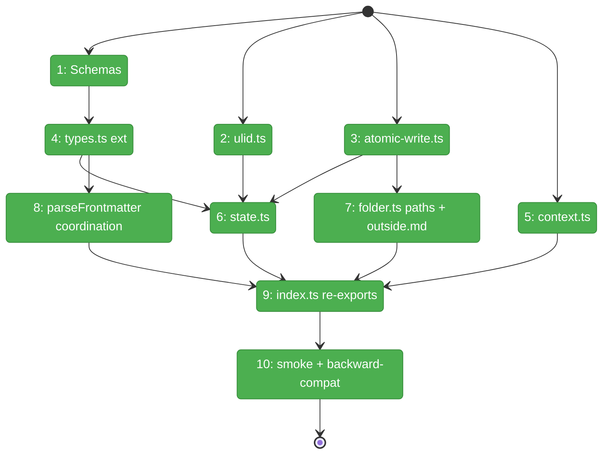

# Flight Plan: Phase 1 — Runner Foundations

**Plan**: [coordination-plan.md](../../coordination-plan.md)
**Phase**: Phase 1: Runner Foundations
**Generated**: 2026-04-26
**Status**: 🛬 **Landed** — all 10 tasks complete (T001-T010); 230/230 tests pass; baseline diff exit=0; tsc clean; zero behavior change to existing 9 agents. P2 unlocked.

---

## Departure → Destination

**Where we are**: Phase 0 LANDED — daemon-light architecture empirically validated (4 scratch tests, FULL GO memo). Spec polished to 37 ACs. Production code unchanged: existing 9 agents, 3 domains (`runner`, `cli`, `adapter`), synchronous one-shot `runAgent` using `sendAndWait`. Zero coordination scaffolding in `src/`.

**Where we're going**: A developer can `import { detectContext, readStateLazy, writeState, appendHistory, ulid, writeFileAtomic, inboxLanePath, stateFilePath, hasOutsideMd } from '../runner/index.js'` and get fully-typed, tested helpers backed by four AJV-validated JSON schemas. `parseFrontmatter` recognizes `coordination: enabled | disabled | { ... }`. Existing 9 agents still pass `minih check` and `minih doctor` with identical output. Zero behavior change to `minih run`. P2-P6 have an unambiguous, single-domain foundation to build on.

---

## Domain Context

### Domains We're Changing

| Domain | What Changes | Key Files |
|--------|--------------|-----------|
| `runner` | NEW: 4 schemas, `state.ts`, `context.ts`, `atomic-write.ts`, `ulid.ts`. EXTEND: `folder.ts` (path helpers + `outside.md` discovery + `coordination` frontmatter), `types.ts` (new exports), `index.ts` (re-exports). All additive. | `src/schemas/{inbox-message,outside-state,inside-state,state-history-entry}.json`; `src/runner/{state,context,atomic-write,ulid}.ts`; `src/runner/{folder,types,index}.ts` |

### Domains We Depend On (no changes)

| Domain | What We Consume | Contract |
|--------|----------------|----------|
| `node:fs` / `node:fs/promises` | `appendFile`, `writeFile`, `rename`, `readFile`, `existsSync`, `mkdirSync`, `fsync` | Node stdlib |
| `node:crypto` | `randomBytes` (for ULID randomness component) | Node stdlib |
| `node:path` | `join`, `resolve` | Node stdlib |
| `ajv` (existing dep) | Schema compilation in `test/runner/schemas.test.ts` | npm |

**Cross-domain reach**: ZERO. P1 lives entirely in `runner`. No imports from `cli`, `adapter`, or new `mcp`. No new npm deps.

---

## Flight Status

<!-- Updated by /plan-6-v2: pending → active → done. Use blocked for problems/input needed. -->

**Legend**: grey = pending | yellow = active | red = blocked/needs input | green = done

---

## Stages

<!-- Updated by /plan-6-v2 during implementation: [ ] → [~] → [x] -->

- [x] **Stage 1: Author the four JSON schemas** — copy verbatim from workshop 001 §Default Schemas; absolute `$id` URIs; AJV-compiles in `test/runner/schemas.test.ts` (`src/schemas/*.json` ×4 — new files; `test/runner/schemas.test.ts` — new file)
- [x] **Stage 2: Vendor a minimal in-tree ULID** — Crockford-base32, monotonic within process; ~30 LOC + tests (`src/runner/ulid.ts` + `test/runner/ulid.test.ts` — new files)
- [x] **Stage 3: Build the atomic-write helper** — write-temp + rename; sync + async; concurrent-writers test (`src/runner/atomic-write.ts` + `test/runner/atomic-write.test.ts` — new files)
- [x] **Stage 4: Extend `types.ts`** — `Side`, `InboxMessage`, `OutsideState`, `InsideState`, `SideState`, `StateHistoryEntry`, `CoordinationFrontmatter`; types only, no runtime; `RetrospectiveCoordination` + `MagicWandTarget` widening explicitly deferred to P6 (`src/runner/types.ts` — modified)
- [x] **Stage 5: Build `context.ts`** — `detectContext()` + `MINIH_ENV_KEYS_COORDINATION` + `MINIH_ENV_KEYS_ALL` (composed) + `getCoordinationEnv()` (`src/runner/context.ts` + `test/runner/context.test.ts` — new files; `runner.ts` MINIH_ENV_KEYS export added)
- [x] **Stage 6: Build `state.ts`** — pure helpers `readStateLazy`, `writeState`, `appendHistory`; lazy default never persists; corruption throws `StateCorruptError`; line-size enforcement; auto peerStateAtTime; **no rule engine** (grep-test confirms) (`src/runner/state.ts` + `test/runner/state.test.ts` — new files)
- [x] **Stage 7: Extend `folder.ts` with path helpers + `outside.md` discovery** — `inboxLanePath`, `stateFilePath`, `historyPath`, `watermarkPath`, `outsideMdPath`, `hasOutsideMd`; `AgentDefinition.outsideContract?: string` + `coordination` (`src/runner/folder.ts`, `test/runner/folder.test.ts` — modified)
- [x] **Stage 8: Extend `parseFrontmatter` for `coordination`** — accept string-enabled / string-disabled / object form; round-trip + 5 negative tests (`src/runner/folder.ts` — modified; `test/runner/folder.test.ts` — modified)
- [x] **Stage 9: Re-export from `index.ts`** — additive only; existing exports preserved verbatim; alphabetical within groups (`src/runner/index.ts` — modified)
- [x] **Stage 10: Backward-compat smoke check** — full test suite green (230/230); `minih doctor` + per-agent `minih check` baselines structurally identical pre vs post P1 (diff exit=0); tsc green; build succeeds

---

## Architecture: Before & After

```mermaid
flowchart LR
    classDef existing fill:#E8F5E9,stroke:#4CAF50,color:#000
    classDef changed fill:#FFF3E0,stroke:#FF9800,color:#000
    classDef new fill:#E3F2FD,stroke:#2196F3,color:#000

    subgraph Before["Before Phase 1"]
        BR1[runner/runner.ts]:::existing
        BR2[runner/folder.ts]:::existing
        BR3[runner/types.ts]:::existing
        BR4[runner/index.ts]:::existing
        BR5[runner/validator.ts]:::existing
        BR6[runner/display.ts]:::existing
        BR7[runner/pretty.ts]:::existing
        BS1[schemas/system-output.json]:::existing
        BS2[schemas/retrospective.json]:::existing
    end

    subgraph After["After Phase 1"]
        AR1[runner/runner.ts]:::existing
        AR2[runner/folder.ts]:::changed
        AR3[runner/types.ts]:::changed
        AR4[runner/index.ts]:::changed
        AR5[runner/validator.ts]:::existing
        AR6[runner/display.ts]:::existing
        AR7[runner/pretty.ts]:::existing
        AR8[runner/state.ts]:::new
        AR9[runner/context.ts]:::new
        AR10[runner/atomic-write.ts]:::new
        AR11[runner/ulid.ts]:::new
        AS1[schemas/system-output.json]:::existing
        AS2[schemas/retrospective.json]:::existing
        AS3[schemas/inbox-message.json]:::new
        AS4[schemas/outside-state.json]:::new
        AS5[schemas/inside-state.json]:::new
        AS6[schemas/state-history-entry.json]:::new

        AR4 -.re-exports.-> AR8
        AR4 -.re-exports.-> AR9
        AR4 -.re-exports.-> AR10
        AR4 -.re-exports.-> AR11
        AR4 -.re-exports.-> AR2
        AR4 -.re-exports.-> AR3
        AR8 -.uses.-> AR10
        AR8 -.types-from.-> AR3
    end

    Before --> After
```

**Legend**: existing (green, unchanged) | changed (orange, modified) | new (blue, created)

---

## Acceptance Criteria

- [ ] **AC-CTX-DETECT** (P1) — `detectContext()` returns `'inside'` when `process.env.MINIH === '1'`, `'outside'` otherwise.
- [ ] **AC-ENV-VARS** (P1, partial) — `MINIH_INBOX_DIR`, `MINIH_STATE_DIR`, `MINIH_CONTEXT` exported from `runner/index.js` as a frozen const array; documented inline. (Full propagation through spawn config + preAction hook lands in P4/P5.)
- [ ] **AC-BACKWARD-COMPAT** (P1, partial) — existing 9 agents still pass `minih check` + `minih doctor` with identical output to a captured pre-P1 baseline; `minih run hello-world` produces a `report.json` with the same structural shape; full test suite green with zero new failures or warnings.
- [ ] **Schema-loadability**: All four schemas compile via AJV without error in `test/runner/schemas.test.ts`; positive + negative samples assert as expected.
- [ ] **No-rule-engine guarantee**: grep for keywords like `requiresPeer`, `transition.*allowed`, `gate`, `predicate` in `src/runner/state.ts` returns no matches (workshop 002 + didyouknow #2).
- [ ] **Atomicity guarantee**: `test/runner/atomic-write.test.ts` proves no partial-content state observable from a parallel reader across 100 writer/reader interleavings.
- [ ] **Coordination frontmatter round-trip**: All four shapes (string `'enabled'`, string `'disabled'`, object form, absent) round-trip through `parseFrontmatter` and produce the expected `AgentDefinition.coordination` value.
- [ ] **Outside.md discovery**: A fixture agent with `outside.md` resolves with `outsideContract: <body>`; agents without `outside.md` resolve with `outsideContract: undefined`.

## Goals & Non-Goals

**Goals**:
- Land typed foundations (schemas, types, helpers) so P2-P6 have an unambiguous vocabulary.
- Zero behavior change to existing runs.
- Single-domain phase: `runner` only.
- All deliverables additive; no existing exports renamed/removed.
- Every new module independently tested.

**Non-Goals**:
- runAgent refactor (P2).
- File watcher / forwarders (P3).
- MCP server (P4).
- Outside CLI commands (P5).
- Per-agent `inside-state.schema.json` / `outside-state.schema.json` (P6 `init --coordinated` scaffold).
- State-machine rule engine (workshop 002 — never; convention-based).
- New npm dependencies.

---

## Checklist

- [x] T001: Author 4 JSON schemas + AJV-loadability test (`src/schemas/inbox-message.json`, `outside-state.json`, `inside-state.json`, `state-history-entry.json`; `test/runner/schemas.test.ts`)
- [x] T002: Implement `src/runner/ulid.ts` + `test/runner/ulid.test.ts` (in-tree, no npm dep)
- [x] T003: Implement `src/runner/atomic-write.ts` (sync + async) + `test/runner/atomic-write.test.ts`
- [x] T004: Extend `src/runner/types.ts` with `Side`, `InboxMessage`, `OutsideState`, `InsideState`, `StateHistoryEntry`, `CoordinationFrontmatter` (RetrospectiveCoordination + MagicWandTarget widening deferred to P6)
- [x] T005: Implement `src/runner/context.ts` (`detectContext()` + `MINIH_ENV_KEYS_COORDINATION` + `MINIH_ENV_KEYS_ALL` composed + `getCoordinationEnv()`) + `test/runner/context.test.ts`
- [x] T006: Implement `src/runner/state.ts` (`readStateLazy`, `writeState`, `appendHistory`; **no rule engine**) + `test/runner/state.test.ts`
- [x] T007: Extend `src/runner/folder.ts` with path helpers + `outside.md` discovery; extend `test/runner/folder.test.ts`
- [x] T008: Extend `parseFrontmatter` for `coordination` field (3 shapes + absent); extend `test/runner/folder.test.ts`
- [x] T009: Re-export from `src/runner/index.ts` (additive only)
- [x] T010: Backward-compat smoke check (230/230 tests green; baseline diff exit=0 across 10 files)
