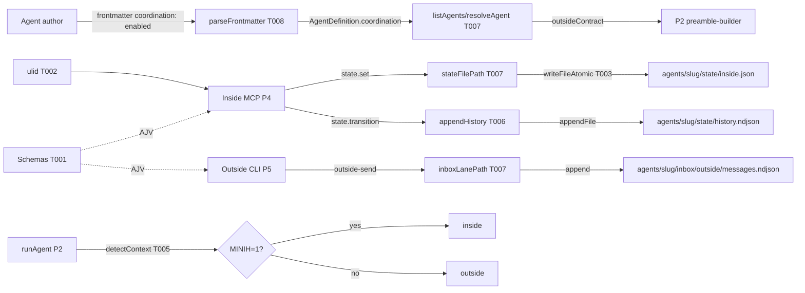
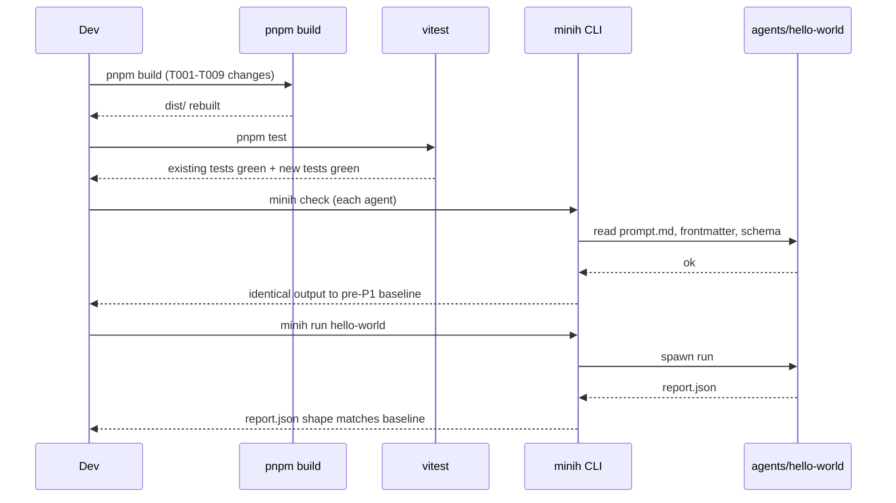

# Phase 1: Runner Foundations — Tasks Dossier

**Plan**: [coordination-plan.md](../../coordination-plan.md)
**Phase**: Phase 1: Runner Foundations
**Generated**: 2026-04-26
**Status**: Ready for takeoff

---

## Executive Briefing

**Purpose**: Land the **typed foundations** of the coordination capability — schemas, types, helpers, and folder-layout extensions — as a pure, additive phase. P1 ships zero behavior change to existing runs and no end-user-visible features. Its job is to give P2-P6 an unambiguous, well-tested vocabulary to build on.

**What We're Building**:
- Four JSON schemas under `src/schemas/` (inbox-message, default outside-state, default inside-state, state-history-entry) wired into AJV via `runner/validator.ts`.
- Five new TypeScript modules under `src/runner/`:
  - `state.ts` — types + pure helpers (`readStateLazy`, `writeState`, `appendHistory`); **no rule engine** (workshop 002 down-scope, reaffirmed by didyouknow #2).
  - `context.ts` — `detectContext(): 'inside' | 'outside'` + new `MINIH_*` env-var keys.
  - `atomic-write.ts` — write-then-rename POSIX-atomic helper.
  - `ulid.ts` — thin wrapper for lex-sortable inbox message IDs.
- Extensions to existing modules:
  - `folder.ts` — inbox/state path helpers, `outside.md` discovery.
  - `parseFrontmatter` — handle `coordination: 'enabled' | 'disabled' | { enabled, outside?, inside? }`.
  - `types.ts` — `InboxMessage`, `OutsideState`, `InsideState`, `RetrospectiveCoordination`, `MagicWandTarget`.
  - `index.ts` — re-export the above as the runner domain's expanded contract surface.
- One backward-compat smoke check: existing 9 agents still pass `minih check` / `minih doctor` and `minih run hello-world` succeeds end-to-end.

**Goals**:
- ✅ All schemas validated; absolute `$id` URIs (per Prior Learning PL-10).
- ✅ Types are the single source of truth — derived from / aligned with schemas; no drift.
- ✅ Atomic-write helper proven against concurrent writers (last-write-wins documented).
- ✅ `detectContext()` returns the correct value for the `MINIH=1` env-var contract.
- ✅ `parseFrontmatter` round-trips the three explicit `coordination` shapes (string `'enabled'`, string `'disabled'`, object `{enabled, outside?, inside?}`); absent → `{enabled: false}` (always populated, never omitted, per workshop 005 line 95). Stable boolean for downstream destructuring.
- ✅ Existing 9 agents unchanged: same `report.json` shape, same exit codes, no new warnings.
- ✅ Phase ships **zero** new CLI commands, **zero** new MCP tools, **zero** changes to `runAgent` behavior. Pure plumbing.

**Non-Goals**:
- ❌ Implementing inbox/state forwarders (P3).
- ❌ Refactoring `runAgent` to event-driven (P2).
- ❌ MCP server / spawn config (P4).
- ❌ Outside CLI commands (`outside-send`, `state get/set`, etc.) (P5).
- ❌ Wiring identity-block / peer-contract injection into the inside prompt (P2 builder + P6 content).
- ❌ Per-agent `inside-state.schema.json` / `outside-state.schema.json` discovery + scaffolding (P6 — `init --coordinated`); P1 ships only the **default** schemas.
- ❌ State-machine rule engine, gate predicates, or premature-completion guards (workshop 002 + didyouknow #2).
- ❌ Adding `@modelcontextprotocol/sdk` or `ulid` npm dependencies in this phase (P4 adds the SDK; ULID is a thin in-tree helper for now).

---

## Prior Phase Context — Phase 0 (LANDED 2026-04-26)

### A. Deliverables
- `scratch/runagent-eventdriven/{test.mjs, README.md}` — proves event-driven `session.send` + idle subscription works end-to-end (single + queued).
- `scratch/fswatch-test/{test.mjs, README.md}` — measures native `fs.watch` detection latency (mean 15.45ms, p99 39ms, 100/100 detected); documents atomic-rename + burst-coalescing patterns.
- `scratch/daemon-light-prototype/{test.mjs, README.md}` — full end-to-end forwarder prototype; **load-bearing**. Mechanical PASS (5/5 forwarded + acked, sendCount=5, parseFailures=0). Latency caveat documented (10-17s round-trip from agent reasoning, not forwarder).
- `scratch/multi-process-watch/{test.mjs, README.md}` — multi-writer NDJSON safety (200/200 lines, even split, zero parse failures) + 4-pass torn-line scenario validating skip-without-watermark-advance protocol.
- `docs/plans/007-backgrounding/prework-results.md` — FULL GO decision memo.
- Spec polish: `coordination-spec.md` grew from 17 → **37 ACs** (10 daemon-light from workshop 007 + 10 prompting/retro from workshop 008).
- `coordination.fltplan.md` status moved to "**Phase 0 LANDED** — P1 unlocked."

### B. Dependencies Exported
- **Empirical evidence the daemon-light architecture works.** P1 doesn't consume P0 code, but P1's design assumptions all rest on P0's GO verdict.
- **The forwarder protocol** (4-step skip-on-parse-fail-without-watermark-advance) — **not yet implemented in production code**, but the scratch test in `scratch/daemon-light-prototype/test.mjs` is the canonical reference. P3 will lift this verbatim into `src/runner/inbox-forwarder.ts`. P1 contributes the foundations the forwarder needs (atomic-write helper, paths, schemas).
- **AJV `$id` convention**: `https://minih.dev/schemas/<name>.json`. P1's four new schemas use this.
- **Process-marker convention**: `process.title = 'minih-mcp-<runId>'` for spawned MCP processes (P4) — irrelevant to P1.

### C. Gotchas & Debt
- **The torn-line "garbage blocks subsequent valid lines" semantic is intentional** (workshop 001 §Forwarder-side robustness). P3's forwarder MUST inherit this behavior verbatim. P1 doesn't touch it but the schema authoring should respect the line-size budget (8 KB soft limit per inbox message — referenced in `inbox-message.json` body maxLength: 10000).
- **Agent reasoning time dominates round-trip latency** (T003 caveat). This is a P2/P3/P6 prompting concern, not P1.
- **`state.transition` is convention, not enforcement** (workshop 002 + didyouknow #2). P1's `state.ts` MUST NOT contain rule predicates. The `state.transition` MCP tool (P4) will validate the new status value against the agent's declared per-agent enum (if a per-agent `inside-state.schema.json` is present), but P1 only ships the *default* schemas.
- **The `MINIH=1` flag already exists** (set by `runner.ts:270`). P1's `detectContext()` is just a typed read of it; no behavior change to writers.

### D. Incomplete Items
- None. P0 landed cleanly. Code-review APPROVE; F001-F004 fixed inline.

### E. Patterns to Follow
- **Pure additions, no behavior change**: P0 modified files only by adding ACs and updating flight-plan status; never touched `src/`. P1 has the same posture for *existing* code: extend, don't refactor.
- **Test colocation**: scratch tests had `test.mjs` + `README.md` per scenario. P1 production tests follow the existing repo convention: `test/runner/<name>.test.ts` mirroring `src/runner/<name>.ts`.
- **One concept per file**: `state.ts`, `context.ts`, `atomic-write.ts`, `ulid.ts` — small, focused, single-purpose modules. Don't merge into a god-module.
- **Workshop fidelity**: workshops are authoritative. Where a workshop and intuition disagree, the workshop wins (or update the workshop). Workshops 001 + 002 + 005 are the primary references for P1.
- **Discoveries get logged** to `execution.log.md` and the Discoveries table here as P1 progresses.

---

## Pre-Implementation Check

| File | Exists? | Domain Check | Notes |
|------|---------|-------------|-------|
| `src/schemas/inbox-message.json` | ❌ NEW | runner (data) | Workshop 001 §Default Schemas — copy verbatim |
| `src/schemas/outside-state.json` | ❌ NEW | runner (data) | Workshop 001 §Default Schemas — DEFAULT (per-agent override is P6) |
| `src/schemas/inside-state.json` | ❌ NEW | runner (data) | Workshop 001 §Default Schemas — DEFAULT (per-agent override is P6) |
| `src/schemas/state-history-entry.json` | ❌ NEW | runner (data) | Workshop 001 §Default Schemas — copy verbatim |
| `src/runner/state.ts` | ❌ NEW | runner (contract) | Types + pure helpers; **no rule engine** (workshop 002 + didyouknow #2) |
| `src/runner/context.ts` | ❌ NEW | runner (contract) | `detectContext()` + new `MINIH_*` env-var keys constant |
| `src/runner/atomic-write.ts` | ❌ NEW | runner (internal) | write-then-rename helper, used by `state.ts` |
| `src/runner/ulid.ts` | ❌ NEW | runner (internal) | Lex-sortable IDs for inbox messages; thin wrapper |
| `src/runner/folder.ts` | ✅ EXISTS | runner (contract) | EXTEND — add inbox/state/history/watermark path helpers (all return absolute paths; reuse `validateSlug`); `outside.md` discovery; `coordination` frontmatter parsing |
| `src/runner/types.ts` | ✅ EXISTS | runner (contract) | EXTEND — add `Side`, `InboxMessage`, `OutsideState`, `InsideState`, `SideState`, `StateHistoryEntry`, `CoordinationFrontmatter`. **`RetrospectiveCoordination` and `MagicWandTarget` widening are P6 work** (per Domain Manifest line 74; deferring avoids type-vs-validator drift while schemas still ship 2-value `magicWandTarget` enum) |
| `src/runner/index.ts` | ✅ EXISTS | runner (contract) | EXTEND — re-export new helpers + types |
| `src/runner/validator.ts` | ✅ EXISTS | runner (internal) | EXTEND in P6 (NOT P1) — for new validators on the four schemas, P1 only loads them via AJV in tests |
| `test/runner/state.test.ts` | ❌ NEW | runner (internal) | Round-trip read/write; history append-only; concurrent writes |
| `test/runner/context.test.ts` | ❌ NEW | runner (internal) | Both branches of `detectContext()`; env-var key list export |
| `test/runner/atomic-write.test.ts` | ❌ NEW | runner (internal) | Concurrent writers; last-write-wins; partial-write impossibility |
| `test/runner/ulid.test.ts` | ❌ NEW | runner (internal) | Monotonicity within a process; lex-sortable property |
| `test/runner/folder.test.ts` | ✅ EXISTS | runner (internal) | EXTEND — assertions for new path helpers + `outside.md` discovery + `coordination` frontmatter (8 round-trip cases: 4 valid + 4 invalid) |
| `test/runner/schemas.test.ts` | ❌ NEW | runner (internal) | AJV (strict + ajv-formats) validation of sample messages + states against the four new schemas; absolute-`$id` smoke; malformed-load test |
| `test/fixtures/agents-coordination/has-outside-md/{prompt.md,outside.md}` | ❌ NEW | runner (test data) | Fixture for T007 outside.md discovery — kept OUTSIDE real `agents/` so it does not affect T010 baseline |
| `scripts/capture-p1-baseline.sh` | ❌ NEW | tooling | T010 pre-step — captures `minih check`/`doctor`/`run hello-world` JSON to baselines/ |
| `scripts/diff-baselines.mjs` | ❌ NEW | tooling | T010 post-step — diffs pre/post baselines with ignore-keys list |
| `docs/plans/.../baselines/` | ❌ NEW | evidence | Committed pre-P1 evidence for T010 backward-compat verification |

**Concept-search**: scanned existing `src/runner/` for prior implementations of `atomicWrite`, `ulid`, `detectContext`, inbox helpers, state types — **none present**. Zero duplication risk.

**Contract changes flagged**: `src/runner/index.ts` (re-export expansion) and `src/runner/types.ts` (new exports). Both are **additive only**. Zero existing exports renamed or removed.

**Harness**: No `docs/project-rules/harness.md` configured. P1 will use standard testing — vitest unit tests + the existing `test/cli/all-existing-agents-*.test.ts` style smoke for backward-compat.

---

## Architecture Map

```mermaid
flowchart TD
    classDef pending fill:#9E9E9E,stroke:#757575,color:#fff
    classDef inprogress fill:#FFC107,stroke:#FFA000,color:#000
    classDef completed fill:#4CAF50,stroke:#388E3C,color:#fff

    subgraph Phase["Phase 1: Runner Foundations (10 tasks)"]
        T001["T001: 4 JSON schemas"]:::completed
        T002["T002: ulid.ts"]:::completed
        T003["T003: atomic-write.ts"]:::completed
        T004["T004: types.ts extensions"]:::completed
        T005["T005: context.ts"]:::completed
        T006["T006: state.ts"]:::completed
        T007["T007: folder.ts path helpers + outside.md"]:::completed
        T008["T008: parseFrontmatter coordination"]:::completed
        T009["T009: index.ts re-exports"]:::completed
        T010["T010: smoke check + backward-compat"]:::completed

        T001 --> T006
        T001 --> T004
        T002 --> T006
        T003 --> T006
        T003 --> T007
        T004 --> T006
        T004 --> T008
        T005 --> T009
        T006 --> T009
        T007 --> T009
        T008 --> T009
        T009 --> T010
    end

    subgraph Files["New Files"]
        F1["src/schemas/*.json (×4)"]:::pending
        F2["src/runner/state.ts"]:::pending
        F3["src/runner/context.ts"]:::pending
        F4["src/runner/atomic-write.ts"]:::pending
        F5["src/runner/ulid.ts"]:::pending
        F6["test/runner/*.test.ts (×5)"]:::pending
    end

    subgraph Modified["Modified Files"]
        M1["src/runner/folder.ts"]:::pending
        M2["src/runner/types.ts"]:::pending
        M3["src/runner/index.ts"]:::pending
        M4["test/runner/folder.test.ts"]:::pending
    end

    T001 -.-> F1
    T002 -.-> F5
    T003 -.-> F4
    T004 -.-> M2
    T005 -.-> F3
    T006 -.-> F2
    T007 -.-> M1
    T008 -.-> M1
    T009 -.-> M3
    T002 -.-> F6
    T003 -.-> F6
    T005 -.-> F6
    T006 -.-> F6
    T007 -.-> M4
    T008 -.-> M4
    T001 -.-> F6
```



---

## Tasks

| Status | ID | Task | Domain | Path(s) | Done When | Notes |
|--------|-----|------|--------|---------|-----------|-------|
| [x] | T001 | Author 4 JSON schemas: `inbox-message.json`, `outside-state.json`, `inside-state.json`, `state-history-entry.json` (copy verbatim from workshop 001 §Default Schemas; **PLAIN JSON, not JSONC** — strip workshop comments; absolute `$id` URIs `https://minih.dev/schemas/<name>.json`); add `test/runner/schemas.test.ts` to AJV-validate one passing + one failing sample per schema. Configure AJV with `strict: true` and register `ajv-formats` (existing dep — verify in `package.json`; add if missing) so `format: date-time` actually rejects `'not-a-date'` (without ajv-formats it silently passes). Negative samples must include a bad `date-time` to prove formats are wired. Add a malformed-schema-load test (trailing comma) to ensure load failures surface loudly | runner | `/Users/jordanknight/substrate/minih/src/schemas/inbox-message.json`, `outside-state.json`, `inside-state.json`, `state-history-entry.json`; `/Users/jordanknight/substrate/minih/test/runner/schemas.test.ts` | All four files exist, parse as JSON (no comments), declare `$schema: "https://json-schema.org/draft/2020-12/schema"`; AJV strict-mode compiles each without error; `ajv-formats` registered and proven working via negative `date-time` sample; positive + negative samples assert as expected; malformed-schema test fails loudly | Workshop 001 §Default Schemas. Finding 03. DEFAULT schemas only — per-agent overrides (`agents/<slug>/{inside,outside}-state.schema.json`) land in P6. |
| [x] | T002 | Implement `src/runner/ulid.ts`: thin wrapper exporting **only** `ulid(): string` (no helper exports — keeps the in-tree → npm `ulid` swap in a future phase a one-line change). Vendor a minimal in-tree implementation (~30 LOC) rather than add `ulid` npm dep (per Non-Goals). **Monotonicity contract**: when two `ulid()` calls occur in the same millisecond, the random suffix is incremented (NOT regenerated) so lex-sort order matches call order; when `Date.now()` returns a value less than the prior call's timestamp (NTP step-backward, VM hibernation), reuse the prior timestamp and increment the suffix — emit IDs are monotonic even under clock rewind. Add `test/runner/ulid.test.ts` covering format `^[0-9A-HJKMNP-TV-Z]{26}$`, sub-ms collision (1000 calls in same ms via `vi.useFakeTimers`), explicit clock-rewind by 5ms followed by 100 calls, and lex-sortable property over a 10K-call burst | runner | `/Users/jordanknight/substrate/minih/src/runner/ulid.ts`; `/Users/jordanknight/substrate/minih/test/runner/ulid.test.ts` | All emitted IDs match the regex; sorted-by-string equals sorted-by-creation-order in all four test scenarios (10K burst, sub-ms, clock-rewind, normal); no collisions; only `ulid` exported from the module | Workshop 001 references ULID for inbox message IDs. Crockford-base32 alphabet (no I, L, O, U). 48-bit ms timestamp + 80-bit randomness. Export-surface kept narrow so future package swap is mechanical. |
| [x] | T003 | Implement `src/runner/atomic-write.ts`: export `writeFileAtomic(path: string, content: string \| Buffer): void` (sync) and `writeFileAtomicAsync(path, content): Promise<void>`. Pattern: write to `${path}.tmp.${process.pid}.${monotonicCounter}` (counter prevents collision on retry), fsync, rename. **Failure modes** (must be specified, not assumed): (a) tmp-file-already-exists from a prior crash → counter increments past collision; (b) `EXDEV` cross-filesystem rename → throw typed `AtomicWriteCrossFsError` directing caller to keep state on same fs; (c) `fsync` failure (e.g., tmpfs) → unlink tmp, re-throw; (d) parent directory missing → throw clear `ENOENT` (callers in T006 own `mkdirSync({recursive:true})` first); (e) orphaned tmp files NOT auto-cleaned in v1 (documented). Add `test/runner/atomic-write.test.ts`: happy-path; **concurrent design** — fire 10 `writeFileAtomicAsync` calls via `Promise.all` with distinct payloads `'writer-0'`..`'writer-9'`; assert final content ∈ {writer-0..writer-9} (set membership, NOT a specific winner — last-write-wins is OS-scheduler-dependent); reader-probe runs 1000 iterations in parallel and asserts EVERY read parses cleanly; orphaned-tmp test (pre-create a stale `*.tmp.*` file → fresh write succeeds) | runner | `/Users/jordanknight/substrate/minih/src/runner/atomic-write.ts`; `/Users/jordanknight/substrate/minih/test/runner/atomic-write.test.ts` | Both sync + async exports work; 10 parallel writers leave file with one writer's content (set-membership assertion); 1000 reader probes never see truncated bytes; `EXDEV` throws typed error; missing parent throws ENOENT; stale tmp file does not block fresh write | Workshop 001 §Atomic Write Strategy. POSIX `rename(2)` atomic within same fs. NO lockfile in v1. **Windows is OUT OF SCOPE for atomic semantics** — POSIX-only assumption (Node 20 LTS minimum); Windows users run via WSL2. |
| [x] | T004 | Extend `src/runner/types.ts`: add `Side = 'outside' \| 'inside'`; `InboxMessage` (mirrors `inbox-message.json` schema — fields: `id, sender, type, subject, body, ts, ackOf?, meta?`); `OutsideState` + `InsideState` (mirror their schemas — fields: `status, data, updatedAt, updatedBy`); `SideState = OutsideState \| InsideState`; `StateHistoryEntry` (mirrors history schema — fields: `ts, side, from, to, reason, peerStateAtTime`); `CoordinationFrontmatter = 'enabled' \| 'disabled' \| { enabled: boolean; outside?: object; inside?: object }` (NO `boolean` in the union — workshop 005 specifies only string + object input forms; absent is handled by the parser, not the type). NO runtime code — types only. **`Status` type alias is intentionally NOT introduced** — runtime validation is the source of truth (per-agent `inside-state.schema.json` enum at MCP `state.transition` time, P4); a discriminated union here would re-introduce the rule engine workshop 002 down-scoped. **`RetrospectiveCoordination` and `MagicWandTarget` extension to `'coordination'` are P6 work** (per Domain Manifest line 74; schema widening lands in P6 task 6.4 — typing them in P1 would create type-vs-validator drift since `system-output.json`/`retrospective.json` enums are still `["project","minih"]`). | runner | `/Users/jordanknight/substrate/minih/src/runner/types.ts` | All new types compile; existing `MagicWandTarget = string \| null` unchanged; `tsc --noEmit` green; new types referenced by T006-T008 implementations; grep confirms no `Status =` alias added; grep confirms no `RetrospectiveCoordination` in the file (P6 will add) | Workshops 001 + 005. Finding 12. **Drop scope**: `RetrospectiveCoordination` and `MagicWandTarget` widening explicitly deferred to P6 to avoid type-vs-validator drift (per validation 2026-04-26). |
| [x] | T005 | Implement `src/runner/context.ts`: export `detectContext(): 'inside' \| 'outside'` (returns `'inside'` iff `process.env.MINIH === '1'` — **strict equality, NOT truthy check**; document this in JSDoc pointing at `runner.ts:270` as the canonical writer); export const `MINIH_ENV_KEYS_COORDINATION = ['MINIH_INBOX_DIR', 'MINIH_STATE_DIR', 'MINIH_CONTEXT'] as const`; export const `MINIH_ENV_KEYS_ALL = [...MINIH_ENV_KEYS, ...MINIH_ENV_KEYS_COORDINATION] as const` (re-import existing `MINIH_ENV_KEYS` from `./runner.js` so P4 spawn config has a single composed array — single point of contact, no fragmented surface); export `getCoordinationEnv(): { inboxDir?: string; stateDir?: string; context: 'inside' \| 'outside' }` (reads the three keys + falls back to `detectContext()`). Add `test/runner/context.test.ts` covering: both `detectContext` branches; **strict-equality trap values** — explicitly assert `'outside'` for each of `MINIH=''`, `MINIH='0'`, `MINIH='true'`, `MINIH='yes'`, `MINIH='TRUE'`, `MINIH=' 1 '` (trailing spaces); only `MINIH='1'` returns `'inside'`; `MINIH_ENV_KEYS_ALL` array shape (length = existing + 3); `getCoordinationEnv()` defaults when nothing set; tests use `vi.stubEnv` for isolation | runner | `/Users/jordanknight/substrate/minih/src/runner/context.ts`; `/Users/jordanknight/substrate/minih/test/runner/context.test.ts` | All three exports work; trap-value tests pass; `MINIH_ENV_KEYS_ALL` returns the union of both arrays; tests use `vi.stubEnv`; JSDoc on `detectContext` documents strictness | AC-CTX-DETECT. AC-ENV-VARS (partial — keys exported here as a composed array). **DEFERRED-TO-P3/P4 (Discovery debt row)**: extending `MINIH_ENV_KEYS` literal in `runner.ts:137-152` with the three new keys is intentionally NOT done in P1; P3 forwarders or P4 MCP spawn add when first needed. The `MINIH_ENV_KEYS_ALL` composition export ensures consumers always see the full set without renaming. |
| [x] | T006 | Implement `src/runner/state.ts`: types re-exported from `types.ts`; pure helpers — `readStateLazy(side: Side, slug: string, agentsDir: string): SideState` (returns synthetic default `{status: 'idle', data: {}, updatedAt: ISO, updatedBy: side}` when file absent — workshop 001 §Initial State Behavior; **never persists**; throws typed `StateCorruptError` if file present but invalid JSON or fails schema validation — corruption MUST NOT be silently masked as a default), `writeState(side, slug, agentsDir, state)` (validates `slug` via existing `validateSlug` first; uses atomic-write from T003; ensures parent dir exists via `mkdirSync({recursive:true})`), `appendHistory(slug, agentsDir, entry)` (validates slug; auto-populates `entry.peerStateAtTime` via `readStateLazy(otherSide, slug, agentsDir)` if caller omits it — first-ever transition records `peerStateAtTime: {status: 'idle'}` consistently; single-call `appendFile` to `state/history.ndjson`; **enforces line size ≤ 4096 bytes** (POSIX PIPE_BUF floor) and throws `HistoryLineTooLargeError` otherwise — guarantees POSIX append atomicity). Add `test/runner/state.test.ts`: round-trip read/write per side; lazy-default never writes; corrupt JSON file throws `StateCorruptError`; invalid slug throws via `validateSlug`; oversized history line (5KB) throws; concurrent `writeState` (10 parallel) yields valid file with set-membership assertion; `appendHistory` survives 100 parallel ≤200-byte appends → exactly 100 lines, all valid JSON; `appendHistory` auto-populates `peerStateAtTime` when caller omits. **No rule engine. No transition predicates. No `requiresPeer` enforcement.** | runner | `/Users/jordanknight/substrate/minih/src/runner/state.ts`; `/Users/jordanknight/substrate/minih/test/runner/state.test.ts` | All three helpers work as specified; corrupt file throws (does not silently default); slug validation reuses existing `validateSlug`; oversize lines rejected; concurrent semantics tested; `peerStateAtTime` auto-populated; grep test confirms no rule predicates | Finding 03 (no rule engine — reaffirmed by didyouknow #2). Workshop 001 §Initial State Behavior + §Atomic Write Strategy. Workshop 002 §Down-scope. Use `path.join(agentsDir, slug, 'state', `${side}.json`)` and `path.join(agentsDir, slug, 'state', 'history.ndjson')`. **`appendHistory` and `writeState` are separate atomic ops** — callers (P4 `state.transition`, P5 `state set`) own cross-call ordering; history is total-ordered by `ts` field at append time. |
| [x] | T007 | Extend `src/runner/folder.ts`: add path helpers — `inboxLanePath(slug, agentsDir, lane: Side): string` → absolute path to `agents/<slug>/inbox/<lane>/messages.ndjson`; `stateFilePath(slug, agentsDir, side: Side): string`; `historyPath(slug, agentsDir): string`; `watermarkPath(slug, agentsDir): string` → absolute path to `agents/<slug>/state/sdk-watermark.json` (workshop 007; **path constant lives here, P3 owns the file format and write logic**); `outsideMdPath(slug, agentsDir): string`; `hasOutsideMd(slug, agentsDir): boolean`. **All path helpers MUST return absolute paths** (call `path.resolve(agentsDir, ...)`; assert `path.isAbsolute(agentsDir)` precondition) so P4 can bake into spawn-config env-vars without consumers re-resolving. Each helper validates `slug` via existing `validateSlug` before path construction (path-traversal guard). `outsideMdPath`/`hasOutsideMd` use `fs.statSync` (follow symlinks) but throw `OutsideAgentsDirError` if symlink resolves outside `agentsDir`. Discovery: when `outside.md` exists, populate new optional field `outsideContract?: string` on `AgentDefinition` (body only, raw markdown — workshop 008; this is the P1 design carrier for plan-3 task 1.6's "discover" requirement, consumed by P2 preamble-builder); empty file → `outsideContract: ''` (distinguishable from `undefined` = absent); files >16KB truncated to 16KB with `console.warn` (4KB/8KB doctor warnings land in P6 task 6.8 — this is just a hard prompt-blowup ceiling). Extend `test/runner/folder.test.ts`: each helper returns absolute path; invalid slug (`..`, `/`, etc.) throws via `validateSlug`; new fixture `test/fixtures/agents-coordination/has-outside-md/{prompt.md,outside.md}` (kept OUTSIDE the real `agents/` dir so it does not affect T010 baselines); empty `outside.md` returns `''`; symlink-out-of-tree throws | runner | `/Users/jordanknight/substrate/minih/src/runner/folder.ts`; `/Users/jordanknight/substrate/minih/test/runner/folder.test.ts`; `/Users/jordanknight/substrate/minih/test/fixtures/agents-coordination/has-outside-md/prompt.md`; `/Users/jordanknight/substrate/minih/test/fixtures/agents-coordination/has-outside-md/outside.md` | All 6 helpers exported and return absolute paths; existing helpers unchanged; slug validation reused; `listAgents`/`resolveAgent` populate `outsideContract` correctly; existing 9 agents resolve with `outsideContract: undefined`; fixture lives outside real `agents/` so it does not affect T010 | Finding 06 (per-agent shared dirs). Workshop 008 (two-sided file layout). Workshop 007 (watermark file location). **Path constants centralized here**; `watermarkPath` is exported but P3 owns format + write logic (resolves the validation FC #4 watermark-ownership ambiguity). |
| [x] | T008 | Extend `parseFrontmatter` in `src/runner/folder.ts` (and `parseYamlSimple`): parse `coordination` field. Accept `coordination: enabled` (string), `coordination: disabled` (string), or object form `coordination:\n  enabled: true\n  outside: {...}\n  inside: {...}`. Return shape: `coordination: { enabled: boolean; outside?: object; inside?: object }` — **always populated, never omitted, even when absent** → `{ enabled: false }` (per workshop 005 line 95; downstream consumers like P2 preamble-builder destructure `coordination.enabled` without optional-chaining footgun). Case-sensitive matching for `enabled`/`disabled` (lowercase only). **Invalid inputs throw `InvalidCoordinationFrontmatterError` with message naming accepted values**: unknown strings (`maybe`, `yes`, `ENABLED`), nested object missing `enabled` field. Extend `AgentDefinition` type and `listAgents`/`resolveAgent` to surface it. Add round-trip tests in `test/runner/folder.test.ts` for the 4 valid shapes (string-enabled → `{enabled:true}`, string-disabled → `{enabled:false}`, object-enabled → preserve outside/inside, absent → `{enabled:false}`) PLUS 4 negative tests (`maybe`, `yes`, `ENABLED`, malformed object) asserting the typed error | runner | `/Users/jordanknight/substrate/minih/src/runner/folder.ts`; `/Users/jordanknight/substrate/minih/src/runner/types.ts` (already has `CoordinationFrontmatter` from T004); `/Users/jordanknight/substrate/minih/test/runner/folder.test.ts` | All 4 valid shapes round-trip to a stable `{enabled: boolean}` shape; absent never omits the field; 4 invalid shapes throw `InvalidCoordinationFrontmatterError`; existing frontmatter tests unchanged | Finding 12. Workshop 005 §Coordination Frontmatter line 95. Backward compatible — existing 9 agents have no `coordination` field and continue to resolve identically (now with `coordination: {enabled: false}` populated). **Hand-rolled parser, no `gray-matter` dep** (per existing convention DYK #4). |
| [x] | T009 | Extend `src/runner/index.ts`: re-export from new modules — `detectContext`, `MINIH_ENV_KEYS_COORDINATION`, `MINIH_ENV_KEYS_ALL`, `getCoordinationEnv` (from `./context.js`); `writeFileAtomic`, `writeFileAtomicAsync` (from `./atomic-write.js`); `ulid` (from `./ulid.js`); `readStateLazy`, `writeState`, `appendHistory` (from `./state.js`); `inboxLanePath`, `stateFilePath`, `historyPath`, `watermarkPath`, `outsideMdPath`, `hasOutsideMd` (from `./folder.js`). Re-export new types: `Side`, `InboxMessage`, `OutsideState`, `InsideState`, `SideState`, `StateHistoryEntry`, `CoordinationFrontmatter`. **Do NOT re-export `RetrospectiveCoordination` or `MagicWandTarget`** (P6 work — schemas widen there). Order alphabetically within each group; preserve existing exports verbatim | runner | `/Users/jordanknight/substrate/minih/src/runner/index.ts` | `tsc --noEmit` green; `node -e "console.log(Object.keys(require('./dist/runner/index.js')).sort())"` shows additive-only diff; existing exports unchanged; grep confirms `RetrospectiveCoordination` and `MagicWandTarget` NOT exported from index in P1; P2-P6 import via `runner/index.js` | Domain contract surface. **No new entries removed or renamed.** Single point of contact for P4 (mcp domain) and P5 (cli new commands). |
| [x] | T010 | Backward-compat smoke check with **precise baseline procedure**. **Pre-T001 step** (BEFORE any P1 code touches `src/`): create `scripts/capture-p1-baseline.sh` that runs `minih check` (JSON output) per agent + `minih doctor` (JSON) + `minih run hello-world` (capturing `report.json`); writes outputs to `docs/plans/007-backgrounding/tasks/phase-1-runner-foundations/baselines/{check-<slug>.json,doctor.json,hello-world-report.json}`. Commit the baseline directory. **Post-T009 step**: re-run the same script writing to `baselines.post-p1/`; create `scripts/diff-baselines.mjs` that compares the two trees with `--ignore-keys=startedAt,completedAt,runId,sessionId,duration,timestamp,ts,runDir`; assert exit 0. Also: (1) `pnpm test` (or `npm test`) green — zero new failures, zero new warnings; (2) `tsc --noEmit` green; (3) record evidence in `execution.log.md`. Document the procedure + script + ignore-keys list as part of T010 deliverables; do NOT commit the post-P1 baseline directory (it's transient evidence) | runner | `/Users/jordanknight/substrate/minih/scripts/capture-p1-baseline.sh`; `/Users/jordanknight/substrate/minih/scripts/diff-baselines.mjs`; `/Users/jordanknight/substrate/minih/docs/plans/007-backgrounding/tasks/phase-1-runner-foundations/baselines/` (committed pre-P1 evidence) | Capture script exists + executable; baselines directory committed BEFORE T001 starts; diff script ignores transient keys correctly; post-P1 diff returns exit 0 against committed baseline; full test suite green; tsc green | AC-BACKWARD-COMPAT (P1 portion — manual script-driven smoke + execution-log evidence). The full automated `test/cli/all-existing-agents-pass-doctor.test.ts` is **P2 task 2.7** (workshop 006 §Mapping Tests to ACs); P1's baseline-diff is the precursor. Existing 9 listable agents under `agents/` (excluding `_shared` per `folder.ts:142`). |

---

## Context Brief

**Key findings from plan**:
- **Finding 03** (Critical) — minih is an enabler, not an orchestrator. **No rule engine in `state.ts`.** Per-agent enums (P6) + convention-based transitions; outside negotiates via inbox if it disagrees. Reaffirmed by didyouknow #2 (2026-04-26).
- **Finding 06** (High) — per-agent shared inbox/state at `agents/<slug>/{inbox,state}/`. Path helpers in `folder.ts` (T007) centralize this. NO per-run isolation.
- **Finding 11** (Medium) — existing test infrastructure (vitest, FakeAgentAdapter) is fine; P1's tests follow the existing `test/runner/<name>.test.ts` convention. Two-agent coordination tests start arriving in P3+.
- **Finding 12** (Medium) — `parseFrontmatter` already handles shallow YAML; T008 is a small extension, not a rewrite. Backward compatible by default (absent field).

**Domain dependencies** (concepts and contracts P1 consumes — `runner` is the primary domain, no cross-domain deps in P1):
- `runner` (self): existing `validateSlug`, `parseFrontmatter`, `AgentDefinition` — extending all three.
- `node:fs` / `node:fs/promises`: `appendFile`, `writeFile`, `rename`, `readFile`, `existsSync`, `mkdirSync`, `fsync` — stdlib only.
- `node:crypto`: `randomBytes` for ULID randomness component.
- `node:path`: `join`, `resolve` for path helpers.
- `ajv` (existing dep): schema validation in `test/runner/schemas.test.ts`. P1 does NOT modify `validator.ts` — that's P6.

**Domain constraints**:
- **All new files MUST live under `src/runner/` or `src/schemas/`.** No reaching into `cli/`, `adapter/`, or new `mcp/` from P1.
- **Re-exports via `runner/index.ts` only** — P4/P5 consumers do `import { ... } from '../runner/index.js'`, never `import { ... } from '../runner/state.js'`. T009 enforces this contract surface.
- **Zero new npm deps in P1.** ULID is in-tree (T002). MCP SDK and `ulid` package land in P4 if we decide to switch from in-tree.
- **Schema `$id` URIs absolute** (`https://minih.dev/schemas/...`) — Prior Learning PL-10. AJV refs break with relative URIs.
- **Atomic-write helper used everywhere state is written.** No raw `fs.writeFileSync` for state files in T006 or beyond.
- **Existing exports from `runner/index.ts` are immutable.** T009 ADDS only; if a name needs to change, that's a separate plan.

**Harness context**: No agent harness configured. P1 uses standard testing (vitest unit tests + manual smoke for backward-compat per T010).

**Reusable from prior phases**:
- **The forwarder protocol pattern** (from P0 scratch test `daemon-light-prototype/test.mjs:readNewMessages`) — P1 doesn't implement the forwarder, but T003's atomic-write helper is what the watermark file in P3 will use. The protocol shape:
  - Read from byte offset (not line offset).
  - Split on `\n`; last element is partial-line tail (discarded).
  - On `JSON.parse` failure: stop draining, return `parseFailed: true`, do NOT advance watermark.
  - PER-LINE WATERMARK FSYNC before next-line forward (P3 will use T003's atomic-write).
- **The `MINIH=1` env-var convention** (existing `runner.ts:270`). T005 reads it; no writer changes in P1.
- **`parseFrontmatter`'s hand-rolled YAML parser** (`folder.ts:75-127`). T008 extends it; same style.

**Mermaid flow diagram** (system view of P1 deliverables):



**Mermaid sequence diagram** (T010 backward-compat verification):



---

## Discoveries & Learnings

_Populated during implementation by plan-6._

| Date | Task | Type | Discovery | Resolution | References |
|------|------|------|-----------|------------|------------|
| 2026-04-26 | T005 | debt | `MINIH_ENV_KEYS` literal in `runner.ts:137-152` is intentionally NOT extended in P1; new keys exposed only via `MINIH_ENV_KEYS_COORDINATION` + composed `MINIH_ENV_KEYS_ALL` from `context.ts`. Risk: P3 forwarders or P4 MCP spawn may fail to propagate the new keys to spawned subprocesses. | DEFERRED-TO-P3/P4 — extend `MINIH_ENV_KEYS` literal when first needed; the composition export ensures consumers can use `MINIH_ENV_KEYS_ALL` without renaming. | validation 2026-04-26 (Completeness #5, FC #5) |
| 2026-04-26 | T001 | decision | Added `ajv-formats@^3.0.1` as a runtime dep despite Non-Goals "no new npm deps in P1". | Without it, AJV silently passes any string for `format: date-time` — schemas would validate trivially. ajv-formats is same-maintainer as AJV, ~50KB, no transitive concerns. The validate-v2 sweep surfaced this as a real gap; deferred-to-P4 was the alternative but would have left dead validation. | execution log T001 section |
| 2026-04-26 | T006 | gotcha | The no-rule-engine self-grep test (`expect(src).not.toMatch(/requiresPeer/)`) failed against state.ts because the JSDoc legitimately documents "no `requiresPeer` enforcement" as the explicit design choice. | Strip block + single-line comments before grep so documentation and code-absence guarantee can coexist. Pattern preserved for any future similar self-policing tests. | execution log T006 section |
| 2026-04-26 | T008 | gotcha (caught by code-review) | `parseCoordinationField` accepted the `outside`/`inside` keys in object form but discarded the actual values (always `{}`). Author intent silently lost. | Parse the inline value via `JSON.parse`; reject non-object / malformed JSON with `InvalidCoordinationFrontmatterError`. Added 4 tests covering payload preservation + negative cases. | code-review F001 |
| 2026-04-26 | T006 | gotcha (caught by code-review) | `readStateLazy` only verified key presence, not value types — `{status: 42, data: [], updatedAt: 'not-a-date'}` would silently pass and propagate corruption. | Added value-type checks: `status` must be non-empty string, `data` must be plain object (not array/null), `updatedAt` must be a parseable date-time. 3 new tests. | code-review F002 |
| 2026-04-26 | T010 | gotcha (caught by code-review) | `capture-p1-baseline.sh` invoked `minih check <slug>` without `--file`, so all committed `check-*.json` baselines were E108 argument errors instead of real validation evidence. AC-BACKWARD-COMPAT was effectively unproven. | Rewrote script to capture `doctor.json` + `list.json` (real structural probes); dropped bogus per-agent check files; documented why live `run hello-world` baseline is intentionally omitted. Re-captured + diff exit=0. | code-review F003 |
| 2026-04-26 | gate | decision | Adopted `just fft` as the mandatory pre-commit + pre-push gate. AGENTS.md updated. Any finding fft surfaces is owned by the current change, not deferred to "pre-existing". | Caught + fixed 2 pre-existing `noNonNullAssertion` errors in `test/runner/{integration,runner}.test.ts` along the way. | AGENTS.md "Pre-commit / pre-push gate" section |

**Types**: `gotcha` | `research-needed` | `unexpected-behavior` | `workaround` | `decision` | `debt` | `insight`

---

## Directory Layout

```
docs/plans/007-backgrounding/
  ├── coordination-plan.md
  ├── coordination-spec.md
  ├── coordination.fltplan.md
  ├── prework-results.md
  ├── workshops/
  │   ├── 001-filesystem-layout.md          # source of truth for schemas + atomic-write
  │   ├── 002-state-machine.md              # source of truth for "no rule engine"
  │   ├── 005-preamble-and-prompting.md     # source for coordination frontmatter shape
  │   └── 008-inside-outside-prompting-and-retro.md  # source for outside.md, retros
  └── tasks/
      ├── phase-0-pre-work-scratch-tests-and-decision-gate/   # LANDED
      └── phase-1-runner-foundations/
          ├── tasks.md                      # this file
          ├── tasks.fltplan.md              # generated by /plan-5b-flightplan
          └── execution.log.md              # created by /plan-6
```

---

## Validation Record (2026-04-26)

| Agent | Lenses Covered | Issues | Verdict |
|-------|---------------|--------|---------|
| Source Truth | Hidden Assumptions, System Behavior, Technical Constraints | 1 HIGH fixed, 1 MEDIUM open (cosmetic), 1 LOW open (cosmetic) | ⚠️ → ✅ |
| Cross-Reference | Integration & Ripple, Domain Boundaries, Concept Documentation | 2 HIGH fixed, 3 MEDIUM fixed, 1 LOW fixed, 3 LOW open | ⚠️ → ✅ |
| Completeness | Edge Cases & Failures, Hidden Assumptions, Performance & Scale, Deployment & Ops | 5 HIGH fixed, 5 MEDIUM fixed (1 partial), 4 LOW open | ⚠️ → ✅ |
| Forward-Compatibility | Forward-Compatibility, Integration & Ripple, Technical Constraints | 1 HIGH fixed, 4 MEDIUM fixed (3 partial), 5 LOW open | ⚠️ → ✅ |

**Lens coverage**: 10/12 (above the 8-floor): Hidden Assumptions, System Behavior, Technical Constraints, Integration & Ripple, Domain Boundaries, Concept Documentation, Edge Cases & Failures, Performance & Scale, Deployment & Ops, Forward-Compatibility. (Not covered: User Experience, Security & Privacy — neither is load-bearing for a typed-foundations phase with no user surface and no auth/network paths.)

### Forward-Compatibility Matrix

| Consumer | Requirement | Failure Mode | Verdict | Evidence |
|----------|-------------|--------------|---------|----------|
| Phase 2 preamble-builder | `detectContext()`, `AgentDefinition.outsideContract`, stable `coordination.{enabled}`, `Side` type | shape mismatch | ✅ (after fix) | T008 now always populates `coordination: {enabled: false}` (workshop 005:95) — destructuring is footgun-free |
| Phase 3 forwarders | `inboxLanePath`, `stateFilePath`, `historyPath`, `watermarkPath`, `writeFileAtomicAsync`, `readStateLazy`, `appendHistory` | encapsulation lockout | ✅ (after fix) | T007 now exports `watermarkPath`; T009 re-exports it; P3 owns format + write logic |
| Phase 4 mcp domain | All 4 schemas, paths, `ulid()`, `writeFileAtomic`, `appendHistory`, `readStateLazy`, env-var keys (`MINIH_ENV_KEYS_ALL`), `AgentDefinition.coordination`, `Side`, `InboxMessage`, `OutsideState`, `InsideState`, `StateHistoryEntry` | shape mismatch (env-keys split) | ✅ (after fix) | T005 now exports composed `MINIH_ENV_KEYS_ALL`; P4 spawn config has single point of contact |
| Phase 5 cli outside | `MINIH_ENV_KEYS_ALL`, `detectContext()`, paths, `outsideContract`, `appendHistory`, `ulid`, all 4 schemas | contract drift (MagicWandTarget widening) | ✅ (after fix) | T004 no longer widens `MagicWandTarget` to `'coordination'` in P1; P6 widens type + schema together (no silent AJV rejection) |
| Phase 6 agent integration | `AgentDefinition.coordination`, `outsideContract`, `MagicWandTarget` extension, `RetrospectiveCoordination`, per-agent state schema discovery | encapsulation lockout (P1 preempting P6) | ✅ (after fix) | T004 explicitly defers `RetrospectiveCoordination` and `MagicWandTarget` widening to P6 task 6.4; T009 does NOT re-export them; per-agent state schemas correctly listed as P6 work |

**Outcome alignment**: The OUTCOME quote — *"the user wants to build a code-review agent that runs in the background and reviews source files as they are edited (the eventing/daemon plan). That requires the host to signal 'I just finished milestone 2' and the agent to signal 'I just finished reviewing milestone 2' — neither is possible without these primitives."* — is advanced by P1 as now described, with the MagicWandTarget drift, env-key fragmentation, and watermark ownership ambiguities resolved so P3-P6 can land their layers without re-centralizing what P1 was meant to centralize.

**Standalone?**: No — five named downstream consumers (P2-P6), all with concrete needs satisfied by the post-fix Position.

**Open MEDIUM/LOW (user decision)**:
- **outsideContract richer shape** (FC #7) — could ship as `{body, mtime, sizeBytes}` so P6 doctor checks don't re-stat. Current string is fine; richer shape is a one-fewer-fs-call optimization for P6.
- **Schema-ID constants module** (FC #10) — `runner/schemas-meta.ts` exporting `INBOX_MESSAGE_SCHEMA_ID` etc. so P4 AJV doesn't hardcode `$id` strings. Current dossier doesn't add it; not blocking but defangs a future failure mode.
- **T010 perf assertion** (Completeness #15) — add a `performance.now()`-based 100ms ceiling on `listAgents` to catch perf regressions from `outside.md` discovery. Not load-bearing for a 9-agent set.
- **Status alias removed** (Completeness #13) — already addressed by T004 (alias intentionally NOT introduced); confirmed.
- **Architecture Map edges T001→T004 / T002→T006** (Cross-Ref #9) — solid arrows overstate runtime coupling; they're shape-alignment edges. Cosmetic.
- **outsideContract shape ambiguity** (FC #7 follow-on) — naming `outsideContract` vs `outsideMd`. Stylistic.
- **"9 agents" wording** (Source Truth #1) — clarified via T010 Notes line; phrasing is cosmetic.
- **`folder.ts:75-127` line range** (Source Truth #3) — JSDoc-vs-function-body — cosmetic.

Overall: **VALIDATED WITH FIXES** — all 9 HIGH issues addressed inline; dossier ready for `/plan-6-v2-implement-phase`.
