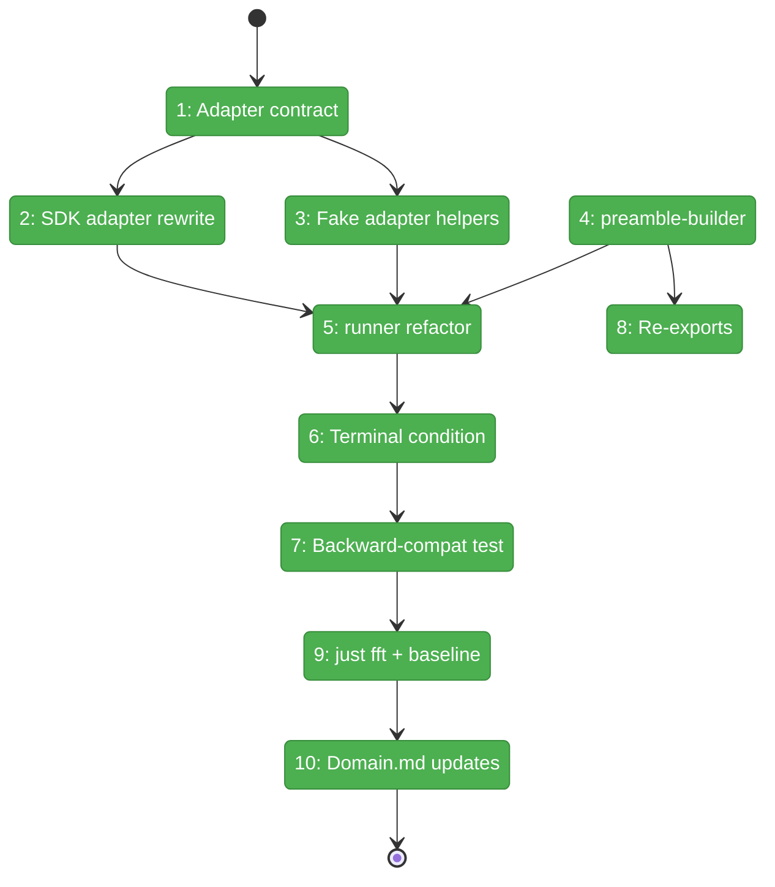
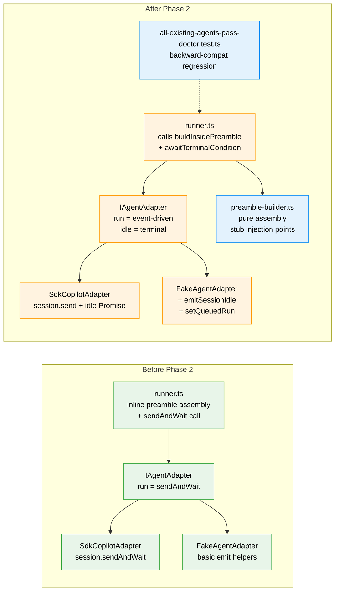

# Flight Plan: Phase 2 — runAgent Event-Driven Refactor + Preamble Builder

**Plan**: [coordination-plan.md](../../coordination-plan.md)
**Phase**: Phase 2: runAgent Event-Driven Refactor + Preamble Builder
**Generated**: 2026-04-26
**Status**: Landed

---

## Departure → Destination

**Where we are**: Phase 1 landed runner foundations — `state.ts`, `context.ts`, `atomic-write.ts`, `ulid.ts`, `folder.ts` extensions (path helpers + `outside.md` discovery + `parseCoordinationField`), four JSON schemas, and types (`InboxMessage`, `OutsideState`, `InsideState`, `Side`, `CoordinationFrontmatter`). All 9 existing agents pass `doctor` + `list` baselines unchanged. `runAgent` still uses `session.sendAndWait(prompt)` for a single-turn, blocking call. The preamble assembly is an inline string-join in `runner.ts:252–270`. `IAgentAdapter.run()` semantics are "send-and-wait" — it can't yet support mid-turn `session.send` from forwarders.

**Where we're going**: After P2, `runAgent` will be **event-driven**: `session.send(prompt)` once, then resolve on `session_idle`. `compact()` keeps `sendAndWait` (terminal call). The preamble assembly moves into a pure `buildInsidePreamble(...)` function in a new `src/runner/preamble-builder.ts`, with stub injection points for the workshop-005 tools section, the workshop-008 identity block, and the workshop-008 peer-contract section. Stubs are conditional on `coordination.enabled`, so the 9 existing agents see byte-identical preamble output. `FakeAgentAdapter` gains event-driven test helpers (`emitSessionIdle`, queued-run support) so P3–P6 forwarder tests can drive the loop programmatically. A backward-compat regression test (`test/cli/all-existing-agents-pass-doctor.test.ts`) diffs every agent's `doctor` + `list` output against the P1 baseline and checks a representative `hello-world` run-path report shape. After this phase, P3 can wire forwarders that call `session.send` mid-turn without changing the adapter contract.

---

## Domain Context

### Domains We're Changing

| Domain | What Changes | Key Files |
|--------|--------------|-----------|
| `runner` | New `preamble-builder.ts` (pure assembly module). `runner.ts` inner loop refactored to consume it + integrate the event-driven adapter contract. `index.ts` re-exports `buildInsidePreamble`. | `src/runner/preamble-builder.ts` (NEW), `src/runner/runner.ts` (MODIFY lines 252–270 + 344–410), `src/runner/index.ts` (MODIFY — additive re-export) |
| `adapter` | `IAgentAdapter.run()` JSDoc clarifies the event-driven terminal-condition contract (no signature change). `SdkCopilotAdapter.run()` swaps `sendAndWait` → `session.send` + idle Promise. `compact()` UNCHANGED. `FakeAgentAdapter` gains event-driven test helpers. | `src/adapter/interface.ts` (MODIFY), `src/adapter/sdk-copilot.ts` (MODIFY lines 116–119), `src/adapter/fake.ts` (MODIFY) |

### Domains We Depend On (no changes)

| Domain | What We Consume | Contract |
|--------|----------------|----------|
| `runner` (P1 outputs) | `AgentDefinition.coordination` + `AgentDefinition.outsideContract` (set by `parseFrontmatter`); `MINIH_ENV_KEYS` constant | `src/runner/folder.ts`, `src/runner/types.ts`, `src/runner/runner.ts:142` |
| `adapter` events | `AgentSessionEvent` with `'session_idle'` discriminant (already exists at `events.ts:84–91`) | `src/adapter/events.ts` |

---

## Flight Status

<!-- Updated by /plan-6-v2: pending → active → done. Use blocked for problems/input needed. -->

**Legend**: grey = pending | yellow = active | red = blocked/needs input | green = done

---

## Stages

<!-- Updated by /plan-6-v2 during implementation: [ ] → [~] → [x] -->

- [x] **Stage 1: Extend adapter contract** — JSDoc on `IAgentAdapter.run()` (idle = resolve, error = fail-not-throw); add `SessionSender` type + `AgentRunOptions.onSessionReady?` callback in `src/adapter/events.ts` (load-bearing seam for P3 forwarders) (`src/adapter/interface.ts`, `src/adapter/events.ts`)
- [x] **Stage 2: Rewrite SdkCopilotAdapter.run()** — swap `sendAndWait` → `session.send` + idle Promise; reject on `session_error`; capture `unsubscribe()` for finally; `idleSettled` guard; invoke `onSessionReady` with bound send. `compact()` + `terminate()` UNCHANGED. Cover with `test/adapter/sdk-copilot.test.ts` (new) (`src/adapter/sdk-copilot.ts`)
- [x] **Stage 3: Extend FakeAgentAdapter** — `emitSessionIdle` + `setQueuedRun` + `emitPendingMessagesModified` + `onSessionReady` stub with `getSessionSendHistory()` recorder (`src/adapter/fake.ts`, `test/adapter/fake.test.ts` — new file)
- [x] **Stage 4: Create preamble-builder** — pure module with section-framed stub markers (HTML comment + section header + blockquote-framed peer-contract); snapshot tests for enabled/disabled × outside.md presence + JSDoc "do not call for resume" (`src/runner/preamble-builder.ts` — new file, `test/runner/preamble-builder.test.ts` — new file)
- [x] **Stage 5: Refactor runner.ts** — consume `buildInsidePreamble` in non-resume branch; resume bypass at lines 254–256 unchanged; wire `onSessionReady` (no-op in P2; P3 wires real); existing 9 agents unchanged (`src/runner/runner.ts`)
- [x] **Stage 6: Terminal-condition machinery** — `awaitTerminalCondition(adapterResult, pendingForwarderCount: () => number)` accepts a GETTER (P3 supplies live counter); P2 placeholder `() => 0`; test SDK-level timeout drop + outer-race + clean adapter finally (`src/runner/runner.ts`, `test/runner/runner-event-driven.test.ts` — new file)
- [x] **Stage 7: Backward-compat regression** — `test/cli/all-existing-agents-pass-doctor.test.ts` diffs against P1 baselines; **gated behind `MINIH_REGRESSION=1`** (default `npm test` skips, ~9s runtime); document in AGENTS.md (`test/cli/all-existing-agents-pass-doctor.test.ts` — new file)
- [x] **Stage 8: Re-export buildInsidePreamble + SessionSender** — `src/runner/index.ts` additive; `SessionSender` re-exported so P3's forwarders can type their session-handle parameter (`src/runner/index.ts`)
- [x] **Stage 9: just fft + baseline diff** — pipeline green with AND without `MINIH_REGRESSION=1`; baseline diff exits 0; own every finding
- [x] **Stage 10: Update domain.md** — incremental History-entry append + minor Composition addition (preamble-builder); full restructure deferred to P7 task 7.4 (`docs/domains/runner/domain.md`, `docs/domains/adapter/domain.md`)

---

## Architecture: Before & After

**Legend**: existing (green, unchanged) | changed (orange, modified) | new (blue, created)

---

## Acceptance Criteria

- [x] **AC-RUN-AGENT-EVENT-DRIVEN** (workshop 007 §"Terminal condition for runAgent") — `runAgent` uses `session.send` + idle subscription, NOT `sendAndWait`. Single-message and queued-message flows both reach completion via the same idle path; `session_error` before `session_idle` resolves with `status: 'failed'` (does NOT hang).
- [x] **AC-BACKWARD-COMPAT (continued)** — all 9 existing agents produce byte-identical `doctor` + `list` output to the P1 baseline, and a representative `hello-world` run-path writes the expected report shape. Verified by `MINIH_REGRESSION=1 npm test` running `test/cli/all-existing-agents-pass-doctor.test.ts` + manual `bash scripts/capture-p1-baseline.sh /tmp/p2 && node scripts/diff-baselines.mjs <p1-baselines> /tmp/p2` exit 0.
- [x] **Preamble byte-equivalence** — `buildInsidePreamble` produces identical output to today's inline assembly when `coordination.enabled === false` (or `coordination` undefined → defaults to `{enabled: false}`). Snapshot test in `test/runner/preamble-builder.test.ts`; fixture captured BEFORE T005 runs.
- [x] **Forward-compat seams in place** — `onSessionReady` callback fires once with a working `send` reference; `awaitTerminalCondition` accepts `() => number` getter (P3 wires live counter); FakeAgentAdapter exposes `emitSessionIdle`, `setQueuedRun`, `emitPendingMessagesModified`, `getSessionSendHistory` for P3–P6.
- [x] **`just fft` exits 0** — no new lint, type, test, or audit findings, with AND without `MINIH_REGRESSION=1` (per AGENTS.md "Pre-commit / pre-push gate" rule).

## Goals & Non-Goals

**Goals**:
- Lift `runAgent` from `sendAndWait` to event-driven loop using `session.send` + `session_idle`.
- Extract preamble assembly into `preamble-builder.ts` with stub injection points for P6 wiring.
- Extend `FakeAgentAdapter` to support event-driven test contract (for P3–P6).
- Preserve byte-identical behavior for the 9 existing non-coordinated agents.
- Establish the terminal-condition seam (`awaitTerminalCondition`) for P3 to wire real forwarder-queue tracking.

**Non-Goals**:
- No real identity-block / tools-section / peer-contract content (P6).
- No forwarders (P3).
- No file-watcher (P3).
- No MCP tools (P4).
- No new CLI commands (P5).
- No widening of `MagicWandTarget` or new `RetrospectiveCoordination` type (P6).
- No change to `compact()` or `terminate()` adapter methods.

---

## Checklist

- [x] T001: Document the event-driven terminal-condition contract on `IAgentAdapter.run()` (JSDoc; no signature change unless tests prove ergonomics gain)
- [x] T002: Rewrite `SdkCopilotAdapter.run()` — `sendAndWait` → `session.send` + idle Promise; cover with `test/adapter/sdk-copilot.test.ts`
- [x] T003: Extend `FakeAgentAdapter` with `emitSessionIdle` + queued-run helpers; cover with `test/adapter/fake.test.ts`
- [x] T004: Create `src/runner/preamble-builder.ts` + snapshot tests (enabled/disabled × outside.md presence × resume mode)
- [x] T005: Refactor `runner.ts` to consume `buildInsidePreamble` + integrate event-driven adapter contract
- [x] T006: Add `awaitTerminalCondition` machinery (placeholder pending-forwarder count = 0; P3 wires real)
- [x] T007: Implement `test/cli/all-existing-agents-pass-doctor.test.ts` — backward-compat regression diffing P1 baselines
- [x] T008: Re-export `buildInsidePreamble` + `PreambleAssemblyInput` from `src/runner/index.ts`
- [x] T009: Run `just fft` + baseline diff (exit 0); own every finding
- [x] T010: Update `docs/domains/runner/domain.md` + `docs/domains/adapter/domain.md` (Composition + Contracts + History entries for P2)
