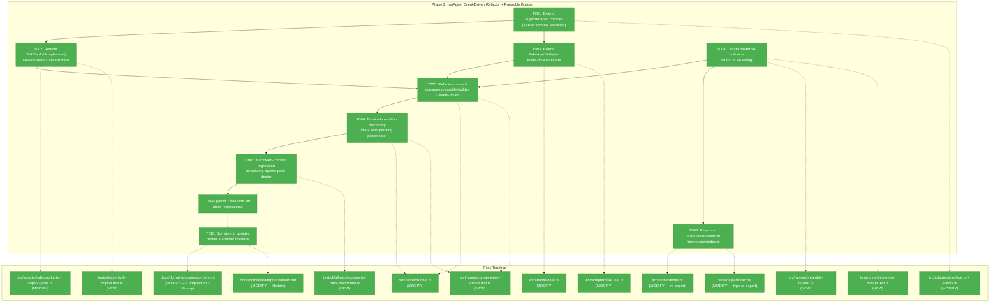
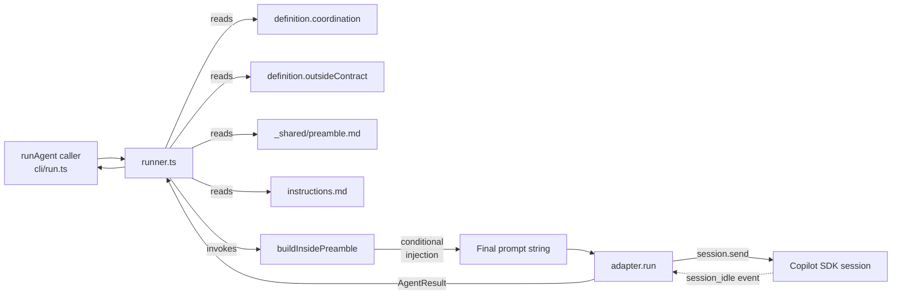
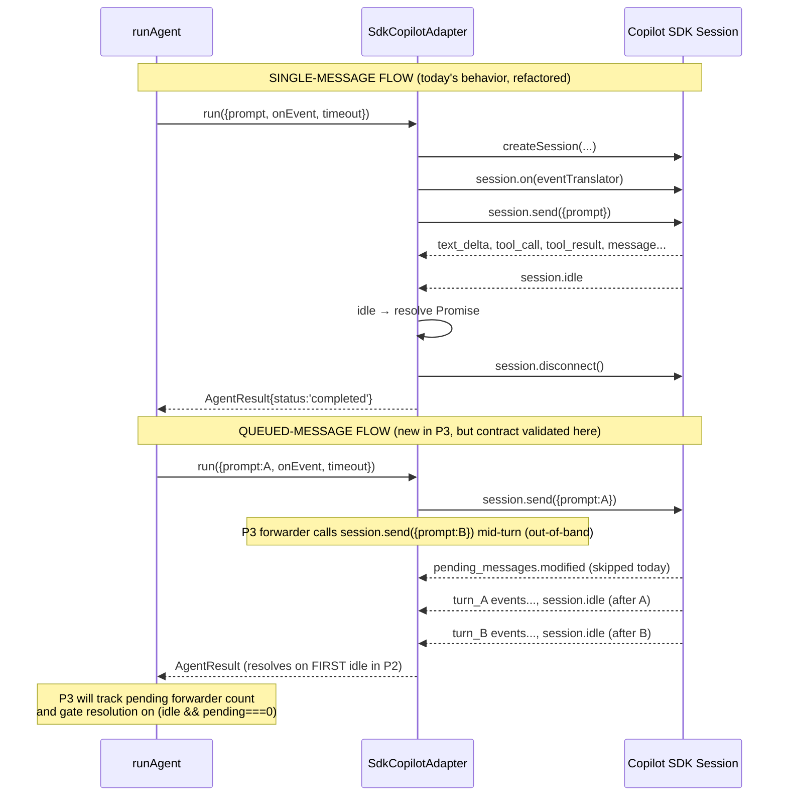

# Phase 2 — runAgent Event-Driven Refactor + Preamble Builder

**Plan**: [coordination-plan.md](../../coordination-plan.md)
**Phase**: Phase 2: runAgent Event-Driven Refactor + Preamble Builder
**Generated**: 2026-04-26
**Status**: Landed
**Mode**: Full
**Complexity**: CS-4 (load-bearing — every downstream phase depends on this contract)

---

## Executive Briefing

**Purpose**: This phase performs the load-bearing pivot at the core of plan 007. Today `runAgent` calls `session.sendAndWait(prompt)` and waits for the entire turn to complete before returning. Phase 2 lifts that to an **event-driven loop** — `session.send(prompt)` once, then subscribe to `session_idle` (and `pending_messages.modified` for queue observability) to know when to terminate. This is the contract every later phase requires: P3's forwarders push more messages mid-turn via `session.send`; P4's MCP tools assume the SDK queue is the only queue; P6 layers identity-block + peer-contract content into the preamble. To keep the preamble assembly composable, P2 also extracts it from the inline `runner.ts` block (lines 252–269 today) into a dedicated `preamble-builder.ts` module with stub injection points for the P6 content.

**What We're Building**:
1. A new pure module `src/runner/preamble-builder.ts` that assembles the inside prompt by layering: universal preamble → identity-block stub → workshop-005 tools-section stub → peer-contract stub → agent body → instructions → SYSTEM_OUTPUT_INSTRUCTIONS. The stubs are conditional on `coordination.enabled` (always `false` for the 9 existing agents → byte-identical preamble).
2. An extended `IAgentAdapter` contract that exposes the event-stream + idle subscription primitive (the existing `onEvent` callback already streams events; the new contract clarifies the terminal-condition guarantee).
3. A rewritten `SdkCopilotAdapter.run()` that drops `sendAndWait` and uses `session.send` + a Promise-wrapped subscription to `session_idle`. `compact()` keeps its `sendAndWait` (single-turn, terminal — out of scope per workshop 007).
4. An extended `FakeAgentAdapter` that supports the same event-stream + idle contract for downstream tests in P3–P6 (inbox-injection harnesses).
5. A refactored `runner.ts` inner loop that consumes `preamble-builder` and tracks the new terminal condition (idle reached + zero pending forwarders queued — the forwarder count is a placeholder of `0` until P3 wires the real counter).
6. A backward-compat regression test (`test/cli/all-existing-agents-pass-doctor.test.ts`) that diffs `minih doctor` + `minih list` against the captured P1 baseline and drives a deterministic representative `hello-world` run-path to keep report shape covered without invoking the real SDK.

**Goals**:
- ✅ AC-RUN-AGENT-EVENT-DRIVEN — `runAgent` reaches completion using `session.send` + `session_idle` subscription only, validated for both single-message and queued (back-to-back send) flows.
- ✅ AC-BACKWARD-COMPAT (continued from P1) — all 9 existing agents produce the same `doctor` + `list` discovery output as the P1 baseline, and the representative `hello-world` run-path preserves report shape. No visible behavior change for non-coordinated agents.
- ✅ Preamble-builder produces byte-identical output to today's inline assembly when `coordination.enabled === false`. Snapshot test pins this.
- ✅ FakeAgentAdapter supports event-driven contract so P3–P6 tests can drive the loop programmatically (inject `session_idle` events, assert terminal condition).

**Non-Goals**:
- ❌ Wiring real identity-block content (workshop 008) — stubs only; real content lands in P6 task 6.1.
- ❌ Wiring real peer-contract content (workshop 008) — stubs only; real content lands in P6 task 6.3.
- ❌ Wiring workshop 005 tools-section content — stubs only; real content lands in P6 task 6.2.
- ❌ Implementing forwarders (`inbox-forwarder.ts`, `state-forwarder.ts`) — P3.
- ❌ Implementing `file-watcher.ts` — P3.
- ❌ Adding any new MCP tooling — P4.
- ❌ Adding any new CLI commands — P5.
- ❌ Cold-start drain on resume — P3 task 3.4.
- ❌ Run-folder snapshot logic (`state-snapshot.json` + `inbox-snapshot/`) — P6 task 6.9.
- ❌ Widening `MagicWandTarget` enum or adding `RetrospectiveCoordination` type — P6 (avoid type-vs-validator drift, per Phase 1's deferral).
- ❌ Per-agent state schema files (`inside-state.schema.json`, `outside-state.schema.json`) — P6.

---

## Prior Phase Context (Phase 1: Runner Foundations)

### A. Deliverables from Phase 1 (consumable by Phase 2)

| Module | Path | Phase 2 use |
|--------|------|-------------|
| `state.ts` | `src/runner/state.ts` | Not consumed by P2 directly; available if preamble needs to surface state shape examples (it shouldn't) |
| `context.ts` | `src/runner/context.ts` | `MINIH_ENV_KEYS_ALL` may be referenced if preamble lists env-vars; `detectContext` not used in P2 |
| `atomic-write.ts` | `src/runner/atomic-write.ts` | Not consumed by P2 directly (P2 doesn't write state) |
| `ulid.ts` | `src/runner/ulid.ts` | Not consumed by P2 directly |
| `folder.ts` extensions | `src/runner/folder.ts` | `parseFrontmatter`, `hasOutsideMd`, `outsideMdPath` are exported P1 helpers. Note: `parseCoordinationField` is **private** to `folder.ts` (called internally by `parseFrontmatter`); P2 does NOT call it — the parsed `coordination` field arrives via `AgentDefinition.coordination` populated upstream by `resolveAgent`. |
| `types.ts` extensions | `src/runner/types.ts` | `CoordinationFrontmatter`, `Side`, plus `AgentDefinition.coordination?` (optional — defaults to `undefined` when frontmatter absent; P2 normalizes via `definition.coordination ?? { enabled: false }`) and `AgentDefinition.outsideContract?` are the fields P2's preamble-builder branches on |
| Schemas | `src/schemas/inbox-message.json`, `outside-state.json`, `inside-state.json`, `state-history-entry.json` | Not consumed in P2; P2 doesn't validate inbox/state |
| `runner/index.ts` | re-exports | P2 imports everything via `../runner/index.js` per established pattern |

### B. Dependencies Exported (exact import statements P2 uses)

```typescript
// preamble-builder.ts will import:
import {
  type AgentDefinition,
  type CoordinationFrontmatter,
} from './types.js';
// (preamble-builder is internal to the runner domain — it imports siblings directly,
//  not via index.ts re-export, since it IS part of the runner contract surface)

// runner.ts (after refactor) will import the new preamble-builder:
import { buildInsidePreamble, type PreambleAssemblyInput } from './preamble-builder.js';

// runner.ts already exports MINIH_ENV_KEYS (line 142–157, P1-exported).
// P2 does NOT extend this literal — the three coordination keys
// (MINIH_INBOX_DIR, MINIH_STATE_DIR, MINIH_CONTEXT) live in
// MINIH_ENV_KEYS_COORDINATION (context.ts) and are composed via
// MINIH_ENV_KEYS_ALL. They are surfaced into the spawned process env
// in P3 (forwarders) / P4 (MCP spawn config), NOT in P2.
```

`AgentDefinition` carries optional `coordination?: CoordinationFrontmatter` (per `src/runner/types.ts:41`) and optional `outsideContract?: string`. The preamble-builder normalizes `definition.coordination ?? { enabled: false }` then branches on the resolved `enabled` flag and `definition.outsideContract`.

### C. Gotchas & Debt explicitly carried forward

1. **`pending_messages.modified` is currently SKIPPED in `translateEvent`** (`src/adapter/sdk-copilot.ts:320`). Today the adapter intentionally drops it as "lifecycle noise." For P2's terminal-condition observability the adapter does NOT need to expose this event publicly — `session.idle` alone is sufficient (P0 T001 PASS evidence: both single + queued reach idle cleanly with no extra signal needed). P3 may want it for queue-depth telemetry; P2 leaves the skip in place.
2. **Type-vs-validator drift discipline (from P1)**: do NOT widen `MagicWandTarget` to include `'coordination'` and do NOT add `RetrospectiveCoordination` to `types.ts`. Both are deferred to P6 task 6.4 where the schema, validator, and type all change together.
3. **F002 lesson (from P1 review)**: when validating something, type-check VALUES not just key presence. The preamble-builder doesn't validate untrusted input (it consumes already-validated `AgentDefinition`), but if a future task adds JSON-schema-driven prompt fragments, follow the F002 pattern.
4. **F001 lesson (from P1 review)**: when parsing user-supplied JSON inline, use strict `JSON.parse` with full-object validation. Not directly applicable to P2 but mentioned for consistency.
5. **No-rule-engine guarantee**: state.ts deliberately has no `requiresPeer` / `transitionAllowed` / `gate` keywords. P2's preamble may MENTION the convention-based state machine in copy, but must not introduce server-side gating logic in `runner.ts`.
6. **`sendAndWait` removal contract (per finding 05)**: drop completely from `runAgent`'s code path — do NOT branch (`if firstMessage use sendAndWait else session.send`). The fallback in workshop 007 (P0 risk register) was explicitly NOT triggered by the P0 T001 PASS result.
7. **`compact()` keeps `sendAndWait`** (`src/adapter/sdk-copilot.ts:173`) — it is a single-turn terminal call with no mid-turn injection use case. Out of scope for P2.
8. **`terminate()` UNCHANGED in P2**: It already uses `resumeSession` + `abort()` + `destroy()` (`sdk-copilot.ts:198–216`) with no `sendAndWait` dependency. No modification required.
9. **Pre-existing timeout-unit double-multiplication bug at `sdk-copilot.ts:118`**: `runner.ts:341/383` already converts `config.timeout` (seconds) to `timeoutMs`, but `sdk-copilot.ts:118` does `options.timeout * 1000` — a 1000× overshoot. **P2 naturally avoids this** in the `run()` path because the new `session.send` flow does NOT pass a timeout to the SDK at all (the runner's outer `Promise.race` is the sole timer). The bug remains in `compact()` — flag for follow-up fix mode, but explicitly out of scope for P2.

### D. Incomplete Items (P2 owns these)

- `src/runner/preamble-builder.ts` (NEW) — the assembly skeleton + stubs.
- Refactor of `runner.ts:252–270` to consume `preamble-builder` instead of inline string-join.
- Refactor of `runner.ts:344–410` (the `adapter.run(...)` call + timeout race) to handle the event-driven idle contract — minimal change since `adapter.run()` already returns when complete, but the test expectations change.
- `src/adapter/interface.ts` — add JSDoc clarifying the `run()` terminal-condition contract; add an optional `onSessionIdle?: () => void` hook to `AgentRunOptions` (or use the existing `onEvent` for `'session_idle'` event — pick one and document; see Discoveries).
- `src/adapter/sdk-copilot.ts:116–119` — replace `session.sendAndWait(...)` with `session.send(...)` + a Promise-wrapped `session_idle` event subscription. Keep the timeout-race pattern at `runner.ts:387–393` (it already wraps `adapter.run()`).
- `src/adapter/fake.ts` — extend `FakeAgentAdapter` so tests can drive the event-driven contract: emit `session_idle` to signal terminal, support multiple `setEvents` cycles for queued-message scenarios.
- `test/runner/preamble-builder.test.ts` (NEW) — snapshot tests for both `coordination.enabled === false` (byte-identical to today's output) and `coordination.enabled === true` (stubs render with predictable placeholders).
- `test/runner/runner-event-driven.test.ts` (NEW) — covers `runAgent` happy-path + queued-message ordering + terminal-condition (idle reached) + early-termination (timeout) + error paths.
- `test/adapter/sdk-copilot.test.ts` (NEW or MODIFY) — covers the `session.send` + `session_idle` flow against a mock SDK client.
- `test/adapter/fake.test.ts` (NEW or MODIFY) — covers the new event-driven helpers.
- `test/cli/all-existing-agents-pass-doctor.test.ts` (NEW) — backward-compat regression: diffs `minih doctor` + `minih list` against the P1 baseline files (`docs/plans/007-backgrounding/tasks/phase-1-runner-foundations/baselines/{doctor.json,list.json}`) and runs a deterministic representative `hello-world` report-shape check.

### E. Patterns to Follow (established by P1)

1. **Re-export contract through `runner/index.ts`** for anything outside the runner domain consumes. `preamble-builder` IS internal to runner — it can be consumed via direct path (`./preamble-builder.js`) OR via index.ts re-export. Add it to the index.ts re-export so `cli` and tests can import it without reaching into internals.
2. **Typed errors** (`StateCorruptError`, `InvalidSlugError`, `OutsideAgentsDirError` pattern). If P2 introduces new error classes (e.g., `PreambleAssemblyError`), follow the same Error-subclass pattern with `this.name = 'PreambleAssemblyError'`.
3. **vitest layout**: `test/<domain>/<module>.test.ts` mirrors `src/<domain>/<module>.ts`. Snapshot tests via vitest's `toMatchInlineSnapshot()` for stability.
4. **Schema $id contract** (P1): all JSON schemas use absolute URIs `https://minih.dev/schemas/<name>.json`. P2 doesn't add schemas, so not applicable.
5. **No-rule-engine self-grep** (`test/runner/state.test.ts:316–330`): runtime test that the source file contains no rule-engine keywords. P2 should consider adding a similar test if the preamble-builder grows logic — but for stubs-only it's overkill.
6. **Atomic-write convention**: P2 doesn't mutate state; not applicable.
7. **Backward-compat baseline diffing**: P1 captured `doctor.json` + `list.json` baselines via `scripts/capture-p1-baseline.sh` and compared via `scripts/diff-baselines.mjs`. P2 task 2.7 reuses this infrastructure — the baseline files already exist; the test just re-captures + diffs.
8. **Pre-commit / pre-push gate** (per AGENTS.md addition from P1): every `just fft` finding is ours. P2 must run `just fft` before commit and own every lint, type, or test failure surfaced.

---

## Pre-Implementation Check

| File | Exists? | Domain Check | Notes |
|------|---------|--------------|-------|
| `src/runner/preamble-builder.ts` | NO | runner/internal — correct domain (preamble assembly is runner's responsibility per `_shared/preamble.md` ownership and existing `runner.ts:39–41` resolver) | NEW — pure function module; no I/O |
| `src/runner/runner.ts` | YES | runner/contract — correct domain | MODIFY lines 252–270 (preamble assembly) and 344–410 (adapter.run call site, post-event-driven contract). Existing 684 LOC; expect net change ≤ 80 LOC. |
| `src/runner/index.ts` | YES | runner/contract | MODIFY — add `buildInsidePreamble` + `PreambleAssemblyInput` re-exports (plan manifest lists this file as P1, P3; P2 additive re-export is consistent and forward-compatible with P3's later additions). |
| `src/adapter/interface.ts` | YES | adapter/contract | MODIFY — add JSDoc clarifying terminal-condition (idle resolves, error fails-not-throws). 22 LOC today; expect ≤ 40 LOC after. |
| `src/adapter/events.ts` | YES | adapter/contract | MODIFY — add `SessionSender` type alias and extend `AgentRunOptions` with optional `onSessionReady?: (sender: SessionSender) => void`. `AgentSessionEvent` discriminant unchanged (`'session_idle'` already present at lines 84–91). |
| `src/adapter/sdk-copilot.ts` | YES | adapter/internal | MODIFY — `run()` swap `sendAndWait` → `session.send` + idle Promise (lines 116–119). `compact()` UNCHANGED (line 173). 338 LOC today; expect ≤ 360 LOC after. |
| `src/adapter/fake.ts` | YES | adapter/internal | MODIFY — extend with `emitSessionIdle()` helper + `runDuration` interaction with idle event ordering. 211 LOC today; expect ≤ 260 LOC after. |
| `test/runner/preamble-builder.test.ts` | NO | runner/internal | NEW — snapshot tests (≥ 6 cases: enabled/disabled × no-outside.md/with-outside.md × no-instructions/with-instructions). |
| `test/runner/runner-event-driven.test.ts` | NO | runner/internal | NEW — happy path + queued + timeout + error + idle-with-pending vs idle-with-no-pending. |
| `test/adapter/sdk-copilot.test.ts` | unknown — check | adapter/internal | NEW or MODIFY — covers event-driven `session.send` + idle path against a mock `ICopilotClient`. |
| `test/adapter/fake.test.ts` | unknown — check | adapter/internal | NEW or MODIFY — covers `emitSessionIdle` + queued-message helpers. |
| `test/cli/all-existing-agents-pass-doctor.test.ts` | NO | cli/internal | NEW — backward-compat regression test diffing `minih doctor` + `minih list` against all 9 baseline agents and checking a representative `hello-world` run-path report shape. |

**Concept-search check**: searched for existing `preamble`-named modules (`grep -rn "buildPreamble\|assemblePrompt\|preambleBuilder" src/` recommended at task start) — `runner.ts:39–41` has `resolvePreamblePath` (a path resolver) and the inline assembly at lines 252–270 (a string-join). No prior abstraction exists; clean greenfield for `preamble-builder.ts`.

**Contract changes flagged**:
- `IAgentAdapter.run()` semantic contract changes (no signature change required, but the terminal-condition guarantee tightens). Document in JSDoc; existing callers (`runner.ts`, both adapters) all migrate together.
- `runner/index.ts` re-export surface grows by 1 export (`buildInsidePreamble`). Additive; no breaking change.

**Harness context**: No `docs/project-rules/harness.md` exists in this repo. P2 uses standard testing approach (vitest unit + the regression test in 2.7 acts as the L2-equivalent harness sweep over real agents). Phase 0 scratch tests already empirically validated the SDK-level pattern; P2 implements production-quality coverage on top of that evidence base.

---

## Architecture Map



---

## Tasks

| Status | ID | Task | Domain | Path(s) | Done When | Notes |
|--------|-----|------|--------|---------|-----------|-------|
| [x] | T001 | Extend `IAgentAdapter` contract for the event-driven terminal-condition. Add JSDoc to `run()` stating: "`run()` resolves when the SDK session emits `session_idle` AND no further `session.send` calls are queued by the caller. If `session_error` fires before `session_idle`, `run()` resolves with `status: 'failed'` (NOT a thrown rejection)." Add optional `onSessionReady?: (sender: SessionSender) => void` field to `AgentRunOptions` (where `SessionSender = { send: (prompt: string) => Promise<string> }`) — invoked once `session.send({prompt})` has been called and the live session handle is available; this is the seam P3's forwarders use to call `session.send` mid-turn without importing `sdk-copilot.ts`. Both `SdkCopilotAdapter` and `FakeAgentAdapter` must implement this contract. | adapter | `/Users/jordanknight/substrate/minih/src/adapter/interface.ts`, `/Users/jordanknight/substrate/minih/src/adapter/events.ts` (add `SessionSender` type + extend `AgentRunOptions`) | JSDoc updated; `SessionSender` type added; `AgentRunOptions.onSessionReady` optional field added; both adapters implement the contract; tsc clean. | Per finding 05 + workshop 007 §"Terminal condition for runAgent". `AgentSessionEvent` already includes `'session_idle'` (`events.ts:84–91`) — no event-schema change needed. **`onSessionReady` is the load-bearing seam for P3 forwarders.** |
| [x] | T002 | Rewrite `SdkCopilotAdapter.run()` (lines 116–119): replace `await session.sendAndWait({prompt: prompt.trim()}, timeout)` with `await session.send({prompt: prompt.trim()})` followed by a Promise wrapped around the existing `session.on(...)` subscription (lines 88–114) that resolves on first `session_idle` and REJECTS on first `session_error`. Capture `const unsubscribe = session.on(...)` so `finally` can call `unsubscribe()` BEFORE `session.disconnect()` — prevents subscription leak on session reuse. Set `idleSettled` boolean guard inside the handler so the second `session_idle` event in queued flow is still translated and emitted via `onEvent` (NDJSON log stays complete) but does NOT re-resolve the already-settled Promise. Invoke `options.onSessionReady?.({ send: (p) => session.send({prompt: p}) })` immediately after the initial `session.send` so P3's forwarders can wire to the live handle. **`compact()` (line 173) and `terminate()` (line 198) UNCHANGED** — single-turn / abort-only use cases. **Note**: pre-existing timeout-unit double-multiplication bug at `sdk-copilot.ts:118` (`options.timeout * 1000` where `runner.ts:383` already passes ms) is OUT OF SCOPE for P2; P2's new `run()` path doesn't pass a timeout to the SDK at all (the runner's outer `Promise.race` is the sole timer), so the bug is naturally avoided in `run()`; document for a follow-up fix on `compact()`. | adapter | `/Users/jordanknight/substrate/minih/src/adapter/sdk-copilot.ts`, `/Users/jordanknight/substrate/minih/test/adapter/sdk-copilot.test.ts` | New event-driven test covers: (a) single-message run reaches idle and resolves; (b) queued-message scenario emits two `session_idle` events in NDJSON but `adapter.run()` returns exactly once (idleSettled guard); (c) outer-race timeout cancels mid-turn AND `terminate()` is called AND `session.disconnect()` runs in adapter's `finally` without unhandled rejection; (d) `session_error` before `session_idle` → idle Promise rejects → `status: 'failed'` envelope returned (not hung); (e) `unsubscribe()` is called exactly once per `run()` invocation; (f) `onSessionReady` callback is invoked exactly once with a working `send` reference. P0 T001 evidence: single scenario reached idle at `idleAfterMs: 6239` (~6.24s); queued at `idleAfterMs: 9960` (~9.96s). See `prework-results.md` §"T001 — scratch/runagent-eventdriven/". | Per finding 05 + P0 T001 PASS. |
| [x] | T003 | Extend `FakeAgentAdapter`: add `emitSessionIdle()` helper, ensure the `_events` array can hold a `session_idle` event that triggers the new terminal condition in tests. Add `setQueuedRun(turns: AgentEvent[][])` test helper that simulates queued-message flow (multiple bursts of events separated by idles) for P3–P6 forwarder tests. Add `emitPendingMessagesModified(queueDepth: number)` helper so P3's `daemon-light.test.ts` and AC-DEBOUNCE-BURSTS can assert queue-depth observations (does NOT require un-skipping the real adapter's `pending_messages.modified` translator — fake-only surface). Implement `onSessionReady` callback in `FakeAgentAdapter.run()` — invoke with a stub `send` that records calls into an inspectable history (`getSessionSendHistory(): string[]`). Preserve all existing helpers (`assertRunCalled`, `getRunHistory`, `setEvents`, etc.). | adapter | `/Users/jordanknight/substrate/minih/src/adapter/fake.ts`, `/Users/jordanknight/substrate/minih/test/adapter/fake.test.ts` | New helpers tested; `onSessionReady` invocation covered; `getSessionSendHistory` returns recorded sends in order; existing 49+ tests in `test/runner/runner.test.ts` (which uses FakeAgentAdapter) still pass with zero behavior change for legacy callers. | Workshop 006 Layer 2 extension (daemon-light update note). Critical for P3–P6 test ergonomics. |
| [x] | T004 | Create `src/runner/preamble-builder.ts` exporting a pure function `buildInsidePreamble(input: PreambleAssemblyInput): string`. Input includes: `definition: AgentDefinition`, `runId: string`, `preamble: string \| null`, `instructions: string \| null`, `outputHint: string`, `paramsHint: string \| null`, `userPrompt: string`, `systemOutputInstructions: string`. Output is the assembled prompt string. Normalize coordination flag via `const coord = definition.coordination ?? { enabled: false }`. Layering when `coord.enabled === false`: identical to today's `runner.ts:252–270` join (zero deviation). Layering when `coord.enabled === true`: insert SECTION-FRAMED stubs (so P6 wiring is a single-string content swap, not a structure invention) between the universal preamble and the agent body — exact stub markers: `<!-- coordination.identity-block:stub -->\n\n## Your Context (coordination)\n\n_(P6 wires identity content here.)_`, then `<!-- coordination.tools-section:stub -->\n\n## Coordination tools available to you\n\n_(P6 wires workshop-005 tools section here.)_`, then if `definition.outsideContract` is present: `<!-- coordination.peer-contract:stub -->\n\n## Peer's Contract (from outside.md)\n\n> ${outsideContract.split('\\n').map(l => '> ' + l).join('\\n')}` (blockquote-framed per workshop 008 §"Decision: outside.md Body Injected as 'Peer's Contract'"). Real content lands in P6 (tasks 6.1, 6.2, 6.3). **Resume bypass remains in `runner.ts`** (caller gates the call); `buildInsidePreamble` does NOT accept an `isResume` flag — JSDoc states: "always assembles full inside preamble; do not call for resume turns." `runId` is included in the input even though the P2 stub ignores it — P6 task 6.1 substitutes it into `<runId>` template var without a contract change. | runner | `/Users/jordanknight/substrate/minih/src/runner/preamble-builder.ts`, `/Users/jordanknight/substrate/minih/test/runner/preamble-builder.test.ts` | Snapshot tests cover: (a) `coord.enabled === false` produces byte-identical output to a fixture captured from current `runner.ts` BEFORE T005 runs (capture via temporary inline test that calls today's exact `[preamble, instructions, outputHint, paramsHint, prompt, SYSTEM_OUTPUT_INSTRUCTIONS].filter(Boolean).join('\n\n---\n\n')` and pin via `toMatchInlineSnapshot()`); (b) `coord.enabled === true` + no `outside.md` renders identity + tools stubs with section headers present; (c) enabled + `outside.md` renders all three stubs with the `outsideContract` body inlined under blockquote-framed `## Peer's Contract (from outside.md)` header; (d) explicit JSDoc + test asserting buildInsidePreamble is NEVER called in resume path (caller gates). Pure function — no I/O, no fs. | Per finding 07 + workshop 005 §"Design Principles" (principle 2 — conditional template substitution) + workshop 008 §"Mental Model: The Four Prompt Layers (inside)" + workshop 008 §"Decision: outside.md Body Injected as 'Peer's Contract'". **Marker syntax review**: HTML comments may be echoed by some LLMs (low risk for stub-only P2 because content is empty placeholder text; P6 must reassess when wiring real content — if echoed, switch to a section-header-only sentinel without the HTML wrapper). |
| [x] | T005 | Refactor `runner.ts:252–270` to call `buildInsidePreamble(...)` instead of inline join — only in the non-resume branch. The `if (isResume)` guard at lines 254–256 stays unchanged (caller gates whether to call buildInsidePreamble). Refactor `runner.ts:344–410` (the `adapter.run(...)` call + timeout race) to wire `onSessionReady` callback through to forwarders (placeholder no-op in P2; P3 wires real forwarders). Wire-through: `runAgent` constructs the `PreambleAssemblyInput` from existing locals (`runId` from line 179, `preamble`, `instructions`, `outputPath` → outputHint, `paramsHint`, `prompt`, `SYSTEM_OUTPUT_INSTRUCTIONS`) and normalizes `definition.coordination ?? { enabled: false }` before calling. | runner | `/Users/jordanknight/substrate/minih/src/runner/runner.ts` | Existing `test/runner/runner.test.ts` passes unchanged for all 9 non-coordinated agents (zero behavior change). Net diff in `runner.ts` ≤ 80 lines. | Per finding 05. The 252–270 line range is the inline assembly; 344–410 is the timeout race wrapping `adapter.run()`. |
| [x] | T006 | Add terminal-condition machinery to `runAgent`: declare "done" when (a) `adapter.run()` returns AND (b) `pendingForwarderCount() === 0`. Add an internal helper `awaitTerminalCondition(adapterResult: AgentResult, pendingForwarderCount: () => number): Promise<AgentResult>` — accepts a `() => number` GETTER (NOT a bare number) so P3 can pass `() => inboxForwarder.pendingCount + stateForwarder.pendingCount` and have a live snapshot at every poll. P2's placeholder is `() => 0`. The helper polls the getter on each idle settling; P3 task 3.6 will replace the no-op poll with a real wait-for-drain loop. Tests cover: idle with `() => 0` → resolve immediately; idle with mocked `() => count > 0` falling to 0 → resolve after the count clears; SDK-level timeout dropped intentionally (only the runner's outer `Promise.race` fires) — assert via test that adapter.run() still-pending when runner's timeout wins, terminate() is called, session.disconnect() runs in adapter finally without unhandled rejection. | runner | `/Users/jordanknight/substrate/minih/src/runner/runner.ts`, `/Users/jordanknight/substrate/minih/test/runner/runner-event-driven.test.ts` | New tests in `runner-event-driven.test.ts` cover happy path + queued-message ordering (using extended FakeAgentAdapter from T003) + timeout + early-termination + the pending-forwarder getter contract. | Workshop 007 §"Terminal condition for runAgent". P2 establishes the seam; P3 fills in the real counter via `() => number` getter. |
| [x] | T007 | Implement `test/cli/all-existing-agents-pass-doctor.test.ts`: spawn `node dist/cli/index.js doctor` and `node dist/cli/index.js list`, capture stdout, and diff against the P1-captured baselines at `docs/plans/007-backgrounding/tasks/phase-1-runner-foundations/baselines/{doctor.json,list.json}` using the same key-stripping logic as `scripts/diff-baselines.mjs` (strip `timestamp, ts, runId, sessionId, duration, startedAt, completedAt, runDir`). Also run a deterministic representative `hello-world` path through `runAgent` with `FakeAgentAdapter` and assert the written `report.json` shape is stable. Test fails if diff is non-empty or the representative report shape changes. **Gate behind `MINIH_REGRESSION=1` env var** so default `npm test` skips it. Document the gate in `AGENTS.md` and mark CI to set the flag. | cli | `/Users/jordanknight/substrate/minih/test/cli/all-existing-agents-pass-doctor.test.ts`, `/Users/jordanknight/substrate/minih/AGENTS.md` (note the env-var gate next to the existing pre-commit/pre-push section) | Test passes locally with `MINIH_REGRESSION=1 npm test`; default `npm test` SKIPS it (preserves <2s inner loop); covers all 9 existing agents via doctor/list and a representative run artifact; emits a clear failure message naming the diverging field if a regression slips in. | AC-BACKWARD-COMPAT (continued from P1). Workshop 006 §Mapping Tests to ACs. Reuses P1 baseline infrastructure. |
| [x] | T008 | Re-export `buildInsidePreamble` and the `PreambleAssemblyInput` type from `src/runner/index.ts`. Also re-export `SessionSender` type from `src/adapter/events.ts` (added in T001) — P3's `inbox-forwarder.ts` will import it to type its session-handle parameter. Maintain alphabetical ordering of exports (P1 convention). Verify all 19+ existing P1 exports remain intact. | runner + adapter | `/Users/jordanknight/substrate/minih/src/runner/index.ts`, `/Users/jordanknight/substrate/minih/src/adapter/index.ts` (if exists; otherwise direct import path is acceptable) | New exports added; tsc clean; test suite green; `cli` and `mcp` (P4–P5) and P3's forwarders can import via `from '../runner/index.js'` / `from '../adapter/events.js'` without reaching into internals. | P1-established re-export surface pattern. |
| [x] | T009 | Run `just fft` (lint → format → build → typecheck → test → audit) — with and without `MINIH_REGRESSION=1` to confirm both paths green. Re-capture baselines via `bash scripts/capture-p1-baseline.sh /tmp/p2-baselines` and diff via `node scripts/diff-baselines.mjs docs/plans/007-backgrounding/tasks/phase-1-runner-foundations/baselines /tmp/p2-baselines` — exit 0 required. Own every finding (per AGENTS.md "Pre-commit / pre-push gate" rule from P1). | runner | `/Users/jordanknight/substrate/minih/justfile` (no edit), `scripts/capture-p1-baseline.sh` (no edit), `scripts/diff-baselines.mjs` (no edit) | `just fft` exits 0 with zero new lint/type/test failures; both default and `MINIH_REGRESSION=1` paths green; baseline diff exits 0; structurally-identical doctor + list output to P1 baseline. | AC-BACKWARD-COMPAT regression. AGENTS.md rule: every fft finding is ours, never deferred as "pre-existing". |
| [x] | T010 | **History-entry append + minor Composition addition only** — full restructure deferred to P7 task 7.4. Update `docs/domains/runner/domain.md`: add `preamble-builder.ts` to Composition; add `buildInsidePreamble` to Contracts; append P2 entry to History (`\| 007/P2 \| Added preamble-builder; switched runAgent to event-driven loop \| 2026-04-26 \|`). Update `docs/domains/adapter/domain.md`: append P2 entry to History noting the event-driven shift + `onSessionReady` contract addition; reference workshop 007 + finding 05. NO change to `docs/domains/registry.md` (no new domain). NO change to `docs/domains/domain-map.md` (no new edges — `runner → adapter` already exists). **Plan classifies these files for P7** (line 143–145), but P1 established the pattern of incremental per-phase History entries with full restructure deferred to P7 — this task follows that pattern. | runner + adapter (docs) | `/Users/jordanknight/substrate/minih/docs/domains/runner/domain.md`, `/Users/jordanknight/substrate/minih/docs/domains/adapter/domain.md` | Both domain.md files updated incrementally; `minih doctor` (or equivalent stale-docs check) green; references workshops 005/007/008 where relevant. P7 task 7.4 will do the full restructure later. | P1 established the History / Composition / Contracts incremental pattern. |

---

## Context Brief

### Key findings from plan (relevant to P2)

- **Finding 05 (Critical)**: `runAgent` must move from `sendAndWait` to event-driven loop. Empirically validated by P0 T001 (both single + queued reach idle cleanly). Drop `sendAndWait` from the `run()` path completely; do NOT branch.
- **Finding 07 (High)**: Two-sided agent file layout. `outside.md` body is injected into the inside prompt under a "Peer's Contract" blockquote-framed section when `coordination.enabled` is true. P2 stubs the injection point; P6 wires the real content.
- **Finding 12 (Medium)**: Frontmatter parser already handles shallow YAML and extends to `coordination` (P1 done). P2 consumes `definition.coordination.enabled` and `definition.outsideContract` directly; no new parsing.
- **Finding 02 (Critical)**: MCP-server-leak NOT REPRODUCED — `client.stop()` cascade is reliable. Not directly P2's concern but informs the `try/finally` discipline P2 inherits in `sdk-copilot.ts:151–157` (existing `await session.disconnect()` in finally — preserve).
- **Finding 11 (Medium)**: FakeAgentAdapter does NOT cover two-agent coordination. T003 extends it to support event-driven contract — the same extension P3–P6 forwarder tests will leverage.

### Domain dependencies (concepts and contracts P2 consumes)

- `runner` (self): `AgentDefinition` (with `coordination: CoordinationFrontmatter` and `outsideContract?: string` from P1), `parseFrontmatter`, `createRunFolder`, `MINIH_ENV_KEYS` array, `SYSTEM_OUTPUT_INSTRUCTIONS` constant, `validateInput/Output/SystemOutput`.
- `adapter`: `IAgentAdapter` interface (extending JSDoc only), `AgentEvent` discriminated union (`session_idle` already a member), `AgentRunOptions` (no signature change), `AgentResult`, `ICopilotClient` type alias.
- No new dependencies on `cli` or `mcp` (those land in P4–P5).
- No new external npm dependencies. (`@modelcontextprotocol/sdk` is P4.)

### Domain constraints

- **Dependency direction**: `runner → adapter` (existing) preserved. No backward edges. `runner` does NOT import from `adapter/sdk-copilot.ts` directly — only from `adapter/interface.ts` and `adapter/events.ts`. P2 maintains this.
- **Adapter-agnostic runner**: `runner.ts:8` ("Zero SDK imports — the runner is adapter-agnostic"). P2 preserves this property — the event-driven contract lives in the `IAgentAdapter` JSDoc; both adapters implement it; the runner just calls `adapter.run()` and trusts the contract.
- **Backward-compat invariant**: 9 existing agents have no `coordination` frontmatter → `definition.coordination = {enabled: false}` → preamble-builder produces byte-identical output to today's inline join → zero behavior change. T007 enforces this with the regression test.

### Reusable from prior phases

- P1 baseline infrastructure: `scripts/capture-p1-baseline.sh` + `scripts/diff-baselines.mjs` + the captured baselines under `docs/plans/007-backgrounding/tasks/phase-1-runner-foundations/baselines/`. P2 task 2.7 reuses these directly.
- P0 T001 scratch test (`scratch/runagent-eventdriven/`) + result note (`prework-results.md` line 15) — empirical evidence the event-driven pattern works. P2's `runner-event-driven.test.ts` codifies this for production.
- P1's typed-error pattern (`StateCorruptError`, `InvalidSlugError`, `OutsideAgentsDirError`, `InvalidCoordinationFrontmatterError`, etc.) — P2 follows the same pattern if introducing new error classes.
- P1's `parseCoordinationField` (`src/runner/folder.ts`) — P2 does NOT call this directly; consumes the already-parsed `definition.coordination` field.

### Mermaid: data flow (preamble assembly)



### Mermaid: event-driven sequence (single + queued)



---

## Discoveries & Learnings

_Populated during implementation by plan-6._

| Date | Task | Type | Discovery | Resolution | References |
|------|------|------|-----------|------------|------------|
| 2026-04-26 | T002 | gotcha | The local `ICopilotSession` facade only modeled `sendAndWait`; the event-driven run path needs `send()` on the facade so adapter tests and implementation stay SDK-isolated. | Added `send(options: { prompt: string }): Promise<unknown>` to `src/adapter/copilot-types.ts`; `SdkCopilotAdapter.run()` uses only the facade, not SDK internals. | `src/adapter/copilot-types.ts`; `test/adapter/sdk-copilot.test.ts` |
| 2026-04-26 | T003 | decision | `FakeAgentAdapter.setQueuedRun(turns)` should model turns, not require callers to manually add idle events after every turn. | Helper emits each supplied turn then appends `session_idle`, giving P3-P6 tests a concise way to model SDK queue behavior. | `src/adapter/fake.ts`; `test/adapter/fake.test.ts` |
| 2026-04-26 | T004 | decision | Coordinated prompt assembly can follow workshop 008 layer order without affecting existing agents because only `coordination.enabled` agents enter that path. | Disabled path remains byte-identical to the old inline join; enabled path places identity/tools/peer-contract stubs after universal preamble, then output/params/body/instructions/system for P6 content swaps. | `src/runner/preamble-builder.ts`; workshop 008 §Mental Model |
| 2026-04-26 | T006 | decision | The runner owns timeout enforcement for `runAgent`; passing the already-ms-converted timeout into the SDK adapter would preserve the old unit-confusion seam. | Removed `timeout` from the runner's `adapter.run(...)` call and wrapped `adapter.run().then(awaitTerminalCondition)` in the existing outer `Promise.race`. | `src/runner/runner.ts`; `test/runner/runner-event-driven.test.ts` |
| 2026-04-26 | T007 | insight | The P1 baseline is aggregate `doctor` + `list`, not per-agent command output; those two envelopes cover all nine current agents but not report artifacts. | The regression test shells the built CLI once per command, strips the same transient keys as `scripts/diff-baselines.mjs`, reports the first differing JSON path, and adds a deterministic `hello-world` run-path report-shape check. | `test/cli/all-existing-agents-pass-doctor.test.ts`; `scripts/capture-p1-baseline.sh` |
| 2026-04-26 | T009 | gotcha | The full gate's audit step surfaced Vite/PostCSS advisories even though earlier focused tests were green. | Ran `npm audit fix`, which updated the lockfile to versions with zero reported vulnerabilities, then reran default and regression-enabled `just fft`. | `package-lock.json`; `just fft`; `MINIH_REGRESSION=1 just fft` |

**Types**: `gotcha` | `research-needed` | `unexpected-behavior` | `workaround` | `decision` | `debt` | `insight`

---

## Directory Layout

```
docs/plans/007-backgrounding/
├── coordination-plan.md
├── coordination-spec.md
├── coordination.fltplan.md
├── workshops/                      ← 005, 007, 008 referenced in this dossier
└── tasks/
    ├── phase-0-pre-work-scratch-tests-and-decision-gate/
    ├── phase-1-runner-foundations/
    │   └── baselines/              ← T007 reuses doctor.json + list.json
    └── phase-2-runagent-event-driven-refactor-and-preamble-builder/
        ├── tasks.md                ← THIS FILE
        ├── tasks.fltplan.md        ← generated by plan-5b
        └── execution.log.md        ← created by plan-6
```

---

## Validation Record (2026-04-26)

| Agent | Lenses Covered | Issues | Verdict |
|-------|---------------|--------|---------|
| Source-Truth | Hidden Assumptions, Edge Cases & Failures, Technical Constraints | 1 HIGH, 1 MEDIUM, 1 LOW | All HIGH+MEDIUM fixed inline; LOW (pre-existing `compact()` timeout bug) flagged out-of-scope with documented rationale |
| Cross-Reference | Integration & Ripple, Domain Boundaries, Concept Documentation | 2 HIGH, 4 MEDIUM, 1 LOW | All HIGH+MEDIUM fixed (workshop section names corrected; T010 P7 scope clarified; latency numbers corrected; prework citation made section-anchored; index.ts plan-manifest classification noted) |
| Completeness | Edge Cases & Failures, Performance & Scale, Deployment & Operations, Hidden Assumptions | 2 CRITICAL, 3 HIGH, 4 MEDIUM | All CRITICAL+HIGH+MEDIUM fixed inline (session_error rejection path, idleSettled guard, subscription unsubscribe, T007 perf-gating, HTML-comment marker safety note, resume bypass location, timeout behavior change, snapshot fixture timing, terminate() status) |
| Forward-Compatibility | Forward-Compatibility | 2 HIGH (CRITICAL for P3), 2 MEDIUM, 1 LOW | All fixed: `awaitTerminalCondition` now accepts `() => number` getter; `onSessionReady?: (sender: SessionSender) => void` added to `AgentRunOptions`; stub markers now include section-header wrapper for P6 single-string swap; `FakeAgentAdapter.emitPendingMessagesModified` added for P3 AC-DEBOUNCE-BURSTS tests; `runId: string` added to `PreambleAssemblyInput` |

### Forward-Compatibility Matrix (post-fix)

| Consumer | Requirement | Failure Mode | Verdict | Evidence |
|----------|-------------|--------------|---------|----------|
| Phase 3 file-watcher + forwarders | extended FakeAgentAdapter with emitSessionIdle + queued-run | test boundary | ✅ | T003 specifies `emitSessionIdle` + `setQueuedRun` + `emitPendingMessagesModified` + `getSessionSendHistory()` |
| Phase 3 file-watcher + forwarders | awaitTerminalCondition seam for real pending-forwarder count | shape mismatch | ✅ | T006 rewritten: `pendingForwarderCount: () => number` getter; P3 supplies `() => inboxForwarder.pendingCount + stateForwarder.pendingCount` |
| Phase 3 file-watcher + forwarders | event-driven IAgentAdapter.run supports mid-turn session.send | lifecycle ownership | ✅ | T001 + T002: `onSessionReady?: (sender: SessionSender) => void` callback in `AgentRunOptions`; `SdkCopilotAdapter` invokes with bound `session.send` |
| Phase 4 MCP domain | stable runner + adapter foundations preserved | — | ✅ | `compact()` + `terminate()` UNCHANGED (Gotchas #7 + #8); `try/finally session.disconnect` preserved; MCP seam at `runner.ts:343–369` untouched |
| Phase 4 MCP domain | client.stop cascade preserved (finding 02) | — | ✅ | Gotchas #4 explicitly preserves `await session.disconnect()` in finally; T002 captures `unsubscribe()` in finally before disconnect |
| Phase 5 CLI outside surface | buildInsidePreamble re-exported via runner/index.ts | encapsulation lockout | ✅ | T008 re-exports `buildInsidePreamble` + `PreambleAssemblyInput` + `SessionSender` |
| Phase 6 agent integration | greppable stub markers (identity-block, tools-section, peer-contract) | contract drift | ✅ | T004 specifies exact stubs with section-header wrapper: `## Your Context (coordination)`, `## Coordination tools available to you`, `## Peer's Contract (from outside.md)` (blockquote-framed) |
| Phase 6 agent integration | definition.outsideContract inlined after peer-contract stub | encapsulation lockout | ✅ | T004 explicitly wraps `outsideContract` body in blockquote (`> ${outsideContract.split('\n').map(l => '> ' + l).join('\n')}`) per workshop 008 |
| Phase 6 agent integration | byte-identical behavior for non-coordinated agents | contract drift | ✅ | T004 snapshot case (a) + T007 backward-compat regression + AC-RUN-FOLDER (P6) preserved |
| Phase 6 agent integration | runId substitution in identity block | shape mismatch | ✅ | T004: `PreambleAssemblyInput.runId: string` included; P2 stub ignores it; P6 task 6.1 substitutes into `<runId>` template var |

**Outcome alignment**: P2, as specified, advances the OUTCOME — *"There is no way for the host caller (Claude Code, CI, human) and the inside agent to coordinate progress mid-task"* — by replacing `sendAndWait` with an event-driven loop, exposing the `onSessionReady` seam P3's forwarders need to push live file changes mid-turn into an open SDK session, and establishing the `() => number` `awaitTerminalCondition` getter contract that lets P3 plug a live drain counter without re-architecting `runner.ts` or `sdk-copilot.ts` internals.

**Standalone?**: No — Phase 3, 4, 5, 6 are all named consumers in the plan tree (`coordination-plan.md` lines 347–499); P2 is explicitly marked CS-4 load-bearing ("every downstream phase depends on this contract").

**Overall**: VALIDATED WITH FIXES (4 CRITICAL + 9 HIGH + 6 MEDIUM applied inline; 2 LOW noted as informational).
