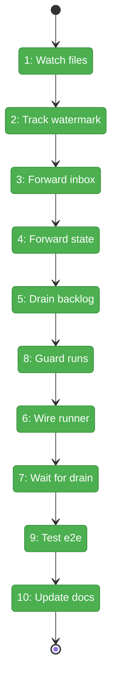
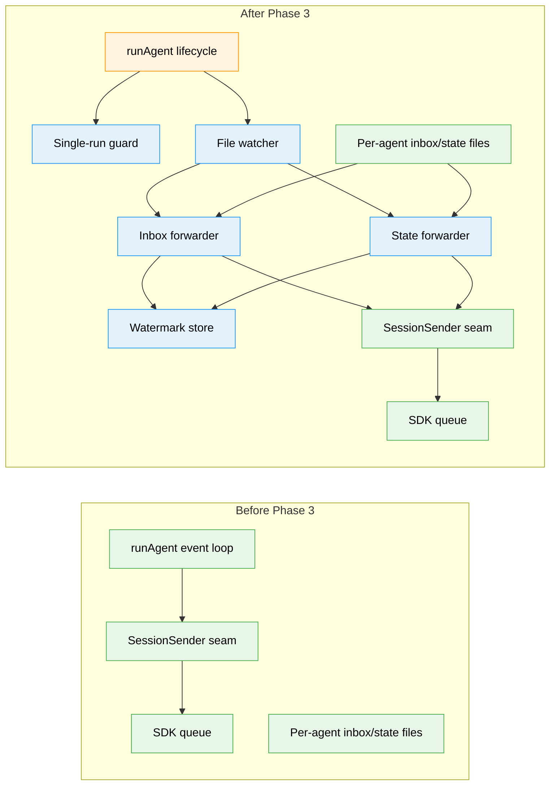

# Flight Plan: Phase 3 — File Watcher + Daemon-Light Forwarders

**Plan**: [coordination-plan.md](../../coordination-plan.md)
**Phase**: Phase 3: File Watcher + Daemon-Light Forwarders
**Generated**: 2026-04-26
**Status**: Landed

---

## Departure → Destination

**Where we are**: Phase 2 landed the event-driven runner and adapter seam. `runAgent` now sends the initial prompt with `session.send`, resolves on `session_idle`, exposes `SessionSender` through `onSessionReady`, and already has a `pendingForwarderCount` terminal-condition placeholder. The inbox/state filesystem paths, atomic write helper, and per-agent shared layout are available from Phase 1, but no production watcher or forwarder exists yet.

**Where we're going**: By the end of Phase 3, a live `minih run` can receive cross-process inbox and state changes from disk and push them into the active SDK session as queued turns. A developer can write an outside inbox message or outside-state update while the run is alive, and runner-owned forwarders will deliver it through the Phase 2 session sender without adding a separate queue.

---

## Domain Context

### Domains We're Changing

| Domain | What Changes | Key Files |
|--------|--------------|-----------|
| `runner` | Add file watcher, inbox forwarder, state forwarder, durable watermark helper, single-run guard, runner lifecycle wiring, tests, and domain docs. | `src/runner/file-watcher.ts`, `src/runner/inbox-forwarder.ts`, `src/runner/state-forwarder.ts`, `src/runner/forwarder-watermark.ts`, `src/runner/run-lock.ts`, `src/runner/runner.ts` |

### Domains We Depend On (no changes)

| Domain | What We Consume | Contract |
|--------|-----------------|----------|
| `adapter` | Live session send handle for mid-run message injection. | `SessionSender`, `AgentRunOptions.onSessionReady` |
| `runner` | P1 path/state/atomic helpers and P2 terminal-condition seam. | `watermarkPath`, `inboxLanePath`, `stateFilePath`, `readStateLazy`, `writeFileAtomic`, `awaitTerminalCondition` |

---

## Flight Status

<!-- Updated by /plan-6-v2: pending → active → done. Use blocked for problems/input needed. -->

**Legend**: grey = pending | yellow = active | red = blocked/needs input | green = done

---

## Stages

<!-- Updated by /plan-6 during implementation: [ ] → [~] → [x] -->

- [x] **Stage 1: Watch files** — Create the debounced native `fs.watch` wrapper for burst, missing-path, watcher-error, and atomic-rename tolerant change detection (`src/runner/file-watcher.ts` — new file).
- [x] **Stage 2: Track watermark** — Define private durable forwarder progress in `state/sdk-watermark.json` with atomic writes and containment tests (`src/runner/forwarder-watermark.ts` — new file).
- [x] **Stage 3: Forward inbox** — Tail outside inbox NDJSON, render messages, send them through `SessionSender`, and advance the watermark only after success (`src/runner/inbox-forwarder.ts` — new file).
- [x] **Stage 4: Forward state** — Detect outside-state changes, send concise state-change prompts, and retry on send failure without adding transition rules (`src/runner/state-forwarder.ts` — new file).
- [x] **Stage 5: Drain backlog** — Send unforwarded inbox/state changes before live watch delivery begins (`src/runner/inbox-forwarder.ts`, `src/runner/state-forwarder.ts`).
- [x] **Stage 6: Wire runner** — Start and stop forwarders in `runAgent` using the Phase 2 `onSessionReady` seam (`src/runner/runner.ts`).
- [x] **Stage 7: Wait for drain** — Feed the live pending-forwarder count into the terminal condition so idle waits for queued sends to settle (`src/runner/runner.ts`, `test/runner/runner-event-driven.test.ts`).
- [x] **Stage 8: Guard runs** — Prevent two live runs from owning watchers for the same agent slug and expose a typed runner error for later CLI mapping (`src/runner/run-lock.ts` — new file).
- [x] **Stage 9: Test e2e** — Add the opt-in daemon-light cross-process test and document how to run it (`test/e2e/daemon-light.test.ts` — new file, `CONTRIBUTING.md`).
- [x] **Stage 10: Update docs** — Re-export intentional contracts, update runner domain docs, and record plan progress (`src/runner/index.ts`, `docs/domains/runner/domain.md`).

---

## Architecture: Before & After

**Legend**: existing (green, unchanged) | changed (orange, modified) | new (blue, created)

---

## Acceptance Criteria

- [x] Inbox NDJSON lines written by another process are forwarded into the in-flight SDK session through `session.send` within 5 seconds.
- [x] Outside-state changes are forwarded into the in-flight SDK session through `session.send` within 5 seconds.
- [x] Cold-start drain forwards unwatermarked inbox/state changes before live watch delivery.
- [x] Restarting a run does not re-forward already-watermarked messages.
- [x] Malformed or torn NDJSON lines do not advance the watermark and are retried on the next drain.
- [x] Rapid write bursts are debounced/coalesced without assuming one watch event equals one write.
- [x] Forwarded messages are visible to the agent after the next idle boundary.
- [x] Empty inbox/state inputs do not produce spurious `session.send` calls.
- [x] A first-ever run with an empty watermark forwards all existing inbox messages.
- [x] Two simultaneous runs for the same agent slug are rejected before watcher ownership conflicts.

## Goals & Non-Goals

**Goals**:
- Add live inbox and state push from per-agent shared files to the active SDK session.
- Reuse Phase 1 path/state/atomic helpers and Phase 2 `SessionSender`/terminal-condition seams.
- Keep delivery idempotent with a durable watermark.
- Add targeted unit tests and an opt-in daemon-light e2e gate.

**Non-Goals**:
- MCP server or tool implementation; Phase 4 owns that.
- Outside CLI commands; Phase 5 owns those.
- Prompt copy for identity/tools/peer-contract sections; Phase 6 owns that.
- Full daemon start/stop/status commands or pidfiles.

---

## Checklist

- [x] T001: Implement the native file watcher primitive (CS-3)
- [x] T002: Define the SDK forwarder watermark helper (CS-3)
- [x] T003: Implement the inbox forwarder drain loop (CS-3)
- [x] T004: Implement the state forwarder diff loop (CS-3)
- [x] T005: Add cold-start drain orchestration (CS-3)
- [x] T006: Wire forwarders into `runAgent` lifecycle (CS-4)
- [x] T007: Integrate the live pending-forwarder terminal count (CS-2)
- [x] T008: Add the single-run guard (CS-2)
- [x] T009: Add the opt-in daemon-light e2e test (CS-3)
- [x] T010: Re-export contracts and update docs (CS-2)

---

## PlanPak

Not active for this plan.
