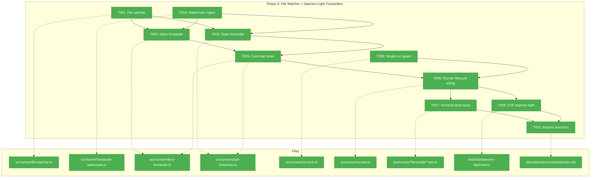
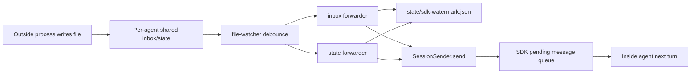
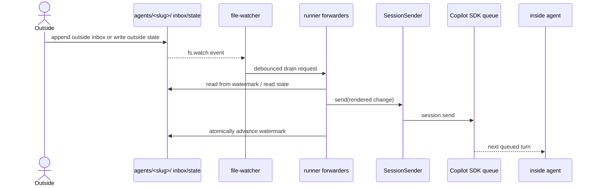

# Phase 3 — File Watcher + Daemon-Light Forwarders

**Plan**: [coordination-plan.md](../../coordination-plan.md)
**Phase**: Phase 3: File Watcher + Daemon-Light Forwarders
**Generated**: 2026-04-26
**Status**: Ready for takeoff
**Mode**: Full
**Complexity**: CS-3

---

## Executive Briefing

**Purpose**: This phase turns the Phase 2 event-driven runner seam into the daemon-light delivery loop described in workshop 007. A live `minih run` process will watch per-agent shared inbox/state files, drain durable changes from disk, and push them into the in-flight SDK session through `SessionSender.send(...)`.

**What We're Building**: Phase 3 adds runner-owned watcher and forwarder modules. `file-watcher.ts` normalizes native `node:fs.watch` behavior behind a debounced callback. `inbox-forwarder.ts` tails `agents/<slug>/inbox/outside/messages.ndjson`, respects a durable watermark, and forwards unwatermarked messages into the session. `state-forwarder.ts` watches `agents/<slug>/state/outside.json`, computes state diffs, and forwards meaningful changes. `runner.ts` then wires those pieces into the run lifecycle using the `onSessionReady` seam from Phase 2 and the live `pendingForwarderCount` terminal-condition getter.

**Goals**:
- ✅ Deliver live inbox push from cross-process filesystem writes to the in-flight SDK session.
- ✅ Deliver live outside-state diffs to the in-flight SDK session.
- ✅ Drain unforwarded inbox/state changes at cold start before regular watch delivery.
- ✅ Preserve idempotency through a durable `state/sdk-watermark.json` marker.
- ✅ Handle fs.watch burst and atomic-rename behavior without assuming one event equals one write.
- ✅ Keep runner SDK-agnostic: forwarders consume `SessionSender`, never SDK internals.
- ✅ Add fast unit coverage plus opt-in daemon-light e2e coverage.

**Non-Goals**:
- ❌ No MCP server, MCP tools, or spawn config; those land in Phase 4.
- ❌ No outside CLI commands such as `outside-send` or `state set`; those land in Phase 5.
- ❌ No final identity/tools/peer-contract prompt content; Phase 6 replaces the Phase 2 stubs.
- ❌ No full background daemon command, pidfile, or IPC socket.
- ❌ No changes to `IAgentAdapter` or `SdkCopilotAdapter` beyond consuming the existing Phase 2 `onSessionReady` contract.
- ❌ No run-folder inbox/state snapshots; those are still Phase 6 work.

---

## Prior Phase Context

### Phase 0: Pre-Work Scratch Tests + Decision Gate

#### A. Deliverables

- `/Users/jordanknight/substrate/minih/scratch/runagent-eventdriven/test.mjs` proved `session.send` plus idle subscription can complete single and queued SDK turns.
- `/Users/jordanknight/substrate/minih/scratch/fswatch-test/test.mjs` measured native `node:fs.watch` behavior, including burst coalescing and atomic-rename events.
- `/Users/jordanknight/substrate/minih/scratch/daemon-light-prototype/test.mjs` proved write -> watcher -> `session.send` -> agent receipt mechanically works.
- `/Users/jordanknight/substrate/minih/scratch/multi-process-watch/test.mjs` validated concurrent NDJSON appends and torn-line retry semantics.
- `/Users/jordanknight/substrate/minih/docs/plans/007-backgrounding/prework-results.md` recorded the FULL GO decision.

#### B. Dependencies Exported

- Forwarder protocol: read from the current watermark, split on newline, stop on parse failure, and never advance the watermark past malformed or incomplete data.
- fs.watch protocol: every watch event is only a hint; forwarders must re-read durable files from the watermark.
- SDK queue contract: `session.send` enqueues turns in order; minih does not own an in-memory message queue.

#### C. Gotchas & Debt

- Agent reasoning dominates visible round-trip latency; Phase 3 should validate mechanical delivery and queueing, not optimize model behavior.
- A permanently malformed NDJSON line can stall the inbox forwarder until repaired; Phase 3 should log loudly and preserve the no-data-loss invariant.
- macOS `fs.watch` can emit duplicate `rename` events for atomic writes; debounce and content re-read are required.

#### D. Incomplete Items

- No Phase 0 blockers remain. The only carry-forward debt is future hardening for permanent garbage-line recovery.

#### E. Patterns to Follow

- Treat scratch tests as evidence and reference implementations, not production imports.
- Preserve append-only NDJSON and durable watermark discipline.
- Prefer simple Node core primitives over new dependencies.

### Phase 1: Runner Foundations

#### A. Deliverables

- `/Users/jordanknight/substrate/minih/src/runner/state.ts` with `readStateLazy`, `writeState`, and `appendHistory`.
- `/Users/jordanknight/substrate/minih/src/runner/context.ts` with coordination env-var constants.
- `/Users/jordanknight/substrate/minih/src/runner/atomic-write.ts` with sync and async write-then-rename helpers.
- `/Users/jordanknight/substrate/minih/src/runner/ulid.ts` with in-tree monotonic ULID generation.
- `/Users/jordanknight/substrate/minih/src/runner/folder.ts` extensions for inbox/state/history/watermark paths and `outside.md` discovery.
- `/Users/jordanknight/substrate/minih/src/schemas/{inbox-message,outside-state,inside-state,state-history-entry}.json`.

#### B. Dependencies Exported

- `inboxLanePath(slug, agentsDir, lane)`, `stateFilePath(slug, agentsDir, side)`, `historyPath(slug, agentsDir)`, and `watermarkPath(slug, agentsDir)`.
- `writeFileAtomic(...)` and `writeFileAtomicAsync(...)`.
- `Side`, `InboxMessage`, `OutsideState`, `InsideState`, `SideState`, and `StateHistoryEntry` types.
- `readStateLazy(...)` for state-forwarder baseline reads.

#### C. Gotchas & Debt

- `state.ts` is intentionally rule-free; Phase 3 must not add transition gates or orchestration policy.
- `watermarkPath()` exists, but Phase 3 owns the actual `sdk-watermark.json` schema and write behavior.
- Phase 1 exported path helpers from `folder.ts`; avoid re-deriving paths in forwarder modules.

#### D. Incomplete Items

- No forwarders, file watcher, MCP server, or CLI commands exist yet.
- Retrospective schema widening and per-agent state schemas remain Phase 6 work.

#### E. Patterns to Follow

- Keep one concept per runner module.
- Reuse the public runner path helpers rather than duplicating folder layout constants.
- Validate values, not just key presence, when parsing persisted JSON.

### Phase 2: runAgent Event-Driven Refactor + Preamble Builder

#### A. Deliverables

- `/Users/jordanknight/substrate/minih/src/runner/preamble-builder.ts` with byte-equivalent disabled prompt assembly and coordination stubs.
- `/Users/jordanknight/substrate/minih/src/runner/runner.ts` event-driven adapter invocation and `awaitTerminalCondition(adapterResult, pendingForwarderCount)`.
- `/Users/jordanknight/substrate/minih/src/adapter/events.ts` with `SessionSender` and `AgentRunOptions.onSessionReady`.
- `/Users/jordanknight/substrate/minih/src/adapter/sdk-copilot.ts` rewritten to use `session.send` plus idle subscription.
- `/Users/jordanknight/substrate/minih/src/adapter/fake.ts` extended with queued-run and session-send helpers.

#### B. Dependencies Exported

- `SessionSender` is the only session handle Phase 3 forwarders should consume.
- `AgentRunOptions.onSessionReady` is the lifecycle hook where `runner.ts` can attach forwarders to the live session.
- `awaitTerminalCondition(adapterResult, pendingForwarderCount: () => number)` is already a live getter seam for Phase 3 queue-drain checks.
- `FakeAgentAdapter.getSessionSendHistory()` lets tests assert forwarded prompts without real SDK calls.

#### C. Gotchas & Debt

- `runner.ts` currently passes `onSessionReady: () => {}` and `pendingForwarderCount = () => 0`; Phase 3 must replace both placeholders.
- `pending_messages.modified` is still adapter-internal noise; Phase 3 should not depend on public queue-depth events.
- `compact()` still uses `sendAndWait`; leave it out of scope.

#### D. Incomplete Items

- `file-watcher.ts`, `inbox-forwarder.ts`, and `state-forwarder.ts` are absent.
- The cold-start drain and real forwarder terminal-condition count are not wired.
- No single-run guard exists yet for the live watcher ownership problem.

#### E. Patterns to Follow

- Keep runner SDK-agnostic; consume only adapter contracts.
- Use `finally` cleanup for watchers/forwarders so timeouts and failures do not leak resources.
- Preserve non-coordinated agent behavior; forwarders should be no-op when no coordination files exist.

---

## Pre-Implementation Check

| File | Exists? | Domain Check | Notes |
|------|---------|--------------|-------|
| `/Users/jordanknight/substrate/minih/src/runner/file-watcher.ts` | ❌ NEW | runner internal | Major concept search found no existing production watcher; create native `node:fs.watch` wrapper with debounce, missing-path startup behavior, watcher error handling, and close semantics. |
| `/Users/jordanknight/substrate/minih/test/runner/file-watcher.test.ts` | ❌ NEW | runner test | Vitest fake-timer coverage for burst coalescing, duplicate events, rename events, missing dirs/files, watcher errors, and close behavior. |
| `/Users/jordanknight/substrate/minih/src/runner/forwarder-watermark.ts` | ❌ NEW | runner internal | Suggested helper for `state/sdk-watermark.json`; P3 owns the private file format. It must support durable progress for torn-line-safe inbox retry, idempotent restart, and state-send retry without making the JSON shape a public contract. |
| `/Users/jordanknight/substrate/minih/test/runner/forwarder-watermark.test.ts` | ❌ NEW | runner test | Validate missing watermark behavior, corrupt-watermark recovery as an explicit P3 internal rule, atomic writes, and delayed state progress updates. |
| `/Users/jordanknight/substrate/minih/src/runner/inbox-forwarder.ts` | ❌ NEW | runner internal | Tails `inbox/outside/messages.ndjson`, renders messages, calls `SessionSender.send`, and advances watermark only after send succeeds. |
| `/Users/jordanknight/substrate/minih/test/runner/inbox-forwarder.test.ts` | ❌ NEW | runner test | Idempotency, ordering, malformed/torn-line retry, empty inbox, cold-start backlog, and send failure behavior. |
| `/Users/jordanknight/substrate/minih/src/runner/state-forwarder.ts` | ❌ NEW | runner internal | Watches/diffs `state/outside.json`, renders state-change prompts, and persists state progress only after `SessionSender.send` succeeds. |
| `/Users/jordanknight/substrate/minih/test/runner/state-forwarder.test.ts` | ❌ NEW | runner test | Diff detection, missing-state synthetic default, debounce, corrupt-state surfacing, no-op unchanged state, cold-start backlog, and send-failure retry behavior. |
| `/Users/jordanknight/substrate/minih/src/runner/run-lock.ts` | ❌ NEW | runner internal | Added to cover AC-SINGLE-RUN-PER-AGENT: one live watcher owner per agent slug; expose a typed runner error for CLI mapping and release in `finally`. |
| `/Users/jordanknight/substrate/minih/test/runner/run-lock.test.ts` | ❌ NEW | runner test | Lock acquisition, rejection, stale-lock policy, and cleanup. |
| `/Users/jordanknight/substrate/minih/src/runner/runner.ts` | ✅ EXISTS | runner internal | Replace Phase 2 placeholders: start forwarders, capture `SessionSender`, provide live pending count, and close forwarders in `finally`. |
| `/Users/jordanknight/substrate/minih/test/runner/runner-event-driven.test.ts` | ✅ EXISTS | runner test | Extend for forwarder start/stop, pending-drain terminal condition, timeout cleanup, and cold-start forwarding. |
| `/Users/jordanknight/substrate/minih/test/e2e/daemon-light.test.ts` | ❌ NEW | runner e2e | Opt-in via `MINIH_E2E=1`; child process writes inbox/state while parent run owns the live sender. |
| `/Users/jordanknight/substrate/minih/test/runner/file-watcher.integration.test.ts` | ❌ NEW | runner integration | Optional but preferred if T001 unit tests cannot prove workshop 006 Layer 4: two-process writer plus watcher integration. |
| `/Users/jordanknight/substrate/minih/src/runner/index.ts` | ✅ EXISTS | runner contract | Additive re-exports for any public runner test helpers/contracts selected during implementation. |
| `/Users/jordanknight/substrate/minih/docs/domains/runner/domain.md` | ✅ EXISTS | runner docs | Update Composition, Contracts/Concepts if exports are public, and History. |
| `/Users/jordanknight/substrate/minih/CONTRIBUTING.md` | ✅ EXISTS | repo docs | Document `MINIH_E2E=1 npm test` only if the e2e gate lands; Phase 7 owns the full testing-section polish. |

**Harness health check**: No `docs/project-rules/harness.md` exists. Implementation will use the standard repository testing approach (`npm test`, targeted vitest files, `MINIH_E2E=1` opt-in where needed, and `just fft` before commit/push).

**Duplication audit**: `code-concept-search-v2` found documented related concepts (`Event-driven terminal condition`, `Session sender seam`, folder/state path helpers) but no existing production implementation for file watchers or forwarders. Reuse P1/P2 contracts; create new runner modules.

---

## Architecture Map



---

## Tasks

| Status | ID | Task | Domain | Path(s) | Done When | Notes |
|--------|----|------|--------|---------|-----------|-------|
| [x] | T001 | Implement the native file watcher primitive with debounced event delivery, atomic-rename tolerance, missing-path startup behavior, watcher error handling, and explicit close semantics. | runner | `/Users/jordanknight/substrate/minih/src/runner/file-watcher.ts`<br>`/Users/jordanknight/substrate/minih/test/runner/file-watcher.test.ts` | Unit tests prove burst coalescing, duplicate event tolerance, rename handling, missing dirs/files behavior, watcher error surfacing, close idempotency, and no callback/error after close. | CS-3; plan task 3.1; finding 04; P0 fswatch evidence; workshop 006 Layer 4 coverage may be folded here with a runner integration test. |
| [x] | T002 | Define the SDK forwarder watermark helper for `state/sdk-watermark.json`, including missing/corrupt read behavior, private progress shape, symlink-containment checks, and atomic updates. | runner | `/Users/jordanknight/substrate/minih/src/runner/forwarder-watermark.ts`<br>`/Users/jordanknight/substrate/minih/test/runner/forwarder-watermark.test.ts` | Watermark reads default safely when absent, corrupt data follows an explicit P3 recovery rule, writes use `writeFileAtomic`, symlink escape is rejected, and durable progress supports torn-line-safe inbox retry plus state-send retry without exposing the JSON shape as public API. | CS-3; reconciles workshop 001 byte-offset requirement with workshop 007 message-id examples while keeping the file format private. |
| [x] | T003 | Implement the inbox forwarder drain loop for `inbox/outside/messages.ndjson`: parse complete NDJSON lines, render each message for the inside agent, call `SessionSender.send`, and advance watermark only after success. | runner | `/Users/jordanknight/substrate/minih/src/runner/inbox-forwarder.ts`<br>`/Users/jordanknight/substrate/minih/test/runner/inbox-forwarder.test.ts` | Tests pass for empty inbox, fresh-start forwarding, ordering, idempotent restart, send failure retry, and malformed/torn line retry with no watermark advance. | CS-3; AC-LIVE-PUSH-INBOX, AC-FORWARD-IDEMPOTENT, AC-NOTHING-TO-DELIVER, AC-WATERMARK-FRESH-START. |
| [x] | T004 | Implement the state forwarder for `state/outside.json`: keep a last-sent fingerprint, compute meaningful diffs, render a synthetic state-change prompt, send only on actual changes, and persist progress only after send success. | runner | `/Users/jordanknight/substrate/minih/src/runner/state-forwarder.ts`<br>`/Users/jordanknight/substrate/minih/test/runner/state-forwarder.test.ts` | Tests pass for first-seen state, changed status/data, unchanged no-op, missing file, corrupt state surfaced consistently, debounced repeated writes, and send-failure retry without losing the state change. | CS-3; AC-LIVE-PUSH-STATE; uses `readStateLazy` but must not add transition rules. |
| [x] | T005 | Add cold-start drain orchestration so pre-existing unforwarded inbox messages and state changes are sent before the regular watcher loop begins. | runner | `/Users/jordanknight/substrate/minih/src/runner/inbox-forwarder.ts`<br>`/Users/jordanknight/substrate/minih/src/runner/state-forwarder.ts`<br>`/Users/jordanknight/substrate/minih/test/runner/inbox-forwarder.test.ts`<br>`/Users/jordanknight/substrate/minih/test/runner/state-forwarder.test.ts` | Resume/backlog tests show all unwatermarked messages and unforwarded state changes are sent before live watcher callbacks can enqueue newer work. | CS-3; AC-FORWARD-ON-RESUME; order matters: drain first, subscribe second. |
| [x] | T006 | Wire forwarders into `runAgent`: create them before `adapter.run`, attach them through `onSessionReady`, track pending sends, and close all watchers/forwarders in `finally`. | runner | `/Users/jordanknight/substrate/minih/src/runner/runner.ts`<br>`/Users/jordanknight/substrate/minih/test/runner/runner-event-driven.test.ts` | Runner tests prove forwarders start with the live sender, stop on success/failure/timeout, and produce no spurious sends for agents with empty coordination files. | CS-4; depends on T001-T005 and T008; consumes Phase 2 `SessionSender` seam. |
| [x] | T007 | Replace the Phase 2 terminal-condition placeholder with the live forwarder pending-count getter and extend event-driven tests around idle-with-pending behavior. | runner | `/Users/jordanknight/substrate/minih/src/runner/runner.ts`<br>`/Users/jordanknight/substrate/minih/test/runner/runner-event-driven.test.ts` | Tests prove `session_idle` waits while forwarder sends are pending, resolves once the count is zero, and timeout still terminates the adapter and closes forwarders. | CS-2; plan task 3.6; do not change adapter contract. |
| [x] | T008 | Add a single-run guard so only one live `minih run` owns watchers for a given agent slug at a time, with reliable release on all terminal paths and a typed error that the CLI can map to an envelope later. | runner | `/Users/jordanknight/substrate/minih/src/runner/run-lock.ts`<br>`/Users/jordanknight/substrate/minih/src/runner/runner.ts`<br>`/Users/jordanknight/substrate/minih/test/runner/run-lock.test.ts` | A second simultaneous run for the same slug is rejected before watcher startup; stale or released locks do not block future runs; lock cleanup runs in `finally`; tests assert the typed error code/message. | CS-2; covers AC-SINGLE-RUN-PER-AGENT with runner enforcement plus future CLI presentation ownership. |
| [x] | T009 | Add the opt-in daemon-light e2e test that simulates a sibling process writing inbox/state while a parent run owns the live `SessionSender`. | runner | `/Users/jordanknight/substrate/minih/test/e2e/daemon-light.test.ts`<br>`/Users/jordanknight/substrate/minih/CONTRIBUTING.md` | `MINIH_E2E=1 npm test` exercises cross-process write -> watcher -> forwarder -> fake session send; default `npm test` skips the slow gate; CONTRIBUTING records the command if the gate lands. | CS-3; workshop 006 Layer 3b extension; AC-LIVE-PUSH-INBOX and AC-LIVE-PUSH-STATE. |
| [x] | T010 | Re-export selected runner contracts, update runner domain documentation, and run the quality gates for the phase. | runner | `/Users/jordanknight/substrate/minih/src/runner/index.ts`<br>`/Users/jordanknight/substrate/minih/docs/domains/runner/domain.md`<br>`/Users/jordanknight/substrate/minih/docs/plans/007-backgrounding/coordination.fltplan.md` | New public contracts are exported deliberately, domain docs list the new concepts/history, default tests pass, opt-in gates are documented, and plan-level flight status records Phase 3 completion during implementation. | CS-2; update only public concepts actually exported; run `just fft` before commit. |

---

## Context Brief

### Key findings from plan

- **Finding 04 — file watcher pulled into v1**: Phase 3 must implement native `node:fs.watch`; this is not deferred to a future daemon plan.
- **Finding 05 — per-agent shared inbox/state**: Forwarders operate on `agents/<slug>/{inbox,state}/`, not run folders. Run folders remain snapshots only in a later phase.
- **Workshop 001 — torn-line robustness**: The inbox forwarder must stop at the first unparsable line and must not advance the watermark past it.
- **Workshop 006 — test layering**: Phase 3 needs both the daemon-light e2e extension and enough watcher integration coverage to prove the two-process file-watcher layer, either folded into T001 or added as a focused runner integration test.
- **Workshop 007 — SDK is the queue**: Forwarders should call `session.send` per forwarded change; do not create a second queue abstraction in runner.
- **Workshop 007 — terminal condition**: A run is terminal only after adapter idle and runner-owned forwarder queues are drained.
- **Spec AC-SINGLE-RUN-PER-AGENT**: The live watcher ownership problem needs an explicit guard or documented undefined behavior. This dossier chooses the guard path.

### Domain dependencies

- `runner`: Folder convention (`inboxLanePath`, `stateFilePath`, `watermarkPath`) — all forwarder paths should come from P1 helpers, with Phase 3 adding containment tests for inbox/state/watermark symlink escape.
- `runner`: Atomic writes (`writeFileAtomic`, `writeFileAtomicAsync`) — watermark updates must be durable before processing the next line.
- `runner`: State helpers (`readStateLazy`) — state forwarder can read outside state without creating files or hiding corruption.
- `runner`: Event-driven terminal condition (`awaitTerminalCondition`) — Phase 3 supplies a live pending-count getter.
- `adapter`: Session sender seam (`SessionSender`) — forwarders send prompts without importing SDK-specific types.
- `adapter`: Fake adapter queued-run helpers (`FakeAgentAdapter.getSessionSendHistory`) — tests assert forwarded prompts without real SDK calls.

### Domain constraints

- Import direction remains `cli -> runner -> adapter`. Runner may import adapter contract types, but must not import SDK internals or CLI commands.
- New production modules live under `/Users/jordanknight/substrate/minih/src/runner/`; tests mirror under `/Users/jordanknight/substrate/minih/test/runner/`.
- Forwarders are runner internals unless a consumer need proves a public contract. Only re-export deliberate contracts from `src/runner/index.ts`.
- No rule engine: state forwarding reports changes, but does not gate status transitions.
- No broad catch-and-ignore. Malformed persisted files must warn or surface in the same style as existing runner helpers; do not silently drop data.

### Harness context

No agent harness configured. Agent will use standard testing approach from plan.

### Reusable from prior phases

- P0 scratch tests for fs.watch, daemon-light delivery, and torn-line behavior.
- P1 `watermarkPath`, `inboxLanePath`, `stateFilePath`, `readStateLazy`, and atomic write helpers.
- P2 `SessionSender`, `onSessionReady`, `awaitTerminalCondition`, and `FakeAgentAdapter` send-history helpers.
- Existing `test/runner/runner-event-driven.test.ts` can be extended rather than replaced.

### Mermaid flow diagram



### Mermaid sequence diagram



---

## Discoveries & Learnings

_Populated during implementation by plan-6._

| Date | Task | Type | Discovery | Resolution | References |
|------|------|------|-----------|------------|------------|
| 2026-04-26 | T001 | insight | `fs.watch` cannot reliably watch a file before first creation. | The watcher subscribes to the parent directory and filters target filenames so forwarders can observe missing-file startup, atomic rename, and first-write creation with one primitive. | `src/runner/file-watcher.ts`; `test/runner/file-watcher.test.ts` |
| 2026-04-26 | T002 | decision | Corrupt `sdk-watermark.json` behavior is internal Phase 3 recovery policy, not a public file-format guarantee. | `readForwarderWatermark()` returns default progress with `recoveredFromCorruption` and `recoveryReason`, so forwarders can continue safely without hiding that recovery occurred. | `src/runner/forwarder-watermark.ts`; `test/runner/forwarder-watermark.test.ts` |
| 2026-04-26 | T002 | insight | Symlink containment needs to check both lexical path placement and the nearest existing real path because the watermark file or its parent may be the symlink. | `assertPathInsideAgentsDir()` validates the target against `agentsDir` and follows existing ancestors before reads/writes. | `src/runner/forwarder-watermark.ts`; `test/runner/forwarder-watermark.test.ts` |
| 2026-04-26 | T003 | decision | Torn final NDJSON lines and malformed complete NDJSON lines need different handling. | The inbox forwarder leaves unterminated final lines untouched for the next drain, but throws `InvalidInboxMessageError` for complete malformed lines without advancing past them. | `src/runner/inbox-forwarder.ts`; `test/runner/inbox-forwarder.test.ts` |
| 2026-04-26 | T004 | decision | `updatedAt` alone should not count as meaningful outside-state change for forwarding. | The state fingerprint covers `status` and `data`, avoiding heartbeat-style spurious sends while still forwarding first-seen state and status/data changes. | `src/runner/state-forwarder.ts`; `test/runner/state-forwarder.test.ts` |
| 2026-04-26 | T005 | decision | Cold-start drain must happen before watcher subscription, but a write can land in the tiny gap between drain completion and watcher creation. | `start()` performs cold drain, subscribes the watcher, then immediately drains again to catch gap writes before relying on live watcher events. | `src/runner/inbox-forwarder.ts`; `src/runner/state-forwarder.ts`; forwarder tests |
| 2026-04-26 | T008 | decision | Run-lock conflict must be machine-readable for future CLI envelope mapping without importing CLI code into runner. | `RunLockHeldError` carries `code = RUN_LOCK_HELD`, `slug`, and `lockPath`; runner can throw it directly and CLI mapping can remain a later presentation concern. | `src/runner/run-lock.ts`; `test/runner/run-lock.test.ts` |
| 2026-04-26 | T006 | insight | Timeout cleanup must close forwarders from the outer runner `finally`, not only from the adapter run promise. | `closeForwarders()` is idempotent and runs both on the adapter promise and the outer timeout path so locks/watchers release immediately after timeout. | `src/runner/runner.ts`; `test/runner/runner-event-driven.test.ts` |
| 2026-04-26 | T007 | insight | A completed adapter result is not enough to finish a coordinated run if forwarder sends are still pending. | Runner event tests now hold `SessionSender.send` open after `session_idle` and prove `runAgent` settles only after the forwarder pending count clears, unless the runner timeout wins. | `src/runner/runner.ts`; `test/runner/runner-event-driven.test.ts` |
| 2026-04-26 | T009 | insight | The daemon-light e2e can exercise real native watcher delivery without adding daemon commands or long-running test processes. | The opt-in test uses an in-process adapter plus a sibling Node writer process; default `npm test` skips it, while `MINIH_E2E=1 npx vitest run test/e2e/daemon-light.test.ts` runs it explicitly. | `test/e2e/daemon-light.test.ts`; `CONTRIBUTING.md` |
| 2026-04-26 | T010 | decision | Phase 3 watcher/forwarder modules should remain runner-internal for now. | The barrel exports only `RunLockHeldError`/`RUN_LOCK_HELD` from the new Phase 3 surface so future CLI mapping can use typed errors without freezing private forwarder/watermark shapes. | `src/runner/index.ts`; `docs/domains/runner/domain.md` |
| 2026-04-26 | T010 | gotcha | Code review found immediate watermark commits could skip undelivered work when a coordinated run timed out. | Runner now sets forwarders to manual commit mode and commits watermark progress only after a completed terminal result; timeout regression coverage asserts the watermark remains unchanged. | `src/runner/runner.ts`; `src/runner/inbox-forwarder.ts`; `src/runner/state-forwarder.ts`; `test/runner/runner-event-driven.test.ts` |
| 2026-04-26 | T010 | gotcha | Code review found debounced watcher hints were invisible to `pendingForwarderCount()`. | `FileWatcher.pendingCount()` exposes scheduled debounce work and forwarder pending counts include watcher timers, so terminal drain waits for observed-but-not-yet-fired changes. | `src/runner/file-watcher.ts`; `src/runner/inbox-forwarder.ts`; `src/runner/state-forwarder.ts`; forwarder tests |

**Types**: `gotcha` | `research-needed` | `unexpected-behavior` | `workaround` | `decision` | `debt` | `insight`

---

## Validation Record (2026-04-26)

| Agent | Lenses Covered | Issues | Verdict |
|-------|----------------|--------|---------|
| Source Truth | Technical Constraints, Domain Boundaries, Concept Documentation, System Behavior, Integration & Ripple | 2 MEDIUM fixed | ✅ |
| Cross-Reference | Integration & Ripple, Hidden Assumptions, Technical Constraints, Deployment & Ops, Concept Documentation, User Experience | 2 HIGH fixed, 1 MEDIUM fixed | ✅ |
| Completeness | Edge Cases & Failures, Performance & Scale, Security & Privacy, Deployment & Ops, User Experience, Hidden Assumptions, Technical Constraints | 3 HIGH fixed | ✅ |
| Forward-Compatibility | Forward-Compatibility, Integration & Ripple, Domain Boundaries, Deployment & Ops, Hidden Assumptions, Test Boundary | 1 MEDIUM fixed, 1 LOW fixed | ✅ |

### Forward-Compatibility Matrix

| Consumer | Requirement | Failure Mode | Verdict | Evidence |
|----------|-------------|--------------|---------|----------|
| Phase 4 MCP Domain | P3 must not become a hidden prerequisite or freeze MCP/CLI contracts. | Encapsulation lockout / Contract drift | ✅ | P3 Non-Goals keep MCP and CLI work out of scope; Phase 4 still depends on P1, not P3. |
| Phase 6 Agent Integration & Prompting | P6 needs live forwarders, cold-start drain, and extendable e2e coverage without freezing private forwarder internals. | Shape mismatch / Test boundary | ✅ | T002 now keeps watermark shape private while requiring durable outcomes; T009 covers daemon-light e2e; T001 now calls out watcher integration coverage. |
| Phase 7 Polish & Docs | P7 needs accurate runner contracts/concepts and stable coordination-test semantics without leaking internals or blurring ownership. | Lifecycle ownership | ✅ | T008 now requires a typed runner error for future CLI mapping; T009 now targets CONTRIBUTING for the e2e command, matching P7 documentation ownership. |

**Outcome alignment**: The artifact advances "That requires the host to signal \"I just finished milestone 2\" and the agent to signal \"I just finished reviewing milestone 2\" — neither is possible without these primitives.", but only partially until corrupt-watermark recovery and single-run error ownership are clarified.

**Standalone?**: No — downstream Phase 6 and Phase 7 consume this phase's forwarder/test/doc contracts, and Phase 4 is explicitly checked as an immediate next-numbered non-consumer.

Overall: VALIDATED WITH FIXES

---

## Directory Layout

```
docs/plans/007-backgrounding/
  ├── coordination-plan.md
  ├── coordination-spec.md
  ├── coordination.fltplan.md
  └── tasks/
      └── phase-3-file-watcher-daemon-light-forwarders/
          ├── tasks.md
          ├── tasks.fltplan.md
          └── execution.log.md   # created by plan-6
```
