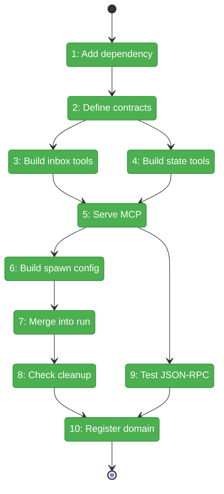
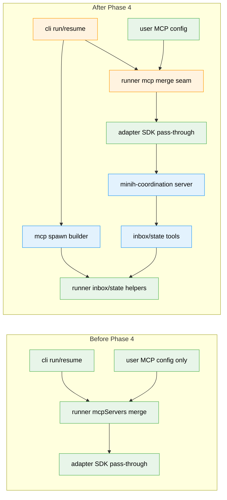

# Flight Plan: Phase 4 — MCP Domain (NEW): Six Tools + Spawn + Leak Regression

**Plan**: [coordination-plan.md](../../coordination-plan.md)  
**Phase**: Phase 4: MCP Domain (NEW) — six tools + spawn + leak regression  
**Generated**: 2026-04-26  
**Status**: Landed

---

## Departure → Destination

**Where we are**: Phase 1 provides per-agent inbox/state paths, state persistence helpers, schemas, atomic writes, and ULIDs. Phase 2 and Phase 3 provide event-driven runs, `mcpServers` pass-through, lifecycle cleanup, and daemon-light forwarders. minih can consume user MCP config, but it has no MCP server domain of its own.

**Where we're going**: A coordinated inside agent can call six minih-owned MCP tools during a run. The SDK session receives a `minih-coordination` stdio server with baked context, user MCP servers still coexist, state/inbox files are updated through runner contracts, and process cleanup is regression-tested.

---

## Domain Context

### Domains We're Changing

| Domain | What Changes | Key Files |
|--------|--------------|-----------|
| `mcp` | New domain for inside MCP tool schemas, tool implementations, stdio server, spawn config, exports, and tests. | `src/mcp/types.ts`, `src/mcp/context.ts`, `src/mcp/tools/inbox.ts`, `src/mcp/tools/state.ts`, `src/mcp/server.ts`, `src/mcp/spawn.ts`, `src/mcp/index.ts` |
| `runner` | Add a domain-safe config seam and merge point so inside MCP can be added after run folder creation without importing `mcp`. | `src/runner/types.ts`, `src/runner/runner.ts` |
| `cli` | Supplies the mcp-domain spawn factory from run/resume composition roots. | `src/cli/commands/run.ts`, `src/cli/commands/resume.ts` |
| `docs` | Registers the new mcp domain at creation time. | `docs/domains/mcp/domain.md`, `docs/domains/registry.md`, `docs/domains/domain-map.md` |

### Domains We Depend On (no changes)

| Domain | What We Consume | Contract |
|--------|-----------------|----------|
| `runner` | Per-agent coordination paths, state read/write/history, ULIDs, atomic write helper, coordination types. | `inboxLanePath`, `stateFilePath`, `historyPath`, `readStateLazy`, `writeState`, `appendHistory`, `ulid`, `InboxMessage`, `SideState` |
| `adapter` | SDK session receives merged MCP servers and cleans up through session/runtime lifecycle. | `AgentRunOptions.mcpServers`, `SdkCopilotAdapter.run()` |

---

## Flight Status

<!-- Updated by /plan-6-v2: pending → active → done. Use blocked for problems/input needed. -->

**Legend**: grey = pending | yellow = active | red = blocked/needs input | green = done

---

## Stages

<!-- Updated by /plan-6-v2 during implementation: [ ] → [~] → [x] -->

- [x] **Stage 1: Add dependency** — Install the MCP SDK and ensure the built package contains an install-safe private spawned server artifact (`package.json`, `package-lock.json`, `scripts/copy-schemas.js`).
- [x] **Stage 2: Define contracts** — Add MCP context/env schemas, containment checks, tool schemas, result types, and redacted error envelopes (`src/mcp/types.ts`, `src/mcp/context.ts`).
- [x] **Stage 3: Build inbox tools** — Implement `inbox.list`, `inbox.send`, and `inbox.ack` over append-only NDJSON with malformed-line and large-inbox coverage (`src/mcp/tools/inbox.ts`).
- [x] **Stage 4: Build state tools** — Implement `state.get`, `state.set`, and `state.transition` over runner state helpers without rule-engine logic, including agent-local schema fallback and corrupt-file errors (`src/mcp/tools/state.ts`).
- [x] **Stage 5: Serve MCP** — Register the six tools on a stdio MCP server with signal cleanup and process marker support (`src/mcp/server.ts`).
- [x] **Stage 6: Build spawn config** — Generate an install-safe `minih-coordination` `mcpServers` entry with runner coordination env plus MCP-only metadata (`src/mcp/spawn.ts`).
- [x] **Stage 7: Merge into run** — Add the inside MCP entry to coordinated `run`/`resume` sessions while preserving user MCP config and clearly failing reserved namespace collisions (`src/runner/runner.ts`, `src/cli/commands/run.ts`, `src/cli/commands/resume.ts`).
- [x] **Stage 8: Check cleanup** — Add opt-in process-marker leak regression coverage (`test/mcp/leak-regression.test.ts`).
- [x] **Stage 9: Test JSON-RPC** — Spawn the real server and invoke all six tools over stdio with the MCP client (`test/mcp/server.test.ts`).
- [x] **Stage 10: Register domain** — Add minimal mcp domain docs, registry/map updates, and final quality gates (`docs/domains/mcp/domain.md`).

---

## Architecture: Before & After

**Legend**: existing (green, unchanged) | changed (orange, modified) | new (blue, created)

---

## Acceptance Criteria

- [x] `@modelcontextprotocol/sdk` is installed, locked, and TypeScript imports compile.
- [x] MCP context validation rejects missing, non-absolute, non-canonical, or out-of-tree paths and redacts baked paths/env values from errors.
- [x] `inbox.list` returns peer-lane messages with `unread`, `type`, `limit`, and `after` filtering, including defined malformed/torn-line and large-inbox behavior.
- [x] `inbox.send` appends a valid Phase-5-compatible inside-lane `InboxMessage` with a ULID and timestamp, readable by future `outside-inbox-list`.
- [x] `inbox.ack` is idempotent and excludes acked messages from unread results.
- [x] `state.get` returns self, peer, or both states using lazy defaults for missing files and supports optional keyed reads.
- [x] `state.set` writes inside state status/data through schema validation.
- [x] `state.transition` updates status, validates against agent-local state schema enum when present and bundled defaults otherwise, writes state atomically, maps corrupt-state/history-overflow errors deterministically, detects no-op data order-insensitively, and appends history only for real transitions.
- [x] `tools/list` exposes exactly six minih coordination tools.
- [x] Coordinated runs merge `minih-coordination` with user MCP config; non-coordinated runs do not spawn the server.
- [x] The reserved `minih-coordination` server-name collision and duplicate user `inbox.*`/`state.*` tool namespaces fail clearly.
- [x] Opt-in cleanup regression shows no `minih-mcp-<runId>` child remains within 5s after coordinated runner cleanup.
- [x] The new `mcp` domain is registered in domain docs and preserves import direction.

## Goals & Non-Goals

**Goals**:
- Add a narrow inside-only MCP server for inbox/state coordination.
- Hide per-run context via spawn env vars.
- Reuse Phase 1 runner contracts instead of duplicating filesystem/state logic.
- Preserve user MCP config and existing non-coordinated behavior.
- Prove process cleanup with an opt-in gate.

**Non-Goals**:
- Outside CLI command surface.
- Prompt/preamble final wording.
- Full external MCP server mode.
- Background daemon/supervisor features.
- Rule-machine or peer-gated transition policy.

---

## Checklist

- [x] T001: Add MCP SDK dependency and executable build artifact support
- [x] T002: Define MCP domain contracts: context, tool schemas, result/error envelopes
- [x] T003: Implement inbox MCP tools with append-only NDJSON semantics
- [x] T004: Implement state MCP tools without a minih rule engine
- [x] T005: Implement the stdio MCP server and tool dispatcher
- [x] T006: Build inside-channel spawn config with install-safe path resolution
- [x] T007: Merge inside MCP server into coordinated runs without violating domain direction
- [x] T008: Add opt-in MCP cleanup/leak regression coverage
- [x] T009: Add real JSON-RPC MCP server integration coverage for all six tools
- [x] T010: Register the new MCP domain, document exports, and run quality gates
