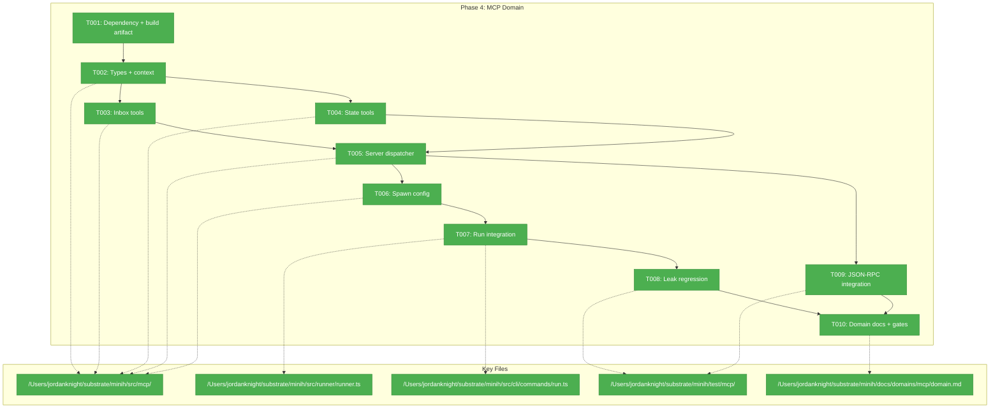
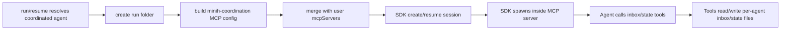
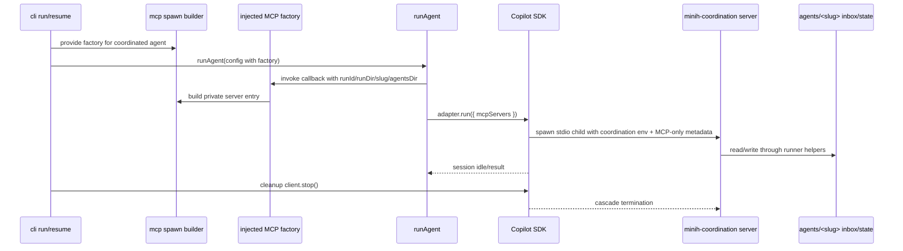

# Phase 4 — MCP Domain (NEW): Six Tools + Spawn + Leak Regression

**Plan**: [coordination-plan.md](../../coordination-plan.md)  
**Phase**: Phase 4: MCP Domain (NEW) — six tools + spawn + leak regression  
**Generated**: 2026-04-26  
**Status**: Ready for takeoff  
**Mode**: Full  
**Complexity**: CS-3

---

## Executive Briefing

**Purpose**: This phase creates minih's first MCP-server domain: a per-run, inside-only stdio server that exposes coordination tools to the agent without exposing run IDs, filesystem paths, or host context. It completes the inside surface needed by later coordinated-agent prompting and smoke tests.

**What We're Building**: A new `src/mcp/` domain with six tools (`inbox.list`, `inbox.send`, `inbox.ack`, `state.get`, `state.set`, `state.transition`), strict baked-context loading that reuses the runner coordination env contract (`MINIH_INBOX_DIR`, `MINIH_STATE_DIR`, `MINIH_CONTEXT`) plus MCP-only run metadata, a stdio MCP server entrypoint, spawn-config generation for the SDK `mcpServers` block, and regression coverage for process cleanup and coexistence with user MCP config.

**Goals**:
- ✅ Add the official `@modelcontextprotocol/sdk` dependency and keep TypeScript/build output install-safe.
- ✅ Build the inside MCP tool contract exactly from workshop 003.
- ✅ Keep all filesystem writes inside `agents/<slug>/{inbox,state}/` using Phase 1 runner helpers.
- ✅ Validate `state.transition` against state schemas and append history without introducing a minih rule engine.
- ✅ Merge the inside server with user MCP config without clobbering existing servers.
- ✅ Prove the inside MCP child is reaped by minih's existing `client.stop()` cleanup path.

**Non-Goals**:
- ❌ No outside CLI commands (`outside-send`, `outside-inbox-list`, `state ...`); Phase 5 owns those.
- ❌ No final prompt/tool instruction copy; Phase 6 replaces the Phase 2 preamble stubs.
- ❌ No full external `minih serve --mcp` surface.
- ❌ No daemon, supervisor, pidfile, socket, or background process manager.
- ❌ No state rule engine or peer-gated transition machine in `runner/state.ts`.

---

## Prior Phase Context

### Phase 0: Pre-Work Scratch Tests + Decision Gate

#### A. Deliverables

- `/Users/jordanknight/substrate/minih/scratch/runagent-eventdriven/test.mjs`
- `/Users/jordanknight/substrate/minih/scratch/fswatch-test/test.mjs`
- `/Users/jordanknight/substrate/minih/scratch/daemon-light-prototype/test.mjs`
- `/Users/jordanknight/substrate/minih/scratch/multi-process-watch/test.mjs`
- `/Users/jordanknight/substrate/minih/docs/plans/007-backgrounding/prework-results.md`

#### B. Dependencies Exported

- `session.send` + idle subscription is the validated run pattern; `sendAndWait` is not the coordinated-run path.
- Native `fs.watch` events are hints only; durable files and watermarks are source of truth.
- NDJSON robustness contract: read by byte offset, stop on malformed/torn lines, and do not advance progress past invalid data.
- Single-call append of one JSON line is the concurrency primitive for inbox/history files.

#### C. Gotchas & Debt

- `fs.watch` coalesces heavily and can emit `rename` for create/delete behavior.
- Persistent garbage in an NDJSON lane remains operator-repair debt; v1 prioritizes no data loss over skipping ahead.
- Agent reasoning latency dominates visible round-trip timing, so tests should separate protocol mechanics from model behavior.

#### D. Incomplete Items

- No Phase 0 blockers remain. Permanent garbage-line repair remains a later hardening topic.

#### E. Patterns to Follow

- Treat scratch scripts as empirical evidence, not production imports.
- Re-read durable files after every event; never trust event counts.
- Keep filesystem formats append-only where possible.

### Phase 1: Runner Foundations

#### A. Deliverables

- `/Users/jordanknight/substrate/minih/src/runner/state.ts`
- `/Users/jordanknight/substrate/minih/src/runner/context.ts`
- `/Users/jordanknight/substrate/minih/src/runner/atomic-write.ts`
- `/Users/jordanknight/substrate/minih/src/runner/ulid.ts`
- `/Users/jordanknight/substrate/minih/src/runner/folder.ts` coordination path helpers
- `/Users/jordanknight/substrate/minih/src/runner/types.ts` coordination types
- `/Users/jordanknight/substrate/minih/src/schemas/{inbox-message,outside-state,inside-state,state-history-entry}.json`

#### B. Dependencies Exported

- `inboxLanePath(slug, agentsDir, lane)` returns absolute `agents/<slug>/inbox/<lane>/messages.ndjson`.
- `stateFilePath(slug, agentsDir, side)` and `historyPath(slug, agentsDir)` return absolute state paths.
- `readStateLazy(side, slug, agentsDir)`, `writeState(side, slug, agentsDir, state)`, and `appendHistory(slug, agentsDir, entry)` own state persistence.
- `writeFileAtomic(...)` and `writeFileAtomicAsync(...)` own write-then-rename semantics.
- `ulid()` generates lex-sortable IDs for inbox messages and cursors.
- `Side`, `InboxMessage`, `OutsideState`, `InsideState`, `SideState`, and `StateHistoryEntry` are exported from `runner/index.ts`.

#### C. Gotchas & Debt

- `state.ts` is intentionally a data layer only: no transition rules, no peer gating, no orchestration policy.
- `MINIH_ENV_KEYS_COORDINATION` exists, but `MINIH_INBOX_DIR` and `MINIH_STATE_DIR` are not broadly wired into the run environment yet.
- `RetrospectiveCoordination` and `magicWandTarget: 'coordination'` remain Phase 6 schema work.

#### D. Incomplete Items

- MCP server, outside CLI surface, coordinated prompt content, and run-folder snapshots are still absent.

#### E. Patterns to Follow

- Reuse runner path/state/schema helpers through `runner/index.ts`.
- Validate persisted JSON shape and field types; never mask corrupt state as a synthetic default.
- Keep state status strings runtime-validated by schemas, not TypeScript unions.

### Phase 2: runAgent Event-Driven Refactor + Preamble Builder

#### A. Deliverables

- `/Users/jordanknight/substrate/minih/src/runner/preamble-builder.ts`
- `/Users/jordanknight/substrate/minih/src/runner/runner.ts` event-driven run path
- `/Users/jordanknight/substrate/minih/src/adapter/events.ts` with `SessionSender` and `AgentRunOptions.onSessionReady`
- `/Users/jordanknight/substrate/minih/src/adapter/sdk-copilot.ts` using `session.send` + idle subscription
- `/Users/jordanknight/substrate/minih/src/adapter/fake.ts` queued-run helpers

#### B. Dependencies Exported

- `AgentRunOptions.mcpServers?: Record<string, unknown>` already flows through to SDK session creation.
- `SdkCopilotAdapter.run()` passes `mcpServers` to `createSession(...)` and `resumeSession(...)`.
- `FakeAgentAdapter` accepts `mcpServers` for tests without requiring real SDK calls.
- `buildInsidePreamble(...)` has section-framed coordination stubs; real tool copy lands in Phase 6.

#### C. Gotchas & Debt

- `compact()` still uses `sendAndWait`; leave it out of MCP coordination scope.
- `pending_messages.modified` is not a public coordination signal.
- The adapter already threads MCP config; avoid unnecessary adapter churn unless a type seam is missing.

#### D. Incomplete Items

- No inside MCP server exists, and no inside server entry is merged into `mcpServers`.
- Preamble tool instructions are still stubs.

#### E. Patterns to Follow

- Keep `runner` SDK-agnostic and `adapter` MCP-server-agnostic.
- Use `finally` cleanup and `client.stop()` as the process-reaping invariant.
- Preserve disabled/non-coordinated agent behavior.

### Phase 3: File Watcher + Daemon-Light Forwarders

#### A. Deliverables

- `/Users/jordanknight/substrate/minih/src/runner/file-watcher.ts`
- `/Users/jordanknight/substrate/minih/src/runner/forwarder-watermark.ts`
- `/Users/jordanknight/substrate/minih/src/runner/inbox-forwarder.ts`
- `/Users/jordanknight/substrate/minih/src/runner/state-forwarder.ts`
- `/Users/jordanknight/substrate/minih/src/runner/run-lock.ts`
- `/Users/jordanknight/substrate/minih/test/e2e/daemon-light.test.ts`

#### B. Dependencies Exported

- `RunLockHeldError` and `RUN_LOCK_HELD` are the only new public runner exports from Phase 3.
- Forwarders consume `SessionSender`, expose pending counts, and commit watermarks only after completed terminal runs.
- `FileWatcher.pendingCount()` makes debounced watcher work visible to terminal drain.

#### C. Gotchas & Debt

- Code review found that watermarks must not advance on timeout; manual commit mode fixed that.
- Watcher debounce timers must count as pending terminal work; `pendingCount()` fixed that.
- `readStateLazy()` can synthesize defaults, so file existence checks matter when detecting real state changes.

#### D. Incomplete Items

- None for Phase 3. The phase is landed and code-review fixes passed `just fft`.

#### E. Patterns to Follow

- Treat per-agent shared files as durable coordination state, not run-local scratch.
- Prefer narrow public exports; keep implementation internals private unless a later domain needs them.
- Any live child process or watcher must have idempotent cleanup.

---

## Pre-Implementation Check

| File | Exists? | Domain Check | Notes |
|------|---------|--------------|-------|
| `/Users/jordanknight/substrate/minih/package.json` | ✅ MODIFY | package metadata | Add `@modelcontextprotocol/sdk`; keep dependency minimal and run `npm install` so `package-lock.json` changes with it. |
| `/Users/jordanknight/substrate/minih/package-lock.json` | ✅ MODIFY | package metadata | Must be updated by npm, not hand-edited. |
| `/Users/jordanknight/substrate/minih/scripts/copy-schemas.js` | ✅ MODIFY | build tooling | If the selected MCP server entry requires a runtime shim or copied asset, extend the build copy script so the private spawned server entry exists after `npm run build`. Prefer compiled ESM output unless implementation testing proves a CJS bootstrap is required. |
| `/Users/jordanknight/substrate/minih/src/mcp/types.ts` | ❌ NEW | mcp contract | Tool input/output schemas, typed MCP error envelope, baked-context types, and env-var constants. No duplicate runner state types. |
| `/Users/jordanknight/substrate/minih/src/mcp/context.ts` | ❌ NEW | mcp internal | Strictly load/validate the runner coordination env vars plus MCP-only run metadata. Missing, non-absolute, non-canonical, or out-of-tree context should fail the child immediately with actionable but redacted stderr. |
| `/Users/jordanknight/substrate/minih/src/mcp/tools/inbox.ts` | ❌ NEW | mcp internal | Implement `inbox.list`, `inbox.send`, `inbox.ack` using `inboxLanePath`, `ulid`, and append-only NDJSON. |
| `/Users/jordanknight/substrate/minih/src/mcp/tools/state.ts` | ❌ NEW | mcp internal | Implement `state.get`, `state.set`, `state.transition` using `readStateLazy`, `writeState`, `appendHistory`, and schema enum validation. No rule engine. |
| `/Users/jordanknight/substrate/minih/src/mcp/server.ts` | ❌ NEW | mcp contract | Stdio MCP server entry: register six tools, dispatch calls, set process marker, close on SIGTERM/SIGINT. |
| `/Users/jordanknight/substrate/minih/src/mcp/server.ts` | ❌ NEW | mcp runtime artifact | Primary server entry. The exact spawned artifact path is private and implementation-defined; tests should assert install-safe spawn behavior rather than a fixed filename. |
| `/Users/jordanknight/substrate/minih/src/mcp/spawn.ts` | ❌ NEW | mcp contract | Build the `minih-coordination` `mcpServers` entry with an absolute private server path, runner coordination env, and MCP-only run metadata. |
| `/Users/jordanknight/substrate/minih/src/mcp/index.ts` | ❌ NEW | mcp contract | Export public mcp-domain contracts and document spawn-config pattern. |
| `/Users/jordanknight/substrate/minih/src/runner/types.ts` | ✅ MODIFY | runner contract | Likely needs a domain-safe factory seam so `runAgent` can call a CLI-supplied MCP builder after `runId`/`runDir` exist without importing `mcp`. |
| `/Users/jordanknight/substrate/minih/src/runner/runner.ts` | ✅ MODIFY | runner internal | Current MCP merge block handles user config and `.mcp.json`; must merge inside server entry without `runner -> mcp` dependency. |
| `/Users/jordanknight/substrate/minih/src/cli/commands/run.ts` | ✅ MODIFY | cli composition | May need to pass the mcp-domain factory into runner config. Keep this narrow; Phase 5 owns outside commands. |
| `/Users/jordanknight/substrate/minih/src/cli/commands/resume.ts` | ✅ MODIFY | cli composition | Resume also carries `mcpServers`; preserve follow-up semantics while adding inside MCP only when coordinated. |
| `/Users/jordanknight/substrate/minih/src/adapter/sdk-copilot.ts` | ✅ CHECK | adapter internal | Already passes `mcpServers` to SDK create/resume; modify only if types or coexist behavior require it. |
| `/Users/jordanknight/substrate/minih/test/mcp/types.test.ts` | ❌ NEW | mcp test | Validate context/env parsing, tool schemas, and error envelopes. |
| `/Users/jordanknight/substrate/minih/test/mcp/inbox.test.ts` | ❌ NEW | mcp test | In-process tool tests for list/send/ack, unread reconstruction, pagination, invalid input, missing lanes, malformed/torn NDJSON, large inbox behavior, and concurrent appenders. |
| `/Users/jordanknight/substrate/minih/test/mcp/state.test.ts` | ❌ NEW | mcp test | In-process state.get/set/transition tests, schema enum rejection, agent-local schema fallback, data-only set restriction, corrupt state files, history overflow, and history append. |
| `/Users/jordanknight/substrate/minih/test/mcp/spawn.test.ts` | ❌ NEW | mcp test | Spawn-config shape, path resolution, context containment, redaction, reserved server name, missing artifact/node failure, and coordinated-only behavior. |
| `/Users/jordanknight/substrate/minih/test/mcp/coexist.test.ts` | ❌ NEW | mcp test | User `--mcp-config` plus inside server merge; reserved `minih-coordination` collision and duplicate user `inbox.*`/`state.*` tool names must fail clearly. |
| `/Users/jordanknight/substrate/minih/test/mcp/server.test.ts` | ❌ NEW | mcp integration | Spawn the real MCP server over stdio and invoke all six tools via SDK client. |
| `/Users/jordanknight/substrate/minih/test/mcp/leak-regression.test.ts` | ❌ NEW | mcp opt-in test | `MINIH_PGREP=1` gate; assert `minih-mcp-<runId>` process disappears within 5s after success/failure/timeout cleanup paths. |
| `/Users/jordanknight/substrate/minih/docs/domains/mcp/domain.md` | ❌ NEW | docs/domain | Required because this phase creates a new domain. Phase 7 can polish, but Phase 4 must register the domain at least minimally. |
| `/Users/jordanknight/substrate/minih/docs/domains/registry.md` | ✅ MODIFY | docs/domain | Add `mcp` row when the domain is created. |
| `/Users/jordanknight/substrate/minih/docs/domains/domain-map.md` | ✅ MODIFY | docs/domain | Add the sibling graph accurately: `cli -> mcp`, `cli -> runner`, `cli -> adapter`, `mcp -> runner`, and `runner -> adapter`. Preserve no upward imports. |

**Major concept search results**:
- `mcpServers` config consumption already exists in `src/runner/folder.ts`, `src/runner/runner.ts`, `src/cli/commands/run.ts`, `src/cli/commands/resume.ts`, and `src/adapter/sdk-copilot.ts`.
- No `src/mcp/` domain or MCP server implementation exists.
- No domain Concepts table currently documents an MCP-server capability; Phase 4 must create the first one.
- Existing `test/runner/mcp.test.ts` covers user MCP config loading/threading only, not a minih-owned MCP server.

**Harness check**: No `docs/project-rules/harness.md` is configured. Implementation will use standard repo testing (`just fft`) plus opt-in MCP/e2e gates.

---

## Architecture Map



---

## Tasks

| Status | ID | Task | Domain | Path(s) | Done When | Notes |
|--------|-----|------|--------|---------|-----------|-------|
| [x] | T001 | Add MCP SDK dependency and executable build artifact support | mcp | `/Users/jordanknight/substrate/minih/package.json`, `/Users/jordanknight/substrate/minih/package-lock.json`, `/Users/jordanknight/substrate/minih/scripts/copy-schemas.js` | `@modelcontextprotocol/sdk` is installed via npm; TypeScript can import server/client types; `npm run build` produces an install-safe private server artifact that spawn config references. | Workshop 004 §Library Choice and §Path resolution. Use npm to update lockfile. Prefer compiled ESM; add/copy a CJS bootstrap only if implementation testing proves it necessary. |
| [x] | T002 | Define MCP domain contracts: context, tool schemas, result/error envelopes | mcp | `/Users/jordanknight/substrate/minih/src/mcp/types.ts`, `/Users/jordanknight/substrate/minih/src/mcp/context.ts`, `/Users/jordanknight/substrate/minih/test/mcp/types.test.ts` | Baked context reuses `MINIH_INBOX_DIR`, `MINIH_STATE_DIR`, and `MINIH_CONTEXT`, adds only MCP-specific run metadata, validates absolute/canonical containment under the target agent/run directories, redacts baked paths/env values from errors, and exposes typed `_meta.code` errors. | Hidden context: runId, runDir, agentSlug, agentsDir, inboxDir, stateDir, side=`inside`, process marker. Validate symlink escapes and never echo absolute baked context in model-visible tool text. |
| [x] | T003 | Implement inbox MCP tools with append-only NDJSON semantics | mcp | `/Users/jordanknight/substrate/minih/src/mcp/tools/inbox.ts`, `/Users/jordanknight/substrate/minih/test/mcp/inbox.test.ts` | `inbox.list`, `inbox.send`, and `inbox.ack` pass in-process tests for unread filtering, exact type filtering, pagination, idempotent ack, invalid msgId, missing lane behavior, malformed/torn peer and own-lane NDJSON, bounded large-inbox scans, concurrent appenders, and append shape. | Consume `inboxLanePath`, `ulid`, `InboxMessage`. `inbox.send` must write Phase-5-compatible inside-lane records readable by future `outside-inbox-list`; `inbox.ack` appends an ack record to the inside lane; no in-place mutation. |
| [x] | T004 | Implement state MCP tools without a minih rule engine | mcp | `/Users/jordanknight/substrate/minih/src/mcp/tools/state.ts`, `/Users/jordanknight/substrate/minih/test/mcp/state.test.ts` | `state.get`, `state.set`, and `state.transition` pass tests for self/peer/both reads, optional keyed reads, inside state writes, no-op idempotency, default and agent-local schema enum validation, corrupt state errors, history-line overflow, atomic state write, and history append. | Plan override: workshop 003's old GATED/rule-machine language is stale. P1/P4 source of truth is schema enum validation + `appendHistory`; no `isAllowedTransition` helper exists or should be added. Prefer `agents/<slug>/inside-state.schema.json` when present, otherwise bundled defaults. |
| [x] | T005 | Implement the stdio MCP server and tool dispatcher | mcp | `/Users/jordanknight/substrate/minih/src/mcp/server.ts`, `/Users/jordanknight/substrate/minih/src/mcp/index.ts`, `/Users/jordanknight/substrate/minih/test/mcp/server-dispatch.test.ts` | Server registers exactly six tools, dispatches calls to inbox/state modules, sets `process.title` from marker, closes on SIGTERM/SIGINT, and surfaces startup/context errors cleanly. | Keep server runtime independent of cli/adapter. `index.ts` should document the spawn-config pattern and export intended mcp-domain contracts. |
| [x] | T006 | Build inside-channel spawn config with install-safe path resolution | mcp | `/Users/jordanknight/substrate/minih/src/mcp/spawn.ts`, `/Users/jordanknight/substrate/minih/test/mcp/spawn.test.ts` | `buildInsideMcpServerConfig(...)` returns a `minih-coordination` entry with `command: 'node'`, an absolute private server-entry path, minimal env, `NODE_NO_WARNINGS`, and `MINIH_MCP_PROCESS_MARKER='minih-mcp-<runId>'`; tests prove dev/build/package path behavior and missing artifact/node failures surface clearly. | Workshop 004 requires an install-safe mechanism, not a public filename. Include an `npm pack` or equivalent installed-package smoke check so global/npx-style resolution is not assumed. |
| [x] | T007 | Merge inside MCP server into coordinated runs without violating domain direction | cli + runner | `/Users/jordanknight/substrate/minih/src/runner/types.ts`, `/Users/jordanknight/substrate/minih/src/runner/runner.ts`, `/Users/jordanknight/substrate/minih/src/cli/commands/run.ts`, `/Users/jordanknight/substrate/minih/src/cli/commands/resume.ts`, `/Users/jordanknight/substrate/minih/test/mcp/coexist.test.ts` | Coordinated `run`/`resume` sessions receive user MCP servers plus `minih-coordination`; non-coordinated agents do not spawn it; reserved server-name collision fails with a clear JSON envelope; duplicate user tools in reserved `inbox.*`/`state.*` namespaces fail clearly at startup or first `tools/list`; `runner` does not import from `mcp`. | Domain-safe approach: add a generic runner config factory/callback that CLI supplies from `src/mcp/spawn.ts` after resolving the agent. Avoid `runner -> mcp` imports. Adapter likely needs no code change because it already passes `mcpServers`. |
| [x] | T008 | Add opt-in MCP cleanup/leak regression coverage | mcp | `/Users/jordanknight/substrate/minih/test/mcp/leak-regression.test.ts` | With `MINIH_PGREP=1`, tests drive a coordinated runner path with production inside MCP spawn config, cover success, failure, timeout/terminate, and SIGINT-equivalent cleanup paths, and assert no `minih-mcp-` marker remains within 5s. Default test suite skips this gate. | Use process marker from workshop 004. Do not use broad process killing in tests; inspect by marker and let normal cleanup reap children. |
| [x] | T009 | Add real JSON-RPC MCP server integration coverage for all six tools | mcp | `/Users/jordanknight/substrate/minih/test/mcp/server.test.ts`, `/Users/jordanknight/substrate/minih/test/mcp/helpers/test-client.ts` | A real spawned server is exercised over stdio with the MCP client; `tools/list` returns the six-tool manifest; each tool succeeds and representative errors preserve `_meta.code`. | Workshop 006 Layer 2. This is separate from SDK/LLM e2e; it should be deterministic and tmpdir-backed. |
| [x] | T010 | Register the new MCP domain, document exports, and run quality gates | docs + mcp | `/Users/jordanknight/substrate/minih/docs/domains/mcp/domain.md`, `/Users/jordanknight/substrate/minih/docs/domains/registry.md`, `/Users/jordanknight/substrate/minih/docs/domains/domain-map.md`, `/Users/jordanknight/substrate/minih/src/mcp/index.ts`, `/Users/jordanknight/substrate/minih/CONTRIBUTING.md` | Domain docs exist and identify contracts/concepts; registry/map show the sibling dependency graph (`cli -> mcp`, `cli -> runner`, `cli -> adapter`, `mcp -> runner`, `runner -> adapter`); CONTRIBUTING documents opt-in `MINIH_PGREP=1`/server integration gates if needed; `just fft` passes. | Phase 7 will polish broad docs, but new-domain docs are required at creation time. |

---

## Context Brief

### Key findings from plan

- **Finding 01 (Critical)**: Inside surface is MCP. Spawn config bakes per-run context so tools do not require the model to pass run IDs or paths.
- **Finding 02 (Critical)**: MCP server leak was not reproduced in minih's one-shot pattern because `client.stop()` reaps the SDK CLI subtree. Phase 4 must lock that invariant with regression coverage.
- **Finding 03 (Critical)**: State transition rules do not belong in `runner/state.ts`. Phase 4 `state.transition` validates shape/status and appends history, but does not add cross-side rule machinery.
- **Finding 05 (High)**: Inbox/state are per-agent shared files, not per-run files. MCP tools must read/write `agents/<slug>/{inbox,state}/` paths.
- **Workshop 004 path finding**: Spawned server path must work in dev, built dist, global install, and `npx` install modes.

### Domain dependencies

- `runner`: Folder layout (`inboxLanePath`, `stateFilePath`, `historyPath`), state persistence (`readStateLazy`, `writeState`, `appendHistory`), ID generation (`ulid`), atomic writes (`writeFileAtomic`), coordination types (`InboxMessage`, `SideState`, `StateHistoryEntry`).
- `adapter`: `AgentRunOptions.mcpServers` pass-through and SDK session cleanup via `disconnect()` plus runtime `client.stop()`.
- `cli`: `createSdkRuntime(...).cleanup()` owns `client.stop()`; `run` and `resume` are the composition roots that can import `mcp` without violating domain direction.
- `mcp`: New domain owns tool schemas, stdio server, spawn config, and MCP SDK dependency.

### Domain constraints

- Preserve import direction as a sibling graph: `cli -> mcp`, `cli -> runner`, `cli -> adapter`, `mcp -> runner`, and `runner -> adapter`. No upward imports.
- Do **not** import `src/mcp/*` from `src/runner/*`; use a runner config callback/factory if run-folder context is needed after `createRunFolder(...)`.
- Do **not** import CLI or adapter modules from `src/mcp/*`.
- MCP tools may compute file paths only from baked context plus runner path helpers; tool input must never become a filesystem path.
- Baked context must be canonicalized and contained: inbox/state paths under `agents/<slug>/`, run path under that agent's `runs/`, and symlink escapes rejected.
- MCP startup/tool errors must not echo baked env values, absolute filesystem paths, or private server artifact paths to model-visible content; use stable human text plus `_meta.code`.
- Avoid broad catches and success-shaped fallbacks for corrupted state. Missing files can be lazy defaults; corrupt files are errors.
- Keep non-coordinated agents byte/behavior compatible: do not spawn the inside MCP server unless coordination is enabled.

### Harness context

No agent harness configured. Agent will use standard testing approach from plan.

### Reusable from prior phases

- `test/runner/mcp.test.ts` already proves user MCP config loading and FakeAgentAdapter pass-through.
- Phase 1 tmpdir-style runner tests are the pattern for state/inbox filesystem unit tests.
- Phase 2 FakeAgentAdapter accepts `mcpServers`, so coexist tests can avoid real SDK until the opt-in leak gate.
- Phase 3 e2e style shows how to keep slow process tests skipped by default with an env var.

### Mermaid flow diagram



### Mermaid sequence diagram



---

## Discoveries & Learnings

_Populated during implementation by plan-6._

| Date | Task | Type | Discovery | Resolution | References |
|------|------|------|-----------|------------|------------|
| 2026-04-26 | T001 | decision | The package is ESM-only and `tsc` already emits future `src/mcp/*.ts` files to `dist/mcp/*.js`; no CJS copy step is needed before the real server exists. | Keep the spawned artifact private and use the normal ESM build path unless later server tests prove a shim is required. | `package.json`, `tsconfig.json`, `npm run build` |
| 2026-04-26 | T002 | gotcha | Following symlinks for both the actual context path and expected lexical path can make an escaped `state` symlink look valid. | Dereference only the actual baked path; compare it against the lexical canonical agent path so symlink escapes fail redacted context validation. | `src/mcp/context.ts`, `test/mcp/types.test.ts` |
| 2026-04-26 | T003 | decision | The runner forwarder tolerates a torn final peer line for live-file streaming, but MCP list is an interactive tool call and should not return a success-shaped partial view. | `inbox.list` treats torn or malformed peer/ack lanes as `MCP_INBOX_CORRUPT`; writes remain append-only single-line NDJSON. | `src/mcp/tools/inbox.ts`, `test/mcp/inbox.test.ts` |
| 2026-04-26 | T004 | decision | State schema validation belongs at the MCP tool boundary, not in `runner/state.ts`, so agent-local status enums can vary without adding policy machinery to the runner. | `state.set` and `state.transition` use a fresh AJV instance against `agents/<slug>/inside-state.schema.json` when present, otherwise bundled `inside-state.json`; transitions append history without rule checks. | `src/mcp/tools/state.ts`, `test/mcp/state.test.ts` |
| 2026-04-26 | T005 | gotcha | JSON-RPC tool arguments arrive as untyped records; typing dispatcher args as already-validated tool inputs hid runtime validation responsibilities. | Tool entrypoints now parse/validate record-shaped arguments themselves and return typed MCP error envelopes. | `src/mcp/server.ts`, `src/mcp/tools/{inbox,state}.ts`, `test/mcp/server-dispatch.test.ts` |
| 2026-04-26 | T006 | decision | The private MCP server artifact can be resolved as a sibling in packaged `dist/mcp/`, while source-mode tests need to resolve the built `dist/mcp/server.js` artifact from the repo root. | `resolveInsideMcpServerEntry()` checks the packaged sibling first, then the built dist fallback, and fails with a build instruction if neither exists. | `src/mcp/spawn.ts`, `test/mcp/spawn.test.ts`, `npm pack --dry-run --json` |
| 2026-04-26 | T007 | gotcha | Runner `.mcp.json` auto-discovery uses `config.cwd ?? process.cwd()`, so tests without a tmp `cwd` can pick up the repo-level MCP fixture even when no explicit MCP config is supplied. | Coexistence coverage sets `cwd` where the test is asserting only inside-server behavior; production behavior remains unchanged. | `src/runner/runner.ts`, `test/mcp/coexist.test.ts` |
| 2026-04-26 | T008 | validation | Process-marker leak coverage needs `pgrep`, but should not burden the default suite or use broad process killing. | Added `MINIH_PGREP=1` gated tests that inspect `minih-mcp-*` markers and use PID-specific SIGTERM/SIGINT cleanup. | `test/mcp/leak-regression.test.ts` |
| 2026-04-26 | T009 | validation | The server dispatcher tests prove in-process calls, but not JSON-RPC initialization, tool listing, or stdio transport behavior. | Added a real SDK client/stdio integration helper and tests that spawn `dist/mcp/server.js` via the production spawn config. | `test/mcp/helpers/test-client.ts`, `test/mcp/server.test.ts` |
| 2026-04-26 | T010 | validation | Creating the MCP domain also required updating the sibling dependency graph so the old linear `cli → runner → adapter` summary did not hide the new `cli → mcp → runner` edge. | Added `docs/domains/mcp/domain.md`, updated registry/map/cli/runner docs, documented the opt-in leak gate, and ran `just fft`. | `docs/domains/*`, `CONTRIBUTING.md`, `just fft` |
| 2026-04-26 | Code review | fix | The implemented MCP tool surface drifted from the phase contract in two places: `state.get` lacked default both/keyed reads, and `inbox.list` lacked exact type filtering. | Added contract fields, tool logic, unit tests, and real stdio JSON-RPC coverage for both gaps. | `src/mcp/types.ts`, `src/mcp/tools/{state,inbox}.ts`, `test/mcp/{state,inbox,server}.test.ts` |
| 2026-04-26 | Code review | fix | The original leak regression spawned `dist/mcp/server.js` directly, so it did not exercise the coordinated runner merge/cleanup path. | Reworked the opt-in regression to drive `runAgent` with the production `buildInsideMcpServerConfig(...)` factory and a spawning adapter over success, failure, timeout, and SIGINT-equivalent cleanup. | `test/mcp/leak-regression.test.ts`, `MINIH_PGREP=1 npx vitest run test/mcp/leak-regression.test.ts` |
| 2026-04-26 | Code review | fix | `state.transition` used order-sensitive `JSON.stringify` equality for no-op detection, so object key-order differences could append redundant history. | Switched to order-insensitive stable serialization and added no-op coverage for reordered data. | `src/mcp/tools/state.ts`, `test/mcp/state.test.ts` |

---

## Directory Layout

```text
docs/plans/007-backgrounding/
  ├── coordination-plan.md
  └── tasks/phase-4-mcp-domain-new-six-tools-spawn-leak-regression/
      ├── tasks.md
      ├── tasks.fltplan.md
      └── execution.log.md   # created by plan-6
```

---

## Validation Record (2026-04-26)

| Agent | Lenses Covered | Issues | Verdict |
|-------|---------------|--------|---------|
| Source Truth | Technical Constraints, Domain Boundaries, Security & Privacy, Deployment & Ops, Concept Documentation | 2 HIGH fixed, 3 MEDIUM fixed | VALIDATED WITH FIXES |
| Cross-Reference | Integration & Ripple, Hidden Assumptions, Concept Documentation, System Behavior, User Experience | 1 HIGH fixed, 1 MEDIUM fixed | VALIDATED WITH FIXES |
| Completeness | Edge Cases & Failures, Security & Privacy, Deployment & Ops, Performance & Scale, Hidden Assumptions, System Behavior | 4 HIGH fixed, 3 MEDIUM fixed | VALIDATED WITH FIXES |
| Forward-Compatibility | Forward-Compatibility, Integration & Ripple, Test Boundary, Domain Boundaries, Deployment & Ops | 1 HIGH fixed, 1 MEDIUM fixed | VALIDATED WITH FIXES |

### Forward-Compatibility Matrix

| Consumer | Requirement | Failure Mode | Verdict | Evidence |
|----------|-------------|--------------|---------|----------|
| Phase 5 Outside CLI Surface | Inside-lane messages must be readable by `outside-inbox-list` and stay on shared `InboxMessage` shape. | Shape mismatch | ✅ | T003 now requires Phase-5-compatible inside-lane records readable by future `outside-inbox-list`; flight plan AC mirrors that requirement. |
| Phase 6 Agent Integration & Prompting | Six MCP tool names/schemas must stay stable and be covered by real integration tests for prompt copy + smoke agent. | Contract drift | ✅ | T002-T009 define schemas, six tools, JSON-RPC integration coverage, coexist behavior, and cleanup regression coverage. |
| Phase 7 Polish & Docs | `mcp` domain docs/registry/map must exist early enough that later polish is additive, not blocked. | Domain boundaries | ✅ | T010 requires `docs/domains/mcp/domain.md`, registry, and sibling graph domain-map updates during Phase 4. |

**Outcome alignment**: Mostly aligned with “the host to signal ‘I just finished milestone 2’ and the agent to signal ‘I just finished reviewing milestone 2’,” because the six-tool inside MCP surface is planned correctly; fix coexist collision handling and path over-specification to keep later phases additive.

**Standalone?**: No — downstream consumers are named in the plan tree: Phase 5 outside CLI, Phase 6 agent prompting/smoke test, and Phase 7 docs.

### Fixes Applied

- Replaced stale `MINIH_MCP_*` blanket context language with the existing runner coordination env contract plus MCP-only run metadata.
- Added context containment, canonicalization, symlink-escape, and redaction requirements.
- Restored AC-MCP-COEXIST coverage for duplicate user `inbox.*`/`state.*` tool namespaces, not just the reserved server name.
- Added malformed/torn NDJSON, large inbox, concurrent append, corrupt state, history overflow, and agent-local schema fallback requirements.
- Removed fixed `inside-server.cjs` as a public task contract and made the spawned server artifact private/implementation-defined.
- Corrected the domain graph and sequence diagram so `runner` invokes an injected factory seam instead of importing `mcp`.

Overall: VALIDATED WITH FIXES
