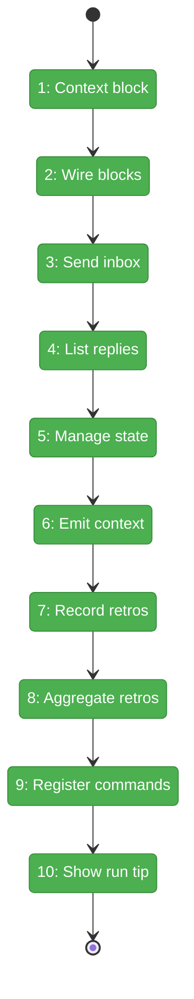
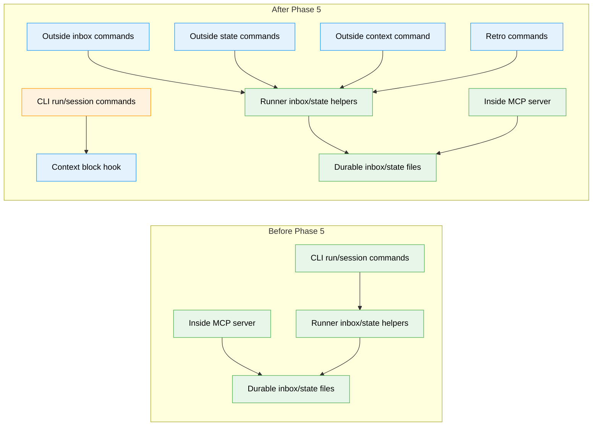

# Flight Plan: Phase 5 — Outside CLI Surface

**Plan**: [coordination-plan.md](../../coordination-plan.md)
**Phase**: Phase 5: Outside CLI Surface
**Generated**: 2026-04-26
**Status**: Landed

---

## Departure → Destination

**Where we are**: Phases 1-4 provide the durable coordination substrate. Runner owns per-agent inbox/state paths, schemas, atomic state writes, append-only history, live forwarders, and context detection; the inside agent can use six minih-owned MCP tools during coordinated runs. The missing piece is a safe outside commander surface for humans, CI, and host agents.

**Where we're going**: Outside callers can send notes, read replies, manage outside-owned state, fetch the outside-side contract, and record coordination retros through standard minih JSON-envelope commands. A developer can run `minih outside-context <slug>`, coordinate with a running inside agent via `outside-send` and `state transition`, and later inspect both sides' retros with `minih retros`.

---

## Domain Context

### Domains We're Changing

| Domain | What Changes | Key Files |
|--------|--------------|-----------|
| `cli` | Adds the outside commander surface, inside-context block hook, command registration, output error code, and CLI tests. | `src/cli/preaction-context.ts`, `src/cli/output.ts`, `src/cli/index.ts`, `src/cli/commands/*.ts`, `test/cli/*.test.ts` |

### Domains We Depend On (no changes)

| Domain | What We Consume | Contract |
|--------|-----------------|----------|
| `runner` | Agent discovery, slug validation, context detection, inbox/state paths, state persistence, history append, ULIDs, coordination types. | `resolveAgent`, `listAgents`, `validateSlug`, `detectContext`, `inboxLanePath`, `readStateLazy`, `writeState`, `appendHistory`, `ulid` |
| `mcp` | Behavioral precedent for inside inbox/state semantics. | Six inside-only tools; no direct Phase 5 import |

---

## Flight Status

<!-- Updated by /plan-6-v2: pending → active → done. Use blocked for problems/input needed. -->

**Legend**: grey = pending | yellow = active | red = blocked/needs input | green = done

---

## Stages

<!-- Updated by /plan-6-v2 during implementation: [ ] → [~] → [x] -->

- [x] **Stage 1: Add context block** — create the inside-unsafe preAction helper and `INVALID_CONTEXT` error code (`src/cli/preaction-context.ts` — new file).
- [x] **Stage 2: Wire blocks** — attach the context block to `run`, `resume`, `quickstart`, `tail`, and `init` without changing normal outside behavior (`src/cli/commands/run.ts`, `resume.ts`, `quickstart.ts`, `tail.ts`, `init.ts`).
- [x] **Stage 3: Send inbox** — implement `outside-send` to append schema-valid outside-lane messages with ULID IDs (`src/cli/commands/outside-send.ts` — new file).
- [x] **Stage 4: List replies** — implement `outside-inbox-list` to read inside-lane replies with filters (`src/cli/commands/outside-inbox-list.ts` — new file).
- [x] **Stage 5: Manage state** — implement `state get/set/transition` for outside-owned state updates and history (`src/cli/commands/state.ts` — new file).
- [x] **Stage 6: Emit context** — implement `outside-context` so outside callers can fetch the system block and per-agent `outside.md` contract (`src/cli/commands/outside-context.ts` — new file).
- [x] **Stage 7: Record retros** — implement `outside-retro` as a wrapper over outside-lane retro messages (`src/cli/commands/outside-retro.ts` — new file).
- [x] **Stage 8: Aggregate retros** — implement `retros` to merge inside report retrospectives with outside retro messages (`src/cli/commands/retros.ts` — new file).
- [x] **Stage 9: Register commands** — add all six new commands to the CLI entrypoint and help/discovery tests (`src/cli/index.ts`).
- [x] **Stage 10: Show help tip** — add the planned `outside-context` guidance to `minih run --help` (`src/cli/commands/run.ts`).

---

## Architecture: Before & After

**Legend**: existing (green, unchanged) | changed (orange, modified) | new (blue, created)

---

## Acceptance Criteria

- [x] Inside-unsafe commands fail with `E128 INVALID_CONTEXT` when invoked under `MINIH=1`.
- [x] `outside-send` appends a schema-valid outside-lane `InboxMessage`, supports ack records via `--ack-of`, and returns message id, target side, and timestamp.
- [x] `outside-inbox-list` returns inside-lane messages with `--type` and `--unread` filters; unread uses outside-lane ack records.
- [x] `state set` and `state transition` update only `outside.json`, define exact JSON/value parsing rules, validate state, append history before write, and avoid partial state mutation on history failure.
- [x] `state get` can read outside, inside, or both states with optional keyed reads.
- [x] `outside-context [<slug>]` returns markdown in `data.context` and pretty-renders to stderr.
- [x] `outside-retro` appends a `type: retro` message to the outside lane with deterministic `meta.magicWandTarget` target metadata.
- [x] `retros` aggregates inside `report.json.retrospective` entries and outside-lane retro messages with agent, side, and target filters.
- [x] All six new commands are registered and preserve the stdout JSON/stderr human convention.

## Goals & Non-Goals

**Goals**:
- Add outside inbox send/list commands.
- Add outside state get/set/transition commands.
- Add outside-context contract emission.
- Add outside-retro and retros aggregation.
- Block inside-unsafe commands from inside sessions.
- Preserve existing CLI output conventions.

**Non-Goals**:
- Inside MCP changes.
- Final coordinated prompt content.
- Coordinated init scaffolding and doctor checks.
- Run-folder coordination snapshots.
- Daemon/supervisor behavior.
- State rule-machine enforcement.

---

## Checklist

- [x] T001: Add the inside-unsafe preAction context-block helper and error code (CS-2)
- [x] T002: Wire the context block into inside-unsafe commands (CS-2)
- [x] T003: Implement `outside-send` for outside-lane messages (CS-3)
- [x] T004: Implement `outside-inbox-list` for inside-lane replies (CS-3)
- [x] T005: Implement outside `state get/set/transition` subcommands (CS-4)
- [x] T006: Implement `outside-context` markdown emission (CS-2)
- [x] T007: Implement `outside-retro` as an ergonomic retro writer (CS-2)
- [x] T008: Implement `retros` aggregation across inside reports and outside retro messages (CS-3)
- [x] T009: Register the six new commands and cover help/discovery (CS-1)
- [x] T010: Add outside-context guidance to `minih run --help` (CS-1)

---

## PlanPak

Not active for this plan.
