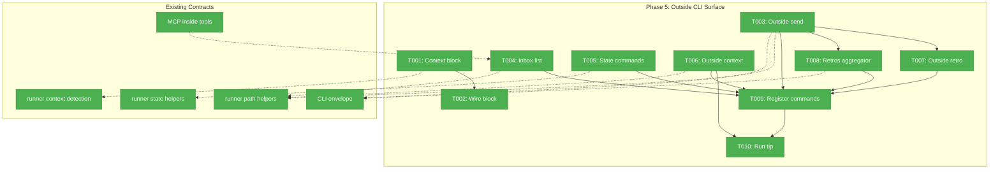
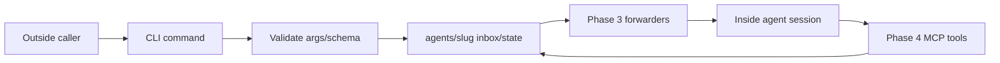
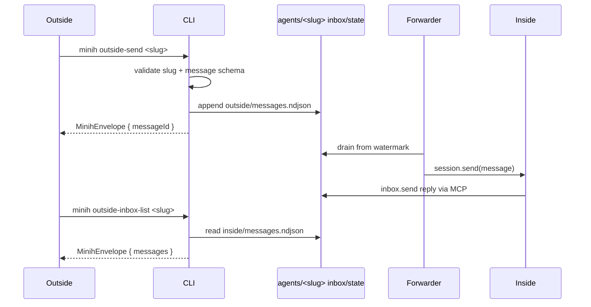

# Phase 5 — Outside CLI Surface

**Plan**: [coordination-plan.md](../../coordination-plan.md)
**Phase**: Phase 5: Outside CLI Surface
**Generated**: 2026-04-26
**Status**: Landed
**Mode**: Full
**Complexity**: CS-3

---

## Executive Briefing

**Purpose**: This phase lands the outside half of minih coordination. With Phases 1-4 providing durable inbox/state files, live forwarding, and the inside MCP tool surface, Phase 5 gives host callers, humans, CI, and outside agents commander subcommands for the same coordination model.

**What We're Building**: Six new CLI commands plus an inside-context guard. `outside-send` appends outside-lane inbox messages, `outside-inbox-list` reads inside-lane replies, `state get/set/transition` lets outside inspect and update its own coordination state, `outside-context` emits the outside-side markdown contract, `outside-retro` records outside feedback, and `retros` aggregates inside and outside retrospectives. A new preAction hook blocks inside-unsafe shell commands when `MINIH=1`.

**Goals**:
- ✅ Expose the outside inbox writer and inside-reply reader as JSON-envelope CLI commands.
- ✅ Expose outside-owned state reads/writes/transitions without adding a rule engine.
- ✅ Emit the outside coordination contract from `outside-context` in the standard stdout envelope.
- ✅ Feed outside retros into the same compounding feedback loop as inside `report.json` retrospectives.
- ✅ Block inside-unsafe commands from inside sessions with a clear `INVALID_CONTEXT` error.
- ✅ Preserve the existing stdout/stderr convention and current non-coordinated command behavior.

**Non-Goals**:
- ❌ No inside MCP tool changes; Phase 4 owns the inside server.
- ❌ No final inside prompt identity/tool/peer-contract copy; Phase 6 owns preamble content.
- ❌ No `init --coordinated`, state-schema scaffolding, or doctor outside.md checks; Phase 6 owns those.
- ❌ No run-folder inbox/state snapshots; Phase 6 owns frozen coordination snapshots.
- ❌ No background daemon, pidfile, IPC socket, or public `minih serve --mcp` mode.
- ❌ No server-side peer-gated state machine; minih remains an enabler, not an orchestrator.

---

## Prior Phase Context

### Phase 0: Pre-Work Scratch Tests + Decision Gate

#### A. Deliverables

- `/Users/jordanknight/substrate/minih/scratch/runagent-eventdriven/test.mjs` and README validated `session.send(...)` plus idle subscription as the coordinated run shape.
- `/Users/jordanknight/substrate/minih/scratch/fswatch-test/test.mjs` and README captured native `node:fs.watch` burst and atomic-rename behavior.
- `/Users/jordanknight/substrate/minih/scratch/daemon-light-prototype/test.mjs` and README proved durable file writes can be forwarded into a live session.
- `/Users/jordanknight/substrate/minih/scratch/multi-process-watch/test.mjs` and README validated concurrent NDJSON appends plus torn-line retry semantics.
- `/Users/jordanknight/substrate/minih/docs/plans/007-backgrounding/prework-results.md` recorded the decision to proceed.

#### B. Dependencies Exported

- `session.send(...)` is the live-turn injection primitive; minih should not invent a separate in-memory queue.
- `fs.watch` events are hints only; durable inbox/state files are the source of truth.
- NDJSON writer invariant: one complete `${json}\n` append per message.
- Forwarder invariant: never advance durable progress past malformed or incomplete input.

#### C. Gotchas & Debt

- A persistently malformed NDJSON line can stall delivery until repaired; Phase 5 command writes must prevent malformed lines at the source.
- Agent reasoning latency is not a CLI concern; Phase 5 tests should validate file/envelope contracts.
- Native watcher behavior is intentionally abstracted by Phase 3 and should not leak into outside commands.

#### D. Incomplete Items

- No Phase 0 blockers remain. Permanent garbage-line repair is deferred hardening.

#### E. Patterns to Follow

- Treat scratch scripts as evidence only.
- Preserve append-only inbox/history semantics.
- Prefer simple Node core filesystem operations and existing runner helpers.

### Phase 1: Runner Foundations

#### A. Deliverables

- `/Users/jordanknight/substrate/minih/src/runner/state.ts` with `readStateLazy`, `writeState`, and `appendHistory`.
- `/Users/jordanknight/substrate/minih/src/runner/context.ts` with `detectContext()` and coordination env-var helpers.
- `/Users/jordanknight/substrate/minih/src/runner/atomic-write.ts` with write-then-rename helpers.
- `/Users/jordanknight/substrate/minih/src/runner/ulid.ts` with in-tree lex-sortable IDs.
- `/Users/jordanknight/substrate/minih/src/runner/folder.ts` with inbox/state/history/watermark/outside.md path helpers.
- `/Users/jordanknight/substrate/minih/src/runner/types.ts` with coordination data types.
- `/Users/jordanknight/substrate/minih/src/schemas/{inbox-message,outside-state,inside-state,state-history-entry}.json`.

#### B. Dependencies Exported

- `detectContext(): 'inside' | 'outside'` returns inside only when `MINIH === '1'`.
- `inboxLanePath(slug, agentsDir, lane)` resolves absolute inbox lane paths.
- `stateFilePath(slug, agentsDir, side)` and `historyPath(slug, agentsDir)` resolve absolute state/history paths.
- `readStateLazy(...)`, `writeState(...)`, and `appendHistory(...)` are the state persistence contracts Phase 5 should reuse.
- `ulid()` creates message IDs for `outside-send`.
- `AgentDefinition.outsideContract` and `AgentDefinition.coordination` are already loaded by agent discovery.

#### C. Gotchas & Debt

- `state.ts` intentionally has no transition rule engine, no peer gating, and no orchestration policy.
- `readStateLazy()` returns a synthetic default when a state file is absent, but present corrupt files throw.
- `appendHistory()` enforces `PIPE_BUF` line size; CLI commands should surface that error rather than hiding it.
- Per-agent state schema discovery/scaffolding is Phase 6, but Phase 5 can already consume schema files if present.

#### D. Incomplete Items

- No outside CLI commands exist yet.
- `magicWandTarget: 'coordination'` schema support is still Phase 6; Phase 5 retros aggregation must tolerate old reports.

#### E. Patterns to Follow

- Reuse runner contracts via `runner/index.ts`; do not duplicate path layout constants.
- Use fresh AJV validation at command boundaries when validating persisted command payloads.
- Keep state status as runtime data, not a TypeScript enum.

### Phase 2: runAgent Event-Driven Refactor + Preamble Builder

#### A. Deliverables

- `/Users/jordanknight/substrate/minih/src/adapter/interface.ts` exported `SessionSender` and `AgentRunOptions.onSessionReady`.
- `/Users/jordanknight/substrate/minih/src/adapter/sdk-copilot.ts` now uses `session.send` plus idle subscription.
- `/Users/jordanknight/substrate/minih/src/adapter/fake.ts` supports queued logical turns and session-send test history.
- `/Users/jordanknight/substrate/minih/src/runner/preamble-builder.ts` owns pure prompt assembly with coordination stub markers.
- `/Users/jordanknight/substrate/minih/src/runner/runner.ts` owns `awaitTerminalCondition(...)`.

#### B. Dependencies Exported

- Event-driven runs and the preamble-builder seam are already in place for later prompt integration.
- `run` and `resume` already pass internal MCP configuration seams from the CLI composition root.

#### C. Gotchas & Debt

- Preamble coordination content is still stubbed; Phase 5 must not assume final inside prompt copy exists.
- `compact()` still uses a separate SDK path and is out of Phase 5 scope.

#### D. Incomplete Items

- No outside-side commander commands were added in Phase 2.

#### E. Patterns to Follow

- Keep CLI code as composition and command handling; orchestration remains in runner.
- Preserve existing run/resume behavior outside of the new context block.

### Phase 3: File Watcher + Daemon-Light Forwarders

#### A. Deliverables

- `/Users/jordanknight/substrate/minih/src/runner/file-watcher.ts`.
- `/Users/jordanknight/substrate/minih/src/runner/forwarder-watermark.ts`.
- `/Users/jordanknight/substrate/minih/src/runner/inbox-forwarder.ts`.
- `/Users/jordanknight/substrate/minih/src/runner/state-forwarder.ts`.
- `/Users/jordanknight/substrate/minih/src/runner/run-lock.ts`.
- `/Users/jordanknight/substrate/minih/test/e2e/daemon-light.test.ts`.

#### B. Dependencies Exported

- Outside-lane inbox writes are forwarded to the live inside session when a coordinated run is active.
- Outside-state writes are forwarded to the live inside session when meaningful state changes occur.
- `RunLockHeldError` and `RUN_LOCK_HELD` are public for future CLI mapping.

#### C. Gotchas & Debt

- Forwarders commit watermarks only after terminal completion; Phase 5 writes must be durable and schema-valid.
- `readStateLazy()` synthesizes defaults, so state commands should distinguish missing state from corrupt state where the UX needs to explain it.
- Concurrent live runs are guarded by runner lock logic, not by outside CLI commands.

#### D. Incomplete Items

- No Phase 3 blockers remain.

#### E. Patterns to Follow

- Treat per-agent shared files as durable state, not run-local scratch.
- Keep live watcher/forwarder internals private; outside commands write durable files and let forwarders react.

### Phase 4: MCP Domain

#### A. Deliverables

- `/Users/jordanknight/substrate/minih/src/mcp/types.ts` with tool names, schemas, and typed error/result helpers.
- `/Users/jordanknight/substrate/minih/src/mcp/context.ts` with hidden baked context validation.
- `/Users/jordanknight/substrate/minih/src/mcp/spawn.ts` with `buildInsideMcpServerConfig(...)`.
- `/Users/jordanknight/substrate/minih/src/mcp/server.ts` with stdio MCP server and dispatcher.
- `/Users/jordanknight/substrate/minih/src/mcp/tools/inbox.ts` with `inbox.list`, `inbox.send`, and `inbox.ack`.
- `/Users/jordanknight/substrate/minih/src/mcp/tools/state.ts` with `state.get`, `state.set`, and `state.transition`.
- `/Users/jordanknight/substrate/minih/src/mcp/index.ts` public exports.
- `/Users/jordanknight/substrate/minih/test/mcp/*.test.ts` coverage and MCP domain docs.

#### B. Dependencies Exported

- Inside inbox/state semantics are implemented and tested; Phase 5 should mirror them from the outside side where appropriate.
- MCP tools parse JSON-RPC args as untrusted records; CLI commands should treat command args as untrusted too.
- `state.get` defaults to both states and supports keyed reads; outside `state get` should offer the same shape for consistency.

#### C. Gotchas & Debt

- `state.get` and `inbox.list` contract drift was caught in code review; Phase 5 must keep CLI contracts aligned with docs and tests.
- Leak regression must go through production wiring; Phase 5 should not spawn or manage the inside MCP server directly.
- Context errors redact baked env/path values; outside CLI errors can name user-supplied paths but should not leak hidden MCP context.

#### D. Incomplete Items

- No Phase 4 blockers remain.
- The outside CLI surface is the next missing half of the coordination model.

#### E. Patterns to Follow

- Keep `mcp` inside-only. Do not add `minih serve --mcp` or public external MCP tools.
- Preserve append-only inbox/history and atomic state write semantics.
- Validate and normalize command input at the boundary.

---

## Pre-Implementation Check

| File | Exists? | Domain Check | Notes |
|------|---------|--------------|-------|
| `/Users/jordanknight/substrate/minih/src/cli/preaction-context.ts` | ❌ NEW | cli internal | No existing context-block hook. Reuse `detectContext()` from runner; add `ErrorCodes.INVALID_CONTEXT = 'E128'` rather than inventing per-command errors. |
| `/Users/jordanknight/substrate/minih/src/cli/output.ts` | ✅ MODIFY | cli contract | Add `INVALID_CONTEXT` without changing the envelope shape. Existing `E130` is init-specific, so use `E128` for the next context error. |
| `/Users/jordanknight/substrate/minih/src/cli/commands/run.ts` | ✅ MODIFY | cli internal | Wire the context block while preserving current run behavior, dry-run, MCP config, and composition-root MCP factory. Add outside-context guidance for coordinated agents. |
| `/Users/jordanknight/substrate/minih/src/cli/commands/resume.ts` | ✅ MODIFY | cli internal | Wire the context block; resume is inside-unsafe because it sends a follow-up into another SDK session. |
| `/Users/jordanknight/substrate/minih/src/cli/commands/quickstart.ts` | ✅ MODIFY | cli internal | Wire the context block; quickstart scaffolds and runs an agent, so it is inside-unsafe. |
| `/Users/jordanknight/substrate/minih/src/cli/commands/tail.ts` | ✅ MODIFY | cli internal | Wire the context block but preserve normal interactive tail behavior. The blocked path should emit an envelope despite tail's normal non-envelope behavior. |
| `/Users/jordanknight/substrate/minih/src/cli/commands/init.ts` | ✅ MODIFY | cli internal | Wire the context block only. `--coordinated` scaffolding remains Phase 6. |
| `/Users/jordanknight/substrate/minih/src/cli/commands/outside-send.ts` | ❌ NEW | cli contract | Append outside-lane `InboxMessage` with ULID and ISO timestamp. Also support `--ack-of <msgId>` so outside can create ack records required by `outside-inbox-list --unread`. Share parsing/validation helpers with `outside-retro`. |
| `/Users/jordanknight/substrate/minih/src/cli/commands/outside-inbox-list.ts` | ❌ NEW | cli contract | Read inside-lane messages. Support exactly the Phase 5 contract: `--unread` and `--type`; do not add `--limit`/`--after` in this phase. |
| `/Users/jordanknight/substrate/minih/src/cli/commands/state.ts` | ❌ NEW | cli contract | Implement `state get/set/transition` with explicit flag grammar: get supports `--side outside|inside|both` and `--key`; set writes only outside via `--status`, `--data-json`, or `--key` plus `--value`/`--value-json`; transition uses `--to`, optional `--reason`, and optional `--data-json`. |
| `/Users/jordanknight/substrate/minih/src/cli/commands/outside-context.ts` | ❌ NEW | cli contract | Emit markdown in `data.context`; pretty markdown goes to stderr only. Use `AgentDefinition.outsideContract` loaded by runner discovery and cover symlink escape, empty file, and oversized truncation behavior from runner helpers. |
| `/Users/jordanknight/substrate/minih/src/cli/commands/outside-retro.ts` | ❌ NEW | cli contract | Thin wrapper over outside-send with `type: retro`; require `--target project|minih|coordination` with default `coordination`, stored in the inbox message `meta.magicWandTarget` so `retros --target` is deterministic before Phase 6 inside-report schema widening. |
| `/Users/jordanknight/substrate/minih/src/cli/commands/retros.ts` | ❌ NEW | cli contract | Sibling to `difficulties.ts`; aggregate inside run reports and outside-lane retro messages. Outside target comes from `message.meta.magicWandTarget`; old inside reports without `magicWandTarget` remain included unless a target filter excludes them. |
| `/Users/jordanknight/substrate/minih/src/cli/index.ts` | ✅ MODIFY | cli entrypoint | Register six new commands and preserve root `--agents-dir` preAction resolution. |
| `/Users/jordanknight/substrate/minih/test/cli/commands.test.ts` | ✅ MODIFY | cli test | Current CLI command tests are built-CLI subprocess tests. Add command coverage here or split focused files if it becomes too large. |
| `/Users/jordanknight/substrate/minih/test/cli/preaction-context.test.ts` | ❌ NEW | cli test | Fast unit tests for hook helper branches, envelope code, and strict `MINIH === '1'` detection (`'true'`, `'0'`, and `' 1 '` remain outside). |
| `/Users/jordanknight/substrate/minih/test/cli/outside-send.test.ts` | ❌ NEW | cli test | File write, ack record creation via `--type ack --ack-of`, validation failure, missing agent, malformed slug, and JSON envelope cases. |
| `/Users/jordanknight/substrate/minih/test/cli/outside-inbox-list.test.ts` | ❌ NEW | cli test | Listing, type filtering, unread reconstruction from required outside ack records, empty lane, and corrupt/torn lane behavior. |
| `/Users/jordanknight/substrate/minih/test/cli/state.test.ts` | ❌ NEW | cli test | Get/set/transition flag grammar, invalid JSON arguments, missing keyed reads, inside write rejection, append-history-before-write ordering, schema validation, and corrupt state surfacing. |
| `/Users/jordanknight/substrate/minih/test/cli/outside-context.test.ts` | ❌ NEW | cli test | System-only context, per-agent outside.md inclusion, absent outside.md stub, present-but-empty outside.md, symlink escape rejection, oversized contract truncation/surfacing, and stdout envelope shape. |
| `/Users/jordanknight/substrate/minih/test/cli/outside-retro.test.ts` | ❌ NEW | cli test | Wrapper writes retro message with expected subject/type/body/meta target and reuses outside-send validation. |
| `/Users/jordanknight/substrate/minih/test/cli/retros.test.ts` | ❌ NEW | cli test | Aggregates inside `report.json.retrospective` plus outside-lane `type: retro`, including `--agent`, `--side`, and `--target` filters. |

**Concept Search Result**: No production outside CLI coordination surface exists. Domain docs list the intended contracts, and the only code-level mentions are runner/MCP hidden context, docs, and fixtures. Reuse existing runner helpers and CLI envelope patterns; safe to create Phase 5 command modules.

**Harness Health**: No `docs/project-rules/harness.md` exists. Implementation will use standard repository tests and minih command subprocess tests.

---

## Architecture Map



---

## Tasks

| Status | ID | Task | Domain | Path(s) | Done When | Notes |
|--------|----|------|--------|---------|-----------|-------|
| [x] | T001 | Add the inside-unsafe preAction context-block helper and error code | cli | `/Users/jordanknight/substrate/minih/src/cli/preaction-context.ts`<br>`/Users/jordanknight/substrate/minih/src/cli/output.ts`<br>`/Users/jordanknight/substrate/minih/test/cli/preaction-context.test.ts` | `detectContext()` is reused; inside context returns a `MinihEnvelope` with `E128 INVALID_CONTEXT`; outside context passes through; tests cover suggested alternatives and strict `MINIH === '1'` behavior. | AC-CTX-BLOCK. Avoid broad catches. The helper should be command-agnostic and not import command modules. Noncanonical values (`'true'`, `'0'`, `' 1 '`) must remain outside. |
| [x] | T002 | Wire the context block into inside-unsafe commands | cli | `/Users/jordanknight/substrate/minih/src/cli/commands/run.ts`<br>`/Users/jordanknight/substrate/minih/src/cli/commands/resume.ts`<br>`/Users/jordanknight/substrate/minih/src/cli/commands/quickstart.ts`<br>`/Users/jordanknight/substrate/minih/src/cli/commands/tail.ts`<br>`/Users/jordanknight/substrate/minih/src/cli/commands/init.ts`<br>`/Users/jordanknight/substrate/minih/test/cli/commands.test.ts` | `MINIH=1` blocks `run`, `resume`, `quickstart`, `tail`, and `init` with clear alternatives; normal outside invocations keep existing behavior and envelopes. | Tail normally writes directly to stderr; the blocked path should still use the standard envelope so inside callers receive machine-readable guidance. |
| [x] | T003 | Implement `outside-send` for outside-lane messages | cli | `/Users/jordanknight/substrate/minih/src/cli/commands/outside-send.ts`<br>`/Users/jordanknight/substrate/minih/test/cli/outside-send.test.ts` | `minih outside-send <slug> --type <t> --subject "..." --body "..." [--ack-of <msgId>]` appends one valid `InboxMessage` to `inbox/outside/messages.ndjson`, returns message id/target/timestamp, creates parent dirs lazily, and rejects invalid args/schema failures. If `--type ack` is used, `--ack-of` is required and persisted. | AC-OUTSIDE-SEND. Reuse `resolveAgent`, `validateSlug`, `inboxLanePath`, `ulid`, and inbox-message schema validation. This required ack path is what makes T004 `--unread` deterministic; do not add generic `--meta` in Phase 5. |
| [x] | T004 | Implement `outside-inbox-list` for inside-lane replies | cli | `/Users/jordanknight/substrate/minih/src/cli/commands/outside-inbox-list.ts`<br>`/Users/jordanknight/substrate/minih/test/cli/outside-inbox-list.test.ts` | `minih outside-inbox-list <slug> [--type <type>] [--unread]` returns inside-lane messages in a JSON envelope, treats missing lanes as empty, and fails loudly on corrupt/torn lines. `--unread` reconstructs acknowledgements from outside-lane ack records written by T003. | AC-OUTSIDE-LIST. Keep the Phase 5 contract to `--type` and `--unread`; defer pagination (`--limit`/`--after`) unless a later plan adds it. |
| [x] | T005 | Implement outside `state get/set/transition` subcommands | cli | `/Users/jordanknight/substrate/minih/src/cli/commands/state.ts`<br>`/Users/jordanknight/substrate/minih/test/cli/state.test.ts` | `state get <slug> [--side outside|inside|both] [--key <dot.path>]` reads state; `state set <slug> --side outside (--status <s> [--data-json <object>] \| --data-json <object> \| --key <dot.path> (--value <string> \| --value-json <json>))` writes outside state; `state transition <slug> --to <status> [--reason <text>] [--data-json <object>]` appends history then atomically writes outside state. | AC-STATE-OUTSIDE-WRITE. Reuse `readStateLazy`, `writeState`, `appendHistory`; validate against agent-local `outside-state.schema.json` if present, else bundled default. Invalid JSON is `INVALID_ARGS`; missing keyed reads return `null`; inside writes fail clearly. Append history before `writeState` and assert no `outside.json` mutation if history append fails. No rule engine. |
| [x] | T006 | Implement `outside-context` markdown emission | cli | `/Users/jordanknight/substrate/minih/src/cli/commands/outside-context.ts`<br>`/Users/jordanknight/substrate/minih/test/cli/outside-context.test.ts` | `minih outside-context` returns the system outside block; `minih outside-context <slug>` adds `outside.md`, an empty-contract body, or an absent-contract stub; stdout contains `data.context`; stderr pretty-renders markdown for humans. Tests cover symlink escape rejection and oversized-contract truncation/surfacing. | AC-OUTSIDE-CONTEXT-CLI. Preserve stdout JSON convention; users can pipe `2>/dev/null | jq -r '.data.context'`. Reuse runner outside.md helpers so path-containment behavior stays centralized. |
| [x] | T007 | Implement `outside-retro` as an ergonomic retro writer | cli | `/Users/jordanknight/substrate/minih/src/cli/commands/outside-retro.ts`<br>`/Users/jordanknight/substrate/minih/test/cli/outside-retro.test.ts` | `minih outside-retro <slug> --body "..." [--target project|minih|coordination]` appends an outside-lane retro message equivalent to `outside-send --type retro --subject "outside session retro"` and returns the same envelope shape. `--target` defaults to `coordination` and is stored as `meta.magicWandTarget`. | AC-OUTSIDE-RETRO. Prefer sharing a helper with T003 over shelling out. Phase 6 schema widening is for inside `report.json`; outside retro target metadata lives in open inbox `meta` in Phase 5. |
| [x] | T008 | Implement `retros` aggregation across inside reports and outside retro messages | cli | `/Users/jordanknight/substrate/minih/src/cli/commands/retros.ts`<br>`/Users/jordanknight/substrate/minih/test/cli/retros.test.ts` | `minih retros [--agent <slug>] [--side inside|outside] [--target project|minih|coordination]` returns inside `report.json.retrospective` entries plus outside-lane `type: retro` entries, grouped by agent and side, with a compact stderr table. Outside target filtering reads `message.meta.magicWandTarget` from T007; old inside reports without a target are included unless a target filter excludes them. | AC-RETROS-AGGREGATOR. Reuse `difficulties.ts` traversal patterns, but do not silently swallow corrupt outside retro lanes; report degraded/error consistently. |
| [x] | T009 | Register the six new commands and cover help/discovery | cli | `/Users/jordanknight/substrate/minih/src/cli/index.ts`<br>`/Users/jordanknight/substrate/minih/test/cli/commands.test.ts` | `minih --help` lists `outside-send`, `outside-inbox-list`, `state`, `outside-context`, `outside-retro`, and `retros`; each command uses root `--agents-dir` resolution and returns the standard envelope. | Keep command registration order readable: existing run/session commands first, coordination/outside commands together, validation/init commands last if practical. |
| [x] | T010 | Add outside-context guidance to `minih run --help` | cli | `/Users/jordanknight/substrate/minih/src/cli/commands/run.ts`<br>`/Users/jordanknight/substrate/minih/test/cli/run-help.test.ts` | `minih run --help` includes the planned tip: for coordinated agents, run `minih outside-context <slug>` first. Existing run stdout data is unchanged. | Workshop 008 failure-mode mitigation. Keep runtime/action-time stderr hints out of the Phase 5 contract unless a later task explicitly adds them. |

---

## Context Brief

**Key findings from plan**:
- Phase 5 is CLI-primary: all new behavior belongs under `src/cli/commands/` plus a small `src/cli/preaction-context.ts` helper.
- The outside surface is commander-only. Do not expose these commands through MCP and do not add `minih serve --mcp`.
- Outside writes only to outside-owned files: `inbox/outside/messages.ndjson` and `state/outside.json`; it can read inside files.
- State remains data plus audit history. There is no minih-owned transition gate or peer rule machine.
- `outside-context` must follow the stdout JSON envelope convention even though its main payload is markdown.
- Outside retros ride the existing inbox lane as `type: retro`; no new persistence layer is needed.

**Domain dependencies**:
- `cli`: `MinihEnvelope`, `ErrorCodes`, commander registration, chalk/cli-table3 stderr display patterns — outside commands must use the same output convention.
- `runner`: `detectContext()` — preAction hook input for inside/outside detection.
- `runner`: `resolveAgent()`, `listAgents()`, `validateSlug()` — command target resolution and agent existence checks.
- `runner`: `inboxLanePath()`, `outsideMdPath()`, `hasOutsideMd()` — filesystem paths and outside contract discovery.
- `runner`: `readStateLazy()`, `writeState()`, `appendHistory()` — state command persistence and audit history.
- `runner`: `ulid()` and `InboxMessage` — outside message IDs and envelope type.
- `mcp`: inside tool behavior and contracts — CLI should mirror semantics but must not import `mcp`.

**Domain constraints**:
- Import direction remains `cli -> {mcp, runner, adapter}`, `mcp -> runner`, `runner -> adapter`. Phase 5 should not introduce runner-to-cli or runner-to-mcp imports.
- CLI commands may import runner contracts; they should not import `src/mcp/*` because the outside CLI surface is separate from the inside MCP surface.
- stdout is always the machine-readable JSON envelope for non-interactive commands; human-readable output goes to stderr.
- Do not broaden `tail` normal behavior into a JSON-envelope command; only the context-block failure path should be machine-readable.
- No silent corruption recovery: malformed inbox/state/history files should surface as command errors or degraded envelopes with explicit details.

**Harness context**:
- No agent harness configured. Agent will use standard testing approach from the plan.

**Validation commands for plan-6**:
- `npm run build` before built-CLI subprocess tests, because `test/cli/*.test.ts` executes `dist/cli/index.js`.
- Focused CLI tests after build, e.g. `npx vitest run test/cli/preaction-context.test.ts test/cli/outside-send.test.ts test/cli/outside-inbox-list.test.ts test/cli/state.test.ts test/cli/outside-context.test.ts test/cli/outside-retro.test.ts test/cli/retros.test.ts test/cli/run-help.test.ts`.
- `just fft` before commit/push; build includes `scripts/copy-schemas.js`, so schema-dependent CLI validation must be tested against copied `dist/schemas/` artifacts.

**Reusable from prior phases**:
- Phase 1 runner path/state/schema helpers provide all file layout and persistence primitives.
- Phase 3 forwarders will observe valid outside writes and push them into running sessions.
- Phase 4 MCP tests show the inside-side semantics to mirror for list/get/set/transition.
- Existing `difficulties.ts` is the closest aggregator pattern for `retros`.
- Existing `commands.test.ts` uses built `dist/cli/index.js` subprocess calls and temp `--agents-dir` directories.

**Mermaid flow diagram**:



**Mermaid sequence diagram**:



---

## Discoveries & Learnings

_Populated during implementation by plan-6._

| Date | Task | Type | Discovery | Resolution | References |
|------|------|------|-----------|------------|------------|
| 2026-04-26 | T001 | insight | The strict context rule was already centralized in `runner/context.ts`, so the CLI guard could stay command-agnostic and avoid env parsing drift. | Added `isInsideMinihSession()` over `detectContext()` and tested that only `MINIH=1` blocks. | `src/cli/preaction-context.ts`, `test/cli/preaction-context.test.ts` |
| 2026-04-26 | T002 | decision | Commander `preAction` hooks run before command action bodies, so even normally interactive/non-envelope commands like `tail` can return a machine-readable blocked envelope without changing their normal path. | Wired the guard directly on each inside-unsafe command and covered all five blocked invocations through the built CLI. | `src/cli/commands/*.ts`, `test/cli/commands.test.ts` |
| 2026-04-26 | T003 | decision | The outside command surface needs schema validation independent of runner output validation. | Added a CLI-domain coordination helper with fresh AJV instances and reused it for outside-lane message validation before appending NDJSON. | `src/cli/coordination.ts`, `src/cli/commands/outside-send.ts` |
| 2026-04-26 | T004 | insight | `--unread` on the outside reader is the mirror image of MCP `inbox.list({ unread: true })`: it reads peer messages from `inside` and reconstructs acks from this side's `outside` lane. | Centralized strict lane parsing in `src/cli/coordination.ts` and made corrupt lanes fail with an envelope instead of best-effort recovery. | `src/cli/commands/outside-inbox-list.ts`, `test/cli/outside-inbox-list.test.ts` |
| 2026-04-26 | T005 | gotcha | The spec allows generic `--key status --value done`, so keyed writes cannot be data-only. | Implemented `--key` over the state object but constrained writes to `status`, `data`, or `data.<path>` so callers cannot mutate `updatedAt`/`updatedBy`. | `src/cli/commands/state.ts`, `test/cli/state.test.ts` |
| 2026-04-26 | T005 | gotcha | Minih code review found data-only outside-state mutations wrote `outside.json` without appending history, violating the Phase 5 audit contract. | Changed outside state writes to append history before every persisted mutation, including data-only writes and same-status data transitions; added regression tests. | `src/cli/commands/state.ts`, `test/cli/state.test.ts`, `agents/code-review/runs/2026-04-26T19-49-24-013Z-c82e/output/report.json` |
| 2026-04-26 | T006 | gotcha | `resolveAgent()` loads `outside.md`, so symlink escape errors can surface during agent resolution before command-specific logic runs. | Mapped `OutsideAgentsDirError` in the shared CLI resolver to an explicit `E124` envelope. | `src/cli/coordination.ts`, `test/cli/outside-context.test.ts` |
| 2026-04-26 | T007 | decision | `outside-retro` should share the T003 message builder and append helper rather than shelling out to `outside-send`, so it can keep typed validation and command-specific envelopes. | Exported the T003 builder/append seam and passed `outside-retro` as the validation command name. | `src/cli/commands/outside-send.ts`, `src/cli/commands/outside-retro.ts` |
| 2026-04-26 | T008 | decision | Inside report aggregation can tolerate malformed or missing managed run reports like `difficulties.ts`, but outside inbox corruption must fail because it is the durable coordination lane. | Kept best-effort inside report parsing and reused strict `readInboxLaneOrExit()` for outside retro messages. | `src/cli/commands/retros.ts`, `test/cli/retros.test.ts` |
| 2026-04-26 | T009 | insight | The new commands were registered incrementally with their implementation tasks; the remaining risk was discoverability drift in root help. | Added built-CLI root help coverage for all six Phase 5 commands. | `src/cli/index.ts`, `test/cli/commands.test.ts` |
| 2026-04-26 | T010 | decision | The Phase 5 guidance belongs only in `run --help`, not runtime stderr, to avoid changing normal run output behavior. | Added a static Commander help tip and a focused built-CLI help test. | `src/cli/commands/run.ts`, `test/cli/run-help.test.ts` |

**Types**: `gotcha` | `research-needed` | `unexpected-behavior` | `workaround` | `decision` | `debt` | `insight`

---

## Directory Layout

```text
docs/plans/007-backgrounding/
  ├── coordination-plan.md
  └── tasks/
      └── phase-5-outside-cli-surface/
          ├── tasks.md
          ├── tasks.fltplan.md
          └── execution.log.md   # created by plan-6
```

---

## Validation Record (2026-04-26)

| Agent | Lenses Covered | Issues | Verdict |
|-------|----------------|--------|---------|
| Source Truth | Factual Accuracy, Technical Constraints, Domain Boundaries, Security & Privacy, Concept Documentation | 1 HIGH fixed, 2 MEDIUM fixed | ✅ |
| Cross-Reference | Integration & Ripple, Hidden Assumptions, User Experience, Domain Boundaries, Concept Documentation | 1 HIGH fixed, 2 MEDIUM fixed | ✅ |
| Completeness | Edge Cases & Failures, Security & Privacy, Deployment & Ops, Performance & Scale, System Behavior, Technical Constraints, User Experience | 3 HIGH fixed, 3 MEDIUM fixed | ✅ |
| Forward-Compatibility | Forward-Compatibility, Integration & Ripple, Technical Constraints, Test Boundary, Domain Boundaries | 2 HIGH fixed | ✅ |

### Forward-Compatibility Matrix

| Consumer | Requirement | Failure Mode | Verdict | Evidence |
|----------|-------------|--------------|---------|----------|
| Phase 6 task 6.7 `init --coordinated` scaffolding | Phase 5 must not take over coordinated scaffolding, but must preserve command/context names that `outside.md` templates will reference. | Lifecycle ownership | ✅ | Non-goals reserve coordinated init, state-schema scaffolding, and doctor checks for Phase 6. T002 wires `init` only for context blocking. |
| Phase 6 task 6.10 coordination-smoke-test agent | Outside inbox/state semantics must be stable enough to exercise all inbox/state flows. | Test boundary | ✅ | T003 now requires `--ack-of` ack records; T004 requires `--unread` reconstruction from those records; T005 defines concrete state get/set/transition grammar and write ordering. |
| Phase 6 task 6.11 two-agent coordination e2e | Needs stable `outside-send`, `state`, and `outside-inbox-list` base surface for the outside half. | Shape mismatch | ✅ | T003, T004, and T005 define command names, flags, error cases, and tests without taking Phase 6 prompt/init/doctor work. |
| Phase 7 documentation tasks | Need stable command names, scope boundaries, and output/filter conventions to document. | Contract drift | ✅ | T006 preserves `outside-context` JSON-envelope output; T007 fixes outside retro target metadata; T008 defines target filtering; T010 is scoped back to `minih run --help`. |
| Future plan-6 implementation of Phase 5 | Needs exact dependencies, validation commands, and no ambiguous over-scoping. | Shape mismatch | ✅ | Pre-Implementation Check removes `--limit`/`--after` pagination, makes ack/target semantics explicit, and adds build-before-CLI-test validation commands. |

**Outcome alignment**: Tightening these two Phase 5 contract gaps preserves the dossier’s role as the implementable outside surface and better delivers the VPO Outcome that "minih currently lacks any way for outside callers (Claude Code, CI, humans) and inside agents (running in a session) to coordinate progress during a multi-step task."

**Standalone?**: No — immediate downstream consumers exist in Phase 6, Phase 7, and future plan-6 implementation.

Overall: VALIDATED WITH FIXES
