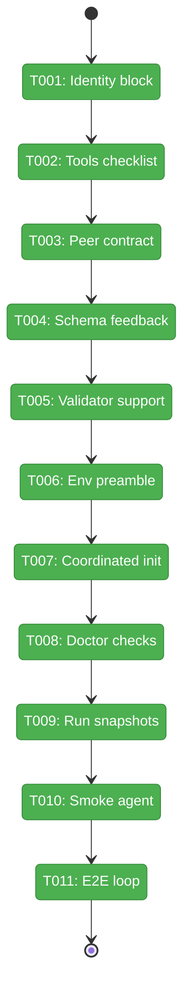
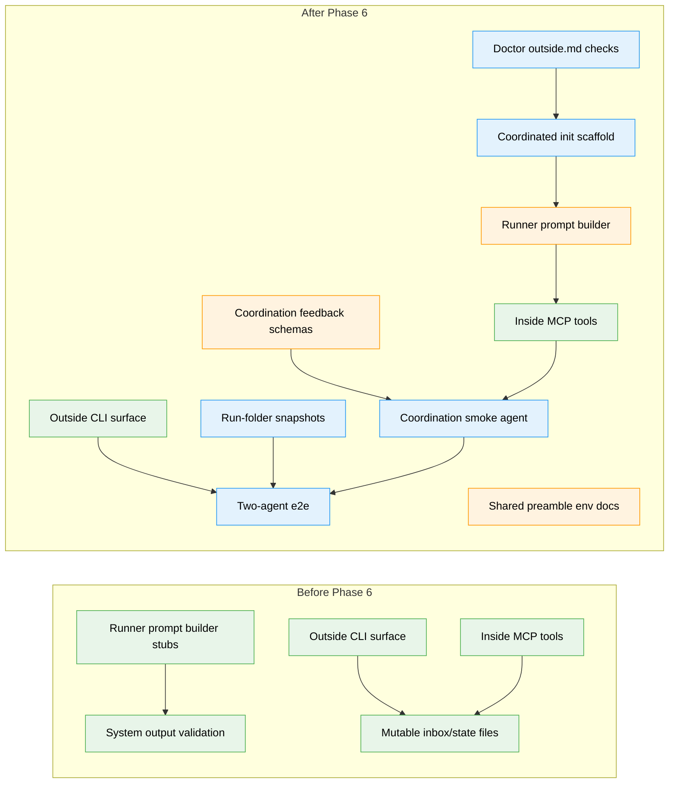

# Flight Plan: Phase 6 — Agent Integration & Prompting

**Plan**: [coordination-plan.md](../../coordination-plan.md)
**Phase**: Phase 6: Agent Integration & Prompting
**Generated**: 2026-04-26
**Status**: Landed

---

## Departure → Destination

**Where we are**: Phases 1-5 provide the coordination substrate: durable per-agent inbox/state files, event-driven `runAgent`, live forwarders, an inside MCP server with six tools, and an outside CLI surface for humans, CI, and host agents. The prompt layer still contains P2 stubs, coordinated agents cannot yet be scaffolded by `init`, `doctor` does not protect `outside.md`, and run folders do not yet freeze the mutable coordination files.

**Where we're going**: Coordinated agents become authorable, discoverable, and testable. A developer can run `minih init my-agent --coordinated`, inspect the outside contract with `minih outside-context my-agent`, run the agent with real inside prompt guidance, and later inspect snapshots and coordination retros from the run folder.

---

## Domain Context

### Domains We're Changing

| Domain | What Changes | Key Files |
|--------|--------------|-----------|
| `runner` | Replaces prompt stubs, widens retrospective schemas/types/validation, sets coordination env vars, snapshots inbox/state files, and adds coordinated agent data. | `src/runner/preamble-builder.ts`, `src/runner/runner.ts`, `src/runner/validator.ts`, `src/runner/types.ts`, `src/schemas/*.json`, `agents/_shared/preamble.md`, `agents/coordination-smoke-test/` |
| `cli` | Adds coordinated scaffold support and outside-contract doctor checks. | `src/cli/commands/init.ts`, `src/cli/commands/doctor.ts`, `test/cli/init-coordinated.test.ts`, `test/cli/doctor-outside-md.test.ts` |
| `cli (e2e)` | Adds an opt-in outside/inside coordination e2e test. | `test/e2e/two-agent-coordination.test.ts` |

### Domains We Depend On (no changes)

| Domain | What We Consume | Contract |
|--------|-----------------|----------|
| `mcp` | Inside inbox/state tool names and behavior for prompt text and smoke-test assertions. | `inbox.list`, `inbox.send`, `inbox.ack`, `state.get`, `state.set`, `state.transition` |
| `adapter` | Event-driven idle completion and session sender seam through runner only. | `IAgentAdapter`, `SessionSender`, `AgentRunOptions.onSessionReady` |
| `runner` | Existing path/state helpers and fake adapter test support. | `inboxLanePath`, `stateFilePath`, `readStateLazy`, `FakeAgentAdapter` |

---

## Flight Status

<!-- Updated by /plan-6-v2: pending → active → done. Use blocked for problems/input needed. -->

**Legend**: grey = pending | yellow = active | red = blocked/needs input | green = done

---

## Stages

<!-- Updated by /plan-6-v2 during implementation: [ ] → [~] → [x] -->

- [x] **Stage T001: Add identity block** - replace the P2 identity stub with real slug/run-id/peer-awareness content (`src/runner/preamble-builder.ts`).
- [x] **Stage T002: Add tools checklist** - inject MCP tool guidance and the coordination pre-completion checklist for coordinated agents (`src/runner/preamble-builder.ts`, `src/runner/runner.ts`).
- [x] **Stage T003: Add peer contract** - finalize `outside.md` injection under the Peer's Contract section with blockquote framing (`src/runner/preamble-builder.ts`).
- [x] **Stage T004: Widen schemas** - add coordination feedback fields to system-output and retrospective schemas/types, plus prompt-facing contract text (`src/schemas/*.json`, `src/runner/types.ts`, `src/runner/runner.ts`, `agents/_shared/preamble.md`).
- [x] **Stage T005: Align validator** - make system validation and check flows accept the widened coordination contract (`src/runner/validator.ts`).
- [x] **Stage T006: Wire env docs** - set coordination env vars during runs, clean them up afterward, and keep non-coordinated preamble growth ≤ 200 chars (`src/runner/runner.ts`, `agents/_shared/preamble.md`).
- [x] **Stage T007: Scaffold coordinated agents** - add `init --coordinated` templates for prompt, outside contract, and state schemas while default `init` stays unchanged (`src/cli/commands/init.ts`).
- [x] **Stage T008: Protect outside contracts** - warn or fail in `doctor` when `outside.md` is stale or oversized while non-coordinated/absent contracts remain no-op (`src/cli/commands/doctor.ts`).
- [x] **Stage T009: Freeze coordination state** - write inbox and state snapshots into completed run folders, preserve malformed NDJSON byte-for-byte, fail corrupt present state files actionably, and keep artifact ordering deterministic (`src/runner/runner.ts`).
- [x] **Stage T010: Add smoke agent** - create the four-file `coordination-smoke-test` agent and verify the folder, tool coverage, schema, and `doctor` health (`agents/coordination-smoke-test/` - new folder).
- [x] **Stage T011: Add e2e loop** - add an opt-in outside/inside coordination e2e test with canonical invocation `MINIH_E2E=1 npm test` (`test/e2e/two-agent-coordination.test.ts` - new file).

---

## Architecture: Before & After

**Legend**: existing (green, unchanged) | changed (orange, modified) | new (blue, created)

---

## Acceptance Criteria

- [x] Inside prompt for `coordination: enabled` agents contains the identity block with slug, run id, and peer awareness.
- [x] `outside.md` body is injected under `## Peer's Contract (from outside.md)` with blockquote framing when present.
- [x] `magicWandTarget` accepts `"coordination"` alongside `"project"` and `"minih"`.
- [x] Optional `retrospective.coordination` validates when present and absent blocks still validate.
- [x] `minih init <slug> --coordinated` scaffolds `outside.md`.
- [x] `minih init <slug> --coordinated` scaffolds `inside-state.schema.json` and `outside-state.schema.json` with example status enums.
- [x] Default `minih init <slug>` output remains unchanged.
- [x] `minih doctor` warns when a coordinated agent's `outside.md` is older than `prompt.md`.
- [x] `minih doctor` warns above 4KB and fails above 8KB for `outside.md`.
- [x] `minih doctor` leaves non-coordinated agents and absent `outside.md` contracts alone.
- [x] Completed run folders include `state-snapshot.json` and `inbox-snapshot/{outside,inside}.ndjson`; corrupt present state files fail finalization actionably, malformed NDJSON is snapshotted byte-for-byte, and artifact ordering remains deterministic.
- [x] Coordination env vars are set during inside execution, cleaned up afterward, and documented in the shared preamble with <= 200 chars of non-coordinated preamble growth.
- [x] The four-file `coordination-smoke-test` agent validates as a static dogfood agent through `doctor`; real SDK smoke execution is not claimed for Phase 6 evidence.
- [x] The two-agent e2e remains opt-in and uses canonical invocation `MINIH_E2E=1 npm test`.

## Goals & Non-Goals

**Goals**:
- Replace coordinated prompt stubs with real identity, tools, checklist, and peer-contract content.
- Extend retrospective schemas and validation for coordination feedback.
- Add coordinated scaffolding and outside-contract doctor checks.
- Freeze mutable coordination files into each completed run folder.
- Add dogfood coverage for the complete outside/inside coordination path.

**Non-Goals**:
- New MCP tools or a public outside MCP server.
- State rule-machine enforcement or peer-gated server orchestration.
- README/AGENTS/CONTRIBUTING polish beyond files directly needed for tests.
- Default-on real SDK e2e tests.

---

## Checklist

- [x] T001: Replace the identity-block stub with the real inside identity block (CS-2)
- [x] T002: Replace the tools-section stub and append the coordination pre-completion checklist (CS-3)
- [x] T003: Finalize peer-contract injection from `outside.md` (CS-2)
- [x] T004: Extend system-output and retrospective schemas plus runner types for coordination feedback (CS-2)
- [x] T005: Align system validation with the widened coordination contract (CS-3)
- [x] T006: Set and document coordination env vars for inside runs (CS-2)
- [x] T007: Add `init --coordinated` scaffolding for two-sided agents (CS-3)
- [x] T008: Add doctor checks for outside contract drift and size (CS-3)
- [x] T009: Snapshot coordination inbox/state files into each run folder at completion (CS-3)
- [x] T010: Author the coordinated smoke-test agent (CS-3)
- [x] T011: Add the opt-in two-agent coordination e2e test (CS-4)

---

## PlanPak

Not active for this plan.
