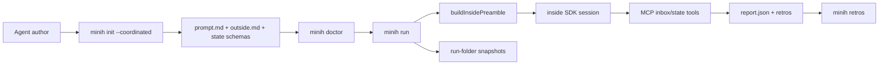
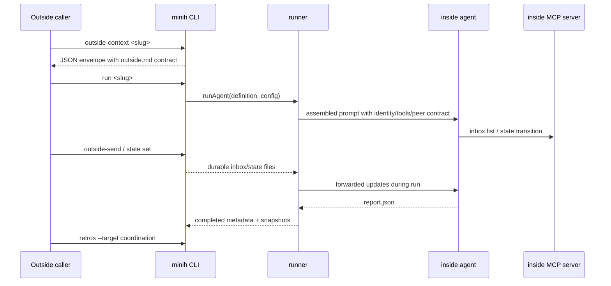

# Phase 6 - Agent Integration & Prompting

**Plan**: [coordination-plan.md](../../coordination-plan.md)
**Phase**: Phase 6: Agent Integration & Prompting
**Generated**: 2026-04-26
**Status**: Landed
**Mode**: Full
**Complexity**: CS-4

---

## Executive Briefing

**Purpose**: This phase turns the coordination substrate into an authorable agent experience. Phases 1-5 built durable inbox/state files, live forwarding, inside MCP tools, and outside CLI commands; Phase 6 wires the prompt text, schemas, scaffolding, doctor checks, snapshots, and smoke-test agent that make those primitives usable end-to-end.

**What We're Building**: Real coordinated prompt content replaces the P2 stub markers in `preamble-builder.ts`; `magicWandTarget` and retrospective schemas gain the coordination-specific feedback path; `init --coordinated` scaffolds two-sided agents; `doctor` warns when outside contracts drift or bloat; run completion freezes inbox/state snapshots; and a coordination smoke-test agent plus opt-in e2e test prove the full outside/inside loop.

**Goals**:
- ✅ Add the inside identity block, coordination tool guidance, pre-completion checklist, and peer-contract injection for `coordination: enabled` agents.
- ✅ Extend system output and retrospective contracts for `magicWandTarget: "coordination"` and optional `retrospective.coordination`.
- ✅ Set and document coordination env vars consistently for inside runs.
- ✅ Scaffold coordinated agents with `prompt.md`, `outside.md`, and per-agent state schemas.
- ✅ Warn/error on stale or oversized `outside.md` contracts in `doctor`.
- ✅ Snapshot shared inbox/state files into each run folder at completion.
- ✅ Add a coordination smoke-test agent and opt-in two-agent e2e coverage.

**Non-Goals**:
- ❌ No new MCP tools or public `minih serve --mcp` surface; Phase 4 owns the inside MCP server.
- ❌ No state rule engine, peer-gated orchestrator, or server-side transition policy; minih stays an enabler.
- ❌ No outside-side MCP surface; outside remains CLI-first through Phase 5 commands.
- ❌ No broad documentation polish in `README.md`, `AGENTS.md`, or `CONTRIBUTING.md`; Phase 7 owns that.
- ❌ No mid-run synthetic system-reminder wrapper around forwarded inbox messages.

---

## Prior Phase Context

### Phase 0: Pre-Work Scratch Tests + Decision Gate

#### A. Deliverables

- `/Users/jordanknight/substrate/minih/scratch/runagent-eventdriven/test.mjs` and README validated `session.send(...)` plus idle subscription as the coordinated run shape.
- `/Users/jordanknight/substrate/minih/scratch/fswatch-test/test.mjs` and README captured native `node:fs.watch` burst and atomic-rename behavior.
- `/Users/jordanknight/substrate/minih/scratch/daemon-light-prototype/test.mjs` and README proved durable writes can be forwarded into a live session.
- `/Users/jordanknight/substrate/minih/scratch/multi-process-watch/test.mjs` and README validated concurrent NDJSON appends plus torn-line retry semantics.
- `/Users/jordanknight/substrate/minih/docs/plans/007-backgrounding/prework-results.md` recorded the GO decision.

#### B. Dependencies Exported

- `session.send(...)` is the live-turn injection primitive; minih should not invent a second in-memory queue.
- `fs.watch` events are hints only; durable inbox/state files are the source of truth.
- NDJSON writer invariant: one complete `${json}\n` append per message.
- Forwarder invariant: never advance durable progress past malformed or incomplete input.

#### C. Gotchas & Debt

- Native watcher events coalesce; tests must assert durable outcomes rather than one event per write.
- A persistently malformed NDJSON line stalls delivery until repaired.
- Scratch scripts are evidence only and must not become production dependencies.

#### D. Incomplete Items

- None blocking Phase 6.

#### E. Patterns to Follow

- Keep evidence and production code separate.
- Treat durable inbox/state files as the reproducible contract.
- Prefer simple Node core filesystem operations unless existing helpers already cover the behavior.

### Phase 1: Runner Foundations

#### A. Deliverables

- `/Users/jordanknight/substrate/minih/src/runner/state.ts` with `readStateLazy`, `writeState`, and `appendHistory`.
- `/Users/jordanknight/substrate/minih/src/runner/context.ts` with `detectContext()` and coordination env-var helpers.
- `/Users/jordanknight/substrate/minih/src/runner/atomic-write.ts` with write-then-rename helpers.
- `/Users/jordanknight/substrate/minih/src/runner/ulid.ts` with in-tree lex-sortable IDs.
- `/Users/jordanknight/substrate/minih/src/runner/folder.ts` with inbox/state/history/watermark/outside.md path helpers.
- `/Users/jordanknight/substrate/minih/src/runner/types.ts` with coordination data types.
- `/Users/jordanknight/substrate/minih/src/schemas/{inbox-message,outside-state,inside-state,state-history-entry}.json`.

#### B. Dependencies Exported

- `detectContext(): 'inside' | 'outside'` returns inside only when `MINIH === '1'`.
- `MINIH_ENV_KEYS_COORDINATION` and `MINIH_ENV_KEYS_ALL` define coordination env-var names.
- `inboxLanePath`, `stateFilePath`, `historyPath`, `outsideMdPath`, and `hasOutsideMd` resolve absolute coordination paths.
- `readStateLazy(...)`, `writeState(...)`, and `appendHistory(...)` are the state persistence contracts.
- `AgentDefinition.outsideContract` and `AgentDefinition.coordination` are loaded by agent discovery.

#### C. Gotchas & Debt

- `state.ts` intentionally has no transition rule engine, peer gating, or orchestration policy.
- `readStateLazy()` synthesizes defaults for absent state files, but corrupt present files throw.
- `context.ts` still documents that `MINIH_INBOX_DIR` and `MINIH_STATE_DIR` were not set by runner at P1; Phase 6 must settle this for AC-ENV-VARS.

#### D. Incomplete Items

- Retrospective coordination types and schema widening were intentionally deferred to Phase 6.
- Per-agent state schema scaffolding was intentionally deferred to `init --coordinated`.

#### E. Patterns to Follow

- Reuse runner contracts via `src/runner/index.ts`; do not duplicate path layout constants.
- Keep state status as runtime data, not a TypeScript enum.
- Preserve strict `MINIH === '1'` context semantics.

### Phase 2: runAgent Event-Driven Refactor + Preamble Builder

#### A. Deliverables

- `/Users/jordanknight/substrate/minih/src/adapter/interface.ts` exported the event-driven adapter run contract.
- `/Users/jordanknight/substrate/minih/src/adapter/events.ts` exported `SessionSender`, `AgentRunOptions.onSessionReady`, and `session_idle`.
- `/Users/jordanknight/substrate/minih/src/adapter/sdk-copilot.ts` now uses `session.send` plus idle subscription for `run()`.
- `/Users/jordanknight/substrate/minih/src/adapter/fake.ts` supports queued runs and session-send test history.
- `/Users/jordanknight/substrate/minih/src/runner/preamble-builder.ts` owns pure prompt assembly with P6 stub markers.
- `/Users/jordanknight/substrate/minih/src/runner/runner.ts` owns `awaitTerminalCondition(...)`.

#### B. Dependencies Exported

- `buildInsidePreamble(input: PreambleAssemblyInput): string` is the prompt assembly seam Phase 6 must reuse.
- `PreambleAssemblyInput.runId` and `definition.slug` are available for identity-block substitution.
- Non-coordinated prompt assembly is byte-equivalence protected by snapshot tests.
- Resume turns bypass full preamble assembly and send only the follow-up message.

#### C. Gotchas & Debt

- P2 intentionally left `IDENTITY_BLOCK_STUB`, `TOOLS_SECTION_STUB`, and peer-contract stub comments.
- `buildInsidePreamble()` currently places coordinated `instructions` after the agent body; preserve or consciously test any ordering change.
- `validateSystemOutput()` still uses an inline permissive schema instead of the bundled `system-output.json` file.

#### D. Incomplete Items

- Final identity, tools, checklist, and peer-contract prompt text are Phase 6 work.

#### E. Patterns to Follow

- Keep prompt assembly centralized in `preamble-builder.ts`; do not inline coordinated prompt text in `runner.ts`.
- Keep runner adapter-agnostic; no SDK or MCP-domain imports in runner.
- Preserve non-coordinated snapshots exactly.

### Phase 3: File Watcher + Daemon-Light Forwarders

#### A. Deliverables

- `/Users/jordanknight/substrate/minih/src/runner/file-watcher.ts`.
- `/Users/jordanknight/substrate/minih/src/runner/forwarder-watermark.ts`.
- `/Users/jordanknight/substrate/minih/src/runner/inbox-forwarder.ts`.
- `/Users/jordanknight/substrate/minih/src/runner/state-forwarder.ts`.
- `/Users/jordanknight/substrate/minih/src/runner/run-lock.ts`.
- `/Users/jordanknight/substrate/minih/test/e2e/daemon-light.test.ts`.

#### B. Dependencies Exported

- Coordinated `runAgent` starts inbox/state forwarders through `onSessionReady`.
- Cold-start drain forwards pre-existing outside inbox/state changes before terminal completion.
- `pendingForwarderCount()` is part of the terminal condition, so queued `session.send` work drains before completion.
- `RunLockHeldError` and `RUN_LOCK_HELD` are public for future CLI mapping.

#### C. Gotchas & Debt

- Forwarders commit watermarks only after successful terminal completion.
- Forwarder internals remain private; later phases should validate outcomes through runner surfaces.
- Concurrent live runs are guarded by runner lock logic, not by outside commands.

#### D. Incomplete Items

- No Phase 3 blockers remain.

#### E. Patterns to Follow

- Drain first, subscribe second.
- Commit progress only after successful delivery.
- Use `finally` cleanup for watchers, forwarders, and locks.

### Phase 4: MCP Domain

#### A. Deliverables

- `/Users/jordanknight/substrate/minih/src/mcp/types.ts` with six tool names, schemas, and typed result/error helpers.
- `/Users/jordanknight/substrate/minih/src/mcp/context.ts` with hidden baked context validation.
- `/Users/jordanknight/substrate/minih/src/mcp/spawn.ts` with `buildInsideMcpServerConfig(...)`.
- `/Users/jordanknight/substrate/minih/src/mcp/server.ts` with stdio server and dispatcher.
- `/Users/jordanknight/substrate/minih/src/mcp/tools/inbox.ts` with `inbox.list`, `inbox.send`, and `inbox.ack`.
- `/Users/jordanknight/substrate/minih/src/mcp/tools/state.ts` with `state.get`, `state.set`, and `state.transition`.
- `/Users/jordanknight/substrate/minih/test/mcp/*.test.ts` coverage.

#### B. Dependencies Exported

- `buildInsideMcpServerConfig(...)` returns the internal `minih-coordination` MCP server config.
- The inside tool surface is exactly `inbox.list`, `inbox.send`, `inbox.ack`, `state.get`, `state.set`, and `state.transition`.
- MCP spawn config already bakes `MINIH_CONTEXT=inside`, `MINIH_INBOX_DIR`, and `MINIH_STATE_DIR` for the MCP child process.
- `createTestMcpClient(...)` can exercise the real stdio MCP server in tests.

#### C. Gotchas & Debt

- Tool input must never become a filesystem path; paths come only from baked context plus runner helpers.
- Model-facing errors should be stable and redacted.
- Leak regression remains opt-in.

#### D. Incomplete Items

- No Phase 4 blockers remain.

#### E. Patterns to Follow

- Preserve import direction: `cli -> mcp`, `mcp -> runner`, `runner -> adapter`.
- Use MCP contracts for smoke-test behavior but do not modify the MCP tool set in Phase 6.

### Phase 5: Outside CLI Surface

#### A. Deliverables

- `/Users/jordanknight/substrate/minih/src/cli/preaction-context.ts` with inside-context blocking.
- `/Users/jordanknight/substrate/minih/src/cli/coordination.ts` with shared outside coordination CLI helpers.
- `/Users/jordanknight/substrate/minih/src/cli/commands/outside-send.ts`.
- `/Users/jordanknight/substrate/minih/src/cli/commands/outside-inbox-list.ts`.
- `/Users/jordanknight/substrate/minih/src/cli/commands/state.ts`.
- `/Users/jordanknight/substrate/minih/src/cli/commands/outside-context.ts`.
- `/Users/jordanknight/substrate/minih/src/cli/commands/outside-retro.ts`.
- `/Users/jordanknight/substrate/minih/src/cli/commands/retros.ts`.
- `/Users/jordanknight/substrate/minih/src/cli/index.ts` command registration.
- `/Users/jordanknight/substrate/minih/test/cli/*.test.ts` Phase 5 coverage.

#### B. Dependencies Exported

- Outside callers can fetch context, send outside-lane messages, read inside-lane replies, update outside-owned state, record retros, and aggregate both sides' retros.
- `retros` already accepts `--target coordination` and reads optional inside `retrospective.coordination` blocks when present.
- `outside-context` already references `minih init <slug> --coordinated` as the future scaffold path.

#### C. Gotchas & Debt

- Phase 5 code review found and fixed a real state-history bug: every persisted outside-state mutation must append history before writing state.
- Plan wording used `E12X`, but implementation standardized on `E128 INVALID_CONTEXT`.
- Phase 5 deliberately did not add final coordinated prompt content, run snapshots, init scaffolding, or doctor outside-md checks.

#### D. Incomplete Items

- No Phase 5 implementation blockers remain.
- Phase 5 is complete, reviewed, and validated, but may still be uncommitted depending on the current branch state.

#### E. Patterns to Follow

- Preserve stdout JSON envelope and stderr human-readable output conventions.
- Use shared CLI coordination helpers rather than copying validation and lane parsing.
- Do not make outside CLI commands orchestrate inside behavior; write durable files and let runner/MCP primitives react.

---

## Pre-Implementation Check

| File | Exists? | Domain Check | Notes |
|------|---------|--------------|-------|
| `/Users/jordanknight/substrate/minih/src/runner/preamble-builder.ts` | Yes | `runner` contract | Existing P2 stub markers are the intended replacement seam. Preserve non-coordinated byte-equivalence snapshots. |
| `/Users/jordanknight/substrate/minih/test/runner/preamble-builder.test.ts` | Yes | `runner` test | Existing snapshots cover stub output and peer-contract presence. Replace stub expectations with real coordinated content. |
| `/Users/jordanknight/substrate/minih/src/runner/runner.ts` | Yes | `runner` internal | Owns `SYSTEM_OUTPUT_INSTRUCTIONS`, run env vars, run finalization, artifacts, and cleanup. Phase 6 touches it for checklist, schema prompt contract, env vars, and snapshots. |
| `/Users/jordanknight/substrate/minih/src/runner/context.ts` | Yes | `runner` contract | Currently declares coordination env keys and notes runner does not set them. Update comments/tests if Phase 6 wires them. |
| `/Users/jordanknight/substrate/minih/src/runner/types.ts` | Yes | `runner` contract | Comments explicitly reserve `RetrospectiveCoordination` and `MagicWandTarget` widening for P6. |
| `/Users/jordanknight/substrate/minih/src/runner/validator.ts` | Yes | `runner` internal | `validateSystemOutput()` currently uses an inline permissive schema. Align with the widened contract while keeping old reports valid. |
| `/Users/jordanknight/substrate/minih/src/schemas/system-output.json` | Yes | `runner` contract | Add `"coordination"` enum value and optional `retrospective.coordination`. |
| `/Users/jordanknight/substrate/minih/src/schemas/retrospective.json` | Yes | `runner` contract | Mirror system-output retrospective changes. |
| `/Users/jordanknight/substrate/minih/agents/_shared/preamble.md` | Yes | `runner` data | Add brief env-var and widened-feedback-contract documentation only. Heavy coordination guidance belongs in conditional injection, not global preamble. |
| `/Users/jordanknight/substrate/minih/src/cli/commands/init.ts` | Yes | `cli` contract | Add `--coordinated`; keep default scaffold backward compatible. |
| `/Users/jordanknight/substrate/minih/test/cli/init-coordinated.test.ts` | No | `cli` test | New focused CLI subprocess test for generated coordinated files and state schema enums. |
| `/Users/jordanknight/substrate/minih/src/cli/commands/doctor.ts` | Yes | `cli` contract | Add outside.md drift/size checks while preserving existing per-agent check envelope shape. |
| `/Users/jordanknight/substrate/minih/test/cli/doctor-outside-md.test.ts` | No | `cli` test | New focused coverage for drift warning, size warning, size failure, and non-coordinated absence behavior. |
| `/Users/jordanknight/substrate/minih/test/runner/run-folder-snapshot.test.ts` | No | `runner` test | New unit/integration test should assert `state-snapshot.json` and `inbox-snapshot/{outside,inside}.ndjson`. |
| `/Users/jordanknight/substrate/minih/agents/coordination-smoke-test/prompt.md` | No | `runner` data | New coordinated dogfood agent. Plan fixes this deliverable at four files; do not add per-agent state schemas to this folder in Phase 6. |
| `/Users/jordanknight/substrate/minih/agents/coordination-smoke-test/outside.md` | No | `runner` data | New outside contract for the smoke-test agent. |
| `/Users/jordanknight/substrate/minih/agents/coordination-smoke-test/instructions.md` | No | `runner` data | New smoke-test instructions. |
| `/Users/jordanknight/substrate/minih/agents/coordination-smoke-test/output-schema.json` | No | `runner` data | New report schema for tool exercise results plus system retrospective fields. |
| `/Users/jordanknight/substrate/minih/test/e2e/two-agent-coordination.test.ts` | No | `cli` e2e | New opt-in `MINIH_E2E=1` test. Should be skipped by default like `daemon-light.test.ts`. |
| `/Users/jordanknight/substrate/minih/docs/project-rules/harness.md` | No | harness | No agent harness configured. Implementation uses standard tests and minih dogfood agents instead. |

**Concept duplication check**:
- Existing concept: inside prompt assembly is already centralized as `buildInsidePreamble()` in the runner domain; reuse it rather than adding a second prompt builder.
- Existing concept: outside context and cross-side retros are already implemented in Phase 5 CLI commands; Phase 6 should not create another outside command surface.
- Existing concept: inside MCP tools already exist in the `mcp` domain; Phase 6 prompt text should reference them but not alter their contracts.
- Existing concept: run-folder artifact listing exists in `runner.ts`; snapshot logic can plug into finalization before artifact enumeration.
- Not found: coordinated init scaffolding, doctor `outside.md` drift/size checks, run-folder coordination snapshots, `coordination-smoke-test`, and two-agent e2e coverage.

---

## Architecture Map

```mermaid
flowchart TD
    classDef pending fill:#9E9E9E,stroke:#757575,color:#fff
    classDef inprogress fill:#FFC107,stroke:#FFA000,color:#000
    classDef completed fill:#4CAF50,stroke:#388E3C,color:#fff

    subgraph Phase["Phase 6: Agent Integration & Prompting"]
        T001["T001: Identity block"]:::completed
        T002["T002: Tools + checklist"]:::completed
        T003["T003: Peer contract"]:::completed
        T004["T004: Schema + types"]:::completed
        T005["T005: Validator compatibility"]:::completed
        T006["T006: Env vars + preamble"]:::completed
        T007["T007: init --coordinated"]:::completed
        T008["T008: doctor outside.md"]:::completed
        T009["T009: Run snapshots"]:::completed
        T010["T010: Smoke-test agent"]:::completed
        T011["T011: Two-agent e2e"]:::completed

        T001 --> T002
        T002 --> T003
        T004 --> T005
        T006 --> T010
        T007 --> T008
        T001 --> T010
        T002 --> T010
        T003 --> T010
        T004 --> T010
        T005 --> T010
        T009 --> T011
        T010 --> T011
    end

    subgraph Files["Primary Files"]
        F1["src/runner/preamble-builder.ts"]:::completed
        F2["src/runner/runner.ts"]:::completed
        F3["src/runner/validator.ts + schemas"]:::inprogress
        F4["agents/_shared/preamble.md"]:::inprogress
        F5["src/cli/commands/init.ts"]:::completed
        F6["src/cli/commands/doctor.ts"]:::completed
        F7["agents/coordination-smoke-test/"]:::completed
        F8["test/e2e/two-agent-coordination.test.ts"]:::completed
    end

    subgraph Existing["Reusable Prior-Phase Contracts"]
        R1["runner inbox/state/path helpers"]:::completed
        R2["inside MCP tools"]:::completed
        R3["outside CLI commands"]:::completed
        R4["FakeAgentAdapter + MCP test client"]:::completed
    end

    T001 -.-> F1
    T002 -.-> F1
    T002 -.-> F2
    T003 -.-> F1
    T004 -.-> F3
    T004 -.-> F2
    T004 -.-> F4
    T005 -.-> F3
    T006 -.-> F2
    T006 -.-> F4
    T007 -.-> F5
    T008 -.-> F6
    T009 -.-> F2
    T010 -.-> F7
    T011 -.-> F8
    R1 -.-> T006
    R1 -.-> T009
    R2 -.-> T002
    R2 -.-> T010
    R3 -.-> T007
    R3 -.-> T011
    R4 -.-> T005
    R4 -.-> T011
```



---

## Tasks

| Status | ID | Task | Domain | Path(s) | Done When | Notes |
|--------|----|------|--------|---------|-----------|-------|
| [x] | T001 | Replace the identity-block stub with the real inside identity block | runner | `/Users/jordanknight/substrate/minih/src/runner/preamble-builder.ts`<br>`/Users/jordanknight/substrate/minih/test/runner/preamble-builder.test.ts` | Coordinated prompt snapshots contain `## Your Context (coordination)`, the agent slug, the run id, and explicit peer/outside awareness; non-coordinated snapshots remain byte-identical. | CS-2. AC-PROMPT-INSIDE-IDENTITY. Use `definition.slug` and `input.runId`; do not read env vars inside the pure builder. |
| [x] | T002 | Replace the tools-section stub and append the coordination pre-completion checklist | runner | `/Users/jordanknight/substrate/minih/src/runner/preamble-builder.ts`<br>`/Users/jordanknight/substrate/minih/src/runner/runner.ts`<br>`/Users/jordanknight/substrate/minih/test/runner/preamble-builder.test.ts` | Coordinated prompt snapshots list all six MCP tools and include the pre-completion checklist before final output instructions complete; disabled coordination omits all additions. | CS-3. Workshop 005. Keep tool names exactly aligned to `mcp` contracts: `inbox.list`, `inbox.send`, `inbox.ack`, `state.get`, `state.set`, `state.transition`. Do not mention removed server-side `GATED` rule as runtime fact unless the current MCP implementation supports it. |
| [x] | T003 | Finalize peer-contract injection from `outside.md` | runner | `/Users/jordanknight/substrate/minih/src/runner/preamble-builder.ts`<br>`/Users/jordanknight/substrate/minih/test/runner/preamble-builder.test.ts` | When `outside.md` exists for a coordinated agent, the body is injected under `## Peer's Contract (from outside.md)` with blockquote framing; absent `outside.md` omits the section. | CS-2. AC-PROMPT-PEER-CONTRACT. Remove/replace P2 stub comments with stable section markers only if tests need update hooks. Drift messaging belongs to T008 `doctor`, not the inside peer-contract prompt. |
| [x] | T004 | Extend system-output and retrospective schemas plus runner types for coordination feedback | runner | `/Users/jordanknight/substrate/minih/src/schemas/system-output.json`<br>`/Users/jordanknight/substrate/minih/src/schemas/retrospective.json`<br>`/Users/jordanknight/substrate/minih/src/runner/types.ts`<br>`/Users/jordanknight/substrate/minih/src/runner/runner.ts`<br>`/Users/jordanknight/substrate/minih/agents/_shared/preamble.md`<br>`/Users/jordanknight/substrate/minih/test/runner/schema-compat.test.ts` | Bundled schemas compile, prompt-facing instructions document `magicWandTarget` accepting `"project"`, `"minih"`, and `"coordination"`, and optional `retrospective.coordination` validates with documented fields while absent blocks stay valid. | CS-2. AC-MAGIC-WAND-COORDINATION, AC-RETRO-COORDINATION-OPTIONAL. Add types such as `MagicWandTarget` and `RetrospectiveCoordination` without requiring every report to use them; keep runner system-output text and the shared preamble aligned with the widened contract. |
| [x] | T005 | Align system validation with the widened coordination contract | runner | `/Users/jordanknight/substrate/minih/src/runner/validator.ts`<br>`/Users/jordanknight/substrate/minih/test/runner/validator.test.ts`<br>`/Users/jordanknight/substrate/minih/test/runner/schema-compat.test.ts`<br>`/Users/jordanknight/substrate/minih/test/helpers/fixtures.ts` | `validateSystemOutput()` and `minih check` accept old reports, reports with `magicWandTarget: "coordination"`, and reports with `retrospective.coordination`; error messages remain actionable. | CS-3. The current inline validator is permissive; decide explicitly whether to keep it permissive or compile the bundled schema, but do not break existing tests that intentionally omit optional fields. |
| [x] | T006 | Set and document coordination env vars for inside runs | runner | `/Users/jordanknight/substrate/minih/src/runner/runner.ts`<br>`/Users/jordanknight/substrate/minih/src/runner/context.ts`<br>`/Users/jordanknight/substrate/minih/agents/_shared/preamble.md`<br>`/Users/jordanknight/substrate/minih/test/runner/runner.test.ts`<br>`/Users/jordanknight/substrate/minih/test/runner/context.test.ts` | During a coordinated run, `MINIH_CONTEXT=inside`, `MINIH_INBOX_DIR`, and `MINIH_STATE_DIR` are available and cleaned up afterward; the shared preamble briefly documents them; non-coordinated behavior remains compatible and non-coordinated preamble growth stays ≤ 200 chars. | CS-2. AC-ENV-VARS. P4 MCP spawn already sets these for the MCP child, but P6 should make the runner env contract truthful for the inside run. Keep global preamble growth ≤ 200 chars because all agents read it. |
| [x] | T007 | Add `init --coordinated` scaffolding for two-sided agents | cli | `/Users/jordanknight/substrate/minih/src/cli/commands/init.ts`<br>`/Users/jordanknight/substrate/minih/test/cli/init-coordinated.test.ts`<br>`/Users/jordanknight/substrate/minih/test/cli/commands.test.ts` | `minih init <slug> --coordinated` creates `prompt.md` with `coordination: enabled`, `outside.md`, `inside-state.schema.json`, and `outside-state.schema.json` with example status enums; default `init` output remains unchanged. | CS-3. AC-INIT-COORDINATED-OUTSIDE-MD, AC-INIT-COORDINATED-STATE-SCHEMAS. Preserve existing `--with-input`, `--no-output`, and `--no-instructions` semantics. |
| [x] | T008 | Add doctor checks for outside contract drift and size | cli | `/Users/jordanknight/substrate/minih/src/cli/commands/doctor.ts`<br>`/Users/jordanknight/substrate/minih/test/cli/doctor-outside-md.test.ts` | `doctor` warns when `outside.md` is older than `prompt.md` for a coordinated agent, warns when `outside.md` is over 4KB, fails when over 8KB, and leaves non-coordinated/absent contracts alone. | CS-3. AC-DOCTOR-OUTSIDE-MD-DRIFT, AC-DOCTOR-OUTSIDE-MD-SIZE. Keep the check results inside the existing agent checks array and respect `--strict`. Reuse existing outside.md resolution/realpath containment, or preserve equivalent containment, before any size or mtime check. |
| [x] | T009 | Snapshot coordination inbox/state files into each run folder at completion | runner | `/Users/jordanknight/substrate/minih/src/runner/runner.ts`<br>`/Users/jordanknight/substrate/minih/test/runner/run-folder-snapshot.test.ts`<br>`/Users/jordanknight/substrate/minih/test/runner/runner-event-driven.test.ts` | Completed runs contain `inbox-snapshot/outside.ndjson`, `inbox-snapshot/inside.ndjson`, and `state-snapshot.json`; missing lanes become empty files and missing side states become `null`; corrupt present state files fail finalization with an actionable error; inbox lanes are copied byte-for-byte, so malformed NDJSON is preserved rather than parsed or silently repaired; metadata artifacts include the snapshots in deterministic order. | CS-3. AC-RUN-FOLDER. Snapshot at run end before artifact enumeration. Use runner path helpers; do not move or mutate shared files. Add tests for corrupt `outside.json`/`inside.json`, malformed NDJSON lane preservation, and stable artifact ordering after snapshot insertion. |
| [x] | T010 | Author the coordinated smoke-test agent | runner (data) | `/Users/jordanknight/substrate/minih/agents/coordination-smoke-test/prompt.md`<br>`/Users/jordanknight/substrate/minih/agents/coordination-smoke-test/outside.md`<br>`/Users/jordanknight/substrate/minih/agents/coordination-smoke-test/instructions.md`<br>`/Users/jordanknight/substrate/minih/agents/coordination-smoke-test/output-schema.json` | The agent is `coordination: enabled`, documents its outside contract, exercises all inbox/state tool types in its prompt/instructions, stays constrained to the four-file deliverable, and passes `doctor` validation. | CS-3. Authoritative slug and folder are `coordination-smoke-test`; Workshop 006's `coordination-smoke` and `GATED` examples are stale and apply only as opt-in test-tier/fixture-strategy background. Keep this deliverable to the four files listed here; do not add per-agent state schemas to the smoke-test folder in Phase 6. |
| [x] | T011 | Add the opt-in two-agent coordination e2e test | cli (e2e) | `/Users/jordanknight/substrate/minih/test/e2e/two-agent-coordination.test.ts` | With the canonical invocation `MINIH_E2E=1 npm test`, the test drives the smoke-test agent through outside CLI writes, verifies inside replies/state/report evidence, and remains skipped by default. | CS-4. Reuse the skip pattern from `daemon-light.test.ts`; do not put real SDK e2e into the default `npm test` path. Workshop 006's `npm run test:e2e` text is non-canonical for Phase 6. |

---

## Context Brief

**Key findings from plan**:
- Phase 6 is prompt/schema/scaffold integration, not new infrastructure. It must consume P2's preamble builder, P4's MCP tools, and P5's outside CLI surface.
- Coordination stays opt-in. Agents without `coordination: enabled` must keep their current preamble, MCP, validation, and doctor behavior.
- Phase 6 inserts coordinated sections into the existing `buildInsidePreamble()` assembly without moving current output-hint or input-params placement; the checklist belongs near final output requirements, and the agent body/instructions ordering should remain byte-compatible for non-coordinated agents.
- The outside contract file is `agents/<slug>/outside.md`, plain markdown with one audience: the host caller. The same body is injected for inside peer awareness.
- `magicWandTarget: "coordination"` is a schema and aggregation bucket, not a new persistence layer.
- Run-folder snapshots restore reproducibility for mutable per-agent shared inbox/state files.
- State remains data only. Per-agent schemas can constrain status values, but minih does not enforce workflow gates.

**Domain dependencies**:
- `runner`: Prompt assembly (`buildInsidePreamble`) - replace stub sections and preserve non-coordinated byte-equivalence.
- `runner`: Run lifecycle (`runAgent`) - set/clear env vars and snapshot coordination files before artifact enumeration.
- `runner`: Validation (`validateSystemOutput`, `validateOutput`) - accept widened retrospective contracts and keep old reports valid.
- `runner`: Folder/state helpers (`inboxLanePath`, `stateFilePath`, `readStateLazy`) - implement snapshot paths and state JSON contents without duplicating layout constants.
- `cli`: Init command scaffolding - add coordinated templates while preserving existing flags.
- `cli`: Doctor checks - extend existing per-agent checks and envelope shape.
- `mcp`: Six inside tools - referenced by prompt/smoke-agent text only; no Phase 6 contract change.
- `adapter`: Event-driven session completion - consumed only through runner; no Phase 6 adapter changes expected.

**Domain constraints**:
- Import direction remains `cli -> {mcp, runner, adapter}`, `mcp -> runner`, `runner -> adapter`. Runner must not import `mcp` or `cli`.
- CLI commands write JSON envelopes to stdout and human-readable output to stderr.
- Keep simple helpers in-tree; do not add a dependency for markdown templates or snapshot copying.
- Fresh AJV instance per validation call remains the validator convention.
- Do not add broad catches that silently turn corrupt coordination files into empty/default data.
- Do not modify Phase 5 outside command semantics while adding scaffolding/docs around them.

**Harness context**:
- No `docs/project-rules/harness.md` is configured. Implementation will use standard repository tests, focused vitest suites, and minih dogfood agents.

**Reusable from prior phases**:
- `FakeAgentAdapter` and queued-run/session-send helpers for prompt and runner tests.
- `createTestMcpClient(...)` for real stdio MCP tool exercise if the e2e needs local probing.
- Phase 5 CLI subprocess test pattern with `node dist/cli/index.js`.
- `daemon-light.test.ts` opt-in gate pattern: `process.env.MINIH_E2E === '1' ? describe : describe.skip`.
- `validSystemOutput(...)` fixture for report validation tests.
- Runner path helpers and state persistence helpers for snapshots and scaffolded schemas.

**Mermaid flow diagram**:



**Mermaid sequence diagram**:



**Sequence note**: outside callers use the Phase 5 outside CLI surface (`outside-send`, `state set`); `state.transition` is an inside MCP tool and not an outside CLI command.

---

## Discoveries & Learnings

_Populated during implementation by plan-6._

| Date | Task | Type | Discovery | Resolution | References |
|------|------|------|-----------|------------|------------|
| 2026-04-26 | T005 | Decision | Published schemas should be canonical/strict, but runtime system validation must stay forward-compatible with older/future reports. | Added `"coordination"` to bundled schema enums and optional coordination retrospective fields while keeping `validateSystemOutput()` permissive for unknown `magicWandTarget` strings. | `src/schemas/system-output.json`, `src/schemas/retrospective.json`, `src/runner/validator.ts` |
| 2026-04-26 | T006 | Gotcha | Coordinated env vars need to exist only during the run, not leak into the parent process after `runAgent()` returns. | Added coordinated env keys to the runtime cleanup list and covered set/cleanup behavior in runner tests. | `src/runner/runner.ts`, `test/runner/runner.test.ts` |
| 2026-04-26 | T008 | Gotcha | `doctor` failure envelopes carry agent details under `error.details.agents`, while success envelopes use `data.agents`. | Updated tests to read both shapes and kept the command behavior consistent with existing envelope conventions. | `test/cli/doctor-outside-md.test.ts` |
| 2026-04-26 | T009 | Decision | Run-folder snapshots should preserve mutable coordination evidence exactly enough for debugging, but corrupted present state must not look successful. | Copied inbox lanes byte-for-byte, wrote missing states as `null`, and converted corrupt present state into an actionable finalization failure. | `src/runner/runner.ts`, `test/runner/run-folder-snapshot.test.ts` |
| 2026-04-26 | T011 | Decision | Phase 6 e2e should exercise the full coordination loop without requiring the real SDK in the default suite. | Added an opt-in fake-adapter e2e gated by `MINIH_E2E=1`; default run skips it, gated run verifies outside CLI writes, forwarders, inside reply/state/report evidence, and snapshots. | `test/e2e/two-agent-coordination.test.ts` |
| 2026-04-26 | Review | Follow-up | Minih code review found prompt preview/template drift risks and an overstated smoke-agent runtime evidence claim. | Switched scaffolded `_shared/preamble.md` to the copied canonical template asset, routed `run --dry-run` through `buildInsidePreamble()`, and narrowed T010 evidence to the static/doctor validation actually run. | `src/templates/shared-preamble.md`, `src/cli/commands/init.ts`, `src/cli/commands/run.ts` |

---

## Directory Layout

```text
docs/plans/007-backgrounding/
  |-- coordination-plan.md
  |-- coordination.fltplan.md
  `-- tasks/
      `-- phase-6-agent-integration-and-prompting/
          |-- tasks.md
          |-- tasks.fltplan.md
          `-- execution.log.md   # created by plan-6
```

---

## Validation Record (2026-04-26)

| Agent | Lenses Covered | Issues | Verdict |
|-------|---------------|--------|---------|
| Source Truth | Technical Constraints, Domain Boundaries, Concept Documentation, Hidden Assumptions, Edge Cases & Failures, Security & Privacy | 2 HIGH fixed, 2 MEDIUM fixed | VALIDATED WITH FIXES |
| Cross-Reference | Integration & Ripple, User Experience, Concept Documentation, Domain Boundaries, Hidden Assumptions, Technical Constraints | 3 HIGH fixed, 1 MEDIUM fixed | VALIDATED WITH FIXES |
| Completeness | Edge Cases & Failures, Deployment & Ops, Performance & Scale, Security & Privacy, User Experience, System Behavior, Hidden Assumptions, Technical Constraints | 1 HIGH fixed, 3 MEDIUM fixed, 1 LOW fixed | VALIDATED WITH FIXES |
| Forward-Compatibility | Forward-Compatibility, Integration & Ripple, Deployment & Ops, Domain Boundaries, Technical Constraints, Hidden Assumptions, Test Boundary | 2 HIGH fixed, 3 MEDIUM fixed | VALIDATED WITH FIXES |

### Forward-Compatibility Matrix

| Consumer | Requirement | Failure Mode | Verdict | Evidence |
|----------|-------------|--------------|---------|----------|
| `plan-6-v2` implementation | Actionable ordered tasks with exact paths/domains/done-when/test targets/hazards | Test boundary | ✅ | T004 includes prompt-facing schema contract text; T008 preserves outside.md containment; T009 defines corrupt-file and deterministic artifact behavior; T010 pins the four-file smoke-agent scope; T011 pins the e2e command. |
| `tasks.fltplan.md` live progress tracker | `stateDiagram-v2` four classes, matching stages/checklist, clear ACs | Shape mismatch | ✅ | Flight status, stages, and checklist now all use canonical `T001`-`T011` IDs, with ACs covering env cleanup, default-init compatibility, doctor no-op behavior, snapshots, and canonical smoke/e2e commands. |
| Phase 7 Polish & Docs | Concrete P6 outputs to document: smoke agent, e2e, prompt/scaffold/schema/runner/cli changes, domain concepts | Contract drift | ✅ | The dossier pins `coordination-smoke-test`, marks stale Workshop 006 examples as non-authoritative, uses outside `state set` instead of outside `state.transition`, and preserves Phase 7 docs scope. |

**Outcome alignment**: The artifact largely advances the quoted “host signals milestone / agent signals review complete” value chain, but stale smoke-agent naming and unpinned e2e/CLI details introduce avoidable drift in the downstream handoff.

**Standalone?**: No — downstream consumers exist in `plan-6-v2`, `tasks.fltplan.md`, and Phase 7 Polish & Docs.

Overall: VALIDATED WITH FIXES
