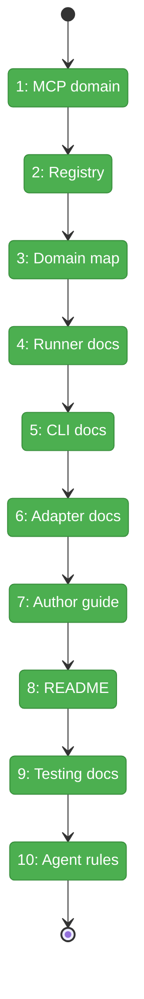
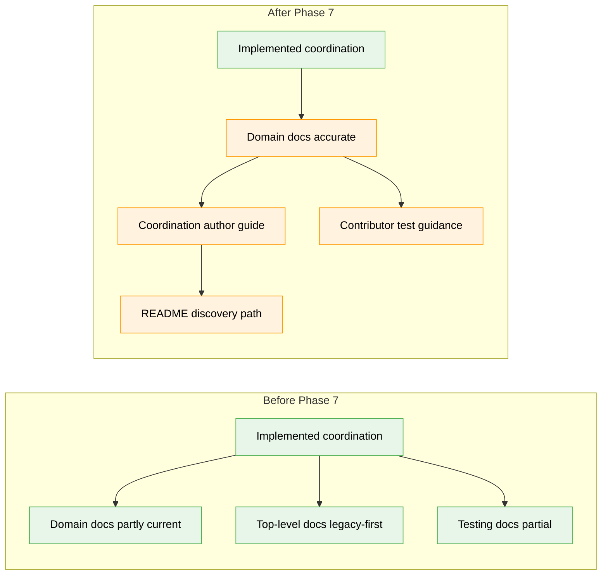

# Flight Plan: Phase 7 — Polish & Docs

**Plan**: [coordination-plan.md](../../coordination-plan.md)
**Phase**: Phase 7: Polish & Docs
**Generated**: 2026-04-27
**Status**: Landed

---

## Departure → Destination

**Where we are**: P0-P6 have landed the outside/inside coordination system: durable inbox/state files, event-driven runs, daemon-light forwarders, an inside-only MCP server, outside CLI commands, coordinated prompts, coordinated scaffolding, doctor checks, snapshots, and a smoke/e2e test shape. The remaining risk is documentation drift: some docs predate the final implementation and top-level guides do not yet teach coordination-aware authoring.

**Where we're going**: The documentation will match the implemented architecture and show developers how to author, run, inspect, and test coordinated agents. A developer can read the README and agent guide, scaffold with `minih init --coordinated`, discover the outside contract with `minih outside-context`, and choose the right tests for coordination changes.

---

## Domain Context

### Domains We're Changing

| Domain | What Changes | Key Files |
|--------|--------------|-----------|
| `docs` | Finalizes domain and user-facing documentation for the landed coordination feature. | `docs/domains/*.md`, `README.md`, `AGENTS_README.md`, `CONTRIBUTING.md`, `AGENTS.md` |

### Domains We Depend On (no changes)

| Domain | What We Consume | Contract |
|--------|-----------------|----------|
| `runner` | Coordination state, prompt assembly, snapshots, feedback contracts. | `buildInsidePreamble`, state/folder helpers, schemas |
| `cli` | Outside commands, coordinated scaffold, doctor checks, dry-run parity. | `outside-*`, `state`, `retros`, `init --coordinated`, `doctor` |
| `mcp` | Inside-only tool surface and spawn model. | `inbox.*`, `state.*`, `buildInsideMcpServerConfig` |
| `adapter` | Event-driven SDK session seam. | `SessionSender`, `onSessionReady`, `session_idle` |

---

## Flight Status

<!-- Updated by /plan-6-v2: pending → active → done. Use blocked for problems/input needed. -->

**Legend**: grey = pending | yellow = active | red = blocked/needs input | green = done

---

## Stages

<!-- Updated by /plan-6-v2 during implementation: [ ] → [~] → [x] -->

- [x] **Stage 1: Audit MCP domain** — make the MCP domain doc match the final inside-only six-tool server and workshop decisions (`docs/domains/mcp/domain.md`).
- [x] **Stage 2: Update registry** — align the domain registry with the final four active domains (`docs/domains/registry.md`).
- [x] **Stage 3: Update domain map** — align graph labels and dependency narrative with final coordination contracts (`docs/domains/domain-map.md`).
- [x] **Stage 4: Audit runner docs** — verify runner composition, contracts, concepts, and history, including atomic-write, ULID, identity block, and peer contract coverage, against P1-P6 deliverables (`docs/domains/runner/domain.md`).
- [x] **Stage 5: Audit CLI docs** — verify outside command, scaffold, doctor, and dry-run docs against P5-P6 deliverables (`docs/domains/cli/domain.md`).
- [x] **Stage 6: Audit adapter docs** — verify event-driven adapter and session sender docs without assigning runner/MCP ownership to adapter (`docs/domains/adapter/domain.md`).
- [x] **Stage 7: Add author guide** — add detailed coordination-aware agent guidance with file layout, optional outside contracts, and outside-context workflow (`AGENTS_README.md`).
- [x] **Stage 8: Update README** — add a concise top-level coordination mention and link to the guide (`README.md`).
- [x] **Stage 9: Update testing docs** — document coordination-specific test tiers and opt-in gates without implying a supported MCP probe harness (`CONTRIBUTING.md`).
- [x] **Stage 10: Update agent rules** — update repository agent instructions with coordinated layout, outside.md example link, and final import-direction wording (`AGENTS.md`).

---

## Architecture: Before & After

**Legend**: existing (green, unchanged) | changed (orange, modified) | new (blue, created)

---

## Acceptance Criteria

- [x] AC-DOMAIN-MAP — registry, domain-map, and `mcp/domain.md` are present and accurate.
- [x] Domain docs describe final coordination contracts without violating import boundaries, including leak-validation provenance for the MCP server and the full runner docs scope from plan task 7.4.
- [x] Agent authoring docs explain `coordination: enabled`, optional/absent/empty `outside.md`, state schemas, `outside-context`, and the smoke-agent example.
- [x] Contributor docs identify the correct default and opt-in coordination test commands without implying a supported MCP probe harness.
- [x] Top-level docs expose coordination without duplicating detailed guidance.

---

## Goals & Non-Goals

**Goals**:
- Finalize domain docs for MCP, runner, CLI, adapter, registry, and domain map.
- Add coordination-aware agent authoring guidance.
- Add top-level discovery and contributor testing guidance.
- Keep docs faithful to the implemented P1-P6 behavior.

**Non-Goals**:
- No source-code behavior changes.
- No public MCP server mode.
- No standalone MCP harness implementation.
- No rule engine or server-side orchestration.
- No schema or CLI contract changes.

---

## Checklist

- [x] T001: Audit and finalize the MCP domain doc (CS-1)
- [x] T002: Update the domain registry row text (CS-1)
- [x] T003: Update the domain map labels and narrative (CS-1)
- [x] T004: Audit and finalize runner domain documentation, including atomic-write, ULID, identity block, and peer contract coverage (CS-2)
- [x] T005: Audit and finalize CLI domain documentation (CS-2)
- [x] T006: Audit and finalize adapter domain documentation (CS-1)
- [x] T007: Add coordination-aware agents to the authoring guide, including optional outside-contract behavior (CS-2)
- [x] T008: Add a concise README mention and guide link (CS-1)
- [x] T009: Update contributor testing guidance without implying a supported MCP probe harness (CS-2)
- [x] T010: Update repository agent instructions with an outside.md scaffold/example link (CS-1)

---

## PlanPak

Not active for this plan.
