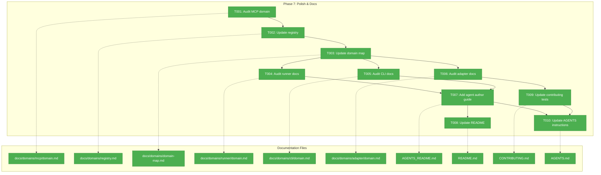
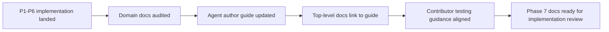
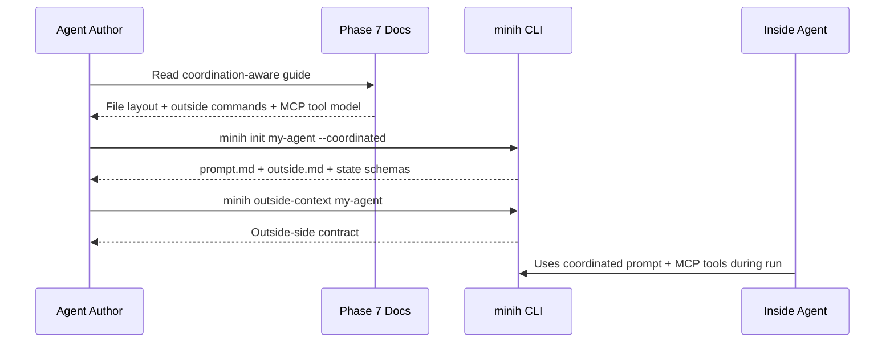

# Phase 7 - Polish & Docs

**Plan**: [coordination-plan.md](../../coordination-plan.md)
**Phase**: Phase 7: Polish & Docs
**Generated**: 2026-04-27
**Status**: Landed
**Mode**: Full
**Complexity**: CS-2

---

## Executive Briefing

**Purpose**: Phase 7 turns the completed outside/inside coordination implementation into a discoverable, accurate, and followable documentation surface. Phases 0-6 landed the coordination substrate, inside MCP server, outside CLI, prompt integration, coordinated scaffolding, snapshots, and smoke/e2e coverage; this phase aligns the domain docs and public docs with the final implemented shape.

**What We're Building**: A documentation polish pass across domain docs and user-facing guides. The phase audits the already-created MCP, runner, CLI, and adapter domain docs; updates top-level guidance for coordinated agents; explains the two-sided file layout and outside-context flow; and records the coordination testing approach in contributor docs.

**Goals**:
- ✅ Make domain documentation accurately reflect the final `cli -> {mcp, runner, adapter}`, `mcp -> runner`, `runner -> adapter` architecture.
- ✅ Ensure `mcp` is clearly documented as an inside-only per-run server, not a public `minih serve --mcp` surface.
- ✅ Add user-facing guidance for coordination-aware agents, including `coordination: enabled`, `outside.md`, per-agent state schemas, and `minih outside-context`.
- ✅ Document the coordination test tiers and opt-in e2e/leak checks.
- ✅ Keep docs aligned with `init --coordinated`, `doctor`, dry-run prompt parity, and the four-file smoke agent.

**Non-Goals**:
- ❌ No source-code behavior changes; Phase 7 is documentation-only unless validation exposes a docs-coupled correction.
- ❌ No new MCP tools or outside-side MCP server.
- ❌ No standalone MCP harness implementation; workshop 009 remains the follow-up design for boot/probe tooling.
- ❌ No state rule engine or peer-gated orchestration.
- ❌ No changes to shipped schemas, prompt assembly, CLI command semantics, or adapter lifecycle.

---

## Prior Phase Context

### Phase 0: Pre-Work Scratch Tests + Decision Gate

#### A. Deliverables

- `/Users/jordanknight/substrate/minih/scratch/runagent-eventdriven/test.mjs` and README validated `session.send(...)` plus idle subscription as the coordinated run shape.
- `/Users/jordanknight/substrate/minih/scratch/fswatch-test/test.mjs` and README captured native `node:fs.watch` behavior, including coalesced events and atomic rename hints.
- `/Users/jordanknight/substrate/minih/scratch/daemon-light-prototype/test.mjs` and README proved durable writes can be forwarded into a live session.
- `/Users/jordanknight/substrate/minih/scratch/multi-process-watch/test.mjs` and README validated concurrent NDJSON appends plus torn-line retry semantics.
- `/Users/jordanknight/substrate/minih/docs/plans/007-backgrounding/prework-results.md` recorded the decision-gate artifact.

#### B. Dependencies Exported

- Event-driven agent execution shape: `session.send(...)` plus idle subscription, not `sendAndWait`.
- Watcher principle: native file events are hints; durable inbox/state files are the source of truth.
- Forwarder principle: drain from byte offsets, split on `\n`, and never advance a watermark past malformed or incomplete input.

#### C. Gotchas & Debt

- Some scratch tests required `GH_TOKEN` and were user-runnable evidence rather than automated CI.
- `fs.watch` event counts are not one-to-one with writes; docs must avoid implying event-level reliability.
- Persistent malformed NDJSON can intentionally block progress until fixed.

#### D. Incomplete Items

- No blockers carried into Phase 7. Scratch scripts remain reference evidence, not production APIs.

#### E. Patterns to Follow

- Document durable outcomes rather than transient event counts.
- Keep scratch evidence separate from supported user-facing contracts.
- Preserve the daemon-light framing: minih enables coordination through files and session sends, not a central orchestrator.

### Phase 1: Runner Foundations

#### A. Deliverables

- `/Users/jordanknight/substrate/minih/src/schemas/inbox-message.json`
- `/Users/jordanknight/substrate/minih/src/schemas/outside-state.json`
- `/Users/jordanknight/substrate/minih/src/schemas/inside-state.json`
- `/Users/jordanknight/substrate/minih/src/schemas/state-history-entry.json`
- `/Users/jordanknight/substrate/minih/src/runner/state.ts`
- `/Users/jordanknight/substrate/minih/src/runner/context.ts`
- `/Users/jordanknight/substrate/minih/src/runner/atomic-write.ts`
- `/Users/jordanknight/substrate/minih/src/runner/ulid.ts`
- Updates to `/Users/jordanknight/substrate/minih/src/runner/folder.ts`, `/Users/jordanknight/substrate/minih/src/runner/types.ts`, `/Users/jordanknight/substrate/minih/src/runner/index.ts`, and `/Users/jordanknight/substrate/minih/src/runner/runner.ts`.

#### B. Dependencies Exported

- `ulid()`, `writeFileAtomic(...)`, `writeFileAtomicAsync(...)`, `detectContext()`, `getCoordinationEnv()`, `readStateLazy(...)`, `writeState(...)`, `appendHistory(...)`.
- Folder helpers: `inboxLanePath`, `stateFilePath`, `historyPath`, `watermarkPath`, `outsideMdPath`, `hasOutsideMd`.
- Coordination types: `CoordinationFrontmatter`, `InboxMessage`, `InsideState`, `OutsideState`, `Side`, `SideState`, `StateHistoryEntry`.

#### C. Gotchas & Debt

- `ajv-formats` was added to enforce `format: date-time`.
- `parseCoordinationField` and `readStateLazy` both needed hardening after initial implementation.
- The baseline capture script initially produced bogus evidence and was rewritten.

#### D. Incomplete Items

- No Phase 1 blockers remain. Coordination feedback schema widening was intentionally deferred until Phase 6 and is now landed.

#### E. Patterns to Follow

- Keep state as data; no rule engine.
- Keep types and schemas aligned.
- Reuse runner folder/state helpers instead of duplicating path or JSON handling in docs examples.

### Phase 2: runAgent Event-Driven Refactor + Preamble Builder

#### A. Deliverables

- `/Users/jordanknight/substrate/minih/src/runner/preamble-builder.ts`
- `/Users/jordanknight/substrate/minih/src/adapter/interface.ts`
- `/Users/jordanknight/substrate/minih/src/adapter/events.ts`
- `/Users/jordanknight/substrate/minih/src/adapter/copilot-types.ts`
- `/Users/jordanknight/substrate/minih/src/adapter/sdk-copilot.ts`
- `/Users/jordanknight/substrate/minih/src/adapter/fake.ts`
- Updates to `/Users/jordanknight/substrate/minih/src/runner/runner.ts`, `/Users/jordanknight/substrate/minih/src/runner/index.ts`, and `/Users/jordanknight/substrate/minih/src/adapter/index.ts`.

#### B. Dependencies Exported

- `SessionSender = { send: (prompt: string) => Promise<string> }`.
- `AgentRunOptions.onSessionReady?: (sender: SessionSender) => void`.
- `buildInsidePreamble(input: PreambleAssemblyInput): string`.
- `awaitTerminalCondition(adapterResult, pendingForwarderCount: () => number)` in runner internals.
- Fake adapter event-driven test seams.

#### C. Gotchas & Debt

- `pending_messages.modified` remains lifecycle noise and is not translated.
- A pre-existing `compact()` timeout unit mismatch remains out of scope because `run()` no longer uses that path.
- `buildInsidePreamble()` is for fresh runs, not resume turns.

#### D. Incomplete Items

- No functional blockers remain. Full docs restructure was explicitly deferred to Phase 7.

#### E. Patterns to Follow

- Document `session.send(...)` + `session_idle` as the run path.
- Keep runner adapter-agnostic and SDK-free.
- Keep prompt assembly centralized in `buildInsidePreamble()`.

### Phase 3: File Watcher + Daemon-Light Forwarders

#### A. Deliverables

- `/Users/jordanknight/substrate/minih/src/runner/file-watcher.ts`
- `/Users/jordanknight/substrate/minih/src/runner/forwarder-watermark.ts`
- `/Users/jordanknight/substrate/minih/src/runner/inbox-forwarder.ts`
- `/Users/jordanknight/substrate/minih/src/runner/state-forwarder.ts`
- `/Users/jordanknight/substrate/minih/src/runner/run-lock.ts`
- Runner lifecycle updates and e2e daemon-light coverage under `/Users/jordanknight/substrate/minih/test/e2e/daemon-light.test.ts`.

#### B. Dependencies Exported

- Public runner export: `RunLockHeldError` and `RUN_LOCK_HELD`.
- Internal forwarder contracts: parent-dir watching, durable watermarks, inbox drain, state fingerprinting, and live `SessionSender.send(...)`.
- Behavior contract: drain backlog first, subscribe, then do a post-subscribe drain to close the race.

#### C. Gotchas & Debt

- Watch file parent directories, not fragile file handles.
- Torn final NDJSON lines should wait for retry; malformed complete lines stop progress without advancing the watermark.
- Permanent garbage-line recovery remains future hardening.

#### D. Incomplete Items

- No blockers remain. Forwarder modules remain intentionally internal.

#### E. Patterns to Follow

- Document durable forwarder semantics without overselling event delivery.
- Preserve append-only inbox/history and atomic state writes.
- Use `finally` cleanup patterns for watchers, forwarders, and locks.

### Phase 4: MCP Domain

#### A. Deliverables

- `/Users/jordanknight/substrate/minih/src/mcp/types.ts`
- `/Users/jordanknight/substrate/minih/src/mcp/context.ts`
- `/Users/jordanknight/substrate/minih/src/mcp/tools/inbox.ts`
- `/Users/jordanknight/substrate/minih/src/mcp/tools/state.ts`
- `/Users/jordanknight/substrate/minih/src/mcp/server.ts`
- `/Users/jordanknight/substrate/minih/src/mcp/spawn.ts`
- `/Users/jordanknight/substrate/minih/src/mcp/index.ts`
- MCP tests under `/Users/jordanknight/substrate/minih/test/mcp/`.
- Domain docs updates under `/Users/jordanknight/substrate/minih/docs/domains/mcp/domain.md`, registry, map, and contributor notes.

#### B. Dependencies Exported

- `buildInsideMcpServerConfig(...)`.
- `resolveInsideMcpServerEntry(...)`.
- `MINIH_COORDINATION_SERVER_NAME`.
- Tool surface: `inbox.list`, `inbox.send`, `inbox.ack`, `state.get`, `state.set`, `state.transition`.
- Hidden baked context contract reusing runner coordination env vars plus MCP metadata.

#### C. Gotchas & Debt

- The MCP server is inside-only and per-run; no public `minih serve --mcp`.
- Tool params are untrusted JSON-RPC records and must be parsed defensively.
- Leak regression is opt-in and must use PID-targeted signaling.
- `.mcp.json` auto-discovery can leak repo-local config if tests do not pin cwd.

#### D. Incomplete Items

- No Phase 4 blockers remain. Outside CLI commands, final prompt copy, daemon supervisor support, and state rule engines were explicitly out of scope.

#### E. Patterns to Follow

- Keep `mcp -> runner`; never import CLI or adapter into MCP.
- Keep baked context hidden from model-visible outputs.
- Describe `dist/mcp/server.js` as a private implementation artifact, not a user contract.

### Phase 5: Outside CLI Surface

#### A. Deliverables

- `/Users/jordanknight/substrate/minih/src/cli/preaction-context.ts`
- `/Users/jordanknight/substrate/minih/src/cli/coordination.ts`
- `/Users/jordanknight/substrate/minih/src/cli/commands/outside-send.ts`
- `/Users/jordanknight/substrate/minih/src/cli/commands/outside-inbox-list.ts`
- `/Users/jordanknight/substrate/minih/src/cli/commands/state.ts`
- `/Users/jordanknight/substrate/minih/src/cli/commands/outside-context.ts`
- `/Users/jordanknight/substrate/minih/src/cli/commands/outside-retro.ts`
- `/Users/jordanknight/substrate/minih/src/cli/commands/retros.ts`
- CLI registration and tests across `/Users/jordanknight/substrate/minih/test/cli/`.

#### B. Dependencies Exported

- `detectContext()`-backed preAction guard for inside-unsafe commands.
- Outside coordination commands for inbox, state, context, retro, and retro aggregation.
- CLI coordination helpers for agent resolution, schema validation, and inbox lane appends.

#### C. Gotchas & Debt

- Strict inside detection is `MINIH === '1'`; other truthy-looking values remain outside.
- `outside-context` must keep JSON envelope on stdout and human markdown on stderr.
- Malformed/torn inbox/state/history data must surface explicitly, not be silently recovered.

#### D. Incomplete Items

- No blockers remain after code-review follow-up fixed data-only outside-state history recording.

#### E. Patterns to Follow

- Keep outside coordination as CLI-only durable-file writes.
- Preserve stdout machine-readable / stderr human-readable split.
- Reuse runner path/state helpers rather than duplicating them in docs examples.

### Phase 6: Agent Integration & Prompting

#### A. Deliverables

- `/Users/jordanknight/substrate/minih/src/runner/preamble-builder.ts` real coordinated prompt sections.
- `/Users/jordanknight/substrate/minih/src/runner/runner.ts` coordination env vars, snapshots, and dry-run parity support.
- `/Users/jordanknight/substrate/minih/src/runner/types.ts`, `/Users/jordanknight/substrate/minih/src/schemas/system-output.json`, and `/Users/jordanknight/substrate/minih/src/schemas/retrospective.json` coordination feedback contracts.
- `/Users/jordanknight/substrate/minih/src/cli/commands/init.ts` coordinated scaffolding.
- `/Users/jordanknight/substrate/minih/src/cli/commands/doctor.ts` outside contract checks.
- `/Users/jordanknight/substrate/minih/agents/coordination-smoke-test/{prompt.md,outside.md,instructions.md,output-schema.json}`.
- `/Users/jordanknight/substrate/minih/test/e2e/two-agent-coordination.test.ts`.
- `/Users/jordanknight/substrate/minih/src/templates/shared-preamble.md` canonical scaffold template.

#### B. Dependencies Exported

- Coordinated prompt sections via `buildInsidePreamble(...)`.
- `MagicWandTarget` includes `"coordination"` and optional `retrospective.coordination`.
- Runtime coordination env vars are set for inside runs and cleaned up after.
- `init --coordinated` writes `prompt.md`, `outside.md`, `inside-state.schema.json`, and `outside-state.schema.json`.
- `doctor` warns or fails on stale/oversized outside contracts.

#### C. Gotchas & Debt

- Runtime system validation intentionally stays permissive for future `magicWandTarget` values while bundled schemas are stricter.
- `doctor` success and failure envelopes place agent details under different branches.
- Snapshot finalization must fail on corrupt present state.
- Code-review follow-ups fixed scaffold preamble drift, dry-run prompt parity, and overclaimed smoke-agent evidence.

#### D. Incomplete Items

- No blockers remain. Phase 7 owns broader documentation polish across `README.md`, `AGENTS.md`, `AGENTS_README.md`, and `CONTRIBUTING.md`.

#### E. Patterns to Follow

- Keep coordinated prompt logic centralized in `preamble-builder.ts`.
- Preserve non-coordinated behavior and wording where docs describe defaults.
- Use the four-file `coordination-smoke-test` as the canonical dogfood shape.

---

## Pre-Implementation Check

| File | Exists? | Domain Check | Notes |
|------|---------|--------------|-------|
| `/Users/jordanknight/substrate/minih/docs/domains/mcp/domain.md` | Yes | docs for `mcp` domain | Already exists from P4; Phase 7 should audit for final P6/P5 accuracy, not recreate blindly. |
| `/Users/jordanknight/substrate/minih/docs/domains/registry.md` | Yes | docs cross-domain | Registry already has four domains; verify wording matches final purposes. |
| `/Users/jordanknight/substrate/minih/docs/domains/domain-map.md` | Yes | docs cross-domain | Current map includes `cli -> mcp` and `mcp -> runner`; verify labels include final P5/P6 contracts. |
| `/Users/jordanknight/substrate/minih/docs/domains/runner/domain.md` | Yes | docs for `runner` domain | Rich P1-P6 content exists; audit for stale “P2/P6” wording and complete concepts. |
| `/Users/jordanknight/substrate/minih/docs/domains/cli/domain.md` | Yes | docs for `cli` domain | P5/P6 content exists; audit outside commands, coordinated scaffold, doctor, dry-run parity. |
| `/Users/jordanknight/substrate/minih/docs/domains/adapter/domain.md` | Yes | docs for `adapter` domain | Event-driven shift documented; audit against P2 final seams and no MCP ownership claims. |
| `/Users/jordanknight/substrate/minih/AGENTS_README.md` | Yes | docs/user guide | Has agent guidance but lacks a full coordination-aware agents section. |
| `/Users/jordanknight/substrate/minih/README.md` | Yes | docs/top-level | Mentions MCP config but not the new coordination capability. |
| `/Users/jordanknight/substrate/minih/CONTRIBUTING.md` | Yes | docs/contributor guide | Mentions daemon-light and MCP leak gates; needs final two-agent coordination plus MCP server/spawn/leak test guidance. No repo-supported MCP probe harness exists yet. |
| `/Users/jordanknight/substrate/minih/AGENTS.md` | Yes | docs/developer instructions | Agent structure still lists only legacy optional files; needs coordinated layout and import direction update. |

**Concept check**: Domain Concepts already document the reusable concepts Phase 7 should cite: runner prompt assembly/outside contract/run snapshots/coordination feedback, CLI outside commander/coordinated scaffold/outside contract health/dry-run parity, and MCP inside-only server/baked context/tool surface. Reuse those docs as canonical sources; do not introduce a parallel concept taxonomy.

**Harness health check**: No `docs/project-rules/harness.md` exists. Implementation will use the standard plan harness plus concrete coordination checks. `minih doctor` validates agent folders, not domain docs; use it for the smoke agent only. Workshop 009 remains the design source for a future MCP harness, not a Phase 7 implementation target.

---

## Architecture Map



## Tasks

| Status | ID | Task | Domain | Path(s) | Done When | Notes |
|--------|-----|------|--------|---------|-----------|-------|
| [x] | T001 | Audit and finalize the MCP domain doc so it accurately describes the six-tool inside-only server, baked context, spawn config, tests, dependencies, and no-public-server boundary. | docs | `/Users/jordanknight/substrate/minih/docs/domains/mcp/domain.md` | The doc lists all six tools as concepts/contracts, references workshops 003/004 plus Finding 02/leak-validation provenance accurately, may point to workshop 009 as future harness design, and no stale “future Phase 5” wording remains. | CS-1; maps plan task 7.1; AC-DOMAIN-MAP. |
| [x] | T002 | Update the domain registry row text for the final four-domain architecture. | docs | `/Users/jordanknight/substrate/minih/docs/domains/registry.md` | Registry has exactly the active domains `adapter`, `runner`, `mcp`, and `cli`, with final-purpose wording matching landed P1-P6 behavior. | CS-1; maps plan task 7.2. |
| [x] | T003 | Update the domain map so graph labels and narrative reflect the final dependency directions and coordination contracts. | docs | `/Users/jordanknight/substrate/minih/docs/domains/domain-map.md` | Map shows `cli -> {mcp, runner, adapter}`, `mcp -> runner`, `runner -> adapter`; labels mention outside commands, inside MCP spawn, runner coordination helpers, and adapter events without upward imports. | CS-1; maps plan task 7.3; AC-DOMAIN-MAP. |
| [x] | T004 | Audit and finalize runner domain documentation for state/context/folder helpers, atomic-write, ULID, file watchers, forwarders, prompt builder, identity block, peer contract, snapshots, canonical preamble template, and coordination feedback. | docs | `/Users/jordanknight/substrate/minih/docs/domains/runner/domain.md` | Runner doc matches P1-P6 source and tests, explicitly covers contracts for state/context/file-watcher/preamble-builder/atomic-write/ulid/forwarders plus concepts for inbox/state/identity block/peer contract, and does not claim a rule engine or public MCP ownership. | CS-2; maps plan task 7.4. |
| [x] | T005 | Audit and finalize CLI domain documentation for outside commands, context blocking, coordinated scaffold, doctor outside checks, dry-run prompt parity, and composition-root MCP wiring. | docs | `/Users/jordanknight/substrate/minih/docs/domains/cli/domain.md` | CLI doc lists the final command surface and concepts, keeps stdout/stderr conventions clear, and avoids implying MCP tools are invoked directly through outside CLI. | CS-2; maps plan task 7.5. |
| [x] | T006 | Audit and finalize adapter domain documentation for event-driven `run()`, `SessionSender`, `onSessionReady`, fake adapter seams, and SDK boundary ownership. | docs | `/Users/jordanknight/substrate/minih/docs/domains/adapter/domain.md` | Adapter doc reflects the event-driven shift and explicitly keeps prompt assembly, MCP implementation, and runner coordination outside the adapter domain. | CS-1; maps plan task 7.6. |
| [x] | T007 | Add a “Coordination-aware agents” section to the detailed agent authoring guide. | docs | `/Users/jordanknight/substrate/minih/AGENTS_README.md` | Guide shows the two-sided file layout, `coordination: enabled`, optional/absent/empty `outside.md` behavior, state schemas, `minih outside-context [<slug>]`, outside commands, coordination retros, and references `agents/coordination-smoke-test`. | CS-2; maps plan task 7.7; use workshops 005/008 and smoke agent. |
| [x] | T008 | Add a concise top-level README mention of coordination and link to the detailed agent authoring section. | docs | `/Users/jordanknight/substrate/minih/README.md` | README has a short coordination paragraph and does not overload quick start or duplicate the full guide. | CS-1; maps plan task 7.8. |
| [x] | T009 | Update contributor testing guidance for coordination changes. | docs | `/Users/jordanknight/substrate/minih/CONTRIBUTING.md` | Contributor docs explain which targeted tests to run for outside CLI, MCP server/spawn behavior, daemon-light, two-agent coordination, leak regression, and when to use `MINIH_E2E=1` / `MINIH_PGREP=1`; they do not imply a supported MCP probe harness. | CS-2; maps plan task 7.9; reference workshops 006/007/009. |
| [x] | T010 | Update repository agent instructions with coordinated agent structure and architecture/import-direction wording. | docs | `/Users/jordanknight/substrate/minih/AGENTS.md` | AGENTS.md lists coordinated optional files, `coordination: enabled`, outside/inside split, MCP domain import direction, relevant test commands, and a concrete link to the `outside.md` scaffold/example such as `agents/coordination-smoke-test/outside.md`. | CS-1; maps plan task 7.10. |

---

## Context Brief

### Key findings from plan

- Finding 1: Phase 7 is documentation-only but sits after all implementation phases, so docs must reflect actual P1-P6 code rather than the original future-tense plan.
- Finding 2: The MCP surface is inside-only and per-run. Docs must prevent readers from looking for a public `minih serve --mcp` command.
- Finding 3: Coordination is opt-in through `coordination: enabled`; non-coordinated agents retain the existing prompt shape and default scaffolding.
- Finding 4: Outside callers coordinate through CLI commands and durable files; inside agents coordinate through MCP tools and prompt guidance.
- Finding 5: State remains data plus schema validation/history, not an orchestrated rule machine.
- Finding 6: The canonical dogfood example is `agents/coordination-smoke-test` with four files only.
- Finding 7: Testing guidance should distinguish default fast tests from opt-in coordination/e2e/leak gates.

### Domain dependencies

- `runner`: Prompt assembly (`buildInsidePreamble`) — used to describe coordinated identity/tool/peer/checklist injection.
- `runner`: Coordination state and folder helpers (`readStateLazy`, `writeState`, `appendHistory`, `inboxLanePath`, `stateFilePath`) — used to explain durable inbox/state layout.
- `runner`: Run snapshots — used to explain what a completed coordinated run freezes into its run folder.
- `cli`: Outside commander surface (`outside-send`, `outside-inbox-list`, `state`, `outside-context`, `outside-retro`, `retros`) — used to explain outside caller workflows.
- `cli`: Coordinated scaffold (`init --coordinated`) and outside contract health (`doctor`) — used for authoring guidance.
- `mcp`: Inside-only MCP surface (`inbox.*`, `state.*`) — used for inside agent guidance and test documentation.
- `adapter`: Event-driven run seam (`SessionSender`, `onSessionReady`, `session_idle`) — used to explain why daemon-light forwarding works without SDK leakage.

### Domain constraints

- Import direction remains `cli -> {mcp, runner, adapter}`, `mcp -> runner`, `runner -> adapter`.
- Runner docs must not imply runner imports `mcp`.
- MCP docs must not imply public outside commands or a long-lived daemon.
- CLI docs must preserve stdout JSON envelope / stderr human output convention.
- Docs examples should use existing command names and avoid nonexistent flags.
- Top-level docs should be concise; detailed workflows belong in `AGENTS_README.md`.

### Harness context

No `docs/project-rules/harness.md` exists. Agent will use the standard plan harness:

- **Boot**: `npm run build` when CLI output or copied docs/assets need built artifacts.
- **Interact**: `node dist/cli/index.js doctor`, `node dist/cli/index.js run <slug> --dry-run`, and targeted CLI commands as needed.
- **Observe**: stdout JSON envelopes, stderr human output, docs diffs, and test results.
- **Maturity**: L2 per plan; CLI binary plus vitest suite is the harness.
- **Pre-phase validation**: plan-6 should run a lightweight docs baseline (`npm test` or targeted tests) before implementation and final docs/quality checks after edits.

### Reusable from prior phases

- `agents/coordination-smoke-test/` provides the canonical coordinated agent example.
- `test/e2e/two-agent-coordination.test.ts` provides opt-in two-agent coordination coverage.
- `test/e2e/daemon-light.test.ts` provides live forwarder coverage.
- `test/mcp/server.test.ts`, `test/mcp/spawn.test.ts`, and `test/mcp/leak-regression.test.ts` provide MCP server, spawn, and leak-regression references. There is no supported `scripts/mcp-harness.mjs` probe command yet.
- `src/templates/shared-preamble.md` and `agents/_shared/preamble.md` provide canonical agent-facing wording.
- `docs/plans/007-backgrounding/workshops/005-preamble-and-prompting.md`, `008-inside-outside-prompting-and-retro.md`, and `009-mcp-server-harness-standup-and-probing.md` provide documentation source material.

### Phase 7 verification checklist

Run or document these checks during implementation:

- `npm run build --silent` — ensure CLI assets and docs-linked templates are current when CLI examples depend on `dist/`.
- `node dist/cli/index.js doctor` — verify coordinated dogfood agents remain structurally healthy; this does not validate domain docs.
- `node dist/cli/index.js outside-context coordination-smoke-test` — verify the documented outside-context flow still emits the coordinated smoke-test contract.
- `npx vitest run test/cli/outside-context.test.ts test/cli/init-coordinated.test.ts test/cli/doctor-outside-md.test.ts --silent` — verify outside-context, coordinated scaffold, and doctor contract checks used by the docs.
- `MINIH_E2E=1 npx vitest run test/e2e/two-agent-coordination.test.ts --silent` — verify the documented two-agent coordination path when touching coordination authoring/test guidance.
- `MINIH_E2E=1 npx vitest run test/e2e/daemon-light.test.ts --silent` — verify daemon-light forwarding guidance when touching runner coordination lifecycle docs.
- `MINIH_PGREP=1 npx vitest run test/mcp/leak-regression.test.ts --silent` — verify MCP cleanup guidance on systems with `pgrep`.
- Manual docs check: confirm new anchors/links from `README.md`, `AGENTS_README.md`, `CONTRIBUTING.md`, and `AGENTS.md` point to existing files or headings.

### Mermaid flow diagram



### Mermaid sequence diagram



---

## Discoveries & Learnings

_Populated during implementation by plan-6._

| Date | Task | Type | Discovery | Resolution | References |
|------|------|------|-----------|------------|------------|
| 2026-04-27 | T001 | gotcha | MCP domain doc was compact and mostly current, but its boundary still called the outside CLI surface “future Phase 5”. | Replaced stale future-phase wording with the final CLI-owned outside command boundary and clarified the private inside-only server lifecycle. | `/Users/jordanknight/substrate/minih/docs/domains/mcp/domain.md` |
| 2026-04-27 | T002 | insight | Registry already had the correct four active domains; the gap was final-role precision rather than missing rows. | Tightened each purpose around the final contracts: adapter event/session seam, runner coordination helpers/forwarders, MCP private six-tool server, and CLI composition root. | `/Users/jordanknight/substrate/minih/docs/domains/registry.md` |
| 2026-04-27 | T003 | decision | Domain map needed to carry both import direction and user-facing coordination boundaries without suggesting runner imports MCP. | Converted the terse edge list into a mermaid graph plus health summary that states CLI owns MCP composition, runner remains MCP-independent, and outside commands are CLI/runner file operations. | `/Users/jordanknight/substrate/minih/docs/domains/domain-map.md` |
| 2026-04-27 | T004 | insight | Runner docs already captured most P1-P6 mechanics; missing pieces were explicit identity/peer-contract marker behavior, test provenance, and no-rule-engine/no-MCP boundaries. | Added concepts for identity block, peer contract framing, atomic state writes, a validation matrix, and history/boundary updates. | `/Users/jordanknight/substrate/minih/docs/domains/runner/domain.md` |
| 2026-04-27 | T005 | gotcha | CLI outside commands and inside MCP tools can look like one coordination surface if docs do not state the split. | Clarified that outside commands read/write runner files while MCP tools are inside-only, and documented `outside-context` statuses plus scaffold/doctor/dry-run tests. | `/Users/jordanknight/substrate/minih/docs/domains/cli/domain.md` |
| 2026-04-27 | T006 | insight | Adapter docs had the main event-driven seam, but not the failure/cleanup and fake queued-run details implementers need for future runner work. | Added explicit session-error behavior, subscription cleanup, fake queued-run seam, validation tests, and boundary exclusions for runner/MCP ownership. | `/Users/jordanknight/substrate/minih/docs/domains/adapter/domain.md` |
| 2026-04-27 | T007 | decision | The authoring guide needed a full workflow section, not just command references, because `outside.md` absent/empty/present behavior affects the inside prompt. | Added a “Coordination-aware agents” section with two-sided layout, scaffold, frontmatter, outside-context statuses, outside commands, state schemas, coordination retros, and the smoke-test example link. | `/Users/jordanknight/substrate/minih/AGENTS_README.md` |
| 2026-04-27 | T008 | decision | The top-level README should make coordination discoverable without becoming the detailed coordination guide. | Added one concise coordination paragraph linking to the authoring guide and a single `init --coordinated` CLI reference line. | `/Users/jordanknight/substrate/minih/README.md` |
| 2026-04-27 | T009 | gotcha | Contributor docs had opt-in daemon/light and leak commands, but no tiered guidance for outside CLI, MCP server/spawn, runner lifecycle, or two-agent smoke coverage. | Added a coordination test matrix, preserved explicit `MINIH_E2E=1`/`MINIH_PGREP=1` gates, and stated there is no supported MCP probe-harness command. | `/Users/jordanknight/substrate/minih/CONTRIBUTING.md` |
| 2026-04-27 | T010 | decision | Repository agent instructions needed the same architecture and coordination boundaries as the docs, because agents use AGENTS.md as their first source of repo truth. | Updated import direction for the mcp domain, coordinated agent optional files/frontmatter, outside/inside split, targeted coordination tests, and the `coordination-smoke-test/outside.md` example link. | `/Users/jordanknight/substrate/minih/AGENTS.md` |

**Types**: `gotcha` | `research-needed` | `unexpected-behavior` | `workaround` | `decision` | `debt` | `insight`

---

## Directory Layout

```text
docs/plans/007-backgrounding/
  ├── coordination-plan.md
  ├── coordination.fltplan.md
  └── tasks/
      └── phase-7-polish-and-docs/
          ├── tasks.md
          ├── tasks.fltplan.md
          └── execution.log.md   # created by plan-6
```

---

## Validation Record (2026-04-27T08:52:41+10:00)

| Agent | Lenses Covered | Issues | Verdict |
|-------|---------------|--------|---------|
| Source Truth | Factual Accuracy, Technical Constraints, Domain Boundaries, Concept Documentation, Security & Privacy | 1 MEDIUM fixed | ✅ |
| Cross-Reference | Integration & Ripple, System Behavior, Hidden Assumptions, User Experience, Concept Documentation | 1 MEDIUM fixed, 1 MEDIUM rejected as template-conflicting | ✅ |
| Completeness | Edge Cases & Failures, Deployment & Ops, Performance & Scale, Security & Privacy, Hidden Assumptions, User Experience | 1 HIGH fixed, 3 MEDIUM fixed | ✅ |
| Forward-Compatibility | Forward-Compatibility, Integration & Ripple, Technical Constraints, Test Boundary, Domain Boundaries | 0 issues | ✅ |

### Forward-Compatibility Matrix

| Consumer | Requirement | Failure Mode | Verdict | Evidence |
|----------|-------------|--------------|---------|----------|
| `/plan-6-v2-implement-phase` for Phase 7 | Canonical 7-column tasks table, pending statuses, domain/path mapping, Done When, context brief, discoveries table, architecture map, live-updatable `stateDiagram-v2` flight plan | Shape mismatch / encapsulation lockout | ✅ | `tasks.md` has the required sections and 7-column table; `tasks.fltplan.md` has live-update hooks in Flight Status, Stages, and Checklist. |
| Phase 7 docs implementer | Accurate file paths, current source/domain facts, no invented commands/flags, bounded ownership | Contract drift / lifecycle ownership / test boundary failure | ✅ | Absolute target paths and current-state facts are captured in the Pre-Implementation Check, task table, Context Brief, and verification checklist. |
| Plan-level progress artifacts | Clean mapping back to AC-DOMAIN-MAP and plan task IDs 7.1-7.10 | Shape mismatch / ripple ambiguity | ✅ | Tasks T001-T010 map explicitly to plan tasks 7.1-7.10; AC-DOMAIN-MAP remains tied to MCP domain, registry, and domain-map work. |

**Outcome alignment**: Yes — by giving implementers the documentation and live-progress structure needed to teach and maintain the coordination primitives, the artifact advances the outcome quote that “the host [can] signal ‘I just finished milestone 2’ and the agent [can] signal ‘I just finished reviewing milestone 2’ — neither is possible without these primitives.”

**Standalone?**: No — downstream consumers are `/plan-6-v2-implement-phase`, the Phase 7 docs implementer, and plan-level progress artifacts.

**Fixes applied**:
- Added a concrete Phase 7 verification checklist because generic `npm test` / `minih doctor` guidance was not implementation-ready.
- Replaced MCP probing language with MCP server/spawn/leak test guidance and explicitly noted that no supported probe harness exists yet.
- Restored MCP leak-validation provenance and expanded runner docs scope to include `atomic-write`, ULID, identity block, and peer contract.
- Added optional/absent/empty `outside.md` behavior and an explicit `outside.md` scaffold/example link requirement.
- Updated the flight plan acceptance criteria, stages, and checklist to mirror the fixed dossier.

**Rejected validation note**: One cross-reference finding requested heading names that conflict with the active plan-5 / plan-5b templates used for this dossier (`Departure → Destination`, `Architecture: Before & After`, `Goals & Non-Goals`). The headings were preserved to remain compatible with the generating skill.

Overall: VALIDATED WITH FIXES
