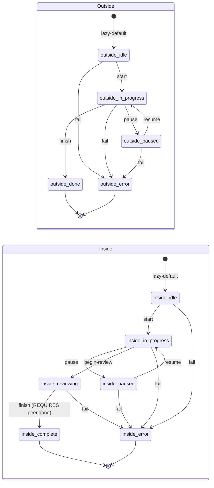

# Workshop: State Machine — Phases, Transitions, History

**Type**: State Machine
**Plan**: 007-backgrounding
**Spec**: [coordination-spec.md](../coordination-spec.md)
**Created**: 2026-04-26
**Status**: Draft (DOWN-SCOPED 2026-04-26 — see "Scope Reduction" note below)

> **⚠️ Scope reduction (2026-04-26, user direction):** "not sure we need to overbake the state machine aspect — agents can figure it out." This workshop is preserved as REFERENCE for the rich state-machine design (with `requiresPeer` gates, default phase enums, frontmatter overrides). For v1 implementation, treat it as **optional / aspirational**: ship `state.get`/`state.set` (free-form `data` object + free-form `phase` string) with NO transition rules and NO peer-state gating in the runner. Agents encode their own conventions in their prompts. Workshop 003's `state.transition` MCP tool degrades to "set the phase field with audit trail" — no rule check, no GATED error.
>
> **What stays**: state files, history.ndjson, schemas (just the *shape*, not the enums), `state.get`/`state.set` API.
> **What moves to follow-up plan**: `state.transition` rule machine, default phase enums, `requiresPeer` gating, frontmatter `coordination.outside.transitions`, the `isAllowedTransition` function.
>
> **Why this is OK**: agents are already trusted to follow output schemas, magic-wand instructions, and the SYSTEM_OUTPUT_INSTRUCTIONS pre-completion checklist (workshop 005). Adding state-machine gates is belt-and-suspenders. If a real coordination scenario surfaces a need for *enforced* gates (e.g., a buggy agent transitions prematurely and breaks something), upgrade then.
>
> **The user's "inside complete only after outside done" invariant**: still expressible — agents include in their prompt: "Do not call `state.set({key: 'phase', value: 'complete'})` until `state.get({side: 'peer', key: 'phase'})` returns `'done'`." Same intent, no rule machinery.
>
> The remainder of this workshop documents the rich design for posterity / future-plan reference.

---

**Related Documents**:
- [external-research/state-machine-jsonschema.md](../external-research/state-machine-jsonschema.md) — five-pattern survey + decision rationale
- [001-filesystem-layout.md](001-filesystem-layout.md) — defines state file shape; this workshop defines its allowed values + transitions
- [003-mcp-tool-surface.md](003-mcp-tool-surface.md) — defines the `state.transition` tool that consumes these rules

**Domain Context**:
- **Primary Domain**: `runner` (owns `state.ts` with rule definitions + `isAllowedTransition` function)
- **Related Domains**: `cli` (calls `isAllowedTransition` from `state transition` command); `mcp` (calls it from the `state.transition` tool)

---

## Purpose

Define the default state machines for outside and inside, the transition rule format, the cross-side gating mechanism (the user's invariant), and the history granularity. This is the **declarative core** of the coordination model — every transition flows through `isAllowedTransition`.

## Key Questions Addressed

- What are the default phase enums for outside and inside?
- What transitions are allowed by default?
- How does cross-side gating work (e.g., inside cannot reach `complete` until outside is `done`)?
- Are phases / transitions per-agent overridable? How?
- What's the history granularity?
- What's the error model when a transition is rejected?

## Resolved Open Questions From Spec

- **State machine — initial set of phases** → **RESOLVED** (this workshop): defaults shipped (`idle | in-progress | paused | done | error` for outside; `idle | in-progress | paused | reviewing | complete | error` for inside). Per-agent override via frontmatter.
- **Outside-side state get/set access control** → **RESOLVED in workshop 1**: outside writes only `outside.json`; inside writes only `inside.json`; both read both. State machine logic enforces the same — `isAllowedTransition(side, ...)` checks rules for `side`, never mutates the peer.

---

## Overview

Two parallel state machines — one per side — coordinated through a peer-state gate. Rules live as a pure-TS literal in `src/runner/state.ts`; the rule format is JSON-serializable so tooling can render diagrams without parsing TypeScript.

The user's invariant is encoded as a single `requiresPeer` clause on one transition rule (inside: `reviewing → complete` requires `peer.phase == "done"`).

## Default State Diagram



(The two machines are independent — there is no shared "global" state. They communicate only through the gate on `inside: reviewing → complete`.)

## Default Phase Enums

### Outside

| Phase | Meaning |
|-------|---------|
| `idle` | Initial / no work in flight |
| `in-progress` | Outside is actively producing work |
| `paused` | Outside has stopped temporarily; will resume |
| `done` | Outside has finished its part. **Gate-open for inside's terminal transition.** |
| `error` | Terminal failure |

### Inside

| Phase | Meaning |
|-------|---------|
| `idle` | Initial / no work in flight |
| `in-progress` | Inside is actively producing work (its own, not just reviewing outside) |
| `paused` | Inside has stopped temporarily; will resume |
| `reviewing` | Inside is reviewing outside's output (or its own); awaiting outside's `done` to finalize |
| `complete` | Inside has finalized its work. **Only reachable from `reviewing` when outside is `done`.** |
| `error` | Terminal failure |

### Why two terminal names (`done` vs `complete`)

- **outside `done`** = "I've finished what I'm doing; you're free to wrap up."
- **inside `complete`** = "the whole task including review is finalized."

Different semantics; different sides; the gate enforces causal order. Naming matters for log readability.

## Default Transition Rules

```ts
// src/runner/state.ts — DEFAULT_TRANSITIONS literal

import type { Side, Phase, TransitionRule } from './types.js';

export const DEFAULT_OUTSIDE_PHASES = ['idle', 'in-progress', 'paused', 'done', 'error'] as const;
export const DEFAULT_INSIDE_PHASES  = ['idle', 'in-progress', 'paused', 'reviewing', 'complete', 'error'] as const;

export const DEFAULT_TRANSITIONS: Record<Side, TransitionRule[]> = {
  outside: [
    { from: 'idle',        to: 'in-progress' },
    { from: 'in-progress', to: 'paused' },
    { from: 'paused',      to: 'in-progress' },
    { from: 'in-progress', to: 'done' },
    { from: 'idle',        to: 'error' },
    { from: 'in-progress', to: 'error' },
    { from: 'paused',      to: 'error' },
  ],
  inside: [
    { from: 'idle',        to: 'in-progress' },
    { from: 'in-progress', to: 'paused' },
    { from: 'paused',      to: 'in-progress' },
    { from: 'in-progress', to: 'reviewing' },
    { from: 'reviewing',   to: 'complete', requiresPeer: { phase: 'done' } },
    { from: 'idle',        to: 'error' },
    { from: 'in-progress', to: 'error' },
    { from: 'paused',      to: 'error' },
    { from: 'reviewing',   to: 'error' },
  ],
} as const;
```

### Transition Table — Outside

| From | To | Trigger | Guard | Action |
|------|-----|---------|-------|--------|
| `idle` | `in-progress` | `state.transition({to:'in-progress'})` | none | append history; update `outside.json` |
| `in-progress` | `paused` | `state.transition({to:'paused'})` | none | as above |
| `paused` | `in-progress` | `state.transition({to:'in-progress'})` | none | as above |
| `in-progress` | `done` | `state.transition({to:'done'})` | none | as above. Opens the gate for inside's terminal transition. |
| `*` | `error` | `state.transition({to:'error', reason})` | none | terminal; recovery requires manual reset |

### Transition Table — Inside

| From | To | Trigger | Guard | Action |
|------|-----|---------|-------|--------|
| `idle` | `in-progress` | `state.transition({to:'in-progress'})` | none | append history; update `inside.json` |
| `in-progress` | `paused` | `state.transition({to:'paused'})` | none | as above |
| `paused` | `in-progress` | `state.transition({to:'in-progress'})` | none | as above |
| `in-progress` | `reviewing` | `state.transition({to:'reviewing'})` | none | as above |
| `reviewing` | `complete` | `state.transition({to:'complete'})` | **`peer.phase == 'done'`** | as above; this is the gated transition |
| `*` | `error` | `state.transition({to:'error', reason})` | none | terminal |

## Cross-Side Gating: `requiresPeer`

A `TransitionRule` may carry a `requiresPeer` clause. It's evaluated when `state.transition` is called:

```ts
export interface TransitionRule {
  from: Phase;
  to: Phase;
  requiresPeer?: {
    phase: Phase | Phase[]; // peer must be in this phase (or one of)
  };
}
```

The gate check is a single read of the peer's `state/<peer-side>.json` (lazy-default to `phase: 'idle'` if missing — workshop 001).

### `isAllowedTransition` — the canonical rule function

```ts
// src/runner/state.ts

export type AllowResult =
  | { ok: true }
  | { ok: false; code: 'INVALID' | 'GATED'; reason: string; details?: Record<string, unknown> };

export function isAllowedTransition(
  side: Side,
  from: Phase,
  to: Phase,
  peerState: { phase: Phase },
  rules: Record<Side, TransitionRule[]> = DEFAULT_TRANSITIONS,
): AllowResult {
  const rule = rules[side].find((r) => r.from === from && r.to === to);

  if (!rule) {
    return {
      ok: false,
      code: 'INVALID',
      reason: `No rule allows ${side} transition from "${from}" to "${to}". Allowed transitions from "${from}": ${
        rules[side].filter((r) => r.from === from).map((r) => r.to).join(', ') || '(none)'
      }`,
      details: { side, from, to },
    };
  }

  if (rule.requiresPeer) {
    const required = Array.isArray(rule.requiresPeer.phase) ? rule.requiresPeer.phase : [rule.requiresPeer.phase];
    if (!required.includes(peerState.phase)) {
      return {
        ok: false,
        code: 'GATED',
        reason: `${side} transition "${from}" → "${to}" is gated on peer being in phase ${
          required.length === 1 ? `"${required[0]}"` : `one of ${JSON.stringify(required)}`
        } — peer is currently in "${peerState.phase}".`,
        details: { side, from, to, requiredPeerPhase: required, actualPeerPhase: peerState.phase },
      };
    }
  }

  return { ok: true };
}
```

**Why split `code: 'INVALID' | 'GATED'`**: lets the MCP tool error and the CLI envelope distinguish "no such transition exists" (probably an agent bug or wrong phase enum) from "transition exists but the peer isn't ready yet" (cooperative scenario, agent should wait or check inbox). Two different remediations.

## History Granularity

**Decision**: append one entry to `state/history.ndjson` per transition. Always.

**What's NOT logged**:
- `state.set` calls that change `data` field but not `phase` (those are not transitions)
- Reads (`state.get`)
- Rejected transitions (those are typed errors back to the caller; not state changes)

**Why every transition (not just milestones)**:
- Transitions are rare (a handful per run, not per second). Volume is small.
- Audit value is high — debugging "why did this fail" benefits from total ordering.
- `peerStateAtTime` lets us reconstruct the gating context retroactively.

**History format** (defined in workshop 001):

```jsonc
{"ts":"2026-04-26T10:21:11.000Z","side":"inside","from":"reviewing","to":"complete","reason":"3 issues filed","peerStateAtTime":{"phase":"done"}}
```

## Per-Agent Override (Frontmatter)

Agents can ship custom phases and rules in `prompt.md` frontmatter:

```yaml
---
description: Custom code-review agent with extra phases
coordination:
  enabled: true
  outside:
    phases: [idle, drafting, awaiting-input, ready-for-review, done, error]
    transitions:
      - { from: idle, to: drafting }
      - { from: drafting, to: awaiting-input }
      - { from: awaiting-input, to: drafting }
      - { from: drafting, to: ready-for-review }
      - { from: ready-for-review, to: done }
      - { from: idle, to: error }
      # ... error from any other state
  inside:
    phases: [idle, listening, analyzing, reporting, complete, error]
    transitions:
      - { from: idle, to: listening }
      - { from: listening, to: analyzing }
      - { from: analyzing, to: reporting }
      - { from: reporting, to: complete, requiresPeer: { phase: done } }
      # ... error from any other state
---

# Prompt body...
```

Resolution at runtime:

```ts
// pseudo-code in runner/state.ts
function getTransitionRulesForAgent(definition: AgentDefinition): Record<Side, TransitionRule[]> {
  const fmRules = definition.frontmatter?.coordination;
  if (!fmRules) return DEFAULT_TRANSITIONS;

  const merged = {
    outside: fmRules.outside?.transitions ?? DEFAULT_TRANSITIONS.outside,
    inside:  fmRules.inside?.transitions  ?? DEFAULT_TRANSITIONS.inside,
  };

  validateRulesAgainstPhases(merged.outside, fmRules.outside?.phases);
  validateRulesAgainstPhases(merged.inside,  fmRules.inside?.phases);

  return merged;
}
```

**Validation rules for custom enums**:
- Every `from` and `to` in transitions must be a member of the corresponding `phases` enum.
- Every side must have at least one transition into a terminal phase (no orphaned states).
- `requiresPeer.phase` values must be members of the *peer side's* `phases` enum.
- These checks run in `minih doctor` and at `state.transition` call time.

## Initial State (Lazy Default)

When `state.transition` is called with no prior state file:

```ts
// pseudo-code
const currentState = loadStateLazy(side, slug, agentsDir); // returns { phase: 'idle' } if no file
const peerState    = loadStateLazy(otherSide(side), slug, agentsDir);
const rule         = isAllowedTransition(side, currentState.phase, requestedTo, peerState, rules);
if (!rule.ok) return { error: ... };

writeStateAtomic(side, slug, agentsDir, { phase: requestedTo, data: currentState.data, updatedAt: now(), updatedBy: side });
appendHistory({ ts: now(), side, from: currentState.phase, to: requestedTo, reason, peerStateAtTime: { phase: peerState.phase } });
```

The first transition is *always* logged with `from: "idle"` even though no prior state file existed. This is by design — the lazy default IS `idle`, and history should reflect that.

## Error Model

When `state.transition` is called with an invalid or gated transition:

### Inside (MCP tool error)

```jsonc
{
  "isError": true,
  "content": [{
    "type": "text",
    "text": "Transition rejected: inside transition \"reviewing\" → \"complete\" is gated on peer being in phase \"done\" — peer is currently in \"in-progress\"."
  }],
  "_meta": {
    "code": "GATED",
    "side": "inside",
    "from": "reviewing",
    "to": "complete",
    "requiredPeerPhase": ["done"],
    "actualPeerPhase": "in-progress"
  }
}
```

(Detailed MCP error envelope shape lives in workshop 003; this is the spirit of it.)

### Outside (CLI envelope)

```jsonc
{
  "command": "state",
  "status": "error",
  "timestamp": "2026-04-26T10:21:11.000Z",
  "error": {
    "code": "E128",
    "message": "Transition rejected: outside transition \"done\" → \"in-progress\" is not allowed by any rule. Allowed transitions from \"done\": (none).",
    "details": {
      "side": "outside",
      "from": "done",
      "to": "in-progress",
      "code": "INVALID"
    }
  }
}
```

(Existing `MinihEnvelope` pattern; `E128` is the next free error code per workshop 003 / spec IC-01.)

## Diagram: A Full Coordination Round-Trip

```
Time  Outside CLI             State files              Inside MCP server
───────────────────────────────────────────────────────────────────────────
T0    minih state set       outside.json: idle        (not yet running)
      --side outside        history: (empty)
      --key phase
      --value in-progress
                            outside.json: in-progress
                            history.ndjson:
                              {ts:T0, side:outside, from:idle, to:in-progress, peerStateAtTime:{phase:idle}}
T1    minih outside-send    inbox/outside/messages.ndjson:
      my-agent --type         {id:01J3, sender:outside, ...phase 2 done...}
      note --subject "..."
T2    minih run my-agent    (inbox/state files unchanged)
                                                       inside MCP spawned;
                                                       state.transition({to:'in-progress'})
                            inside.json: in-progress
                            history: ...inside in-progress
                                                       inbox.list({unread:true})
                                                          → [{...phase 2 done...}]
                                                       state.transition({to:'reviewing'})
                            inside.json: reviewing
                                                       state.transition({to:'complete'})
                                                          → ERROR: GATED, peer is in-progress
                                                       inbox.send({type:'note',
                                                                   subject:'still in progress',
                                                                   body:'awaiting outside done'})
                            inbox/inside/messages.ndjson:
                              {id:01J5, sender:inside, ...still in progress...}
                                                       (run completes; MCP server reaped)
T3    minih state set
      --side outside --key phase --value done
                            outside.json: done
                            history: ...outside done
T4    minih run my-agent    (inbox/state still alive across runs)
                                                       fresh inside MCP spawned
                                                       state.get({side:'peer'})
                                                          → {phase:'done', ...}
                                                       state.transition({to:'complete'})
                                                          → OK
                            inside.json: complete
                            history: ...inside complete with peerStateAtTime:{phase:done}
                                                       inbox.send({type:'ack', subject:'review done', body:'no issues'})
                            inbox/inside/messages.ndjson:
                              {id:01J7, sender:inside, ...review done...}
                                                       (run completes)
```

This is the *canonical* coordination flow the user described:
> "outside agent can be like 'I've just finished phase 2'. The inside agent can be like, 'I've just finished reviewing phase 2'."

The gate makes the order safe; the history reconstructs the conversation; the inbox carries the conversational content; the state files carry the *structural* signal.

---

## Open Questions

### Q1: Should there be a `reset` transition that returns any state to `idle`?

**OPEN**: useful for testing and recovery from `error` terminal. But adds nondeterminism (history might show idle → error → idle → in-progress, masking the failure context).
- Option A: no reset; manual file edit (or new helper `minih state reset`) bypasses the rules and logs a special `reason: '__reset__'` entry.
- Option B: explicit `reset` rule per side, recoverable from any state.
- **Leaning**: A. Reset is rare and should be visibly outside the normal rule set.

### Q2: Should error transitions be one-way or recoverable?

**OPEN** related to Q1: in the default rule set, `error` is terminal (no transitions out). Some agents might want to recover.
- **Leaning**: keep `error` terminal in defaults; per-agent override can add `error → idle` if they want recovery.

### Q3: Does `requiresPeer` need to support negative gates ("peer must NOT be in X")?

**OPEN**: e.g., "inside can pause unless peer is in error." The current schema only supports positive gates (`phase: <one or more allowed>`).
- **Leaning**: defer until a real agent needs it. Simpler is better.

### Q4: Should the rule format support arbitrary peer-state predicates (not just `phase`)?

**OPEN**: e.g., "inside can transition only if peer's `data.filesEdited` is non-empty." Powerful but opens a can of worms (where do predicates live? how do they fail safely?).
- **Leaning**: defer. v1 = phase-only. Phase enums are the coarse coordination primitive; finer logic should be in agent prompts, not the rule machinery.

### Q5: Surface state in `completed.json` and `minih history`?

**OPEN** for follow-up: include final state snapshot + last 5 transitions in `completed.json` so `minih history` can show "agent reached `inside.complete` (gated by outside.done at T-3min)" without scanning history.ndjson.
- **Leaning**: yes, but in plan 008+ — out of scope here.
