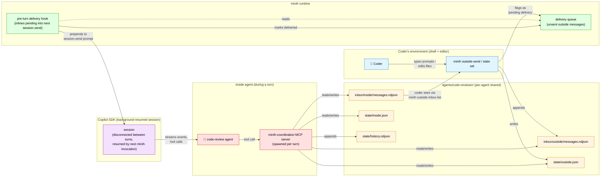

# Workshop: User Journey — Coder ↔ Background Code-Review Agent

**Type**: Other (User Journey + Integration Pattern)
**Plan**: 007-backgrounding
**Spec**: [coordination-spec.md](../coordination-spec.md)
**Created**: 2026-04-26
**Status**: Draft

**Related Documents**:
- [001-filesystem-layout.md](001-filesystem-layout.md) — files referenced throughout the journey
- [002-state-machine.md](002-state-machine.md) — DOWN-SCOPED per user direction; this workshop assumes free-form `phase` strings, no rule machine
- [003-mcp-tool-surface.md](003-mcp-tool-surface.md) — the tool calls the agents make
- [004-spawn-config-injection.md](004-spawn-config-injection.md) — how the inside MCP gets its baked context
- [005-preamble-and-prompting.md](005-preamble-and-prompting.md) — what the agent reads about coordination

**Domain Context**:
- This workshop spans the entire pipeline: cli (outside CLI commands), runner (queue management, delivery hook), mcp (inside surface), adapter (SDK send/sendAndWait/resumeSession). Nothing new owned here — but a new architectural concept emerges: the **outbound delivery queue + turn-boundary injection** mechanism.

---

## Purpose

Make the abstract spec concrete by walking through the **canonical journey**: a coder editing code while a background code-review agent reviews their work in near-real-time. This workshop pins the "feel" of the system — what the coder types, what the inside agent sees, when messages get delivered, and how the queue-and-fire mechanism works. **Use this as the reference for prompt-tuning, UX decisions, and demos.**

## Key Questions Addressed

- What does using this *feel like* end-to-end?
- How does an outside note actually get into the inside agent's prompt context — does the agent have to poll `inbox.list`, or does minih *push* the note in at the next turn?
- When outside calls `outside-send` while the inside session is alive vs not alive, what happens?
- What's "next turn" mean precisely?
- Can we inject mid-turn (while the inside agent is still processing a prior message)?
- Where's the v1 boundary vs the v2 (daemon) boundary?

---

## Cast

| Actor | Role | Surface |
|-------|------|---------|
| **Coder** | Human (or Claude Code, Cursor, IDE-embedded LLM) editing code | Shell + their editor |
| **Outside agent** | The thing the coder is using (Claude Code session, IDE plugin, even just bash) — NOT necessarily an LLM, just whoever invokes minih outside commands | `minih outside-send`, `minih state set --side outside` |
| **Inside agent** (the code-review agent) | Background-running minih agent reviewing diffs as the coder works | MCP tools (`inbox.list`, `inbox.send`, `state.set`, `state.get`) |
| **minih runtime** | The harness orchestrating both sides | Filesystem, MCP server, SDK session, queue |
| **Copilot SDK** | The session host | Standard `createSession`/`resumeSession`/`send`/`sendAndWait` |

---

## The Big Picture (mermaid)



**Read the diagram top-to-bottom**: the coder writes notes outside; minih queues them; on the next session turn, the queue is flushed into the agent's context; the agent acts and writes back; the coder sees responses via the outside CLI. Per-agent shared state is the integration medium.

---

## Happy-Path Sequence Diagram

A canonical "coder finishes phase 2; agent reviews phase 2" round-trip:

```mermaid
sequenceDiagram
    autonumber
    actor Coder
    participant CLI as minih (outside CLI)
    participant FS as filesystem<br/>(agents/code-reviewer/)
    participant Q as delivery queue
    participant SDK as Copilot SDK
    participant MCP as inside MCP server
    participant Agent as code-review agent

    Note over Coder,Agent: T0 — coder kicks off the long-running review
    Coder->>CLI: minih run code-reviewer<br/>(initial start)
    CLI->>SDK: createSession(workingDirectory=runDir, mcpServers=...minih-coordination...)
    SDK->>MCP: spawn child (env: MINIH_MCP_*)
    SDK->>Agent: deliver assembled prompt
    Agent->>MCP: state.set({key:'data.startedAt', value:'...'})
    Agent->>MCP: state.set({key:'phase', value:'idle'})<br/>(no rule check; free-form)
    Agent->>SDK: assistant message: "ready, awaiting work"
    SDK-->>CLI: session.idle (sendAndWait returns)
    CLI->>SDK: session.disconnect() (preserves)
    CLI-->>Coder: ✓ run complete; sessionId stored in completed.json

    Note over Coder,Agent: T1 — coder edits files; says "phase 2 done"
    Coder->>CLI: minih outside-send code-reviewer<br/>--type note --subject "phase 2 done"<br/>--body "src/auth.ts ready for review"
    CLI->>FS: append message to inbox/outside/messages.ndjson<br/>{id:01J3..., sender:outside, type:note, ...}
    CLI->>Q: enqueue {msgId:01J3..., status:pending-delivery}
    CLI->>FS: state.set outside.json {phase:'awaiting-review'}
    CLI-->>Coder: ✓ envelope: {messageId:01J3..., status:ok}

    Note over Coder,Agent: T2 — coder asks the agent to wake up and review
    Coder->>CLI: minih resume code-reviewer<br/>(no explicit message; just wake the agent)
    CLI->>FS: read pending queue → finds 01J3 still pending
    CLI->>SDK: resumeSession(sessionId)
    SDK->>MCP: spawn fresh inside MCP child
    Note over CLI: PRE-TURN DELIVERY HOOK fires
    CLI->>SDK: session.send({prompt:<br/>"📨 New from outside (1 message):<br/>[01J3 | note | 'phase 2 done'] src/auth.ts ready for review<br/><br/>(continue with your work — these are the new messages since your last turn)"})
    CLI->>Q: mark 01J3 as delivered
    CLI->>FS: append delivery record to inbox/outside/.delivered.ndjson<br/>{msgId:01J3, deliveredAt:..., turnId:...}

    Agent->>MCP: state.set({key:'phase', value:'reviewing'})
    Agent->>MCP: (reads file via SDK fs tool) src/auth.ts
    Agent->>Agent: ... reviews ...
    Agent->>MCP: inbox.send({type:'ack', subject:'review of phase 2 done',<br/>body:'2 issues found, see report', ackOf:'01J3...'})
    MCP->>FS: append to inbox/inside/messages.ndjson<br/>{id:01J5..., sender:inside, ackOf:01J3..., ...}
    Agent->>MCP: state.set({key:'phase', value:'awaiting-next'})
    Agent->>SDK: assistant message: "review done"
    SDK-->>CLI: session.idle

    Note over Coder,Agent: T3 — coder fetches the response
    Coder->>CLI: minih outside-inbox-list code-reviewer
    CLI->>FS: read inbox/inside/messages.ndjson
    CLI-->>Coder: envelope with [01J5: ack 'review of phase 2 done', body:'2 issues found...']
```

The key step is **#15-#16**: the pre-turn delivery hook reads the pending queue and **inlines the messages into the next `session.send` prompt**, then marks them delivered. The agent doesn't have to call `inbox.list` — the messages arrive in its context as part of the next message.

---

## The Queue-and-Deliver Mechanism (the new architectural piece)

This is the load-bearing piece the user described:

> "Setting a note or setting a state will just fire a message into the into the SDK on the next loop. so they're sort of they need to queue up a bit and then get fired in and then we need to check them off that they've been sent into the inside mini harness."

### State machine of an outside message

```mermaid
stateDiagram-v2
    [*] --> InboxFile: outside-send appends to NDJSON
    InboxFile --> Queued: outside-send enqueues for delivery
    Queued --> Delivered: pre-turn hook inlines into session.send
    Delivered --> AckedByAgent: agent calls inbox.ack
    Queued --> ExpiredOrPurged: (out of scope v1; defer)
    Delivered --> [*]: terminal
    AckedByAgent --> [*]: terminal
```



A message has two terminal states:
- **Delivered** — was injected into a turn's prompt; the agent definitely *saw* it (assuming agent read the prompt).
- **AckedByAgent** — the agent explicitly called `inbox.ack`. Stronger guarantee.

The coder can observe both states via `minih outside-inbox-list <slug>` (the envelope includes a `delivered: true|false` field per message).

### Files supporting the queue

```
agents/<slug>/inbox/outside/
├── messages.ndjson         # the actual messages (append-only)
└── .delivered.ndjson       # NEW: append-only delivery records
                            # {msgId, deliveredAt, turnId, runId}
```

A message is "pending delivery" if its `id` does not appear as `msgId` in `.delivered.ndjson`. Reconstructed on demand from the two files. No separate index file needed.

(Why not a separate `pending.ndjson`? Single source of truth — messages.ndjson is the canonical list; delivery is a separate fact appended in its own file. Simpler than maintaining a third "current pending" file that has to stay in sync.)

### The pre-turn delivery hook

```ts
// pseudo-code in src/runner/runner.ts (resume flow) and CLI:
async function preTurnDeliveryHook(slug: string, agentsDir: string, runId: string): Promise<string | null> {
  const allMessages = readInboxLane('outside', slug, agentsDir);
  const delivered = readDeliveryRecords(slug, agentsDir);
  const pending = allMessages.filter((m) => !delivered.has(m.id));

  if (pending.length === 0) return null;

  const turnId = generateUlid();

  // Build the inline preamble for the next session.send
  const inlined = renderPendingForPrompt(pending);

  // Mark delivered
  for (const msg of pending) {
    appendDeliveryRecord(slug, agentsDir, { msgId: msg.id, deliveredAt: now(), turnId, runId });
  }

  return inlined;
}

function renderPendingForPrompt(pending: InboxMessage[]): string {
  const header = `📨 New from outside (${pending.length} message${pending.length === 1 ? '' : 's'}):`;
  const lines = pending.map((m) =>
    `[${m.id} | ${m.type} | "${m.subject}"]\n${m.body}`
  );
  return `${header}\n\n${lines.join('\n\n---\n\n')}\n\n(These are the new messages since your last turn. Continue with your work; address them as needed.)`;
}
```

### Where the hook fires

**In v1 (this plan)**: the hook fires in `minih resume <slug> [message]`. The command:
1. Calls `findRunSession` for the sessionId.
2. Calls `preTurnDeliveryHook(slug, agentsDir, newRunId)` → gets the inline preamble (or null).
3. Combines: `prompt = inlined ? `${inlined}\n\n---\n\n${userMessage ?? ''}` : userMessage` 
4. Calls `runAgent(adapter, def, { sessionId, promptOverride: prompt, ... })`.
5. The runner calls `session.sendAndWait({ prompt })` and the inside agent sees the inlined messages in its prompt.

If the user passes no message but there are pending notes, the prompt is just the inlined notes (the agent receives only the new notes; that's a valid wake-up message).

If there are no pending notes AND no user message, `minih resume` errors with "nothing to deliver" — this is the only case where resume is rejected.

**In v2 (the eventing/daemon plan, deferred)**: the hook fires *automatically* when the daemon detects a file change AND/OR a new outside message AND/OR a state change. The daemon owns the resume loop.

### What the agent sees in its prompt

Concrete example. The user runs `minih outside-send code-reviewer --type note --subject "phase 2 done" --body "src/auth.ts ready for review"`. Then runs `minih resume code-reviewer`.

The inside agent's `session.send` prompt contains:

```
📨 New from outside (1 message):

[01J3M9XK7QABCDEFGH123456 | note | "phase 2 done"]
src/auth.ts ready for review

(These are the new messages since your last turn. Continue with your work; address them as needed.)
```

That's the entire prompt of this turn. The agent processes it, calls tools, writes a response. On its next turn (next `minih resume` invocation), if no new outside messages have arrived, the prompt would be either user-supplied content or "(no new messages — checking back in)".

### Why **the agent should not need to call `inbox.list`** (in the steady state)

Per `external-research/agent-harness-survey.md`, agents reliably ignore prompt-driven "check the inbox every N steps" instructions. Inverting the flow — *minih pushes*, agent receives passively — fixes this. The agent doesn't need a polling discipline; the messages arrive as part of the prompt.

`inbox.list` remains useful for:
- Retrospective queries ("what did outside send during my prior turn?" — when the agent wants to recap)
- Filtering ("show me unread directives only")
- Anything mid-turn after the initial prompt is consumed

The MCP tool stays; the prompt guidance changes. Workshop 005 already documents the pre-completion checklist; we add: "The next-turn-delivery hook auto-injects new outside messages, so you don't need to poll. Use `inbox.list` only for retrospective queries or filtering."

---

## v1 Boundary vs v2 (Daemon) Boundary

```mermaid
sequenceDiagram
    autonumber
    actor Coder
    participant CLI as minih CLI
    participant Watcher as fs.watch (v2 only)
    participant SDK as Copilot SDK<br/>(disconnected/resumed)

    Note over Coder,SDK: v1 — manual loop (this plan)
    Coder->>CLI: minih run code-reviewer (initial)
    CLI->>SDK: sendAndWait → idle → disconnect
    Coder->>CLI: edit files; minih outside-send "..."
    Coder->>CLI: minih resume code-reviewer
    CLI->>SDK: resumeSession + send (with inlined notes)
    SDK-->>CLI: idle → disconnect
    Coder->>CLI: edit more; outside-send; resume; ...

    Note over Coder,SDK: v2 — daemon loop (plan 008+)
    Coder->>CLI: minih daemon start code-reviewer
    CLI->>Watcher: fs.watch(src/**/*.ts)
    Coder->>CLI: edit files (no explicit minih call)
    Watcher->>CLI: file changed event
    CLI->>SDK: resumeSession + send (with inlined notes + "files changed: ...")
    SDK-->>CLI: idle → disconnect
    Coder->>CLI: outside-send "phase 2 done" (still works; instantly delivered on next watcher trigger)
    Coder->>CLI: minih daemon stop
```

**v1 = coder explicitly types `minih resume` to trigger a turn**.
**v2 = daemon detects file events and triggers turns automatically**.

The queue-and-deliver mechanism is identical in both versions. The daemon plan only adds the trigger source.

---

## Mid-Turn Injection — ✅ EMPIRICALLY CONFIRMED (2026-04-26)

> **Update**: tested empirically with `scratch/midturn-test/test.mjs`. See `external-research/sdk-mid-turn-injection.md` for full report. **`session.send()` mid-turn queues cleanly** — each queued message gets its OWN turn ~2-5s after the current turn completes. The SDK emits `pending_messages.modified` events for observable queue state. NO mid-stream merging; NO interruption; back-to-back sends produce separate turns in submission order.
>
> **Footgun discovered**: `sendAndWait` waits for `session.idle` which fires only after ALL queued messages drain — not just the response to the message it sent. A long-running daemon MUST use `session.send` + event subscription (NOT `sendAndWait`).
>
> **Implications for v1 plan**:
> - The user's "queue up notes and fire them on the next loop" model is exactly what the SDK does natively.
> - For v1, we still ship the pre-turn-resume delivery model (the alive-session direct-inject path is a v2 enhancement that requires a session registry — see below).
> - For v2 daemon: the daemon can call `session.send(inlinedNotes)` directly when outside fires, achieving 2-5s end-to-end latency without needing the user to type `minih resume`.

### Original "open question" content (kept for reference)

The local SDK source (`session.ts:180-191`) shows `session.send()` returns immediately and processes asynchronously. JSDoc: "The message is processed asynchronously."

**Open question**: if minih has already called `sendAndWait({prompt: A})` and the agent is mid-stream (calling tools, reasoning), and a NEW outside message arrives, can minih call `session.send({prompt: B})` to inject B mid-stream? Or does it queue until A's `session.idle`?

**Why we want to know**: the difference between "outside messages reach the agent on the next turn" (50ms-30s latency depending on what the agent is doing) and "outside messages reach the agent within seconds even mid-turn" (much tighter feedback loop) is a major UX axis.

**What we know from local source**:
- `send` returns a Promise<messageId> immediately.
- `sendAndWait` listens for `session.idle`. Implies idle is observable.
- No explicit mention of "send while busy" being prohibited or supported.
- `session.abort()` exists — explicit cancel-current path.

**What we don't know**:
- Backend behavior on overlapping `send` calls (queue vs error vs interrupt).
- Whether multiple `send`s within the same idle-window get bundled into one model response or two.
- Whether there's a "notification" message type (model not required to respond) vs "prompt".
- Whether server-side push is possible.

**Plan**: empirical test as a follow-up task (not blocking v1):
1. Start a session with `sendAndWait({prompt: "do a slow loop"})`.
2. ~500ms later, call `session.send({prompt: "additional info"})`.
3. Observe: does the second message get a response? Does the first response include awareness of the second? Does the SDK error?

For v1 spec, **assume queue-on-next-turn semantics**. If empirical testing later shows mid-turn injection works cleanly, the daemon plan can use it for tighter latency.

> **TODO** in dossier: add this empirical test as a research opportunity.

---

## Edge Cases

### EC-1: Outside sends during run that's currently in flight

The coder ran `minih run code-reviewer` and it's still streaming. The coder runs `minih outside-send code-reviewer --type note ...` from another terminal.

- The outside message lands in `inbox/outside/messages.ndjson` immediately.
- The queue records it as pending.
- On the *next* `minih resume code-reviewer` (after current run idles + disconnects), the pre-turn hook delivers it.
- If the coder wants instant delivery, mid-turn injection is the pending research question above.

### EC-2: Outside sends multiple notes between turns

- All notes get enqueued.
- On next turn, the inlined section batches them: "📨 New from outside (3 messages):\n\n[...]\n\n---\n\n[...]\n\n---\n\n[...]"
- All marked delivered atomically (one delivery record per message).

### EC-3: Inside agent sends back; coder doesn't fetch

- Inside writes to `inbox/inside/messages.ndjson` via MCP.
- Coder eventually runs `minih outside-inbox-list code-reviewer`.
- All inside messages returned in chronological order; envelope includes `unread: true` for any not yet acked by outside.
- Outside acks via `minih outside-inbox-ack <slug> <msgId>` (mirrors the inside MCP `inbox.ack`).

### EC-4: Inside agent transitions to "complete" while outside is still working

- Inside calls `state.set({key: 'phase', value: 'complete'})`.
- No rule check (per scope reduction in workshop 002); the agent has agency. The agent's own prompt should encode the "wait for outside.done" convention.
- If the agent ignores the convention, the resulting state is "logically wrong" but the system doesn't crash. The retrospective will likely note the issue.
- This is the trade-off of the user's "agents can figure it out" direction.

### EC-5: Coder runs `minih resume` with no pending notes and no user message

- The pre-turn hook returns `null`.
- No `session.send` call. The CLI errors with `MinihEnvelope` `error.code: E12X NOTHING_TO_DELIVER`.
- The coder learns: either send a note, set state, or pass a message.

### EC-6: Inside agent run takes longer than the outside coder expects

- Coder runs `minih resume`, then waits, gets bored, opens another terminal and runs `minih outside-send` with a "hurry up" note.
- The note lands in inbox + queue, but the current run is still mid-stream.
- Either: (a) v1 — note delivered on next turn; current run finishes naturally; (b) v2 with mid-turn injection — note delivered immediately into current turn's context.
- For v1, the coder can SIGINT the current run (cleanly aborts via `session.abort` cascade) and re-resume to deliver the note.

### EC-7: The queue file gets corrupted (a malformed delivery record)

- Tolerate malformed lines: skip and log via `process.stderr.write` warning.
- A malformed delivery record means a message might get re-delivered. Acceptable: agent sees a duplicate "📨 New from outside" with the same content. Idempotent for any well-written agent.
- If the queue logic ever needs strict guarantees, add a checksum on each line and refuse to process malformed lines (currently: skip silently with warning).

---

## Concrete Demo Script (for hand-on testing)

```bash
# Setup: build minih, open two terminals A and B
npm run build

# === Terminal A — initial wake-up ===
minih run code-reviewer --model gpt-5.5 --no-reasoning
# (agent starts; says "ready"; session disconnects)
# completed.json now has sessionId

# === Terminal B — coder edits files (simulated) ===
echo "// new auth code" >> src/auth.ts

# === Terminal B — send a note ===
minih outside-send code-reviewer \
  --type note \
  --subject "phase 2 done" \
  --body "src/auth.ts ready for review"
# → envelope with {messageId: 01J..., status: ok}

# === Terminal B — wake the agent ===
minih resume code-reviewer
# (the pre-turn hook inlines the note; agent reviews; sends ack; disconnects)

# === Terminal B — fetch responses ===
minih outside-inbox-list code-reviewer
# → envelope with [01J5...: type=ack, subject="review of phase 2 done", body="2 issues found..."]

# === Terminal B — observe state evolution ===
minih state get code-reviewer
# → envelope with {outside: {phase: "awaiting-review", ...}, inside: {phase: "awaiting-next", ...}}

cat agents/code-reviewer/state/history.ndjson
# → all transitions across both sides, time-ordered
```

Total interaction time for a full round-trip: ~30-60 seconds depending on model + diff size.

---

## What Stays in v1 (this plan)

- ✅ Outside CLI commands (`outside-send`, `outside-inbox-list`, `state get/set`)
- ✅ Inside MCP tools (`inbox.send`, `inbox.list`, `inbox.ack`, `state.get`, `state.set`)
- ✅ Per-agent shared inbox + state files (workshop 001)
- ✅ Free-form `phase` strings; no rule machine; no `requiresPeer` enforcement (workshop 002 scope reduction)
- ✅ Pre-turn delivery hook in `minih resume`
- ✅ Delivery tracking via `.delivered.ndjson`
- ✅ `state.transition` MCP tool degrades to "set phase + log to history" (workshop 003 update needed)
- ✅ Snapshots into run folder at run end

## What Moves to v2 (daemon plan, 008+)

- 🔜 File-watcher trigger (instead of explicit `minih resume` per turn)
- 🔜 Daemon process management (`minih daemon start/stop/status`)
- 🔜 Mid-turn injection (if empirical testing confirms it works)
- 🔜 Server-push of inbox notifications (`notifications/*` MCP capability) if SDK supports it
- 🔜 Surface state in `minih history` and `completed.json` envelope

---

## Updated Workshop Cross-Refs (in light of this journey)

This workshop changes the framing for some prior workshops. Updates needed:

- **Workshop 003 (MCP tool surface)**: `state.transition` degrades to "set phase + log history" — no rule checking, no `GATED` error. The `INVALID` error is also gone (no rules to be invalid against). Just succeeds. Update tool description.
- **Workshop 005 (preamble + prompting)**: Coordination section should clarify: "outside messages auto-arrive in your prompt at each turn; you don't need to poll `inbox.list`. Use `inbox.list` only for filtering or retrospective."
- **Workshop 006 (test fixtures)**: add tests for the pre-turn delivery hook + delivery tracking. AC list expands.

---

## New Acceptance Criteria (additive to spec)

- **AC-DELIVERY-HOOK**: When `minih resume <slug>` is invoked and there are pending outside messages, the next `session.send` prompt begins with a `📨 New from outside (N messages):` block listing them, AND each message is marked delivered in `.delivered.ndjson` before the SDK is called.
- **AC-DELIVERY-IDEMPOTENT**: Re-running `minih resume <slug>` after delivery completes successfully does NOT re-deliver the same messages. (Idempotent on the queue side.)
- **AC-DELIVERY-VISIBILITY**: `minih outside-inbox-list <slug>` envelope includes `delivered: boolean` and `acked: boolean` for each message.
- **AC-NOTHING-TO-DELIVER**: When `minih resume` is invoked with no user message AND no pending outside notes, the command fails with `E12X NOTHING_TO_DELIVER` and a helpful message.

(Add to spec's Acceptance Criteria section in next polish pass.)

---

## Open Questions

### Q1: Where exactly do delivery records live?

**Leaning**: `agents/<slug>/inbox/outside/.delivered.ndjson` (sibling of `messages.ndjson`). The leading dot keeps it visually distinct from the message log.

### Q2: Should delivery records be per-side (one for outside-delivered-to-inside, one for inside-delivered-to-outside)?

**Leaning**: yes, mirrored. `inbox/outside/.delivered.ndjson` records when outside's messages were inlined into inside's prompt. `inbox/inside/.delivered.ndjson` records when inside's messages were... displayed to the coder via `outside-inbox-list`? (Or maybe we don't track that; the coder's reading is hard to define.) **Open**: track delivery on the outside→inside direction only for v1. Inside→outside is implicit (coder reads via CLI; tracking "did the human read this" is not minih's problem).

### Q3: Should the delivery hook be in `runner/` or `cli/commands/resume.ts`?

**Leaning**: a helper in `runner/` (depends on filesystem semantics; consumed by `cli`). `cli/commands/resume.ts` calls into it. Mirrors how `findRunSession` works.

### Q4: Mid-turn injection — when do we test it?

**Leaning**: write a small standalone script that hits the SDK directly. Plan 008+ work item, not blocking v1.

### Q5: Should the inlined preamble be configurable?

**OPEN**: agents might want a different format (e.g., XML-tagged for stronger fence). Current default is a markdown-style header.
- **Leaning**: ship one default; accept difficulty-ledger feedback; iterate. Don't add a config knob until needed.

### Q6: How does the coder learn that the inside agent received their note?

**OPEN**: today they'd run `minih outside-inbox-list` and see the agent's `ack`. Could also surface delivery status:

```bash
minih outside-pending code-reviewer
# → envelope with [01J3...: subject="phase 2 done", delivered: false]
# After resume:
# → envelope with [01J3...: subject="phase 2 done", delivered: true, acked: false]
```

A new `outside-pending` command makes the queue inspectable. Lightweight.

---

## Quick Reference

```bash
# === COMMON FLOW ===

# Start the agent (one-time per agent lifetime, or on-demand)
minih run code-reviewer --model gpt-5.5 --no-reasoning

# Send a note to the agent (queues for next turn)
minih outside-send code-reviewer --type note \
  --subject "phase 2 done" --body "..."

# Wake the agent — it consumes pending notes inline
minih resume code-reviewer

# Read what the agent sent back
minih outside-inbox-list code-reviewer

# Set outside state (no turn triggered; just data)
minih state set code-reviewer --side outside --key phase --value "coding"

# Read combined state (both sides)
minih state get code-reviewer

# === DEBUG / OBSERVE ===

# What's in the queue (delivered status per message)
minih outside-inbox-list code-reviewer --include-delivery

# Tail the agent's events while it's running
minih tail code-reviewer

# Full history of state transitions
cat agents/code-reviewer/state/history.ndjson | jq .
```

```ts
// === INSIDE AGENT (in its prompt or system instructions) ===

// Outside notes ARRIVE in your prompt — you don't need to call inbox.list
// for them. Use inbox.list only for retrospective or filtering.

// Send a note back to outside:
await inbox.send({
  type: 'ack', subject: 'review of phase 2 done',
  body: '2 issues found: ...', ackOf: '01J3...'
});

// Update your state (free-form phase string; agent decides values):
await state.set({ key: 'phase', value: 'awaiting-next' });
await state.set({ key: 'data.issuesFound', value: 2 });

// Check peer state if you need to coordinate:
const { peer } = await state.get({ side: 'peer' });
if (peer.phase === 'done') {
  // outside is done; you can mark complete safely
  await state.set({ key: 'phase', value: 'complete' });
}
```

---

## Connection to Plan 008+ (Daemon)

The journey above is **identical** in v2 — the only changes:

- Replace **manual `minih resume`** with **daemon-triggered resume** on file-change events.
- Replace **manual `minih run` initial start** with **`minih daemon start <slug>`**.
- Add **mid-turn injection** if empirical testing confirms it works (much tighter latency).

The queue-and-deliver mechanism, the inbox/state files, the MCP tools, the schemas — all unchanged. v2 layers process orchestration on top of v1's coordination primitives.

Ship v1 cleanly; v2 is mostly orthogonal additions.
