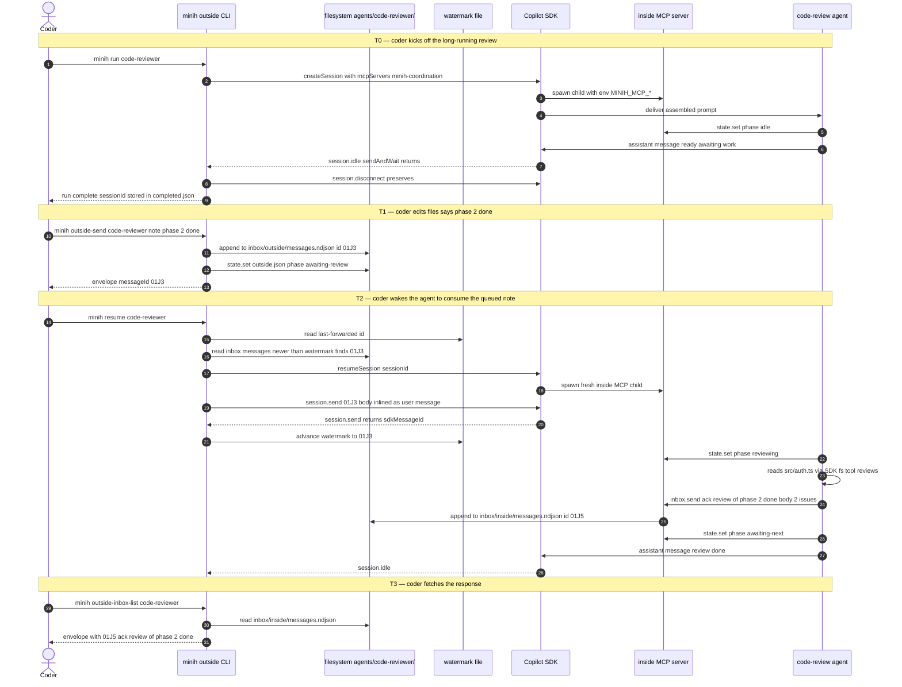
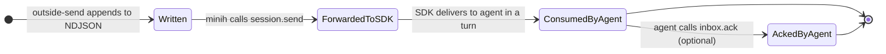

# Workshop: User Journey — Coder ↔ Background Code-Review Agent

**Type**: Other (User Journey + Integration Pattern)
**Plan**: 007-backgrounding
**Spec**: [coordination-spec.md](../coordination-spec.md)
**Created**: 2026-04-26
**Status**: Draft

**Related Documents**:
- [001-filesystem-layout.md](001-filesystem-layout.md) — files referenced throughout the journey
- [002-state-machine.md](002-state-machine.md) — DOWN-SCOPED per user direction; this workshop assumes free-form `phase` strings, no rule machine
- [003-mcp-tool-surface.md](003-mcp-tool-surface.md) — the tool calls the agents make
- [004-spawn-config-injection.md](004-spawn-config-injection.md) — how the inside MCP gets its baked context
- [005-preamble-and-prompting.md](005-preamble-and-prompting.md) — what the agent reads about coordination

**Domain Context**:
- This workshop spans the entire pipeline: cli (outside CLI commands), runner (file-watcher loop + watermark + forwarder), mcp (inside surface), adapter (SDK send + event subscription, NOT sendAndWait). **No minih-owned message queue** — the SDK is the queue, per `external-research/sdk-mid-turn-injection.md`. minih's running process IS a "daemon-light" for the duration of one `minih run`: it watches the inbox/state files via native `node:fs.watch`, and on any change immediately calls `session.send` to forward the event into the live SDK session. The agent receives the change as a normal turn within ~200ms-5s (depending on whether it's idle or mid-turn).

---

## Purpose

Make the abstract spec concrete by walking through the **canonical journey**: a coder editing code while a background code-review agent reviews their work in near-real-time. This workshop pins the "feel" of the system — what the coder types, what the inside agent sees, when messages get delivered, and how the queue-and-fire mechanism works. **Use this as the reference for prompt-tuning, UX decisions, and demos.**

## Key Questions Addressed

- What does using this *feel like* end-to-end?
- How does an outside note actually get into the inside agent's prompt context — does the agent have to poll `inbox.list`, or does minih *push* the note in at the next turn?
- When outside calls `outside-send` while the inside session is alive vs not alive, what happens?
- What's "next turn" mean precisely?
- Can we inject mid-turn (while the inside agent is still processing a prior message)?
- Where's the v1 boundary vs the v2 (daemon) boundary?

---

## Cast

| Actor | Role | Surface |
|-------|------|---------|
| **Coder** | Human (or Claude Code, Cursor, IDE-embedded LLM) editing code | Shell + their editor |
| **Outside agent** | The thing the coder is using (Claude Code session, IDE plugin, even just bash) — NOT necessarily an LLM, just whoever invokes minih outside commands | `minih outside-send`, `minih state set --side outside` |
| **Inside agent** (the code-review agent) | Background-running minih agent reviewing diffs as the coder works | MCP tools (`inbox.list`, `inbox.send`, `state.set`, `state.get`) |
| **minih runtime** | The harness orchestrating both sides | Filesystem, MCP server, SDK session, queue |
| **Copilot SDK** | The session host | Standard `createSession`/`resumeSession`/`send`/`sendAndWait` |

---

## The Big Picture (mermaid)

```mermaid
flowchart LR
    subgraph CoderEnv ["Coder's environment (shell + editor)"]
        Coder[👤 Coder]
        OutsideCLI[minih outside-send / state set]
    end

    subgraph SharedFS ["agents/code-reviewer/  (per-agent shared)"]
        OutInbox[inbox/outside/messages.ndjson]
        InInbox[inbox/inside/messages.ndjson]
        OutState[state/outside.json]
        InState[state/inside.json]
        Hist[state/history.ndjson]
    end

    subgraph minih ["minih runtime (running for the duration of `minih run`)"]
        Watcher["fs.watch on inbox/+state/<br/>fires on every file change"]
        WM["high-water mark<br/>state/sdk-watermark.json<br/>last-forwarded inbox id"]
        Forward["forwarder<br/>on watcher fire OR cold-start:<br/>scan inbox > watermark<br/>diff state files<br/>call session.send per change"]
        Loop["event loop<br/>session.send (no await)<br/>+ subscribe to session.idle"]
    end

    subgraph SDK ["Copilot SDK (handles its own queue)"]
        Session["session<br/>pending_messages queue<br/>(persists across disconnect)"]
    end

    subgraph Inside ["inside agent (during a turn)"]
        Agent[🤖 code-review agent]
        MCP["minih-coordination MCP server<br/>(spawned per run)"]
    end

    Coder -->|"types prompts /<br/>edits files"| OutsideCLI
    OutsideCLI -->|appends| OutInbox
    OutsideCLI -->|writes| OutState
    OutsideCLI -->|exits 0 immediately| Coder

    Watcher -.->|file change event| Forward
    Forward -.->|reads| WM
    Forward -.->|reads inbox > watermark| OutInbox
    Forward -.->|reads diff| OutState
    Forward -->|session.send per change| Loop
    Loop -->|session.send| Session
    Loop -.->|session.idle / pending_messages.modified| Watcher
    Forward -->|advance| WM

    Session -->|"streams events,<br/>tool calls"| Agent
    Agent -->|tool call| MCP
    MCP -->|reads/writes| OutInbox
    MCP -->|reads/writes| InInbox
    MCP -->|reads/writes| OutState
    MCP -->|reads/writes| InState
    MCP -->|appends| Hist

    InInbox -->|"coder sees via<br/>minih outside-inbox-list"| OutsideCLI

    classDef coderColor fill:#e1f5ff,stroke:#0066cc,color:#000
    classDef fsColor fill:#fff4e1,stroke:#cc8800,color:#000
    classDef minihColor fill:#e1ffe1,stroke:#008800,color:#000
    classDef sdkColor fill:#f4e1ff,stroke:#8800cc,color:#000
    classDef insideColor fill:#ffe1e1,stroke:#cc0000,color:#000

    class Coder,OutsideCLI coderColor
    class OutInbox,InInbox,OutState,InState,Hist fsColor
    class Queue,Hook minihColor
    class Session sdkColor
    class Agent,MCP insideColor
```



**Read the diagram top-to-bottom**: the coder writes notes outside; minih queues them; on the next session turn, the queue is flushed into the agent's context; the agent acts and writes back; the coder sees responses via the outside CLI. Per-agent shared state is the integration medium.

---

## Happy-Path Sequence Diagram

A canonical "coder finishes phase 2; agent reviews phase 2" round-trip:



**Sidebar — alive-session fast path is v1 default**: when `minih run` is alive in terminal A and you fire `outside-send` (or `state set`) from terminal B, you do NOT need a second `minih resume`. Terminal B writes to the file and exits 0 in ~50ms. Terminal A's `fs.watch` fires within ~10-100ms; the running process reads the change and calls `session.send` directly on its open session handle. The SDK queues; agent processes within ~2-5s if mid-turn or ~200ms if idle. **No two-clients-on-one-session risk** — only terminal A holds the SDK client; terminal B never opens one. The watermark drain on `minih resume` remains, but only matters for the cold-start case (no `minih run` currently alive).

The key step is **#16-#19**: minih reads the watermark, finds inbox messages past it, calls `session.send` once per message (so each becomes its own queued user-turn at the SDK level), and advances the watermark per send. The agent doesn't have to call `inbox.list` — each forwarded message arrives as a normal turn prompt because the SDK queues `session.send` calls natively (proven in `external-research/sdk-mid-turn-injection.md`).

---

## How Delivery Works (it's mostly the SDK)

The user's framing was:

> "Setting a note or setting a state will just fire a message into the into the SDK on the next loop. so they're sort of they need to queue up a bit and then get fired in and then we need to check them off that they've been sent into the inside mini harness."

**Empirically confirmed (`external-research/sdk-mid-turn-injection.md`):** the Copilot SDK's `session.send()` *is* the queue. Each call enqueues a user message into the session's `pending_messages`; the SDK processes them in submission order, one turn each, and emits `pending_messages.modified` for queue-depth observability. minih does NOT need to maintain its own queue. We only need to know **which inbox messages we've already forwarded to the SDK** so we don't double-send.

### State machine of an outside message



Three observable states:
- **Written** — message exists in `inbox/outside/messages.ndjson`. minih hasn't yet handed it to the SDK.
- **ForwardedToSDK** — minih called `session.send(body)` for this message. The SDK has it in `pending_messages`. The agent will see it on its next turn (typically 2–5s later).
- **AckedByAgent** — the agent explicitly called `inbox.ack`. Stronger guarantee than "consumed" — proves the agent read it semantically.

minih only persists a single watermark per agent: the highest `inbox-message id` we've forwarded. No `.delivered.ndjson`, no per-message tracking, no separate queue file.

### The watermark file

```
agents/<slug>/state/sdk-watermark.json
```

```jsonc
{
  "lastForwardedInboxId": "01J3M9XK7QABCDEFGH123456",
  "lastForwardedAt": "2026-04-26T10:14:50.000Z",
  "lastSdkMessageId": "4f3bf468-a88d-47fa-b422-c539ced2187a"
}
```

Atomic write (temp + rename) on every advance. ULIDs are lex-sortable, so "messages newer than the watermark" is a single linear scan of `inbox/outside/messages.ndjson` filtering by `id > watermark.lastForwardedInboxId`. No index needed.

### The forward-to-SDK helper

```ts
// pseudo-code in src/runner/inbox.ts (or similar)
async function forwardPendingToSDK(slug: string, agentsDir: string, session: ICopilotSession): Promise<number> {
  const watermark = readWatermark(slug, agentsDir);
  const all = readInboxLane('outside', slug, agentsDir);
  const pending = all.filter((m) => m.id > watermark.lastForwardedInboxId);
  if (pending.length === 0) return 0;

  for (const msg of pending) {
    const sdkMessageId = await session.send({ prompt: renderForPrompt(msg) });
    writeWatermark(slug, agentsDir, {
      lastForwardedInboxId: msg.id,
      lastForwardedAt: new Date().toISOString(),
      lastSdkMessageId: sdkMessageId,
    });
  }
  return pending.length;
}

function renderForPrompt(msg: InboxMessage): string {
  return `📨 New from outside\n[${msg.type}] ${msg.subject}\n\n${msg.body}`;
}
```

Each message becomes one `session.send` call → one queued user-message in the SDK → one assistant turn. The SDK orders them by submission time. We do NOT batch into one prompt anymore (the previous design did; the SDK queue removes the need).

### Where this is invoked

**In v1 (this plan):** invoked by `minih resume <slug>`:
1. `findRunSession` → sessionId.
2. `client.resumeSession(sessionId)` → live session handle.
3. `forwardPendingToSDK(slug, agentsDir, session)` → fires `session.send` for every inbox message past the watermark; advances the watermark per message.
4. If a user-supplied resume message exists, `session.send({ prompt: userMessage })` after the inbox forwards (the SDK queues it after the inbox messages — submission order preserved).
5. Use `session.on('session.idle')` to know when the queue has drained — NOT `sendAndWait` (which would wait for the entire queue, see footgun in `external-research/sdk-mid-turn-injection.md`).
6. Disconnect.

If there are no pending inbox messages AND no user-supplied resume message → `minih resume` errors with `E12X NOTHING_TO_DELIVER`. Only failure mode.

**In v2 (the eventing/daemon plan, deferred):** the daemon holds a long-lived live session and calls `forwardPendingToSDK` on every: file-changed event, new inbox message, or state-changed event. The agent gets near-real-time delivery (2–5s) without the user typing `minih resume`.

### What the agent sees in its prompt

Concrete example. Coder runs `minih outside-send code-reviewer --type note --subject "phase 2 done" --body "src/auth.ts ready for review"`. Then runs `minih resume code-reviewer`.

The next user message in the SDK queue (which becomes the next turn's prompt for the agent):

```
📨 New from outside
[note] phase 2 done

src/auth.ts ready for review
```

The agent processes it as a normal turn (calls tools, writes a response). If the coder had sent THREE notes between resumes, the agent would see THREE separate turns in submission order — the SDK queue handles ordering.

### Why **the agent doesn't need to call `inbox.list` in the steady state**

Per `external-research/agent-harness-survey.md`, agents reliably ignore prompt-driven "check the inbox every N steps" instructions. Inverting the flow — *minih forwards via `session.send`*, agent receives passively as a normal turn — fixes this.

`inbox.list` remains useful for:
- Retrospective queries ("what did outside send during my last 3 turns combined?" — when the agent wants to recap)
- Filtering ("show me unread directives only")
- Reading messages older than the watermark (e.g., during cold-start of a fresh session that wants historical context)

The MCP tool stays; the prompt guidance is: "Outside messages arrive as your normal turn prompts; you don't need to poll `inbox.list`. Use it only for retrospective or filtering."

---

## v1 Boundary vs v2 (Daemon) Boundary

```mermaid
sequenceDiagram
    autonumber
    actor Coder
    participant CLI as minih CLI
    participant Watcher as fs.watch (v2 only)
    participant SDK as Copilot SDK<br/>(disconnected/resumed)

    Note over Coder,SDK: v1 — manual loop (this plan)
    Coder->>CLI: minih run code-reviewer (initial)
    CLI->>SDK: sendAndWait → idle → disconnect
    Coder->>CLI: edit files; minih outside-send "..."
    Coder->>CLI: minih resume code-reviewer
    CLI->>SDK: resumeSession + send (with inlined notes)
    SDK-->>CLI: idle → disconnect
    Coder->>CLI: edit more; outside-send; resume; ...

    Note over Coder,SDK: v2 — daemon loop (plan 008+)
    Coder->>CLI: minih daemon start code-reviewer
    CLI->>Watcher: fs.watch(src/**/*.ts)
    Coder->>CLI: edit files (no explicit minih call)
    Watcher->>CLI: file changed event
    CLI->>SDK: resumeSession + send (with inlined notes + "files changed: ...")
    SDK-->>CLI: idle → disconnect
    Coder->>CLI: outside-send "phase 2 done" (still works; instantly delivered on next watcher trigger)
    Coder->>CLI: minih daemon stop
```

**v1 = coder explicitly types `minih resume` to trigger a turn**.
**v2 = daemon detects file events and triggers turns automatically**.

The queue-and-deliver mechanism is identical in both versions. The daemon plan only adds the trigger source.

---

## Mid-Turn Injection — ✅ EMPIRICALLY CONFIRMED (2026-04-26)

> **Update**: tested empirically with `scratch/midturn-test/test.mjs`. See `external-research/sdk-mid-turn-injection.md` for full report. **`session.send()` mid-turn queues cleanly** — each queued message gets its OWN turn ~2-5s after the current turn completes. The SDK emits `pending_messages.modified` events for observable queue state. NO mid-stream merging; NO interruption; back-to-back sends produce separate turns in submission order.
>
> **Footgun discovered**: `sendAndWait` waits for `session.idle` which fires only after ALL queued messages drain — not just the response to the message it sent. A long-running daemon MUST use `session.send` + event subscription (NOT `sendAndWait`).
>
> **Implications for v1 plan**:
> - The user's "queue up notes and fire them on the next loop" model is exactly what the SDK does natively.
> - For v1, we still ship the pre-turn-resume delivery model (the alive-session direct-inject path is a v2 enhancement that requires a session registry — see below).
> - For v2 daemon: the daemon can call `session.send(inlinedNotes)` directly when outside fires, achieving 2-5s end-to-end latency without needing the user to type `minih resume`.

### Original "open question" content (kept for reference)

The local SDK source (`session.ts:180-191`) shows `session.send()` returns immediately and processes asynchronously. JSDoc: "The message is processed asynchronously."

**Open question**: if minih has already called `sendAndWait({prompt: A})` and the agent is mid-stream (calling tools, reasoning), and a NEW outside message arrives, can minih call `session.send({prompt: B})` to inject B mid-stream? Or does it queue until A's `session.idle`?

**Why we want to know**: the difference between "outside messages reach the agent on the next turn" (50ms-30s latency depending on what the agent is doing) and "outside messages reach the agent within seconds even mid-turn" (much tighter feedback loop) is a major UX axis.

**What we know from local source**:
- `send` returns a Promise<messageId> immediately.
- `sendAndWait` listens for `session.idle`. Implies idle is observable.
- No explicit mention of "send while busy" being prohibited or supported.
- `session.abort()` exists — explicit cancel-current path.

**What we don't know**:
- Backend behavior on overlapping `send` calls (queue vs error vs interrupt).
- Whether multiple `send`s within the same idle-window get bundled into one model response or two.
- Whether there's a "notification" message type (model not required to respond) vs "prompt".
- Whether server-side push is possible.

**Plan**: empirical test as a follow-up task (not blocking v1):
1. Start a session with `sendAndWait({prompt: "do a slow loop"})`.
2. ~500ms later, call `session.send({prompt: "additional info"})`.
3. Observe: does the second message get a response? Does the first response include awareness of the second? Does the SDK error?

For v1 spec, **assume queue-on-next-turn semantics**. If empirical testing later shows mid-turn injection works cleanly, the daemon plan can use it for tighter latency.

> **TODO** in dossier: add this empirical test as a research opportunity.

---

## Edge Cases

### EC-1: Outside sends during run that's currently in flight

The coder ran `minih run code-reviewer` and it's still streaming. The coder runs `minih outside-send code-reviewer --type note ...` from another terminal.

- The outside message lands in `inbox/outside/messages.ndjson` immediately.
- The queue records it as pending.
- On the *next* `minih resume code-reviewer` (after current run idles + disconnects), the pre-turn hook delivers it.
- If the coder wants instant delivery, mid-turn injection is the pending research question above.

### EC-2: Outside sends multiple notes between turns

- All notes get enqueued.
- On next turn, the inlined section batches them: "📨 New from outside (3 messages):\n\n[...]\n\n---\n\n[...]\n\n---\n\n[...]"
- All marked delivered atomically (one delivery record per message).

### EC-3: Inside agent sends back; coder doesn't fetch

- Inside writes to `inbox/inside/messages.ndjson` via MCP.
- Coder eventually runs `minih outside-inbox-list code-reviewer`.
- All inside messages returned in chronological order; envelope includes `unread: true` for any not yet acked by outside.
- Outside acks via `minih outside-inbox-ack <slug> <msgId>` (mirrors the inside MCP `inbox.ack`).

### EC-4: Inside agent transitions to "complete" while outside is still working

- Inside calls `state.set({key: 'phase', value: 'complete'})`.
- No rule check (per scope reduction in workshop 002); the agent has agency. The agent's own prompt should encode the "wait for outside.done" convention.
- If the agent ignores the convention, the resulting state is "logically wrong" but the system doesn't crash. The retrospective will likely note the issue.
- This is the trade-off of the user's "agents can figure it out" direction.

### EC-5: Coder runs `minih resume` with no pending notes and no user message

- `forwardPendingToSDK` returns 0; no user message either.
- No `session.send` call. The CLI errors with `MinihEnvelope` `error.code: E12X NOTHING_TO_DELIVER`.
- The coder learns: either send a note, set state, or pass a message.

### EC-6: Outside-send runs while a `minih run` is mid-stream in another terminal

- Coder runs `minih run code-reviewer` in terminal A; it's processing a long turn.
- Coder runs `minih outside-send code-reviewer ...` in terminal B. Writes to `inbox/outside/messages.ndjson`; exits 0 in ~50ms.
- **Terminal A's `fs.watch` fires within ~10-100ms**. Terminal A's forwarder reads the new inbox line, calls `session.send({prompt: rendered(msg)})` on its live session handle. SDK queues it onto `pending_messages`.
- Agent's current turn finishes (whenever it does). SDK starts the next turn with the forwarded message as the user prompt. Total end-to-end: ~2-5s if mid-turn, ~200ms if idle.
- **No two-clients-on-one-session risk**: only terminal A holds the SDK client. Terminal B is purely filesystem.
- This is the v1 default. The "watermark drain on resume" path is only used when there's NO running `minih run` to receive the live event.

### EC-7: Watermark file is corrupted or missing

- Treat as `lastForwardedInboxId === ""`; forward everything in the inbox. Agent receives all historical messages on the next turn.
- Loud: in `--verbose` mode, log a warning to stderr. JSON envelope unchanged.
- Recovery: agent processes duplicates harmlessly (the SDK queues them as separate user messages; agent sees them as ordinary turns).

### EC-8: Inbox NDJSON has a malformed line

- Tolerate: skip the line and log via `process.stderr.write` warning. Continue processing other lines.
- The skipped message will never advance the watermark past it (since the line can't be parsed to extract its `id`). If the corruption is permanent, we have a permanent watermark stall; document and provide a recovery mechanism (`minih inbox repair <slug>` could be a follow-up command).

---

## Concrete Demo Script (for hand-on testing)

```bash
# Setup: build minih, open two terminals A and B
npm run build

# === Terminal A — initial wake-up ===
minih run code-reviewer --model gpt-5.5 --no-reasoning
# (agent starts; says "ready"; session disconnects)
# completed.json now has sessionId

# === Terminal B — coder edits files (simulated) ===
echo "// new auth code" >> src/auth.ts

# === Terminal B — send a note ===
minih outside-send code-reviewer \
  --type note \
  --subject "phase 2 done" \
  --body "src/auth.ts ready for review"
# → envelope with {messageId: 01J..., status: ok}

# === Terminal B — wake the agent ===
minih resume code-reviewer
# (the pre-turn hook inlines the note; agent reviews; sends ack; disconnects)

# === Terminal B — fetch responses ===
minih outside-inbox-list code-reviewer
# → envelope with [01J5...: type=ack, subject="review of phase 2 done", body="2 issues found..."]

# === Terminal B — observe state evolution ===
minih state get code-reviewer
# → envelope with {outside: {phase: "awaiting-review", ...}, inside: {phase: "awaiting-next", ...}}

cat agents/code-reviewer/state/history.ndjson
# → all transitions across both sides, time-ordered
```

Total interaction time for a full round-trip: ~30-60 seconds depending on model + diff size.

---

## Cross-Process Delivery — daemon-light pattern (v1)

**The user's question (paraphrased)**: an outside agent (e.g., Claude Code) fires `minih run code-reviewer` and that becomes a long-running process. The outside agent later wants to send another message or update status. It runs a SECOND `minih` invocation. How does that second invocation reach the first's live session?

**The answer**: the running `minih run` process IS a daemon-light. It runs `node:fs.watch` on `agents/<slug>/{inbox,state}/` for the duration of the run. Any cross-process file write fires the watcher within ~10-100ms; the running process reads the diff, calls `session.send` on its live SDK handle, and the agent processes within ~2-5s. The second `minih` invocation never opens its own SDK client — it's purely a file-write operation.

### Three states a session can be in

| Session state | What's true | How "outside-send" / "state set" delivers |
|---------------|-------------|-------------------------------------------|
| **Never existed** (no prior run) | No sessionId on disk. `findRunSession` returns null. | Writes to file only. First `minih run` walks the inbox (watermark empty), forwards everything via `session.send` on cold-start, then enters the watch loop. |
| **Exists but disconnected** (no `minih run` currently alive) | sessionId in `completed.json`. SDK has session's `pending_messages` on disk; no live process holds the client. | Writes to file only. Next `minih run` (or explicit `minih resume`) does the cold-start drain + enters the watch loop. The next live event after that drains via `fs.watch`. |
| **Currently alive** (a `minih run` is mid-flight, holding the SDK client) | sessionId on disk; ONE process owns the live client + watch loop. | **Live push within ~200ms-5s.** Second `minih` invocation writes file, exits 0. Terminal A's `fs.watch` fires; forwarder calls `session.send` directly; SDK queues; agent processes on its next turn boundary. |

### How the live-push path actually works inside `runAgent`

Today's `runAgent` is roughly:

```ts
// CURRENT (blocks on sendAndWait)
const result = await session.sendAndWait({ prompt }, timeout);
// runAgent is dead in the water until session.idle fires.
```

The new shape (required for v1's daemon-light pattern):

```ts
// PROPOSED — event-driven, watcher-friendly
const inboxWatcher = fs.watch(`${agentDir}/inbox/outside/`, ...);
const stateWatcher = fs.watch(`${agentDir}/state/`, ...);

inboxWatcher.on('change', async () => {
  const pending = await readPastWatermark(slug, agentsDir);
  for (const msg of pending) {
    await session.send({ prompt: renderInboxForPrompt(msg) });
    await advanceWatermark(slug, agentsDir, msg.id);
  }
});

stateWatcher.on('change', async () => {
  const diff = await diffOutsideState(slug, agentsDir, lastSeenOutsideState);
  if (diff) {
    await session.send({ prompt: renderStateChangeForPrompt(diff) });
    lastSeenOutsideState = await readOutsideState(slug, agentsDir);
  }
});

// Initial drive: send the assembled prompt
await session.send({ prompt: assembledPrompt });

// Wait for terminal condition: timeout, completion-signal, or SIGINT
await waitForTerminal({ session, timeout, completionSignal });

// Cleanup: tear down watchers, disconnect session
inboxWatcher.close();
stateWatcher.close();
await session.disconnect();
```

Key change: `runAgent` is now **inherently long-lived** (until terminal condition), not just "send a message and wait for one response." It can drive the SDK with multiple `session.send` calls over time.

### Debounce + atomic-rename handling (per chainglass evidence)

Native `fs.watch` on macOS reports atomic-rename writes as `'rename'` events with potentially duplicate fires per logical write. We need:
- Per-file debounce (~150ms) on `change`/`rename` events to coalesce editor save bursts.
- After debounce: stat-then-act. If the file no longer exists, treat as deletion. If it does, parse and act on the new content.
- For the inbox NDJSON: the watermark itself prevents double-forwarding; debounce just prevents the watcher from doing N reads when one would do.
- For state JSON: compare new content hash to last-seen; emit a `session.send` only on actual change.

Pattern lifted from chainglass's `NativeFileWatcherAdapter` (workshop 003 / file-watching research).

### Terminal condition for `runAgent`

Today's `runAgent` ends when `sendAndWait` returns (= one assistant.message + session.idle). The new shape needs a more deliberate terminal condition. Options:

1. **`completionSignal`**: when the agent transitions `inside.json.phase` to a value matching a configured terminal phase (e.g., `complete` or `error`), `runAgent` exits cleanly.
2. **`maxIdleSeconds`**: if the session has been idle for N seconds AND no new file events are pending, exit.
3. **`absoluteTimeout`**: wall-clock cap (existing).
4. **SIGINT**: existing.

Recommendation for v1: **(1) + (3) + (4)**. Configurable terminal phase via frontmatter (`coordination.inside.terminalPhases: [complete, error]`); 30-min default absolute timeout; SIGINT for manual stop. `maxIdleSeconds` is a v1.5 enhancement.

### Concurrency rule (unchanged from prior version)

**One `minih run` per agent at a time** in a given project. Two simultaneous `minih run code-reviewer` invocations would each open their own client + watch loop, race the watermark, and double-forward every event. Document as v1 convention. Optionally enforce via lockfile (`agents/<slug>/.lock` with PID); v1.5 if convention-only proves insufficient.

### How "find the right sessionId" gets solved

`findRunSession(slug, agentsDir)` already exists. Returns the latest run's sessionId. `minih resume` uses it; coordination uses the same. For the "no prior run yet" case: no session to push into; first `minih run` consumes the queued notes on cold-start.

### So what does the outside agent's loop look like (v1)?

```
# Outside agent (Claude Code) wants to coordinate with code-reviewer

# Initial bring-up — long-running daemon-light
$ minih run code-reviewer --model gpt-5.5 --no-reasoning &
# (the & backgrounds it; agent runs continuously, watches files,
# delivers events live; exits when its inside phase reaches "complete"
# or after the timeout / SIGINT)

# Coordination loop — outside agent does work, then signals:
while still_working:
    do_some_coding()
    if checkpoint_reached:
        minih outside-send code-reviewer --type note --subject "phase X done" --body "..."
        minih state set code-reviewer --side outside --key phase --value "in-progress"
        # ↑ Each command writes a file and exits ~50ms.
        # The backgrounded `minih run` sees the file change within ~100ms,
        # forwards via session.send, agent reacts within ~2-5s.

        # Read responses (the agent has been adding to inbox/inside/messages.ndjson)
        responses=$(minih outside-inbox-list code-reviewer --since-last-read)
        # ... act on responses ...

# Wrap up
minih state set code-reviewer --side outside --key phase --value "done"
# (this triggers the inside agent's completion logic; if its frontmatter says
# terminal phase = "complete", the running `minih run` will exit when the inside
# transitions to complete)
wait  # for the backgrounded `minih run` to exit
```

### What v2 (daemon) changes

v2 is mostly cosmetic on top of v1:
- Persistent across `minih run` boundaries (a true daemon process; survives the agent reaching its terminal phase).
- File-change events from outside the agent dir (e.g., `src/**/*.ts`) become first-class triggers in addition to inbox/state events.
- `minih daemon start/stop/status` CLI surface for managing daemon lifecycle.
- Optionally: MCP server-push notifications if the SDK adds them.

The inbox + watermark + state file conventions are unchanged. v1 already does the live push; v2 just survives longer.

---

## What Stays in v1 (this plan)

- ✅ Outside CLI commands (`outside-send`, `outside-inbox-list`, `state get/set`)
- ✅ Inside MCP tools (`inbox.send`, `inbox.list`, `inbox.ack`, `state.get`, `state.set`)
- ✅ Per-agent shared inbox + state files (workshop 001)
- ✅ Free-form `phase` strings; no rule machine; no `requiresPeer` enforcement (workshop 002 scope reduction)
- ✅ Per-agent watermark file (`agents/<slug>/state/sdk-watermark.json`)
- ✅ **`runAgent` refactor**: drop `sendAndWait`; use `session.send` + event subscription; long-lived loop with terminal condition (frontmatter-configured terminal phase + absolute timeout + SIGINT)
- ✅ **Live cross-process delivery via `node:fs.watch`** on `agents/<slug>/{inbox,state}/` — daemon-light pattern within the duration of one `minih run`
- ✅ Per-file debounce (~150ms) + atomic-rename handling (chainglass pattern)
- ✅ State-change diffing (compare new content vs last-seen; emit `session.send` only on actual change)
- ✅ Cold-start drain on `minih resume`: walk inbox > watermark, forward each via `session.send`
- ✅ `state.transition` MCP tool degrades to "set phase + append to history" — no rule check (workshop 003 update needed)
- ✅ Snapshots into run folder at run end
- ✅ Convention: one `minih run` per agent at a time (documented; not enforced)

## What Moves to v2 (daemon plan, 008+)

- 🔜 Persistent across `minih run` lifetimes — true daemon survives agent reaching terminal phase
- 🔜 File-change triggers OUTSIDE the agent dir (e.g., `src/**/*.ts`) — daemon watches arbitrary project paths and forwards file events as inbox-shaped messages
- 🔜 Daemon process management (`minih daemon start/stop/status`, pidfile, IPC socket for lifecycle commands)
- 🔜 MCP server-push notifications (`notifications/*` MCP capability) if SDK supports them
- 🔜 Surface state + coordination summary in `minih history` and `completed.json` envelope
- 🔜 Lockfile to enforce "one minih per agent" if convention proves insufficient
- 🔜 Multi-agent fan-out (one daemon coordinating two+ inside agents on shared state)

---

## Updated Workshop Cross-Refs (in light of this journey)

This workshop changes the framing for some prior workshops. Updates needed:

- **Workshop 003 (MCP tool surface)**: `state.transition` degrades to "set phase + log history" — no rule checking, no `GATED` error. The `INVALID` error is also gone (no rules to be invalid against). Just succeeds. Update tool description.
- **Workshop 005 (preamble + prompting)**: Coordination section should clarify: "outside messages auto-arrive in your prompt at each turn; you don't need to poll `inbox.list`. Use `inbox.list` only for filtering or retrospective."
- **Workshop 006 (test fixtures)**: add tests for `forwardPendingToSDK` + watermark advancement. AC list expands; mocking the SDK via FakeAgentAdapter must include `session.send` returning sdkMessageIds and the `pending_messages.modified` event surface.

---

## New Acceptance Criteria (additive to spec)

- **AC-LIVE-PUSH-INBOX**: When `minih run <slug>` is alive and `outside-send` is invoked from a separate process, the running process's `fs.watch` detects the inbox file change within 200ms and calls `session.send` with the rendered message; the watermark advances. Verifiable via timestamp diff between `outside-send` exit and the SDK's `pending_messages.modified` event.
- **AC-LIVE-PUSH-STATE**: When `minih run <slug>` is alive and `state set` is invoked from a separate process, the running process's `fs.watch` detects the state file change within 200ms; if the new state differs from last-seen, calls `session.send` with a "📌 State changed" notification.
- **AC-FORWARD-ON-RESUME**: When `minih resume <slug>` (or initial `minih run` cold-start) finds inbox messages past the watermark, each is forwarded via separate `session.send` calls in submission order; watermark advances per message.
- **AC-FORWARD-IDEMPOTENT**: A second `fs.watch` fire for the same inbox message (e.g., due to atomic-rename quirks) does NOT re-forward — watermark prevents it.
- **AC-DEBOUNCE-BURSTS**: 5 file writes within 500ms result in ONE forwarder invocation (debounced ~150ms), not 5; the forwarder still processes all 5 messages in order.
- **AC-FORWARD-VISIBILITY**: `minih outside-inbox-list <slug>` envelope includes `forwarded: boolean` and `acked: boolean` per message.
- **AC-NOTHING-TO-DELIVER**: `minih resume <slug>` with no user message AND no pending inbox AND no state diff fails with `E12X NOTHING_TO_DELIVER`.
- **AC-WATERMARK-FRESH-START**: When `state/sdk-watermark.json` is missing/empty, `runAgent` walks the entire inbox on cold-start.
- **AC-RUN-AGENT-EVENT-DRIVEN**: `runAgent` does NOT call `sendAndWait`. It uses `session.send` (per message) + subscription to `session.idle` / `assistant.turn_end` events to drive the loop. Terminal condition is configurable terminal-phase reached + absolute timeout + SIGINT.
- **AC-SINGLE-RUN-PER-AGENT**: A second `minih run <slug>` invocation while another is alive currently has UNDEFINED behavior in v1 (documented as convention violation). Future: lockfile-based hard error.

(Add to spec's Acceptance Criteria section in next polish pass.)

---

## Open Questions

### Q1: Should the watermark also track inside→outside delivery?

**Leaning**: no. Inside-side messages get appended to `inbox/inside/messages.ndjson` and read by `minih outside-inbox-list`. There's no "delivery" semantics on the inside→outside path because the receiver (coder/CI/Claude Code) is a human/host, not a session. We could expose `--since <id>` on `outside-inbox-list` to let the host track its own read state — but that's the host's job, not minih's.

### Q2: Should `minih resume` accept `--no-forward` to skip the watermark drain?

**OPEN**: an outside caller might want to send a fresh user message WITHOUT also draining queued inbox notes (e.g., to pose an unrelated question). Probably needed eventually; defer to spec polish.

### Q3: Should `forwardPendingToSDK` live in `runner/` or `cli/commands/resume.ts`?

**Leaning**: a helper in `runner/` (depends on filesystem semantics; consumed by `cli`). `cli/commands/resume.ts` calls into it. Mirrors how `findRunSession` works.

### Q4: Mid-turn injection — when do we test it?

**Leaning**: write a small standalone script that hits the SDK directly. Plan 008+ work item, not blocking v1.

### Q5: Should the inlined preamble be configurable?

**OPEN**: agents might want a different format (e.g., XML-tagged for stronger fence). Current default is a markdown-style header.
- **Leaning**: ship one default; accept difficulty-ledger feedback; iterate. Don't add a config knob until needed.

### Q6: How does the coder learn that the inside agent received their note?

**OPEN**: today they'd run `minih outside-inbox-list` and see the agent's `ack`. Could also surface delivery status:

```bash
minih outside-pending code-reviewer
# → envelope with [01J3...: subject="phase 2 done", delivered: false]
# After resume:
# → envelope with [01J3...: subject="phase 2 done", delivered: true, acked: false]
```

A new `outside-pending` command makes the queue inspectable. Lightweight.

---

## Quick Reference

```bash
# === COMMON FLOW ===

# Start the agent (one-time per agent lifetime, or on-demand)
minih run code-reviewer --model gpt-5.5 --no-reasoning

# Send a note to the agent (queues for next turn)
minih outside-send code-reviewer --type note \
  --subject "phase 2 done" --body "..."

# Wake the agent — it consumes pending notes inline
minih resume code-reviewer

# Read what the agent sent back
minih outside-inbox-list code-reviewer

# Set outside state (no turn triggered; just data)
minih state set code-reviewer --side outside --key phase --value "coding"

# Read combined state (both sides)
minih state get code-reviewer

# === DEBUG / OBSERVE ===

# What's in the queue (delivered status per message)
minih outside-inbox-list code-reviewer --include-delivery

# Tail the agent's events while it's running
minih tail code-reviewer

# Full history of state transitions
cat agents/code-reviewer/state/history.ndjson | jq .
```

```ts
// === INSIDE AGENT (in its prompt or system instructions) ===

// Outside notes ARRIVE in your prompt — you don't need to call inbox.list
// for them. Use inbox.list only for retrospective or filtering.

// Send a note back to outside:
await inbox.send({
  type: 'ack', subject: 'review of phase 2 done',
  body: '2 issues found: ...', ackOf: '01J3...'
});

// Update your state (free-form phase string; agent decides values):
await state.set({ key: 'phase', value: 'awaiting-next' });
await state.set({ key: 'data.issuesFound', value: 2 });

// Check peer state if you need to coordinate:
const { peer } = await state.get({ side: 'peer' });
if (peer.phase === 'done') {
  // outside is done; you can mark complete safely
  await state.set({ key: 'phase', value: 'complete' });
}
```

---

## Pre-Work Required Before Implementation

The daemon-light pattern requires a few capabilities we haven't proven empirically. Recommended scratch tests BEFORE locking the spec down further. Each is a small standalone script in `scratch/`, ~30 min to write, ~30s per run.

### Pre-work 1: `scratch/runagent-eventdriven/` — prove `runAgent` can run event-driven (no `sendAndWait`)

**Why**: workshop 007 says `runAgent` must drop `sendAndWait` and use `session.send` + event subscription. Today's `runAgent` is built around `sendAndWait`. We need to confirm we can detect "this turn's response is done" reliably from raw `session.on()` events without `sendAndWait`'s convenience wrapper.

**Test**:
1. `createSession`.
2. Subscribe to `session.on()` listing all event types observed.
3. Call `session.send({prompt: "say hello"})` (no await).
4. Wait for `assistant.turn_end` and `session.idle` events; assert order.
5. Call `session.send({prompt: "say goodbye"})` (no await).
6. Wait for second `turn_end` + `idle`; assert.
7. `disconnect`.

**Pass criteria**: we can build a tiny "wait for next idle" helper purely from event subscription that's equivalent to `sendAndWait` (just without the queue-drain footgun).

### Pre-work 2: `scratch/fswatch-test/` — prove native `node:fs.watch` works for the inbox/state pattern on macOS

**Why**: chainglass found `fs.watch` on macOS is FD-cheap for small dirs but has atomic-rename quirks. We need to confirm: (a) writes to a small dir fire events within ~100ms, (b) atomic-rename writes (which is what `outside-send` does for state files) fire detectable events, (c) burst writes (5 in 500ms) get coalesced by our debounce.

**Test**:
1. `mkdir /tmp/minih-watch-test/inbox /tmp/minih-watch-test/state`.
2. Start `fs.watch(/tmp/minih-watch-test, { recursive: true })`.
3. Write 1 file → assert event fires < 200ms.
4. Atomic-rename a JSON file (write tmp, rename) → assert event fires.
5. Burst-write 5 files in 500ms → assert debounce coalesces to 1 forwarder call.
6. Test on macOS + Linux (the OSes our users target).

**Pass criteria**: latency, atomic-rename detection, debounce all work as designed. If fs.watch is unreliable on either OS, we need to revisit (chokidar fallback? polling supplement?).

### Pre-work 3: `scratch/daemon-light-prototype/` — end-to-end live push proof

**Why**: combine pre-work 1 + 2 to prove the whole pattern works end-to-end before refactoring `src/runner/runner.ts`. Ground truth that "outside writes a file, agent gets a turn within seconds" is real.

**Test**:
1. Create session with a simple prompt: "you are a watcher; respond briefly to each message I send."
2. Start fs.watch on `/tmp/minih-daemon-test/`.
3. Initial `session.send({ prompt: "ready, awaiting messages" })`.
4. From a separate process (or just `setTimeout`): write 3 files with different content, 2 seconds apart.
5. Each file write → fs.watch fires → forwarder calls `session.send(content)` → SDK queues → agent processes.
6. Assert: agent emits 3+ assistant messages in observable timeframe (~10s total).
7. SIGINT cleanup → assert clean shutdown.

**Pass criteria**: end-to-end latency under 5s per cross-process file→agent-response cycle. No deadlock. Clean shutdown.

### Pre-work 4 (optional): `scratch/multi-process-watch/` — confirm two processes don't trip each other

**Why**: edge case verification. Process A holds the SDK + watcher; process B writes a file. We expect zero interference.

**Test**:
1. Process A: opens session, watches dir, ready.
2. Process B (separate node invocation): writes file.
3. A's watcher fires; A's forwarder calls session.send; agent responds.
4. Process B exits without ever opening a session.
5. Assert no SDK errors, no doubled events, agent processed once.

**Pass criteria**: no shared state corruption; clean separation of process roles.

---

### What if pre-work uncovers a blocker?

| Failure mode | Fallback design |
|--------------|-----------------|
| `fs.watch` too unreliable on macOS for small dirs | Use 200ms polling as a supplement on macOS (write `agents/<slug>/.last-poll` timestamp; poller compares mtimes); or pull in chokidar specifically for the small-dir case (chainglass's FD problem only manifests on large trees). |
| Event-driven `runAgent` can't reliably detect "this turn done" | Keep `sendAndWait` for the *initial* prompt; add a parallel watcher loop that calls `session.send` (per-message no-await) for live events; just make sure to never call `sendAndWait` AFTER the watcher is active (the queue-drain footgun bites then). |
| Daemon-light end-to-end latency > 10s consistently | Investigate: is it SDK queueing latency, model latency, or our forwarder? Probably model latency for first turn; subsequent should be quick. Revisit if a real blocker. |
| Multi-process file races corrupt state.json or watermark | Add lockfile (advisory lock via `fcntl` or PID-file + atomic check). v1.5 enhancement; v1 documents the convention. |

### Estimated total pre-work effort

- Pre-work 1: ~45 min (script + run + observe)
- Pre-work 2: ~30 min
- Pre-work 3: ~60 min (most complex; combines 1+2)
- Pre-work 4: ~20 min (small variant)
- **Total**: ~2-3 hours of scratch work + ~$0.10 in tokens (real SDK calls).

Recommended order: 1 → 2 → 3 → (4 if 3 surfaces concerns).

**If all pre-work passes**: lock the spec, run `/plan-3-architect`.
**If pre-work surfaces blockers**: revisit workshop 007's design with the failure-mode fallbacks above.

---

## Connection to Plan 008+ (Daemon)

The journey above is **identical** in v2 — the only changes:

- Replace **manual `minih resume`** with **daemon-triggered resume** on file-change events.
- Replace **manual `minih run` initial start** with **`minih daemon start <slug>`**.
- Add **mid-turn injection** if empirical testing confirms it works (much tighter latency).

The queue-and-deliver mechanism, the inbox/state files, the MCP tools, the schemas — all unchanged. v2 layers process orchestration on top of v1's coordination primitives.

Ship v1 cleanly; v2 is mostly orthogonal additions.
