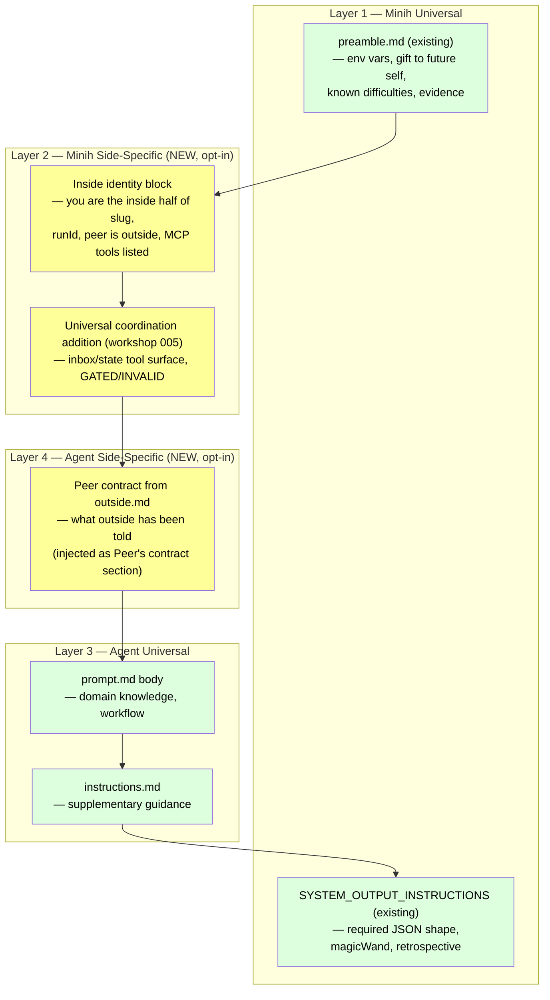
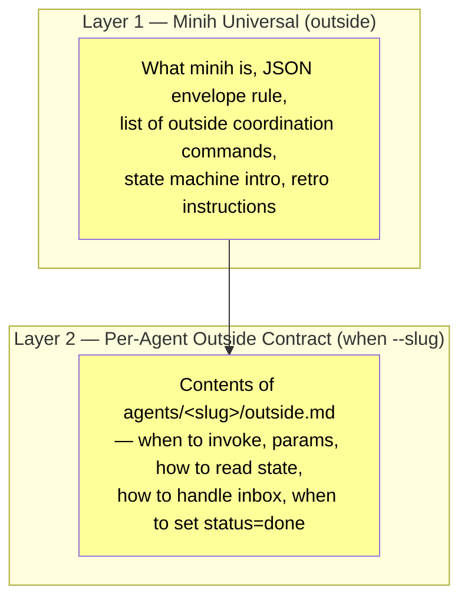

# Workshop: Inside/Outside Prompting & Cross-Side Retro

**Type**: Other (Prompting + Contracts + Feedback Loop)
**Plan**: 007-backgrounding
**Spec**: [coordination-spec.md](../coordination-spec.md)
**Created**: 2026-04-26
**Status**: Draft

**Related Documents**:
- [005-preamble-and-prompting.md](005-preamble-and-prompting.md) — covers the **universal** coordination addition (opt-in toggle, GATED/INVALID error pattern, pre-completion checklist). This workshop **extends** 005, it does not replace it.
- [003-mcp-tool-surface.md](003-mcp-tool-surface.md) — the inside tool list this workshop's prompts must reference.
- [007-user-journey-coder-and-reviewer.md](007-user-journey-coder-and-reviewer.md) — the daemon-light scenario this prompting model has to support.
- `agents/_shared/preamble.md` — current universal preamble (the inside-identity block lives near here).
- `src/runner/runner.ts:44-134` — current `SYSTEM_OUTPUT_INSTRUCTIONS` (already specifies `magicWand`, `magicWandTarget: project | minih`, and `difficulties`).
- `src/cli/commands/difficulties.ts` — back-end for the inside difficulty/retro pipeline this workshop generalizes.
- `src/schemas/system-output.json`, `src/schemas/retrospective.json` — schemas to extend.

**Domain Context**:
- **Primary Domain**: `runner` — owns preamble + `SYSTEM_OUTPUT_INSTRUCTIONS` template, agent folder discovery, retrospective schemas.
- **Related Domains**: `cli` — owns the new `outside-context` / `outside-retro` / `retros` commands and `init --coordinated` scaffolding for `outside.md`. `mcp` — referenced by the inside prompt but unchanged.

---

## Purpose

Workshop 005 pinned down ONE piece of the prompting story: the universal coordination addition that minih injects when `coordination: enabled`. This workshop pins down the **complete** prompting model:

1. The **two halves** of every coordinated agent's contract: an inside prompt (what the agent does) and an outside prompt (what the host caller does).
2. **Where each piece comes from** in the assembled inside prompt — universal preamble, inside-identity block, coordination tools, peer contract, agent body.
3. **How outside callers learn what minih is and how to drive a specific agent** — discoverable via `minih outside-context [<slug>]`.
4. **How both sides feed back** into the existing `magicWand` / `retrospective.difficulties` pipeline — including outside callers who don't produce a `report.json`.

The seed: minih's existing retro surface already covers `magicWandTarget: project | minih` (see `runner.ts:55-56`). Coordination adds a third dimension (peer experience) and a missing audience (outside callers). This workshop folds both into the existing ledger.

## Key Questions Addressed

1. What does an outside caller (Claude Code, CI, human) need to know to drive a coordinated agent? Where does that text live and how do they discover it?
2. What does an inside agent need to know that goes BEYOND today's preamble + 005's universal coordination addition (peer awareness, identity, peer contract)?
3. Should each agent ship two contracts (inside half + outside half)? What's the file shape?
4. How do **outside callers** report their experience when they don't run inside minih?
5. How do we extend `magicWand` / `magicWandTarget` / `difficulties` for coordination work without breaking existing agents?
6. What stays out of v1 so the prompt doesn't drown in coordination ceremony?

## What's Net-New vs Workshop 005

| Concern | Workshop 005 | Workshop 008 (this) |
|---------|--------------|---------------------|
| `coordination: enabled` toggle | Defines | References |
| Universal coordination preamble addition (tools + GATED/INVALID + pre-completion checklist) | Defines | References |
| **Two-sided agent file layout (`prompt.md` + `outside.md`)** | — | Defines |
| **Per-agent declarative state schemas (`inside-state.schema.json` + `outside-state.schema.json`)** | — | Defines (per didyouknow #5 2026-04-26) |
| **Inside-identity block** (slug, runId, peer awareness) | — | Defines |
| **Outside system-context CLI** (`minih outside-context`) | — | Defines |
| **Peer contract injection** into inside prompt | — | Defines |
| **Outside retros** via `outside-send --type retro` + `minih retros` aggregator | — | Defines |
| **`magicWandTarget` extended** to include `coordination` | — | Defines |
| **Optional `retrospective.coordination` block** | — | Defines |
| `init --coordinated` scaffolding | Mentions | Specifies `outside.md` template |

If 005 is "minih says enough about coordination to use the tools," 008 is "minih AND the agent author together hand each side a working contract, and both sides report back."

---

## Mental Model: The Four Prompt Layers (inside)



Outside has only two layers, both emitted by `minih outside-context [<slug>]`:



---

## Decision: Per-Agent Two-Sided File Layout

Three options considered. **Option B (sibling files) is recommended** and is what the rest of this workshop assumes.

### Option A — Sections inside one `prompt.md`

```yaml
---
description: ...
coordination: enabled
---

## Universal
[shared body]

## Inside
[inside-only contract]

## Outside
[outside-only contract]
```

- **Pros**: one file.
- **Cons**: section names become a parsing contract; brittle; mixes audiences in one editor view; awkward to render via CLI (which audience wins by default?); `init` scaffolding has to write magic headers.

### Option B — Sibling files (RECOMMENDED)

```
agents/code-reviewer/
  prompt.md          # existing — the inside body (audience: the agent)
  outside.md                  # NEW (opt-in) — the outside contract (audience: the host caller)
  inside-state.schema.json    # NEW (opt-in, paired with coordination: enabled) — author-declared inside status enum + data shape (didyouknow #5)
  outside-state.schema.json   # NEW (opt-in, paired with coordination: enabled) — author-declared outside status enum + data shape (didyouknow #5)
  instructions.md    # existing — supplementary inside guidance
  input-schema.json  # existing
  output-schema.json # existing
  runs/
```

- **Pros**: each file has ONE audience; backward compatible (`outside.md` absent ⇒ no outside contract documented; agent still runs); `minih outside-context <slug>` just `cat`s the file; `init --coordinated` scaffolding writes a clean template; no parsing fragility.
- **Cons**: two files to keep in sync. `minih doctor` mitigation (see Failure Modes).

### Option C — Frontmatter-inline outside contract

```yaml
---
coordination:
  enabled: true
  outsideContract: |
    [long markdown string in YAML]
---
```

- **Pros**: one file, structured.
- **Cons**: long YAML strings are painful to author; loses markdown editor support; mixes data and prose.

**Decision: Option B** — single audience per file; opt-in by file existence; cleanly discoverable; no schema invention.

---

## Decision: Inside-Identity Block (auto-injected)

When `coordination: enabled`, minih injects a small **identity block** into the inside prompt assembly. It sits AFTER the universal preamble and BEFORE workshop 005's coordination tools section, so the agent reads "who am I" before "what tools do I have."

Word budget: ~120 words / ~800 chars. Adds ~2-3% to a typical preamble.

```markdown
## Your Context (coordination)

You are the **inside** half of the `<slug>` agent. You are running INSIDE a minih SDK session.

- Your run id is `<runId>`. Your run folder is at `$MINIH_RUN_DIR`.
- Your **peer** is the **outside** caller — a human at a shell, a CI step, or another agent (e.g., Claude Code) that ran `minih run <slug>` or is invoking `minih outside-send <slug>` while you run.
- The peer is reading their own contract right now (`minih outside-context <slug>` — see Peer's contract section below for the body they were given).
- You communicate with the peer two ways:
  - **Inbox** — `inbox.list({ unread: true })` to read what they sent; `inbox.send({...})` to reply.
  - **State** — `state.get({ side: 'peer' })` to inspect their phase; `state.set` / `state.transition` for your own.
- The available tools are documented in the next section.
```

Template variables: `<slug>` from `MINIH_AGENT_SLUG`, `<runId>` from `MINIH_RUN_ID` — both already set by `runner.ts:270-272`.

---

## Decision: Per-Agent Declarative State Schemas (didyouknow #5 — 2026-04-26)

Coordinated agents declare their valid inside/outside status values at agent-creation time, the same way they declare `input-schema.json` + `output-schema.json` today. Two new sibling files:

```jsonc
// agents/<slug>/inside-state.schema.json
{
  "$schema": "https://json-schema.org/draft/2020-12/schema",
  "$id": "https://minih.dev/schemas/agents/<slug>/inside-state",
  "type": "object",
  "required": ["status", "data", "updatedAt", "updatedBy"],
  "properties": {
    "status": {
      "type": "string",
      "enum": ["idle", "reviewing", "commenting", "complete", "error"],
      "description": "Author-declared status values for this agent's inside half"
    },
    "data": { "type": "object", "description": "Free-form per-agent state payload" },
    "updatedAt": { "type": "string", "format": "date-time" },
    "updatedBy": { "type": "string", "const": "inside" }
  }
}
```

minih's runtime validates `state.set` / `state.transition` against the agent's declared schemas (shape + enum membership only — no rule machine, no peer-state gating; per workshop 002). Absent ⇒ default schema with free-form `status` string.

`init --coordinated` (workshop 008 §"Init Scaffolding Changes") scaffolds both files with the example enum above and a comment explaining the author can rename, extend, or remove statuses freely.

**Why "status" not "phase"**: per didyouknow #5 — agents don't inherently have phases (although some might in their domain language). They have status states. minih implementation phases (P0..P7) stay called "phases" since they only live in plan docs.

---

## Decision: `outside.md` Body Injected as "Peer's Contract"

When `coordination: enabled` AND `outside.md` exists, its body is injected into the inside prompt under a clear demarcation header:

```markdown
## Peer's Contract (from outside.md)

> The host caller has been instructed per the following contract. Honor it; if you observe drift,
> note it in `retrospective.coordination.peerContractDriftSeen`.

[contents of agents/<slug>/outside.md]
```

**Why inject**: agents reliably perform better when they know what their partner has been told. Otherwise inside makes assumptions about peer behavior that may not match what outside is actually doing. Cost: ~500-2000 chars typically; capped by doctor warning (see Failure Modes).

**Why under a clear header**: the agent must know this text was authored for someone else. Without the demarcation, the agent might think the instructions apply to itself ("when to invoke" makes no sense to the inside agent). The blockquote framing prevents misreads.

---

## Decision: `minih outside-context [<slug>]` CLI

NEW commander subcommand. Two forms:

| Form | Output |
|------|--------|
| `minih outside-context` | System-only block (minih basics + outside coordination commands + retro instructions). For "I'm about to start using minih, what is it?" |
| `minih outside-context <slug>` | System block + the per-agent `outside.md` body (or a stub if absent). For "I'm about to drive THIS agent." |

### Output (markdown body)

```markdown
# Outside Context — minih coordination surface

You are the **outside** half of a minih agent run. You are NOT inside a minih session — you are
the caller who drives the agent.

## How minih works

minih is a declarative one-shot agent runner. You start an agent run with:

    minih run <slug> [--params '{"key": "value"}']

Each run produces a structured `report.json` with `summary`, `retrospective`, and any
agent-specific fields. All minih CLI commands write JSON envelopes on **stdout** and
human-readable text on **stderr**. Use `2>/dev/null` to get clean JSON.

## Coordination tools available to you

- `minih outside-send <slug> --type <t> --subject "..." --body "..."` — send a note to the inside agent
- `minih outside-inbox-list <slug>` — read messages the inside agent has sent back to you
- `minih state get <slug> [--side inside|outside] [--key <k>]` — inspect coordination state
- `minih state set <slug> --side outside --key <k> --value <v>` — set your side's state

## Coordination state machine (v1 default)

- The inside agent's phase (read with `minih state get <slug> --side inside --key status`) tells you what it's doing.
- Your `outside.json.status` tells the agent what YOU are doing — set it explicitly when you reach a milestone.
- Some agents gate their terminal transition on `outside.status == done`. Set yours when you've finished
  your part so the agent can complete cleanly. (See the per-agent contract below for whether this agent gates.)

## Reporting back

Your experience matters. When your work with this agent is done, please send a retro note:

    minih outside-retro <slug> --body "WORKED WELL: ...
    CONFUSING: ...
    MAGIC WAND (project | minih | coordination): ...
    PEER NOTES: how was the inside agent's coordination?"

minih aggregates these into the `magicWand` / `difficulties` ledger (see `minih retros` and
`minih difficulties`) alongside the inside agent's own retrospective. Both sides feed the
same self-improving loop.

---

# Per-agent contract: <slug>

[CONTENTS OF agents/<slug>/outside.md if present, OR:
"This agent has no outside.md. Run `minih init <slug> --coordinated` to scaffold one,
or ask the agent author what coordination behavior to expect."]
```

### Stdout convention

Per minih's existing rule (preamble.md:16: "All minih CLI commands output JSON on stdout"),
`outside-context` returns a `MinihEnvelope` on stdout with the markdown body in `data.context`.
Pretty markdown also written to stderr for human readability.

```jsonc
// stdout
{
  "ok": true,
  "command": "outside-context",
  "data": {
    "slug": "code-reviewer",
    "context": "# Outside Context — ...",
    "hasOutsideContract": true
  }
}
```

A host caller agent (e.g., Claude Code) consumes:

```bash
# Claude Code in its session:
! minih outside-context code-reviewer 2>/dev/null | jq -r '.data.context'
```

---

## Decision: Outside Retros via Existing Inbox Lane

Outside callers don't produce `report.json` — they're not minih-managed. Instead of inventing
an outside-side runtime, we **reuse the inbox lane that the spec already gives us**.

> **Who reads retros (clarified 2026-04-26 — didyouknow #3)**: retro messages live on the OUTSIDE
> lane (`agents/<slug>/inbox/outside/messages.ndjson`). The OUTSIDE side reads outside-lane
> messages it sent, just as the INSIDE side reads its own inside-lane messages. So: retros from
> the OUTSIDE agent (a host caller — Claude Code, CI, human) are read back by the **outside
> agent itself** (and the project maintainer) via `minih retros`, NOT by the inside agent.
> The inside agent reads only the OPPOSITE lane (outside lane is what outside writes for inside
> to read; retros are written into a separate channel via `--type retro` that the inside agent's
> `inbox.list` filter is free to ignore — but no minih-side enforcement is required). minih is
> an enabler: each side decides what to do with what it sees. Both sides are encouraged to
> treat retro accumulation as domain knowledge that becomes encoded into their own prompts /
> outside.md / agent definitions over time — the same compounding-value loop as the existing
> difficulty ledger. **Do not add server-side filtering or checklist guards** — that would
> bake orchestration semantics minih intentionally rejects (see workshop 002 stance).

1. The outside-context block instructs callers to send a retro note via:

    minih outside-retro <slug> --body "..."

   which is a thin wrapper for:

    minih outside-send <slug> --type retro --subject "outside session retro" --body "..."

2. The agent's run folder snapshots inbox content on completion (per spec AC-RUN-FOLDER), so
   any `--type retro` messages from outside are preserved with the run.

3. NEW aggregator: `minih retros [--agent <slug>]` (sibling to `minih difficulties`) pulls retros from BOTH:
   - **Inside source**: `agents/<slug>/runs/<runId>/output/report.json` → `retrospective.magicWand` + `retrospective.coordination` (existing schema, extended below)
   - **Outside source**: `agents/<slug>/inbox/outside/messages.ndjson` filtered to `type === 'retro'`

4. Output table groups by `agent` × `side` (inside | outside), showing magic wand, target, and any difficulties.

This means outside-side magic-wand becomes first-class data with **zero new persistence layer** — it rides on the inbox infrastructure already specified.

---

## Decision: Extend Retrospective Schemas (Backward Compatible)

Two non-breaking additions to `src/schemas/system-output.json` and `src/schemas/retrospective.json`:

### 1. `magicWandTarget` enum gains `'coordination'`

Today (`schemas/system-output.json:35-39`):
```jsonc
"magicWandTarget": {
  "type": "string",
  "enum": ["project", "minih"],
  "description": "Which system does the magic wand target..."
}
```

Becomes:
```jsonc
"magicWandTarget": {
  "type": "string",
  "enum": ["project", "minih", "coordination"],
  "description": "Which system does the magic wand target — the project being tested, minih itself, or the coordination layer (inbox/state/peer contract)?"
}
```

**Why a third value, not "minih + flag"**: aggregation + routing. Coordination feedback is the new system's compounding-value loop; it deserves its own bucket so we can review what to fix in coordination separately from what to fix in minih's core. Adding the enum value is a one-line schema change.

### 2. Optional `retrospective.coordination` object

```jsonc
{
  "summary": "...",
  "retrospective": {
    "workedWell": "...",
    "confusing": "...",
    "magicWand": "...",
    "magicWandTarget": "coordination",
    "difficulties": [...],

    "coordination": {                // NEW, OPTIONAL
      "peerWasResponsive": true,
      "messagesExchanged": { "received": 2, "sent": 1 },
      "stateGatesEncountered": [
        "GATED on transition to complete; waited for outside.status=done"
      ],
      "peerContractDriftSeen": "outside.md says 'phase done means commits pushed' but I observed status=done with uncommitted local edits",
      "suggestionsForOutsideContract": "outside.md should clarify whether 'done' includes pushing"
    }
  }
}
```

The `coordination` block is OPTIONAL; agents fill it only when they have observations.
No length penalty for agents that don't touch it.

`coordination.category` already exists conventionally in `difficulties[]` (per workshop 005);
this adds a parallel "structured experience report" surface that's easier to aggregate than scanning
freeform difficulties.

---

## CLI Surface Summary

| Command | Status | Audience | Purpose |
|---------|--------|----------|---------|
| `minih outside-context [<slug>]` | **NEW** | outside | Emit the outside system block + per-agent `outside.md` |
| `minih outside-retro <slug> --body "..."` | **NEW** | outside | Shortcut for `outside-send --type retro --subject "outside session retro"` |
| `minih retros [--agent <slug>]` | **NEW** | outside | Aggregate retros from BOTH inside `report.json` AND outside `--type retro` inbox messages |
| `minih outside-send <slug> --type <t> --subject "..." --body "..."` | (per spec AC-OUTSIDE-SEND) | outside | Send note to inside |
| `minih outside-inbox-list <slug>` | (per spec AC-OUTSIDE-LIST) | outside | List notes inside has sent back |
| `minih state get/set/transition <slug> ...` | (per spec) | outside | Inspect/change state |
| `minih difficulties [--agent <slug>]` | existing | outside | Aggregate inside difficulties (unchanged; complements `retros`) |
| `inbox.list` / `inbox.send` / `inbox.ack` MCP tools | (per spec + workshop 003) | inside | Inbox surface in the SDK session |
| `state.get` / `state.set` / `state.transition` MCP tools | (per spec + workshop 003) | inside | State surface in the SDK session |

---

## Init Scaffolding Changes

`minih init <slug> --coordinated` (new flag, also referenced by workshop 005). Generates:

```
agents/<slug>/
  prompt.md            # frontmatter `coordination: enabled` + Workflow section using inbox/state
  outside.md           # NEW — scaffold with TODO sections (template below)
  instructions.md      # existing template
  input-schema.json    # existing template
  output-schema.json   # existing template
```

### `outside.md` scaffold template

```markdown
# How to drive `<slug>` from outside

> This file documents the **outside-side contract** for the `<slug>` agent. It is rendered to
> the host caller via `minih outside-context <slug>` and is also injected into the inside agent's
> prompt under "Peer's Contract" so the inside agent knows what its peer has been told.

## When to invoke

[Author: describe when a caller should spawn this agent. e.g., "Run at the start of a multi-phase
coding task. The agent will sit in `idle` until you start sending milestone-ready notes."]

## What to tell it (params + initial messages)

[Author: parameter examples, initial setup messages.]

```bash
minih run <slug> --params '{"key": "value"}'
minih outside-send <slug> --type milestone-ready --subject "Milestone 1 ready" --body "..."
```

## How to read its state

[Author: which `state.inside.status` values mean what. Which `data` keys to watch.]

```bash
minih state get <slug> --side inside
```

## How to handle its inbox messages

[Author: what each `--type` from this agent means; how to ack them.]

```bash
minih outside-inbox-list <slug> --unread
```

## When to set `outside.status = done`

[Author: this is the gate that lets the inside agent transition to its terminal state.
Be explicit — vague "done" criteria cause `peerContractDriftSeen` reports.]

```bash
minih state set <slug> --side outside --status done
```

## Retro

When you're done, please:

```bash
minih outside-retro <slug> --body "WORKED WELL: ...
CONFUSING: ...
MAGIC WAND (project | minih | coordination): ...
PEER NOTES: ..."
```
```

---

## Worked Example: Coordinated Code-Reviewer

### `agents/code-reviewer/prompt.md`

```markdown
---
description: Reviews source files when outside signals a phase is ready
coordination: enabled
---

# Code Reviewer

You review source files for issues when the outside caller signals a phase is ready.

## Workflow

1. `inbox.list({ unread: true })`.
2. For each `--type milestone-ready` message, read listed files and produce findings.
3. `inbox.send({ type: 'review-done', subject: 'Milestone X reviewed', body: '<summary>' })`.
4. `state.set({ key: 'lastReviewedMilestone', value: 'X' })`.
5. The pre-completion checklist (in your system instructions) handles the rest.

[Domain knowledge: severity guide, verdict rules, etc.]
```

### `agents/code-reviewer/outside.md`

```markdown
# How to drive code-reviewer from outside

## When to invoke

Spawn at the start of a multi-phase coding task. The agent sits in `idle` until you send
milestone-ready notes.

## What to tell it

```bash
minih run code-reviewer
minih outside-send code-reviewer --type milestone-ready \
  --subject "Milestone 2 ready" \
  --body "Files: src/foo.ts, src/bar.ts. Focus: error handling."
```

## How to read its state

`minih state get code-reviewer --side inside` returns inside state. Watch
`lastReviewedMilestone` and `status` fields.

## How to handle its inbox

`minih outside-inbox-list code-reviewer --type review-done`. Each body is a markdown review summary.

## When to set `outside.status = done`

Set when you've finished all phases AND addressed (or accepted) review feedback. This unblocks
the agent's transition to its terminal phase.

## Retro

```bash
minih outside-retro code-reviewer --body "..."
```
```

### What the OUTSIDE caller (e.g., Claude Code) sees

```bash
$ minih outside-context code-reviewer 2>&1 >/dev/null
# Outside Context — minih coordination surface
... [system block]
# Per-agent contract: code-reviewer
... [outside.md body]
```

Claude Code drops this into its own context window via `! minih outside-context code-reviewer` and now knows exactly how to drive the agent.

### What the INSIDE agent sees (assembled prompt)

```
[Layer 1] agents/_shared/preamble.md  (universal)

---

[Layer 2 — NEW] Inside identity block
  "You are the inside half of code-reviewer. Run id <runId>..."

---

[Layer 2 — workshop 005] Coordination tools section
  inbox.* and state.* tools, GATED/INVALID error model, pre-completion checklist intro

---

[Layer 4 — NEW] Peer's Contract (from outside.md)
  > The host caller has been instructed per the following contract. Honor it...
  [outside.md body]

---

[Layer 3] code-reviewer/prompt.md body  (frontmatter stripped)

---

[Layer 3] code-reviewer/instructions.md  (existing)

---

[Layer 1] SYSTEM_OUTPUT_INSTRUCTIONS
  + workshop 005's pre-completion checklist
  + new optional retrospective.coordination guidance
```

---

## Why This Closes the Magic-Wand Loop on Coordination Itself

The user's point: "agents should report on what worked and what didn't work in both their assigned task but also about their experiences with Minih itself."

Today (`runner.ts:55-56`, `preamble.md:38-55`): agents already report `magicWandTarget: project | minih`. **Coordination introduces a third subject** — the coordination machinery itself (inbox ergonomics, state.transition error messages, peer contract clarity). Burying that in `magicWandTarget: minih` would lose signal.

Adding `'coordination'` as a third enum value gives us a clean cut at aggregation time:

- `minih retros --target project` — pre-existing project complaints
- `minih retros --target minih` — minih runtime complaints (the existing pipeline)
- `minih retros --target coordination` — feedback specifically on the inbox/state/peer-contract surface

Combined with `retrospective.coordination` (the structured block), we now have:

- **Quantitative**: messages exchanged, gates encountered, drift observed
- **Qualitative**: free-form magic wand specifically scoped to coordination
- **Both sides**: outside callers send `--type retro` notes; inside agents fill the retrospective JSON; aggregator merges them

Same compounding-value philosophy as the existing difficulty ledger — just generalized to cover the new system AND the outside half.

---

## Open Questions

### Q1: Should `outside.md` be injected into the inside prompt (the "Peer's Contract" section)?

**RESOLVED — YES**, behind a clear demarcation header. Inside agents perform measurably better when they know what their peer was told. Soft cap at ~2KB (doctor warning at 4KB).

### Q2: Should we keep workshop 005's universal coordination addition AND add the inside-identity block?

**RESOLVED — BOTH**. They serve different purposes. 005 covers the tool surface and error model. This workshop adds the WHO and the peer awareness. Combined order in the inside prompt:

1. Universal preamble (existing)
2. **Inside-identity block** (NEW)
3. Coordination tools section (workshop 005)
4. **Peer's Contract from outside.md** (NEW, when `outside.md` exists)
5. Agent body (`prompt.md` minus frontmatter)
6. Instructions (existing, optional)
7. SYSTEM_OUTPUT_INSTRUCTIONS + pre-completion checklist (existing + 005)

### Q3: Should `minih outside-context` print markdown on stdout or wrap in a JSON envelope?

**LEANING — JSON envelope on stdout, pretty markdown on stderr** (per minih convention; preamble.md:16 documents the rule). Host callers do `2>/dev/null | jq -r '.data.context'` to extract the markdown.

**Alternative**: special-case `outside-context` to emit raw markdown on stdout (treat it like `--help`). Simpler for humans piping into `clip`. **Defer the choice to implementation**; either is workable. Recommend the JSON-envelope path for consistency.

### Q4: Should outside callers be able to consume `outside-context` as an MCP tool?

**OUT OF SCOPE** for this plan. The outside surface is commander, per spec. If we ship `minih serve --mcp` later (deferred per spec Non-Goals), `outside-context` becomes an MCP tool then.

### Q5: How do we keep `magicWandTarget` tractable now that it has THREE values?

Three is still small. If the surface grows further (`magicWandTarget: 'project' | 'minih' | 'coordination' | 'sdk' | 'host-tooling'`), promote to a tag array (`magicWandTags: string[]`). Defer until pressure shows up.

### Q6: Should `retrospective.coordination.peerContractDriftSeen` be required when an inside agent observes drift?

**LEANING — NO, keep optional**. Required fields cause performative filling. The whole `coordination` block is optional; agents fill what they observed. `minih retros --check` could later flag agents that exchanged messages but reported no `coordination` block, as a soft prompt to fill it.

### Q7: Should `minih retros` show the WHOLE retrospective or just `magicWand`?

`minih retros` defaults to a compact view (one row per retro: agent, side, target, magic wand, timestamp). `--full` shows the entire `coordination` block. Mirrors how `difficulties` shows everything.

### Q8: Mid-run dynamic prompting (system-reminder wrapper around inbox arrivals)?

**OUT OF SCOPE for v1**. The daemon-light forwarder in workshop 007 already calls `session.send` with the inbox-message body — that IS the dynamic nudge. Wrapping it in a synthetic system reminder is a polish step; document but don't ship.

---

## Failure Modes

| Failure | Symptom | Mitigation |
|---------|---------|------------|
| Author updates `prompt.md` workflow but forgets `outside.md` | Outside caller and inside agent disagree on contract; inside agents start reporting `peerContractDriftSeen` | `minih doctor` warning when `outside.md` `mtime < prompt.md mtime` for a `coordination: enabled` agent |
| `outside.md` body is enormous (e.g., 10KB) and inflates inside prompt | Token bloat | Soft limit 2KB (doctor info); hard limit 4KB (doctor warning); 8KB (doctor error). Author can split detail into a separate doc and link it. |
| Outside caller skips `minih outside-context` | Doesn't know about coordination tools; spawns agent blind | Add to `minih run --help` body when agent has `coordination: enabled`: "TIP: run `minih outside-context <slug>` first to read the contract." Also surface in `MinihEnvelope.notes` of `minih run` output. |
| Outside caller never sends a retro | No outside-side feedback in `minih retros` | The outside-context block instructs them to send one. If they don't, that's a signal too — `minih retros --missing-outside` lists agents that have inside retros but no outside retros. |
| Inside identity block hardcodes wrong slug | Identity confusion in agent | Template substitution from `MINIH_AGENT_SLUG` / `MINIH_RUN_ID` env vars (already set by `runner.ts:271-272`). Test in `runner.test.ts`. |
| `magicWandTarget: 'coordination'` set by agent that has `coordination: disabled` | Confusing aggregation | `minih check` schema validation already runs; we can add a soft warning if `magicWandTarget === 'coordination'` and frontmatter `coordination !== enabled`. Defer if pressure low. |
| `outside-retro` sent for an agent that has never been run | Inbox file may not exist | `outside-send` already handles this per spec — directory is created lazily. Same path. |

---

## Acceptance Criteria (additions for spec polish pass)

These are net-new ACs to add to `coordination-spec.md` in the next polish pass (deferred per workshop 007). They sit alongside the existing 17 + the 10 daemon-light additions.

- **AC-PROMPT-INSIDE-IDENTITY**: Inside prompt for a `coordination: enabled` agent contains the inside-identity block including `<slug>`, `<runId>`, and a one-line peer awareness statement. Validated by snapshot test in `runner.test.ts`.
- **AC-PROMPT-PEER-CONTRACT**: When `outside.md` exists for a `coordination: enabled` agent, its body is injected into the inside prompt under a `## Peer's Contract` blockquote-framed section. Absent `outside.md` ⇒ section is omitted (no empty header).
- **AC-OUTSIDE-CONTEXT-CLI**: `minih outside-context [<slug>]` returns a `MinihEnvelope` on stdout (`data.context` carries the markdown body) and a pretty markdown render on stderr. Without `<slug>`, returns system-only block. With `<slug>` of an agent that has no `outside.md`, returns system block + a "no outside contract" stub.
- **AC-OUTSIDE-RETRO**: `minih outside-retro <slug> --body "..."` appends a `type: 'retro'` message to `agents/<slug>/inbox/outside/messages.ndjson` matching the InboxMessage schema. Equivalent to `outside-send --type retro --subject "outside session retro"` but ergonomic.
- **AC-RETROS-AGGREGATOR**: `minih retros [--agent <slug>] [--side inside|outside]` returns a `MinihEnvelope` aggregating retros from BOTH inside `report.json.retrospective` AND outside-lane `--type retro` inbox messages. Schema validates the merged shape.
- **AC-MAGIC-WAND-COORDINATION**: `magicWandTarget` JSON Schema enum accepts `'coordination'` as a third value. Existing values (`'project'`, `'minih'`) unchanged. `minih check` accepts and validates the new value.
- **AC-RETRO-COORDINATION-OPTIONAL**: System-output schema includes optional `retrospective.coordination` object with documented fields. Validated only when present; absent block does not fail validation.
- **AC-INIT-COORDINATED-OUTSIDE-MD**: `minih init <slug> --coordinated` scaffolds `outside.md` alongside `prompt.md` using the template above.
- **AC-DOCTOR-OUTSIDE-MD-DRIFT**: `minih doctor` emits a warning entry when `outside.md` exists for a `coordination: enabled` agent and its `mtime` is older than `prompt.md`'s `mtime`.
- **AC-DOCTOR-OUTSIDE-MD-SIZE**: `minih doctor` emits a warning when `outside.md` exceeds 4KB; an error at 8KB.

---

## What Stays in v1

- Two-sided agent file layout: `prompt.md` (inside) + opt-in `outside.md` (outside)
- Inside-identity block injection
- `outside.md` body injected into inside prompt under "Peer's Contract"
- `minih outside-context [<slug>]` CLI
- `minih outside-retro <slug>` shortcut
- `minih retros` aggregator (inside `report.json` + outside `--type retro` messages)
- `magicWandTarget` extended to include `'coordination'`
- Optional `retrospective.coordination` block in system-output schema
- `init --coordinated` scaffolding for `outside.md`
- `doctor` checks for outside.md drift and size

## What Defers (out of scope here)

- Mid-run dynamic prompting / system-reminder wrappers around inbox arrivals (workshop 007 daemon-light push already nudges; reminder text is polish)
- A/B testing framework for prompt variations
- Outside caller producing structured `report.json` (would require an outside-side runtime; not justified)
- MCP-side `outside-context` tool (waiting on `minih serve --mcp`)
- Per-agent prompt token-budget linting (auto-warn if combined preamble + identity + tools + peer contract > N tokens)
- Multi-agent prompt assembly beyond outside↔inside (3+ peers)
- Cross-agent shared inbox lanes (per spec Open Questions; deferred)

---

## Quick Reference

```bash
# Outside caller setup (Claude Code, human, CI)
minih outside-context my-agent 2>/dev/null | jq -r '.data.context'

# Drive the agent
minih run my-agent
minih outside-send my-agent --type milestone-ready --subject "Milestone 2 ready" --body "..."
minih state get my-agent --side inside
minih state set my-agent --side outside --status done

# Close the loop
minih outside-retro my-agent --body "MAGIC WAND (coordination): ..."
minih retros --agent my-agent       # both sides' retros
minih retros --target coordination  # all coordination feedback across all agents
minih difficulties --agent my-agent # inside-side difficulty entries (existing)
```

```typescript
// Inside the agent (sketch — actual MCP tool calls per workshop 003)
const unread = await mcp.invoke('inbox.list', { unread: true });
for (const msg of unread) {
  if (msg.type === 'milestone-ready') {
    // ... do the work
    await mcp.invoke('inbox.send', { type: 'review-done', subject: '...', body: '...' });
    await mcp.invoke('inbox.ack', { msgId: msg.id });
  }
}

// Pre-completion (per workshop 005)
try {
  await mcp.invoke('state.transition', { to: 'complete' });
} catch (err) {
  if (err._meta?.code === 'GATED') {
    await mcp.invoke('inbox.send', {
      type: 'status',
      subject: 'review done; awaiting outside done',
      body: 'My work is finished. Set outside.status=done and re-run me.'
    });
    return;
  }
  throw err;
}

// In retrospective (NEW, optional)
report.retrospective.coordination = {
  peerWasResponsive: true,
  messagesExchanged: { received: 3, sent: 2 },
  stateGatesEncountered: [],
  peerContractDriftSeen: null,
  suggestionsForOutsideContract: 'add explicit example for empty milestone-ready body'
};
report.retrospective.magicWandTarget = 'coordination';
report.retrospective.magicWand = 'inbox.list({ unread: true }) should return total count even when empty so I know polling worked';
```

---

**Next**: this workshop + workshop 005 together form the complete prompting story. After this is approved (and the pre-work scratch tests in workshop 007 confirm the daemon-light architecture), the spec polish pass should fold:

1. Workshop 007's 10 daemon-light ACs
2. Workshop 008's 10 prompting/retro ACs

into `coordination-spec.md`. Then `/plan-3-architect` can lock the implementation phasing.
