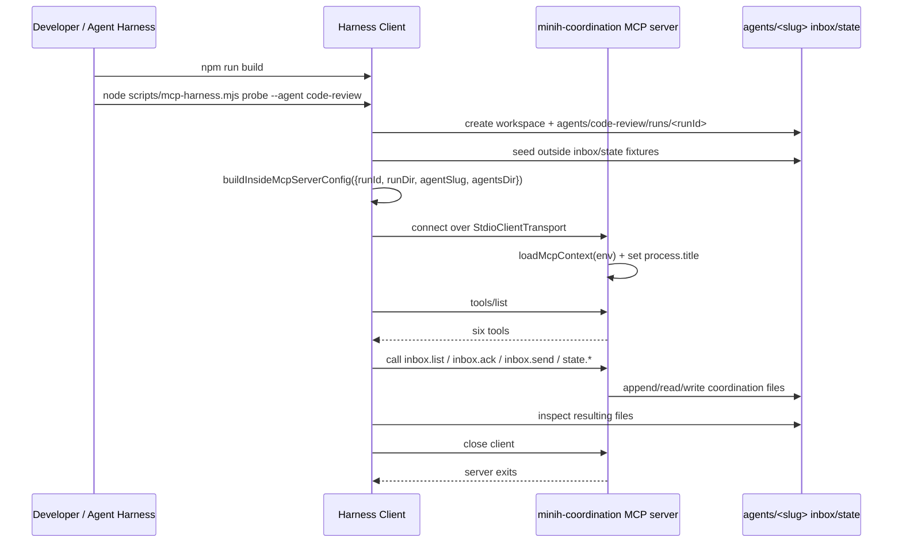

# Workshop: MCP Server Harness Standup and Probing

**Type**: Integration Pattern
**Plan**: 007-backgrounding
**Spec**: [coordination-spec.md](../coordination-spec.md)
**Created**: 2026-04-26T19:06:06+10:00
**Status**: Draft

**Related Documents**:
- [003-mcp-tool-surface.md](003-mcp-tool-surface.md) - the six tool contracts to probe
- [004-spawn-config-injection.md](004-spawn-config-injection.md) - original spawn-contract design
- [docs/domains/mcp/domain.md](../../../domains/mcp/domain.md) - current domain boundary and contracts
- [test/mcp/server.test.ts](../../../../test/mcp/server.test.ts) - real stdio MCP integration coverage
- [test/mcp/helpers/test-client.ts](../../../../test/mcp/helpers/test-client.ts) - current SDK client pattern

**Domain Context**:
- **Primary Domain**: `mcp`
- **Related Domains**: `runner` (inbox/state paths and persistence), `cli` (composition root that injects production MCP config), `adapter` (SDK-owned server lifecycle)

---

## Purpose

Clarify what it means to "get the MCP server into the harness" so developers can boot the real inside-only coordination server, call it with proper MCP tools, and inspect durable inbox/state effects without running a full model session.

This workshop drives a follow-up implementation: a small developer harness plus `docs/project-rules/harness.md` entries for Boot, Interact, and Observe.

## Key Questions Addressed

- What is the safest way to stand up the inside MCP server outside a Copilot SDK session?
- What context must the harness synthesize so `loadMcpContext()` exercises the real path-safety checks?
- How do we "poke it" using MCP protocol calls, not direct function calls or shell hacks?
- What should Boot, Interact, and Observe look like for a stdio server that has no HTTP health endpoint?
- How do we keep this a harness/dev surface rather than accidentally creating `minih serve --mcp`?

---

## Core Decision

Build a **developer harness client** around the existing production server, not a second server mode.

The harness should:

1. Run `npm run build` so the private server entry exists at `dist/mcp/server.js`.
2. Synthesize a valid coordinated run context in a temporary or explicitly supplied workspace.
3. Call `buildInsideMcpServerConfig(...)` from the built `mcp` domain.
4. Connect with `@modelcontextprotocol/sdk` `Client` + `StdioClientTransport`.
5. Exercise `client.listTools()` and `client.callTool(...)` against the real stdio server.
6. Print enough file/process evidence to prove the tools touched the expected inbox/state files and closed cleanly.

Do **not** add a public `minih serve --mcp` mode. The production feature remains an inside-only per-run server that is normally spawned by the SDK from `mcpServers`.

---

## Mental Model



Important consequence: a stdio MCP server is only "up" while a client keeps the stdio transport open. The harness is therefore the long-lived process in interactive mode; the server remains a child of that client.

---

## Harness Modes

### 1. Ephemeral probe mode (default)

Use a temp workspace, run a scripted end-to-end probe, close the client, and print results.

```bash
npm run build
node scripts/mcp-harness.mjs probe --agent code-review
```

Expected shape:

```json
{
  "status": "ok",
  "server": "minih-coordination",
  "workspace": "/var/folders/.../minih-mcp-harness/code-review",
  "runId": "harness-01J...",
  "tools": [
    "inbox.list",
    "inbox.send",
    "inbox.ack",
    "state.get",
    "state.set",
    "state.transition"
  ],
  "checks": [
    { "name": "tools/list", "status": "ok" },
    { "name": "inbox.list unread seed", "status": "ok" },
    { "name": "inbox.ack seed", "status": "ok" },
    { "name": "inbox.send inside note", "status": "ok" },
    { "name": "state.get outside", "status": "ok" },
    { "name": "state.set inside", "status": "ok" },
    { "name": "state.transition inside", "status": "ok" },
    { "name": "typed error _meta.code", "status": "ok" }
  ]
}
```

This is the automated health check. It should be fast, deterministic, and safe to run from `just fft`-adjacent workflows if needed, though it need not be part of `just fft`.

### 2. Interactive poke mode

Keep the MCP client open and provide a small REPL so a human or coding agent can call tools manually.

```bash
npm run build
node scripts/mcp-harness.mjs repl --agent code-review
```

Example session:

```text
minih-mcp> tools/list
inbox.list
inbox.send
inbox.ack
state.get
state.set
state.transition

minih-mcp> call inbox.list {"unread":true}
{
  "messages": [
    {
      "id": "01K...",
      "sender": "outside",
      "type": "note",
      "subject": "seeded outside note"
    }
  ],
  "hasMore": false
}

minih-mcp> call inbox.ack {"msgId":"01K..."}
{
  "acked": true,
  "alreadyAcked": false,
  "msgId": "01K..."
}

minih-mcp> call state.transition {"to":"complete","reason":"manual harness poke"}
{
  "transitioned": true,
  "from": "reviewing",
  "to": "complete"
}

minih-mcp> inspect
workspace: /var/folders/.../minih-mcp-harness/code-review
inside inbox: agents/code-review/inbox/inside/messages.ndjson
outside inbox: agents/code-review/inbox/outside/messages.ndjson
inside state: agents/code-review/state/inside.json
outside state: agents/code-review/state/outside.json
history: agents/code-review/state/history.ndjson

minih-mcp> exit
```

This is the "run it up, then poke it" experience.

### 3. Fixed workspace mode

Use an explicit workspace when the developer wants to inspect files after the process exits.

```bash
node scripts/mcp-harness.mjs probe \
  --agent code-review \
  --workspace /tmp/minih-mcp-harness-minih
```

The harness should create:

```text
/tmp/minih-mcp-harness-minih/
└── agents/
    └── code-review/
        ├── inbox/
        │   ├── inside/messages.ndjson
        │   └── outside/messages.ndjson
        ├── state/
        │   ├── inside.json
        │   ├── outside.json
        │   └── history.ndjson
        └── runs/
            └── harness-<id>/
```

Default should remain a temp workspace to avoid polluting the repository's real `agents/<slug>/{inbox,state}` files.

### 4. Real agent workspace mode (explicit opt-in)

Only use the repository's real `agents/` directory when the caller passes an explicit flag such as `--real-agents-dir agents`.

```bash
node scripts/mcp-harness.mjs repl \
  --agent code-review \
  --real-agents-dir agents
```

This mode writes durable messages and state into the same per-agent files a real coordinated run uses. It is useful for dogfooding but must never be the default.

---

## Boot / Interact / Observe Contract

The future `docs/project-rules/harness.md` should describe this MCP harness in the same shape plan-6 expects.

### Boot

For a stdio MCP server, "healthy" means:

1. The TypeScript project builds.
2. `resolveInsideMcpServerEntry()` can find `dist/mcp/server.js`.
3. The harness can connect with `StdioClientTransport`.
4. `tools/list` returns exactly the six reserved coordination tools.

Suggested harness entry:

```markdown
## Boot

Command:
`npm run build && node scripts/mcp-harness.mjs probe --agent code-review`

Health signal:
- JSON stdout has `"status": "ok"`.
- `"server"` is `"minih-coordination"`.
- `"tools"` is exactly `inbox.list`, `inbox.send`, `inbox.ack`, `state.get`, `state.set`, `state.transition`.
```

### Interact

Use real MCP calls through the harness client.

```markdown
## Interact

One-shot call:
`node scripts/mcp-harness.mjs call state.get --agent code-review --args '{"side":"inside"}'`

Interactive:
`node scripts/mcp-harness.mjs repl --agent code-review`

Example REPL command:
`call inbox.list {"unread":true}`
```

The `call` command may spawn a fresh MCP server per invocation. The `repl` command should keep one MCP client/server pair alive for manual poking.

### Observe

Observation should prove the server touched the right files and did not leak.

```markdown
## Observe

Command:
`node scripts/mcp-harness.mjs inspect --agent code-review --workspace /tmp/minih-mcp-harness-minih`

Evidence:
- Paths for inside/outside inbox lanes.
- Paths for inside/outside state files.
- Last few records from inside/outside inbox lanes.
- Current inside/outside state JSON.
- State history line count.
- Process marker status for `minih-mcp-<runId>` after client close.
```

Optional leak check can reuse the Phase 4 gate:

```bash
MINIH_PGREP=1 npx vitest run test/mcp/leak-regression.test.ts
```

Do not use broad process killing in the harness. If a process must be terminated, use the specific child process managed by `StdioClientTransport` / `client.close()`.

---

## Context the Harness Must Synthesize

The production server refuses to start unless these values form a valid, canonical inside context:

| Value | Source in harness | Validation expectation |
|-------|-------------------|------------------------|
| `runId` | generated `harness-<id>` | Used in process marker |
| `runDir` | `<agentsDir>/<slug>/runs/<runId>` | Must resolve inside the agent's `runs/` directory |
| `agentSlug` | `--agent <slug>` | Must pass runner slug validation |
| `agentsDir` | `<workspace>/agents` by default | Absolute, canonical |
| `MINIH_CONTEXT` | literal `inside` | Required by `loadMcpContext()` |
| `MINIH_INBOX_DIR` | derived by `buildInsideMcpServerConfig(...)` | Must equal `<agentsDir>/<slug>/inbox` |
| `MINIH_STATE_DIR` | derived by `buildInsideMcpServerConfig(...)` | Must equal `<agentsDir>/<slug>/state` |
| `MINIH_MCP_PROCESS_MARKER` | `minih-mcp-<runId>` | Must match run metadata |

The harness should not manually build env vars if it can avoid it. It should call the production function:

```ts
import { buildInsideMcpServerConfig } from '../dist/mcp/index.js';

const mcpServers = buildInsideMcpServerConfig({
  runId,
  runDir,
  agentSlug,
  agentsDir,
});
const entry = mcpServers['minih-coordination'];
```

That keeps the harness aligned with the CLI composition path.

---

## Proper MCP Client Shape

Use the same SDK pattern as `test/mcp/helpers/test-client.ts`:

```ts
import { Client } from '@modelcontextprotocol/sdk/client/index.js';
import { StdioClientTransport } from '@modelcontextprotocol/sdk/client/stdio.js';
import { buildInsideMcpServerConfig } from '../dist/mcp/index.js';

const config = buildInsideMcpServerConfig({
  runId,
  runDir,
  agentSlug,
  agentsDir,
});
const entry = config['minih-coordination'];

const transport = new StdioClientTransport({
  command: entry.command,
  args: entry.args,
  env: entry.env,
  stderr: 'pipe',
});

const client = new Client({
  name: 'minih-mcp-harness',
  version: '0.0.0',
});

await client.connect(transport);
const tools = await client.listTools();
const result = await client.callTool({
  name: 'inbox.list',
  arguments: { unread: true },
});
await client.close();
```

Avoid:

- Direct imports of `dispatchToolCall(...)` for harness probing. That bypasses JSON-RPC framing and stdio lifecycle.
- Hand-rolled JSON-RPC for the first version. We already depend on the official SDK.
- Passing raw paths or run IDs as tool arguments. Hidden context is the central security property.

---

## Script Surface Proposal

`scripts/mcp-harness.mjs` should be a small dev utility, not a shipped product command.

| Command | Purpose | Output |
|---------|---------|--------|
| `probe` | Seed a workspace, connect, list tools, call representative tools, close | JSON health envelope |
| `repl` | Keep one client/server pair open for manual tool calls | Human REPL on stderr/stdin; JSON result blocks |
| `call <tool>` | One-shot MCP tool call with JSON args | JSON call result |
| `inspect` | Show workspace paths and file summaries | JSON or human summary |
| `seed` | Create/reset a harness workspace without connecting | JSON workspace summary |
| `clean` | Delete a harness workspace | JSON result |

Suggested examples:

```bash
# Fast health check
node scripts/mcp-harness.mjs probe --agent code-review

# One-shot protocol call
node scripts/mcp-harness.mjs call inbox.list \
  --agent code-review \
  --args '{"unread":true}'

# Keep the server up and poke it repeatedly
node scripts/mcp-harness.mjs repl --agent code-review

# Inspect durable side effects
node scripts/mcp-harness.mjs inspect \
  --agent code-review \
  --workspace /tmp/minih-mcp-harness-minih
```

Keep dependencies at zero new packages. Node's `readline/promises` is enough for the REPL.

---

## Probe Scenario

The default `probe` should cover the minimum useful flow:

1. Seed an outside inbox note.
2. Seed outside state as `in-progress`.
3. Connect over stdio.
4. Assert `tools/list` equals `MCP_TOOL_NAMES`.
5. Call `inbox.list({ unread: true })` and see the seeded note.
6. Call `inbox.ack({ msgId })`.
7. Call `inbox.list({ unread: true })` again and see no unread messages.
8. Call `inbox.send({ subject, body })` and inspect the inside lane.
9. Call `state.get({ side: 'outside' })`.
10. Call `state.set({ status: 'reviewing', data: { harness: true } })`.
11. Call `state.transition({ to: 'complete', reason: 'harness probe' })`.
12. Call `inbox.ack({ msgId: 'missing' })` and assert `_meta.code === 'MCP_NOT_FOUND'`.
13. Close the client and confirm the process marker is gone when possible.

This mirrors `test/mcp/server.test.ts` but packages it as a human/agent-facing harness operation.

---

## Safety Rules

1. **Default to temp workspaces.** Never write to repository `agents/<slug>/inbox` or `agents/<slug>/state` unless the user explicitly opts in.
2. **Use production spawn config.** The harness must call `buildInsideMcpServerConfig(...)`; no duplicate env-building logic.
3. **Exercise canonical path checks.** Create `runDir` under `<agentsDir>/<slug>/runs/<runId>` so the server's context validation is real.
4. **Redact absolute context by default.** JSON output may include the harness workspace path for inspection, but never dumps the full MCP env.
5. **No public MCP serving.** This is a local developer probe for an inside-only stdio child, not a network server or external product mode.
6. **Close clients explicitly.** `repl` should close on `exit`, EOF, SIGINT, and SIGTERM.
7. **No broad process killing.** Use client/transport cleanup and PID-specific handling only if the harness owns the PID.

---

## Error and Recovery Model

| Failure | Likely cause | Harness response |
|---------|--------------|------------------|
| `MCP server entry not found` | `npm run build` not run, or `dist/` deleted | Print "run npm run build" and exit non-zero |
| `MCP_CONTEXT_INVALID` | Bad synthetic paths, missing run dir, invalid slug | Print redacted context summary and exact invalid field |
| `tools/list` missing a tool | Domain contract drift | Exit non-zero and print expected vs actual tool arrays |
| `inbox.list` returns `MCP_INBOX_CORRUPT` | Seeded malformed NDJSON or prior dirty workspace | Suggest `clean` or a fresh temp workspace |
| `state.transition` returns schema error | Invalid target status for inside schema | Print `_meta.code` and current schema source |
| Client close leaves marker alive | Lifecycle leak or process still shutting down | Wait briefly, then print marker/PID evidence; do not kill unrelated processes |

---

## Implementation Placement

Recommended file changes for the follow-up:

| File | Domain | Purpose |
|------|--------|---------|
| `scripts/mcp-harness.mjs` | dev harness | CLI-ish wrapper around SDK client for probe/repl/call/inspect |
| `docs/project-rules/harness.md` | harness docs | Boot/Interact/Observe contract consumed by future plan-6 runs |
| `docs/domains/mcp/domain.md` | mcp docs | History note that a developer harness now exercises the production stdio server |
| `.gitignore` | repo hygiene | Only needed if the harness defaults to a repo-local workspace; avoid by using OS temp |

No production `src/cli/commands/*` command is required. If this later becomes broadly useful to users, promote it deliberately in a new phase.

---

## Open Questions

### Q1: Should `scripts/mcp-harness.mjs` be TypeScript?

**RESOLVED**: Start as `.mjs` importing built `dist/mcp/index.js`.

Rationale: the harness is specifically proving the packaged/built path works. A TS harness run through `tsx` could accidentally pass while the built private server artifact is missing.

### Q2: Should the harness use the repository's real `agents/` directory?

**RESOLVED**: No by default. Use OS temp and expose `--workspace`.

Rationale: inbox/state are per-agent shared coordination files, not run-local scratch. Accidentally writing harness data into real agents would pollute later dogfood runs.

### Q3: Is MCP Inspector needed?

**RESOLVED**: Not for the first pass.

Rationale: a repo-owned SDK client gives deterministic JSON output, works in CI/headless contexts, and avoids introducing another external dev tool. MCP Inspector can be documented later as an optional manual tool if needed.

### Q4: Should this become a `minih mcp-harness` command?

**OPEN**: Keep it as a script until repeated use proves it belongs in the product.

Promotion criteria: users outside this repo need it, or it becomes part of official diagnostics. Until then, `scripts/` avoids expanding the public CLI surface.

---

## Acceptance Criteria for the Follow-Up

- `npm run build` creates the private server entry used by the harness.
- `node scripts/mcp-harness.mjs probe --agent code-review` exits 0 and reports all six tools.
- The probe calls at least one representative read, write, state transition, and typed-error path over MCP JSON-RPC.
- `node scripts/mcp-harness.mjs repl --agent code-review` keeps the server alive for repeated manual calls and closes cleanly.
- `docs/project-rules/harness.md` documents Boot, Interact, and Observe commands for this harness.
- Default operation writes only under a temp workspace or an explicitly supplied workspace.
- The harness uses `buildInsideMcpServerConfig(...)`; it does not duplicate the hidden env contract.
- No public `minih serve --mcp` mode is introduced.

