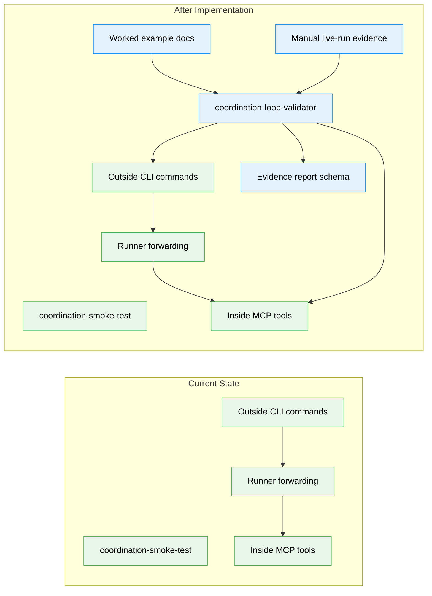

# Flight Plan: Canonical Coordination Loop Validator

**Spec**: [canonical-coordination-loop-spec.md](./canonical-coordination-loop-spec.md)  
**Plan**: [canonical-coordination-loop-plan.md](./canonical-coordination-loop-plan.md)  
**Generated**: 2026-04-27T14:56:59+10:00  
**Status**: Landed

---

## The Mission

**What we're building**: A canonical dogfooding harness and worked example named `coordination-loop-validator`. It shows how an outside agent and inside validation agent run in parallel, how the main path starts the inside validator from the outside side, how three manual milestone events are sent, and how feedback proves that messages, state, acknowledgements, prompts, and final reporting all line up.

**Why it matters**: This gives humans and agents a concrete model for minih's parallel outside/inside coordination loop before real event emitters, real background code-review agents, or many-inside-agent orchestration exist.

---

## Where We Are -> Where We're Headed

```text
TODAY:                                      AFTER this plan:
Minimal coordination smoke test             Rich canonical worked example

Existing outside CLI commands               Same commands shown as a real runbook
Existing inside MCP tools                    Same tools exercised by validator behavior
Existing daemon-light forwarding             Same forwarding proven by manual milestones
No product-shaped loop example               New coordination-loop-validator dogfood harness
No docs/how guide for the loop               New deep guide plus README/AGENTS pointers
No manual live-run evidence                  New evidence file for a real three-milestone run
```



**Legend**: existing (green) | changed (orange) | new (blue)

---

## Scope

**Goals**:
- Provide a canonical, reusable worked example for outside/inside agent conversation.
- Demonstrate the parallel inside/outside workflow with exactly three manual milestone events.
- Show that the inside agent may be started by the outside agent, started manually, or already running.
- Give outer agents a clear outside contract for messages, state, feedback, and completion.
- Give the inside agent a clear validation role for readiness, milestones, acknowledgements, state checks, feedback, and final evidence.
- Produce evidence that the coordination loop worked for each milestone.
- Keep this as a dogfooding harness that consumes existing coordination capabilities.

**Non-Goals**:
- No new framework-level agent type.
- No real source-code event emitter, daemon supervisor, IPC surface, or public MCP server.
- No real background code-review agent.
- No hidden simulation or deception-based reviewer evaluation.
- No orchestration for one outside agent managing many inside agents in parallel.
- No new runtime domain.
- No core runtime dependency on dogfood prompts, reports, or fixtures.

---

## Journey Map


**Legend**: green = done | yellow = active | grey = not started

---

## Phases Overview

| Phase | Title | Tasks | CS | Status |
|-------|-------|-------|----|--------|
| 1 | Build the worked example harness | 8 | CS-3 | Complete |

---

## Implementation Route

<!-- Updated by /plan-6 during implementation: [ ] -> [~] -> [x] -->

- [x] **Stage 1: Create validator agent** - add the coordinated prompt, outside contract, and instructions (`agents/coordination-loop-validator/` - new folder).
- [x] **Stage 2: Add schemas** - define local state schemas and report evidence schema (`agents/coordination-loop-validator/*.schema.json`, `output-schema.json` - new files).
- [x] **Stage 3: Add CLI checks** - verify doctor, outside-context, dry-run, and schema visibility (`test/cli/coordination-loop-validator.test.ts` - new file).
- [x] **Stage 4: Write deep guide** - document the real three-milestone runbook and supported startup variation (`docs/how/coordination-loop-validator.md` - new file).
- [x] **Stage 5: Add discoverability** - point README and agent authoring docs to the richer example (`README.md`, `AGENTS_README.md`).
- [x] **Stage 6: Run static validation** - prove the static and CLI surfaces work with existing commands.
- [x] **Stage 7: Document live run** - record a real manual live run with three milestones (`docs/plans/008-canonical-coordination-loop/manual-live-run-evidence.md` - new file).
- [x] **Stage 8: Final gate** - run the repository quality gate and align plan artifacts.

---

## Acceptance Criteria

- [x] `coordination-loop-validator` is identifiable as the canonical dogfooding harness, concept demonstrator, and worked example.
- [x] The outside contract explains how to ensure an inside agent is running, send milestones, publish state, read feedback, and complete the run.
- [x] The inside agent's role is explicitly coordination validation, not real code review.
- [x] The worked example covers exactly three simulated milestones before completion.
- [x] Each milestone has observable outside message, state, inside handling, feedback, and outside readback evidence.
- [x] The final report distinguishes coordination validation from code-quality validation.
- [x] The final report includes coordination-focused magic-wand feedback.
- [x] The feature adds no new runtime domain, public MCP server, daemon supervisor, or core dependency on dogfood assets.
- [x] The feature distinguishes the v1 single-inside worked example from future many-inside-agent orchestration.
- [x] Static/CLI checks and a documented real manual live run provide the first implementation's evidence.

---

## Key Risks

| Risk | Mitigation |
|------|------------|
| Prompt, outside contract, docs, and tests drift from each other. | Pin the canonical command beats in `outside.md`, mirror them in the guide, and assert visible CLI/dry-run text. |
| State commands reject harness statuses. | Use agent-local state schemas and keep every prompt/runbook command aligned with those schemas. |
| The inside agent exits before all three milestones. | Make bounded waiting and readiness publication explicit in the agent prompt and validate it in the manual run. |
| Manual evidence is hard to inspect later. | Capture command sequence, outputs, state observations, validation result, and retros output in the evidence file. |
| Work expands into runtime orchestration. | Keep domains consume-only and leave public MCP, daemon mode, source eventing, and many-inside-agent orchestration out of scope. |

---

## Flight Log

<!-- Updated by /plan-6 and /plan-6a after each phase completes -->

| 2026-04-27 | Stage 7 | Completed real live run `2026-04-27T15-25-51-655Z-a767`: readiness, three milestone cycles, completion, `validate`, and retros captured in `manual-live-run-evidence.md`. |
| 2026-04-27 | Stage 8 | `just fft` passed: Biome check/format, build, typecheck, 414 tests passed with 9 expected skips, and audit found 0 vulnerabilities. Plan/domain artifacts aligned and generated run folders cleaned. |
| 2026-04-27 | FX002 | Added private MCP `inbox_list.waitMs` blocking reads before the no-context two-agent eval; targeted MCP/preamble tests, build, and `just fft` passed. |
| 2026-04-27 | Post 003 | Ran `coordination-loop-validator` against FX002 (`2026-04-27T20-18-21-699Z-d1ca`): completed, validated, 5055 events, 45 tool calls; evidence captured in `posts/003-fx002-blocking-inbox-live-run.md`. |
