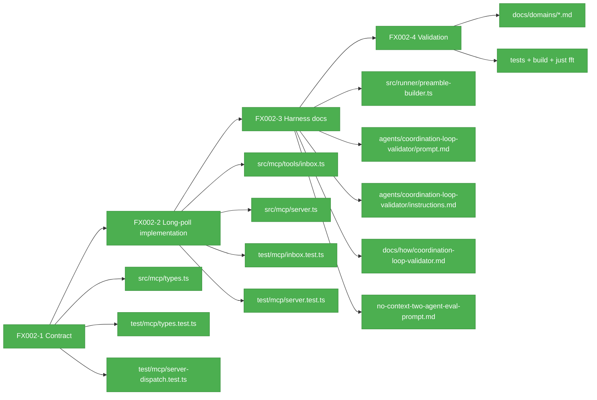

# Flight Plan: Fix FX002 — Blocking inbox list

**Fix**: [FX002-blocking-inbox-list.md](./FX002-blocking-inbox-list.md)  
**Status**: Landed

## What → Why

**Problem**: Inside agents currently sleep-poll `inbox_list` while waiting for outside milestones.  
**Fix**: Add a bounded long-poll option to `inbox_list` so the private MCP inbox read can block until a peer message arrives or a timeout expires.

## Domain Context

| Domain | Relationship | What Changes |
|--------|--------------|--------------|
| mcp | Primary owner | Add optional long-poll semantics to `inbox_list`; keep private MCP scope and run-scoped file backing. |
| runner | Contract/docs consumer | Coordinated preamble teaches the new wait parameter without importing MCP. |
| cli | Docs consumer | Existing outside commands remain unchanged; docs explain inside long-poll usage. |

## Stages

- [x] **Stage 1: Contract the wait parameter** — Add bounded millisecond `waitMs` plus `wait` result metadata to the `inbox_list` schema and contract tests.
- [x] **Stage 2: Make dispatch async-safe** — Update MCP server dispatch/request handling and tests so long-poll calls can resolve asynchronously without breaking existing tools.
- [x] **Stage 3: Implement blocking reads** — Make inbox listing wait for filter-matching outside-lane messages or timeout while preserving immediate mode and cleaning up watchers/timers.
- [x] **Stage 4: Teach the harness** — Update coordinated prompt/runbook/eval prompt wording to prefer long-poll over sleep-polling.
- [x] **Stage 5: Validate before eval** — Run targeted tests, build, and the full quality gate before the no-context two-agent eval.

## Architecture Map

## Flight Status

## Checklist

- [x] FX002-1 — Extend the `inbox_list` MCP contract.
- [x] FX002-2 — Implement long-poll behavior for inside inbox reads.
- [x] FX002-3 — Teach coordinated agents to use the blocking read.
- [x] FX002-4 — Validate the fix before the no-context eval.

## Acceptance

- [x] Existing `inbox_list` behavior is unchanged when `waitMs` is omitted.
- [x] `waitMs` is milliseconds, finite, integer, non-negative, capped at `30000`, and validated.
- [x] Long-poll returns promptly when matching messages already exist.
- [x] Long-poll wakes on a newly appended matching outside message.
- [x] Long-poll uses the full current filter set as its match predicate.
- [x] Long-poll times out cleanly with explicit `wait` metadata.
- [x] Watchers/timers are cleaned up after match, timeout, error, and overlapping calls.
- [x] Canonical docs/prompts teach the new usage.
- [x] Targeted tests, `npm run build`, and `just fft` pass.
