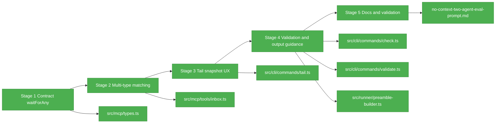

# Flight Plan: Fix FX003 - Coordination eval UX follow-ups

**Fix**: [FX003-coordination-eval-ux-followups.md](./FX003-coordination-eval-ux-followups.md)  
**Status**: Landed

## What -> Why

**Problem**: The blocking-inbox live run still exposed multi-type wait, bounded tail, validation-command, and output-path friction for fresh agents.  
**Fix**: Smooth those sharp edges before the no-context eval by extending the inside MCP wait contract, improving outside CLI snapshots, and tightening prompt/docs guidance.

## Domain Context

| Domain | Relationship | What Changes |
|--------|--------------|--------------|
| mcp | Primary owner | `inbox_list` gains backward-compatible `waitForAny` filtering for immediate and bounded wait reads. |
| cli | Primary owner | `tail` accepts bounded snapshot options; `check` and `validate` guidance becomes explicit and test-backed. |
| runner | Prompt/docs consumer | Coordinated preamble and output guidance become truthful about output path discovery and fallbacks. |
| docs/agents | Consumer | Canonical validator assets and no-context eval prompt teach the improved coordination loop. |

## Stages

- [x] **Stage 1: Contract multi-type waits** - Add `waitForAny` to the private `inbox_list` schema and direct/dispatcher tests, with explicit bounds (`minItems: 1`, `maxItems: 16`, item length 1-64), duplicate rejection, and `type` mutual exclusion.
- [x] **Stage 2: Implement multi-type matching** - Apply the new filter to immediate and waited inbox reads without changing single-type behavior.
- [x] **Stage 3: Add tail snapshots** - Support configurable `--lines` and an explicit snapshot/no-follow path for outside progress inspection.
- [x] **Stage 4: Deconfuse validation/output guidance** - Clarify `check --file` versus `validate --run` and resolve or document shell env visibility.
- [x] **Stage 5: Refresh eval materials and validate** - Update domain docs/eval prompt, run targeted tests/build/full gate, and log the evidence.

## Architecture Map

## Flight Status

## Checklist

- [x] FX003-1 - Add multi-type waits to `inbox_list` with explicit array bounds, duplicate rejection, invalid item validation, and `type` mutual exclusion.
- [x] FX003-2 - Add bounded tail snapshot UX.
- [x] FX003-3 - Make `check` vs `validate --run` hard to confuse.
- [x] FX003-4 - Resolve inside output-path environment guidance.
- [x] FX003-5 - Refresh coordination eval docs and domain records, then validate.

## Acceptance

- [x] Existing single-type and unfiltered `inbox_list` behavior remains backward-compatible.
- [x] Multi-type waits can wait for milestone/complete/cancel in one bounded call, using a non-empty array of 1-16 unique exact message types.
- [x] `tail --lines` works and a snapshot/no-follow mode exits after bounded output.
- [x] Canonical docs/examples distinguish `check --file` from `validate --run`.
- [x] Output-path guidance matches what the agent can actually rely on.
- [x] Targeted tests, `npm run build`, and `just fft` pass.
