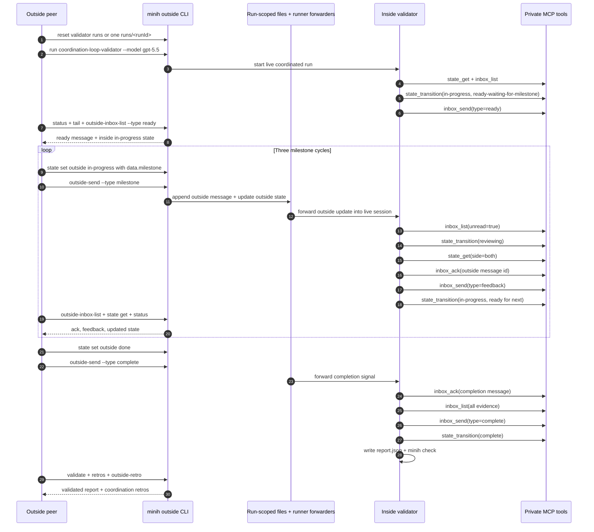

# Our First Run with the Messaging System

## TL;DR

We successfully ran the first real outside/inside messaging loop with `coordination-loop-validator`. The outside peer started and observed the inside agent, the inside agent announced readiness, the outside peer manually fired three milestone messages, and the inside agent acknowledged, inspected state, and sent useful feedback for each milestone before completing with a validated report.

The run also found and fixed a real runtime compatibility issue: dotted MCP tool names such as `inbox.list` and `state.get` loaded locally but were rejected by the backend before the first model turn. Switching the public MCP manifest to underscore names (`inbox_list`, `state_get`, etc.) unblocked live coordinated runs.

## Executive overview

This was the first product-shaped proof that minih's messaging system can support a parallel outer/inner agent workflow. It was not a source-code review and did not pretend to be one. The inside agent knew it was a coordination-loop validator in a dogfooding harness. The outside peer pretended to finish three areas of work, manually sent milestone events, and watched the inside agent respond.

The result was a full pass:

| Metric | Result |
|--------|--------|
| Run ID | `2026-04-27T15-25-51-655Z-a767` |
| Session ID | `b0475e42-8f2a-447b-90f5-9d3b653f2854` |
| Requested model | `gpt-5.5` |
| Result | `completed` |
| Duration | `363.8s` |
| Events | `5372` |
| Tool calls | `45` |
| Final validation | `minih validate coordination-loop-validator` returned `validated: true` |
| Quality gate after implementation | `just fft` passed: 414 tests passed, 9 expected skips, audit 0 vulnerabilities |

The main takeaway: the messaging loop is viable. The outside side can drive a manual event stream, the inside side can wait, process, acknowledge, and respond, and the resulting evidence is readable from outside-facing commands.

Post-run correction: this first run also taught us that mutable `inbox`, `state`, history, and forwarder watermark files should be scoped to the run, not the agent. The historical transcript below used the then-current agent-scoped cleanup commands; current guidance treats `agents/<slug>/runs/<runId>/` as the conversation boundary.

## What actually happened

### Setup

At the time, we reset generated artifacts for the validator agent like this:

```bash
rm -rf agents/coordination-loop-validator/inbox \
       agents/coordination-loop-validator/state \
       agents/coordination-loop-validator/runs
```

Current runs should reset or inspect generated artifacts at the run boundary instead:

```bash
rm -rf agents/coordination-loop-validator/runs
# or remove one specific conversation:
rm -rf agents/coordination-loop-validator/runs/<runId>
```

Both sides started from synthetic idle state:

```json
{
  "outside": { "status": "idle", "data": {} },
  "inside": { "status": "idle", "data": {} }
}
```

### Runtime blocker

The first coordinated live attempts failed before any useful model turn. Both the new `coordination-loop-validator` and the existing `coordination-smoke-test` hit CAPI 400 after the private MCP server loaded.

That told us the issue was not the new prompt. The shared MCP tool manifest was the load-bearing problem. The backend accepted the server but rejected tool names with dots.

We changed the exposed tool names:

| Before | After |
|--------|-------|
| `inbox.list` | `inbox_list` |
| `inbox.send` | `inbox_send` |
| `inbox.ack` | `inbox_ack` |
| `state.get` | `state_get` |
| `state.set` | `state_set` |
| `state.transition` | `state_transition` |

The dispatcher still accepts dotted names as local aliases, but prompts and the public MCP manifest now use underscore names. After that change, the live run crossed the previous failure point and completed.

## Observed back-and-forth



Today the outside CLI commands in this sequence should pass `--run <runId>` once the run exists, unless minih can resolve a single unambiguous active run.

## Message transcript summary

| Step | Outside message | Inside response | State observation |
|------|-----------------|-----------------|-------------------|
| Ready | n/a | Ready message `01KQ6PDXF73HYHP61RV5CAGDFX` | Inside `in-progress`, `data.phase=ready-waiting-for-milestone`; outside `idle` |
| Milestone 1 | `01KQ6PEGBP6T44RA3Q9J7V28FR` for parser boundary | Ack `01KQ6PF82S684X59C6DNFQV7PC`, feedback `01KQ6PF82TX1Y74GM6QNXXC7VZ` | Outside `in-progress`, milestone `area-1`; inside moved through `reviewing` then back to `in-progress` |
| Milestone 2 | `01KQ6PFHMCVC3GAEDR3NSFESQ0` for runner handoff | Ack `01KQ6PGEG8Q7MPETAM4WC4R6YX`, feedback `01KQ6PGEG96ZS3JRPM9E056AH0` | Outside `in-progress`, milestone `area-2`; inside recorded completed milestones `area-1`, `area-2` |
| Milestone 3 | `01KQ6PGQAD06DS9PSV5VR1H7ED` for documentation handoff | Ack `01KQ6PHM7BQRS70FC8G6DJWC96`, feedback `01KQ6PHM7BQRS70FC8G6DJWC97` | Outside `in-progress`, milestone `area-3`; inside reported all three milestones validated and waited for completion |
| Completion | `01KQ6PHX7NYBFJRY04WN6AZHKN` | Completion ack `01KQ6PJMBP8ZB2130FM3B9E080`, complete message `01KQ6PJZREJJJ5VMCYZTAZTMB2` | Outside `done`; inside `complete`; report validated |

## Review of the inside agent's actual work

### What it did well

The inside validator did the right kind of work for this harness:

1. **It understood the role.** It repeatedly framed itself as a coordination validator, not a code reviewer.
2. **It announced readiness before work arrived.** It published inside state and sent a `ready` message before milestone 1.
3. **It used the messaging system as intended.** It called `inbox_list`, `inbox_ack`, `inbox_send`, `state_get`, and `state_transition` throughout the run.
4. **It kept status values schema-compatible.** Workflow labels stayed in `data.phase`, `data.milestone`, message bodies, and the report rather than being used as invalid `status` values.
5. **It gave useful feedback.** Each milestone response assessed message clarity, state coherence, and whether the handoff was actionable for a future reviewer-style agent.
6. **It completed cleanly.** It waited for outside `done` plus a completion message, acknowledged that completion message, sent a final inside message, wrote `report.json`, and got `minih check` to pass.

### Where it struggled

The agent also exposed several real harness rough edges:

1. **Polling is too improvised.** The prompt said bounded polling, but did not specify cadence or timeout. The agent chose `sleep 15` loops. That worked, but it is not a clean product primitive.
2. **The final report took iteration.** The agent wrote a report, ran `minih check`, got an error/degraded result, inspected the issue, rewrote the report, and then passed. This is good recovery behavior, but it shows the schema is strict enough that agents need clearer report examples.
3. **Stale forwarded notifications arrived after logical completion.** After the report passed, `tail` showed stale milestone/completion notifications being reprocessed as "already handled." The agent handled them safely, but the transcript was noisy.
4. **Environment expectations were confusing.** The agent noted `MINIH_OUTPUT_PATH` appeared empty from one shell context and used the prompt-provided output path instead. That did not break the run, but it is a confusing affordance.
5. **Status stayed active while the agent was effectively done.** There was a period where inside state was already `complete` and `minih check` had passed, but `status` still reported the run active until the session finally idled.
6. **Agent-scoped mutable state was the wrong boundary.** The first run was single-threaded, so it worked, but overlapping same-agent runs would have shared inbox, state, and watermarks. FX001 corrected this by moving mutable coordination files under `runs/<runId>/`.

## What this proved

This first run proved that the basic messaging model works:

- The outside peer can start and observe an inside agent.
- The inside agent can communicate readiness before receiving work.
- The outside peer can manually fire "events" by sending messages and updating state.
- The runner/forwarder path delivers outside changes into the live inside session.
- The inside agent can acknowledge each outside message, which gives us durable proof of handling.
- The outside peer can read inside feedback without inspecting private internals.
- State is useful as shared context when status stays simple and workflow detail lives in `data`.
- Run-scoped coordination state is the right conversation boundary; agent-level mutable state would collide across overlapping runs of the same agent.
- Final validation and retros can be driven from outside-facing commands.

Most importantly, the run demonstrated the user value from the spec: this feature is about validating the coordination loop itself, not judging real code quality.

## Retro

### Worked well

- **The outside contract was actionable.** The outside side could follow the runbook without inventing missing steps.
- **`status` and `tail` were the right observation pair.** `status` gave compact run state; `tail` gave confidence that the inside agent was alive and calling tools.
- **The inside role was honest.** Because the agent knew this was a harness, it focused on message/state quality instead of pretending to review code.
- **The ack/feedback pattern is strong.** Every milestone had an outside message id, an inside ack id, and an inside feedback id.
- **The live run found a real platform issue.** Dotted MCP tool names looked fine locally but failed in the actual backend path. This is exactly why a dogfood harness matters.

### Confusing

- **Polling guidance was under-specified.** "Reasonable bounded wait" leaves too much room for agent-specific behavior.
- **The active/done transition is not crisp from the outside.** Inside state can say `complete` before the SDK session has idled and `completed.json` exists.
- **The final report schema needs examples.** The agent was able to self-correct, but the first report did not validate.
- **The distinction between MCP tools and outside CLI commands is easy to blur.** The runbook is clear, but any stale dotted tool docs can send agents down the wrong path.

### Magic wand

If we had a magic wand, we would add three product affordances:

1. **`inbox_wait` or equivalent blocking receive.** Let the inside agent wait for a message with a timeout instead of hand-rolling `sleep` plus `inbox_list`.
2. **A transcript command.** Something like `minih transcript coordination-loop-validator` that summarizes ready messages, milestone ids, ack ids, feedback ids, state transitions, validation, and retros in one outside-facing report.
3. **A sharper completion signal.** Once inside state is `complete` and the report validates, outside `status` should make that logical completion easier to distinguish from SDK/session idle completion.

## Recommended follow-ups

| Follow-up | Why it matters | Candidate scope |
|-----------|----------------|-----------------|
| Add `inbox_wait` or a documented polling convention | Reduces agent-specific polling behavior and lowers token/time waste | New coordination MCP tool or prompt-level convention |
| Add transcript summarization | Makes evidence review cheap and avoids hand-curated transcripts | CLI command reading inbox/state/events/completed metadata |
| Improve report examples | Prevents report rewrite loops and makes schema expectations clearer | `docs/how` plus validator prompt/schema examples |
| Investigate stale post-completion notifications | Reduces tail noise and avoids unnecessary final turns | Runner forwarder/session terminal-condition follow-up |
| Clarify logical vs session completion in `status` | Makes outside monitoring easier during long tail/idle windows | CLI status display enhancement |

## Bottom line

The first run with the messaging system succeeded. It proved the architecture can support the loop we want: an outside agent manually signals progress, an inside agent validates/acknowledges/responds, and the whole thing leaves enough evidence for humans and future agents to trust what happened.

It also showed us the next layer of product work. The system works, but the ergonomics want a blocking inbox wait, a transcript view, and a crisper final-state story.
