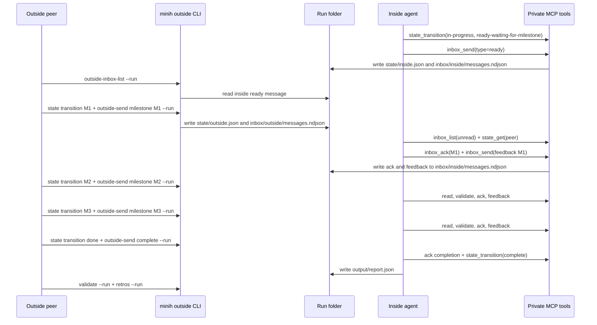

# Run-Scoped Rerun Evidence

## TL;DR

FX001's run-scoped coordination model worked in a real `gpt-5.5` dogfood run. The inside agent announced readiness, processed three outside milestones, acknowledged every outside message, sent observable feedback, accepted the completion signal, wrote a schema-valid report, and completed with `validated: true`.

The mutable conversation artifacts stayed under the run folder:

```text
agents/coordination-loop-validator/runs/2026-04-27T19-13-21-327Z-ebc1/
  inbox/{outside,inside}/messages.ndjson
  state/{outside,inside}.json
  state/history.ndjson
  state/sdk-watermark.json
```

## Executive Overview

This was the first live run after correcting the coordination boundary from agent-scoped mutable state to run-scoped mutable state. The run was intentionally driven through the public outside CLI surfaces using `--run 2026-04-27T19-13-21-327Z-ebc1`, while the inside agent used the private run-scoped MCP tools.

The important product result: the outside and inside sides both used the run id as the conversation handle. Messages, acknowledgements, state transitions, report artifacts, snapshots, and watermarks were all associated with the same run folder. No agent-level `inbox/` or `state/` folder was needed for the live exchange.

## Run Summary

| Field | Value |
|-------|-------|
| Agent | `coordination-loop-validator` |
| Model | `gpt-5.5` |
| Run id | `2026-04-27T19-13-21-327Z-ebc1` |
| Session id | `710ee342-a13f-4cd2-8e4c-eff79f70f385` |
| Result | `completed` |
| Duration | `455.4s` |
| Events | `5622` |
| Tool calls | `55` |
| Validation | Passed |
| Report | `agents/coordination-loop-validator/runs/2026-04-27T19-13-21-327Z-ebc1/output/report.json` |

Note: the CLI warned that `gpt-5.5` was not in `copilot-sdk`'s registered model list and continued anyway. The run completed successfully with that model argument.

## Observed Back-and-Forth



## Message Evidence

| Step | Outside message | Inside ack | Inside feedback/result |
|------|-----------------|------------|------------------------|
| Ready | n/a | n/a | Ready `01KQ73EGRVDXA2S3ETRKCHBZ39` |
| M1 run-scoped path contract | `01KQ73FV8X0TQRMMDNAJSB244A` | `01KQ73GTCEZB44GK14J8HQHJYC` | Feedback pass `01KQ73GTCF6DQ6KCQV5ZMPJAG8` |
| M2 runtime/MCP/CLI wiring | `01KQ73J5KP1MWV7VJ3C2JYBWGE` | `01KQ73K6BT9DVQS92Q1ZK4VG2Y` | Feedback pass `01KQ73K6BT9DVQS92Q1ZK4VG2Z` |
| M3 isolation/docs/evidence | `01KQ73KQ9P45VWT188BZA8AHDQ` | `01KQ73MB5SPT19A74W1JTBEK7S` | Feedback pass `01KQ73MB5TQ0BBQH4HW5E37EK2` |
| Completion | `01KQ73N1071JJS0A68XWSJDYBY` | `01KQ73N80KKCC4VHXBKZZ0M15M` | Final pass `01KQ73ND2DJ01GZVFTH66FQJ71` |

## State Evidence

| Side | Final status | Important data |
|------|--------------|----------------|
| Outside | `done` | `milestone: "complete"`, `phase: "completion"`, `milestonesSent: ["M1", "M2", "M3"]` |
| Inside | `complete` | `milestonesProcessed: 3`, `outsideCompletionReceived: true`, `phase: "writing-final-report"` |

The report also confirmed schema-compatible status vocabularies:

- Outside statuses: `idle`, `in-progress`, `done`
- Inside statuses: `idle`, `in-progress`, `reviewing`, `complete`
- Workflow-specific labels stayed in `data.phase`, `data.milestone`, message text, or report fields.

## Validation Evidence

Commands used during the rerun:

```bash
node dist/cli/index.js run coordination-loop-validator --model gpt-5.5 --timeout 900
node dist/cli/index.js status coordination-loop-validator --run 2026-04-27T19-13-21-327Z-ebc1
node dist/cli/index.js tail coordination-loop-validator --run 2026-04-27T19-13-21-327Z-ebc1
node dist/cli/index.js outside-inbox-list coordination-loop-validator --run 2026-04-27T19-13-21-327Z-ebc1
node dist/cli/index.js state get coordination-loop-validator --run 2026-04-27T19-13-21-327Z-ebc1 --side both
node dist/cli/index.js validate coordination-loop-validator --run 2026-04-27T19-13-21-327Z-ebc1
node dist/cli/index.js retros --agent coordination-loop-validator --run 2026-04-27T19-13-21-327Z-ebc1 --target coordination
```

Results:

- `status` reported `completed`, session `710ee342-a13f-4cd2-8e4c-eff79f70f385`, `5622` events, and `55` tool calls.
- `tail` followed the live exchange and exited when the run completed.
- `validate` returned `validated: true` with no errors.
- The final report's `verdict` is `pass`.
- `retros` returned one coordination-targeted inside retrospective entry.
- `just fft` passed before the live rerun: lint, format, build, typecheck, tests, and audit.

## Retro / Magic Wand

What worked well:

- Run-scoped state prevented cross-run contamination by construction; all mutable files were attached to one run id.
- The outside `--run` flag made the conversation target explicit and visible in command envelopes.
- MCP tools were straightforward from inside the run: `inbox_list`, `inbox_send`, `inbox_ack`, `state_get`, and `state_transition` formed a complete coordination vocabulary.
- The inside agent gave useful milestone feedback rather than only binary acks.

What was confusing:

- The inside agent initially tried `npx minih check` without the exact run output context, then inspected the schema and rewrote the report into the required shape.
- Runner env vars such as `MINIH_OUTPUT_PATH` were visible to MCP context but not to bash subshells launched by the agent, so the inside agent used the explicit output path from the prompt preamble.
- Polling required sleeps; the inside agent used bounded waits like `sleep 8`, `sleep 10`, `sleep 12`, and `sleep 15`.

Magic wand:

- Add a blocking or long-polling inbox read, for example `inbox_list --wait 30`, so the inside agent can wait for outside messages without arbitrary sleep intervals.

## Takeaway

The FX001 correction is validated by a real conversation, not just unit tests. The run folder is now the coordination boundary, and the outside/inside protocol is observable enough to act as the canonical worked example for future many-inside-agent orchestration.
