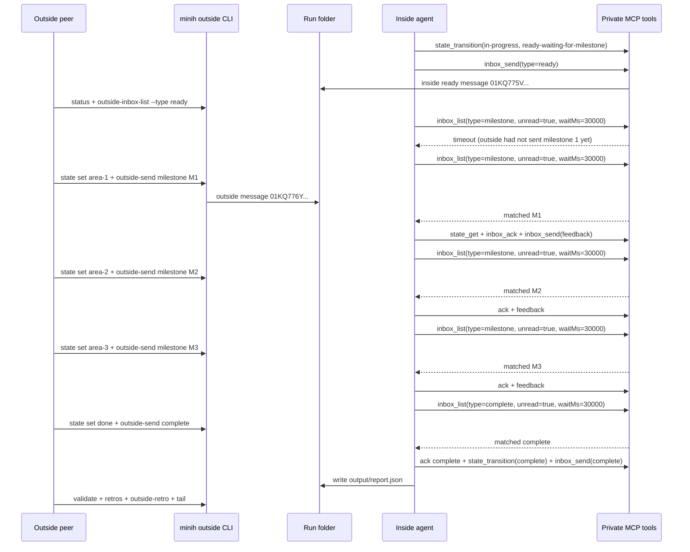

# FX002 Blocking Inbox Live Run

## TL;DR

FX002 worked in a real `coordination-loop-validator` run. The inside agent used bounded `inbox_list.waitMs` long-polls for milestones and completion, processed three outside milestones, acknowledged every outside message, sent useful feedback, wrote a schema-valid report, and completed with `validated: true`.

The run also produced the next coordination magic wand: add a `waitForAny` mode so an inside agent can wait for multiple message types such as `milestone`, `complete`, or `cancel` in one bounded call.

## Executive Overview

This was the first live run after adding private MCP blocking inbox reads. The goal was not to retest the whole product from scratch; it was to prove that inside agents no longer need to invent sleep-poll loops while waiting for outside peer messages.

The behavior was visible from outside:

- `minih status` showed `inbox_list` calls with `waitMs: 30000`.
- The first wait timed out because the outside peer had not sent milestone 1 yet.
- Subsequent waits caught milestone 1, milestone 2, milestone 3, and completion without agent-authored sleep loops.
- `minih tail` on the completed run showed the final report write and `minih check` success.

## Run Summary

| Field | Value |
|-------|-------|
| Branch | `007-backgrounding` |
| Commit tested | `49b786b` |
| Agent | `coordination-loop-validator` |
| Model | `gpt-5.5` |
| Run id | `2026-04-27T20-18-21-699Z-d1ca` |
| Session id | `694a5537-fc10-4c33-8111-ce35ae0d15bd` |
| Result | `completed` |
| Duration | `352.3s` |
| Events | `5055` |
| Tool calls | `45` |
| Validation | `minih validate coordination-loop-validator --run 2026-04-27T20-18-21-699Z-d1ca` returned `validated: true` |
| Outside retro id | `01KQ77H5EVGDM5ACZF3MSRFS33` |

The CLI warned that `gpt-5.5` was not in `copilot-sdk`'s registered model list and continued anyway. The run completed successfully with that requested model.

## Observed Back-and-Forth



## Message Evidence

| Step | Outside message | Inside ack | Inside feedback/result |
|------|-----------------|------------|------------------------|
| Ready | n/a | n/a | Ready `01KQ775VJHC49Y4YTDA0S3NX4J` |
| M1 parser boundary | `01KQ776YQC2X6FFDXD0YFFCM69` | `01KQ777EVQMMGRYFJ2BX1EFHV5` | Feedback `01KQ777EVS9DMN99K0VHCG1YPA` |
| M2 runner handoff | `01KQ777WWMBQJ71HA0DZVK5JBP` | `01KQ7786ZCF2CV5WD9GB0B3GK3` | Feedback `01KQ7786ZDCQFXZ9A3B4T58XKB` |
| M3 documentation handoff | `01KQ778SXSQNGXPJNA6A5KQ3NC` | `01KQ7793AN8GCDN5MQMECECWEW` | Feedback `01KQ7793AN8GCDN5MQMECECWEX` |
| Complete | `01KQ779S19CJVXJ7HQKEQM0C4N` | `01KQ779WW2TQHABK018Q6B30AR` | Final complete `01KQ77A70N66Z8XAZ91NK5S1BY` |

## Commands Used

```bash
node dist/cli/index.js run coordination-loop-validator --model gpt-5.5 --timeout 900

RUN_ID=2026-04-27T20-18-21-699Z-d1ca

node dist/cli/index.js status coordination-loop-validator --run "$RUN_ID"
node dist/cli/index.js outside-inbox-list coordination-loop-validator --run "$RUN_ID" --type ready
node dist/cli/index.js state get coordination-loop-validator --run "$RUN_ID" --side both

node dist/cli/index.js state set coordination-loop-validator --run "$RUN_ID" --side outside --status in-progress --data-json '{"phase":"milestone-ready","milestone":"area-1","summary":"Parser boundary handoff is ready for coordination validation"}'
node dist/cli/index.js outside-send coordination-loop-validator --run "$RUN_ID" --type milestone --subject "area-1 ready for validation" --body "Pretend work area 1 is complete: parser boundary handoff. Validate message/state coherence, acknowledge this message, and send coordination-focused feedback."

node dist/cli/index.js state set coordination-loop-validator --run "$RUN_ID" --side outside --status in-progress --data-json '{"phase":"milestone-ready","milestone":"area-2","summary":"Runner handoff is ready for coordination validation"}'
node dist/cli/index.js outside-send coordination-loop-validator --run "$RUN_ID" --type milestone --subject "area-2 ready for validation" --body "Pretend work area 2 is complete: runner handoff. Validate that the inside agent can read state, acknowledge the message, and reply with useful feedback."

node dist/cli/index.js state set coordination-loop-validator --run "$RUN_ID" --side outside --status in-progress --data-json '{"phase":"milestone-ready","milestone":"area-3","summary":"Documentation handoff is ready for coordination validation"}'
node dist/cli/index.js outside-send coordination-loop-validator --run "$RUN_ID" --type milestone --subject "area-3 ready for validation" --body "Pretend work area 3 is complete: documentation handoff. Validate final milestone coordination and tell me whether the loop is ready to finish."

node dist/cli/index.js state set coordination-loop-validator --run "$RUN_ID" --side outside --status done --data-json '{"phase":"complete","milestones":["area-1","area-2","area-3"],"summary":"All three simulated milestones were sent and acknowledged"}'
node dist/cli/index.js outside-send coordination-loop-validator --run "$RUN_ID" --type complete --subject "manual validation complete" --body "All three fake work areas have been sent. Produce the final coordination validation report with workedWell, confusing, and magicWand feedback."

node dist/cli/index.js validate coordination-loop-validator --run "$RUN_ID"
node dist/cli/index.js retros --agent coordination-loop-validator --run "$RUN_ID" --target coordination
node dist/cli/index.js outside-retro coordination-loop-validator --run "$RUN_ID" --body "..."
node dist/cli/index.js tail coordination-loop-validator --run "$RUN_ID"
```

## Validation Result

`minih validate` passed:

```json
{
  "runId": "2026-04-27T20-18-21-699Z-d1ca",
  "validated": true,
  "errors": [],
  "previousResult": "completed"
}
```

`minih tail` on the completed run ended with:

```text
Run Complete
  Result:     completed
  Duration:   352.3s
  Events:     5055 (45 tool calls)
  Validated:  yes
```

## Retrospective

### Worked well

- `waitMs` long-polling was visible and understandable in `minih status`.
- The inside agent used `inbox_list({ unread: true, type: "milestone", waitMs: 30000 })` and `inbox_list({ unread: true, type: "complete", waitMs: 30000 })`.
- The inside agent acknowledged every outside message and sent readable feedback after each milestone.
- Outside `status`, `outside-inbox-list`, and `state get --side both` were enough to track the run without reading private internals.
- Plain `minih tail` worked well after completion for a compact final confirmation.

### Confusing

- `minih tail --lines 20` is not supported. A bounded tail snapshot would be useful for live progress without starting a long-following command.
- The inside agent first tried `npx minih check coordination-loop-validator --run <runId>`, but `check` does not accept `--run`. It recovered with `minih check coordination-loop-validator --file <report>`.
- The inside agent again observed that `MINIH_OUTPUT_PATH` and related variables were not visible inside its bash shell, so it inferred the output path from the prompt text.
- The first milestone wait timed out because the outside peer sent M1 after the first 30s wait. This is correct behavior, but it made the agent briefly wonder whether the peer had started.

### Magic wand

Inside agent magic wand:

> Add a `waitForAny` mode to `inbox_list` that accepts an array of types, for example `["milestone", "complete", "cancel"]`, and returns whichever arrives first.

Outside peer magic wand:

> Add a bounded tail snapshot option and make `check`/`validate` run-target guidance impossible to confuse.

## Outcome

FX002 is validated by a real live coordination run. Blocking inbox reads solved the sleep-polling problem for the normal milestone path, and the next improvement is now clearer: support multi-type waits for more flexible terminal conditions.
