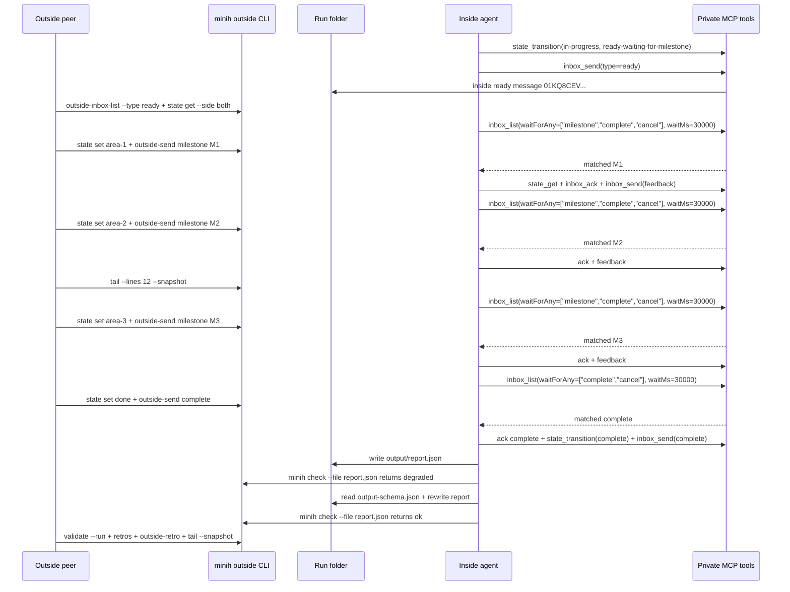

# Post-FX003 Communication Validation Run

## TL;DR

FX003 worked in a fresh `coordination-loop-validator` run. The inside agent used multi-type `waitForAny` long-polls, processed all three outside milestones, acknowledged every outside message, sent useful feedback after each milestone, handled the completion signal, wrote a schema-valid report, and the completed run validated successfully.

The run also found one remaining communication sharp edge: the final report schema is strict enough that the inside agent's first report draft failed `minih check --file`, then the agent read `output-schema.json`, rewrote the report, and passed. The next magic wand is a coordination timeline and/or schema-shaped report preview so the whole exchange and report contract are visible in one place.

## Run Summary

| Field | Value |
|-------|-------|
| Branch | `007-backgrounding` |
| Base commit tested | `1bf765e` |
| Working tree | FX003 implementation working tree, 30 changed paths before this post |
| Agent | `coordination-loop-validator` |
| Model | `gpt-5.5` |
| Run id | `2026-04-28T07-10-06-449Z-e403` |
| Session id | `73e9ae6a-17b9-4af8-9dea-b5633bbd2831` |
| Result | `completed` |
| Duration | `336.7s` |
| Events | `4842` |
| Tool calls | `40` |
| Validation | `minih validate coordination-loop-validator --run 2026-04-28T07-10-06-449Z-e403` returned `validated: true` |
| Inside retro | Present in `output/report.json`, target `coordination` |
| Outside retro id | `01KQ8CT988R6PAQ2KKZSGDHSDK` |

The CLI again warned that `gpt-5.5` was not in the Copilot SDK registered model list and continued anyway. The run completed successfully with that requested model.

## What Was Being Revalidated

This run intentionally exercised the post-FX003 communication improvements:

- inside MCP `inbox_list` can wait on multiple message types with `waitForAny`;
- outside can use `tail --lines <n> --snapshot` for bounded live observation;
- `check --file` is used for explicit report validation, while `validate --run` is used for completed run validation;
- mutable inbox/state artifacts are run-scoped, so outside commands consistently target `--run "$RUN_ID"`.

## Observed Back-and-Forth



## Message Evidence

| Step | Outside message | Inside ack | Inside feedback/result |
|------|-----------------|------------|------------------------|
| Ready | n/a | n/a | Ready `01KQ8CEVV4GFN9S9M5MAEJZ7PP` |
| M1 post-FX003 multi-type wait handoff | `01KQ8CFQSNPHFV92CRM9GFF3VV` | `01KQ8CG0R4VEH41JZ8AVRY8A1R` | Feedback `01KQ8CG8C624YKX9FZVGA9MRW7` |
| M2 bounded tail snapshot handoff | `01KQ8CGRZEQ330RMW63ZV1M9H5` | `01KQ8CH1SPEBJFYSSQVXHAKPQP` | Feedback `01KQ8CH7WNDC8MTTY53WDHA2ZF` |
| M3 docs/output validation handoff | `01KQ8CHT287XEMM4PQRPYP2WXV` | `01KQ8CJ2F8TAE3YEEVEQ6XZP2A` | Feedback `01KQ8CJ8PFMNQW9YJZ947YYGDS` |
| Complete | `01KQ8CJRHQGGQ4EM8HFD1FVME2` | `01KQ8CJWJVFVMD9GTHAR4JDE99` | Final complete `01KQ8CK4XEX5SE0M78A12D8ZJQ` |

## Commands Used

```bash
node dist/cli/index.js run coordination-loop-validator --model gpt-5.5 --timeout 900

RUN_ID=2026-04-28T07-10-06-449Z-e403

node dist/cli/index.js status coordination-loop-validator --run "$RUN_ID"
node dist/cli/index.js outside-inbox-list coordination-loop-validator --run "$RUN_ID" --type ready
node dist/cli/index.js state get coordination-loop-validator --run "$RUN_ID" --side both

node dist/cli/index.js state set coordination-loop-validator --run "$RUN_ID" --side outside --status in-progress --data-json '{"phase":"milestone-ready","milestone":"area-1","summary":"Post-FX003 multi-type wait handoff is ready for coordination validation"}'
node dist/cli/index.js outside-send coordination-loop-validator --run "$RUN_ID" --type milestone --subject "area-1 ready for validation" --body "Pretend work area 1 is complete: post-FX003 multi-type wait handoff. Validate that the inside agent can use waitForAny, read outside state, acknowledge this message, and send coordination-focused feedback."

node dist/cli/index.js state set coordination-loop-validator --run "$RUN_ID" --side outside --status in-progress --data-json '{"phase":"milestone-ready","milestone":"area-2","summary":"Post-FX003 bounded tail snapshot handoff is ready for coordination validation"}'
node dist/cli/index.js outside-send coordination-loop-validator --run "$RUN_ID" --type milestone --subject "area-2 ready for validation" --body "Pretend work area 2 is complete: bounded tail snapshot and suffix-read startup. Validate that progress can be observed with tail --lines --snapshot, acknowledge this message, and reply with useful coordination feedback."
node dist/cli/index.js tail coordination-loop-validator --run "$RUN_ID" --lines 12 --snapshot

node dist/cli/index.js state set coordination-loop-validator --run "$RUN_ID" --side outside --status in-progress --data-json '{"phase":"milestone-ready","milestone":"area-3","summary":"Post-FX003 docs and output validation guidance handoff is ready for coordination validation"}'
node dist/cli/index.js outside-send coordination-loop-validator --run "$RUN_ID" --type milestone --subject "area-3 ready for validation" --body "Pretend work area 3 is complete: docs, eval prompt, and literal output-path validation guidance. Validate final milestone coordination, acknowledge this message, and tell me whether the loop is ready to finish."

node dist/cli/index.js state set coordination-loop-validator --run "$RUN_ID" --side outside --status done --data-json '{"phase":"complete","milestones":["area-1","area-2","area-3"],"summary":"All three simulated post-FX003 milestones were sent, acknowledged, and received feedback"}'
node dist/cli/index.js outside-send coordination-loop-validator --run "$RUN_ID" --type complete --subject "manual validation complete" --body "All three fake post-FX003 work areas have been sent and feedback was observed. Produce the final coordination validation report, including workedWell, confusing, and magicWand feedback about the communication experience."

node dist/cli/index.js validate coordination-loop-validator --run "$RUN_ID"
node dist/cli/index.js retros --agent coordination-loop-validator --run "$RUN_ID" --target coordination
node dist/cli/index.js outside-retro coordination-loop-validator --run "$RUN_ID" --body "..."
node dist/cli/index.js tail coordination-loop-validator --run "$RUN_ID" --lines 30 --snapshot
```

## Validation Result

`minih validate` passed:

```json
{
  "runId": "2026-04-28T07-10-06-449Z-e403",
  "validated": true,
  "errors": [],
  "previousResult": "completed"
}
```

`minih tail --lines 30 --snapshot` on the completed run ended with:

```text
Run Complete
  Result:     completed
  Duration:   336.7s
  Events:     4842 (40 tool calls)
  Validated:  yes
```

## Retrospective

### Worked well

- `waitForAny` was the biggest improvement. The inside agent waited on milestones and terminal messages without sleep-polling and without separate single-type waits.
- The outside state/inbox commands were unambiguous because every command targeted the current run id.
- `tail --lines --snapshot` gave useful live evidence without attaching a long-following process.
- The inside agent acknowledged all four outside messages: three milestones plus completion.
- The inside agent self-repaired after the first report check failed, then completed with `validated: true`.

### Confusing

- The communication loop itself was smooth; the only friction was the report shape. The first JSON report was coordination-correct but schema-degraded, so the agent had to read `output-schema.json` and rewrite the report.
- The output schema field names are precise (`outsideMessage`, `stateEvidence`, `outsideReadback`, etc.) but not fully obvious from the prose prompt alone.

### Magic wand

Inside agent magic wand:

> Add a coordination timeline view that shows interleaved inside/outside events (messages, acks, state transitions) in chronological order -- something like `minih coordination-timeline <agent> --run <id>` that merges inbox and state history into a single time-ordered stream for post-run debugging and evidence review.

Outside peer magic wand:

> Add a coordination timeline view and/or schema-shaped report preview so the outside peer can see readiness, messages, acks, state transitions, output writes, check failures, and repaired validation in one chronological artifact.

## Outcome

FX003 is validated by a real post-implementation coordination run. Multi-type waits, bounded tail snapshots, run-scoped state/inbox targeting, explicit file checking, and run validation all worked together. The next improvement is now clearer: make coordination evidence and output schema expectations easier to inspect before a report is written.
