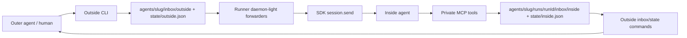

# Research Report: Canonical Coordination Loop Validator

**Generated**: 2026-04-27T00:00:00Z  
**Research Query**: "Set this up as the canonical example of the back-and-forth outside/inside conversation, and move the workshop into it."  
**Mode**: Pre-Plan / Plan-Associated  
**Location**: `docs/plans/008-canonical-coordination-loop/research-dossier.md`  
**FlowSpace**: Available  
**Findings**: 70 subagent findings synthesized  

## Executive Summary

### What It Does

Minih already has the runtime primitives for coordinated outside/inside conversation: an outside peer uses CLI commands to write inbox/state files, a live coordinated run forwards outside changes into the SDK session, and the inside agent responds through private MCP tools. This new plan should turn those primitives into the canonical dogfooding harness and concept demonstrator: `coordination-loop-validator`, a worked example that validates manual milestone messages, state coherence, replies, acknowledgements, and final feedback.

### Business Purpose

The existing `coordination-smoke-test` proves the low-level tooling works. The new canonical loop validator should prove the product-shaped workflow as a reusable worked example: run outside and inside agents in parallel, manually fire "I finished this area" events from the outer agent, observe useful replies, and produce evidence that both sides can cooperate before real event emitters, real background code-review agents, or many-inside-agent orchestration exist.

### Key Insights

1. **This is a leaf dogfooding harness, concept demonstrator, and worked example, not a new runtime feature**. It should live under `agents/` plus this plan's docs, consuming existing `cli`, `runner`, and `mcp` contracts rather than adding a new framework-level agent type or domain.
2. **The coordination loop is already implemented in pieces**. Outside CLI writes files, runner daemon-light forwarders call `session.send`, and inside MCP tools let the running agent read/write inbox and state.
3. **The current test gap is the narrative loop**. Unit tests cover outside commands, state, forwarders, and MCP tools; what is missing is a canonical example that demonstrates the alternating manual-event conversation end to end.

### Quick Stats

- **Primary surfaces**: CLI outside commands, runner preamble/forwarders/snapshots, private MCP tools, dogfooding harness agent files.
- **Domains touched**: `cli`, `runner`, `mcp`, `adapter`; no new runtime domain recommended.
- **Existing canonical minimal example**: `agents/coordination-smoke-test/`.
- **Moved seed workshop**: `docs/plans/008-canonical-coordination-loop/workshops/001-manual-event-validation-agent-harness.md`.
- **External research opportunities**: 0.

## How It Currently Works

### Entry Points

| Entry Point | Type | Location | Purpose |
| --- | --- | --- | --- |
| `minih outside-context [slug]` | CLI | `src/cli/commands/outside-context.ts` | Shows system outside guidance and, when available, the agent's `outside.md` contract. |
| `minih outside-send <slug>` | CLI | `src/cli/commands/outside-send.ts` | Appends an outside-lane inbox message for the inside agent. |
| `minih outside-inbox-list <slug>` | CLI | `src/cli/commands/outside-inbox-list.ts` | Lists inside-lane replies visible to the outside peer. |
| `minih state get/set/transition <slug>` | CLI | `src/cli/commands/state.ts` | Reads both states and allows outside-side state writes/transitions. |
| `minih run <slug>` | CLI/Runner | `src/cli/commands/run.ts`, `src/runner/runner.ts` | Starts the inside coordinated run, private MCP server, and daemon-light forwarders. |
| Inside MCP tools | MCP | `src/mcp/server.ts`, `src/mcp/tools/inbox.ts`, `src/mcp/tools/state.ts` | Lets the inside agent list/send/ack messages and get/set/transition state. |

### Core Execution Flow

1. **Outside peer reads the contract**
   - The host or outer coding agent runs `minih outside-context coordination-loop-validator`.
   - `outside-context` prints system-level outside commands and includes the agent's `outside.md` when present.
   - Relevant files: `src/cli/commands/outside-context.ts`, `AGENTS_README.md`.

2. **Outside peer starts the inside run**
   - The outer side runs `minih run coordination-loop-validator` in another terminal/background process.
   - `run.ts` detects `coordination: enabled`, wires private MCP server config, and hands execution to the runner.
   - Relevant files: `src/cli/commands/run.ts`, `src/mcp/spawn.ts`.

3. **Runner builds the coordinated prompt**
   - `buildInsidePreamble()` injects inside identity, six coordination tools, the `outside.md` peer contract, and the pre-completion checklist.
   - Relevant file: `src/runner/preamble-builder.ts`.

4. **Runner starts event-driven execution**
   - `runAgent()` creates a run folder, sets `MINIH_*` environment variables, starts the SDK session, and waits on terminal conditions.
   - Coordinated runs use `onSessionReady`/`SessionSender` so runner-owned forwarders can send outside updates into the live session without importing SDK internals.
   - Relevant files: `src/runner/runner.ts`, `src/adapter/interface.ts`, `src/adapter/sdk-copilot.ts`.

5. **Outside peer manually fires milestone events**
   - The outer side writes outside state and appends an outside inbox message:

   ```bash
   minih state set coordination-loop-validator \
     --side outside \
     --status in-progress \
     --data-json '{"milestone":"area-1","summary":"Pretended to finish area 1"}'

   minih outside-send coordination-loop-validator \
     --type milestone \
     --subject "area-1 ready for validation" \
     --body "Pretend work area 1 is complete. Validate the handoff and reply with useful feedback."
   ```

   - Relevant files: `src/cli/commands/state.ts`, `src/cli/commands/outside-send.ts`, `src/runner/state.ts`, `src/runner/folder.ts`.

6. **Daemon-light forwarders deliver outside changes**
   - Inbox and state forwarders watch outside files, re-read from durable watermarks, and call `session.send(...)` with rendered updates.
   - Watermarks prevent duplicate delivery and avoid advancing past malformed/torn data.
   - Relevant files: `src/runner/inbox-forwarder.ts`, `src/runner/state-forwarder.ts`, `src/runner/forwarder-watermark.ts`.

7. **Inside agent responds through MCP**
   - The inside agent uses `inbox_list` to read the milestone, `inbox_ack` to acknowledge it, `state_get` to inspect peer state, `state_set`/`state_transition` to update inside state, and `inbox_send` to send feedback.
   - Relevant files: `src/mcp/server.ts`, `src/mcp/tools/inbox.ts`, `src/mcp/tools/state.ts`.

8. **Outside peer observes replies**
   - The outer side runs `minih outside-inbox-list coordination-loop-validator --unread` and `minih state get coordination-loop-validator --side both`.
   - This demonstrates the back-and-forth loop without adding real event emitters.

9. **Harness completes and reports**
   - The outside side sends a final `complete` message and state transition.
   - The inside agent writes a structured JSON report to `$MINIH_OUTPUT_PATH` and includes a coordination-focused retrospective.

### Data Flow



### State Management

FX001 update: coordination state is now scoped per run under `agents/<slug>/runs/<runId>/state/`. Outside state is written by CLI commands; inside state is written by MCP tools. Run snapshots capture the state/inbox view for evidence, while durable watermarks live under the run state to track what has been forwarded into a session.

Important details:

- Outside state schema status enum: `idle | in-progress | paused | done | error`.
- Inside state schema status enum: `idle | in-progress | paused | reviewing | complete | error`.
- `readStateLazy()` can synthesize idle defaults when no state file exists.
- `appendHistory()` records state transitions with peer-state context.

## Architecture & Design

### Component Map

- **Agent data**: `agents/coordination-loop-validator/` should hold `prompt.md`, `outside.md`, `instructions.md`, `output-schema.json`, `inside-state.schema.json`, and `outside-state.schema.json`.
- **CLI domain**: outside-facing command surface and coordinated scaffolding.
- **Runner domain**: prompt assembly, file layout helpers, run snapshots, forwarders, terminal-condition waiting.
- **MCP domain**: private inside-only six-tool server.
- **Adapter domain**: SDK session lifecycle and `SessionSender` seam.

### Design Patterns Identified

1. **Two-sided contract**
   - `prompt.md` teaches the inside agent.
   - `outside.md` teaches the outside peer/host agent.
   - The canonical example must validate both sides, not just the inside prompt.

2. **Leaf fixture / dogfood harness**
   - The validator should be consumed by humans, agents, docs, and tests.
   - Core runtime code must not import or depend on this agent's prompts or output.

3. **Durable-file coordination**
   - Inbox messages are NDJSON.
   - State is JSON plus history.
   - Forwarders treat `fs.watch` as a hint and re-read durable files from watermarks.

4. **Envelope-first CLI errors**
   - CLI commands return JSON envelopes on stdout and human-readable output on stderr.
   - Errors use typed codes through `formatError()`/`exitWithEnvelope()`.

5. **Inside-only MCP**
   - No public `minih serve --mcp`.
   - Coordinated runs spawn a hidden private MCP server for the inside agent.

### System Boundaries

- **Do not create a new runtime domain** for the validator.
- **Do not create a new framework-level agent type** yet.
- **Do not add a daemon, supervisor, pidfile, IPC socket, or public MCP server** in this plan unless a later spec explicitly expands scope.
- **Do not hide the simulation from the inside agent**; this is a validation harness, not a deception-based reviewer evaluation.

## Dependencies & Integration

### What This Depends On

| Dependency | Type | Purpose | Risk if Changed |
| --- | --- | --- | --- |
| `buildInsidePreamble()` | Runner | Injects coordination identity/tools/outside contract/checklist. | High: inside agent may not know how to participate. |
| `outside-context` | CLI | Gives the outer agent the outside contract. | Medium: outer prompt guidance can drift. |
| `outside-send` | CLI | Manual event firing into the outside lane. | High: harness cannot drive milestones. |
| `outside-inbox-list` | CLI | Lets outside read inside feedback. | High: no observable back-channel. |
| `state` CLI | CLI/Runner | Lets outside update and inspect state. | High: state coherence cannot be validated. |
| Forwarders | Runner | Deliver file changes into live session turns. | High: live back-and-forth fails. |
| MCP six-tool surface | MCP/Runner | Lets inside read/write inbox/state. | High: inside cannot respond with evidence. |
| `SessionSender` seam | Adapter/Runner | Keeps runner SDK-agnostic while sending updates. | Medium: direct SDK coupling would break architecture. |

### What Depends on This

The new validator should become a consumer-facing example and regression fixture. Likely consumers:

- `AGENTS_README.md` coordination-aware agent docs.
- Future `agents/coordination-loop-validator/` dogfood runs.
- Future opt-in e2e tests for manual milestone loops.
- Future background-review-agent design work.

### Integration Architecture

This plan should extend the existing 007 coordination work rather than reopening it. Treat 007 as the runtime foundation and 008 as the canonical example/harness layer.

## Quality & Testing

### Current Test Coverage

- **Outside context**: `test/cli/outside-context.test.ts` covers system-only, present/absent/empty, symlink escape, and truncation.
- **Outside send**: `test/cli/outside-send.test.ts` covers valid messages, ack rules, unknown agents, invalid slugs, and validation failures.
- **Outside inbox list**: `test/cli/outside-inbox-list.test.ts` covers unread/type filters and corrupt/torn lanes.
- **Outside retro**: `test/cli/outside-retro.test.ts` covers default coordination target and invalid target handling.
- **Coordinated init**: `test/cli/init-coordinated.test.ts` covers scaffolding for `outside.md` and state schemas.
- **Doctor checks**: `test/cli/doctor-outside-md.test.ts` covers outside-doc drift and size/path safety.
- **Preamble builder**: `test/runner/preamble-builder.test.ts` covers injected coordination prompt sections.
- **Forwarders**: `test/runner/inbox-forwarder.test.ts`, `test/runner/state-forwarder.test.ts`.
- **Opt-in e2e/leak tests**: `test/e2e/two-agent-coordination.test.ts`, `test/mcp/leak-regression.test.ts`.

### Gaps

| Gap | Severity | Impact |
| --- | --- | --- |
| No canonical manual loop example beyond smoke-test | High | Users and agents lack a product-shaped reference workflow. |
| No test for alternating outside milestone -> inside ack/feedback -> outside observation | High | Existing unit tests prove parts, not the narrative. |
| No doctor/check for canonical validator artifact completeness | Medium | Example can drift unless docs/tests pin it. |
| No live harness test that proves coordination retro matches transcript | Medium | Feedback quality may regress silently. |

### Test Strategy Recommendation

Use layered validation:

1. Static file checks for agent folder, frontmatter, schemas, and `outside.md` examples.
2. CLI dry-run/init-style checks for scaffold/documentation parity.
3. Focused unit tests only where new validation helpers are introduced.
4. Opt-in e2e for live `minih run coordination-loop-validator` back-and-forth, gated by existing e2e conventions.

Avoid duplicating tests that only re-prove forwarder mechanics; the new value is the manual conversation loop.

## Modification Considerations

### Safe to Modify

1. **Plan docs and workshop ownership**
   - The workshop has been moved to `docs/plans/008-canonical-coordination-loop/workshops/001-manual-event-validation-agent-harness.md`.
   - 007 remains the runtime foundation.

2. **New dogfood agent files**
   - Adding `agents/coordination-loop-validator/` is low-risk if it follows the existing agent folder contract.

3. **Documentation references**
   - `AGENTS_README.md` can point to the validator as the richer canonical example once implemented.

### Modify with Caution

1. **Runner prompt assembly**
   - Risk: changing `buildInsidePreamble()` can break all coordinated agents.
   - Mitigation: keep validator-specific wording in agent files, not runtime code, unless a broader prompt contract change is intentionally specified.

2. **Forwarder timing**
   - Risk: file watcher races and duplicate sends.
   - Mitigation: reuse existing watermarks and pending-forwarder drains; do not add bespoke loop logic in the agent plan.

3. **State status names**
   - Risk: proposed workshop states like `milestone-ready` do not match current schemas.
   - Mitigation: encode detailed phase/milestone values in `data`, and use allowed statuses such as outside `in-progress`/`done` and inside `reviewing`/`complete`.

### Danger Zones

1. **Core runtime depending on dogfood agent assets**
   - This would invert the intended dependency. The validator must remain a leaf artifact.

2. **Adding public MCP serving**
   - 007 explicitly decided against public `minih serve --mcp`.

3. **Inventing a second queue**
   - The SDK session queue plus file-backed inbox/state is the current queue model.

## Prior Learnings

### PL-01: Session lifetime is decoupled from CLI only if `disconnect()` is used

**Source**: `docs/plans/003-resume-prompt/research-dossier.md`  
**Action**: Any future long-lived validator/worker loop should preserve resumable session state; do not assume `destroy()` is safe for background/resume semantics.

### PL-02: CWD/run-folder isolation is the canonical session partitioning rule

**Source**: `docs/plans/003-resume-prompt/research-dossier.md`, `docs/plans/007-backgrounding/research-dossier.md`  
**Action**: Keep per-run folders as the identity boundary for live runs and snapshots.

### PL-03: Session ID is the stable handshake for follow-up turns

**Source**: `docs/plans/003-resume-prompt/research-dossier.md`  
**Action**: If the validator later grows resumable/manual follow-up behavior, key it off persisted `sessionId`, not process IDs.

### PL-04: Multi-turn use is `resume + send`

**Source**: `docs/plans/007-backgrounding/research-dossier.md`  
**Action**: Reuse session send/resume patterns; do not add a custom queue model.

### PL-05: Forwarders must be watermark-based and robust to malformed/torn lines

**Source**: `docs/plans/007-backgrounding/research-dossier.md`, `docs/plans/007-backgrounding/tasks/phase-3-file-watcher-daemon-light-forwarders/tasks.md`  
**Action**: Treat file tails as append-only logs; preserve no-data-loss behavior over liveness shortcuts.

### PL-06: `fs.watch` is noisy

**Source**: `docs/plans/007-backgrounding/research-dossier.md`  
**Action**: The live harness should use existing debounced/re-read forwarder behavior, not raw watch assumptions.

### PL-07: Runner must stay SDK-agnostic

**Source**: `docs/plans/007-backgrounding/research-dossier.md`  
**Action**: Any orchestration belongs at the runner contract level through `SessionSender`, not SDK-specific code.

### PL-08: System validator is looser than schemas

**Source**: `docs/plans/007-backgrounding/tasks/phase-6-agent-integration-and-prompting/execution.log.md`  
**Action**: Enforce canonical report shape with `output-schema.json`; do not over-tighten the generic system validator for this agent.

### PL-09: Prompt assets drift

**Source**: `docs/plans/007-backgrounding/tasks/phase-6-agent-integration-and-prompting/execution.log.md`  
**Action**: Keep canonical prompt/outside guidance in files and check preview/dry-run output.

### PL-10: Coordinated env vars are runtime-only and must be cleaned up

**Source**: `docs/plans/007-backgrounding/tasks/phase-6-agent-integration-and-prompting/execution.log.md`  
**Action**: Keep env/config scoped to the active run and cleaned in `finally`.

### Prior Learnings Summary

| ID | Type | Key Insight | Action |
| --- | --- | --- | --- |
| PL-01 | Lifecycle | Preserve session state for long-lived/resume flows. | Avoid destructive cleanup assumptions. |
| PL-02 | Isolation | Run folder is session partition. | Keep snapshots/run identity per run. |
| PL-03 | Identity | `sessionId` is the stable handshake. | Use session IDs for future follow-up loops. |
| PL-04 | Architecture | Multi-turn is session send/resume. | Do not invent new queue semantics. |
| PL-05 | Robustness | Watermarks protect inbox/state delivery. | Reuse durable forwarding. |
| PL-06 | Robustness | Watch events are hints only. | Debounce and re-read. |
| PL-07 | Boundary | Runner stays SDK-agnostic. | Use `SessionSender`. |
| PL-08 | Contract | Schemas carry strictness. | Keep generic validator permissive. |
| PL-09 | Drift | Prompt assets drift easily. | Pin canonical files and previews. |
| PL-10 | Cleanup | Runtime env must not leak. | Scope and cleanup coordinated env. |

## Domain Context

### Existing Domains Relevant to This Research

| Domain | Relationship | Relevant Contracts | Key Components |
| --- | --- | --- | --- |
| `cli` | Direct consumer/provider | Outside commands and coordinated init. | `outside-context`, `outside-send`, `outside-inbox-list`, `state`, `outside-retro`, `retros`, `init --coordinated`. |
| `runner` | Direct provider | Prompt assembly, file/state helpers, forwarders, snapshots, terminal wait. | `preamble-builder`, `folder`, `state`, `inbox-forwarder`, `state-forwarder`, `runner`. |
| `mcp` | Direct provider to inside agent | Six inside-only coordination tools. | `server`, `spawn`, `tools/inbox`, `tools/state`. |
| `adapter` | Indirect provider | SDK session/send seam. | `IAgentAdapter`, `SessionSender`, `sdk-copilot`. |

### Domain Map Position

The validator is a cross-domain example/harness at the edge of the system. It consumes public CLI and private MCP contracts through normal agent behavior. It should not become a dependency of `cli`, `runner`, `mcp`, or `adapter`.

### Potential Domain Actions

- **No new domain needed**.
- **No domain-map change needed**.
- **Do document the validator as a canonical dogfood harness** once implemented.
- **Do keep domain-specific changes in their existing homes** if the spec later discovers runtime gaps.

## Critical Discoveries

### Critical Finding 01: Proposed milestone status names must align with existing schemas

**Impact**: High  
**Sources**: IC-09, workshop seed  
**What**: The workshop's conceptual states include names such as `milestone-ready` and `waiting-for-milestone`, but current outside/inside schemas have constrained status enums.  
**Why It Matters**: A literal implementation using those status strings would fail schema validation.  
**Required Action**: Use schema-allowed `status` values and put richer milestone phase detail in `data`.

### Critical Finding 02: The new validator should not replace runtime primitives

**Impact**: High  
**Sources**: DB-01..DB-07, DE-02, DE-06  
**What**: This is a dogfood harness and canonical example, not a new queue/event system or public MCP mode.  
**Why It Matters**: Expanding scope would violate 007 decisions and risk domain-boundary drift.  
**Required Action**: Keep implementation as normal agent files and optional tests/docs unless later phases explicitly justify runtime changes.

### Critical Finding 03: Current coverage lacks the product-shaped loop

**Impact**: High  
**Sources**: QT-01..QT-10  
**What**: Existing tests are strong per-component, but none owns the complete manual milestone conversation as a canonical example.  
**Why It Matters**: The feature may be technically correct but hard for humans/agents to use correctly.  
**Required Action**: Make the new plan's acceptance criteria center on observable outside/inside message/state evidence.

### Critical Finding 04: Prompt and docs drift are likely

**Impact**: Medium  
**Sources**: PL-09, DE-01, DE-04  
**What**: The inside prompt, outside contract, and docs all describe overlapping behavior.  
**Why It Matters**: The canonical example loses value if these diverge.  
**Required Action**: Prefer canonical file assets and add checks that inspect the generated/visible guidance.

## Supporting Documentation

### Related Documentation

- `AGENTS_README.md` - authoring guide and coordination-aware agent documentation.
- `README.md` - high-level architecture and coordination positioning.
- `CONTRIBUTING.md` - test and architecture guardrails.
- `docs/domains/domain-map.md` - import topology and domain responsibilities.
- `docs/domains/{cli,runner,mcp,adapter}/domain.md` - detailed domain contracts.
- `docs/plans/007-backgrounding/workshops/007-user-journey-coder-and-reviewer.md` - target background-review feel.
- `docs/plans/007-backgrounding/workshops/008-inside-outside-prompting-and-retro.md` - two-sided prompt and retro model.
- `docs/plans/007-backgrounding/workshops/006-test-fixtures.md` - testing spine.
- `docs/plans/007-backgrounding/workshops/009-mcp-server-harness-standup-and-probing.md` - private MCP harness constraints.
- `docs/plans/008-canonical-coordination-loop/workshops/001-manual-event-validation-agent-harness.md` - seed design for this plan.

### Existing Example

- `agents/coordination-smoke-test/` is the current minimal example. The validator should either supersede it as the richer canonical loop example or be documented as the richer harness alongside the smoke test.

## Recommendations

### If Specifying This Plan

1. Define `coordination-loop-validator` as a normal coordinated dogfood agent.
2. Scope v1 to manual event firing only: no file-change event emitter, no true code-review agent, no public MCP server.
3. Require outside-visible evidence for every milestone: outside state write, outside message, inside ack, inside feedback, inside state update, outside readback.
4. Use schema-valid state statuses and store custom workflow phase/milestone data in `data`.
5. Decide whether `coordination-smoke-test` remains the smoke example and the validator becomes the canonical rich example, or whether docs should reposition them explicitly.

### If Extending This System

1. Keep runtime extensions in the existing domains.
2. Reuse public CLI commands and private MCP tools; do not reach into implementation internals from the harness.
3. Put reusable language in agent files and docs before changing runner-level prompt assembly.

### If Refactoring This System

No refactor is required before this plan. The main improvement opportunity is example/documentation consolidation so the canonical loop is easy for outside agents and humans to follow.

## External Research Opportunities

No external research gaps identified during codebase exploration. The needed answers are available from the existing coordination implementation, 007 workshops, domain docs, and tests.

## Appendix: File Inventory

### Core Runtime Files

| File | Purpose |
| --- | --- |
| `src/cli/index.ts` | Registers coordination CLI commands. |
| `src/cli/commands/outside-context.ts` | Renders outside peer guidance and `outside.md`. |
| `src/cli/commands/outside-send.ts` | Writes outside-lane messages. |
| `src/cli/commands/outside-inbox-list.ts` | Reads inside-lane replies. |
| `src/cli/commands/state.ts` | Reads/writes outside state and transitions. |
| `src/cli/commands/outside-retro.ts` | Writes outside coordination feedback. |
| `src/cli/commands/retros.ts` | Aggregates retrospectives. |
| `src/runner/preamble-builder.ts` | Builds inside coordination preamble. |
| `src/runner/runner.ts` | Runs event-driven sessions and coordinates terminal wait/forwarders. |
| `src/runner/inbox-forwarder.ts` | Forwards outside inbox messages to live session. |
| `src/runner/state-forwarder.ts` | Forwards outside state changes to live session. |
| `src/runner/forwarder-watermark.ts` | Persists durable forwarding watermarks. |
| `src/runner/folder.ts` | Defines coordination file layout helpers. |
| `src/runner/state.ts` | Implements state persistence/history. |
| `src/mcp/server.ts` | Dispatches inside MCP tools. |
| `src/mcp/spawn.ts` | Spawns private inside MCP server. |
| `src/mcp/tools/inbox.ts` | Inside inbox MCP tools. |
| `src/mcp/tools/state.ts` | Inside state MCP tools. |

### Existing Agent Files

| File/Folder | Purpose |
| --- | --- |
| `agents/coordination-smoke-test/prompt.md` | Minimal coordinated inside prompt. |
| `agents/coordination-smoke-test/outside.md` | Minimal outside peer contract. |
| `agents/coordination-smoke-test/instructions.md` | Current smoke-test guidance. |
| `agents/coordination-smoke-test/output-schema.json` | Smoke-test report schema. |

### Test Files

| File | Purpose |
| --- | --- |
| `test/cli/outside-context.test.ts` | Outside context statuses and safety. |
| `test/cli/outside-send.test.ts` | Outside message writes and ack contract. |
| `test/cli/outside-inbox-list.test.ts` | Outside readback and unread/type filters. |
| `test/cli/outside-retro.test.ts` | Outside feedback command. |
| `test/cli/init-coordinated.test.ts` | Coordinated agent scaffolding. |
| `test/cli/doctor-outside-md.test.ts` | Outside docs drift/safety checks. |
| `test/runner/preamble-builder.test.ts` | Coordinated preamble injection. |
| `test/runner/inbox-forwarder.test.ts` | Inbox forwarding behavior. |
| `test/runner/state-forwarder.test.ts` | State forwarding behavior. |
| `test/e2e/two-agent-coordination.test.ts` | Opt-in live coordination e2e. |
| `test/mcp/leak-regression.test.ts` | Opt-in MCP process cleanup regression. |

## Next Steps

- Run `/plan-1b-v2-specify` to turn this research and workshop into the feature specification for `coordination-loop-validator`.
- Use `docs/plans/008-canonical-coordination-loop/workshops/001-manual-event-validation-agent-harness.md` as the seed workshop.
- Carry forward the status-schema finding into the spec so the implementation does not use invalid custom status strings.

---

**Research Complete**: 2026-04-27T00:00:00Z  
**Report Location**: `docs/plans/008-canonical-coordination-loop/research-dossier.md`
