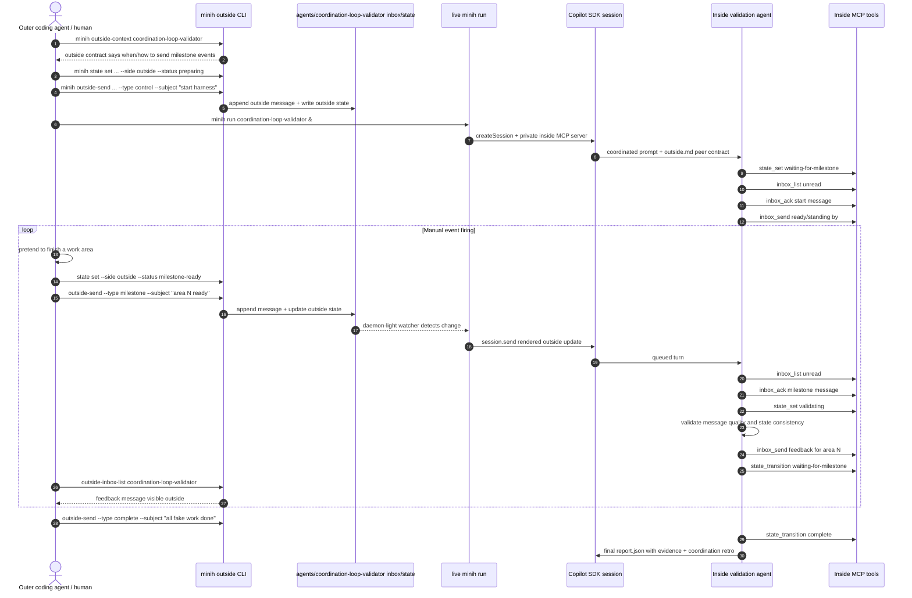

# Workshop: Manual Event Validation Agent Harness

**Type**: Dogfooding Harness + Concept Demonstrator + Worked Example
**Plan**: 008-canonical-coordination-loop
**Spec**: [canonical-coordination-loop-spec.md](../canonical-coordination-loop-spec.md)
**Created**: 2026-04-27T10:18:55+10:00
**Status**: Draft

**Related Documents**:
- [007 user journey: coder and reviewer](../../007-backgrounding/workshops/007-user-journey-coder-and-reviewer.md) - target background-review feel
- [008 inside/outside prompting and retro](../../007-backgrounding/workshops/008-inside-outside-prompting-and-retro.md) - two-sided prompt model
- [006 test fixtures](../../007-backgrounding/workshops/006-test-fixtures.md) - coordination test layers
- [009 MCP server harness standup and probing](../../007-backgrounding/workshops/009-mcp-server-harness-standup-and-probing.md) - MCP harness design, future only
- [AGENTS_README.md#coordination-aware-agents](../../../../AGENTS_README.md#coordination-aware-agents) - authoring guide
- [agents/coordination-smoke-test](../../../../agents/coordination-smoke-test/) - current minimal dogfood example

**Domain Context**:
- **Primary Domain**: `runner` - coordinated prompt assembly, daemon-light forwarders, shared inbox/state, run snapshots
- **Related Domains**: `cli` - outside commands and coordinated scaffolding; `mcp` - inside six-tool surface; `adapter` - event-driven session/send seam
- **Boundary**: This workshop designs an agent/harness pattern. It does not add a new framework-level agent type, public MCP server, daemon, or automatic source-code event emitter.

---

## Purpose

Design a reusable coordinated dogfooding harness and worked example that validates the outside/inside communication loop by simulating manual "events" from the outside peer while an inside minih agent is running in parallel.

The inside agent may be started by the outside agent, started manually by a human, or already running before the outside agent begins. The core concept is concurrent coordination, not a single required startup owner.

The first implementation should prove messaging, state, prompt guidance, and feedback quality end to end. It should not attempt real code review yet.

## Key Questions Addressed

- What does the "inside and outside agents run in parallel, then outside manually fires events as milestones finish" workflow look like with today's primitives?
- Is this a new minih framework feature or just a coordinated agent pattern?
- What should the inside validation agent know about the simulation?
- What should the outside contract tell the host/coding agent to do at each milestone?
- What states and message types make the loop observable without adding real eventing?
- What evidence proves inbox, state, prompt guidance, and feedback quality are working?
- What should be automated now vs deferred until real code-review/eventing tests?

---

## Core Decision

Create a **coordinated dogfooding harness and concept demonstrator** named `coordination-loop-validator`.

It is a normal agent folder:

```text
agents/coordination-loop-validator/
├── prompt.md
├── outside.md
├── instructions.md
├── output-schema.json
├── inside-state.schema.json
└── outside-state.schema.json
```

This is intentionally **not** a new first-class minih "agent type" in code. The reusable concept is the file/prompt/schema pattern plus an e2e harness around it, packaged as a worked example.

Why:

- The coordination feature already supports the needed primitives through normal agent folders.
- Keeping it as a dogfooding harness avoids premature framework API design.
- The pattern can later graduate into templates, examples, or a higher-level command if repeated usage proves the shape.

---

## What We Are Simulating

Future goal:

> Run a code-review agent in parallel with the outer coding agent, code for a while, then have the outer coding agent signal "I just finished area N; review that now." The inside review agent responds while the outer agent continues. The outer agent may start that inside agent itself, or it may coordinate with an already-running inside agent.

Current manual harness:

> Have a validation agent running in parallel. The outer agent pretends to do work, sends `outside-send` messages for fake milestones, updates outside state, reads replies, and verifies the inside agent responds with useful feedback.

The inside agent is told the truth: it is a validation agent participating in a harness. We do not hide the simulation. The goal is to validate the coordination loop, not evaluate whether a reviewer can infer real code quality.

---

## Mental Model



Important: the outer side is manually firing events using `outside-send` and `state set`. There is no file-change event source yet.

---

## Agent Contract

### Inside role (`prompt.md`)

The inside agent is a **coordination loop validator**.

It should:

1. Announce readiness through `state_set` and `inbox_send`.
2. Watch for milestone messages from the outside peer.
3. Acknowledge every outside message it acts on.
4. Validate that outside state and message content are coherent.
5. Send actionable feedback for each milestone.
6. Transition to `complete` only after the outside sends a final completion message or after a bounded timeout.
7. Write a structured JSON report with message/state evidence.

It should not:

- Pretend to be an unbiased code reviewer.
- Hide that it is a validation harness.
- Attempt deep code review findings.
- Run nested `minih run`.
- Wait forever.

### Outside role (`outside.md`)

The outside contract teaches the host/coding agent to:

1. Read the contract before starting work:

   ```bash
   minih outside-context coordination-loop-validator
   ```

2. Ensure the inside agent is running before simulated work begins. One valid path is to start it:

   ```bash
   minih run coordination-loop-validator
   ```

   In a manual session, run it in a second terminal or background shell so the outer agent can continue firing messages. If the inside agent is already running, skip startup and proceed to the control/milestone messages.

3. For each fake work area, send a milestone event:

   ```bash
   minih state set coordination-loop-validator \
     --side outside \
     --status milestone-ready \
     --data-json '{"milestone":"area-1","summary":"Pretended to update the parser"}'

   minih outside-send coordination-loop-validator \
     --type milestone \
     --subject "area-1 ready for validation" \
     --body "Pretend work area 1 is complete. Validate that this message/state handoff is coherent and tell me what feedback you would give."
   ```

4. Read replies:

   ```bash
   minih outside-inbox-list coordination-loop-validator
   minih state get coordination-loop-validator
   ```

5. Finish the harness:

   ```bash
   minih state set coordination-loop-validator \
     --side outside \
     --status complete \
     --data-json '{"milestones":["area-1","area-2","area-3"]}'

   minih outside-send coordination-loop-validator \
     --type complete \
     --subject "manual validation complete" \
     --body "All fake work areas have been sent. Produce the final coordination validation report."
   ```

---

## File Templates

### prompt.md sketch

```markdown
---
description: "Validate manual outside-to-inside coordination messages and state handoffs"
tags: [coordination, validation, harness]
coordination: enabled
timeout: 900
---

# Coordination Loop Validator

## Objective

You are validating the minih outside/inside communication loop. This is an honest harness: the outside peer is pretending to do work and manually firing milestone events. Do not hide or role-play around that fact.

## Required behavior

1. On startup, set inside state to `waiting-for-milestone` and send an inbox message saying you are ready.
2. Repeatedly inspect unread outside messages and both side states.
3. For every outside message:
   - acknowledge it with `inbox_ack`
   - validate message type, subject/body clarity, and state coherence
   - send feedback with `inbox_send`
   - update inside state with `state_set` or `state_transition`
4. Stop only when the outside sends `type: complete`, outside state is `complete`, or the bounded wait budget expires.
5. Write a JSON report to `$MINIH_OUTPUT_PATH` and run `minih check`.

## Validation criteria

For each milestone, check:

- Did an outside message arrive?
- Was outside state updated near the same time?
- Did the message contain enough context for a future code-review agent to act?
- Did you acknowledge the message?
- Did you send feedback that the outside peer can read?
- Did inside state reflect your current activity?

## Output

Write a structured report with milestone evidence, state transitions, inbox acknowledgements, feedback quality, and `retrospective.magicWandTarget: "coordination"` when appropriate.
```

### outside.md sketch

```markdown
# Coordination Loop Validator - outside contract

This agent validates that outside-to-inside coordination works. It is not a real code reviewer yet.

## Before starting

Read this contract with:

`minih outside-context coordination-loop-validator`

Ensure an inside agent is running. If you need to start one, run it in another terminal or as a background process:

`minih run coordination-loop-validator`

## When to send messages

Every time you finish a fake work area, manually fire an event:

1. Update outside state to `milestone-ready`.
2. Send `outside-send --type milestone`.
3. Read replies with `outside-inbox-list`.

## Message quality rule

Each milestone message should include:

- milestone id
- what changed, even if simulated
- what kind of feedback is requested
- whether the inside agent should wait for more work or prepare to finish

## Finish

Set outside state to `complete` and send `--type complete` when all fake work areas are done.
```

---

## State Model

State remains data, not a minih rule engine. These schemas make the harness observable and give the inside MCP `state_transition` tool concrete enums to validate.

### Outside statuses

| Status | Meaning | Set By |
|--------|---------|--------|
| `idle` | No harness run is active | Default/lazy state |
| `preparing` | Outside peer is preparing coordination and may start the inside validator | Outside |
| `coding` | Outside peer is pretending to work | Outside |
| `milestone-ready` | A fake area is ready for validation | Outside |
| `reviewing-feedback` | Outside peer is reading inside feedback | Outside |
| `complete` | All fake milestones are sent | Outside |
| `blocked` | Outside peer cannot continue | Outside |

### Inside statuses

| Status | Meaning | Set By |
|--------|---------|--------|
| `booting` | Inside validator is starting | Inside |
| `waiting-for-milestone` | Ready and waiting for outside messages | Inside |
| `validating-message` | Processing an outside milestone | Inside |
| `feedback-sent` | Feedback was sent for the latest milestone | Inside |
| `complete` | Final report can be produced | Inside |
| `blocked` | Inside validator cannot continue | Inside |

### inside-state.schema.json sketch

```json
{
  "$schema": "https://json-schema.org/draft/2020-12/schema",
  "title": "Coordination Loop Validator Inside State",
  "type": "object",
  "required": ["status", "data", "updatedAt", "updatedBy"],
  "additionalProperties": false,
  "properties": {
    "status": {
      "type": "string",
      "enum": [
        "booting",
        "waiting-for-milestone",
        "validating-message",
        "feedback-sent",
        "complete",
        "blocked"
      ]
    },
    "data": {
      "type": "object",
      "additionalProperties": true
    },
    "updatedAt": {
      "type": "string",
      "format": "date-time"
    },
    "updatedBy": {
      "const": "inside"
    }
  }
}
```

### outside-state.schema.json sketch

```json
{
  "$schema": "https://json-schema.org/draft/2020-12/schema",
  "title": "Coordination Loop Validator Outside State",
  "type": "object",
  "required": ["status", "data", "updatedAt", "updatedBy"],
  "additionalProperties": false,
  "properties": {
    "status": {
      "type": "string",
      "enum": [
        "idle",
        "preparing",
        "coding",
        "milestone-ready",
        "reviewing-feedback",
        "complete",
        "blocked"
      ]
    },
    "data": {
      "type": "object",
      "additionalProperties": true
    },
    "updatedAt": {
      "type": "string",
      "format": "date-time"
    },
    "updatedBy": {
      "const": "outside"
    }
  }
}
```

---

## Manual Event Protocol

Use message `type` values as the manual event taxonomy.

| Type | Sender | Required? | Purpose |
|------|--------|-----------|---------|
| `control` | outside | optional | Start/reset/diagnostic instruction |
| `milestone` | outside | yes | Fake work area ready for validation |
| `clarification` | inside/outside | optional | Ask/answer a question about the milestone |
| `feedback` | inside | yes | Inside response to a milestone |
| `ack` | either | optional | Explicit acknowledgement message |
| `complete` | outside | yes | Outside says the manual event stream is done |

Message bodies are free-form markdown. The harness should recommend a stable body shape:

```markdown
milestone: area-2
simulatedChange: "Pretended to update runner prompt docs"
request: "Validate that the handoff contains enough context"
expectation: "Send feedback and return to waiting-for-milestone"
```

Why not JSON-only bodies now:

- `outside-send` currently accepts string bodies and arbitrary `type`.
- Free-form markdown is closer to how a future outer coding agent will actually talk.
- The inside validator can grade message quality rather than only parse strict fields.

Future tests can add a stricter `--body-json` flow if this pattern repeats.

### Multi-inside-agent boundary

A future outside agent may coordinate with many inside agents in parallel, including agents of different types. That is a real product direction, but it is out of scope for this worked example. This harness demonstrates one outside peer coordinating with one inside validator so the core message/state/report loop is easy to see.

---

## Harness Runbook

### Terminal A - run or observe the inside validator

```bash
export GH_TOKEN=$(gh auth token)
npm run build
node dist/cli/index.js run coordination-loop-validator
```

For a manual smoke run, keep this terminal visible. The inside agent should announce readiness and stay alive with a bounded wait loop.

### Terminal B - act as the outer agent

```bash
# 1. Learn the outside contract
node dist/cli/index.js outside-context coordination-loop-validator

# 2. Seed outside state
node dist/cli/index.js state set coordination-loop-validator \
  --side outside \
  --status preparing \
  --data-json '{"scenario":"manual event validation"}'

# 3. Tell the inside agent the harness is starting
node dist/cli/index.js outside-send coordination-loop-validator \
  --type control \
  --subject "start manual validation" \
  --body "I will send three fake milestones. Please validate messaging, state, and feedback quality."

# 4. Pretend to finish area 1
node dist/cli/index.js state set coordination-loop-validator \
  --side outside \
  --status milestone-ready \
  --data-json '{"milestone":"area-1","simulatedChange":"updated parser docs"}'

node dist/cli/index.js outside-send coordination-loop-validator \
  --type milestone \
  --subject "area-1 ready" \
  --body "milestone: area-1
simulatedChange: updated parser docs
request: validate this handoff and send feedback"

# 5. Read inside feedback
node dist/cli/index.js outside-inbox-list coordination-loop-validator
node dist/cli/index.js state get coordination-loop-validator

# 6. Repeat for area-2 / area-3, then complete
node dist/cli/index.js state set coordination-loop-validator \
  --side outside \
  --status complete \
  --data-json '{"milestones":["area-1","area-2","area-3"]}'

node dist/cli/index.js outside-send coordination-loop-validator \
  --type complete \
  --subject "manual validation complete" \
  --body "All fake milestones were sent. Produce the final report."
```

### Expected final evidence

```bash
node dist/cli/index.js outside-inbox-list coordination-loop-validator
node dist/cli/index.js state get coordination-loop-validator
node dist/cli/index.js last-run coordination-loop-validator
node dist/cli/index.js validate coordination-loop-validator
node dist/cli/index.js retros --agent coordination-loop-validator
```

The run should show:

- Outside milestone messages were appended.
- Inside acknowledged or responded to every milestone.
- Inside state moved through waiting/validating/feedback-sent/complete.
- Outside could read inside feedback without opening run internals.
- Final `report.json` names every milestone and includes coordination retrospective feedback.

---

## Output Schema Shape

The report should verify communication, not code correctness.

```json
{
  "summary": "Validated three manual outside-to-inside milestone handoffs...",
  "verdict": "pass",
  "milestones": [
    {
      "id": "area-1",
      "outsideMessageId": "01K...",
      "outsideStatusObserved": "milestone-ready",
      "acknowledged": true,
      "feedbackSent": true,
      "feedbackMessageId": "01K...",
      "quality": "good",
      "notes": ["Message had a clear milestone id and request."]
    }
  ],
  "stateChecks": {
    "outsideFinalStatus": "complete",
    "insideFinalStatus": "complete",
    "historyEntriesObserved": 6
  },
  "promptChecks": {
    "outsideContractWasActionable": true,
    "insidePromptExplainedSimulation": true,
    "missingGuidance": []
  },
  "retrospective": {
    "workedWell": "Outside messages arrived while the run was alive and feedback was visible through outside-inbox-list.",
    "confusing": "The outside peer had to remember both state set and outside-send.",
    "magicWand": "Provide a helper command that sends a milestone message and state update together.",
    "magicWandTarget": "coordination",
    "coordination": {
      "unresolvedRequests": [],
      "statePublished": true,
      "peerUpdatesSent": 3
    }
  }
}
```

Suggested `verdict` enum:

| Verdict | Meaning |
|---------|---------|
| `pass` | All expected milestones were seen, acknowledged, answered, and reflected in state |
| `partial` | Messaging worked but some quality/state/report checks were missing |
| `fail` | Core message delivery, MCP usage, or final report validation failed |

---

## Prompt Quality Checks

The harness should validate the prompts as part of the game.

### Outside prompt checks

The outside contract is good if the outer agent can answer:

1. How do I ensure the inside agent is running?
2. When should I send a message?
3. What exact command do I run?
4. What status should I set?
5. How do I read feedback?
6. How do I end the run?

### Inside prompt checks

The inside prompt is good if the agent can answer:

1. Am I a real code-review agent or a validation harness?
2. What is my peer?
3. Which tools should I use?
4. How do I acknowledge outside messages?
5. How do I publish state?
6. When am I allowed to finish?
7. What evidence belongs in my final report?

This is why the simulation should be explicit. Hidden evaluation would test the model's ability to infer the game, not minih's coordination surface.

---

## Bounded Waiting Strategy

The hardest part is keeping the inside run alive long enough to receive manual events without turning minih into a daemon.

Recommended v1 behavior:

1. The inside agent starts and announces readiness.
2. It checks unread inbox and both states.
3. If no work is available, it waits briefly and checks again.
4. It repeats until:
   - outside sends `type: complete`, or
   - outside state becomes `complete`, or
   - a max idle budget is reached.

Suggested prompt language:

```markdown
If no milestone is available, wait briefly and re-check. Keep this bounded:
- target poll interval: about 5 seconds
- max idle polls before final report: 24
- if you time out, set inside state to `blocked` and explain which outside signal was missing
```

This uses the agent's existing tool environment for waiting. It is not a runner-level daemon and it should not be considered a reliable event loop. The future eventing plan can replace this with real event sources.

---

## Validation Layers

### Layer 0 - static prompt/contract validation

Fast and deterministic:

```bash
npm run build
node dist/cli/index.js doctor
node dist/cli/index.js outside-context coordination-loop-validator
node dist/cli/index.js run coordination-loop-validator --dry-run
```

Checks:

- `doctor` accepts the coordinated agent.
- `outside-context` includes actionable outside commands.
- `run --dry-run` includes coordination identity/tools/peer-contract/checklist sections.

### Layer 1 - outside CLI file validation

No live LLM required:

```bash
node dist/cli/index.js outside-send coordination-loop-validator \
  --type milestone \
  --subject "area-1 ready" \
  --body "manual test"

node dist/cli/index.js state set coordination-loop-validator \
  --side outside \
  --status milestone-ready \
  --data-json '{"milestone":"area-1"}'

node dist/cli/index.js outside-inbox-list coordination-loop-validator
node dist/cli/index.js state get coordination-loop-validator
```

Checks:

- Outside message is written to the expected lane.
- Outside state validates against per-agent schema.
- Read commands expose state/messages through JSON envelopes.

### Layer 2 - live manual event run

Requires a real minih run:

```bash
node dist/cli/index.js run coordination-loop-validator
```

In another shell, fire `control`, `milestone`, and `complete` messages.

Checks:

- Daemon-light forwarders deliver outside messages while the run is alive.
- Inside MCP tools can read, ack, send, and transition.
- Outside can read inside feedback.

### Layer 3 - future automated e2e

Future test file:

```bash
MINIH_E2E=1 npx vitest run test/e2e/coordination-loop-validator.test.ts
```

The automated e2e should:

1. Build the CLI.
2. Run the agent in a subprocess.
3. Wait until inside sends "ready".
4. Fire three milestone messages.
5. Assert feedback appears for each milestone.
6. Send complete.
7. Assert final report validates.

This test can start as opt-in because it depends on a live model/session and timing. A later fake-adapter version can become deterministic.

---

## Failure Modes

| Failure | Symptom | Likely Cause | Recovery / Test |
|---------|---------|--------------|-----------------|
| Inside exits before milestones | `minih run` completes before outside sends work | Prompt did not keep bounded wait loop alive | Strengthen prompt; assert ready message before firing milestones |
| Outside sends message but no inside feedback | `outside-inbox-list` empty | Run not alive, watcher missed, or inside did not inspect/ack | Check `status`, `tail`, `state get`, and run events |
| Outside state rejects status | CLI envelope error | Status not in `outside-state.schema.json` enum | Keep contract examples in sync with schema |
| Inside cannot transition state | MCP tool error | Status not in `inside-state.schema.json` enum | Keep prompt examples in sync with schema |
| Duplicate feedback | Multiple polls process same message | Missing `inbox_ack` or unread filter misuse | Require ack per message and include message ids in report |
| Feedback is too generic | Messages arrive but are not useful | Prompt lacks quality criteria | Add milestone grading rubric |
| Final report is degraded | `validate` reports schema failure | Output schema too strict or prompt omitted required fields | Keep output-schema examples in prompt |
| Outer agent forgets to send messages | No outside lane updates | Outside contract not actionable enough | Put explicit "when you finish an area, run this command" block in `outside.md` |

---

## Acceptance Criteria for the First Implementation

- `agents/coordination-loop-validator/` exists with `coordination: enabled`.
- `outside.md` tells the outer agent exactly when and how to fire manual milestone events.
- `inside-state.schema.json` and `outside-state.schema.json` constrain the harness statuses.
- `output-schema.json` validates milestone evidence, state checks, prompt checks, verdict, and retrospective.
- `doctor` passes for the agent.
- `outside-context coordination-loop-validator` is enough for an outer coding agent to drive the harness.
- A manual run can receive at least two milestone messages while alive.
- The inside agent acknowledges each milestone and sends visible feedback.
- `state get` shows coherent outside/inside statuses.
- The final report includes `retrospective.magicWandTarget: "coordination"` and actionable coordination feedback.

---

## Open Questions

### Q1: Should this be a first-class agent type in minih?

**RESOLVED: No, not yet.** Build it as a normal coordinated dogfood agent. If multiple projects reuse the same shape, we can later add a template or `minih init --template coordination-loop-validator`.

### Q2: Should the inside agent believe it is doing real code review?

**RESOLVED: No.** The inside agent should know it is validating coordination. Hidden evaluation is deferred until we build real code-review agents and want to test behavioral realism.

### Q3: Should manual events be separate `state set` and `outside-send` calls?

**RESOLVED for v1: Yes.** That exercises both primitives independently and exposes whether the outside contract is clear enough. A future helper command could combine them.

### Q4: Should the live run wait indefinitely?

**RESOLVED: No.** Use a bounded wait loop in the prompt. If no milestone arrives, the agent should report a coordination blocker rather than hang forever.

### Q5: Do we need a real code diff payload?

**RESOLVED: No for this harness.** Use simulated work descriptions. Real diff/code-review payloads belong to a later code-review agent workshop/test.

---

## Quick Reference

```bash
# Static checks
npm run build
node dist/cli/index.js doctor
node dist/cli/index.js outside-context coordination-loop-validator
node dist/cli/index.js run coordination-loop-validator --dry-run

# Start inside validator
node dist/cli/index.js run coordination-loop-validator

# Fire a fake milestone from outside
node dist/cli/index.js state set coordination-loop-validator \
  --side outside \
  --status milestone-ready \
  --data-json '{"milestone":"area-1","simulatedChange":"updated docs"}'

node dist/cli/index.js outside-send coordination-loop-validator \
  --type milestone \
  --subject "area-1 ready" \
  --body "milestone: area-1
simulatedChange: updated docs
request: validate this handoff and send feedback"

# Observe feedback
node dist/cli/index.js outside-inbox-list coordination-loop-validator
node dist/cli/index.js state get coordination-loop-validator

# Finish
node dist/cli/index.js state set coordination-loop-validator \
  --side outside \
  --status complete \
  --data-json '{"milestones":["area-1"]}'

node dist/cli/index.js outside-send coordination-loop-validator \
  --type complete \
  --subject "manual validation complete" \
  --body "Produce the final coordination validation report."
```

---

## Implementation Notes for the Next Plan

Likely phase shape:

1. Add `agents/coordination-loop-validator/` with prompt, outside contract, schemas, and output schema.
2. Add or extend docs to reference it beside `coordination-smoke-test`.
3. Add static tests for `doctor`, `outside-context`, and `run --dry-run` prompt content.
4. Add an opt-in e2e harness that launches the agent, fires manual milestones, and validates outside-visible feedback.
5. Use findings to improve outside/inside prompt wording before building real background code-review agents.

Do not implement a public MCP probe harness or real source-code eventing as part of this agent. Those remain separate follow-ups.
